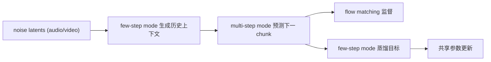
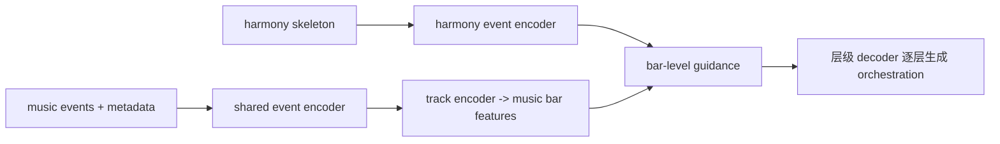
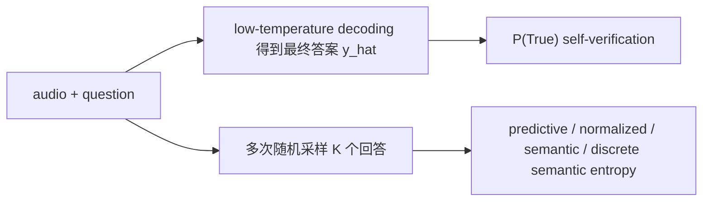
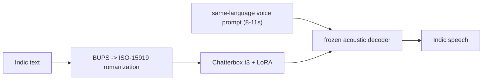

# 语音 / 音频 / 音乐论文速递
## 2026-04-29

> 实际对应 arXiv 更新日：**2026-04-28**  
> 检索范围：`cs.SD + eess.AS`，补看 1 篇强相关 `cs.CV` 音视频生成稿  
> 只放按 ML 顶会审稿口径看，最值得多数读者花时间看的 **5 篇**

## 📋 总览

- 共收录 **5 篇** 相关论文
- 语音大模型 / 可靠性：**1 篇**
- 多语种 TTS / Indic 方向：**2 篇**
- 音视频生成：**1 篇**
- 音乐生成：**1 篇**

今天真正值得看的主线有三条。第一，`Mutual Forcing` 在认真解决 streaming 音视频生成里最讨厌的三个问题：速度、长时稳定性、音画同步。第二，Indic TTS 这批稿子比很多“多语种大模型”口号文更实用，一篇补低成本迁移，一篇补口音评测口径。第三，`Walking Through Uncertainty` 虽然不花哨，但把 ALLM 里一个经常被糊弄的问题讲清楚了：文本 LLM 里的 uncertainty trick，搬到音频侧并不会自动成立。

## 精选入选规则

- **新意（0-3）**：有没有新方法、新任务设定或明确新范式
- **影响力（0-3）**：是不是主线问题，不是特别窄的小点
- **证据强度（0-2）**：实验、对比、消融、结论是否站得住
- **受众匹配度（0-2）**：是否贴近语音大模型、语音识别、TTS、音乐生成、音频系统

分数校准：

- **6**：可读，但偏 incremental
- **7**：接近 strong accept，不是随手送分
- **8+**：当天明显强稿才配拿

## 总览表

| 方向 | 序号 | 论文 | 评分 | 关键词 |
|---|---:|---|---:|---|
| 音视频生成 | 1 | Mutual Forcing | 8/10 | streaming A/V generation, self-distillation, 4-8 NFE |
| 音乐生成 | 2 | SymphonyGen | 8/10 | orchestral generation, harmony skeleton, 3D hierarchy |
| 语音大模型可靠性 | 3 | Walking Through Uncertainty | 7.5/10 | ALLM, semantic entropy, P(True), calibration |
| TTS 评测 | 4 | PSP | 7.5/10 | accent benchmark, Indic TTS, FAD, PSD |
| 多语种 TTS 迁移 | 5 | Praxy Voice | 7.5/10 | BUPS, LoRA, Indic TTS, low-cost adaptation |

## 🎬 音视频生成

### [1] Mutual Forcing: Dual-Mode Self-Evolution for Fast Autoregressive Audio-Video Character Generation

- **评分**：8/10
- **作者/机构**：Yupeng Zhou, Lianghua Huang, Zhifan Wu, Jiabao Wang, Yupeng Shi, Biao Jiang, Daquan Zhou, Yu Liu, Ming-Ming Cheng, Qibin Hou；南开大学 VCIP、阿里通义实验室、北京大学
- **论文链接**：http://arxiv.org/abs/2604.25819v1
- **PDF**：https://arxiv.org/pdf/2604.25819v1.pdf
- **代码链接**：暂无
- **Demo 链接**：https://mutualforcing.github.io

#### 📌 简介
这篇做的是流式音视频角色生成，核心不是“再做一个联合生成模型”，而是把 **低延迟、长时稳定、音画同步** 三件事一起解决。作者提出 `Mutual Forcing`，用一个参数共享的双模式扩散框架，把 few-step 采样和 multi-step 自蒸馏绑在一套因果模型里。

#### ☠️ 毒舌点评
这篇不是标题党，确实在碰 streaming 生成里的硬骨头。它最值钱的地方不是“联合建模”四个字，而是直接绕开了很多老方案那种“先训双向教师，再蒸馏成流式学生”的又重又慢路线。缺点是系统味很重，学术上没有那种一眼惊艳的新数学，但工程硬度够。

#### 🔧 技术方案
- **模型解决的问题**：老的 joint A/V 生成方案要么质量可以但慢得离谱，要么能流式但长时会漂。尤其 few-step 加速和因果流式这两件事叠起来后，很容易一边快了，一边崩了。
- **模型架构**：
  - **输入**：噪声初始化的音频 latent、视频 latent，加上控制条件 `c`，条件里可以是文本、图像、音/视频参考，还额外用了 streaming caption 和 streaming ASR control。
  - **输出**：下一时刻 chunk 的音频 latent 和视频 latent，逐 chunk 自回归生成。
  - **主干**：基于 flow matching 的因果式音视频联合扩散生成器；音频、视频各有模态专属 VAE 和分支，但在 self-attention 层耦合。
  - **关键模块**：`MULTI-step mode`、`FEW-step mode`、参数共享、自蒸馏、train-infer consistency。
  - **信号流**：



- **关键设计 / 核心创新**：不是用外部双向教师来教一个流式学生，而是让 `few-step mode` 和 `multi-step mode` 在同一模型里互相促进。few-step 模式负责在训练时制造“像推理时那样脏的历史”，multi-step 模式则反过来给 few-step 模式提供蒸馏信号。
- **训练 / 推理策略**：
  - **训练目标**：两部分，`flow-matching regression loss` + hybrid self-distillation（ShortCut + DMD）。
  - **训练阶段**：先做单模态 causal pretrain，再在 paired audio-video 数据上联合训练。
  - **推理方式**：因果 streaming chunk-by-chunk 生成，few-step 采样支持 4 或 8 NFE。
  - **推理性能**：论文明确给了速度。单卡 1 GPU 下，`192×336` 达到 **30 FPS**，`480×768` 达到 **12 FPS**，`704×1280` 也有 **3.5 FPS**；而 `Universe-1` 和 `OVI` 分别要 4/8 张 GPU，速度只有 **0.6 / 1.3 FPS**。

#### 📊 实验结果
- **主要 baseline**：Fantasy-Talking、Omni-Avatar、Wan-S2v、Universe-1、OVI，以及作者自己实现的 `DMD w/ teacher forcing`、`ShortCut w/ teacher forcing`、`DMD w/ self-forcing`。
- **核心结论 1**：在 joint A/V 生成主表上，作者声称 `Mutual Forcing` 用 **4-8 NFE** 就能匹配或超过很多要 **~50 steps** 的强 baseline。
- **核心结论 2**：长视频测试里，基于 conventional distillation 的 baseline 会随着时间窗口明显退化，`Mutual Forcing` 在 `0-5s / 5-15s / 15-25s` 三段上更稳。
- **核心结论 3**：人评对比 `OVI` 和 `Universe-1` 时，视觉偏好、音频对齐、整体质量三项都赢，尤其打 `Universe-1` 优势很大。

#### 💡 为什么值得看
如果你关心 streaming 多模态生成，这篇比很多“我也做了个联合扩散模型”的稿子更值钱，因为它真把 **速度、长时稳定、在线推理** 放在同一个目标里做了。

## 🎼 音乐生成

### [2] SymphonyGen: 3D Hierarchical Orchestral Generation with Controllable Harmony Skeleton

- **评分**：8/10
- **作者/机构**：Xuzheng He, Nan Nan, Zhilin Wang, Ziyue Kang, Zhuoru Mo, Ao Li, Yu Pan, Xiaobing Li, Feng Yu, Xiaohong Guan；中央音乐学院、西安交通大学、中国科学技术大学、深圳大学
- **论文链接**：http://arxiv.org/abs/2604.25498v1
- **PDF**：https://arxiv.org/pdf/2604.25498v1.pdf
- **代码链接**：暂无
- **Demo 链接**：https://symphonygen.github.io/

#### 📌 简介
这篇想解决交响乐生成里一个老问题：**高层结构控制和低层多轨编配细节很难同时抓住**。作者提出 `SymphonyGen`，把和声骨架 `harmony skeleton` 当成中间控制层，再用 3D 分层 Transformer 去做从结构到编配的逐层展开。

#### ☠️ 毒舌点评
这篇比很多 MIDI 接龙文强，因为它不是简单把 token 序列拉长，而是认真模仿专业编曲流程。它的核心还是 hierarchical 这条老路，但做得比很多换皮稿扎实，尤其是把 orchestration control 真做进去了。

#### 🔧 技术方案
- **模型解决的问题**：现有符号音乐模型常见的毛病是 flatten 后又长又乱，能续写但不太能控；一加控制条件就容易丢掉多轨协同。
- **模型架构**：
  - **输入**：和声骨架、音乐事件 token、元数据 embedding（bar length、track ID、instrument ID）。
  - **输出**：多轨交响乐 symbolic score。
  - **主干**：33 层、512 hidden、**124M 参数** 的 3D hierarchical Transformer；按 `Bar / Track / Event` 三层拆解，不走 1D flatten。
  - **关键模块**：harmony event encoder、music event encoder、track encoder、bar-level 表征、two-stream cross-attention。
  - **信号流**：



- **关键设计 / 核心创新**：
  - 用显式 `harmony skeleton` 承担全局规划，降低长程一致性压力。
  - 3D 结构按 `bars / tracks / events` 分开建模，复杂度比 1D token flatten 更合理，推理显存峰值也更低。
  - 加了 RL/GRPO 对齐阶段，让输出更贴近现代影视管弦配器审美。
- **训练 / 推理策略**：
  - **训练目标**：预训练总损失 `L = 0.05 Lmeta + 0.5 Lharm + Lmusic`。
  - **训练阶段**：先预训练，再用 GRPO 做偏好/奖励对齐。
  - **训练资源**：预训练用 **4 张 NVIDIA H800，1 天**；GRPO 在 **单卡 GPU** 上跑数小时直到 reward 收敛。
  - **推理方式**：先用一个 **12-layer, 87M** 的独立 1D decoder 生成 skeleton，再采样 orchestration；采样参数 `top-p=0.99`、`temperature=1.0`、`(λhn, λnn)=(1,10)`。

#### 📊 实验结果
- **主要 baseline**：SymphonyNet（42M）、NotaGen / NotaGen-X（516M）、METEOR（67M）。
- **客观结果**：Table 2 里，RL 阶段把 **CLaMP** 从基线水平明显拉高到 **0.726**，同时把不和谐指标继续压低；作者把 `(1,10)` 视为质量和机械感之间的 sweet spot。
- **主观结果**：32 位参与者、235 次评测的 composition 测试里，作者在 `Quality / Coherence / Preference` 上整体领先；arrangement 测试里也全面压过 baseline，尤其 `Overall Quality` 和 `Orchestral Richness`。
- **限制**：作者自己也承认，富配器时可能会出现 “too full” 的问题，说明它不是完全自然，只是比 baseline 更像回事。

#### 💡 为什么值得看
如果你做音乐生成，这篇的价值不在“又一个 Transformer”，而在它把 **和声骨架控制 + 多轨分层建模 + RL 对齐** 拼成了一套比较完整的 orchestral 生成流程。

## 🤖 语音大模型 / 可靠性

### [3] Walking Through Uncertainty: An Empirical Study of Uncertainty Estimation for Audio-Aware Large Language Models

- **评分**：7.5/10
- **作者/机构**：Chun-Yi Kuan, Wei-Ping Huang, Hung-yi Lee；台湾大学通信工程研究所、AI-CoRE
- **论文链接**：http://arxiv.org/abs/2604.25591v1
- **PDF**：https://arxiv.org/pdf/2604.25591v1.pdf
- **代码链接**：暂无
- **Demo 链接**：暂无

#### 📌 简介
这篇不是发明新 ALLM，而是系统比较 **ALLM 的 uncertainty estimation**。核心问题很直接：文本 LLM 里那套 predictive entropy、semantic entropy、P(True) 到了音频条件生成后，还能不能拿来就用。

#### ☠️ 毒舌点评
这篇属于“不会很火，但该有人认真做”的论文。它没搞新 backbone，也没刷一个爽榜单，但把一个很真实的坑挑明了：音频侧的错，不只是 reasoning 错，还有 perception 错，所以 token-level 置信度经常不够用。

#### 🔧 技术方案
- **模型解决的问题**：以前很多人默认文本 LLM 的不确定性估计经验可以平移到 ALLM，但音频输入里有感知歧义、跨模态 grounding、语言先验干扰，这个假设并不稳。
- **模型架构**：
  - **输入**：`audio clip + instruction/question`
  - **输出**：文本答案 `y`
  - **主干**：不是新模型，而是在现有 ALLM 上做 uncertainty benchmark。论文明确评了 `Qwen2.5-Omni-7B`、`Qwen2.5-Omni-3B`、`Audio Flamingo 3`。
  - **关键模块**：两阶段 protocol，把最终回答和不确定性估计解耦。
  - **信号流**：



- **关键设计 / 核心创新**：它不是造新指标，而是第一次系统比较五类方法：`predictive entropy`、`length-normalized entropy`、`semantic entropy`、`discrete semantic entropy`、`P(True)`。
- **训练 / 推理策略**：
  - **训练**：不训练新 ALLM，重点是评测协议。
  - **推理**：先用低温解码拿最终答案，再用多样本采样估 uncertainty；`P(True)` 则直接让模型验证自己的答案。
  - **推理性能**：论文重点不在 latency / RTF，**文中未明确给出**。

#### 📊 实验结果
- **主要 benchmark**：MMAU、MMAR、MMSU、SAKURA、AQUA-Bench、Audio-Hallucination。
- **主要 baseline**：token-level 的 `predictive entropy`、`normalized entropy`。
- **硬结论 1**：在 general audio understanding / reasoning 上，`semantic entropy`、`discrete semantic entropy`、`P(True)` 通常明显强于 token-level 方法。
- **硬结论 2**：例如在 `MMAU` 上，表中可见最好 AUROC 大多落在 semantic 系或 `P(True)` 上；token-level 往往垫底。
- **硬结论 3**：到了 `AQUA-Bench`、`Audio-Hallucination` 这类 trustworthiness benchmark，最佳方法开始因模型而异，比如 `Qwen2.5-Omni-7B` 上 `P(True)` 更强，`Qwen2.5-Omni-3B` 上 normalized entropy 反而能赢一部分设置。

#### 💡 为什么值得看
如果你做语音大模型、语音识别后验校准、幻觉检测，这篇很值得读，因为它给你的不是“某个神奇指标”，而是一个现实判断：**ALLM 的 uncertainty 结论高度依赖模型和任务，不要照搬文本 LLM 经验。**

## 🗣️ TTS 评测 / 多语种 TTS

### [4] PSP: An Interpretable Per-Dimension Accent Benchmark for Indic Text-to-Speech

- **评分**：7.5/10
- **作者/机构**：Venkata Pushpak Teja Menta；Praxel Ventures
- **论文链接**：http://arxiv.org/abs/2604.25476v1
- **PDF**：https://arxiv.org/pdf/2604.25476v1.pdf
- **代码链接**：**已开源** https://github.com/praxelhq/psp-eval
- **Demo 链接**：https://huggingface.co/datasets/Praxel/psp-native-centroids

#### 📌 简介
这篇不是新 TTS 模型，而是一个 **Indic TTS 口音评测 benchmark**。核心观点很简单：`WER / CER / MOS / UTMOS` 都不错，不等于口音真的 native，尤其在 Indic 语言里，这个误判会很严重。

#### ☠️ 毒舌点评
这类 benchmark 论文最怕空喊“可解释评测”，结果最后还是一个黑盒总分。这篇相对靠谱，因为它真拆成了多个发音/韵律维度，而且能举出“WER 很好但口音仍然烂”的反例。缺点是 v1 还带 pilot 味，尤其 MOS 校准还没补齐。

#### 🔧 技术方案
- **模型解决的问题**：传统 TTS 指标对 accent 太迟钝，容易把“字读对了”误当成“口音像本地人”。
- **模型架构**：
  - **输入**：系统生成音频、native 参考语音。
  - **输出**：六个口音相关维度的分数。
  - **主干**：不是生成模型，而是评测管线。
  - **关键模块**：`RR`（retroflex collapse）、`AF`、`LF`、`ZF`、`FAD`、`PSD`；其中前四项靠 forced alignment + native-centroid probe，后两项是分布距离。
  - **信号流**：

```text
合成语音 -> 对齐/发音探针 -> RR/AF/LF/ZF
合成语音 + native corpus -> embedding/prosody distance -> FAD/PSD
```

- **关键设计 / 核心创新**：把 accent 评测拆成逐维度 phonological decomposition，而不是继续报一个总分糊弄。
- **训练 / 推理策略**：
  - **训练**：这是 benchmark，不是新 TTS 训练。
  - **推理/评测**：利用 Wav2Vec2-XLS-R layer-9 embedding、native centroid、prosody distribution 做维度级测量。
  - **推理性能**：论文重点不在推理时延，**文中未明确给出**。

#### 📊 实验结果
- **主要系统**：ElevenLabs v3、Cartesia Sonic-3、Sarvam Bulbul、Indic Parler-TTS，以及作者自己的 Praxy Voice。
- **核心结论 1**：`WER` 排序和 `FAD/PSD` 排序明显不一致。比如 Hindi 上 `ElevenLabs` 的 WER 最低（**0.006**），但 `FAD` 不是最好；`Sarvam` 的 `FAD` 最好（**211.8**），却不是 WER 第一。
- **核心结论 2**：Telugu 上 `ElevenLabs` 的 `PSD` 到 **154.4**，而 `Sarvam` 只有 **11.1**，直接暴露了 WER 完全抓不到的窄音高范围问题。
- **核心结论 3**：Tamil 上没有系统全维度通杀，`Parler-TTS` 能赢四个维度，但 `Sarvam` 拿 FAD 最好，说明“单一总分”会丢信息。

#### 💡 为什么值得看
如果你做多语种 TTS，这篇最重要的提醒是：**能念对字，不等于口音对；MOS 也不够。** 它很适合作为你以后做 Indic 方向评测的补充尺子。

### [5] Praxy Voice: Voice-Prompt Recovery + BUPS for Commercial-Class Indic TTS from a Frozen Non-Indic Base at Zero Commercial-Training-Data Cost

- **评分**：7.5/10
- **作者/机构**：Venkata Pushpak Teja Menta；Praxel Ventures
- **论文链接**：http://arxiv.org/abs/2604.25441v1
- **PDF**：https://arxiv.org/pdf/2604.25441v1.pdf
- **代码链接**：**已开源** https://github.com/praxelhq/praxy
- **Demo 链接**：https://huggingface.co/Praxel/praxy-voice-r6

#### 📌 简介
这篇想证明一件事：**不用从头训练 Indic-native TTS 大模型，也不用商用闭源 API，只动很小一部分参数，能不能把 frozen 非 Indic 基座拉到商业可用级别。** 方案是 `BUPS + text-head LoRA + inference-time voice-prompt recovery`。

#### ☠️ 毒舌点评
这篇非常工程流，但不是糊弄。它没发明新 TTS 范式，真正值钱的是判断非常准：问题主要卡在 token path，而不是整个 acoustic decoder 都得重训。对想低成本做多语种落地的人，参考价值很高。

#### 🔧 技术方案
- **模型解决的问题**：Chatterbox 这类多语种 base 连 Telugu / Tamil 都不能直接 tokenise，更别说接近商用品质的 Indic TTS 了；从头重训又贵得离谱。
- **模型架构**：
  - **输入**：Indic 文本、同语种 8-11 秒参考声音。
  - **输出**：Telugu / Tamil / Hindi 的 TTS 波形。
  - **主干**：基于 `Chatterbox`（总计 **810M 参数**，含 voice encoder），只在文本 token predictor `t3 transformer` 上挂 LoRA。
  - **关键模块**：`BUPS`（Brahmic Unified Phoneme Space）、`LoRA on text head`、`voice-prompt recovery`、三分支推理路由。
  - **信号流**：



- **关键设计 / 核心创新**：
  - `BUPS` 把 Brahmic script 变成 ISO-15919，让 Chatterbox 现有 Latin token 路径能吃进去。
  - LoRA 只改 text-token predictor，不碰 acoustic decoder。
  - 推理时用 same-language voice prompt + `Config B` 采样参数修掉 frozen decoder 的语言先验偏差。
- **训练 / 推理策略**：
  - **训练数据**：约 **1,220h** licensed Indic speech，来自 IndicTTS、Rasa、FLEURS、Shrutilipi。
  - **训练设置**：只训练 **7.86M** 可训练参数（占 **810M** 的 **0.97%**）；`bf16 + AdamW`，`8,000 steps`，单卡 **A100-80GB**，约 **11 小时**。
  - **推理设置**：`Config B = exaggeration 0.7, temperature 0.6, min_p 0.1`；同语种参考音频 8-11 秒。
  - **推理性能**：论文没给 RTF，但明确说如果去 LoRA-adapt acoustic decoder，需要 H100 级资源；当前版本用 voice-prompt recovery 当便宜替代。

#### 📊 实验结果
- **主要 baseline**：ElevenLabs v3、Cartesia Sonic-3、Sarvam Bulbul、Indic Parler-TTS、IndicF5、vanilla Chatterbox。
- **Telugu**：Praxy R6 + Sarvam ref 的 `FAD = 291.3`、`PSD = 13.1`、`LLM-WER = 0.033`、intent `0.90`；相比 `Cartesia` 的 `FAD = 458.1` 明显更接近 native。
- **Tamil**：Praxy 的 `FAD = 276.0`、`PSD = 71.2`、`LLM-WER = 0.041`；在 `zha` 相关维度上也优于几个商业系统。
- **Hindi**：走 vanilla 分支时 `LLM-WER = 0.025`，能和 `Cartesia Sonic-3` 打平；反过来如果硬走 LoRA 分支，作者明确说 Hindi 会退化，说明这个方法的有效范围主要在 Te/Ta 文本路径扩展。
- **Config B 消融**：在 Telugu pilot 上，A/B/C 三组配置里，`B` 最稳，`LLM-WER 0.034`、`FAD 291.3`、`PSD 13.1`，明显优于 A（`0.159 / 534.4 / 14.1`）和 C（`0.061 / 355.0 / 61.7`）。

#### 💡 为什么值得看
这篇最值得看的不是“它赢了谁多少分”，而是它给了一条很现实的工程路线：**先修 token path，再用 voice prompt 把 frozen decoder 拉回正轨。** 对预算有限但要做 Indic TTS 的团队，很有参考价值。

## 最后结论

如果只让我从今天这批稿子里选 3 篇优先读：

1. **Mutual Forcing**
如果你做 streaming 多模态生成，这是今天最硬的一篇，速度、稳定性、因果推理三件事一起碰。

2. **SymphonyGen**
如果你做音乐生成，这篇比单纯 MIDI 接龙文更有内容，尤其是显式结构控制这块。

3. **Praxy Voice**
如果你做多语种 TTS 落地，这篇的工程判断非常值钱，尤其适合算力和预算不宽裕的团队。

补充建议：

- **做语音大模型可靠性 / 幻觉检测**：优先看 `Walking Through Uncertainty`
- **做 Indic TTS 评测体系**：优先看 `PSP`
