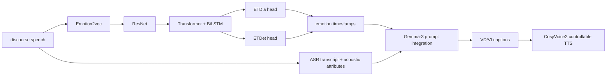
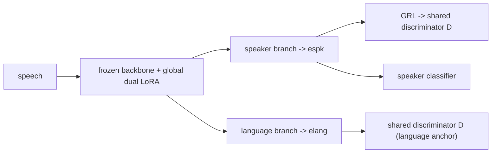
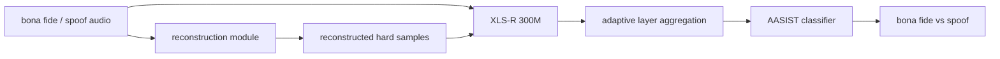

# 语音 / 音频 / 音乐论文速递
## 2026-04-30

> 实际对应 arXiv 更新日：**2026-04-29**  
> 检索范围：`cs.SD + eess.AS`  
> 只放按 ML 顶会审稿口径看，最值得多数读者花时间看的 **5 篇**

## 📋 总览

- 共收录 **5 篇** 相关论文
- 语音情感理解 / 语音描述：**1 篇**
- 说话人验证：**1 篇**
- 音频安全 / deepfake 检测：**1 篇**
- 数据质量 / 语音数据偏差诊断：**1 篇**
- 语音数字生物标志物：**1 篇**

今天真正有信息量的主线主要是三条。第一条是 `EmoTransCap`，它不是在句子级情感 caption 上继续抠小数点，而是把任务直接抬到 discourse-level emotion transition，并顺手补了可控情感 TTS 这条线。第二条是 `Dual-LoRA`，它把 cross-lingual speaker verification 里最烦的 language-speaker entanglement 这个真问题拆得比较清楚，实验也不是糊弄。第三条是 `Diffusion Reconstruction`，它不是单纯换 backbone，而是围绕“如何制造 hard sample 来提升 deepfake 泛化”这个点，把 reconstruction 范式和 loss 设计绑到了一起。

## 精选入选规则

- **新意（0-3）**：有没有新方法、新任务设定或明确新范式
- **影响力（0-3）**：是不是主线问题，不是特别窄的小点
- **证据强度（0-2）**：实验、对比、消融、结论是否站得住
- **受众匹配度（0-2）**：是否贴近语音大模型、语音识别、TTS、音乐生成、音频系统

分数校准：

- **6**：可读，但偏 incremental
- **7**：接近 strong accept，不是随手送分
- **8+**：当天明显强稿才配拿

## 总览表

| 方向 | 序号 | 论文 | 评分 | 关键词 |
|---|---:|---|---:|---|
| 语音情感理解 | 1 | EmoTransCap | 7.5/10 | discourse emotion transition, MTETR, Gemma-3, controllable TTS |
| 说话人验证 | 2 | Dual-LoRA | 8/10 | cross-lingual SV, language-anchored adversary, frozen backbone, 0.91% EER |
| 音频安全 | 3 | Diffusion Reconstruction | 7.5/10 | audio deepfake detection, hard samples, XLS-R + AASIST, RACL |
| 数据质量诊断 | 4 | Spurious Correlation Toolkit | 7/10 | non-speech diagnosis, VAD, MFCC/W2V2, dataset auditing |
| 语音数字生物标志物 | 5 | Recurrence Biomarkers | 6.5/10 | depression detection, COVAREP, recurrence dynamics, AUC 0.689 |

## 🧠 语音情感理解 / 情感语音描述

### [1] EmoTransCap: Dataset and Pipeline for Emotion Transition-Aware Speech Captioning in Discourses

- **评分**：7.5/10
- **作者/机构**：Shuhao Xu, Yifan Hu, Jingjing Wu, Zhihao Du, Zheng Lian, Rui Liu；文中可确认作者，但自动抓机构失败，这里不乱写
- **论文链接**：http://arxiv.org/abs/2604.26417v1
- **PDF**：https://arxiv.org/pdf/2604.26417v1.pdf
- **代码链接**：暂无
- **Demo 链接**：https://huggingface.co/huggingface

#### 📌 简介
这篇解决的是一个以前很多人默认跳过的问题：现有 speech emotion captioning 大多只会描述单句、单时刻情绪，不会描述一整段语音里情绪是怎么变的。作者提出 `EmoTransCap`，核心包括一个 bilingual discourse-level emotion transition 数据集 `EmoTransSpeech`，一个多任务情绪转移识别模块 `MTETR`，以及基于 Gemma-3 的情感转移描述生成和可控情感 TTS 流程。

#### ☠️ 毒舌点评
这篇的价值主要不在“模型多新”，而在任务定义抬得对，数据和 pipeline 也比较完整。缺点也很明显：论文很像“数据集 + pipeline + 两个下游验证”的系统稿，方法创新性没有强到炸裂，但比那种只会做句子级情感 caption 的老路子强不少。做语音情感理解、语音大模型描述、情感 TTS 的人值得读。

#### 🔧 技术方案
- **模型解决的问题**：把 isolated sentence 上的静态情感描述，升级成 discourse-level 的情绪转移识别与描述，解决“同一段语音里情感随时间变化”的建模问题。
- **模型架构**：
  - **输入**：整段 discourse speech；中间会抽取 ASR 转写、emotion transition timestamps、acoustic attributes。
  - **输出**：两类 caption。
    - `EmoTransCap (VD)`：面向理解任务的 descriptive version
    - `EmoTransCap (VI)`：面向可控合成的 instruction version / SSML 风格描述
  - **主干**：
    - Stage-1：speech pre-processing
    - Stage-2：`MTETR` 多任务情感转移识别
    - Stage-3：acoustic attribute analysis
    - Stage-4：Gemma-3 做 emotion cues integration，生成 caption
    - 下游再接 CosyVoice2 做 controllable speech synthesis
  - **关键模块**：
    - `MTETR` 先用 `Emotion2vec` 抽情感表征
    - 再接 `ResNet` 抓局部情绪变化
    - 再用 `Transformer + BiLSTM` 建模长程上下文
    - 最后两层线性头分别做 `ETDia` 和 `ETDet`
- **信号流**：

- **训练 / 推理策略**：
  - **训练目标**：`MTETR` 用 uncertainty-weighted 多任务损失
    - `Ltotal = 1/(2σ_ETDia^2) * L_ETDia + log σ_ETDia + 1/(2σ_ETDet^2) * L_ETDet + log σ_ETDet`
  - **任务定义**：
    - `ETDia` 是 frame-level emotion transition diarization 主任务
    - `ETDet` 是 frame-level boundary detection 辅助任务
  - **训练阶段**：先预训练 `MTETR`，再做 Stage-4 caption 生成和下游 TTS 验证
  - **推理方式**：实际测试里 emotion diarization 还会用 Whisper-large-v2 做字符级时间对齐来估计片段边界

#### 📊 实验结果
- **数据集规模**：`EmoTransSpeech` 为 bilingual 数据集，表中给出 **617 小时、144k clips、20 speakers、EN+ZH**，而且是文中强调的首个同时支持 discourse-level 与 emotion transition 的这类数据。
- **数据质量评测**：Table 1 给出质量指标。
  - 中文 one/two/three transitions 的 `AccETC` 基本都是 **100%**
  - 中文 three transitions 的 `AccETT` 仍有 **95.83%**
  - 主观 `MOS-C / MOS-S` 多在 **4.3-4.8** 区间
- **消融**：Table 9 指出，去掉 `ResNet` 或 `Transformer` 都会明显掉性能；去掉辅助任务 `ETDet` 的单任务设置也会退化，说明多任务设计不是摆设。
- **下游验证**：作者拿这个数据去增强 `SEC` 和 `TTS`，核心卖点是 caption 更能描述情绪转移，TTS 更能控制多段情绪变化。

#### 💡 为什么值得看
如果你做语音大模型或者情感语音，最值得看的不是它用了 Gemma-3，而是它把 “emotion transition-aware speech understanding + controllable expressive TTS” 这条链第一次系统化地连起来了。

## 🪪 说话人验证

### [2] Dual-LoRA: Parameter-Efficient Adversarial Disentanglement for Cross-Lingual Speaker Verification

- **评分**：8/10
- **作者/机构**：Qituan Shangguan, Junhao Du, Kunyang Peng, Feng Xue, Hui Zhang, Xinsheng Wang, Kai Yu, Shuai Wang；论文正文可稳定读到作者，机构这里先不脑补
- **论文链接**：http://arxiv.org/abs/2604.26327v1
- **PDF**：https://arxiv.org/pdf/2604.26327v1.pdf
- **代码链接**：暂无
- **Demo 链接**：暂无

#### 📌 简介
这篇打的点很准：cross-lingual speaker verification 里最难的不是普通 trial，而是同 speaker 不同语言和不同 speaker 同语言这两类样本混在一起时的 language-speaker entanglement。作者提出 `Dual-LoRA`，把 frozen backbone 上的 speaker branch 和 language branch 分开建，再用一个 language-anchored adversary 去约束 speaker embedding 去语言化，但不把身份信息一起打死。

#### ☠️ 毒舌点评
这篇不是发明新 backbone，但 problem setting 抓得很准，实验也够硬。比很多“我做了个更大的 SV 模型”靠谱，因为它真的在处理 cross-lingual 最痛的错误类型。对说话人验证和多语种音色建模的人，值；对普通 embedding 堆料党，不一定惊艳。

#### 🔧 技术方案
- **模型解决的问题**：解决跨语言说话人验证里 speaker traits 和 language traits 纠缠，导致 hardest case `SS-DL vs DS-SL` 明显崩掉的问题。
- **模型架构**：
  - **输入**：语音 utterance，送入 frozen backbone
  - **输出**：
    - `espk`：speaker branch 输出的说话人 embedding
    - `elang`：language branch 输出的语言 embedding
    - speaker classifier / language discriminator 输出
  - **主干**：冻结预训练 backbone，在所有层全局注入两套并行 LoRA
    - `Speaker Branch`
    - `Language Branch`
  - **关键模块**：
    - shared discriminator `D`
    - `GRL` 梯度反转层
    - language-anchored adversarial mechanism
- **信号流**：

- **训练 / 推理策略**：
  - **总损失**：`Ltotal = Lid + λ1 Llang + λ2 Ladv`
  - `Lid`：`Sub-center ArcMargin`
  - `Llang`：对 `elang` 做 language classification 的交叉熵
  - `Ladv`：对 `GRL(espk)` 过共享判别器后的 language prediction 做交叉熵
  - **课程训练**：
    - Phase I：`λ1=1.0, λ2=0`
    - Phase II：`λ1=0.2, λ2=0.2`
    - Phase III：`λ1=0.2, λ2=0.5`
  - **推理**：丢掉 language branch 和判别器，只保留 speaker branch，LoRA 合并回 backbone，推理无额外开销。

#### 📊 实验结果
- **数据集**：TidyVoice challenge，训练集 **3666 speakers / 262k utterances**，开发集 **808 speakers / 60k utterances**。
- **开发集主结果**：
  - official baseline：**3.07% EER**
  - Sub-center ArcMargin：**2.05%**
  - LoRA (No Adv)：**1.66%**
  - SamResNet100 + LoRA：**1.25%**
  - `Dual-LoRA`：**0.98%**
  - `w2v-BERT2 + Dual-LoRA`：**0.91%**
- **最关键 hardest case**：`SS-DL vs DS-SL`
  - baseline：**5.19%**
  - Dual-LoRA：**1.62%**
- **Probe 结果**：
  - No Adv：LID acc **72.71%**, EER **1.25%**
  - Std Adv：LID acc **55.03%**, EER **0.96%**
  - Dual-LoRA：LID acc **49.02%**, EER **0.91%**
- **官方榜单**：融合系统在官方测试集上 `eval-A 2.43% / eval-U 2.84%`，论文写明拿到 **3rd place**。

#### 💡 为什么值得看
这篇最值钱的不是 “LoRA” 两个字，而是它把 adversarial disentanglement 里“盲判别器会误伤 speaker 信息”这个坑讲透了，而且确实用共享 language anchor 修回来了。

## 🔐 音频安全 / Deepfake 检测

### [3] Diffusion Reconstruction towards Generalizable Audio Deepfake Detection

- **评分**：7.5/10
- **作者/机构**：Bo Cheng, Songjun Cao, Xiaoming Zhang, Jie Chen, Long Ma, Fei Chen；机构自动抓取不可靠，这里不乱写
- **论文链接**：http://arxiv.org/abs/2604.26465v1
- **PDF**：https://arxiv.org/pdf/2604.26465v1.pdf
- **代码链接**：暂无
- **Demo 链接**：暂无

#### 📌 简介
这篇的核心想法不复杂，但挺实用：既然 unseen attack 泛化差，那就主动制造更难的 reconstructed hard samples，让检测器学会区分最难的 bona fide / spoof 边界。作者比较了 HiFi-GAN、DAC、Encodec、Diffusion 几种 reconstruction 范式，最后认为 diffusion 重建最适合做 hard sample 生成，再叠加 `RACL` 做泛化增强。

#### ☠️ 毒舌点评
这篇本质还是强工程稿，不是理论突破。但思路是正的：不是继续堆 detector，而是先问“什么样的伪样本最能逼出泛化能力”。如果你做 audio deepfake detection，这篇有参考价值；如果你指望一个全新范式，那没那么神。

#### 🔧 技术方案
- **模型解决的问题**：解决 ADD 在 unseen spoof / unseen generation paradigm 上泛化差的问题。
- **模型架构**：
  - **输入**：bona fide、spoof，以及它们的 reconstructed samples；统一重采样到 **16 kHz**，截断/循环补齐到 **64,600 samples**
  - **输出**：bona fide vs non-bona fide 分类分数
  - **主干**：`pretrained XLS-R 300M + adaptive layer aggregation + AASIST`
  - **关键模块**：
    - reconstruction module：比较 `HiFi-GAN / DAC / Encodec / Diffusion(SemantiCodec)`
    - adaptive multi-layer aggregation
    - `RACL`：Regularization-Assisted Contrastive Learning
- **信号流**：

- **训练 / 推理策略**：
  - **Dual Contrastive Loss**：`Ldual = αLstd + βLenh`
  - **Regularization Loss**：`Lreg`
  - **Classification Loss**：`Lcls`
  - **总损失**：`Ltotal = (1-α-β)Lcls + Ldual + γLreg`
  - 论文给的超参：`α=0.6, β=0.1, γ=0.3`
  - augmentation：RIR + MUSAN
  - optimizer：Adam，训练 100 epochs

#### 📊 实验结果
- **数据集**：ASVspoof 2019 LA、CodecFake、DiffSSD、WaveFake、ITW
- **总平均 EER**（Table 1）：
  - baseline：**15.789**
  - Diffusion：**12.220**
  - Agg Diffusion：**8.888**
  - `RACL Diffusion`：**8.247**
- **CodecFake 平均 EER**：
  - baseline：**36.799**
  - Diffusion：**27.063**
- **论文自己的结论**：相对 baseline 有 **22.604%** 的平均 EER 降幅
- **消融**（Table 3）：
  - 只有 `Lcls`：**10.328**
  - `Lcls + Lstd`：**8.888**
  - `Lcls + Lstd + Lenh`：**8.640**
  - `Lcls + Lstd + Lenh + Lreg`：**8.247**

#### 💡 为什么值得看
如果你现在做 audio deepfake detection，这篇至少给了一个靠谱判断：diffusion-style reconstruction 比直接拿 codec/vocoder 重建更适合制造 hard sample，而 `Lenh + Lreg` 这套 loss 也确实不是装饰品。

## 🧪 数据质量 / 语音数据偏差诊断

### [4] A Toolkit for Detecting Spurious Correlations in Speech Datasets

- **评分**：7/10
- **作者/机构**：Lara Gauder, Pablo Riera, Andrea Slachevsky, Gonzalo Forno, Adolfo M. García, Luciana Ferrer
- **论文链接**：http://arxiv.org/abs/2604.26676v1
- **PDF**：https://arxiv.org/pdf/2604.26676v1.pdf
- **代码链接**：论文 abstract 明确写了 toolkit publicly available，但我这里没从正文稳定抽到 repo 链接
- **Demo 链接**：暂无

#### 📌 简介
这篇不是新模型，而是一个很实用的 dataset auditing toolkit。核心假设很狠也很对：如果你只用 non-speech regions 就能预测 target class，那你的数据集大概率已经被 recording condition、room、microphone、sampling rate 这类脏因素污染了。

#### ☠️ 毒舌点评
这种论文很容易被人嫌“不是模型创新”，但它比很多刷榜文更有工程价值。尤其做医疗语音、情感识别、病理检测的人，不先查这个，后面很可能都是在放大数据偏差。对语音前端和高风险应用的人，值得读。

#### 🔧 技术方案
- **模型解决的问题**：检测语音数据集中 target class 和 recording conditions 的 spurious correlations。
- **算法流程**：
  - 用 VAD 或人工标注抽非语音段
  - 在非语音段上抽特征
  - 拼接后切成 **5 秒 chunk，4 秒 overlap**
  - 用 chunk-level 分类器预测原 waveform 的 target class
  - 若显著高于 chance，则说明数据集存在脏相关
- **输入特征**：
  - 非语音段的 `raw spectrogram`
  - `40-dim MFCC`
  - 也支持 `W2V2`，但论文明确提醒这种 contextualized feature 可能不适合真正做诊断
- **分类器**：`1D CNN + batch norm + ReLU + mean pooling + projection + dropout + linear`
- **关键设计**：
  - 只看 non-speech，不让模型偷看真实语义
  - chunking 是为了避免模型通过整段时长等合法信息作弊
  - 工具链里还带 speech enhancement、VAD benchmarking、人工审听脚本

#### 📊 实验结果
- **数据集**：ADReSSo、SpanishAD
- **关键结论**：
  - 在 ADReSSo 上，如果直接 concat 非语音特征，模型可能利用时长等信息作弊；作者用 `5s-chunks` 控制后，原始/挑战版结果会掉回 chance 附近
  - 但在 SpanishAD 上，即使用手工非语音区、重采样、增强后，non-speech 仍能显著高于 chance 预测类别，说明这个数据集的 recording bias 很重
  - 论文还点名说明：speech enhancement **并没有** 自动消除这种偏差

#### 💡 为什么值得看
这篇最重要的不是结果数字，而是工作流：以后碰医疗语音、病理语音、说话人数据集，先做一次 non-speech diagnosis，不然你可能一直在学麦克风、房间和采样率。

## 📉 语音数字生物标志物 / 传统方法

### [5] Recurrence-Based Nonlinear Vocal Dynamics as Digital Biomarkers for Depression Detection from Conversational Speech

- **评分**：6.5/10
- **作者/机构**：Himadri S Samanta
- **论文链接**：http://arxiv.org/abs/2604.26242v1
- **PDF**：https://arxiv.org/pdf/2604.26242v1.pdf
- **代码链接**：暂无
- **Demo 链接**：暂无

#### 📌 简介
这篇不是深模型，而是传统动态系统路线。作者假设 depression 会改变 vocal state trajectory 的 recurrence structure，于是把 frame-level `COVAREP` 轨迹当成 nonlinear dynamical system，提 recurrence-based biomarker 做抑郁检测。

#### ☠️ 毒舌点评
这篇胜在问题清楚、方法老实，输在上限不高。它不是那种你会拿去做 foundation model 的稿子，但如果你做数字生物标志物、可解释病理语音，它比一堆黑箱大模型更像正经分析。值不值得读，取决于你是不是还关心 interpretable biomarker。

#### 🔧 技术方案
- **模型解决的问题**：静态声学均值、熵特征这类常规 biomarker 可能抓不到 conversational vocal dynamics 里的非线性时间结构。
- **算法流程**：
  - 从语音里抽取 frame-level `COVAREP` 轨迹
  - 对 **74 个 vocal channels** 构造 recurrence biomarkers
  - 和静态声学、entropy、forecastability、Hurst exponent、Lyapunov-like proxy、determinism proxy 做比较
  - 用 `logistic regression + ANOVA feature selection` 做二分类
- **输入特征**：74 维 recurrence features
- **输出**：depression / control 分类概率
- **训练 / 验证策略**：
  - stratified **5-fold CV**
  - recurrence model 选 top **15** features
  - permutation test：**1000** 次
  - bootstrap CI：**2000** 次重采样

#### 📊 实验结果
- **数据集**：DAIC-WOZ depression subset，**142 labeled participants**
- **主要指标**：
  - recurrence biomarkers：**AUC 0.689**
  - static pooled acoustic baseline：**0.593**
  - temporal entropy：**0.646**
  - forecastability：**0.590**
  - Hurst exponent：**0.477**
  - determinism：**0.418**
  - Lyapunov-like proxy：**0.663**
- **统计显著性**：
  - permutation test：`p = 0.004`
  - pooled CV AUC：**0.665**
  - 95% bootstrap CI：**[0.568, 0.758]**
- **局限**：作者自己承认数据集小、类别不平衡、只有内部验证、threshold heuristic 还要做敏感性分析。

#### 💡 为什么值得看
如果你做 clinical speech，这篇最值得看的不是 AUC 高不高，而是它把“静态声学均值不够”这个老问题用 recurrence dynamics 讲成了一套相对可解释的传统路线。

## 最后结论

如果只让我排今天最值得优先看的 3 篇，会是：

1. **Dual-LoRA**
它最像“抓住真实问题并给出有效工程修复”的稿子，`5.19% -> 1.62%` 这个 hardest-case 改善很有说服力。

2. **EmoTransCap**
任务定义是对的，数据集和 pipeline 也完整。做语音情感理解和可控情感 TTS 的人值得跟。

3. **Diffusion Reconstruction**
不是最炫的方向，但 hard sample reconstruction + RACL 这套组合确实给 deepfake 泛化带来了稳定收益。

如果你更偏工程安全和数据治理：

- 医疗语音 / 高风险分类数据：看 `Spurious Correlation Toolkit`
- 可解释数字生物标志物：看 `Recurrence-Based Biomarkers`
