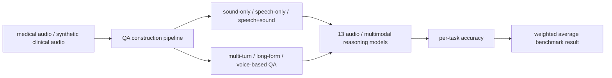
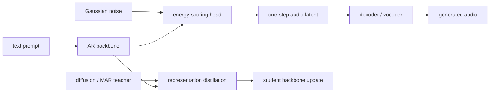
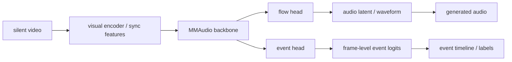
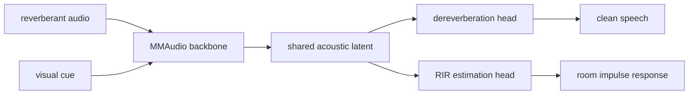
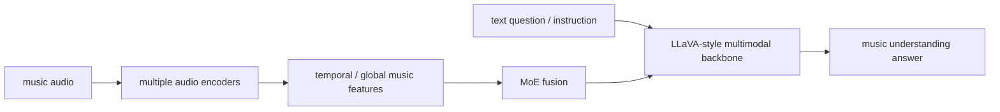

# 语音 / 音频 / 音乐论文速递
## 2026-05-01

> 实际对应 arXiv 更新日：**2026-05-01**  
> 检索范围：`cs.SD + eess.AS`  
> 只放按 ML 顶会审稿口径看，最值得多数读者花时间看的 **5 篇**

## 📋 总览

- 共收录 **5 篇** 相关论文
- 医疗音频理解 / 音频推理：**1 篇**
- 音乐理解大模型：**1 篇**
- 视频到音频 / 可解释音频生成：**2 篇**
- 高效音频生成：**1 篇**

今天真正值得看的主线有三条。第一条是 `MedMosaic`，它不是再堆一个小数据集，而是把医疗音频推理 benchmark 直接做大到 **46,701** 个 QA，专门拷问长上下文、多轮问答和语音+生理声音混合推理。第二条是 `Fast Text-to-Audio Generation with One-Step Sampling`，它认真在打 text-to-audio 的延迟瓶颈，核心是 one-step latent synthesis 加表示蒸馏，而不是嘴上说快。第三条是 `MMAudio-LABEL / MMAudioReverbs` 这组工作，说明基于预训练视频到音频 backbone 做可解释事件标注和物理声学任务，是一条有工程价值的路。

## 精选入选规则

- **新意（0-3）**：有没有新方法、新任务设定或明确新范式
- **影响力（0-3）**：是不是主线问题，不是特别窄的小点
- **证据强度（0-2）**：实验、对比、消融、结论是否站得住
- **受众匹配度（0-2）**：是否贴近语音大模型、语音识别、TTS、音乐生成、音频系统

分数校准：

- **6**：可读，但偏 incremental
- **7**：接近 strong accept，不是随手送分
- **8+**：当天明显强稿才配拿

## 总览表

| 方向 | 序号 | 论文 | 评分 | 关键词 |
|---|---:|---|---:|---|
| 医疗音频理解 | 1 | MedMosaic | 8/10 | medical audio QA, 46,701 QA, Gemini/Qwen benchmark |
| 高效音频生成 | 2 | Fast Text-to-Audio Generation with One-Step Sampling | 8/10 | one-step TTA, energy distance, representation distillation, 8.5x faster |
| 视频到音频 / 事件标注 | 3 | MMAudio-LABEL | 7.5/10 | event-aware V2A, Greatest Hits, onset 75.0%, material 61.0% |
| 视频到音频 / 房间声学 | 4 | MMAudioReverbs | 7.5/10 | dereverberation, RIR estimation, MMAudio finetune |
| 音乐理解大模型 | 5 | GaMMA | 7/10 | music LMM, MusicBench, temporal/global understanding |

## 🏥 医疗音频理解 / 音频推理

### [1] MedMosaic: A Challenging Large Scale Benchmark of Diverse Medical Audio

- **评分**：8/10
- **作者/机构**：Harshit Rajgarhia, Shuubham Ojha, Asif Shaik, Akhil Pothanapalli, Rachuri Lokesh, Abhishek Mukherji, Prasanna Desikan；Centific Global Solutions Inc. / University of Maryland, College Park
- **论文链接**：http://arxiv.org/abs/2605.00969v1
- **PDF**：https://arxiv.org/pdf/2605.00969v1.pdf
- **代码链接**：暂无
- **Demo 链接**：文中给出样例地址，但未见正式代码仓库

#### 📌 简介
这篇做的是医疗音频问答 benchmark，不是传统的短语音分类。作者把生理声音、带异常的语音、短临床对话、长临床对话统一进一个推理评测框架里，构造了 **46,701** 个问答，专门测试长上下文、多轮问答、语音+生理声音混合推理和开放问答能力。

#### ☠️ 毒舌点评
这篇的价值很直接：医疗音频这块以前 benchmark 太碎，很多模型其实没被真刀真枪地测过。它的问题也很明显，数据里有很大一部分是合成构造，不是纯自然临床采集，所以“离真实临床还有多远”这个问号始终在。做语音大模型、医疗音频理解、音频推理 benchmark 的人值得读。

#### 🔧 技术方案
- **模型解决的问题**：解决医疗音频 benchmark 过于短、过于单轮、过于单模态的问题，让模型必须处理临床语音、生理声音、长上下文和多轮推理，而不是只做片段级识别。
- **模型架构**：
  - **输入**：不是单一种类音频，而是一个混合医疗音频集合。里面既有 heart / lung / cough 这类生理声音，也有 speech-only 临床语音、speech+sound 混合片段、长对话和多轮问答场景。
  - **输出**：最终不是分类标签，而是多种 QA 任务的标准答案，覆盖多选、开放问答、多轮问答和 voice-based QA。也就是说，它评的是“能不能推理”，不是“能不能听出来”。
  - **主干**：这篇本质是 benchmark 论文，不是新 backbone 论文。真正的主干是“音频构造与整理 -> QA 生成 -> 分任务评测 -> 多模型横评”这一整套评测流水线。
  - **关键模块**：
    - synthetic medical speech generation：用可控合成方式补真实医疗音频稀缺的问题
    - task partition：把问题拆成 sound-only、speech-only、speech+sound、multi-turn、long-form、voice-based 几类
    - unified evaluation：用同一套加权指标去比较 13 个 audio / multimodal reasoning 模型
  - **信号流**：

- **训练 / 推理策略**：
  - 这篇主要贡献不在新模型训练，而在 benchmark 设计和评测协议。
  - QA 对主要由 Gemini-3-flash 参与生成，再通过 string-matching 等规则做评测。
  - 推理性能、延迟、显存不是论文重点，文中没有系统报告。

#### 📊 实验结果
- **数据规模**：全 benchmark 共 **46,701** 个 QA。
- **主结果**：加权平均准确率最高的是 `Gemini-2.5-pro`，只有 **68.1%**；`Gemini-2.5-flash` 是 **60.5%**；`Qwen-omni-7b` 只有 **42.8%**。
- **结论**：即便是当前最强的闭源多模态模型，在医疗音频推理上也远没到“可以放心用”的程度。
- **baseline / 对比对象**：Audio-Flamingo-3、Audio-reasoner、Baichuan-omni、Gemini-2.5-pro、Gemini-2.5-flash、GPT4o-audio、Kimi-audio、Qwen-omni-7b 等共 13 个系统。
- **是否开源**：论文没有明确给出完整开源代码仓库。

#### 💡 为什么值得看
如果你做音频推理或语音大模型评测，这篇最值钱的地方不是模型，而是它把“医疗音频到底难在哪”拆成了可量化的子任务，而且结果很扎心：现有模型离真正靠谱还差得远。

## ⚡ 高效音频生成

### [2] Fast Text-to-Audio Generation with One-Step Sampling via Energy-Scoring and Auxiliary Contextual Representation Distillation

- **评分**：8/10
- **作者/机构**：Kuan-Po Huang, Bo-Ru Lu, Byeonggeun Kim, Mihee Lee, Zalan Fabian, Renard Korzeniowski, Qingming Tang, Greg Ver Steeg, Hung-yi Lee, Chieh-Chi Kao, Chao Wang；National Taiwan University / Amazon AGI
- **论文链接**：http://arxiv.org/abs/2605.00329v1
- **PDF**：https://arxiv.org/pdf/2605.00329v1.pdf
- **代码链接**：暂无
- **Demo 链接**：暂无

#### 📌 简介
这篇解决的是 text-to-audio 里一个非常实际的问题：AR + diffusion 质量高，但推理太慢。作者提出 `AUDIO DEAR`，用 energy-distance 目标把 raw noise 直接映射到 audio latents，实现 one-step sampling，再用来自 diffusion teacher 的表示蒸馏把质量拉回来。

#### ☠️ 毒舌点评
这篇不是“重新发明 TTA”，而是把高质量和低延迟之间的硬冲突狠狠干了一刀。方法上谈不上革命，但工程价值很强，尤其对在线音频生成和交互式应用很实在。做音频生成系统的人值得看，纯追 paper novelty 的人可能会嫌它太务实。

#### 🔧 技术方案
- **模型解决的问题**：把传统 AR continuous sampling 里 `r × n` 的高推理成本压下来，特别是把 diffusion / flow sampling 的多步采样变成 one-step。
- **模型架构**：
  - **输入**：显式输入有两类。一类是文本 prompt，负责给出语义条件；另一类是 Gaussian noise，负责作为 one-step latent synthesis 的起点。训练阶段还会额外接收 teacher 模型的中间表示作为蒸馏目标。
  - **输出**：先输出 audio latent，再交给 decoder / vocoder 还原为最终音频。所以它本质上不是直接一步出波形，而是一步出 latent。
  - **主干**：主体还是 AR transformer 条件建模框架，只是把原来慢的 diffusion sampling 部分替换成了一个 one-step 的 energy-scoring head。也就是说，语义建模仍然靠 AR backbone，真正提速的是 latent 生成这一步。
  - **关键模块**：
    - energy-scoring head：直接把 noise 映射到目标 latent，替代多步扩散采样
    - representation distillation：从 diffusion teacher / MAR teacher 蒸馏条件表示，避免 one-step 后语义条件崩掉
    - CFG / sampling controls：控制生成质量和语义对齐
  - **信号流**：

- **训练 / 推理策略**：
  - **训练目标**：energy-distance objective 替代 diffusion loss，并叠加辅助表示蒸馏损失。
  - **数据**：训练用了 `AudioCaps` 和 `WavCaps`。
  - **推理方式**：one-step sampling；同时评测 few-step 和 multi-step 对比。
  - **推理性能**：相对 `IMPACT`，batch inference 最多 **8.5× faster**。

#### 📊 实验结果
- **数据集**：`AudioCaps` 是主评测集。
- **主要 baseline**：ConsistencyTTA、SoundCTM、AudioLCM、AudioTurbo、IMPACT。
- **核心结果**：
  - 论文明确写到，`AUDIO DEAR` 在 one-step 约束下整体优于 ConsistencyTTA、SoundCTM、AudioLCM、AudioTurbo。
  - 与 SOTA AR diffusion 系统 `IMPACT` 比，推理速度最高能快 **8.5×**。
  - 指标上重点报告了 `FD / FAD / KL / IS / CLAP`，结论是蒸馏后的 one-step 版本显著缩小了和 multi-step 系统的质量差距。
- **是否开源**：文中未见正式开源仓库。

#### 💡 为什么值得看
如果你真关心 text-to-audio 落地，这篇值得看，因为它不是单纯刷个分，而是在“能不能快到可用”这个维度上给了明确答案。

## 🎬 视频到音频 / 可解释音频生成

### [3] MMAudio-LABEL: Audio Event Labeling via Audio Generation for Silent Video

- **评分**：7.5/10
- **作者/机构**：Kazuya Tateishi, Akira Takahashi, Atsuo Hiroe, Hirofumi Takeda, Shusuke Takahashi, Yuki Mitsufuji；Sony Group Corporation / Sony AI
- **论文链接**：http://arxiv.org/abs/2605.00495v1
- **PDF**：https://arxiv.org/pdf/2605.00495v1.pdf
- **代码链接**：暂无
- **Demo 链接**：暂无

#### 📌 简介
这篇不是只做 silent video 到音频生成，而是进一步要求模型输出“发生了什么事件、发生在什么时候”。作者提出 `MMAudio-LABEL`，把事件标注和音频生成一起做，目标是让 V2A 结果不只是“听着像”，还得能解释时间轴上的 sound event。

#### ☠️ 毒舌点评
这篇比单纯追 V2A 主观听感的论文更实在，因为它终于开始面对“生成完以后怎么解释、怎么编辑、怎么用于制作”这个问题。缺点是任务本身还偏受控，数据集也没大到让人放心吹通用性，但方向是对的。

#### 🔧 技术方案
- **模型解决的问题**：解决现有 V2A 模型只会生音频、不会给事件时间轴的问题，让生成系统同时输出音频和 frame-level 事件标签。
- **模型架构**：
  - **输入**：输入是 silent video，不是音频。模型先从视频里抽视觉条件和同步相关特征，再把这些特征送进 MMAudio backbone。
  - **输出**：同时输出两样东西：一是生成的 audio，二是 frame-level event labels。这个“双输出”设计就是它和普通 V2A 最大的差别。
  - **主干**：主干直接建立在 `MMAudio` 上，共享 flow-prediction backbone。也就是说，它不是另起炉灶训一个事件检测器，而是在已有生成 backbone 上加事件建模分支。
  - **关键模块**：
    - flow head：负责音频生成
    - event head：负责事件类别和时间位置
    - `Parallel Heads / Joint Heads`：两套结构对比，最后论文证明 joint 方案更强
  - **信号流**：

- **训练 / 推理策略**：
  - **训练数据**：`Greatest Hits`。
  - **任务**：onset detection + 17-class material classification。
  - **对比**：CondFoley、MMAudio small-16k、VGGish classifier。
  - **训练方式**：既评了 scratch，也评了从 small-16k checkpoint finetune。

#### 📊 实验结果
- **onset detection**：
  - baseline `CondFoley`：**46.7%** Acc
  - `Joint Heads (finetune)`：**75.0%** Acc
- **material classification**：
  - baseline `VGGish Classifier`：**40.6%**
  - `Joint Heads (finetune)`：**61.0%**
- **结论**：把 event prediction 和 generation 联训，确实能显著提升事件可解释性，而且生成质量没有因此崩掉。
- **是否开源**：文中未见正式开源仓库。

#### 💡 为什么值得看
做视频到音频的人应该看这篇，因为它把“生成”往“可编辑、可解释”方向推了一步，这比继续堆听感分数更有用。

### [4] MMAudioReverbs: Video-Guided Acoustic Modeling for Dereverberation and Room Impulse Response Estimation

- **评分**：7.5/10
- **作者/机构**：Akira Takahashi, Ryosuke Sawata, Shusuke Takahashi, Yuki Mitsufuji；Sony Group Corporation / Sony AI
- **论文链接**：http://arxiv.org/abs/2605.00431v1
- **PDF**：https://arxiv.org/pdf/2605.00431v1.pdf
- **代码链接**：暂无
- **Demo 链接**：暂无

#### 📌 简介
这篇想证明：预训练 V2A foundation model 不只是能“配音”，还可能隐式学到了房间结构和声学先验。作者把 `MMAudio` 直接拿来 finetune 成 `MMAudioReverbs`，统一处理两个物理声学任务：dereverberation 和 RIR estimation，而且不改网络结构。

#### ☠️ 毒舌点评
这篇有点像“把基础模型拿来试试还能不能干别的”，但结果不算水，因为它真的测了物理声学指标，不是只看主观听感。缺点是任务规模不大，更多像 foundation model 可迁移性的探索稿，而不是最终工业方案。

#### 🔧 技术方案
- **模型解决的问题**：解决现有视频到音频模型不显式建模 room acoustics，导致无法控制混响或估计 RIR 的问题。
- **模型架构**：
  - **输入**：输入有两部分：一部分是 reverberant audio，提供真实声学观测；另一部分是 scene image / video visual cues，提供房间结构和空间布局线索。
  - **输出**：
    - dereverberated speech
    - estimated room impulse response
  - **主干**：直接复用 `MMAudio` backbone，不改主网络结构。它的核心点不是发明新模块，而是把原来做 V2A 的 latent 空间重新解释成 room-acoustic prior，然后在这个基础上做 finetune。
  - **关键模块**：
    - audio-only conditioning：看纯声学证据能做到什么程度
    - audio+vision conditioning：再把视觉结构信息加进来
    - task-specific latent reinterpretation：同一个 backbone，同一套 latent，不同任务头分别解释成 dereverberation 或 RIR estimation
  - **信号流**：

- **训练 / 推理策略**：
  - **数据集**：`SoundSpaces-Speech`
  - **训练设置**：2.56 秒训练片段，20k training steps
  - **vocoder**：BigVGAN
  - **推理**：CFG 关闭，因为作者观察到它会引入额外生成不稳定性

#### 📊 实验结果
- **dereverberation**：
  - `Reverberant` 输入：`SRMR 4.75`, `RT60 403.1 ms`, `RTE 363.9 ms`
  - `Ours (Finetune, A)`：`SRMR 7.27`, `RT60 27.1 ms`, `RTE 28.7 ms`
  - `Ours (Finetune, A+V)`：`SRMR 7.29`, `RT60 27.2 ms`, `RTE 28.9 ms`
- **RIR estimation**：
  - `AV-RIR (A+V)`：`ΔRT60 40.2 ms`, `ΔDRR 1.76 dB`, `ΔEDT 77.2 ms`
  - `Ours (Finetune, A)`：`51.6 ms`, `2.40 dB`, `41.9 ms`
  - `Ours (Finetune, A+V)`：`60.0 ms`, `2.36 dB`, `47.5 ms`
- **结论**：视觉信息对 early energy / DRR 更有帮助，late reverberation 相关指标更多还是靠音频证据。
- **是否开源**：文中未见正式开源仓库。

#### 💡 为什么值得看
如果你关心 foundation audio model 的跨任务迁移，这篇值；它说明“视频到音频 backbone”可以被重解释成房间声学先验，而不只是用来生成声音。

## 🎼 音乐理解大模型

### [5] GaMMA: Towards Joint Global-Temporal Music Understanding in Large Multimodal Models

- **评分**：7/10
- **作者/机构**：Zuyao You, Zhesong Yu, Mingyu Liu, Bilei Zhu, Yuan Wan, Zuxuan Wu；正文未可靠提取机构，这里不乱写
- **论文链接**：http://arxiv.org/abs/2605.00371v1
- **PDF**：https://arxiv.org/pdf/2605.00371v1.pdf
- **代码链接**：暂无
- **Demo 链接**：暂无

> ⚠️ 这篇当前只拿到了 abstract 级稳定信息，正文抽取失败，以下结论按 abstract 降级处理。

#### 📌 简介
这篇做的是音乐理解大模型。作者提出 `GaMMA`，目标是把 time-series 和 non-time-series 的音乐理解任务统一到一个大型多模态模型里，并配套推出音乐 benchmark `MusicBench`。

#### ☠️ 毒舌点评
这篇从 abstract 看卖点很足：统一音乐理解、数据规模大、训练流程完整、benchmark 也一起放出来。但现在正文稳定抽取失败，所以我不会直接替它吹成“音乐版通用大模型王者”。做音乐多模态理解的人可以先记住它，但别只看摘要就上头。

#### 🔧 技术方案
- **模型解决的问题**：统一 global music understanding 和 temporal music understanding，避免不同音乐任务各自分家。
- **模型架构**：
  - **输入**：输入是音乐音频和文本问题/指令的组合，所以它做的不是纯音频分类，而是音乐多模态理解。
  - **输出**：输出是音乐理解相关答案，包括多选判断和文本理解结果，目标是同时覆盖 temporal 与 global 两类任务。
  - **主干**：abstract 明确写它继承了 `LLaVA` 风格的 encoder-decoder 设计，也就是用一个统一的多模态主干去对齐音乐和语言，而不是给不同音乐任务单独训模型。
  - **关键模块**：
    - multiple audio encoders：分别抓音乐里的不同层次表征
    - MoE fusion：把这些表征统一汇到一个共享主干里
    - progressive training：pretraining -> SFT -> RL 三阶段推进
  - **信号流**：

- **训练 / 推理策略**：
  - abstract 提到三阶段：pretraining、SFT、RL
  - 更细的 loss 和推理细节，正文当前没有稳定抽到，不能乱写

#### 📊 实验结果
- **benchmark**：作者提出 `MusicBench`，包含 **3,739** 个人工整理的多选题。
- **核心结果**：
  - `MuchoMusic`：**79.1%**
  - `MusicBench-Temporal`：**79.3%**
  - `MusicBench-Global`：**81.3%**
- **结论**：作者声称在音乐理解领域达到新的 SoTA，但由于正文细节还没稳定拿到，这里只保留 abstract 级结论。
- **是否开源**：文中未见稳定代码链接。

#### 💡 为什么值得看
如果你做音乐多模态理解，这篇值得先盯住，因为它明显想做“统一音乐理解大模型 + benchmark”这条主线。但现在还不能把它当完全坐实的强稿，后续得补正文细读。

## 最后结论

如果只让我排今天最值得优先看的 3 篇，会是：

1. **MedMosaic**  
不是因为它模型最花哨，而是因为它把医疗音频推理 benchmark 真做成了一个像样的压力测试场。

2. **Fast Text-to-Audio Generation with One-Step Sampling**  
它直接打 text-to-audio 的延迟瓶颈，`8.5×` 推理加速不是小修小补。

3. **MMAudio-LABEL**  
这篇把 V2A 从“能生成”往“可解释、可编辑”推进了一步，实际价值比很多只卷听感的论文高。
