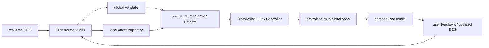
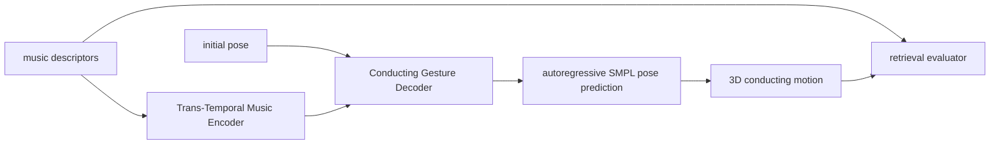
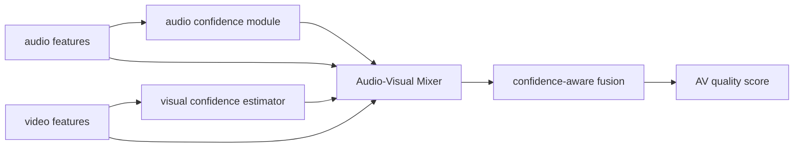
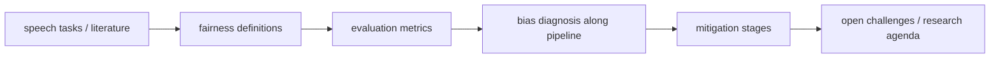

# 语音 / 音频 / 音乐论文速递
## 2026-05-02

> 实际对应 arXiv 更新日：**2026-05-02**  
> 检索范围：`cs.SD + eess.AS`  
> 只放按 ML 顶会审稿口径看，最值得多数读者花时间看的 **5 篇**

## 📋 总览

- 共收录 **5 篇** 相关论文
- 音乐生成 / 脑机接口：**2 篇**
- 语音生成安全：**1 篇**
- 音视频质量评估：**1 篇**
- 领域综述 / 公平性：**1 篇**

今天最值得看的主线有三条。第一条是 `MindMelody`，它不是把 EEG 当噱头，而是明确拆成“情绪解码 -> 干预规划 -> 可控音乐生成 -> 闭环反馈”四段，系统感比较完整。第二条是 `MelShield`，它抓的是现在 TTS 里一个很实际的问题：如果你不想改 vocoder，也不想重训整条链，怎么在 Mel 域里把 watermark 做进去。第三条是 `MG-Former`，虽然不属于语音主线，但它把 music-driven conducting gesture 这个冷门方向做得还算像样，至少数据、生成、评测是一整套。

## 精选入选规则

- **新意（0-3）**：有没有新任务、新评测口径或清晰的方法机制
- **影响力（0-3）**：问题是不是主线问题，或者是不是会反复被后续工作复用
- **证据强度（0-2）**：实验、对比、消融有没有把结论撑住
- **受众匹配度（0-2）**：是否贴近语音大模型、语音识别、TTS、音乐生成、音频系统

分数校准：

- **6**：能读，但更像补洞或工程稿
- **7**：方向靠谱，有明确信息量
- **8+**：当天明显值得优先看的稿子

## 总览表

| 方向 | 序号 | 论文 | 评分 | 关键词 |
|---|---:|---|---:|---|
| 音乐生成 / 脑机接口 | 1 | MindMelody | 8/10 | EEG, Transformer-GNN, RAG-LLM, controllable music |
| 语音生成安全 | 2 | MelShield | 7.5/10 | mel watermarking, keyed spread-spectrum, DiffWave, HiFi-GAN |
| 音乐生成 / 动作生成 | 3 | MG-Former | 7.5/10 | music-to-conducting, SMPL, autoregressive transformer |
| 音视频质量评估 | 4 | MCM-AVQA | 7/10 | confidence-aware fusion, AV mixer, asymmetric degradation |
| 综述 / 公平性 | 5 | Fair Speech Technologies Survey | 6.5/10 | fairness, speech bias, evaluation, mitigation |

## 🧠 音乐生成 / 脑机接口

### [1] MindMelody: A Closed-Loop EEG-Driven System for Personalized Music Intervention

- **评分**：8/10
- **作者/机构**：Yimeng Zhang, Yueru Sun, Haoyu Gu；South China University of Technology
- **论文链接**：http://arxiv.org/abs/2605.01235v1
- **PDF**：https://arxiv.org/pdf/2605.01235v1.pdf
- **代码链接**：暂无
- **Demo 链接**：暂无

#### 📌 简介
这篇想解决的是“音乐干预只看静态偏好，不看用户实时心理状态”的老问题。作者做了一个闭环 EEG 驱动音乐干预系统，把 EEG 先解码成情绪状态，再让带 RAG 的 LLM 生成干预计划，最后用层级控制器去调一个预训练音乐生成 backbone。

#### ☠️ 毒舌点评
这篇的亮点不在某一个模块炸裂，而在系统链路比较完整，不是只做“EEG 到标签”的小实验。问题也很明显：闭环干预这种题天生容易被“主观感觉更好”撑结论，真要落地，长期干预和真实临床效果还差得远。做 affect-aware music generation 或 BCI 音乐交互的人值得读。

#### 🔧 技术方案
- **模型解决的问题**：直接从 EEG 到音乐生成很难训，配对数据少、可解释性差，所以它先把 EEG 转成可解释的情绪中间层，再驱动音乐生成。
- **模型架构**：
  - **输入**：实时 EEG 信号。
  - **输出**：个性化音乐干预计划，以及受情绪轨迹控制的生成音乐。
  - **主干**：`Transformer-GNN EEG decoder -> RAG-equipped LLM planner -> pretrained music backbone + Hierarchical EEG Controller`。
  - **关键模块**：
    - hybrid `Transformer-GNN` 负责 EEG 到 `Valence-Arousal` 与局部情绪轨迹解码
    - `RAG + LLM` 把情绪状态翻译成结构化干预方案
    - `Hierarchical EEG Controller` 用全局 affect prefix 和局部 temporal guidance 控制音乐生成
- **信号流**：

- **关键设计 / 核心创新**：核心不是“又来一个 EEG 生成模型”，而是插了一个情绪语义桥，把难对齐的脑电信号先投影成情绪表示，再让 LLM 和生成 backbone 各做自己更擅长的事。
- **训练 / 推理策略**：
  - **训练目标**：论文正文明确强调 control adherence 和 emotional alignment，但摘要未给出精确 loss 公式。
  - **数据处理**：重点是实时 EEG 情绪解码与闭环反馈，不是大规模 paired EEG-music 直接监督。
  - **训练阶段**：先做 EEG 情绪解码，再接干预规划与受控音乐生成。
  - **推理方式**：在线闭环，用户状态变化后动态更新生成参数。
  - **推理性能**：文中强调 real-time system，但未给出延迟或 RTF。

#### 📊 实验结果
- **主要结论**：MindMelody 在 `control adherence`、`emotional alignment` 和主观 `perceived helpfulness` 上都优于对比方案。
- **baseline**：摘要未展开列名，但可以确认它和非闭环、非情绪桥接式的生成方案做了比较。
- **结果边界**：这篇最强的是短时主观帮助感，不是长期心理干预疗效。

#### 💡 为什么值得看
如果你关心“生理信号 -> 可控音乐生成”这条线，这篇有系统价值。它真正可复用的不是某个小模块，而是把情绪中间层当成桥梁这一套分解思路。

## 🛡️ 语音生成安全

### [2] MelShield: Robust Mel-Domain Audio Watermarking for Provenance Attribution of AI Generated Synthesized Speech

- **评分**：7.5/10
- **作者/机构**：Yutong Jin, Qi Li, Lingshuang Liu, Jianbing Ni；Queen’s University / University of Waterloo
- **论文链接**：http://arxiv.org/abs/2605.01515v1
- **PDF**：https://arxiv.org/pdf/2605.01515v1.pdf
- **代码链接**：暂无
- **Demo 链接**：暂无

#### 📌 简介
这篇解决的是 TTS watermark 常见的两难：后处理加水印容易被破坏，深度耦合到生成器里又太重。作者提出 `MelShield`，直接在 Mel 频谱中间表征里嵌入 keyed spread-spectrum watermark，再交给 DiffWave 或 HiFi-GAN 这类 vocoder 合成。

#### ☠️ 毒舌点评
这篇不花哨，但问题抓得很实。它最值钱的是“尽量不碰现有 vocoder 和训练链路”，而不是搞一个很重的新 watermark 模型。缺点也明显：它适用的是 Mel-conditioned pipeline，不是所有生成架构都能无缝套。

#### 🔧 技术方案
- **模型解决的问题**：在不改底层 vocoder、不重训整套 TTS 的前提下，实现可归因、可验证、抗压缩抗噪声的语音水印。
- **模型架构**：
  - **输入**：文本前端生成的中间 `Mel-spectrogram`。
  - **输出**：带 watermark 的 Mel，再经 vocoder 输出最终语音。
  - **主干**：`Mel host signal -> keyed perturbation embedding -> vocoder synthesis -> keyed verification`。
  - **关键模块**：
    - keyed spread-spectrum perturbation
    - carefully selected time-frequency regions
    - multi-user keyed attribution
    - keyed verification for unauthorized decoding resistance
- **信号流**：

- **关键设计 / 核心创新**：关键点是把 watermark 放到 Mel 域中间层，而不是波形后处理，也不是强绑某个特定 vocoder。
- **训练 / 推理策略**：
  - **训练目标**：摘要没有给出显式 loss 公式。
  - **推理方式**：直接在生成链路中间插入 keyed 扰动，属于 plug-and-play。
  - **兼容性**：明确支持 `DiffWave` 和 `HiFi-GAN` 这类 Mel-conditioned vocoder。

#### 📊 实验结果
- **主要结果**：在 `DiffWave` 和 `HiFi-GAN` 上，watermark extraction 接近 **100% bit accuracy**。
- **鲁棒性**：在压缩、加噪等失真下仍保持高提取率。
- **感知质量**：论文明确强调高 perceptual audio quality，但摘要没给出 MOS 数值。

#### 💡 为什么值得看
如果你做 TTS 安全、版权归因或 AI 音频溯源，这篇的价值很直接：它给了一个工程上比较容易接的 Mel 域方案，不用把整条生成链推倒重来。

## 🎼 音乐生成 / 动作生成

### [3] MG-Former: A Transformer-Based Framework for Music-Driven 3D Conducting Gesture Generation

- **评分**：7.5/10
- **作者/机构**：Ke Qiu, Yawen Qin, Tianzhi Jia, Xiaole Yang, Kaimin Wang, Kaixing Yang；Malou Tech / South-Central Minzu University / Beijing Jiaotong University / ADVANCE.AI / Fudan / Renmin
- **论文链接**：http://arxiv.org/abs/2605.01197v1
- **PDF**：https://arxiv.org/pdf/2605.01197v1.pdf
- **代码链接**：暂无
- **Demo 链接**：暂无

#### 📌 简介
这篇做的是 music-driven 3D 指挥动作生成，不是泛 dance generation。作者提出 `MG-Former`，同时补了 `CG-Data` 数据构建流程和 retrieval-based 评测模型，目标是让生成动作既能跟拍，也能跟音乐结构和指挥语义对齐。

#### ☠️ 毒舌点评
方向很小众，但做得不算敷衍。它的价值主要在“完整数据流程 + 专门评测口径”，不是模型结构突然飞升。对主流语音研究者不算必读，但做 music-motion 或多模态表演生成的人可以看。

#### 🔧 技术方案
- **模型解决的问题**：现有方法动作表示太稀疏、数据太小、评测又测不准 music-gesture alignment。
- **模型架构**：
  - **输入**：从音乐抽取的 acoustic descriptors，加上初始 pose。
  - **输出**：自回归预测的 `SMPL pose parameters`。
  - **主干**：`Trans-Temporal Music Encoder + Trans-Temporal Conducting Gesture Decoder`。
  - **关键模块**：
    - SMPL-based `CG-Data` 数据构造
    - temporal contextualized music encoding
    - autoregressive gesture decoding
    - retrieval model for shared music-gesture embedding
- **信号流**：

- **关键设计 / 核心创新**：把“生成”和“评测”一起补齐，比很多只会拿 generic motion metric 的工作强。
- **训练 / 推理策略**：
  - **训练目标**：重建损失 + alignment loss。
  - **推理方式**：自回归生成 SMPL 动作序列。
  - **实验关注点**：对比 dance-generation 和 conducting-generation baselines。

#### 📊 实验结果
- **主要结论**：论文明确说 `MG-Former` 优于现有 dance-generation / conducting-generation baseline。
- **评测指标**：`FID`、`modality distance`、`multi-modality distance`、`diversity`。
- **消融**：验证了 Transformer backbone 和 alignment loss 的收益。

#### 💡 为什么值得看
如果你做音乐驱动动作生成，这篇最值钱的是它终于把“如何评这个任务”说清楚了，不只是堆个生成模型。

## 🎥 音视频质量评估

### [4] Multimodal Confidence Modeling in Audio-Visual Quality Assessment

- **评分**：7/10
- **作者/机构**：Mayesha Maliha R. Mithila, Mylene C.Q. Farias；Texas State University
- **论文链接**：http://arxiv.org/abs/2605.01219v1
- **PDF**：https://arxiv.org/pdf/2605.01219v1.pdf
- **代码链接**：暂无
- **Demo 链接**：暂无

#### 📌 简介
这篇打的是 AVQA 里一个很实际但经常被忽略的问题：真实场景经常是音频坏了视频没坏，或者反过来，但很多 AVQA 模型默认两种模态同等可信。作者提出 `MCM-AVQA`，显式建模 audio / video confidence，再把置信度送进一个 confidence-guided audio-visual mixer。

#### ☠️ 毒舌点评
这是典型的“问题不新，但坑很真实”的论文。方法上不是大突破，但如果你做音视频质量评估，这个 reliability-aware fusion 比继续盲目做 joint embedding 有用得多。

#### 🔧 技术方案
- **模型解决的问题**：处理现实流媒体里的 asymmetric degradation，避免坏模态拖累好模态。
- **模型架构**：
  - **输入**：音频流特征和视频帧特征。
  - **输出**：对人类 MOS 更一致的 AV 质量分数。
  - **主干**：confidence estimator + confidence-guided `Audio-Visual Mixer`。
  - **关键模块**：
    - multi-head visual confidence estimator
    - audio confidence module without clean reference
    - frame-level confidence-guided channel attention
- **信号流**：

- **关键设计 / 核心创新**：把 confidence 显式注入 cross-modal fusion，而不是只在末端做简单加权。
- **训练 / 推理策略**：
  - **训练目标**：提升与 human MOS 的相关性。
  - **推理方式**：逐帧估计模态可靠性，再做 clip 级平滑与融合。
  - **推理性能**：文中未给出延迟。

#### 📊 实验结果
- **主要结果**：在多个 AVQA benchmark 上，`MCM-AVQA` 提升了与人类 `MOS` 的相关性。
- **对比亮点**：摘要特别强调 `confidence-guided Audio-Visual Mixer` 是最关键的性能来源。
- **结果边界**：论文重点是相关性和解释性，不是大规模系统吞吐。

#### 💡 为什么值得看
如果你做直播、会议、沉浸媒体质量评估，这篇的价值很工程化：别再默认两种模态一样可靠。

## ⚖️ 综述 / 公平性

### [5] Toward Fair Speech Technologies: A Comprehensive Survey of Bias and Fairness in Speech AI

- **评分**：6.5/10
- **作者/机构**：Yi-Cheng Lin, Yun-Shao Tsai, Kuan-Yu Chen, Hsiao-Ying Huang, Huang-Cheng Chou, Hung-yi Lee；National Taiwan University / University of Southern California
- **论文链接**：http://arxiv.org/abs/2605.01597v1
- **PDF**：https://arxiv.org/pdf/2605.01597v1.pdf
- **代码链接**：暂无
- **Demo 链接**：暂无

#### 📌 简介
这是一篇语音公平性综述，不是新模型论文。作者汇总了 **400+** 篇研究，试图把 speech fairness 里分散的定义、评测、偏差来源和缓解方法统一到一套框架里。

#### ☠️ 毒舌点评
综述的价值在整理，不在创新，所以它高不了分。但这篇比那种泛泛而谈的“AI fairness survey”强，因为它明确抓住了 speech 特有的问题，比如通道偏差、口音、情绪标注主观性和连续信号里的属性纠缠。做语音识别、说话人、SER、SLLM 的人值得存一份当索引。

#### 🔧 技术方案
- **模型解决的问题**：不是模型问题，而是试图统一 speech fairness 的概念框架与评测选择。
- **模型架构**：
  - **输入**：已有 speech fairness 文献、任务和系统 pipeline。
  - **输出**：七类 fairness definition、三阶段范式、四个干预阶段的统一视图。
  - **主干**：`definition -> evaluation -> diagnosis -> mitigation` 的综述组织框架。
  - **关键模块**：
    - seven fairness definitions for speech
    - three paradigms: `Robustness / Representation / Governance`
    - metric selection decision tree
    - pipeline-level bias source diagnosis
- **信号流**：

- **关键设计 / 核心创新**：不是发明新算法，而是把 speech fairness 从通用 ML fairness 里剥离出来，单独讲语音模态特有难点。
- **训练 / 推理策略**：不适用；这是 survey。

#### 📊 实验结果
- **覆盖范围**：汇总 **400+** studies。
- **最有价值的结论**：语音模态里的公平性问题不能照搬 NLP / CV 的处理方式，因为敏感属性和任务信息在连续信号里高度纠缠。
- **局限**：综述再全，也不等于给出可直接部署的公平性 recipe。

#### 💡 为什么值得看
如果你最近要系统性补 speech fairness，这篇够用；如果你只是想看一个新模型，那它不是你的菜。

## 最后结论

今天最值得优先看的三篇是：

1. `MindMelody`
2. `MelShield`
3. `MG-Former`

`MindMelody` 值得看是因为它把 EEG 驱动音乐干预做成了完整闭环，不只是小实验；`MelShield` 值得看是因为它抓住了 TTS 水印最实际的部署问题；`MG-Former` 虽然偏小众，但数据、生成、评测三件事都做全了。`MCM-AVQA` 更偏工程价值，`Fair Speech Technologies Survey` 则适合作为后续查文献和搭评测框架的入口。
