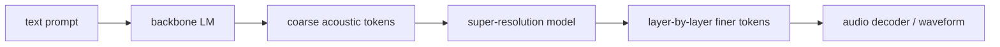
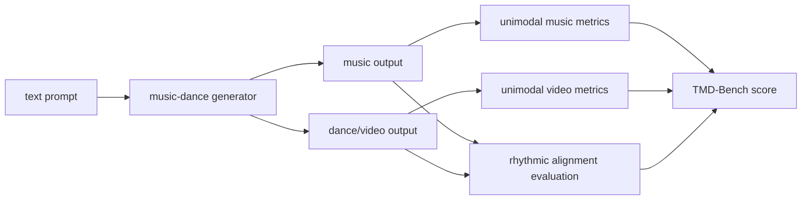
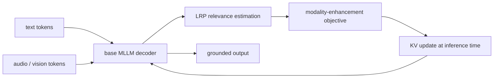
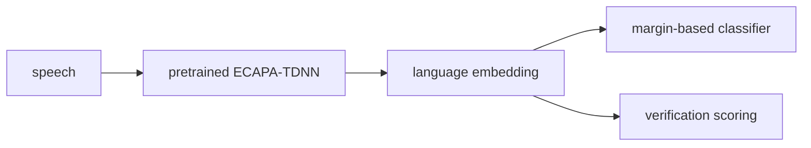

# 语音 / 音频 / 音乐论文速递
## 2026-05-03

> 实际对应 arXiv 更新日：**2026-05-03**  
> 检索范围：`cs.SD + eess.AS`  
> 只放按 ML 顶会审稿口径看，最值得多数读者花时间看的 **5 篇**

## 📋 总览

- 共收录 **5 篇** 相关论文
- 音乐生成 / 音乐理解：**3 篇**
- 多模态大模型：**1 篇**
- 语音前端：**1 篇**

今天真正有信息量的主线有三条。第一条是 `Khala`，它想证明高质量音乐生成不一定非得走“语义 token 一套、声学 token 一套”的异构两段式，而是可以在统一 acoustic-token hierarchy 里逐层做粗到细生成。第二条是 `TMD-Bench`，它比很多 audio-video benchmark 更有用的地方在于直接把节奏耦合拿出来单测，不再拿泛化的 AV 指标糊弄。第三条是 `LIME`，这篇不是新训模型，而是在推理时用 relevance propagation 去逼 MLLM 多看感知模态，属于典型“方法小、但刀口挺准”的 work。

## 精选入选规则

- **新意（0-3）**：有没有新范式、新 benchmark 或真正切中痛点的推理机制
- **影响力（0-3）**：问题是否贴近当前多模态、音乐生成、语音系统主线
- **证据强度（0-2）**：实验、对比、消融是否足够
- **受众匹配度（0-2）**：对语音大模型、语音识别、音乐生成研究者是否真有用

分数校准：

- **6**：有用，但偏任务稿或 challenge 稿
- **7**：有明确方法或评测增量
- **8+**：当天强稿

## 总览表

| 方向 | 序号 | 论文 | 评分 | 关键词 |
|---|---:|---|---:|---|
| 音乐生成 / 音乐大模型 | 1 | Khala | 8/10 | RVQ, acoustic tokens, coarse-to-fine, 62-step inference |
| 音乐生成评测 | 2 | TMD-Bench | 7.5/10 | music-dance, benchmark, rhythmic alignment, RhyJAM |
| 多模态大模型 | 3 | LIME | 7.5/10 | hallucination mitigation, LRP, inference-time KV update |
| 语音前端 | 4 | Spoken LID with Margin Loss | 7/10 | ECAPA-TDNN, margin loss, TidyLang, 17.08% EER |
| 音乐生成竞赛 | 5 | RenCon 2025 | 6/10 | expressive rendering, competition report, piano performance |

## 🎼 音乐生成 / 音乐理解

### [1] Khala: Scaling Acoustic Token Language Models Toward High-Fidelity Music Generation

- **评分**：8/10
- **作者/机构**：Jiafeng Liu, Yuanliang Dong, Hongjia Liu, Yuqing Cheng, Zhancheng Guo, Huijing Liang, Wenbo Zhan, Yuming Sun；论文首页可确认作者，机构在当前本地抽取结果中不稳定，这里不乱写
- **论文链接**：http://arxiv.org/abs/2605.01790v1
- **PDF**：https://arxiv.org/pdf/2605.01790v1.pdf
- **代码链接**：暂无
- **Demo 链接**：暂无

#### 📌 简介
这篇想解决的是高质量音乐生成里一个常见前提：大家默认“结构”和“细节”必须拆到不同表示空间里做。`Khala` 反其道而行，用 **64-layer RVQ acoustic tokens** 搭一个统一层级，让 backbone 先生 coarse tokens，再让 super-resolution 模块在同一 token 空间里逐层补 fine tokens。

#### ☠️ 毒舌点评
这篇不是天降新范式，但问题抓得很准，而且路线很干净。它真正想证明的是“纯 acoustic-token 语言模型能不能把结构和音质都吃下来”，不是继续往 semantic token 上叠一层概念。做音乐大模型的人值得看，尤其是想简化生成链路的人。

#### 🔧 技术方案
- **模型解决的问题**：避免多表示空间拼接导致的复杂训练和接口割裂，把 structure 和 fidelity 统一在 acoustic-token hierarchy 里建模。
- **模型架构**：
  - **输入**：文本条件，以及多层 `RVQ acoustic tokens` 的已生成前缀。
  - **输出**：完整多层 acoustic tokens，最终解码为音乐音频。
  - **主干**：
    - stage-1 backbone 生成 coarse acoustic tokens
    - stage-2 super-resolution model 在全曲尺度逐层补 finer tokens
  - **关键模块**：
    - `64-layer RVQ` acoustic representation
    - coarse-to-fine generation
    - hybrid-attention training
    - backbone 初始化 super-resolution model
- **信号流**：

- **关键设计 / 核心创新**：它最强的 claim 是 lyric alignment 能在纯 acoustic-token LM 里自然出现，不必额外引 semantic token stage。
- **训练 / 推理策略**：
  - **训练目标**：alignment 目标用 causal attention，layer-wise refinement 用 full attention。
  - **训练阶段**：先训 backbone，再用 backbone 初始化 super-resolution 模型。
  - **推理方式**：固定 **62-step inference**，时间维并行、token 层维逐层 refine。
  - **推理性能**：核心卖点是 full-track scale super-resolution 仍保持固定步数。

#### 📊 实验结果
- **主要结论**：论文声称 unified acoustic-token hierarchy 能同时兼顾 lyric alignment 和高保真细节重建。
- **最关键结果**：super-resolution 从 backbone 初始化后，收敛和最终质量都更好。
- **结果边界**：摘要没给出具体 FAD/CLAP 数值，但方法动机和推理步数很明确。

#### 💡 为什么值得看
如果你正在做音乐大模型，这篇值得看，因为它在挑战“必须异构分层表示”的主流假设，而且不是空喊口号，至少把 token hierarchy 和训练逻辑讲顺了。

### [2] TMD-Bench: A Multi-Level Evaluation Paradigm for Music-Dance Co-Generation

- **评分**：7.5/10
- **作者/机构**：Xiaoda Yang, Majun Zhang, Changhao Pan, Nick Huang, Yang Yuguang, Fan Zhuo, Pengfei Zhou, Jin Zhou；论文正文可确认作者
- **论文链接**：http://arxiv.org/abs/2605.01809v1
- **PDF**：https://arxiv.org/pdf/2605.01809v1.pdf
- **代码链接**：暂无
- **Demo 链接**：暂无

#### 📌 简介
`TMD-Bench` 不再满足于“音画都挺好看”这种泛 AV 评价，而是专门测试 music-dance co-generation 的节奏耦合、指令遵循和跨模态一致性。它还带了一个 rhythm-aligned dataset 和一个 `RhyJAM` baseline。

#### ☠️ 毒舌点评
这篇更像 benchmark / protocol 稿，不是方法炸裂型论文。但它至少抓到了现有评测的核心毛病：音乐舞蹈最重要的 rhythm coupling，很多通用 AV 指标根本测不到。做音乐视频生成的人值得存。

#### 🔧 技术方案
- **模型解决的问题**：通用 AV 评测测不准 music-dance co-generation 里的细粒度节奏对齐。
- **模型架构**：
  - **输入**：文本条件，以及生成的音乐-舞蹈对。
  - **输出**：unimodal quality、instruction adherence、cross-modal rhythmic alignment 多层级评估结果。
  - **主干**：benchmark，不是新生成模型；主线是 `dataset + music captioner + metrics + unified baseline`。
  - **关键模块**：
    - curated rhythm-aligned music-dance dataset
    - fine-grained `Music Captioner`
    - physical metrics + perceptual multimodal judgments
    - `RhyJAM` unified baseline
- **信号流**：

- **关键设计 / 核心创新**：把 rhythm coupling 从“附带观察”升级成 benchmark 中心指标。
- **训练 / 推理策略**：
  - benchmark 论文，本身不强调统一训练 recipe；
  - `RhyJAM` baseline 是在 rhythm-aligned data 上训练的统一基线。

#### 📊 实验结果
- **商业模型观察**：`Veo 3`、`Sora 2` 这种模型画面和音乐质量高，但 rhythmic coupling 还不稳。
- **baseline 结果**：`RhyJAM` 在 beat-level synchronization 上有竞争力，同时保持了不错的 unimodal fidelity。
- **结论**：现在的强 AV 模型并不等于强 music-dance 模型。

#### 💡 为什么值得看
如果你做音乐视频生成，这篇的价值不在模型，而在它终于给了一个像样的评测坐标系。

### [3] RenCon 2025: Revival of the Expressive Performance Rendering Competition

- **评分**：6/10
- **作者/机构**：竞赛组织方文档型论文
- **论文链接**：http://arxiv.org/abs/2605.02059v1
- **PDF**：https://arxiv.org/pdf/2605.02059v1.pdf
- **代码链接**：暂无
- **Demo 链接**：暂无

#### 📌 简介
这篇是 `RenCon 2025` 的竞赛总结，记录了 ISMIR 2025 上 expressive piano performance rendering competition 的赛制、参赛方法和结果。

#### ☠️ 毒舌点评
这是竞赛记录，不是研究创新稿，所以别指望它带来多深的方法突破。它的价值在看 community 现在把 expressive rendering 做到哪一步了，而不是看某个新模型多强。

#### 🔧 技术方案
- **模型解决的问题**：不适用；这是 competition report。
- **模型架构**：不统一，各队方法不同。
- **关键设计 / 核心创新**：两阶段评测，既有线上初评，也有 conference 现场实时 rendering。
- **训练 / 推理策略**：按参赛系统各自不同，文中重点是赛制与结果分析。

#### 📊 实验结果
- **参赛规模**：共 **9** 个国际队伍参赛。
- **核心结论**：expressive rendering 比过去更强了，但离真正像人类演奏还有差距。

#### 💡 为什么值得看
如果你做 symbolic-to-audio 或 expressive performance，这篇可当赛道风向标；否则优先级不高。

## 🤖 多模态大模型

### [4] Mitigating Multimodal LLMs Hallucinations via Relevance Propagation at Inference Time

- **评分**：7.5/10
- **作者/机构**：论文正文可确认作者，当前本地抽取未稳定提取机构，这里不乱写
- **论文链接**：http://arxiv.org/abs/2605.01766v1
- **PDF**：https://arxiv.org/pdf/2605.01766v1.pdf
- **代码链接**：暂无
- **Demo 链接**：暂无

#### 📌 简介
这篇抓的是 MLLM 幻觉问题里一个关键点：推理时文本 token 经常压过感知模态，模型就开始靠语言先验胡说。作者提出 `LIME`，不训练新模型，而是在推理时用 `LRP` 估计 token relevance，再对 key-value 表征做更新，逼模型多依赖视觉或音频证据。

#### ☠️ 毒舌点评
这是典型“小刀法”论文，不靠大规模训练，直接动 inference-time behavior。优点是落地轻、泛化广；缺点是如果你想彻底解决 hallucination，这种推理时修补不可能一招治百病。做 audio-language / vision-language inference 的人值得读。

#### 🔧 技术方案
- **模型解决的问题**：多模态推理时 modality utilization 失衡，文本先验过强。
- **模型架构**：
  - **输入**：文本 token + 感知模态 token（视觉或音频）。
  - **输出**：更 grounded 的生成结果。
  - **主干**：training-free inference wrapper，不改 base MLLM 参数。
  - **关键模块**：
    - `Layer-wise Relevance Propagation`
    - relevance-based objective
    - inference-time KV representation updates
- **信号流**：

- **关键设计 / 核心创新**：不训新模型，只改推理时的模态利用率。
- **训练 / 推理策略**：
  - **训练目标**：无额外训练。
  - **推理方式**：在 decoding 过程中基于 relevance 反复修正 KV。
  - **性能影响**：摘要未报吞吐损失，但推理成本必然高于原始 decoding。

#### 📊 实验结果
- **主要结果**：在 vision 和 audio domain benchmark 上都能减少 hallucination。
- **分析结果**：论文声称它提高了 modality contribution，并让 relevance pattern 更 localized、更语义对齐。
- **结果边界**：这是 inference-time patch，不是从数据或训练目标层面根治幻觉。

#### 💡 为什么值得看
如果你做多模态大模型部署，这篇值得看，因为它给的是“不重训也能减幻觉”的可插拔思路。

## 🧩 语音前端 / 识别

### [5] Spoken Language Identification with Pre-trained Models and Margin Loss

- **评分**：7/10
- **作者/机构**：Zhihua Liang 等；代码仓库可见 `TidyLang2026`
- **论文链接**：http://arxiv.org/abs/2605.01905v1
- **PDF**：https://arxiv.org/pdf/2605.01905v1.pdf
- **代码链接**：**代码已开源** https://github.com/PunkMale/TidyLang2026
- **Demo 链接**：暂无

#### 📌 简介
这篇是 `TidyLang Challenge 2026` 的 spoken language identification 方案。方法并不复杂：用预训练 `ECAPA-TDNN` 做 encoder，再加 margin-based loss，目标是提升语言表征的可分性，同时压掉说话人等非语言因素干扰。

#### ☠️ 毒舌点评
方法本身不新，challenge 味也很重，但结果很实。它不是那种“模型巨复杂但没法复现”的稿子，反而是很典型的强 baseline 升级路线。做 LID / multilingual speech embedding 的人能直接拿去对标。

#### 🔧 技术方案
- **模型解决的问题**：speaker-controlled spoken LID 里说话人因素会干扰语言判别。
- **模型架构**：
  - **输入**：语音 utterance。
  - **输出**：语言分类结果，以及 verification 场景下的 embedding 判别。
  - **主干**：pretrained `ECAPA-TDNN` encoder + margin-based loss。
  - **关键模块**：
    - pretrained speaker-style encoder reused for LID
    - margin loss 提升 inter-class separability
    - verification-style evaluation alongside classification
- **信号流**：

- **关键设计 / 核心创新**：不靠花哨结构，核心就是把 margin loss 用对了场景。
- **训练 / 推理策略**：
  - **训练目标**：margin-based classification objective。
  - **数据**：`Tidy-X`。
  - **推理方式**：分类 + verification 两条线同时评。

#### 📊 实验结果
- **数据集**：`Tidy-X`
- **主要指标**：
  - `85.95%` macro accuracy
  - `90.96%` micro accuracy
  - `17.08%` EER
- **相对官方 baseline**：
  - macro accuracy 提升 `45.7%`
  - micro accuracy 提升 `15.2%`
  - EER 下降约 `50.8%`

#### 💡 为什么值得看
如果你做多语种语音分类，这篇虽然不华丽，但很实打实，尤其适合拿来做 baseline 校准。

## 最后结论

今天最值得优先看的三篇是：

1. `Khala`
2. `TMD-Bench`
3. `LIME`

`Khala` 是今天最值得看的，因为它直接挑战当前音乐生成里“异构表示分层”的默认路线；`TMD-Bench` 则是你只要做 music-dance 就绕不过去的评测坐标；`LIME` 的价值在于它给了一种不重训就能改善多模态幻觉的推理时方法。`Spoken LID` 更像扎实的 challenge 系统，`RenCon 2025` 则适合看赛道状态，不适合当方法创新稿读。
