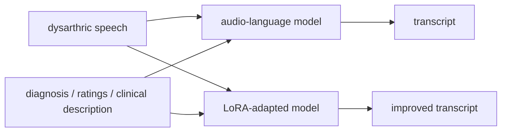
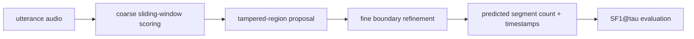
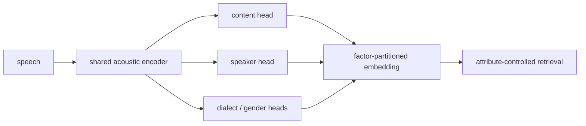

# 语音 / 音频 / 音乐论文速递
## 2026-05-04

> 实际对应 arXiv 更新日：**2026-05-04**  
> 检索范围：`cs.SD + eess.AS`  
> 只放按 ML 顶会审稿口径看，最值得多数读者花时间看的 **5 篇**

## 📋 总览

- 共收录 **5 篇** 相关论文
- 语音识别 / 语音前端：**3 篇**
- 音频安全 / 取证：**1 篇**
- 隐私学习：**1 篇**

今天最值得看的主线很清楚。第一条是 `TTS-STT Flywheel`，这篇不讲空话，直接拿实体密集的 Indic ASR 短板开刀，而且把开源、商用和跨语言结果都摊开。第二条是 `Dysarthric Speech Recognition with Clinical Context`，它最有价值的地方恰恰是负结果: 当前 audio-language model 并不会因为你喂了临床描述就突然变聪明。第三条是 `MIST + ISA`，它把 partial speech manipulation 从“句级真假分类”推进到了“多区域定位”。

## 精选入选规则

- **新意（0-3）**：有没有新数据、新协议或确实打中痛点的方法
- **影响力（0-3）**：是不是语音识别、音频安全、训练范式里的真实问题
- **证据强度（0-2）**：有没有硬数字、跨设置对比和消融
- **受众匹配度（0-2）**：对语音大模型、ASR、语音前端研究者是否真有参考价值

分数校准：

- **6**：有用但偏局部
- **7**：值得读，有明确启发
- **8+**：当天优先级最高

## 总览表

| 方向 | 序号 | 论文 | 评分 | 关键词 |
|---|---:|---|---:|---|
| 语音识别 | 1 | The TTS-STT Flywheel | 8.5/10 | entity-dense ASR, Telugu, LoRA, open-source flywheel |
| 语音前端 / 包容性 ASR | 2 | ALMs for Dysarthric Speech Recognition | 8/10 | dysarthria, clinical context, LoRA, WER 0.066 |
| 音频取证 | 3 | MIST + ISA | 8/10 | multi-region tampering, ISA, SF1@tau, dataset/code open |
| 语音前端 / 表征 | 4 | Multi-Axis Speech Similarity | 7/10 | factor-partitioned embeddings, attribute-conditioned retrieval |
| 隐私学习 | 5 | Private Speech Classification without Collapse | 7/10 | DP-SGD, collapse, offline distillation, Macro-F1 |

## 🗣️ 语音识别 / 数据飞轮

### [1] The TTS-STT Flywheel: Synthetic Entity-Dense Audio Closes the Indic ASR Gap Where Commercial and Open-Source Systems Fail

- **评分**：8.5/10
- **作者/机构**：Venkata Pushpak Teja Menta
- **论文链接**：http://arxiv.org/abs/2605.03073v1
- **PDF**：https://arxiv.org/pdf/2605.03073v1.pdf
- **代码链接**：**代码已开源** 论文摘要明确说明代码、holdout、predictions、EDSA corpus、entity dictionaries 全部开放
- **Demo 链接**：暂无

#### 📌 简介
这篇瞄准的是 Indic ASR 里很难但很常见的一类输入：数字串、金额、地址、品牌名、英语-印地语混说这类 entity-dense 内容。作者做了一套开源 `TTS <-> STT flywheel`，用低成本合成约 **22,000** 条实体密集语音，再在 `vasista22/whisper-telugu-large-v2` 上做 LoRA 微调。

#### ☠️ 毒舌点评
这篇的优点是非常老实，结果好就是好，不够好也直接承认没达到预注册目标。它不是搞了一个很 fancy 的大模型，而是用合成数据把一个真实业务坑狠狠干了一遍。做低资源 ASR、长尾实体识别的人，很值得看。

#### 🔧 技术方案
- **模型解决的问题**：通用 ASR 在小语种实体密集场景下经常直接崩，尤其是 Telugu 这种 niche domain。
- **模型架构**：
  - **输入**：Indic-English codemix 的 entity-dense 语音。
  - **输出**：ASR 文本转写，重点看实体命中。
  - **主干**：开源 Indic TTS 先生成 `EDSA` 合成语料，再对 `whisper-telugu-large-v2` 做 LoRA 微调。
  - **关键模块**：
    - `Entity-Dense Synthetic Audio (EDSA)` corpus
    - multi-system synthesis routing
    - LoRA fine-tuning
    - `Entity-Hit-Rate (EHR)` 指标
- **信号流**：

- **关键设计 / 核心创新**：关键不是 LoRA 本身，而是用低成本可控合成数据搭出一个面向长尾实体的闭环飞轮。
- **训练 / 推理策略**：
  - **训练目标**：ASR 微调；论文重点看实体命中率，不是只看普通 WER。
  - **训练数据**：约 **22k** entity-dense 合成语音。
  - **推理评估**：既看 held-out synth，也看 native human sanity check。

#### 📊 实验结果
- **Telugu held-out synth**：
  - open SOTA `vasista22/whisper-telugu-large-v2`：`EHR 0.027`
  - `Deepgram Nova-3`：`0.16`
  - flywheel LoRA：`0.473`
- **跨语言**：
  - beta-Hi：`0.337`
  - beta-Ta：`0.543`
- **真实人声 sanity check**：native Telugu 上 `EHR 0.516`，接近 synth 的 `0.473`
- **代价**：`FLEURS-Te` 上 read-prose 退化约 `+6.6 pp WER`
- **关键消融**：只用 `FLEURS-Te` 做 LoRA，EHR 只有 `0.020`，说明增益几乎都来自 `EDSA` 语料。

#### 💡 为什么值得看
这篇最值钱的是它把“合成数据到底能不能补一个具体语音短板”讲得很清楚，而且证据很硬，不是泛泛说 data flywheel 有前途。

## 🧩 语音前端 / 包容性识别

### [2] When Audio-Language Models Fail to Leverage Multimodal Context for Dysarthric Speech Recognition

- **评分**：8/10
- **作者/机构**：Pehuén Moure, Niclas Pokel, Bilal Bounajma, Yingqiang Gao, Roman Boehringer, Longbiao Cheng, Shih-Chii Liu
- **论文链接**：http://arxiv.org/abs/2605.02782v1
- **PDF**：https://arxiv.org/pdf/2605.02782v1.pdf
- **代码链接**：暂无
- **Demo 链接**：暂无

#### 📌 简介
这篇问了一个很朴素但很该问的问题：给 dysarthric speech 识别模型喂诊断标签、临床评分、病理描述，真的有用吗？结论很不留情面：当前 frozen audio-language models 基本不会用这些上下文，很多时候还会把 `WER` 弄得更差。

#### ☠️ 毒舌点评
这是篇很好的“负结果论文”。它没有神化 multimodal context，反而直接证明现在很多模型只是看起来能接上下文，实际上并不会用。做辅助沟通、病理语音 ASR、语音大模型 prompt engineering 的人，都该看。

#### 🔧 技术方案
- **模型解决的问题**：搞清楚 clinical context 是不是能真正改善 dysarthric speech recognition，而不是只当 prompt 装饰。
- **模型架构**：
  - **输入**：dysarthric speech + diagnosis / clinician ratings / richer clinical descriptions。
  - **输出**：ASR 转写结果。
  - **主干**：比较多种 frozen audio-language models 的 prompt conditioning，再补一个 LoRA adaptation。
  - **关键模块**：
    - clinical context benchmark on `SAP`
    - matched comparisons across `9` models and `9` prompt conditions
    - context-dependent LoRA fine-tuning
- **信号流**：

- **关键设计 / 核心创新**：不是发明新 backbone，而是把“临床上下文到底有没有被模型吃进去”这个问题做成 benchmark。
- **训练 / 推理策略**：
  - **评测指标**：`WER`、`CER`、`SemScore`。
  - **推理方式**：先比较 frozen prompting，再比较 context-aware LoRA。
  - **训练收益**：LoRA 才是真正有用的，不是 prompt 越长越灵。

#### 📊 实验结果
- **核心负结果**：diagnosis-informed 或 richer clinical prompts 带来的改进几乎可以忽略，很多情况下还会恶化 `WER`。
- **LoRA 结果**：context-dependent LoRA 把 `WER` 做到 **0.066**，相对 frozen baseline 降低 **52%**。
- **子群结果**：对 `Down syndrome` 和 `mild-severity` speaker 增益更明显。

#### 💡 为什么值得看
这篇最大的价值就是帮你止损：别再幻想“给大模型多喂点临床上下文”就能自动解决 atypical speech 识别。

## 🔐 音频安全 / 取证

### [3] Toward Fine-Grained Speech Inpainting Forensics: A Dataset, Method, and Metric for Multi-Region Tampering Localization

- **评分**：8/10
- **作者/机构**：Tung Vu, Yen Nguyen, Hai Nguyen, Cuong Pham, Cong Tran；Posts and Telecommunications Institute of Technology, Hanoi, Vietnam
- **论文链接**：http://arxiv.org/abs/2605.02223v1
- **PDF**：https://arxiv.org/pdf/2605.02223v1.pdf
- **代码链接**：**代码已开源** https://huggingface.co/datasets/tung2308/MIST
- **Demo 链接**：同上数据集页

#### 📌 简介
这篇解决的是 partial speech manipulation 里最麻烦的一种情况：只替换几个词，而且是多段、多区域、未知数量的篡改。作者给了三件套：`MIST` 数据集、`ISA` 定位框架，以及新的 segment-level 指标 `SF1@tau`。

#### ☠️ 毒舌点评
这篇比很多 deepfake detection 论文靠谱，因为它不满足于句级真假分类，而是直接问“改了哪几段”。问题也很清楚：这还是特定 threat model，不代表全场景通杀。但做语音取证的人基本绕不过去。

#### 🔧 技术方案
- **模型解决的问题**：传统 utterance-level binary detection 根本抓不住只篡改 `2%-7%` 内容的 word-level inpainting。
- **模型架构**：
  - **输入**：整段语音 utterance。
  - **输出**：被篡改片段的数量与时间边界。
  - **主干**：`ISA (Iterative Segment Analysis)`，把 utterance-level classifier 包成 coarse-to-fine 多阶段滑窗定位器。
  - **关键模块**：
    - `MIST` multilingual dataset
    - gap-tolerant region proposal
    - boundary refinement
    - `SF1@tau` segment-level IoU-style metric
- **信号流**：

- **关键设计 / 核心创新**：`ISA` 的关键点是把现成 utterance-level fake detector 当 black-box 用，在推理时层层逼近篡改片段，而不要求模型预先知道有几段被改。
- **训练 / 推理策略**：
  - **训练**：基础 fake detector 仍按普通 real/fake 训练，论文提到标准交叉熵。
  - **推理**：ISA 完全是 inference-time framework。
  - **评测**：同时看 region count accuracy 和 localization precision。

#### 📊 实验结果
- **数据集**：`MIST` 覆盖 **6 languages**，每句有 `1-3` 个 independently inpainted word-level segments。
- **关键难点**：假内容只占整句 `2%-7%`。
- **主要结果**：zero-shot 情况下，传统 utterance-level detector 给这类样本的 fake probability 接近 0；`ISA` 明显优于 non-iterative baseline。
- **开放性**：数据、代码、评测工具都公开。

#### 💡 为什么值得看
如果你做音频取证，这篇最值钱的是把“检测”和“定位”真正区分开了，不再拿句级分类冒充局部篡改检测。

## 🧬 语音表征 / 隐私学习

### [4] Multi-Axis Speech Similarity via Factor-Partitioned Embeddings

- **评分**：7/10
- **作者/机构**：论文摘要可确认方法，机构在当前本地抽取中不稳定，这里不乱写
- **论文链接**：http://arxiv.org/abs/2605.02804v1
- **PDF**：https://arxiv.org/pdf/2605.02804v1.pdf
- **代码链接**：暂无
- **Demo 链接**：暂无

#### 📌 简介
这篇的出发点很直接：传统单向量 embedding 把内容、说话人、方言、性别全混到一起。作者提出 factor-partitioned embedding，把一个向量切成多个轴，每个子空间对应一个属性，再用 signed weighted sum 做受控检索。

#### ☠️ 毒舌点评
这是个很合理的方向，但还谈不上革命。它的意义在于把“我想查内容，但不想被同 speaker bias 带偏”这种真实需求做成了可操作机制。做 speech retrieval 或 disentanglement 的人可以看。

#### 🔧 技术方案
- **模型解决的问题**：单一 embedding conflation，导致属性检索不可控。
- **模型架构**：
  - **输入**：语音 utterance。
  - **输出**：按属性分区的统一 embedding。
  - **主干**：shared acoustic encoder + per-axis linear heads。
  - **关键模块**：
    - specialist teacher distillation
    - contrastive objective over shared-label pairs
    - signed axis weighting retrieval
- **信号流**：

- **训练 / 推理策略**：
  - 通过 teacher distillation 或 contrastive objectives 训练各轴；
  - 推理时用 axis-wise cosine score 做带符号加权检索。

#### 📊 实验结果
- **任务**：cross-corpus retrieval with shared Harvard sentence prompts。
- **主要结论**：可以抑制 same-speaker bias，同时找到语义更匹配的样本。

#### 💡 为什么值得看
它不是那种大而全的 foundation model，但如果你真在做 speech retrieval，这种可控相似度比“一个 embedding 走天下”更有前途。

### [5] Private Speech Classification without Collapse: Stabilized DP Training and Offline Distillation

- **评分**：7/10
- **作者/机构**：论文摘要可确认方法，机构在当前本地抽取中不稳定，这里不乱写
- **论文链接**：http://arxiv.org/abs/2605.02718v1
- **PDF**：https://arxiv.org/pdf/2605.02718v1.pdf
- **代码链接**：暂无
- **Demo 链接**：暂无

#### 📌 简介
这篇研究 example-level private speech classification。作者指出强隐私约束下 `DP-SGD` 容易塌成单类预测器，overall accuracy 还可能把这个问题掩盖掉，所以他们强调 `Macro-F1`、balanced accuracy 和 collapse diagnostic，并提出 `DP teacher -> offline distilled audio-only student` 两阶段协议。

#### ☠️ 毒舌点评
这篇胜在问题说得准。很多 DP 论文都只报一个 accuracy，就假装没看到 collapse。它的路线不性感，但非常实际，尤其对真要发私有模型的人有参考价值。

#### 🔧 技术方案
- **模型解决的问题**：强隐私、小众类别、模态不匹配一起出现时，DP 训练很容易崩。
- **模型架构**：
  - **输入**：private speech data，可带 privileged side information。
  - **输出**：最终只发布 audio-only student。
  - **主干**：
    - stage-1：train multimodal or privileged `DP teacher`
    - stage-2：用固定辅助集上的 offline teacher probabilities 蒸馏 audio-only student
  - **关键模块**：
    - `DSAF`
    - `AW-DP`
    - privileged-modality dropout
    - offline teacher-to-student distillation
- **信号流**：

- **训练 / 推理策略**：
  - **训练重点**：强隐私下防 collapse，不只看 accuracy。
  - **隐私边界**：DP guarantee 只对 `D_priv` 生效，student 相对 `D_priv` 的隐私来自 post-processing。

#### 📊 实验结果
- **核心观察**：当 `epsilon <= 1` 时，imbalanced speech task 上 collapse 非常严重。
- **结论**：offline distillation 能把 privileged teacher 的信息传给最终可发布的 audio-only student，同时避免直接发布脆弱 teacher。

#### 💡 为什么值得看
如果你做私有化语音模型，这篇最重要的提醒是：先检查 collapse，再谈准确率。

## 最后结论

今天最值得优先看的三篇是：

1. `The TTS-STT Flywheel`
2. `When Audio-Language Models Fail to Leverage Multimodal Context for Dysarthric Speech Recognition`
3. `Toward Fine-Grained Speech Inpainting Forensics`

第一篇给的是很扎实的数据飞轮打法；第二篇给的是很值钱的负结果；第三篇则把 partial speech manipulation 从句级检测推进到了区域级定位。对语音识别、语音前端、音频安全这三条线的人来说，今天这批比前两天更贴业务真问题。
