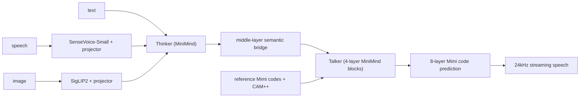
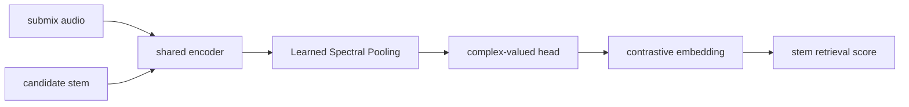
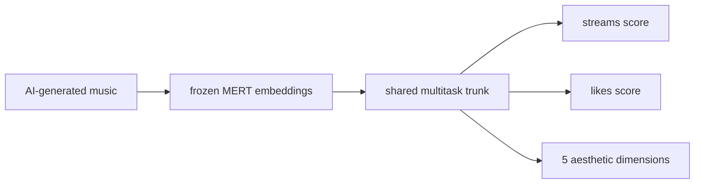
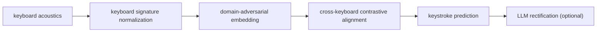
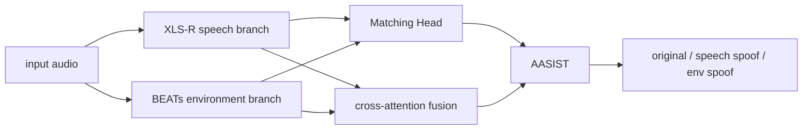

# 语音 / 音频 / 音乐论文速递
## 2026-05-05

> 实际对应 arXiv 更新日：**2026-05-05**  
> 检索范围：`cs.SD + eess.AS`
> 只放按 ML 顶会审稿口径看，最值得多数读者花时间看的 **5 篇**

## 📋 总览

- 共收录 **5 篇** 相关论文
- 语音 / 音频安全：**2 篇**
- 语音大模型 / omni：**1 篇**
- 音乐理解 / 音乐评测：**2 篇**

今天最值得看的主线有三条。第一条是 `MiniMind-O`，这篇不是刷榜稿，而是很罕见地把一个 **0.1B** speech-native omni system 的训练数据、结构和多模态序列接口公开到可检查的程度。第二条是 `PHALAR`，它抓住了音乐 stem retrieval 里“不能把时间结构全池化掉”的痛点。第三条是 `DECKER`，虽然方向偏安全，但它把 keyboard acoustic side-channel attack 做成了一个更像样的数据集和域不变识别框架。

## 精选入选规则

- **新意（0-3）**：有没有新的表示、接口、数据集或明确的问题拆解
- **影响力（0-3）**：是否贴近多模态交互、安全、音乐理解主线
- **证据强度（0-2）**：有没有清楚的对比、速度、参数或指标数字
- **受众匹配度（0-2）**：对语音大模型、音频系统、音乐模型研究者是否真有用

分数校准：

- **6**：有用但偏竞赛 / 局部任务
- **7**：可以跟，信息量足够
- **8+**：值得优先精读

## 总览表

| 方向 | 序号 | 论文 | 评分 | 关键词 |
|---|---:|---|---:|---|
| 语音大模型 / omni | 1 | MiniMind-O | 8/10 | 0.1B, Thinker-Talker, Mimi, streaming speech |
| 音乐理解 | 2 | PHALAR | 8/10 | phasor, contrastive retrieval, phase equivariance, 7x speedup |
| 语音 / 音频安全 | 3 | DECKER | 7.5/10 | ASCA, HEAR, domain-invariant, cross-keyboard |
| 语音 / 音频安全 | 4 | SSL Fusion for Deepfake Detection | 7/10 | XLS-R, BEATs, cross-attention, AASIST |
| 音乐评测 / 预测 | 5 | APEX | 7/10 | popularity prediction, MERT, 211k songs, aesthetics |

## 🤖 语音大模型 / Omni

### [1] MiniMind-O Technical Report: An Open Small-Scale Speech-Native Omni Model

- **评分**：8/10
- **作者/机构**：Jingyao Gong；Independent Researcher
- **论文链接**：http://arxiv.org/abs/2605.03937v1
- **PDF**：https://arxiv.org/pdf/2605.03937v1.pdf
- **代码链接**：**代码已开源** https://github.com/jingyaogong/minimind-o
- **Demo 链接**：https://huggingface.co/collections/jingyaogong/minimind-o

#### 📌 简介
`MiniMind-O` 做的不是“更大更强的 omni”，而是反过来试图回答：在只有 **0.1B** 量级时，speech-native omni model 还能不能把听、看、说这三件事做成一个闭环系统。作者公开了模型代码、checkpoint 和主要训练 Parquet 数据，让整个交互回路是可检查的。

#### ☠️ 毒舌点评
这篇最值钱的是“把东西摊开了”，不是分数碾压。它不是 GPT-4o 替代品，但对于做开源小模型和多模态接口设计的人，非常值得看。缺点也很明显：0.1B 规模决定了上限不会太高，更多是结构验证稿。

#### 🔧 技术方案
- **模型解决的问题**：在小规模模型里，把 speech / image / text 真正并到一个统一交互回路，而不是 ASR-LLM-TTS 外挂拼装。
- **模型架构**：
  - **输入**：文本、语音、图像。
  - **输出**：文本响应和 streaming speech。
  - **主干**：`Thinker + Talker` 双路结构。
    - `Thinker`：完整 MiniMind backbone
    - `Talker`：独立四层 MiniMind blocks，负责音频码预测
  - **关键模块**：
    - frozen `SenseVoice-Small` audio encoder
    - frozen `SigLIP2` vision encoder
    - lightweight MLP projectors
    - `Mimi` 八层 codebook 音频表示
    - right-aligned reference codec prompt + `CAM++` speaker embedding
- **信号流**：

- **关键设计 / 核心创新**：作者明确总结了三个 scale-critical choice：
  - middle-layer semantic bridging
  - released multimodal sequence format
  - parameter-efficient eight-codebook interface
- **训练 / 推理策略**：
  - **训练目标**：文本 loss + 音频 code loss 联合优化。
  - **训练数据**：公开 `T2A / I2T / A2A` 主数据集。
  - **推理方式**：streaming speech，先出 text step，再逐层生成 Mimi codes。
  - **推理性能**：论文未报 RTF，但明确支持 streaming。

#### 📊 实验结果
- **一致性评估**：768-dim Talker 下
  - dense variant `CER 0.0897`
  - MoE variant `CER 0.0900`
- **voice-cloning similarity**：
  - dense `0.5995`
  - MoE `0.5937`
- **训练效率**：文中提到一个 A2A 或 MoE 训练 cycle 在当前设置下 **4 小时以内** 可以跑完。

#### 💡 为什么值得看
如果你做开源 omni，别光盯着参数量。这篇真正有价值的是接口和序列布局怎么设计，尤其是小模型条件下哪些部分必须显式化。

## 🎼 音乐理解 / 音乐表征

### [2] PHALAR: Phasors for Learned Musical Audio Representations

- **评分**：8/10
- **作者/机构**：Davide Marincione 等
- **论文链接**：http://arxiv.org/abs/2605.03929v1
- **PDF**：https://arxiv.org/pdf/2605.03929v1.pdf
- **代码链接**：暂无
- **Demo 链接**：暂无

#### 📌 简介
这篇打的是 stem retrieval 里一个很核心的问题：很多表征模型通过 pooling 直接把时间结构抹掉了，语义相似不等于节奏和相位也对。`PHALAR` 用 `Learned Spectral Pooling` 和 complex-valued head 强行给模型灌进 pitch-equivariant、phase-equivariant 偏置。

#### ☠️ 毒舌点评
这篇是真有点东西，不是简单“换个 backbone”。它抓到的问题很准：音乐 coherence 不是只看“像不像同一类乐器”，而是看时间上合不合拍。做音乐检索、混音辅助、音乐表征的人值得读。

#### 🔧 技术方案
- **模型解决的问题**：传统 magnitude-based、GAP-based 表征对时间错位不敏感，抓不住 stem coherence。
- **模型架构**：
  - **输入**：audio submix 和 candidate stem。
  - **输出**：用于 retrieval 的音乐表征与相似度。
  - **主干**：contrastive retrieval framework。
  - **关键模块**：
    - `Learned Spectral Pooling`
    - complex-valued head
    - phase-equivariant / pitch-equivariant inductive bias
- **信号流**：

- **训练 / 推理策略**：
  - **训练目标**：contrastive retrieval objective。
  - **推理方式**：embedding similarity 检索。
  - **额外分析**：zero-shot beat tracking 与 linear chord probing。

#### 📊 实验结果
- **性能提升**：相对 SOTA 相对准确率提升最高约 **70%**。
- **效率**：
  - 参数量不到对方的 **50%**
  - 训练速度约 **7x**
- **数据集**：`MoisesDB`、`Slakh`、`ChocoChorales`
- **额外结论**：与人类 coherence judgment 的相关性高于 semantic baseline。

#### 💡 为什么值得看
这篇对音乐表征研究者很有启发，因为它把“相位和时间结构不该被池化掉”说成了可训练的偏置，而不是只停留在直觉。

### [3] APEX: Large-scale Multi-task Aesthetic-Informed Popularity Prediction for AI-Generated Music

- **评分**：7/10
- **作者/机构**：论文正文可确认作者，当前本地抽取不稳定，这里不乱写
- **论文链接**：http://arxiv.org/abs/2605.03395v1
- **PDF**：https://arxiv.org/pdf/2605.03395v1.pdf
- **代码链接**：暂无
- **Demo 链接**：暂无

#### 📌 简介
`APEX` 做的是 AI 生成音乐的人气预测。作者用 `MERT` 冻结音频表征，在超过 **211k** 首歌、约 **10k 小时** 音频上做多任务学习，同时预测 streams、likes 和五个感知美学维度。

#### ☠️ 毒舌点评
这是个挺聪明的选题，因为 AI-generated music 没有传统歌手名气和宣发信号，模型只能更依赖音频本身。缺点是“人气预测”这事天然受平台生态影响，论文再好也不等于可迁移到所有场景。

#### 🔧 技术方案
- **模型解决的问题**：AI 音乐平台里缺少传统 popularity cues，单靠 engagement 目标不够。
- **模型架构**：
  - **输入**：冻结 `MERT` 提取的音频 embedding。
  - **输出**：streams score、likes score、五个 aesthetic quality dimensions。
  - **主干**：multi-task predictor over frozen music representation。
  - **关键模块**：aesthetic-informed auxiliary heads。
- **信号流**：

- **训练 / 推理策略**：
  - 用 `Suno` 和 `Udio` 数据训练；
  - 在 `Music Arena` 做 out-of-distribution preference evaluation。

#### 📊 实验结果
- **训练规模**：**211k** songs，约 **10k hours**
- **主要结论**：加入 aesthetic features 后，在 `Music Arena` 上的人类偏好预测更稳，说明美学维度确实补了纯 engagement 信号的短板。

#### 💡 为什么值得看
如果你做 AI 音乐推荐或质量评估，这篇很值得参考，因为它把 popularity 和 perceptual aesthetics 联到了同一个多任务框架里。

## 🔐 语音 / 音频安全

### [4] DECKER: Domain-invariant Embedding for Cross-Keyboard Extraction and Recognition

- **评分**：7.5/10
- **作者/机构**：Bikrant Bikram Pratap Maurya, Nitin Choudhury, Daksh Agarwal, Arun Balaji Buduru
- **论文链接**：http://arxiv.org/abs/2605.03384v1
- **PDF**：https://arxiv.org/pdf/2605.03384v1.pdf
- **代码链接**：暂无
- **Demo 链接**：暂无

#### 📌 简介
这篇做 acoustic side-channel attack on keyboards。作者先建了 `HEAR` 数据集，覆盖 **53** 名参与者、**37** 个笔记本键盘和三种采集环境，再提出 `DECKER` 处理跨键盘、跨用户、跨噪声条件的域不变击键识别。

#### ☠️ 毒舌点评
方向不属于语音主航道，但方法很完整，不只是“我又搞了个小数据集”。它的现实意义也挺扎心：键盘声侧信道在更复杂环境里依然有攻击性。做音频安全和鲁棒表征的人可以看。

#### 🔧 技术方案
- **模型解决的问题**：过去键盘声攻击研究数据太小，跨设备跨环境泛化很弱。
- **模型架构**：
  - **输入**：typing acoustics。
  - **输出**：击键类别 / 序列。
  - **主干**：`DECKER` 四阶段域不变框架。
  - **关键模块**：
    - `Keyboard Signature Normalization`
    - domain-adversarial disentanglement
    - supervised cross-keyboard contrastive alignment
    - `Acoustic Style Randomization`
    - optional LLM-based post-processing
- **信号流**：

- **训练 / 推理策略**：
  - benchmark 同时覆盖 conventional features 与 pretrained representations；
  - 句级预测可接语言模型后处理。

#### 📊 实验结果
- **数据集**：`HEAR`，53 participants，37 keyboards，3 settings。
- **主要结论**：`DECKER` 在 cross-keyboard、cross-user 设置下优于强 baseline，且加上语言模型纠错后还会继续提升。

#### 💡 为什么值得看
这篇最值得看的不是攻击本身，而是“域不变音频表征怎么做得更像样”。

### [5] Deepfake Audio Detection Using Self-supervised Fusion Representations

- **评分**：7/10
- **作者/机构**：Khalid Zaman, Qixuan Huang, Muhammad Uzair, Masashi Unoki；JAIST
- **论文链接**：http://arxiv.org/abs/2605.03420v1
- **PDF**：https://arxiv.org/pdf/2605.03420v1.pdf
- **代码链接**：暂无
- **Demo 链接**：暂无

#### 📌 简介
这篇是 `ESDD2 2026` challenge 方案。它不把输入音频当一个整体，而是拆成 speech 和 environmental sound 两路，用 `XLS-R` 和 `BEATs` 分别提表征，再靠 Matching Head、cross-attention 和 `AASIST` 做 component-level deepfake detection。

#### ☠️ 毒舌点评
challenge 方案味很浓，但方向是对的。现实里的 deepfake 确实可能只改说话声或只改环境声，整段统一建模未必够。要说不足，就是这更像工程系统而不是新范式。

#### 🔧 技术方案
- **模型解决的问题**：speech 与 environment 可能被独立操纵，单路 SSL 表征不够。
- **模型架构**：
  - **输入**：混合语音与环境声的音频。
  - **输出**：original / speech spoof / environment spoof 预测。
  - **主干**：dual-branch SSL fusion。
  - **关键模块**：
    - `XLS-R` speech branch
    - `BEATs` environment branch
    - Matching Head
    - multi-head cross-attention
    - `AASIST` classifier
- **信号流**：

- **训练 / 推理策略**：
  - 基于 `CompSpoofV2` challenge 设置训练和测试；
  - 推理时同时输出 speech-based 和 environment-based spoof probabilities。

#### 📊 实验结果
- **测试集指标**：
  - `F1-score 70.20%`
  - environmental `EER 16.54%`
- **结论**：优于 baseline system。

#### 💡 为什么值得看
如果你做 component-aware audio forensics，这篇是比较直接的实现参考。

## 最后结论

今天最值得优先看的三篇是：

1. `MiniMind-O`
2. `PHALAR`
3. `DECKER`

`MiniMind-O` 值得看，是因为它把小型 speech-native omni 的接口和数据公开得足够彻底；`PHALAR` 值得看，是因为它真正抓住了音乐时间结构这个老问题；`DECKER` 则说明音频域不变建模在安全场景里也能做出实打实增益。`APEX` 偏平台侧应用价值，`SSL Fusion` 更像 challenge 风格的工程系统。
