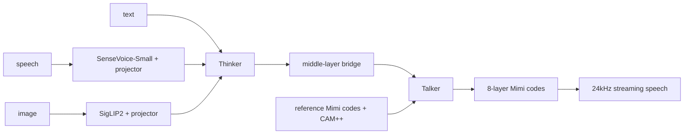
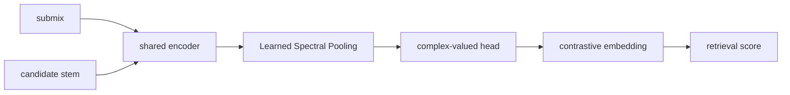
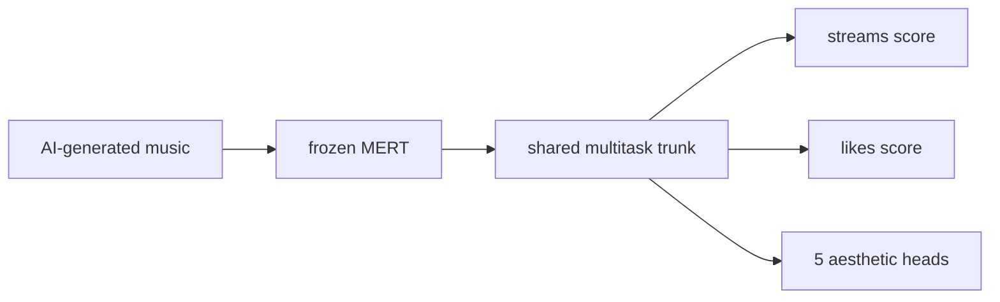
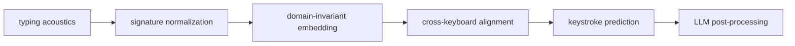
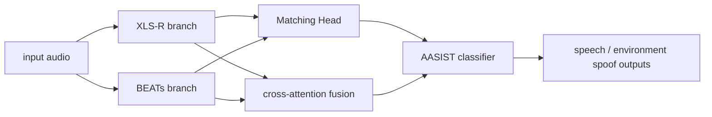

# 语音 / 音频 / 音乐论文速递
## 2026-05-06

> 实际对应 arXiv 更新日：**2026-05-05**  
> 检索范围：`cs.SD + eess.AS`
> 只放按 ML 顶会审稿口径看，最值得多数读者花时间看的 **5 篇**

## 📋 总览

- 共收录 **5 篇** 相关论文
- 语音 / 音频安全：**2 篇**
- 语音大模型 / omni：**1 篇**
- 音乐理解 / 音乐评测：**2 篇**

这一天对应的实际上还是 `2026-05-05` 那一批 arXiv 更新，所以入选论文与前一日报保持同批次一致。最值得看的还是三条：`MiniMind-O` 的开源小型 omni 路线、`PHALAR` 的相位感知音乐表征、`DECKER` 的跨键盘侧信道建模。

## 精选入选规则

- **新意（0-3）**：有没有新的表示、接口、数据集或问题拆解
- **影响力（0-3）**：是否贴近多模态交互、安全、音乐理解主线
- **证据强度（0-2）**：有没有清楚的对比、速度、参数或指标数字
- **受众匹配度（0-2）**：对语音大模型、音频系统、音乐模型研究者是否真有用

分数校准：

- **6**：有用但偏竞赛 / 局部任务
- **7**：可以跟，信息量足够
- **8+**：值得优先精读

## 总览表

| 方向 | 序号 | 论文 | 评分 | 关键词 |
|---|---:|---|---:|---|
| 语音大模型 / omni | 1 | MiniMind-O | 8/10 | 0.1B, Thinker-Talker, Mimi, streaming speech |
| 音乐理解 | 2 | PHALAR | 8/10 | phasor, contrastive retrieval, phase equivariance, 7x speedup |
| 语音 / 音频安全 | 3 | DECKER | 7.5/10 | ASCA, HEAR, domain-invariant, cross-keyboard |
| 语音 / 音频安全 | 4 | SSL Fusion for Deepfake Detection | 7/10 | XLS-R, BEATs, cross-attention, AASIST |
| 音乐评测 / 预测 | 5 | APEX | 7/10 | popularity prediction, MERT, 211k songs, aesthetics |

## 🤖 语音大模型 / Omni

### [1] MiniMind-O Technical Report: An Open Small-Scale Speech-Native Omni Model

- **评分**：8/10
- **作者/机构**：Jingyao Gong；Independent Researcher
- **论文链接**：http://arxiv.org/abs/2605.03937v1
- **PDF**：https://arxiv.org/pdf/2605.03937v1.pdf
- **代码链接**：**代码已开源** https://github.com/jingyaogong/minimind-o
- **Demo 链接**：https://huggingface.co/collections/jingyaogong/minimind-o

#### 📌 简介
`MiniMind-O` 的核心问题不是“能不能做 omni”，而是“在只有 0.1B 的时候，什么结构是必须保留的”。作者用 `Thinker-Talker` 双路结构，把 speech、image、text 真正做进了一个可检查的统一回路，并公开训练数据与序列格式。

#### ☠️ 毒舌点评
这篇不是拿来刷榜的，是拿来拆结构的。对想复现或改小模型 omni 系统的人来说，信息量很高；对只看 benchmark 排名的人，吸引力没那么大。

#### 🔧 技术方案
- **模型解决的问题**：小规模模型里，多模态听说读写接口怎么设计才不至于直接崩。
- **模型架构**：
  - **输入**：文本、语音、图像。
  - **输出**：文本和 streaming speech。
  - **主干**：`Thinker` 负责语义推理，`Talker` 负责八层 `Mimi` 码预测。
  - **关键模块**：
    - `SenseVoice-Small`
    - `SigLIP2`
    - two-layer MLP projectors
    - middle-layer semantic bridge
    - right-aligned reference Mimi codes + `CAM++` speaker embedding
- **信号流**：

- **训练 / 推理策略**：
  - 文本与音频码联合训练；
  - streaming 推理；
  - 公开 `T2A / I2T / A2A` 数据与训练入口。

#### 📊 实验结果
- dense / MoE 版本平均 `CER` 分别为 `0.0897 / 0.0900`
- voice-cloning similarity 为 `0.5995 / 0.5937`
- 文中指出单个 A2A 或 MoE 训练 cycle 可在 **4 小时内** 完成

#### 💡 为什么值得看
如果你做开源 speech-native omni，这篇最大的价值是结构透明，不是成绩炫耀。

## 🎼 音乐理解 / 音乐表征

### [2] PHALAR: Phasors for Learned Musical Audio Representations

- **评分**：8/10
- **作者/机构**：Davide Marincione 等
- **论文链接**：http://arxiv.org/abs/2605.03929v1
- **PDF**：https://arxiv.org/pdf/2605.03929v1.pdf
- **代码链接**：暂无
- **Demo 链接**：暂无

#### 📌 简介
`PHALAR` 想解决的是音乐 stem retrieval 里的时间结构盲点。它通过 `Learned Spectral Pooling` 和 complex-valued head，把 phase-equivariant bias 做进表征，避免像很多 GAP-based 模型那样把节奏关系直接池化没了。

#### ☠️ 毒舌点评
这篇比很多“音乐 foundation model” 更务实。它没有堆更大模型，而是先把问题问对：你要检索的是能不能拼得上拍子，而不是只看语义像不像。

#### 🔧 技术方案
- **模型解决的问题**：标准 magnitude-based embedding 对时间错位和相位差异不敏感。
- **模型架构**：
  - **输入**：submix 与候选 stem。
  - **输出**：用于 retrieval 的相干性表征。
  - **主干**：contrastive framework。
  - **关键模块**：
    - `Learned Spectral Pooling`
    - complex-valued head
    - phase / pitch equivariance
- **信号流**：

- **训练 / 推理策略**：
  - contrastive retrieval 训练；
  - 额外做 zero-shot beat tracking 与 linear chord probing。

#### 📊 实验结果
- 相对 SOTA 准确率提升最高约 **70%**
- 参数量不到对方 **50%**
- 训练速度约 **7x**
- 在 `MoisesDB`、`Slakh`、`ChocoChorales` 上刷新 retrieval 结果

#### 💡 为什么值得看
如果你做音乐表征，这篇很值，因为它是少数真正把时间结构当一等公民处理的工作。

### [3] APEX: Large-scale Multi-task Aesthetic-Informed Popularity Prediction for AI-Generated Music

- **评分**：7/10
- **作者/机构**：论文正文可确认作者，当前本地抽取不稳定，这里不乱写
- **论文链接**：http://arxiv.org/abs/2605.03395v1
- **PDF**：https://arxiv.org/pdf/2605.03395v1.pdf
- **代码链接**：暂无
- **Demo 链接**：暂无

#### 📌 简介
`APEX` 把 AI 生成音乐的人气预测拆成多任务：既预测 engagement，又预测 aesthetic dimensions。输入用冻结的 `MERT` embedding，训练数据规模超过 **211k songs / 10k hours**。

#### ☠️ 毒舌点评
这是平台侧很实用的题，不是学术上最性感的题。价值在于它证明 aesthetic quality 确实能补充 popularity signal，而不是只拿播放量做黑箱回归。

#### 🔧 技术方案
- **模型解决的问题**：AI 生成音乐缺少传统艺人和宣发信号，人气预测要更多依赖音频本身。
- **模型架构**：
  - **输入**：`MERT` 冻结 embedding。
  - **输出**：streams、likes、五个 aesthetics 维度。
  - **主干**：shared multi-task predictor。
- **信号流**：

- **训练 / 推理策略**：
  - 训练集来自 `Suno` 和 `Udio`；
  - OOD 测试在 `Music Arena` 上做 pairwise preference。

#### 📊 实验结果
- 训练规模：**211k songs / 10k hours**
- 加 aesthetic features 后，在 `Music Arena` 上的人类偏好预测更稳，泛化到未见生成系统时仍有帮助

#### 💡 为什么值得看
如果你做 AI 音乐平台，这篇比纯 popularity predictor 更像能落地的路线。

## 🔐 语音 / 音频安全

### [4] DECKER: Domain-invariant Embedding for Cross-Keyboard Extraction and Recognition

- **评分**：7.5/10
- **作者/机构**：Bikrant Bikram Pratap Maurya, Nitin Choudhury, Daksh Agarwal, Arun Balaji Buduru
- **论文链接**：http://arxiv.org/abs/2605.03384v1
- **PDF**：https://arxiv.org/pdf/2605.03384v1.pdf
- **代码链接**：暂无
- **Demo 链接**：暂无

#### 📌 简介
`DECKER` 研究键盘声侧信道攻击。作者提出 `HEAR` 数据集，包含 **53** 人、**37** 台笔记本和三种现实采集环境，再用四阶段域不变框架去做跨键盘击键识别。

#### ☠️ 毒舌点评
这不是语音主赛道，但对音频安全来说很扎实。它把“小数据集上看起来有效”的攻击，推到了更复杂真实环境里去测，信息量比很多套路 paper 大。

#### 🔧 技术方案
- **模型解决的问题**：旧数据集太小，跨键盘、跨用户、跨环境泛化测不出来。
- **模型架构**：
  - **输入**：keyboard typing acoustics。
  - **输出**：keystroke inference。
  - **主干**：四阶段 `DECKER`。
  - **关键模块**：
    - `Keyboard Signature Normalization`
    - domain-adversarial disentanglement
    - cross-keyboard contrastive alignment
    - `Acoustic Style Randomization`
    - optional LLM rectification
- **信号流**：

- **训练 / 推理策略**：
  - 数据同时覆盖外部麦、设备麦、VoIP capture；
  - 句级推理可接语言模型纠错。

#### 📊 实验结果
- 数据集：`HEAR`，53 participants，37 keyboards，3 settings
- 主要结论：`DECKER` 在 cross-keyboard、cross-user 条件下优于强 baseline，LM rectification 还能进一步提升

#### 💡 为什么值得看
如果你关心音频域不变表征或侧信道攻击，这篇值得存。

### [5] Deepfake Audio Detection Using Self-supervised Fusion Representations

- **评分**：7/10
- **作者/机构**：Khalid Zaman, Qixuan Huang, Muhammad Uzair, Masashi Unoki；JAIST
- **论文链接**：http://arxiv.org/abs/2605.03420v1
- **PDF**：https://arxiv.org/pdf/2605.03420v1.pdf
- **代码链接**：暂无
- **Demo 链接**：暂无

#### 📌 简介
这篇是 `ESDD2 2026` 的系统方案。核心思路是把 speech 和 environment 分开编码，用 `XLS-R + BEATs` 的双路 SSL 表征，再通过 cross-attention 和 `AASIST` 检测 component-level deepfake。

#### ☠️ 毒舌点评
challenge 味很浓，但思路合理。现实里语音和环境声确实可能被独立篡改，分路建模比整段一起喂更靠谱。

#### 🔧 技术方案
- **模型解决的问题**：component-level spoofing 不能只靠单路统一表征。
- **模型架构**：
  - **输入**：混合语音与环境声的音频。
  - **输出**：original / speech spoof / env spoof。
  - **主干**：dual-branch SSL fusion。
  - **关键模块**：
    - `XLS-R`
    - `BEATs`
    - Matching Head
    - cross-attention
    - `AASIST`
- **信号流**：

- **训练 / 推理策略**：
  - `CompSpoofV2` challenge setting；
  - 多头交叉注意力交换 speech/environment 信息。

#### 📊 实验结果
- test set `F1-score 70.20%`
- environmental `EER 16.54%`
- 优于 baseline system

#### 💡 为什么值得看
如果你做 component-aware audio forensics，这篇是很直接的系统参考。

## 最后结论

今天最值得优先看的三篇是：

1. `MiniMind-O`
2. `PHALAR`
3. `DECKER`

这一天虽然和前一日报对应的是同一批 arXiv 更新，但这三篇仍然最值得优先读：`MiniMind-O` 给的是开放的小型 omni 结构经验，`PHALAR` 给的是音乐时间结构建模的真问题，`DECKER` 则是音频安全里少见的数据和方法都做完整的工作。
