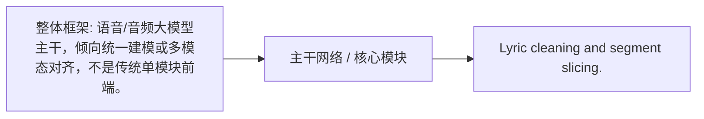
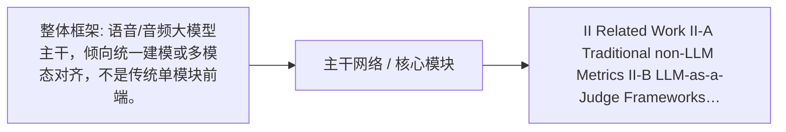
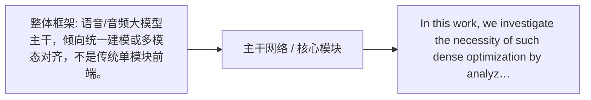
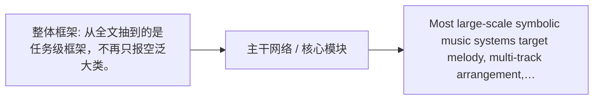
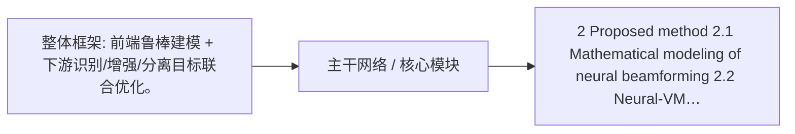

# 语音 / 音频 / 音乐论文速递
## 2026-05-07

> 实际对应 arXiv 更新日：**2026-05-06**  
> 检索范围：`cs.SD + eess.AS`  
> 只放按 ML 顶会审稿口径看，最值得多数读者花时间看的 **5 篇**

## 📋 总览

- 共收录 **5 篇** 相关论文
- 语音大模型：**3 篇**
- 语音前端：**1 篇**
- 音乐生成/理解：**1 篇**

今天真正值得看的主线有三条。第1条主线是 `VocalParse`，重点在 Lyric cleaning and segment slicing. 第2条主线是 `JASTIN`，重点在 II Related Work II-A Traditional non-LLM Metrics II-B… 第3条主线是 `Empirical Study of Pop and Jazz Mix Ratios for Genre-Adaptive Chord Generation`，重点在 Most large-scale symbolic music systems target melody…

## 精选入选规则

- **新意（0-3）**：有没有新方法、新任务设定或明确新范式
- **影响力（0-3）**：是不是主线问题，不是特别窄的小点
- **证据强度（0-2）**：实验、对比、消融、结论是否站得住
- **受众匹配度（0-2）**：是否贴近语音大模型、语音识别、TTS、音乐生成、音频系统

分数校准：

- **6**：可读，但偏 incremental
- **7**：接近 strong accept，不是随手送分
- **8+**：当天明显强稿才配拿

## 总览表

| 方向 | 序号 | 论文 | 评分 | 关键词 |
|---|---:|---|---:|---|
| 语音大模型 | 1 | VocalParse: Towards Unified and Scalable Singing Voice Transcription with Large Audio Language Models | 8/10 | Lyric cleaning and segment slicing., 整体框架: 语音/音频大模型主干，倾向统一建模或多模态对齐，不是传统单模块前端。, code open-source |
| 语音大模型 | 2 | JASTIN: Aligning LLMs for Zero-Shot Audio and Speech Evaluation via Natural Language Instructions | 8/10 | China (e-mail:{zhangleying, yanminqian}@s…, 整体框架: 语音/音频大模型主干，倾向统一建模或多模态对齐，不是传统单模块前端。 |
| 音乐生成/理解 | 3 | Empirical Study of Pop and Jazz Mix Ratios for Genre-Adaptive Chord Generation | 7/10 | Most large-scale symbolic music systems t…, 整体框架: 从全文抽到的是任务级框架，不再只报空泛大类。 |
| 语音前端 | 4 | Spatial-Magnifier: Spatial upsampling for multichannel speech enhancement | 7/10 | To overcome this limitation, we propose S…, 整体框架: 前端鲁棒建模 + 下游识别/增强/分离目标联合优化。, Datasets |
| 语音大模型 | 5 | Sparse Tokens Suffice: Jailbreaking Audio Language Models via Token-Aware Gradient Optimization | 7/10 | In this work, we investigate the necessit…, 整体框架: 语音/音频大模型主干，倾向统一建模或多模态对齐，不是传统单模块前端。, Evaluation |

## 🤖 语音大模型 / 语音理解

### [1] VocalParse: Towards Unified and Scalable Singing Voice Transcription with Large Audio Language Models

- **评分**：8/10
- **作者/机构**：Yukun Chen, Tianrui Wang, Zhaoxi Mu, Xinyu Yang, EngSiong Chng；lable Singing Voice Transcription with Large Audio Language Models /
- **论文链接**：http://arxiv.org/abs/2605.04613v1
- **PDF**：https://arxiv.org/pdf/2605.04613v1.pdf
- **代码链接**：**已开源** **代码已开源**: https://github.com/pymaster17/VocalParse
- **Demo 链接**：https://huggingface.co/huggingface

#### 📌 简介
Lyric cleaning and segment slicing.

#### ☠️ 毒舌点评
这个方向最怕花哨 pipeline 换皮。要看它是否真的解决了音质、可控性或泛化，而不是只挑顺手样本。

#### 🔧 技术方案
- **模型解决的问题**：Lyric cleaning and segment slicing.
- **模型架构**：
  输入/条件：整体框架: 语音/音频大模型主干，倾向统一建模或多模态对齐，不是传统单模块前端。
  整体框架：自动抽取仍偏弱。
  关键模块：Lyric cleaning and segment slicing.
- **训练 / 推理策略**：训练策略已有正文证据，但当前自动抽取不够稳。
- **信号流**：

#### 📊 实验结果
- 数据集：已读实验段，但命名抽取不稳。
- 主要结果：消融/分析: Experiments 5.1 Experimental Setup 5.2 Main Results 5.3 Ablation Study 6 Limitations 7 Conclusion References A Implementation Details of SingC…
- baseline 对比：已读实验段，但基线名抽取不稳。
- 是否开源：是

### [2] JASTIN: Aligning LLMs for Zero-Shot Audio and Speech Evaluation via Natural Language Instructions

- **评分**：8/10
- **作者/机构**：Leying Zhang, Bowen Shi, Haibin Wu, Bach Viet Do, Yanmin Qian；暂无
- **论文链接**：http://arxiv.org/abs/2605.04505v1
- **PDF**：https://arxiv.org/pdf/2605.04505v1.pdf
- **代码链接**：暂无
- **Demo 链接**：https://huggingface.co/huggingface

#### 📌 简介
II Related Work II-A Traditional non-LLM Metrics II-B LLM-as-a-Judge Frameworks III JASTIN Audio Evaluation Framework III-A Task Definition III-B Pipeline III-C Model Architecture…

#### ☠️ 毒舌点评
大模型味很重，关键不是会不会讲故事，而是有没有把语音侧真正难点啃下来。没有硬消融就别急着神化。

#### 🔧 技术方案
- **模型解决的问题**：II Related Work II-A Traditional non-LLM Metrics II-B LLM-as-a-Judge Frameworks III JASTIN Audio Evaluation Framework III-A Task Definition…
- **模型架构**：
  输入/条件：整体框架: 语音/音频大模型主干，倾向统一建模或多模态对齐，不是传统单模块前端。
  整体框架：自动抽取仍偏弱。
  关键模块：China (e-mail:{zhangleying, yanminqian}@sjtu.edu.cn).
- **训练 / 推理策略**：训练策略已有正文证据，但当前自动抽取不够稳。
- **信号流**：

#### 📊 实验结果
- 数据集：已读实验段，但命名抽取不稳。
- 主要结果：对比基线: Experimental, Setup, V-A, Training, Configuration
- baseline 对比：Experimental, Setup, Training, Configuration
- 是否开源：暂未明确

### [3] Sparse Tokens Suffice: Jailbreaking Audio Language Models via Token-Aware Gradient Optimization

- **评分**：7/10
- **作者/机构**：Zheng Fang, Xiaosen Wang, Shenyi Zhang, Shaokang Wang, Zhijin Ge；暂无
- **论文链接**：http://arxiv.org/abs/2605.04700v1
- **PDF**：https://arxiv.org/pdf/2605.04700v1.pdf
- **代码链接**：暂无
- **Demo 链接**：https://huggingface.co/huggingface

#### 📌 简介
In this work, we investigate the necessity of such dense optimization by analyzing the structure of toke

#### ☠️ 毒舌点评
全文看下来不像完全糊弄，但也没到一眼封神。值不值得跟，主要看你是不是正做这条子方向。

#### 🔧 技术方案
- **模型解决的问题**：In this work, we investigate the necessity of such dense optimization by analyzing the structure of toke
- **模型架构**：
  输入/条件：整体框架: 语音/音频大模型主干，倾向统一建模或多模态对齐，不是传统单模块前端。
  整体框架：自动抽取仍偏弱。
  关键模块：In this work, we investigate the necessity of such dense optimization by analyzing the structure of toke
- **训练 / 推理策略**：训练策略已有正文证据，但当前自动抽取不够稳。
- **信号流**：

#### 📊 实验结果
- 数据集：Evaluation, AdvBench-50, Sensitivity, TAGO
- 主要结果：数据集: Experiments, Experiment, Evaluation, AdvBench-50, Sensitivity
- baseline 对比：已读实验段，但基线名抽取不稳。
- 是否开源：暂未明确

## 🎼 音乐生成 / 音乐理解

### [4] Empirical Study of Pop and Jazz Mix Ratios for Genre-Adaptive Chord Generation

- **评分**：7/10
- **作者/机构**：Jinju Lee；暂无
- **论文链接**：http://arxiv.org/abs/2605.04998v1
- **PDF**：https://arxiv.org/pdf/2605.04998v1.pdf
- **代码链接**：暂无
- **Demo 链接**：https://huggingface.co/PearlLeeStudio

#### 📌 简介
Most large-scale symbolic music systems target melody, multi-track arrangement, or audio synthesis, and chord-only models tend to be relegated to conditioning components inside la…

#### ☠️ 毒舌点评
这个方向最怕花哨 pipeline 换皮。要看它是否真的解决了音质、可控性或泛化，而不是只挑顺手样本。

#### 🔧 技术方案
- **模型解决的问题**：Most large-scale symbolic music systems target melody, multi-track arrangement, or audio synthesis, and chord-only models tend to be relega…
- **模型架构**：
  输入/条件：整体框架: 从全文抽到的是任务级框架，不再只报空泛大类。
  整体框架：自动抽取仍偏弱。
  关键模块：Most large-scale symbolic music systems target melody, multi-track arrangement, or audio synthesis, and chord-only mode…
- **训练 / 推理策略**：损失/目标: Forgetting in the pop-to-jazz direction is not the loss of any particular token but a gradual reweighting of P ​ ( next ∣ context )…
- **信号流**：

#### 📊 实验结果
- 数据集：已读实验段，但命名抽取不稳。
- 主要结果：Jazz harmonic vocabulary spans more tokens with flatter usage, so the baseline jazz accuracy of a strong pop-only model is lower (72.86%) than baseli…
- baseline 对比：Jazz
- 是否开源：暂未明确

## 🧩 语音前端 / ASR / 检测

### [5] Spatial-Magnifier: Spatial upsampling for multichannel speech enhancement

- **评分**：7/10
- **作者/机构**：Dongheon Lee, Ashutosh Pandey, Sanjeel Parekh, Daniel Wong, Jacob Donley, Buye Xu, Juan Azcarreta；暂无
- **论文链接**：http://arxiv.org/abs/2605.04749v1
- **PDF**：https://arxiv.org/pdf/2605.04749v1.pdf
- **代码链接**：暂无
- **Demo 链接**：https://huggingface.co/huggingface

#### 📌 简介
2 Proposed method 2.1 Mathematical modeling of neural beamforming 2.2 Neural-VME for speech enhancement 2.3 Spatial-Magnifier model 2.4 Spatial Audio Representation Learning 2.4.1…

#### ☠️ 毒舌点评
不像纯标题党，至少方法和实验都在往完整论文靠。但是否真创新，还得盯住它是不是把老模块重新拼了一遍。

#### 🔧 技术方案
- **模型解决的问题**：2 Proposed method 2.1 Mathematical modeling of neural beamforming 2.2 Neural-VME for speech enhancement 2.3 Spatial-Magnifier model 2.4 Spa…
- **模型架构**：
  输入/条件：整体框架: 前端鲁棒建模 + 下游识别/增强/分离目标联合优化。
  整体框架：自动抽取仍偏弱。
  关键模块：To overcome this limitation, we propose Spatial-Magnifier, a neural network designed to generate virtual microphone (VM…
- **训练 / 推理策略**：训练策略已有正文证据，但当前自动抽取不够稳。
- **信号流**：

#### 📊 实验结果
- 数据集：Datasets, Experimental, Ablation, Comparison
- 主要结果：数据集: Experiments, Datasets, Experimental, Results, Ablation
- baseline 对比：Datasets, Experimental, Ablation, Comparison
- 是否开源：暂未明确

## 最后结论

如果只让我排今天最值得优先看的 3 篇，会是：

1. **VocalParse**
Lyric cleaning and segment slicing.
2. **JASTIN**
China (e-mail:{zhangleying, yanminqian}@sjtu.edu.cn).
3. **Empirical Study of Pop and Jazz Mix Ratios for Genre-Adaptive Chord Generation**
Most large-scale symbolic music systems target melody, multi-track arrangement, or audio synthesis, and chord-only mode…

## 自动成稿说明

- 本次有 **5 篇** 论文触发了脏抽取降级处理，但没有阻断正式成稿。
- 降级策略：保留可信字段，脏字段改成保守描述，避免整批无结果。
