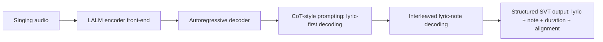
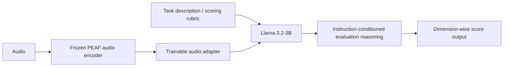
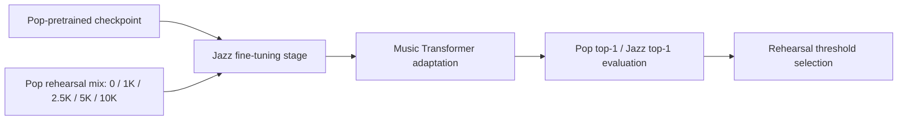

# 语音 / 音频 / 音乐论文速递
## 2026-05-08

> 实际对应 arXiv 更新日：**2026-05-06**  
> 检索范围：`cs.SD + eess.AS`  
> 只放按 ML 顶会审稿口径看，最值得多数读者花时间看的 **5 篇**

## 📋 总览

- 共收录 **5 篇** 相关论文
- 语音大模型 / 语音理解：**2 篇**
- 语音评测 / 音频评测：**1 篇**
- 语音前端：**1 篇**
- 音乐生成 / 音乐理解：**1 篇**

今天这批里，真正值得优先看的不是“谁又做了个更大模型”，而是三条更具体的线。`VocalParse` 把唱歌转写从“歌词、音高、对齐分别做”推进到统一自回归建模；`JASTIN` 不是泛泛谈 LLM-as-a-judge，而是把音频评测做成可迁移的指令跟随任务；`Spatial-Magnifier` 则是很实在的前端论文，直接回答“小阵列设备麦克风不够多，怎么靠虚拟通道把空间信息补回来”。

## 精选入选规则

- **新意（0-3）**：是不是提出了新的表示、接口、训练组织方式，或者把旧问题拆得更对
- **影响力（0-3）**：是不是贴近语音大模型、ASR、音乐理解、音频前端这些主线
- **证据强度（0-2）**：有没有像样的 baseline、消融和关键数值
- **受众匹配度（0-2）**：对语音大模型 / 语音前端 / 音乐方向 / 语音识别研究者有没有直接启发

分数校准：

- **6**：可读，但更像局部补丁
- **7**：信息量够，值得过一遍
- **8+**：建议优先精读

## 总览表

| 方向 | 序号 | 论文 | 评分 | 关键词 |
|---|---:|---|---:|---|
| 语音大模型 / 唱歌理解 | 1 | VocalParse | 8.5/10 | singing transcription, interleaved decoding, CoT prompting, SingCrawl |
| 语音评测 / 音频评测 | 2 | JASTIN | 8/10 | instruction-driven evaluation, PEAF, Llama-3.2-3B, zero-shot judge |
| 语音前端 | 3 | Spatial-Magnifier | 8/10 | virtual microphone, SARL, beamforming, multichannel enhancement |
| 音乐生成 / 和声 | 4 | Pop-Jazz Mix Ratios for Chord Generation | 7.5/10 | rehearsal, catastrophic forgetting, Music Transformer, chord generation |
| 语音大模型安全 | 5 | TAGO | 7.5/10 | audio jailbreak, sparse gradients, token-aware optimization, Qwen3-Omni |

## 🤖 语音大模型 / 语音理解

### [1] VocalParse: Towards Unified and Scalable Singing Voice Transcription with Large Audio Language Models

- **评分**：8.5/10
- **作者/机构**：Yukun Chen, Tianrui Wang, Zhaoxi Mu, Xinyu Yang, EngSiong Chng
- **论文链接**：https://arxiv.org/abs/2605.04613
- **PDF**：https://arxiv.org/pdf/2605.04613.pdf
- **代码链接**：**代码已开源** https://github.com/pymaster17/VocalParse

#### 📌 简介
这篇做的是统一唱歌转写：一句话说，就是把歌词转写、音符转写、词-音符对齐，不再拆成多模块流水线，而是交给一个统一的 LALM 自回归模型一次性生成。核心贡献有两个：一是 `interleaved lyric-note` 表示，二是配套的 `SingCrawl` 大规模伪标注数据流水线，把唱歌转写从“小数据集拼指标”拉到了可扩规模。

#### ☠️ 毒舌点评
这篇不算老套路换皮，关键点在于它没有满足于“把唱歌当 ASR”或者“把 AMT 和 ALT 分开做”，而是把结构化输出真正统一了。实验也不是糊弄，`CoT prompting` 和 `SingCrawl` 两个点都给了明确消融；对做语音大模型、歌声理解、歌词对齐的人来说，值得读。

#### 🔧 技术方案
- **模型解决的问题**：
  传统 SVT 往往把歌词识别、音高/时长估计、词音对齐拆成多个模块，误差会层层传递；而且公开数据太小，训练不出真正泛化的统一模型。`VocalParse` 解决的是“如何用统一大模型直接产出结构化唱歌转写结果，并且把数据规模做上去”。
- **模型架构**：
  - **输入**：歌声音频；可选歌词条件。
  - **输出**：交织的歌词 token、音符 token、时值 token，以及词-音符对应关系。
  - **主干**：基于 `Large Audio Language Model` 的统一自回归序列生成器。
  - **关键模块**：
    - `Interleaved Prompting`：把歌词与旋律统一编码成同一生成序列。
    - `CoT-style Prompting`：先生成纯歌词，再生成歌词+音符交织序列，先恢复连续语义，再补旋律结构。
    - `SingCrawl`：网页歌曲抓取、切分、分离、人声对齐、自动伪标注一整套数据管线。
- **信号流**：

- **训练 / 推理策略**：
  - 训练数据以 `SingCrawl` 自动构建的约 **2000 小时** 歌声数据为主。
  - 论文明确给出三阶段数据组织：预过滤、音频处理、自动标注。
  - 推理时支持统一解码，不再先做 ASR 再做 melody alignment。
  - `CoT-style prompting` 是关键推理策略，不是装饰项。

#### 📊 实验结果
- 数据集：`Opencpop`、`ACE-KiSing`、`OpenSinger`、`PopCS`
- 主要指标：
  - `ALT WER`：`Opencpop 3.79%`，`OpenSinger 5.69%`，`PopCS 8.16%`
  - `AMT / 结构指标（Opencpop, audio-only）`：`MAE_pitch 0.56`，`MAE_note 0.44`，`MAE_dur 0.34`，`Num_note 0.11`
  - 在 `Opencpop` 的更强 `Audio-Lyric` 设定下，`MAE_pitch 0.35`，`MAE_note 0.43`，`MAE_dur 0.33`
- 消融：
  - 去掉 `CoT` 后，`WER 3.79% -> 7.18%`
  - 去掉 `SingCrawl` 后，`WER 3.79% -> 4.86%`，`MAE_pitch 0.56 -> 0.94`
  - 加入大规模伪标注数据后，`BER 0.50 -> 0.47`，`IOU 0.46 -> 0.58/0.59`，`RPA 0.39 -> 0.72/0.74`
- baseline 对比：文中点名 `STARS`、`MusicYOLO` 等，`VocalParse` 在 `Opencpop` 上整体更优
- 是否开源：**是**

#### 评分：8.5/10
理由：这篇把“统一建模 + 可扩数据”两个真正卡脖子的点一起做了，而且实验给得硬。短板是暂时还主要集中在中文/公开歌声数据评测场景，但已经明显不是小修小补。

## 🧪 语音评测 / 音频评测

### [2] JASTIN: Aligning LLMs for Zero-Shot Audio and Speech Evaluation via Natural Language Instructions

- **评分**：8/10
- **作者/机构**：Leying Zhang, Bowen Shi, Haibin Wu, Bach Viet Do, Yanmin Qian
- **论文链接**：https://arxiv.org/abs/2605.04505
- **PDF**：https://arxiv.org/pdf/2605.04505.pdf
- **代码链接**：暂无明确开源

#### 📌 简介
这篇想解决的是“音频评测模型为什么总是换个任务描述就不会了”。作者把音频评测重写成指令驱动的推理任务：输入不只是音频，还包括自然语言 rubric，让模型按不同评分维度、不同打分标尺、不同文本描述去做 zero-shot 评测。

#### ☠️ 毒舌点评
这篇不是“拿大模型给分”那么浅，它真正有价值的是把评测问题做成了 instruction following，而不是死记某个固定指标。实验比很多 judge 类文章扎实，但它对时序特别敏感的维度还是弱，比如 speaking rate 这类项；做语音评测、MOS 预测、语音识别评估的人值得读。

#### 🔧 技术方案
- **模型解决的问题**：
  传统 `NISQA`、`UTMOS`、`AES` 这类指标模型校准固定、任务固定，换个描述方式或换个数据域就容易崩；通用 MLLM 又往往不懂音频细节。`JASTIN` 解决的是“如何把音频评测变成可迁移、可解释、可 zero-shot 的指令任务”。
- **模型架构**：
  - **输入**：原始音频 + 自然语言任务描述 / rubric / 评分要求。
  - **输出**：对应维度的文本化评分结果，再映射为数值分数。
  - **主干**：`frozen audio encoder + trainable audio adapter + Llama-3.2-3B`
  - **关键模块**：
    - 音频编码器使用 `PEAF-base` 系列特征；
    - 音频适配器是 `linear projection + bottleneck residual adapter`，压缩比 `4:1`；
    - 训练数据管线包含 `Multi-Source`、`Multi-Task`、`Multi-Calibration`、`Multi-Description`
- **信号流**：

- **训练 / 推理策略**：
  - 冻结音频编码器，训练 adapter 和 LLM。
  - loss 只算目标响应 token，不对输入 instruction 做无意义拟合。
  - 通过教师 LLM 做描述改写与多标尺扩增，核心目的是提升 instruction robustness。
  - 早停监控 `AES Speech PQ` 上的 `PCC`。

#### 📊 实验结果
- 数据集：`QualiSpeech`、`SpeechEval`、`AES`、`AudioMOS2025`、`DeepASMR`
- 和专用 / 通用 baseline 对比：
  - `QualiSpeech PCC`：
    - `JASTIN` 在 `Noise / Dist / Cont / Listen / Nat / Ovrl` 上分别为 `0.668 / 0.561 / 0.477 / 0.497 / 0.604 / 0.549`
    - 对比 `AES-CE` 的 `0.223 / 0.497 / 0.400 / 0.505 / 0.459 / 0.513`
    - 对比 `Qwen3-Omni` 的 `0.277 / 0.263 / 0.362 / 0.347 / 0.367 / 0.384`
  - `SpeechEval PCC`：
    - `JASTIN` 为 `0.662 / 0.655 / 0.690 / 0.481 / 0.564 / 0.509 / 0.534`
    - 整体优于 `SpeechEval*` 原模型的 `0.520 / 0.505 / 0.592 / 0.329 / 0.434 / 0.378 / 0.456`
  - `AES PCC`：
    - Speech: `0.531 / 0.594 / 0.601 / 0.707`
    - Sound: `0.542 / 0.618 / 0.495 / 0.569`
    - Music: `0.749 / 0.693 / 0.616 / 0.669`
    - 在多数项上超过 `AES`、`UTMOS`、`NISQA`、`Gemini-3-Pro+`、`Qwen3-Omni`
- 消融：
  - 完整数据配置 `S1` 比去掉 proxy-task 的 `S2` 更稳
  - 只用单一数据源的 `S3/S4` 泛化明显差
  - `PEAF-base / Llama3B` 显著优于 `GPT2` 版
- 是否开源：文中提到会公开模板和脚本，但当前没看到正式仓库

#### 评分：8/10
理由：这篇最大价值是把评测从“固定回归器”升级成“可被文字条件控制的音频 judge”。如果你做语音识别评测、TTS 打分、音频质量评估，它比很多空泛的 judge 文章更有方法论价值。

## 🧩 语音前端 / 多通道增强

### [3] Spatial-Magnifier: Spatial upsampling for multichannel speech enhancement

- **评分**：8/10
- **作者/机构**：Dongheon Lee, Ashutosh Pandey, Sanjeel Parekh, Daniel Wong, Jacob Donley, Buye Xu, Juan Azcarreta
- **论文链接**：https://arxiv.org/abs/2605.04749
- **PDF**：https://arxiv.org/pdf/2605.04749.pdf
- **代码链接**：暂无

#### 📌 简介
这篇解决的是一个很硬的工程问题：真实边缘设备塞不下很多物理麦克风，但多通道增强和波束形成又非常吃空间信息。作者提出 `Spatial-Magnifier` 从少量真实麦克风估计虚拟麦克风，再用 `SARL` 把这些虚拟空间线索喂给下游增强或波束形成模块。

#### ☠️ 毒舌点评
这篇是很典型的“前端论文该有的样子”：问题真，结构不花哨，实验做得细，而且成本收益算得明白。不是革命性新范式，但绝对不是堆名词；做语音前端、阵列处理、语音识别鲁棒前端的人值得读。

#### 🔧 技术方案
- **模型解决的问题**：
  传统多通道增强性能随着麦克风数增加而提升，但现实设备物理上放不下那么多麦。`Spatial-Magnifier` 解决的是“麦克风不够多时，能不能先补虚拟空间通道，再把下游增强性能拉回来”。
- **模型架构**：
  - **输入**：少通道 `real microphone (RM)` 多通道波形/时频表示。
  - **输出**：`virtual microphone (VM)` 信号或 VM feature，以及最终增强语音。
  - **主干**：`Spatial-Magnifier` 作为 Neural-VME 生成器，下游接 `SpatialNet + MCWF / MVDR / MC-RNN`
  - **关键模块**：
    - `SARL-S`：直接输出 VM waveform，做 signal-level augmentation
    - `SARL-F`：输出 VM feature，做 feature-level augmentation
    - `Selection Module`
    - `DCA (Dynamic Channel Allocation)`
- **信号流**：

- **训练 / 推理策略**：
  - 同时优化 Neural-VME 与下游 VM-BF / VM-SE；
  - 论文明确比较冻结与联合训练；
  - 通过时域 SNR 类目标和下游增强指标联合训练；
  - 在 `omni-SE`、`FoV-SE` 和不同阵列几何上测试泛化。

#### 📊 实验结果
- 数据与场景：模拟空间语音数据，覆盖 `RM:2ch`、`VM:1/4/8ch`，并测试 smart-glasses 等不同阵列
- 关键结果：
  - `SARL-S` 在 `RM 2ch / VM 4ch` 时，`VM-BF` 指标可到 `SI-SDR 7.10`、`SNR 8.09`、`PESQ 2.40`、`STOI 82.1`
  - 对比 `SpatialNet + MCWF 2ch` 基线的 `2.19 / 4.57 / 1.97 / 70.4`，提升很明显
  - `2ch-RM / 1ch-VM` 的 SARL 版本可超过物理 `3ch-RM` 基线
  - `2ch-RM / 8ch-VM` 的结果已逼近物理 `10ch` 系统
  - 组合 `SpatialNet-small + Spatial-Magnifier` 的成本远低于 `SpatialNet-large 2ch`：
    - 参数量 `2.7M vs 6.5M`
    - 计算量 `44.2 GMAC/s vs 110 GMAC/s`
  - `Selection Module` 和 `DCA` 每个只增加约 `0.1M params + 0.1 GMAC/s`
- baseline 对比：`Neural-VME`、`SpatialNet-VME`、`SpatialNet + MCWF`、`MVDR`、`MC-RNN`
- 是否开源：暂未明确

#### 评分：8/10
理由：这是很稳的语音前端论文。方法不浮夸，结论也不靠语言包装，适合做阵列前端、鲁棒 ASR 前端、语音增强部署的人直接借鉴。

## 🎼 音乐生成 / 音乐理解

### [4] Empirical Study of Pop and Jazz Mix Ratios for Genre-Adaptive Chord Generation

- **评分**：7.5/10
- **作者/机构**：Jinju Lee
- **论文链接**：https://arxiv.org/abs/2605.04998
- **PDF**：https://arxiv.org/pdf/2605.04998.pdf
- **Demo / Checkpoints**：https://huggingface.co/PearlLeeStudio

#### 📌 简介
这篇不追求做“全能音乐模型”，而是很聚焦地研究：一个在 `pop` 上预训练的和弦生成器，迁移到 `jazz` 时，到底需要混入多少原始 `pop rehearsal` 数据，才能既学会 jazz，又不把 pop 忘光。核心贡献不是新架构，而是把 rehearsal ratio 这个实际训练问题量化清楚了。

#### ☠️ 毒舌点评
创新不在模型，而在问题问得准。它更像一篇“把 continual learning 里的 rehearsal 讲明白”的经验论文，不是 flashy paper；但如果你做音乐生成、风格迁移或者任何跨域微调，这篇非常有参考价值。

#### 🔧 技术方案
- **模型解决的问题**：
  `pop -> jazz` 微调时，模型容易灾难性遗忘原来的 pop 和声流畅性。本文解决的是“要保留多少源域 rehearsal 数据，才能在新风格增益和旧风格保真之间找到平衡”。
- **模型架构**：
  - **输入**：统一 tokenizer 编码的 chord progression 序列
  - **输出**：下一和弦 token / 和弦序列生成结果
  - **主干**：`25M parameter Music Transformer`
  - **关键模块**：
    - 并没有引入新模块，核心变量就是 `pop rehearsal mix size`
    - 混合比例扫描：`0 / 1K / 2.5K / 5K / 10K`
- **信号流**：

- **训练 / 推理策略**：
  - 固定全部 `1513` 条 jazz 训练序列；
  - 改变混入的 pop rehearsal 体量；
  - 用 held-out `pop / jazz` top-1, top-5 和 perplexity 评估；
  - 选 best epoch 时还加了“pop top-1 不得掉太多”的约束。

#### 📊 实验结果
- 关键数字：
  - `Phase 0` pop 基线：`84.24% top-1`
  - 同一模型直接测 jazz：`72.86% top-1`
  - 所有 fine-tune 版本都能把 jazz top-1 提升 **7-9 个点**
  - 纯 jazz 微调 `F5` 会让 pop top-1 下降 `2.14` 个点
  - `F3 (2.5K mix)` 基本恢复到 pop 基线，`Δpop = -0.04`
  - `F4 (1K mix)` 的 jazz top-1 增益最高，`+8.64`
- 结论：
  - rehearsal 阈值大约在 `1K ~ 2.5K`
  - 更具体地说，大约需要 `1.5x ~ 2x` 目标域体量，才能把遗忘压住
  - `2.5K` 是指标最平衡点，但作者也明确说不一定是听感最优点
- 是否开源：**checkpoint 已公开**

#### 评分：7.5/10
理由：没有模型创新，但结论实用，而且讲清了 rehearsal 到底值多少。做音乐生成 fine-tune、风格迁移、数据配比实验的人，会直接用得上。

## 🔐 语音大模型安全

### [5] Sparse Tokens Suffice: Jailbreaking Audio Language Models via Token-Aware Gradient Optimization

- **评分**：7.5/10
- **作者/机构**：Zheng Fang, Xiaosen Wang, Shenyi Zhang, Shaokang Wang, Zhijin Ge
- **论文链接**：https://arxiv.org/abs/2605.04700
- **PDF**：https://arxiv.org/pdf/2605.04700.pdf
- **代码链接**：暂无

#### 📌 简介
这篇研究音频大模型越狱攻击，但真正有意思的点不只是“又一个 attack”，而是它发现 ALM 上的梯度能量在 token 维度极不均匀。于是作者提出 `TAGO`，每步只保留高能 token 对应的梯度区域做更新，结果在保留极少 token 时，攻击成功率几乎不掉。

#### ☠️ 毒舌点评
这类安全论文很容易陷入“调个攻击器、刷个成功率”的套路，但这篇至少给出了一个值得记住的结构性观察：音频越狱优化里， dense waveform update 大量是无效功。对做 audio LLM 安全、鲁棒性、对抗优化的人值得读；对纯应用同学则未必优先。

#### 🔧 技术方案
- **模型解决的问题**：
  现有 ALM 越狱攻击通常对整段 waveform 做 dense optimization，计算重，而且未必必要。`TAGO` 解决的是“能不能只更新最关键的 token 对应波形区域，还保持差不多的攻击效果”。
- **模型架构**：
  - **输入**：原始音频 `x`、固定文本 prompt、目标 harmful prefix
  - **输出**：加扰后的 adversarial audio
  - **主干**：不是新 ALM，而是作用于 `Qwen3-Omni / Qwen2.5-Omni / LLaMA-Omni` 的攻击优化器
  - **关键模块**：
    - token-aligned gradient energy 统计
    - `Top-zeta` token 选择
    - 稀疏波形 mask 更新
    - EOS 抑制避免提前终止
- **信号流**：

- **训练 / 推理策略**：
  - 这不是训练论文，核心是迭代优化；
  - 最大迭代数 `K=500`；
  - 支持 token retention ratio `ζ` 控制稀疏度；
  - 用 early stopping 阈值控制攻击停止时机。

#### 📊 实验结果
- 数据集：`AdvBench-50`，另有 `HarmBench`
- 关键数字：
  - 在 `Qwen3-Omni` 上，`TAGO (ζ=1.0)`：`ASRr 100`, `ASRl 87`
  - 在 `Qwen3-Omni` 上，`TAGO (ζ=0.25)`：`ASRr 99`, `ASRl 86`
  - 也就是只保留四分之一 token，效果几乎没掉
  - 文中还指出：`top 16%` audio tokens 已占到约 `90%` 梯度能量
  - 极稀疏时仍有非平凡效果：`ζ=0.05` 时，`ASRr 97%`、`ASRl 67%`
- baseline 对比：
  - 明显优于 `Direct`、`AdvWave`、`Post-hoc prune`
  - `Post-hoc prune (ζ=0.25)` 在 `Qwen3-Omni` 上只有 `ASRr 9 / ASRl 1`
- 是否开源：暂未明确

#### 评分：7.5/10
理由：这是安全方向里相对有“结构洞见”的一篇，不只是刷攻击成功率。它的直接启发是，后面做 defense 或鲁棒训练时，可能也该盯 token-level 关键区域，而不是把整段波形一视同仁。

## 最后结论

如果只让我排今天最值得优先精读的 3 篇，会是：

1. **VocalParse**
   这是今天最像“真正把任务重新组织了一遍”的论文，统一转写结构和数据管线都做到了。
2. **JASTIN**
   如果你做语音评测、ASR/TTS 打分、LLM-as-a-judge，这篇的方法论价值很高。
3. **Spatial-Magnifier**
   做前端和阵列处理的人基本可以直接借结构和实验结论。

今天这批没有那种“改变赛道格局”的神稿，但有几篇都属于能直接改你实验设计的论文。尤其 `VocalParse` 和 `Spatial-Magnifier`，都不是空泛讲故事，而是在具体任务上把结构和证据都给全了。
