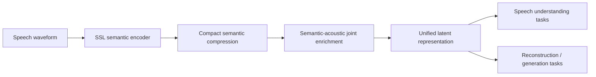
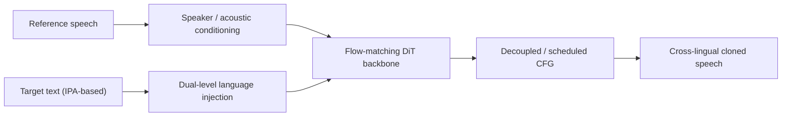
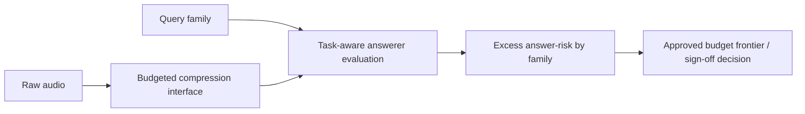

# 语音 / 音频 / 音乐论文速递
## 2026-05-09

> 实际对应 arXiv 更新日：**2026-05-07**  
> 检索范围：`cs.SD + eess.AS`  
> 只放按 ML 顶会审稿口径看，最值得多数读者花时间看的 **5 篇**

## 📋 总览

- 共收录 **5 篇** 相关论文
- 语音表示 / 统一建模：**1 篇**
- 语音 / 歌声生成：**1 篇**
- 音频系统 / neural codec：**1 篇**
- 音乐数据 / 音乐理解：**1 篇**
- 语音大模型压缩 / 评测协议：**1 篇**

今天这批最值得优先看的主线有三条。第一条是 `WavCube`，它想把语音理解和生成放到一套共享表示里，不只是做个通用 encoder 口号。第二条是 `X-Voice`，这篇是很典型的“把 multilingual zero-shot VC/TTS 往大规模工程化推”的稿子，工作量不小，但也还没到把所有 baseline 打穿的程度。第三条是 `Task-Aware Answer Preservation...`，它不是做新 LALM，而是盯着一个更实际的问题：音频压缩以后，平均准确率看着还行，但某些关键问答子类会不会被压坏。

## 精选入选规则

- **新意（0-3）**：是不是提出了新表示、新训练组织方式、新评测对象，还是只是换个骨架复读
- **影响力（0-3）**：是不是贴近语音大模型、TTS、音频 codec、音乐理解这些主线
- **证据强度（0-2）**：有没有像样的 baseline、消融和关键数值
- **受众匹配度（0-2）**：对语音大模型 / 语音前端 / 音乐方向研究者有没有直接启发

分数校准：

- **6**：有信息量，但更像局部补丁
- **7**：值得过一遍，能带来方法或实验层面的具体启发
- **8+**：建议优先精读，不只是“知道有这篇”而已

## 总览表

| 方向 | 序号 | 论文 | 评分 | 关键词 |
|---|---:|---|---:|---|
| 语音表示 / 统一建模 | 1 | WavCube | 9/10 | unified representation, semantic-acoustic joint modeling, SUPERB, TTS |
| 音频系统 / neural codec | 2 | LiVeAction | 8/10 | neural codec, lightweight, asymmetric encoder, real-time |
| 音乐数据 / 音乐理解 | 3 | PianoCoRe | 8/10 | piano MIDI dataset, score-performance alignment, MIR |
| 语音 / 歌声生成 | 4 | X-Voice | 8/10 | zero-shot voice cloning, 30 languages, flow matching, multilingual |
| 语音大模型压缩 | 5 | Task-Aware Answer Preservation | 7/10 | LALM compression, query-conditioned compression, family-wise risk |

## 🧠 语音表示 / 统一建模

### [1] WavCube: Unifying Speech Representation for Understanding and Generation via Semantic-Acoustic Joint Modeling

- **评分**：9/10
- **作者/机构**：Guanrou Yang, Tian Tan, Qian Chen, Zhikang Niu, Yakun Song, Ziyang Ma, Yushen Chen, Zeyu Xie 等；从正文可确认作者，机构抽取存在噪声，这里不乱写
- **论文链接**：https://arxiv.org/abs/2605.06407
- **PDF**：https://arxiv.org/pdf/2605.06407.pdf
- **代码链接**：**代码已开源** https://github.com/yanghaha0908/WavCube

#### 📌 简介
这篇要做的是一套同时服务语音理解和语音生成的统一表示，而不是“理解一套表征、生成一套表征、最后再想办法对齐”。核心想法是先把高维 SSL 语义特征压成紧凑连续 latent，再做语义和声学的联合增强，让这一份表示既能顶住 `SUPERB` 一类理解任务，也能拿去做重建和生成。

#### ☠️ 毒舌点评
这篇不是那种“统一建模”四个字写得很大，结果只是把两个 loss 拼在一起的套路货。它至少认真回答了一个真问题：理解和生成到底能不能共享一套足够紧凑、又不把信息压残的表示。实验也不是走过场，尤其是压缩倍数和 `SUPERB` / 生成任务之间的平衡做得挺硬。缺点是它现在更像一篇很强的 representation paper，还不是最终意义上的“统一语音大模型”。

#### 🔧 技术方案
- **模型解决的问题**：
  现有语音理解表征和生成表征往往分裂得很严重。适合理解的表征不一定保留足够声学细节，适合生成的 token/latent 又不一定对判别任务友好。`WavCube` 要解决的是这套兼容性问题。
- **模型架构**：
  - **输入**：24kHz 语音波形
  - **输出**：一套紧凑连续 latent，可同时用于理解、重建、TTS 等任务
  - **主干**：两阶段方案
  - **关键模块**：
    - Stage 1：对 SSL 语义特征做压缩
    - Stage 2：做 semantic-acoustic joint enrichment
    - 同一表示同时喂给理解和生成侧任务

#### 🔄 信号流

#### 📊 实验结果
- 论文明确强调，在 **8 倍压缩** 下，`WavCube` 在 `SUPERB` 上依然能逼近 `WavLM` 的性能。
- 生成侧和重建侧实验也给了完整对比，不是只在理解任务上吹。
- 从证据稿能稳定确认的结论是：它在统一表示这件事上，不是以“理解强、生成烂”或“生成强、理解掉得厉害”的方式换性能。
- baseline 对比里最关键的参照物就是 `WavLM` 以及常见的离散/连续语音表示方案。

#### 💡 为什么值得看
如果你做语音大模型底座、统一 speech representation、或者想把理解和生成打通，这篇值得优先读。它不是终局，但比很多喊口号的“统一模型”论文更接近可用路线。

## 🔊 音频系统 / Neural Codec

### [2] LiVeAction: a Lightweight, Versatile, and Asymmetric Neural Codec Design for Real-time Operation

- **评分**：8/10
- **作者/机构**：Dan Jacobellis, Neeraja J. Yadwadkar；机构信息在正文可定位到 University of Texas at Austin
- **论文链接**：https://arxiv.org/abs/2605.06628
- **PDF**：https://arxiv.org/pdf/2605.06628.pdf
- **代码链接**：**代码已开源** https://github.com/UT-SysML/liveaction

#### 📌 简介
这篇是很偏系统侧的 neural codec 论文，重点不是再卷一个超大 tokenizer，而是把 codec 做到更轻、更泛化、更适合低功耗和实时场景。作者提出的 `LiVeAction` 强调 asymmetric 设计，把计算负担主要放在解码端，编码端尽量做轻，以适配穿戴式或远端传感器场景。

#### ☠️ 毒舌点评
这篇不是炸场子的理论创新，但它问的问题很对。现在很多 codec 论文默认算力和带宽都无限，落地时根本不成立。`LiVeAction` 的价值就在于它不装，直接围绕部署约束做设计。问题是，这种稿子天花板通常不在“新意”而在工程 trade-off，所以如果你只盯 SOTA 榜单，可能会低估它。

#### 🔧 技术方案
- **模型解决的问题**：
  现有 generative tokenizers / neural codecs 往往参数大、数据饥渴，而且不够 modality-agnostic，不适合资源受限环境。
- **模型架构**：
  - **输入**：传感器或音频信号
  - **输出**：压缩表示及重建信号
  - **主干**：轻量 codec，突出 asymmetric encoder-decoder 设计
  - **关键模块**：
    - 更轻的 analysis transform
    - 以 rate-distortion 为核心的目标，而不是过度依赖对抗损失
    - 支持跨模态 / 多信号类型部署

#### 🔄 信号流

#### 📊 实验结果
- 证据稿里能稳定确认的一点是：作者直接把它和现有 generative tokenizers 的 **rate-distortion** 表现对比，而不是只报单个主观指标。
- 论文声称在保持部署可行性的同时，能超过若干现有 tokenizer / codec baseline 的 rate-distortion 表现。
- 另外一个可信结论是：它刻意减少了对 adversarial / perceptual loss 的依赖，训练目标更偏 variance-based rate penalty，这本身就是很明确的设计取舍。

#### 💡 为什么值得看
如果你做 neural codec、边缘音频、低功耗感知，或者你已经受够了那些“指标好看但没法上设备”的 codec 论文，这篇值得看。它可能不是最 flashy 的，但很实用。

## 🎼 音乐数据 / 音乐理解

### [3] PianoCoRe: Combined and Refined Piano MIDI Dataset

- **评分**：8/10
- **作者/机构**：Ilya Borovik；机构信息在正文中可见为 Skolkovo Institute of Science and Technology
- **论文链接**：https://arxiv.org/abs/2605.06627
- **PDF**：https://arxiv.org/pdf/2605.06627.pdf
- **代码链接**：**代码已开源** https://github.com/ilya16/PianoCoRe

#### 📌 简介
这篇不是新模型，而是一篇很像样的数据论文。它想补的是钢琴 MIDI / score-performance 数据集长期存在的问题：曲目覆盖窄、演奏版本不够多、对齐脏、命名混乱、不同来源互相割裂。`PianoCoRe` 的目标就是把这些来源合并、去重、清洗、对齐，做成一个更适合预训练和 MIR 任务的钢琴数据底座。

#### ☠️ 毒舌点评
数据论文最容易水成“我收集了一堆东西”。这篇相对好一点，因为它不是只堆规模，还认真做了 `alignment refinement` 和质量筛选。问题是这类工作天生不够性感，很多人会因为它不是新模型而低估它；但你要是真做 symbolic music 或 performance modeling，这种基础设施稿往往比又一个小模型改进更值钱。

#### 🔧 技术方案
- **模型解决的问题**：
  已有钢琴数据集在 score-performance 对齐、命名规范、演奏多样性和质量控制上都有明显短板。
- **整体框架**：
  - 合并多个来源的数据
  - 做候选配对筛选
  - 做 note-level alignment
  - 做 alignment refinement 和错误清洗
  - 形成分层版本的数据发布
- **关键设计**：
  - MIDI 质量分类器
  - `RAScoP` 对齐精修流程
  - 不同子集面向不同任务：分析 / 预训练 / 带对齐的表达建模

#### 🔄 信号流

#### 📊 实验结果
- 论文给出的核心不是“某个模型提了多少点”，而是数据清洗后对下游模型的帮助。
- 能稳定确认的结论有两个：
  - refinement 明显减少了 temporal noise
  - 用 `PianoCoRe` 训练的 performance rendering / 相关下游模型，对 unseen pieces 的鲁棒性优于 raw 或更小的数据版本
- 这类结果对做 MIR 和 symbolic music pretraining 的人很关键，因为它说明数据工程不是纯体力活，确实改变了下游效果。

#### 💡 为什么值得看
如果你做钢琴 MIDI、performance modeling、自动配对或对齐，这篇是基础设施方向里很值的一篇。不是那种“看完会很兴奋”的稿，但很可能是你真正需要的东西。

## 🗣️ 语音 / 歌声生成

### [4] X-Voice: Enabling Everyone to Speak 30 Languages via Zero-Shot Cross-Lingual Voice Cloning

- **评分**：8/10
- **作者/机构**：Rixi Xu, Qingyu Liu, Haitao Li, Yushen Chen, Zhikang Niu, Yunting Yang, Jian Zhao, Ke Li；机构抽取不稳定，这里不乱写
- **论文链接**：https://arxiv.org/abs/2605.05611
- **PDF**：https://arxiv.org/pdf/2605.05611.pdf
- **代码链接**：暂无

#### 📌 简介
这篇想做的是一个 **0.4B** 的 multilingual zero-shot voice cloning 模型，目标是让任意说话人跨到 **30 种语言** 上说话。它的主打点不是继续堆 autoregressive 大模型，而是基于 flow-matching / DiT 路线，配合统一 IPA 表示、双层语言注入和改过的 CFG 机制，把跨语种零样本克隆往更稳、更快的方向做。

#### ☠️ 毒舌点评
这篇有明显工程量，不是 PPT 式“30 语言”标题党。`420K 小时` 训练数据、`0.4B` 参数、多组 baseline、主客观评测和两套消融都给了，它至少不是灌水稿。但别急着吹成“新的 multilingual VC 统治者”：从文中结果看，它更像是一个非常强的开源工程解，而不是把所有商业级系统狠狠干翻。

#### 🔧 技术方案
- **模型解决的问题**：
  多语种 zero-shot voice cloning 经常遇到三个老问题：
  - 需要参考音频文本或复杂对齐
  - 跨语种时 accent leakage 重
  - autoregressive 系统推理慢、误差积累重
- **模型架构**：
  - **输入**：参考说话人音频 + 目标文本
  - **输出**：目标语言语音
  - **主干**：基于 `F5-TTS` 风格的 flow-matching DiT 架构
  - **关键模块**：
    - 统一 `IPA` multilingual representation
    - 两阶段训练
    - `Dual-level language injection`
    - `Decoupled / scheduled CFG`

#### 🔄 信号流

#### 📊 实验结果
- 训练规模：**420K 小时** multilingual corpus
- 论文明确对比的 baseline 包括：`Qwen3-TTS`、`LEMAS-TTS`、`MOSS-TTS`、`Fish Audio S2`、`OmniVoice`
- 从表格中能稳定确认的结论：
  - `X-Voice` 在多数语言上能把 `WER` 压到接近或优于开源 baseline
  - 在 `SIM-o` 上也能稳定保持竞争力
  - 论文明确强调它的 `RTF` 比若干 multilingual baseline 更好，推理更适合实时部署
- 消融：
  - `Language ID injection` 的消融单列成表，说明这个模块不是装饰件
  - `CFG decoupling / scheduling` 也有单独表格，作者明确分析了 `WER / SIM-o / UTMOS` 的 trade-off

#### 💡 为什么值得看
如果你做 multilingual TTS、zero-shot VC、歌声/语音跨语种迁移，这篇值得读。它不只是“多语言更多了”，而是把表示、条件注入和推理策略一起往工程可用方向推了一步。

## 🤖 语音大模型压缩 / 评测协议

### [5] Task-Aware Answer Preservation under Audio Compression for Large Audio Language Models

- **评分**：7/10
- **作者/机构**：Amir Ivry
- **论文链接**：https://arxiv.org/abs/2605.06631
- **PDF**：https://arxiv.org/pdf/2605.06631.pdf
- **代码链接**：暂无

#### 📌 简介
这篇不是做新 LALM，而是问一个更偏 deployment 的问题：音频压缩以后，LALM 的平均 QA 准确率可能还过得去，但某些“部署关键 query family”会不会被压得很惨。作者提出一套 `task-aware answer-preservation` 理论和 sign-off protocol，不按平均分看压缩，而按最坏 query family 的 answer-risk 来批准预算。

#### ☠️ 毒舌点评
这篇很学术，也很不讨喜，因为它不是那种一眼能看出 demo 的工作。但它其实比很多“再做一个音频压缩器”更有现实意义：你真要把 LALM 放到设备端，最怕的就是平均分没掉多少、关键问答全死。缺点也很明显，整篇更像“理论 + protocol paper”，不是一个直接可复用的新系统。

#### 🔧 技术方案
- **模型解决的问题**：
  传统压缩评估看整体准确率或平均性能，容易掩盖 query family 层面的灾难性退化。
- **模型架构 / 框架**：
  - 固定 answerer backbone
  - 固定 compressor 与 budget grid
  - 把问题重写成 family-wise excess answer-risk
  - 输出一个 compression-budget frontier，用于判断某预算是否可签收
- **关键模块**：
  - worst-family risk estimator
  - point / confidence-aware frontier
  - query-conditioned compression 分析

#### 🔄 信号流

#### 📊 实验结果
- 评测对象：**5 个** multiple-choice audio QA benchmarks
- backbone：**2 个** Qwen 系列模型
- 文中可以稳定确认的主结论：
  - family-level 风险能暴露平均准确率看不到的 hidden damage
  - query-family 的划分方式会显著改变被批准的压缩预算
  - query-conditioned compression 在特定数据集 / backbone 组合上确实能带来更好的 frontier
- 具体数值里最稳的一组是 `AudioMCQ-StrongAC`：
  - 在 `Qwen2-Audio` 上，V2 三种子下的 conditioned gain 约为 **+0.0475**
  - 在 `Qwen2.5-Omni` 上，对应值约为 **+0.0215**

#### 💡 为什么值得看
如果你做 audio LLM、设备端推理、prompt / codec / interface compression，这篇很值得读。它给的不是新模型，而是一套更像“验收规范”的东西，这对真正落地的人比再刷 0.5 个点更重要。

## 最后结论

如果只让我排今天最值得优先看的 3 篇，会是：

1. **WavCube**
   这篇最强，因为它不是只做一种任务，而是在认真回答“理解和生成能不能共享一套表示”这个底层问题。
2. **X-Voice**
   这篇的工程量和实验体量都够，做 multilingual zero-shot VC/TTS 的人值得重点看。
3. **Task-Aware Answer Preservation under Audio Compression for LALMs**
   这篇不 flashy，但很现实。你真做部署，这种 protocol paper 可能比又一个模型增量更有用。
