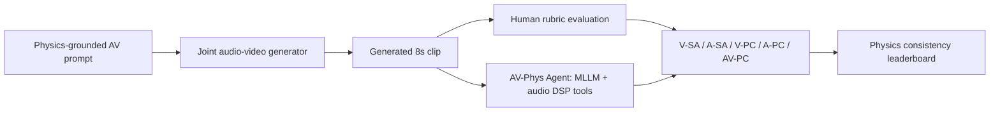
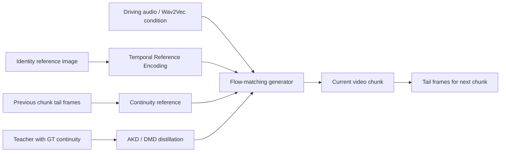

# 语音 / 音频 / 音乐论文速递
## 2026-05-11

> 实际对应 arXiv 更新日：**2026-05-11**  
> 检索范围：`cs.SD + eess.AS`  
> 只放按 ML 顶会审稿口径看，最值得多数读者花时间看的 **5 篇**

## 📋 总览

- 共收录 **5 篇** 相关论文
- 语音大模型 / 语音交互：**1 篇**
- 音视频生成 / 音频驱动视觉生成：**2 篇**
- 音乐理解 / 音乐分析：**1 篇**
- 音乐生成 / 和弦生成：**1 篇**

今天这批不是传统 ASR/TTS/codec 主线爆发，而是更偏“音频作为多模态系统的一部分”。最值得优先看的是 `MIST`，它把智能家居语音助手评测从单轮意图识别推进到带设备状态、历史对话、工具调用和纠错的 speech-based agent 场景；`AV-Phys Bench` 则盯住联合音视频生成的物理一致性，尤其是声音和画面是否真的对应同一个物理事件；`AsymTalker` 是音频驱动 talking head 生成，虽然偏视觉，但它针对长视频身份漂移的问题给了比较完整的蒸馏方案和 600 秒稳定性结果。

另外两篇更偏音乐方向：钢琴 repertoire profiling 论文把自动转录和信息论分析串成可复现 pipeline；`RER Chord Generation` 用检索、编辑、重排拆开和弦生成里的风格多样性与乐理可行性，适合做符号音乐生成的人看。

## 精选入选规则

- **新意（0-3）**：是不是提出了新的评测对象、建模接口、训练组织方式，或者把旧问题拆得更清楚
- **影响力（0-3）**：是不是贴近语音大模型、音视频生成、音乐理解/生成这些主线
- **证据强度（0-2）**：有没有明确 baseline、消融和关键数值
- **受众匹配度（0-2）**：对语音大模型 / 多模态音频 / 音乐方向 / 生成系统研究者有没有直接启发

分数校准：

- **6**：可读，但更像局部补丁或窄场景分析
- **7**：信息量够，值得过一遍
- **8+**：当天建议优先精读

## 总览表

| 方向 | 序号 | 论文 | 评分 | 关键词 |
|---|---:|---|---:|---|
| 语音大模型 / 工具调用 | 1 | MIST | 8.5/10 | speech agent, tool-calling, smart home, MLLM benchmark, spoken dialogue |
| 音视频生成评测 | 2 | AV-Phys Bench | 8/10 | audio-video generation, physical commonsense, DSP tools, AV consistency |
| 音频驱动视觉生成 | 3 | AsymTalker | 7.5/10 | talking head, identity drift, TRE, asymmetric distillation, 66 FPS |
| 音乐理解 / 信息论分析 | 4 | Audio-to-analysis piano pipeline | 7/10 | piano transcription, MAESTRO, Shannon entropy, KL divergence, Zipf |
| 音乐生成 / 和弦生成 | 5 | Retrieval-Edit-Rerank Chord Generation | 7/10 | chord generation, retrieval, Viterbi editing, reranking, symbolic music |

## 🤖 语音大模型 / 语音交互

### [1] MIST: Multimodal Interactive Speech-based Tool-calling Conversational Assistants for Smart Homes

- **评分**：8.5/10
- **作者/机构**：Maximillian Chen, Xuanming Zhang, Michael Peng, Zhou Yu, Alexandros Papangelis, Yohan Jo
- **论文链接**：https://arxiv.org/abs/2605.06897
- **PDF**：https://arxiv.org/pdf/2605.06897.pdf
- **代码链接**：暂无明确开源
- **Demo 链接**：https://billyzhang24kobe.github.io/mist-smarthome/

#### 📌 简介
这篇做的是语音智能体评测，不是普通 intent classification。`MIST` 构造了一个智能家居场景下的 spoken dialogue + tool-calling benchmark：模型要听用户语音，结合房屋结构、设备状态、历史对话和 routines，决定是执行工具、追问澄清、拒绝请求，还是纠正已有动作。

#### ☠️ 毒舌点评
这篇比很多“语音助手 benchmark”更有用，因为它不是只问模型听懂没听懂，而是直接考“听懂以后敢不敢正确操作现实设备”。实验也很刺眼：开源音频模型在执行匹配上看起来还行，但 exact match 基本崩，说明它们常常只是大概知道要操作，却写不出可执行、状态一致的工具调用。做 speech agent、语音大模型、智能家居助手的人应该优先读。

#### 🔧 技术方案
- **模型解决的问题**：
  现有语音助手评测多停在单轮命令、意图识别或文本化 QA，无法覆盖真实智能家居里的多设备歧义、历史状态、冗余请求、澄清和工具执行。`MIST` 解决的是“语音大模型能不能在复杂 home context 里做正确 tool calling 和对话动作选择”。
- **模型架构 / 评测框架**：
  - **输入**：用户当前语音请求、smart home layout、设备 capabilities、home state、已有对话历史、routine manager 状态。
  - **输出**：可执行的设备控制代码 / tool call，或对话动作标签，例如澄清、确认、拒绝、纠错。
  - **主干**：benchmark + simulator + MLLM evaluation，不是一个新模型。
  - **关键模块**：
    - neuro-symbolic data generation framework：采样 home、device、routine、persona、acoustic profile 和交互意图。
    - 50 类 smart home device，覆盖多房间、多能力、重复设备等真实歧义。
    - 两类核心评测：`Code Intelligence` 和 `Conversational Intelligence`。
    - 专家人工抽检 300 个样本，关键任务标注一致率超过 `90%`。
- **信号流**：

- **关键设计 / 核心创新**：
  - 把语音理解和工具执行绑定起来，避免模型只在文本答案上“看起来懂了”。
  - 数据里显式构造 ambiguity、correction、redundancy、device duplicates，这些都是真实语音助手最容易出事故的地方。
  - 评测不靠 BLEU/ROUGE，而是用 execution match、exact match、dialogue action F1/accuracy。
- **训练 / 推理策略**：
  - 本文主要是 benchmark，不训练新模型。
  - 评测模型包括 `Qwen Audio`、`Qwen 2 Audio`、`SALMONN 7B`、`Soundwave`、`Qwen 3 Omni`、`Gemini 2.5 Flash-Lite`、`Gemini 2.5 Flash`、`Gemini 2.5 Pro`。
  - 推理时模型直接接收语音请求和结构化 home context，再生成工具调用或对话动作。
  - 论文还报告 few-shot 结果，但主结论来自 zero-shot 设置。

#### 📊 实验结果
- 数据规模：`10,000` 段 conversations，`88.1` 小时 spoken dialogue，`50` 类 device，平均 `5.6` 个 user turns。
- Code Generation：
  - `Gemini 2.5 Pro`：`Exec Match 79.53`，`Exact Match 65.56`
  - `Gemini 2.5 Flash`：`78.61 / 63.95`
  - `Qwen 3 Omni`：`59.86 / 47.19`
  - `Qwen Audio / Qwen 2 Audio / SALMONN / Soundwave` 的 Exact Match 只有 `1.18 / 0.45 / 1.01 / 2.26`
  - `Previous State` baseline 的 Exec Match 有 `71.62`，说明很多请求本来就不该执行动作，模型容易 overtrigger。
- Conversational Intelligence：
  - `Gemini 2.5 Pro`：`Macro F1 46.00`，`Accuracy 66.73`
  - `Gemini 2.5 Flash`：`42.17 / 63.57`
  - `Qwen 3 Omni`：`14.54 / 28.64`
  - `Constant Prediction`：`Macro F1 9.13`，`Accuracy 37.74`
  - 多数开源模型的 Macro F1 甚至接近或低于常数预测 baseline。
- baseline 对比：`Qwen Audio`、`Qwen 2 Audio`、`SALMONN 7B`、`Soundwave`、`Qwen 3 Omni`、`Gemini 2.5` 系列、`Initial State`、`Previous State`、`Constant Prediction`
- 是否开源：文中说 release MIST，但正文未看到明确 GitHub 仓库链接

#### 💡 为什么值得看
这篇的价值在于把“语音大模型能不能当 agent”落到了真实可执行任务上。它直接暴露了当前开源音频模型在工具调用精确性和对话动作选择上的短板，比只测 ASR WER 或语音 QA 更贴近真实产品风险。

#### 评分：8.5/10
理由：任务设定准，数据规模和评测指标都扎实，对 speech agent 很有参考价值。扣分点是它主要是 benchmark，不是新模型方法。

## 🎬 音视频生成评测

### [2] Do Joint Audio-Video Generation Models Understand Physics?

- **评分**：8/10
- **作者/机构**：Zijun Cui, Xiulong Liu, Hao Fang, Mingwei Xu, Jiageng Liu, Zexin Xu, Weiguo Pian, Shijian Deng
- **论文链接**：https://arxiv.org/abs/2605.07061
- **PDF**：https://arxiv.org/pdf/2605.07061.pdf
- **代码链接**：暂无明确开源
- **数据集链接**：https://huggingface.co/datasets/ZijunCui/AV-Phys-Bench

#### 📌 简介
这篇做的是联合音视频生成模型的物理常识评测。作者提出 `AV-Phys Bench`，专门检查生成视频里的画面和声音是否遵守同一个物理事件：比如遮挡后声音应变闷、敲击和声响应同步、环境变化应改变混响或响度。

#### ☠️ 毒舌点评
这篇不是传统语音论文，但对音频生成很有参考价值。很多 T2AV 模型现在会生成“语义上像”的声音和画面，但物理关系是乱的；这篇把问题拆成 visual semantic、audio semantic、visual physics、audio physics、cross-modal physics 五个维度，比只看 FAD/FVD 或 CLIP 对齐更能抓到系统性失败。

#### 🔧 技术方案
- **模型解决的问题**：
  现有音视频生成评测大多关注画质、音质、同步或语义相关性，却不判断声音和画面是否符合真实物理关系。`AV-Phys Bench` 解决的是“生成模型是否真的理解音频-视觉事件的物理耦合，而不是只生成看起来相关的素材”。
- **模型架构 / 评测框架**：
  - **输入**：物理约束明确的 text prompt，生成模型输出的 8 秒 joint audio-video clip。
  - **输出**：五个维度的二值/通过率评估：`V-SA`、`A-SA`、`V-PC`、`A-PC`、`AV-PC`。
  - **主干**：human evaluation + `AV-Phys Agent` 自动评估。
  - **关键模块**：
    - Scene-Evolution Taxonomy：`Steady State`、`Event Transition`、`Environment Transition`。
    - `Anti-AV-Physics` prompts：故意要求违反物理的声音/画面，用来测模型是不是只会回到“物理合理”的先验。
    - `AV-Phys Agent`：Gemini 3.1 Pro Preview + ReAct loop + deterministic audio DSP tools。
    - 10 个 audio DSP tools，例如 LUFS、RT60、F0、onset、RMS、silence analysis。
- **信号流**：

- **关键设计 / 核心创新**：
  - 不把 audio-video alignment 简化成同步，而是显式评估跨模态物理一致性。
  - prompt 和 rubric 都围绕可测物理后果写，比如响度、频谱、混响、onset。
  - 自动 evaluator 不只靠 MLLM-as-judge，而是引入确定性音频测量工具，降低“看起来合理”的主观误判。
- **训练 / 推理策略**：
  - 这是评测论文，不训练新生成模型。
  - 评测 7 个模型：`Seedance 2.0`、`Kling 3.0 Omni`、`Veo 3.1`、`LTX-2.3`、`Ovi 1.1`、`JavisDiT++`、`MagiHuman`。
  - `AV-Phys Agent` 先观察 clip，再按 rubric 调用 DSP 工具，最后输出 JSON verdict。
  - 数据集含 `321` 个 hand-authored prompts，其中 `268` 个 physics-following prompts，`53` 个 Anti-AV-Physics prompts。

#### 📊 实验结果
- Human evaluation：
  - `Seedance 2.0` 是最强模型，但从 `V-SA 0.940` 掉到 `AV-PC 0.750`
  - `Veo 3.1` 从 `V-SA 0.877` 掉到 `AV-PC 0.422`
  - `LTX-2.3` 从 `V-SA 0.519` 掉到 `AV-PC 0.239`
- 场景级结果：
  - `Seedance 2.0` overall `SA 0.903`，`PC 0.660`，`Both 0.653`
  - `Kling 3.0 Omni` overall `PC 0.343`
  - `Veo 3.1` overall `PC 0.216`
  - 开源模型整体更弱，`JavisDiT++` overall `PC 0.000`，`MagiHuman 0.004`
- transition 更难：
  - Seedance 的 PC 从 `C1 0.720` 降到 `C2 0.535`
  - Kling 从 `0.492` 降到 `0.186`
  - Veo 从 `0.322` 降到 `0.105`
- 自动评估：
  - `AV-Phys Agent` 与 human-majority leaderboard 的 Pearson `r=0.934`
  - tool-free MLLM-as-judge baseline 为 `r=0.890`
  - audio tools 版本平均 agreement `0.781 ± 0.025`，优于无工具 baseline
- baseline 对比：`MLLM-as-judge`、`AV-Phys Agent`、7 个 joint audio-video generator
- 是否开源：数据集已放 HuggingFace；代码链接未明确

#### 💡 为什么值得看
如果你做音频生成或多模态生成评测，这篇值得看的是“声音和画面必须共同服从物理事件”这个评测视角。它比单纯听感、画质或同步分数更能暴露生成模型的真实短板。

#### 评分：8/10
理由：评测问题抓得准，数据和工具链完整。扣分点是它偏音视频生成评测，不是语音核心模型论文。

## 🗣️ 音频驱动视觉生成

### [3] AsymTalker: Identity-Consistent Long-Term Talking Head Generation via Asymmetric Distillation

- **评分**：7.5/10
- **作者/机构**：Yuxin Lu, Qian Qiao, Jiayang Sun, Guibo Zhu, Min Cao
- **论文链接**：https://arxiv.org/abs/2605.02948
- **PDF**：https://arxiv.org/pdf/2605.02948.pdf
- **代码链接**：暂无明确开源

#### 📌 简介
这篇做音频驱动 talking head 长视频生成，核心问题是长时间生成时 identity 会漂移。作者提出 `AsymTalker`，用 `Temporal Reference Encoding (TRE)` 解决静态身份图和动态音频之间的时空错配，再用 `Asymmetric Knowledge Distillation (AKD)` 处理跨 chunk continuity reference 的误差累积。

#### ☠️ 毒舌点评
这不是纯语音论文，但和音频驱动人物生成强相关。它的亮点不是“又一个 talking head diffusion”，而是明确抓住长视频里的身份漂移，并给了 600 秒稳定性和 66 FPS 推理速度。短板也明显：为了身份稳定，头部运动幅度可能被压平，论文自己也承认有 motion amplitude trade-off。

#### 🔧 技术方案
- **模型解决的问题**：
  talking head 生成通常同时依赖静态 identity reference 和动态 audio stream。静态图像缺少时间信息，和音频驱动的 motion latent 不对齐；长视频按 chunk 自回归生成时，上一段尾帧作为 continuity reference 会把错误逐段放大，导致身份漂移。
- **模型架构**：
  - **输入**：参考身份图像、驱动音频、前一 chunk 的 continuity reference。
  - **输出**：长时间、身份一致的 talking head video。
  - **主干**：flow-matching diffusion / DiT-style talking head generator + distillation student。
  - **关键模块**：
    - `TRE`：把静态 identity image 复制到目标 chunk 长度，再通过预训练 `3D-VAE` 编码，得到时间一致的 identity latent。
    - `AKD`：teacher 使用 ground-truth continuity reference，student 使用 self-generated continuity reference，二者通过 distribution matching distillation 对齐。
    - `DMD`：用 reverse-KL 形式的 distribution matching objective 蒸馏 few-step student。
- **信号流**：

- **关键设计 / 核心创新**：
  - TRE 不是简单重复 identity embedding，而是先复制图像帧再用 3D-VAE 引入 temporal prior。
  - AKD 故意让 teacher 和 student 使用不同条件：teacher 用无漂移 GT reference，student 用真实推理时的 self-generated reference。
  - 这种不对称训练直接对齐了训练和推理的长程误差分布。
- **训练 / 推理策略**：
  - 训练数据聚合 `AVSpeech`、`HDTF`、`OpenHumanVid`、`TalkVid`、`VFHQ` 和自采数据，总计 `217` 小时高质量同步音视频。
  - teacher 训练 `10,000 steps` 后固定，再训练 `1,600-step` student distillation。
  - student 推理每个 chunk 只用 `N=4` denoising steps。
  - 论文报告推理速度 `66 FPS`，约比 SadTalker 快 `3x`，比 Hallo3 快约 `200x`。

#### 📊 实验结果
- 数据集与 baseline：
  - 评测：`HDTF`、`VFHQ`，各随机采样 `100` 个 test videos。
  - baseline：`SadTalker`、`AniPortrait`、`OmniAvatar`、`Hallo3`、`StableAvatar`、`InfiniteTalk`
- HDTF：
  - `AsymTalker`：`FID 13.72`，`FVD 116.78`，`Sync-C 8.11`，`Sync-D 7.25`
  - 相比 `Hallo3 FVD 134.94`、`StableAvatar FVD 146.79` 更好。
- VFHQ：
  - `AsymTalker`：`FID 23.25`，`FVD 182.35`，`Sync-C 6.41`，`Sync-D 8.50`
  - 第二好 FID 是 `StableAvatar 31.55`，第二好 FVD 是 `Hallo3 192.06`
- 消融：
  - 无 TRE/AKD：`FID 19.92`，`FVD 232.50`，`Sync-D 10.43`
  - 只加 TRE：`FID 15.26`，`FVD 148.15`
  - 只加 AKD：`FID 16.71`，`FVD 150.23`
  - TRE+AKD：`FID 13.72`，`FVD 116.78`
- 长视频稳定性：
  - 600 秒生成中，AsymTalker 的 FID 只从 `13.41` 升到 `15.89`
  - OmniAvatar 从 `12.27` 升到 `176.75`
- 是否开源：暂未明确

#### 💡 为什么值得看
如果你关心音频驱动人物生成或数字人系统，这篇最值得看的点是它把“长时间身份漂移”从现象变成了训练/推理 mismatch 问题来处理。它不是语音主线，但对实时音频驱动 avatar 很有参考价值。

#### 评分：7.5/10
理由：方法针对性强，实验数字扎实，速度也好。扣分点是任务偏视觉生成，且身份稳定和运动幅度之间仍有取舍。

## 🎼 音乐理解 / 信息论分析

### [4] An audio-to-analysis pipeline with certified transcription for information-theoretic profiling of the piano repertoire

- **评分**：7/10
- **作者/机构**：Fred Jalbert-Desforges；Independent Music Analysis Researcher
- **论文链接**：https://arxiv.org/abs/2605.06685
- **PDF**：https://arxiv.org/pdf/2605.06685.pdf
- **代码链接**：暂无明确开源

#### 📌 简介
这篇做的是钢琴音频到音乐分析的 pipeline：从原始钢琴录音出发，先做高精度自动转录，再提取 harmonic scale degree，最后用 Shannon entropy、KL divergence 和 Zipfian rank-frequency fit 做作曲家级别的风格剖面。

#### ☠️ 毒舌点评
这篇不是新转录模型，也不是新音乐生成模型，更像一篇“把自动转录接到可解释音乐学分析”的系统论文。它的强项是链路完整、数值透明；弱点是结论高度依赖 MAESTRO 语料组成和调性/和声抽取假设，不适合被夸成通用音乐理解突破。

#### 🔧 技术方案
- **模型解决的问题**：
  传统信息论音乐分析依赖 symbolic scores 或 MIDI，覆盖面受限；而纯音频风格分析又缺少可解释的和声级表示。本文解决的是“能不能从音频出发，通过可信自动转录，做 corpus-scale composer profiling”。
- **模型架构 / 数据管线**：
  - **输入**：钢琴录音，主要是 `MAESTRO v3.0.0` Disklavier audio。
  - **输出**：composer-level information-theoretic profiles，包括 entropy、KL matrix、Zipf parameters。
  - **主干**：audio ingest -> source separation -> piano transcription -> harmonic degree extraction -> information-theoretic analysis。
  - **关键模块**：
    - certified Kong et al. piano transcription model。
    - key extraction 和 harmonic scale-degree counting。
    - Shannon entropy、asymmetric KL divergence、Jensen-Shannon cross-check、Zipfian transition fit。
- **信号流**：

- **关键设计 / 核心创新**：
  - 用 certified transcription 把音频转成可分析 symbolic layer，而不是直接拿 chroma feature 做黑盒聚类。
  - 以 composer-level distribution 为单位做 entropy/KL/Zipf，避免单曲统计过于不稳定。
  - 对 KL 排序做 Jensen-Shannon 和 smoothing sensitivity cross-check。
- **训练 / 推理策略**：
  - 本文不训练新模型，使用已有高分辨率 piano transcription model。
  - MAESTRO 转录认证：`1,238` 首曲目，mean joint onset-and-pitch `F1 = 0.9791 ± 0.033`，median `0.9860`，velocity Pearson `0.9700`。
  - 过滤后主语料含 `15` 个高样本 MAESTRO composer/entity，另有低样本 composer 只在 appendix 报告。
  - contemporary neoclassical 子语料包含 `111` 个 commercial recordings、`5` 位 artists。

#### 📊 实验结果
- 数据规模：
  - `MAESTRO v3.0.0` 中 `1,238` pieces、`28` composers
  - 主分析使用 `15` 个 N>=10 的 composer/entity
  - 共 `6,257,498` 个 transcribed notes
- 转录质量：
  - full MAESTRO test partition 上 joint onset-and-pitch `F1 0.9791 ± 0.033`
  - Late-Romantic era F1 floor 为 `0.958`
- 信息论结果：
  - Shannon entropy 范围 `3.33-3.86 bits`，接近 `log2 15 ≈ 3.907` 的均匀上界，说明 marginal entropy 区分力有限。
  - Mendelssohn 是 MAESTRO 中明显 outlier：`H = 3.33 bits`
  - Mendelssohn-Mozart KL 非对称明显：`D_KL(Mendelssohn||Mozart)=1.025`，`D_KL(Mozart||Mendelssohn)=2.633`
  - smoothing `α ∈ {0.1, 0.5, 1.0}` 下 composer row ordering Spearman `ρ ≥ 0.997`
  - Zipfian transition fit：neoclassical mean `R² = 0.783`，historical MAESTRO mean `R² = 0.456`
- baseline / 对比对象：`MAESTRO` symbolic-style analysis、MusicNet entropy work、GiantMIDI/Aria-MIDI 等 dataset-oriented resources
- 是否开源：论文说 release aggregate statistics，未看到明确仓库链接

#### 💡 为什么值得看
如果你做音乐理解、MIR 或音乐数据分析，这篇值得看的不是模型，而是“从音频到可解释 corpus statistics”的完整链路。它适合作为音乐分析 pipeline 参考，但不要把结果泛化到所有钢琴 repertoire。

#### 评分：7/10
理由：系统完整、数值扎实，但创新主要在应用整合和 corpus analysis，不是模型方法突破。

## 🎹 音乐生成 / 和弦生成

### [5] A Decomposed Retrieval-Edit-Rerank Framework for Chord Generation

- **评分**：7/10
- **作者/机构**：Qiqi He, Dichucheng Li, Xiaoheng Sun, Anqi Huang；NetEase Cloud Music 等
- **论文链接**：https://arxiv.org/abs/2605.07489
- **PDF**：https://arxiv.org/pdf/2605.07489.pdf
- **代码链接**：暂无明确开源

#### 📌 简介
这篇做符号音乐里的和弦生成。作者没有继续端到端生成，而是把任务拆成 `Retrieval -> Edit -> Rerank`：先检索风格相近的候选和弦，再用乐理约束做最小修改，最后按检索相似度和编辑代价重排。

#### ☠️ 毒舌点评
这篇不 flashy，但问题问得对。端到端和弦生成很容易在“听起来多样”和“乐理上靠谱”之间失控；RER 的好处是可解释、可控、能看出每一步在干什么。它不是大模型论文，也不是生成质量革命，但对音乐生产工具更实用。

#### 🔧 技术方案
- **模型解决的问题**：
  和弦生成既要保持 stylistic diversity，又要满足 music-theoretic feasibility。端到端模型把风格学习和规则满足混在一起，难调、难解释。RER 解决的是“先保留风格候选，再用规则投影，最后做全局选择”。
- **模型架构**：
  - **输入**：query melody clip。
  - **输出**：最终 chord sequence。
  - **主干**：decomposed retrieval-edit-rerank pipeline。
  - **关键模块**：
    - Melody Encoder：把 melody clip 编成 `(1, 256)` embedding。
    - FAISS retrieval：用 cosine similarity 检索候选 melody-chord pairs。
    - Editor：基于 key、tone、transition constraint，用 Viterbi 做最小编辑。
    - Reranker：结合 retrieval score 和 editing cost，选择最终 chord sequence。
- **信号流**：

- **关键设计 / 核心创新**：
  - 把多样性和可行性解耦：retrieval 管风格候选，editing 管乐理约束。
  - 用最小编辑而不是重生成，保留候选的音乐性和可解释性。
  - reranking 不只看规则合规，也惩罚过大修改，避免把检索来的风格完全洗掉。
- **训练 / 推理策略**：
  - 训练 melody encoder，把 melody segments 映射到共享 embedding space。
  - 推理时先检索候选，然后通过约束编辑生成 feasible candidates，最后根据 `S(C)` 排序。
  - 数据集包括 `RWC-Pop`、`Wikitest`、`POP-909`、内部 `Nk1k3`。
  - 评测使用 `543` 首来自 RWC-Pop 和 Wikitest 的 songs，并有 `30` 名参与者做主观评价。

#### 📊 实验结果
- objective metrics：
  - 使用 `CHE`、`CC`、`CTD` 衡量 diversity/transition structure
  - 使用 `PCS`、`MCTD`、`CTnCTR` 衡量 harmonic compatibility 和 tonal fitness
- RWC-Pop：
  - `RER Frame`：`ΔCHE +0.0579`，`ΔCC -0.2418`，`ΔCTD -0.2083`，`PCS 1.4398`，`MCTD .1280`，`CTnCTR .4781`
  - `TransformerLM`：`ΔCHE -.4440`，`ΔCC -7.3678`，`PCS 1.0192`，`CTnCTR .4181`
  - `HMM`：`PCS 0.6527`，`CTnCTR .4732`
- Wikitest：
  - `RER Frame`：`ΔCHE -.0372`，`ΔCC -0.6189`，`PCS 0.9432`，`MCTD .0884`，`CTnCTR .4835`
  - `TransformerLM`：`PCS 1.3067` 但 diversity/transition trade-off 更偏
  - `HMM`：`PCS 0.7226`，`CTnCTR .3777`
- 消融：
  - 去掉 retrieval，diversity 和 coverage 明显下降
  - 去掉 editor，harmonic transition 和 tonal feasibility 变差
  - 去掉 reranking，对 feasibility 影响小，但 preference-related score 下降
- baseline 对比：`TransformerLM`、`Bi-LSTM`、`HMM`、`Random`
- 是否开源：暂未明确

#### 💡 为什么值得看
如果你做音乐生成工具，这篇的价值在于工程可控性：它没有把所有东西塞进一个黑盒生成器，而是把检索、规则修正和选择拆开。对产品化和弦伴奏、旋律配和声，比纯端到端模型更容易调。

#### 评分：7/10
理由：方法朴素但实用，实验有 baseline 和消融；扣分点是模型新意有限，更多是经典 RER 思路迁移到和弦生成。

## 最后结论

如果只让我排今天最值得优先看的 3 篇，会是：

1. **MIST**  
   直接击中 speech agent 的真实痛点：语音请求、设备状态、历史对话和工具调用必须同时正确。
2. **AV-Phys Bench**  
   对联合音视频生成评测很有启发，尤其是用音频 DSP 工具检查跨模态物理一致性。
3. **AsymTalker**  
   对音频驱动数字人和 talking head 长视频生成有参考价值，TRE + AKD 的长程身份稳定性设计值得看。

两篇音乐论文也可读，但更偏细分：钢琴 pipeline 适合 MIR/音乐分析，RER Chord Generation 适合符号音乐生成和音乐生产工具。
