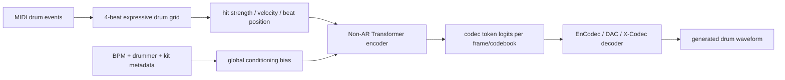
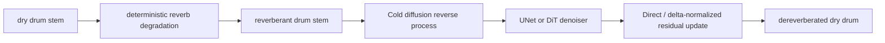
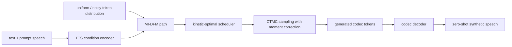
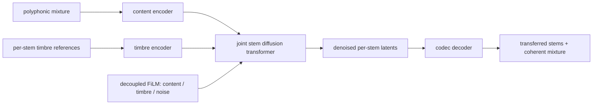

# 语音 / 音频 / 音乐论文速递
## 2026-05-12

> 实际对应 arXiv 更新日：**2026-05-12**  
> 检索范围：`cs.SD + eess.AS`  
> 只放按 ML 顶会审稿口径看，最值得多数读者花时间看的 **5 篇**

## 📋 总览

- 共收录 **5 篇** 相关论文
- 音乐生成 / 鼓组音频合成：**1 篇**
- 音乐音频增强 / 鼓组去混响：**1 篇**
- Zero-shot TTS / 离散流匹配：**1 篇**
- 多声部音色转换：**1 篇**
- 音频驱动多模态检索评测：**1 篇**

今天这批不是“语音大模型又套一层 prompt”的日子，主线更偏音乐音频和离散生成。最值得先看的是三篇：`Drum Synthesis from Expressive Drum Grids via Neural Audio Codecs` 把 expressive MIDI drum grid 直接映射到 neural codec tokens，是很实在的符号到音频生成工作；`A Cold Diffusion Approach for Percussive Dereverberation` 把 speech dereverberation 里常见的扩散方法搬到鼓组，但不是硬搬，而是重新设计了适合 transient 的指标；`Kinetic-Optimal Scheduling...` 则是比较硬的 TTS 生成论文，解决 MI-DFM 在调度和有限步采样上的两个老问题。

另外两篇受众稍窄但也值得留意：`Remix the Timbre` 做 polyphonic stems 的联合音色转换，重点不是单乐器换音色，而是避免 separate-then-transfer 带来的分离误差和声部不一致；`Omni-DeepSearch` 是 benchmark 论文，提醒大家现在的 omni-modal agent 从“听到声音”出发再去搜索图文视频证据时，能力还非常弱，Gemini-3-Pro 平均准确率也只有 43.44%。

## 精选入选规则

- **新意（0-3）**：是不是提出了新的表示、生成路径、评测任务或明确的新建模约束
- **影响力（0-3）**：是否贴近音乐生成、语音生成、音色转换、音频大模型这些主线
- **证据强度（0-2）**：有没有可读的 baseline、消融、主观/客观指标和关键数值
- **受众匹配度（0-2）**：对语音大模型、音乐生成、音频系统、音色转换研究者是否有直接启发

分数校准：

- **6**：可读，但更像局部补丁或评测资源
- **7**：信息量够，值得过一遍
- **8+**：建议优先精读，至少有明确方法或评测价值

## 总览表

| 方向 | 序号 | 论文 | 评分 | 关键词 |
|---|---:|---|---:|---|
| 音乐生成 / 鼓组合成 | 1 | Drum Synthesis from Expressive Drum Grids via Neural Audio Codecs | 8.5/10 | expressive drum grid, neural codec tokens, Transformer, E-GMD, EnCodec/DAC/X-Codec |
| 音乐音频增强 | 2 | A Cold Diffusion Approach for Percussive Dereverberation | 8.5/10 | cold diffusion, drum dereverberation, stereo stems, SGMSE+, CDiffuSE, transient metrics |
| Zero-shot TTS | 3 | Kinetic-Optimal Scheduling with Moment Correction for Metric-Induced Discrete Flow Matching in Zero-Shot Text-to-Speech | 8.5/10 | MI-DFM, GibbsTTS, kinetic-optimal scheduler, moment correction, Seed-TTS |
| 多声部音色转换 | 4 | Remix the Timbre: Diffusion-Based Style Transfer Across Polyphonic Stems | 8/10 | MixtureTT, joint stem DiT, timbre transfer, CocoChorales, decoupled FiLM |
| 音频驱动多模态检索 | 5 | Omni-DeepSearch: A Benchmark for Audio-Driven Omni-Modal Deep Search | 7.5/10 | audio-driven search, omni-modal benchmark, tool-use, 640 samples, Gemini-3-Pro 43.44% |

## 🥁 音乐生成 / 鼓组音频合成

### [1] Drum Synthesis from Expressive Drum Grids via Neural Audio Codecs

- **评分**：8.5/10
- **作者/机构**：Konstantinos Soiledis, Maximos Kaliakatsos-Papakostas, Dimos Makris, Konstantinos Tsamis；Hellenic Mediterranean University, Athena RC
- **论文链接**：https://arxiv.org/abs/2605.10281
- **PDF**：https://arxiv.org/pdf/2605.10281.pdf
- **代码链接**：**代码已开源** https://github.com/kostantinos-soiledis/midigroove_poc
- **Demo 链接**：暂无

#### 📌 简介
这篇做的是从 expressive drum grid 直接生成鼓组音频。输入不是普通 MIDI piano roll，而是带 microtiming、velocity、beat position、drummer/kit metadata 的 4-beat 鼓组网格；输出也不是 mel，而是 EnCodec / DAC / X-Codec 这类 neural audio codec 的离散 token，再由固定 codec decoder 还原波形。

它真正有价值的地方是把“符号鼓组表演怎么渲染成真实鼓音频”拆成了一个可控实验：同一个 Transformer predictor，不同 codec token space，比较到底哪个 codec 更适合被 symbolic condition 预测。

#### ☠️ 毒舌点评
这篇不是一眼封神，但很扎实。它没有吹“端到端音乐大模型”，而是老老实实比较 EnCodec、DAC、X-Codec 作为 drum rendering target 的可建模性。短板是任务还是 4-beat window，离完整 song-level drum production 还有距离；但对音乐生成工程来说，比很多只给 demo 的论文更有用。

#### 🔧 技术方案
- **模型解决的问题**：
  传统 MIDI-to-audio 渲染依赖 sample library 或 drum synthesizer，能打出节奏，但很难还原人类鼓手的 microtiming、velocity 和 kit timbre。已有 codec LM 能生成音频 token，但多数是文本/音频 prompt 条件，不直接回答“显式鼓组网格能不能稳定映射到真实鼓组音频”。
- **模型架构**：
  - **输入**：E-GMD 中对齐的 4-beat MIDI-derived expressive drum grid，包括 `drum_hit`、`drum_vel`、beat position、BPM、drummer_id，all-kits 设置下还包括 kit_name_id。
  - **输出**：每帧多 codebook 的 codec token 序列，最后由对应 codec decoder 还原 32 kHz 或原 codec 采样率下的鼓组音频。
  - **主干**：non-autoregressive Transformer encoder。每个 frame 的 grid vector 先线性投影，再加 beat position embedding 和 absolute position embedding；全局 metadata 作为 per-window bias 广播到所有帧。
  - **关键模块**：expressive grid construction、固定 codec tokenizer/decoder、Transformer token predictor、padding mask、codec-specific cross entropy head。
- **信号流**：

- **关键设计 / 核心创新**：
  - 把 expressive timing 和 velocity 编进 frame-level grid，而不是只喂 quantized MIDI。
  - 固定 codec encoder/decoder，只训练 grid-to-token predictor，因此可以隔离比较 EnCodec、DAC、X-Codec token space 的难易。
  - 对 single-kit 和 all-kits 都做评测，避免只在一个鼓组音色上看起来漂亮。
- **训练 / 推理策略**：
  - 数据使用 Expanded Groove MIDI Dataset，论文写明包含约 `444h` aligned drum audio / MIDI、`43` kits。
  - 每个训练样本是 beat-synchronous 4-beat window；因为 tempo 不同，token 长度可变，batch 内 padding，loss 用 `ignore_index=pad_id`。
  - 优化器为 AdamW，学习率 `6e-5`，global gradient clipping `1.0`，最多 `200k` optimizer steps，每 `300` steps validation，早停 patience `5000` steps。
  - Base 模型：`d_model=768`、`6` 层、`8` heads；Large 模型：`d_model=1536`、`10` 层、`12` heads。

#### 📊 实验结果
- 数据集：Expanded Groove MIDI Dataset (E-GMD)
- codec baseline：`EnCodec`、`DAC`、`X-Codec`
- Base / OneKit：
  - EnCodec：`NLL 2.142`，`Acc 42.7%`，`FAD 0.281`
  - X-Codec：`NLL 4.422`，`Acc 11.9%`，`FAD 0.350`
  - DAC：`NLL 6.265`，`Acc 3.8%`，`FAD 0.545`
- Base / AllKits：
  - EnCodec：`NLL 2.153`，`Acc 43.4%`，`FAD 0.193`
  - X-Codec：`NLL 4.429`，`Acc 12.5%`，`FAD 0.277`
  - DAC：`NLL 6.153`，`Acc 4.7%`，`FAD 0.405`
- 一个反直觉点：Large 模型更大但更不稳定，OneKit EnCodec 的 FAD 从 Base 的 `0.281` 变成 Large 的 `0.972`，onset F1 也从约 `71.0%` 掉到 `23.0%`。这说明这个任务不是“堆模型就赢”，codec token space 和训练稳定性更关键。

#### 💡 为什么值得看
如果你做音乐生成、MIDI-to-audio、drum rendering 或 neural codec，这篇值得看的是它的实验设计：它直接告诉你 EnCodec token 比 DAC / X-Codec 更容易被 expressive drum grid 预测，而且大模型不一定更好。这种结论比“我们生成了好听鼓点”实用得多。

#### 评分：8.5/10
理由：问题清楚、代码开源、codec 对比扎实。扣分点是生成窗口短，任务还不是完整编曲级 drum generation，主观听评也不够。

## 🧽 音乐音频增强 / 鼓组去混响

### [2] A Cold Diffusion Approach for Percussive Dereverberation

- **评分**：8.5/10
- **作者/机构**：Dimos Makris, András Barják, Maximos Kaliakatsos-Papakostas；Hellenic Mediterranean University, XLN Audio
- **论文链接**：https://arxiv.org/abs/2605.10256
- **PDF**：https://arxiv.org/pdf/2605.10256.pdf
- **代码链接**：**代码已开源** https://github.com/dimakr169/drums_dereverb
- **Demo 链接**：暂无

#### 📌 简介
这篇做的是 stereo drum stems 的去混响。它把 cold diffusion 用在 percussive dereverberation 上，把 forward process 定义成从 dry drum 到 reverberant drum 的确定性退化，而 reverse process 学习一步步把混响鼓组拉回干声。

最值得看的不是“扩散又来了”，而是它明确指出 speech dereverberation 的 PESQ/STOI 这套指标不适合鼓组，所以引入了 envelope、transient-to-tail energy ratio、onset F-measure improvement 等更贴近鼓组瞬态的指标。

#### ☠️ 毒舌点评
把 speech enhancement 方法搬到音乐音频上很容易变成换皮，这篇好在没有只换数据集。它知道鼓组的核心不是 intelligibility，而是 transient、尾音和节奏清晰度。短板是任务仍是人工构造 dry/wet pair，真实混音里 reverb、bleed、compression、EQ 全搅在一起，落地还要继续打磨。

#### 🔧 技术方案
- **模型解决的问题**：
  现有 dereverberation 大多围绕 speech，优化目标和指标都偏语音可懂度。鼓组有 sharp transient 和 dense temporal structure，reverb 会拖尾、糊 onset、破坏 groove，因此需要针对 percussive audio 的建模和评测。
- **模型架构**：
  - **输入**：reverberant stereo drum downmix。
  - **输出**：对应 dry / anechoic stereo drum stem。
  - **主干**：cold diffusion reverse model，分别实现为 UNet 和 diffusion Transformer 两种 backbone。
  - **关键模块**：deterministic reverberation forward process、Direct next-state prediction、∆-normalized residual prediction、complex STFT domain modeling、percussive-specific evaluation metrics。
- **信号流**：

- **关键设计 / 核心创新**：
  - forward process 不是加高斯噪声，而是逐步增加 reverberation，符合 cold diffusion 的“任务退化”思路。
  - 比较 Direct 和 ∆-normalized residual 两种 reverse parameterization，后者更适合 iterative correction。
  - 评测不靠 speech-centric PESQ/STOI，而是加了 NMI、MSD、ENV、TTER、ONFi 这些更贴合鼓组瞬态的指标。
- **训练 / 推理策略**：
  - 数据来自 MUSDB18-HQ 和 Groove MIDI Dataset，筛出 dry drum stems，再用 synthetic 和 real room impulse responses 生成 reverberant counterparts。
  - in-domain test 和 out-of-domain test 分开；out-of-domain 使用 MoisesDB dry drum stems + ACE Challenge real-room impulse responses。
  - 推理步数：本文方法 `T=16`；SGMSE+ 用 `30` reverse steps，CDiffuSE 用 `50` steps。作者也提醒这不是完全 matched-latency comparison。

#### 📊 实验结果
- baseline：`SGMSE+`、`CDiffuSE`
- in-domain：
  - SGMSE+：`SI-SDRi 4.06 dB`，`ESR 1.35`，`ENV 0.62`，`TTER 5.90`
  - CDiffuSE：`SI-SDRi 2.77 dB`，`ESR 1.37`，`ENV 0.59`，`TTER 6.03`
  - Cold UNet ∆-norm：`SI-SDRi 11.09 dB`，`ESR 0.79`，`ENV 0.92`，`TTER 2.07`
  - Cold DiT ∆-norm：`SI-SDRi 7.36 dB`，`ESR 1.05`，`ENV 0.84`，`TTER 3.57`
- out-of-domain：
  - SGMSE+：`SI-SDRi 2.01 dB`，`TTER 6.70`
  - CDiffuSE：`SI-SDRi 0.17 dB`，`TTER 6.85`
  - Cold UNet ∆-norm：`SI-SDRi 7.52 dB`，`TTER 3.60`
  - Cold DiT ∆-norm：`SI-SDRi 5.59 dB`，`TTER 4.58`
- 结论很清楚：UNet ∆-norm 是最稳的变体，DiT 并没有自动赢，speech diffusion baseline 直接搬过来效果一般。

#### 💡 为什么值得看
如果你关心音乐 production AI，这篇的价值在两个层面：一是 cold diffusion 做鼓组去混响确实有效；二是它把鼓组增强的评测指标往 transient 和 perceptual envelope 上拉，不再套语音增强的老指标。

#### 评分：8.5/10
理由：问题定义准，baseline 强，in-domain / out-of-domain 都给了数值，代码开源。扣分点是合成 reverb 和真实混音之间还有明显 gap。

## 🗣️ Zero-shot TTS / 离散流匹配

### [3] Kinetic-Optimal Scheduling with Moment Correction for Metric-Induced Discrete Flow Matching in Zero-Shot Text-to-Speech

- **评分**：8.5/10
- **作者/机构**：Dong Yang, Yiyi Cai, Haoyu Zhang, Yuki Saito, Hiroshi Saruwatari；The University of Tokyo, Independent Researcher
- **论文链接**：https://arxiv.org/abs/2605.09386
- **PDF**：https://arxiv.org/pdf/2605.09386.pdf
- **代码链接**：暂无
- **Demo 链接**：https://ydqmkkx.github.io/GibbsTTSProject

#### 📌 简介
这篇做的是 codec-based zero-shot TTS 里的 metric-induced discrete flow matching。作者把系统命名为 `GibbsTTS`，核心不是又造一个 TTS backbone，而是解决 MI-DFM 实际采样时的两个坑：时间 scheduler 靠网格搜索调参，以及有限步 CTMC solver 带来的 path-tracking error。

它提出 kinetic-optimal scheduler，让 probability path 以常 Fisher-Rao speed 走；再加 finite-step moment correction，修正 jump probability，但保留 jump destination distribution。

#### ☠️ 毒舌点评
这篇数学味比一般 TTS 论文重，但不是空推公式。它把 scheduler、corrector、NFE、subjective MOS、SOTA TTS 对比都做了。别误读成“全面超过 CosyVoice/Qwen3-TTS”：论文自己也承认 GibbsTTS 不是自然度和 WER/CER 最强，但 speaker similarity 很强，且在 masked discrete generative baseline 里优势明确。

#### 🔧 技术方案
- **模型解决的问题**：
  MI-DFM 利用 token latent geometry 做离散生成，比纯 mask-source 模型更有结构，但原先 scheduler 需要 heuristic / hyperparameter search；有限步采样时，first-order CTMC solver 还会带来误差，NFE 不够时质量掉得明显。
- **模型架构**：
  - **输入**：文本、prompt speech / speaker condition，以及 codec token generation 所需条件。
  - **输出**：目标说话人音色下的语音 codec tokens，再解码成 waveform。
  - **主干**：codec-based zero-shot TTS，生成模型是 MI-DFM / masked discrete generative framework。
  - **关键模块**：metric-induced path、Gibbs distribution over token-latent distances、kinetic-optimal scheduler、finite-step moment correction、duration predictor、temperature selection。
- **信号流**：

- **关键设计 / 核心创新**：
  - scheduler 不再靠手动 grid search，而是从 Fisher-Rao geometry 出发构造 kinetic-optimal schedule。
  - moment correction 修正有限步离散采样误差，尤其对低/中 NFE 更重要。
  - 与 MaskGCT 风格 masked model、Masked DD、DiFlow-TTS scheduler 等做统一架构下对比，减少“换 backbone 造成假提升”的问题。
- **训练 / 推理策略**：
  - 主实验使用 `32` function evaluations；附录还比较 `16` 和 `64` NFE。
  - 验证集用 LibriTTS test-clean 构造 prompt-target pairs。
  - 测试集包括 Seed-TTS 的 `test-en/test-zh` 和 CosyVoice 3 的 `en/zh`。
  - objective 指标：UTMOS、WER/CER、SIM；subjective 指标：CMOS、SMOS。

#### 📊 实验结果
- Seed-TTS test sets：
  - GibbsTTS：英文 `UTMOS 3.651 / WER 1.777 / SIM 0.743`
  - GibbsTTS：中文 `UTMOS 2.712 / CER 1.327 / SIM 0.790`
  - w/o corrector：英文 `UTMOS 3.403 / WER 2.120 / SIM 0.723`，中文 `UTMOS 2.447 / CER 1.777 / SIM 0.775`
- CosyVoice 3 test sets：
  - GibbsTTS：英文 `UTMOS 3.238 / WER 4.110 / SIM 0.691`
  - GibbsTTS：中文 `UTMOS 2.438 / CER 4.144 / SIM 0.780`
  - MaskGCT scheduler 在同类设置下明显弱，例如 CosyVoice 3 英文 `WER 8.767 / SIM 0.614`
- 主观评测：
  - GibbsTTS 作为 CMOS reference，所有对比系统自然度 CMOS 都为负。
  - SMOS：英文 `4.18`，中文 `4.28`，高于各类 masked baseline。
- SOTA 对比：
  - Seed-TTS test-en 上 Qwen3-TTS 1.7B 的 `WER 1.434` 和 `UTMOS 4.178` 仍强于 GibbsTTS。
  - GibbsTTS 的强项是 similarity：Seed-TTS zh `SIM 0.790`，CosyVoice 3 zh `SIM 0.780`，在多个 test set 上领先或接近最强。

#### 💡 为什么值得看
如果你做 codec-based TTS 或 discrete diffusion / flow matching，这篇值得细读。它不是把模型堆大，而是把离散生成采样路径、scheduler 和有限步误差讲清楚。工程启发是：NAR codec TTS 的质量瓶颈不只在 backbone，也在 sampling geometry。

#### 评分：8.5/10
理由：数学动机清楚，实验覆盖 objective、subjective、SOTA 对比和 ablation。扣分点是整体自然度仍不如部分大规模 AR/NAR TTS，且代码暂未开源。

## 🎛️ 多声部音色转换

### [4] Remix the Timbre: Diffusion-Based Style Transfer Across Polyphonic Stems

- **评分**：8/10
- **作者/机构**：Leduo Chen, Junchuan Zhao, Shengchen Li；UC San Diego, National University of Singapore, Xi'an Jiaotong-Liverpool University
- **论文链接**：https://arxiv.org/abs/2605.09259
- **PDF**：https://arxiv.org/pdf/2605.09259.pdf
- **代码链接**：暂无
- **Demo 链接**：暂无

#### 📌 简介
这篇做的是 polyphonic mixture 的 per-stem timbre transfer。以往多乐器音色转换通常是先分离 stem，再对每条 stem 单独做 timbre transfer，最后混回去；这会把 source separation artifact 和各声部不一致一起带进结果。

论文提出 `MixtureTT`，直接从 polyphonic mixture 出发，给每个目标声部一个 timbre reference，在一个 joint stem diffusion transformer 里同时生成所有 stem 的目标音色版本。

#### ☠️ 毒舌点评
这篇方向是对的：多声部音色转换不能一直靠“分离后逐条转换”糊弄，因为 stem 之间的和声关系和整体融合感会碎。论文的实验证明 joint modeling 比单 stem pipeline 好。不过它的数据主要在 CocoChorales 这种四声部室内乐设置，离真实流行音乐、鼓贝斯人声混音还有距离。

#### 🔧 技术方案
- **模型解决的问题**：
  单乐器 timbre transfer 已经不少，但多乐器 mixture 要同时保持每个声部 content、替换 timbre、维持 cross-stem harmony。separate-then-transfer pipeline 会放大 source separation error，也会让各 stem 的 timbre 独立漂移，最后混音不协调。
- **模型架构**：
  - **输入**：polyphonic mixture，以及每个目标 voice/stem 的 timbre reference。
  - **输出**：每个 stem 转换后的 waveform / latent，混合后得到目标 ensemble。
  - **主干**：joint stem diffusion transformer。
  - **关键模块**：frozen audio codec、content encoder、timbre encoder、adversarial content-timbre disentanglement、cross-stem diversity loss、decoupled FiLM conditioning、joint denoising。
- **信号流**：

- **关键设计 / 核心创新**：
  - 用 joint denoising 让多个 stem 在同一个 diffusion process 中协同生成，而不是独立生成后再相加。
  - content 和 timbre 走解耦路径，用 adversarial classifier 逼 content embedding 去掉 timbre 信息。
  - cross-stem diversity loss 防止四个 timbre embedding 坍缩成同一种音色。
  - decoupled FiLM 分别注入 content、timbre 和 diffusion noise condition，避免弱条件被共享 projection 吃掉。
- **训练 / 推理策略**：
  - 数据集：CocoChorales tiny，SATB 四声部室内乐。
  - audio codec 先预训练 `1M` steps 后冻结。
  - joint diffusion model 训练 `400k` steps，batch size `8` mixtures，相当于 `32` stem samples。
  - 前 `25k` steps 是 timbre warmup：content 用 learned sentinel 替换，先稳定 timbre pathway。

#### 📊 实验结果
- baseline：`SS-VAE`、`Control-Transfer-Diffusion (CTD)`，两者都按 single-instrument timbre transfer 方式重训。
- CocoChorales / cross-timbre transfer：
  - SS-VAE：per-stem `FAD 0.643`，mixture `FADm 0.763`，`CCS 0.896`
  - CTD：per-stem `FAD 0.605`，mixture `FADm 0.573`，`CCS 0.955`
  - MixtureTT：per-stem `FAD 0.255`，mixture `FADm 0.185`，`CCS 0.993`
- 消融：
  - Single-stem 版本 cross-transfer `FAD 0.304 / FADm 0.227 / CCS 0.933`
  - 去掉 `Lcls` 后 timbre identity 明显崩，transfer `Conf 0.356`
  - 去掉 `Ldiv` 后 timbre diversity 坍缩，transfer `Conf 0.001`
- 数据规模：
  - 100% paired data：`FAD 0.255 / FADm 0.185 / CCS 0.993`
  - 0% paired + 100% pseudo-labeled external data：`FAD 0.382 / FADm 0.211 / CCS 0.909`

#### 💡 为什么值得看
如果你做 voice conversion、instrument timbre transfer 或音乐分轨生成，这篇的重点是 joint modeling。它说明多声部转换里“声部之间一起生成”不是装饰，而是直接影响 mixture coherence 和 timbre consistency。

#### 评分：8/10
理由：问题设定和 joint DiT 方案都不错，实验和消融也有说服力。扣分点是数据域偏窄，真实复杂音乐还没证明。

## 🔎 音频驱动多模态检索评测

### [5] Omni-DeepSearch: A Benchmark for Audio-Driven Omni-Modal Deep Search

- **评分**：7.5/10
- **作者/机构**：Tao Yu, Yiming Ding, Shenghua Chai, Minghui Zhang, Zhongtian Luo 等；CASIA, UCAS, BAAI, Peking University, Tsinghua University
- **论文链接**：https://arxiv.org/abs/2605.08762
- **PDF**：https://arxiv.org/pdf/2605.08762.pdf
- **代码链接**：**代码已开源** https://github.com/yutao1024/Omni-DeepSearch
- **Demo 链接**：暂无

#### 📌 简介
这篇不是模型论文，而是 benchmark。任务设定是：模型只从一个或多个音频片段出发，先识别声音里的线索，再调用 text/image/video search 工具，跨模态多跳检索，最后给出一个短、客观、可验证的答案。

它把音频理解从“听懂这是什么声音”往前推了一步：真正的 agent 要能把声音转成搜索 query，找外部证据，再做跨模态验证。

#### ☠️ 毒舌点评
benchmark 论文经常灌水，但这篇的问题设定是有价值的。现在很多 omni-modal 模型在静态多模态 QA 上看起来很强，一到 audio-first search 就露馅。缺点也明显：数据构造依赖强模型过滤和 YouTube 资产，评测 pipeline 的工具实现会影响结果，后续需要更开放、更可复现的 agent 环境。

#### 🔧 技术方案
- **模型解决的问题**：
  现有 omni-modal benchmark 多数同时给图像、视频、音频和文本，模型只需要联合理解。现实搜索常常是从声音开始：听到一段音乐、机器声、环境声或说话人线索，再去网上找图文视频证据。这个 audio-driven deep search 能力缺少系统评测。
- **模型架构 / 评测流程**：
  - **输入**：一个或多个 audio clips，以及相关问题。
  - **输出**：短答案，要求客观、唯一、可验证。
  - **主干**：audio comprehension -> entity grounding -> query formulation -> text/image/video tool search -> multi-hop reasoning -> final answer verification。
  - **关键模块**：640 个样本、15 个细粒度类别、4 类 retrieval target modality、4 类 audio content type、多阶段过滤 pipeline。
- **信号流**：

- **关键设计 / 核心创新**：
  - 音频是唯一初始线索，而不是图文视频的附属模态。
  - 任务要求 web-based image/video search，区分了 text-only、image-text、video 等不同 retrieval target。
  - 用多阶段过滤确保 audio dependence、retrieval necessity、visual modality necessity 和 answer uniqueness。
- **训练 / 推理策略**：
  - 这是评测集，不训练新模型。
  - baseline pipeline 遵循 tool-augmented reasoning：先理解音频、构造搜索 query、调用外部工具，再汇总答案。
  - 评测指标是 accuracy；答案由 GPT-5.4、Gemini-3-Pro、Claude-Sonnet-4.6 等 judge 做语义判定。

#### 📊 实验结果
- 数据规模：`640` samples，`15` fine-grained categories。
- closed-source / open-source 模型都很弱：
  - Gemini-3-Pro：平均 `43.44%`
  - Gemini-3-Flash：`20.47%`
  - Gemini-2.5-Pro：`17.50%`
  - Qwen3.5-Omni-Plus：`13.91%`
  - Mimo-V2.5：`11.72%`
  - Qwen2.5-Omni-7B：`1.09%`
- Gemini-3-Pro 分项：
  - retrieval target：text `57.50%`，image-text `40.63%`，video `38.75%`，其他 `36.88%`
  - audio content：speech `55.00%`，music `46.67%`，non-speech audio `39.17%`，mixed `36.67%`
- ablation：
  - search budget 从 `(5,1)` 到 `(10,3)`，平均准确率从 `29.06%` 到 `43.44%`
  - 继续增到 `(15,5)` 只到 `44.06%`，说明盲目多搜会引入噪声。
  - Gemini-3-Pro 只做 audio entity inference 是 `33.76%`，如果直接提供 audio entity search answers 能到 `50.00%`，说明瓶颈不只是推理，也在音频实体识别和 query formulation。

#### 💡 为什么值得看
如果你做 audio LLM 或 omni-modal agent，这篇值得看的是任务定义。它把音频从“被动输入”变成“主动搜索入口”，而当前模型在这个设置下普遍很差。它不是最酷的模型论文，但能暴露真实产品里会遇到的 audio-to-search 失败模式。

#### 评分：7.5/10
理由：benchmark 设计有新意，代码和数据开源，结果能打脸当前 omni-modal 模型。扣分点是评测依赖工具链和 judge，数据构造也需要继续验证偏差。

## 最后结论

今天最值得优先看的排序：

1. **Drum Synthesis from Expressive Drum Grids via Neural Audio Codecs**  
   最实用的音乐生成论文。它清楚回答了 expressive drum grid 到 codec token 的可建模性问题，而且代码开源。

2. **A Cold Diffusion Approach for Percussive Dereverberation**  
   音乐音频增强方向最值得看。它没有照搬 speech dereverberation 指标，而是围绕鼓组 transient 重新组织评测。

3. **Kinetic-Optimal Scheduling with Moment Correction...**  
   如果你做 TTS / discrete flow matching，这篇方法硬度最高。它不是全方位 SOTA TTS，但对 codec-based NAR TTS 的采样路径很有启发。

4. **Remix the Timbre**  
   多声部音色转换方向值得跟，joint stem diffusion 的设定比 separate-then-transfer 更像正确方向。

5. **Omni-DeepSearch**  
   benchmark 论文，适合做 audio LLM / agent 的人读。它说明 audio-first search 远没有被现有 omni-modal 模型解决。

如果只读两篇，我建议先读 `Drum Synthesis` 和 `Cold Diffusion Percussive Dereverberation`。今天这两篇最贴近音乐音频生成和 production 工具链，实验也最不虚。
