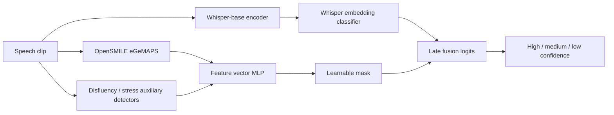
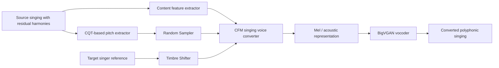
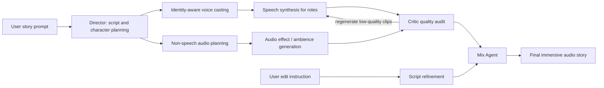
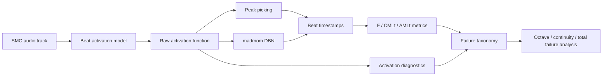

# 语音 / 音频 / 音乐论文速递
## 2026-05-13

> 实际对应 arXiv 更新日：**2026-05-13**  
> 检索范围：`cs.SD + eess.AS`  
> 只放按 ML 顶会审稿口径看，最值得多数读者花时间看的 **5 篇**

## 📋 总览

- 共收录 **5 篇** 相关论文
- 语音大模型 / 细粒度语音理解：**1 篇**
- 语音前端 / 说话人状态识别：**1 篇**
- 音色转换 / 歌声转换：**1 篇**
- 音频故事生成 / 多智能体音频制作：**1 篇**
- 音乐理解 / beat tracking 失败分析：**1 篇**

今天这批最值得优先看的主线有两条。第一条是“语音模型到底能不能理解更细的声音属性”：`FMSU` 不是继续刷 ASR，而是把口音、情绪、韵律、环境、说话状态等 14 个语音维度拆成 benchmark 和训练数据，再用 Qwen3-Omni 系列模型做三阶段 instruction tuning。它的价值在于提醒大家，speech LLM 只会听清文字还远远不够。

第二条是“音频生成和音乐理解里的真实失败点”：`AuDirector` 把长音频故事生成拆成角色选声、分层合成、Critic 自纠错和人类编辑闭环；`SMC Blind Spot` 则把 beat tracking 在 SMC 上长期低分的问题拆成 activation 错位、tempo 先验和 DBN 刚性三类瓶颈。前者偏系统集成但有完整 subjective/objective 评估，后者不是新模型，却比很多“又刷一点 SOTA”的论文更值得做工程复盘。

剩下两篇也有实际参考价值：`Poly-SVC` 抓住了歌声转换里常被忽视的残留和声问题，用 CQT + random sampler + CFM decoder 做 polyphonic vocal 的音色转换；`Whisper confidence detection` 则是一个小而完整的半监督语音前端方案，用 Whisper embedding、eGeMAPS、disfluency/stress 辅助特征和高置信伪标签提高说话人自信度识别。

## 精选入选规则

- **新意（0-3）**：是不是提出了新的表示、接口、训练组织方式，或者把旧问题拆得更对
- **影响力（0-3）**：是不是贴近语音大模型、TTS、codec、音乐生成、音色转换、音乐理解这些主线
- **证据强度（0-2）**：有没有像样的 baseline、消融和关键数值
- **受众匹配度（0-2）**：对语音大模型 / 语音前端 / 音乐方向 / 音频系统研究者有没有直接启发

分数校准：

- **6**：可读，但更像局部补丁或分析框架
- **7**：信息量够，值得过一遍
- **8+**：建议优先精读

## 总览表

| 方向 | 序号 | 论文 | 评分 | 关键词 |
|---|---:|---|---:|---|
| 语音大模型 / 细粒度理解 | 1 | FMSU: Fine-Grained Multi-Dimensional Speech Understanding | 8/10 | speech LLM, 14 dimensions, FMSU-Bench, Qwen3-Omni, three-stage tuning |
| 语音前端 / 状态识别 | 2 | Semi-Supervised Speech Confidence Detection using Whisper | 7/10 | Whisper embedding, eGeMAPS, disfluency, pseudo labels, Macro-F1 |
| 歌声转换 / SVC | 3 | Poly-SVC | 7/10 | polyphonic singing, CQT pitch, residual harmony, random sampler, CFM decoder |
| 音频故事生成 | 4 | AuDirector | 7/10 | audio storytelling, multi-agent, voice casting, critic loop, interactive editing |
| 音乐理解 / Beat Tracking | 5 | The SMC Blind Spot | 7.5/10 | beat tracking, SMC, DBN, activation bottleneck, tempo instability |

## 🤖 语音大模型 / 细粒度理解

### [1] Towards Fine-Grained Multi-Dimensional Speech Understanding: Data Pipeline, Benchmark, and Model

- **评分**：8/10
- **作者/机构**：Guojian Li, Zhixian Zhao, Zhennan Lin, Jingbin Hu, Qirui Zhan, Yuang Cao, Pengyuan Xie, Chuan Xie, Jie Liu, Qiang Zhang, Zhonghua Fu, Lei Xie；ASLP@NPU / Northwestern Polytechnical University, Shanghai Lingguang Zhaxian Technology 等
- **论文链接**：https://arxiv.org/abs/2605.12036
- **PDF**：https://arxiv.org/pdf/2605.12036.pdf
- **代码链接**：**文中给出** https://github.com/ASLP-lab/FMSU

#### 📌 简介

这篇做的是细粒度、多维语音理解。它不满足于让 speech LLM 做 ASR、翻译、简单 QA，而是把语音里的可感知属性拆成 14 个维度和 5 层 taxonomy，比如韵律、口音、情绪、说话状态、环境和表达方式等，然后构建数据流水线、`FMSU-Bench` benchmark 和 `FM-Speech` 模型。

核心思路很直接：先做高质量语音属性标注和筛选，再把任务设计成自然语言问答或 JSON 输出，让现有 speech LLM 学会从音频里读出更细的非文本信息。模型侧不是从零造一个新架构，而是在 `Qwen3-Omni-30B-A3B-Instruct` 基础上做三阶段训练，把单属性、多属性和结构化输出逐步压进去。

#### ☠️ 毒舌点评

这篇值得看，但要看清它的强点不是“模型结构多新”，而是数据定义和任务拆法比较扎实。现在很多 speech LLM 论文把“能听懂语音”偷换成“能转文字再回答”，这篇至少把非词汇层面的语音属性摆上了桌面。

短板也明显：`FM-Speech` 依赖强基座模型，很多提升来自高质量数据和 instruction tuning；如果你期待一个全新的 speech encoder 或 multimodal alignment 架构，它不会满足你。但作为 fine-grained speech understanding 的 benchmark 和数据流水线论文，它比很多只刷通用语音问答分数的稿子更有实际价值。

#### 🔧 技术方案

- **模型解决的问题**：
  现有 speech LLM 在 ASR、翻译、通用语音问答上进展很快，但对口音、情绪、语速、韵律、环境、说话人状态等细粒度属性感知不足。传统 benchmark 也偏粗，覆盖维度少，导致模型“听懂文字”不等于“听懂声音”。
- **模型架构**：
  - **输入**：真实场景语音片段，以及围绕语音属性设计的问题或结构化指令。
  - **输出**：自然语言回答或多维属性 JSON，包括单属性判断、多属性联合判断和细粒度解释。
  - **主干**：以 `Qwen3-Omni-30B-A3B-Instruct` 为基座的 speech LLM instruction tuning。
  - **关键模块**：
    - `Taxonomy`：覆盖 14 个 speech dimensions 的五层语音属性体系。
    - `Data curation pipeline`：长音频切分、预处理、安全分块、自动标注、多专家校验和 domain augmentation。
    - `FMSU-Bench`：超过 20,000 条中英双语实例，用来评测多维语音属性理解。
    - `FM-Speech`：基于三阶段 curriculum 的细粒度语音理解模型。
- **信号流**：

- **关键设计 / 核心创新**：
  - 把语音理解从文本内容扩展到多维语音属性，不再只围绕 ASR 变体打转。
  - benchmark 覆盖中英双语和 14 个 speech dimensions，任务形式更贴近 speech LLM 的自然语言接口。
  - 用三阶段训练组织数据难度：先稳住基础语音理解，再混合多属性任务，最后强化结构化输出。
  - 标注流水线强调多专家交叉验证，避免全靠 LLM 自动标注把错误滚进 benchmark。
- **训练 / 推理策略**：
  - Stage 1 使用 15M instances，其中 Type I 约 9M、Type II 约 6M。
  - Stage 2 使用 5.75M instances，其中 Type I 1.15M、Type II 2.3M、Type III 2.3M。
  - Stage 3 使用 2.3M Type III JSON instances，强化结构化多维属性输出。
  - 训练使用 AdamW、cosine schedule、peak learning rate `1e-5`、batch size 128。

#### 📊 实验结果

FMSU-Bench 上，`FM-Speech` 平均分 **72.8%**；对比基线里，`Qwen3-Omni` 是 **69.4%**、`Qwen2.5-Omni` 是 **59.7%**、`Qwen2-Audio` 是 **23.6%**。闭源模型里，`Gemini 3 Flash` 为 **71.9%**，`Gemini 3.1 Pro` 为 **74.0%**，说明这篇的开源路线已经接近强闭源模型的一部分能力，但还没有完全压过最强闭源系统。

消融也比较有信息量：`Qwen3-Omni` 原始模型是 **69.4%**，单阶段训练反而降到 **67.8%**，完整三阶段 `FM-Speech` 到 **72.8%**。`Qwen2.5-Omni` 原始 **59.7%**，单阶段 **55.2%**，三阶段 **63.9%**。这说明它不是“把所有数据一锅炖进去就好”，curriculum 的组织方式确实影响结果。

#### 💡 为什么值得看

如果你关心 speech LLM，这篇可以作为“下一代语音理解 benchmark 应该怎么拆”的参考。它提醒大家：语音不是只有字词，模型需要听懂语气、表达方式、说话状态和环境线索。真正要做语音大模型产品，这些维度比单纯 ASR WER 更接近用户体验。

## 🎙️ 语音前端 / 说话人状态识别

### [2] A Semi-Supervised Framework for Speech Confidence Detection using Whisper

- **评分**：7/10
- **作者/机构**：Adam Wynn, Jingyun Wang；Department of Computer Science, Durham, UK
- **论文链接**：https://arxiv.org/abs/2605.12387
- **PDF**：https://arxiv.org/pdf/2605.12387.pdf
- **代码链接**：未在正文中看到可信官方开源链接

#### 📌 简介

这篇研究说话人 confidence detection，也就是从语音里判断一个人说话时是高自信、中等自信还是低自信。它的应用场景不是 ASR，而是面试分析、教育反馈、人机交互和说话状态理解这类 paralinguistic speech processing。

方法是一个半监督混合框架：一边用 `Whisper-base` encoder embedding 提供语义和声学上下文，一边用 `eGeMAPS` 88 维声学特征，加上 disfluency/stress 辅助检测概率，最后做 late fusion。它还用高置信伪标签扩充训练集，重点不是猛堆伪标签数量，而是只挑质量较高的伪标签。

#### ☠️ 毒舌点评

这不是大模型新架构，也不是会让人兴奋的生成模型，但作为语音前端小任务论文算完整。优点是实验做得比较规矩，baseline 有 `Wav2Vec2 / HuBERT / WavLM / Whisper-Tiny / Whisper-Base`，还做了伪标签质量、解冻策略和辅助特征消融。

缺点也很现实：600 条人工标注 clips 的 gold set 太小，confidence 这种标签主观性又强，Macro-F1 提升从 **0.736** 到 **0.751**，幅度不算大。它更适合作为工程任务里的 baseline recipe，而不是值得大规模追的新方向。

#### 🔧 技术方案

- **模型解决的问题**：
  自信度不是文字内容本身，而是语速、停顿、犹豫、音高、能量、disfluency、stress 等多种线索的组合。标注成本高、主观性强，导致全监督训练很难扩大。
- **模型架构**：
  - **输入**：短语音片段。
  - **输出**：三分类 confidence label：high / medium / low。
  - **主干**：`Whisper-base encoder stream + feature-vector MLP stream + late fusion classifier`。
  - **关键模块**：
    - `Whisper stream`：抽取深层语音 embedding。
    - `Feature vector stream`：`eGeMAPS 88-dim` + 6 个 auxiliary probability scores。
    - `Disfluency detector`：检测 interjection、sound repetition、prolongation、block、word repetition 等。
    - `Stress detector`：提供 stress probability，作为高层韵律线索。
    - `Learnable sigmoid mask`：控制 feature vector stream 中不同手工/辅助特征的贡献。
- **信号流**：

- **关键设计 / 核心创新**：
  - 用 Whisper embedding 捕捉较强语音表示，再用可解释声学特征补上 prosody/disfluency 线索。
  - 半监督部分只吸收高置信伪标签，而不是把所有弱标签数据粗暴塞进去。
  - 通过 feature-vector stream 的 mask 给可解释特征留出通道，避免完全黑盒化。
- **训练 / 推理策略**：
  - Gold set 为 600 clips：high 300、medium 210、low 90。
  - 数据来源包括 TED-LIUM、SEP-28K、CMU-MOSI、MLCommons People’s Speech。
  - 伪标签集规模约 `1194 ± 345`，伪标签损失下调权重，论文中给出的 pseudo loss down-weight factor 为 18。
  - Whisper stream 学习率 `2.5e-5`，MLP stream 学习率 `1e-4`，使用 AdamW。
  - Late fusion 中 feature/vector 与 Whisper logits 使用加权融合，论文给出的 lambda 为 `0.3`。

#### 📊 实验结果

主结果里，提出方法 Macro-F1 为 **0.751 ± 0.041**，高于 `Whisper Only` 的 **0.736 ± 0.049** 和 `FV only` 的 **0.665 ± 0.041**。按类别看，proposed method 的 Low / Medium / High F1 分别为 **0.769 ± 0.047 / 0.647 ± 0.054 / 0.836 ± 0.036**，最难的仍然是 medium confidence。

和 SSL baseline 比，`Wav2Vec2` 为 **0.661**，`HuBERT` 为 **0.715**，`WavLM` 为 **0.737**，`Whisper-Tiny` 为 **0.728**，之前 Wynn et al. 2025 为 **0.647**，当前 Whisper-Base hybrid 到 **0.751**。消融显示，全量解冻 Whisper blocks 得到 **0.742**，只用 gold labels 得到 **0.726**，把 noisy pseudo labels 全收会掉到 **0.685**。

辅助任务方面，disfluency detector 的 interjections F1 约 **0.90**，sound repetitions **0.81**，prolongations **0.73**，blocks 和 word repetition 低于 **0.65**；stress detection F1 约 **0.94**。这些数字说明辅助信号并不全强，主要贡献来自若干可靠的高层线索。

#### 💡 为什么值得看

如果你做语音前端、说话人状态识别或面试/教育类语音分析，这篇可以直接当可复现 baseline。它最有用的点不是分数，而是证明了“Whisper embedding + 少量可解释 prosody/disfluency 特征 + 质量筛选伪标签”这套组合在小数据主观标签任务上比盲目扩大弱标签更稳。

## 🎵 歌声转换 / SVC

### [3] Poly-SVC: Polyphony-Aware Singing Voice Conversion with Harmonic Modeling

- **评分**：7/10
- **作者/机构**：Chen Geng, Meng Chen, Ruohua Zhou, Ruolan Liu, Weifeng Zhao；Beijing University of Civil Engineering and Architecture, Lyra Lab / Tencent Music Entertainment, Beijing Key Laboratory 等
- **论文链接**：https://arxiv.org/abs/2605.12310
- **PDF**：https://arxiv.org/pdf/2605.12310.pdf
- **代码链接**：未在正文中看到可信官方开源链接

#### 📌 简介

这篇做 polyphony-aware singing voice conversion。普通 SVC 往往假设输入是干净独唱，用 F0 extractor 抽主旋律，再保持内容和旋律、替换目标音色。但真实音乐里经常有伴奏、残留和声或复调人声，传统 F0 extractor 容易只抓到 lead melody，把 residual harmony 当噪声或直接丢掉。

`Poly-SVC` 的核心是用 `CQT-based pitch extractor` 保留主旋律和残留和声，再通过 `Random Sampler` 降低 CQT 中的干扰信息，最后用基于 `Conditional Flow Matching` 的 diffusion decoder 融合 pitch、content 和 timbre，生成目标歌手音色下的 polyphonic singing output。

#### ☠️ 毒舌点评

这篇切的问题是对的：很多 SVC demo 在干净人声上听着漂亮，一进真实混音残留和声就露馅。它没有继续围绕“更准 F0”小修小补，而是承认 polyphonic vocal 本来就不能只用单线 F0 表示。

但它也不是无懈可击。实验规模偏小，MOS 评估只有 12 名中文听众，开源状态也不明确；和 SeedVC、so-vits-svc4、DDSP-SVC 的比较更像方向性证据，不足以证明它已经是通用 SVC 新王。作为“复调/和声条件下 SVC 怎么建模”的论文值得读，作为可立即落地的 production SVC 方案还要谨慎。

#### 🔧 技术方案

- **模型解决的问题**：
  现有 SVC 多数依赖 F0 extractor 从干净 vocal 中抽 lead melody，但真实歌曲里经常有伴奏泄漏、和声残留或多声部结构。单线 F0 表示无法稳定保留 residual harmonies，导致转换后和声破碎、旋律层次变差或音色不一致。
- **模型架构**：
  - **输入**：source singing audio，可能包含 lead vocal 和 residual harmony；目标说话人/歌手 timbre reference。
  - **输出**：目标歌手音色下的 polyphonic singing voice。
  - **主干**：`CQT pitch representation + Random Sampler + Timbre Shifter + CFM-based diffusion decoder + BigVGAN vocoder`。
  - **关键模块**：
    - `CQT-based pitch extractor`：保留多声部频率结构，不只抽一条 F0。
    - `Random Sampler`：抑制 CQT 里与转换无关或会干扰音色建模的信息。
    - `Timbre Shifter`：借鉴 OpenVoice 思路做目标音色迁移。
    - `CFM decoder`：在 mel-spectrogram acoustic space 中融合 pitch、content、timbre。
    - `BigVGAN`：把预测声学表示还原成 waveform。
- **信号流**：

- **关键设计 / 核心创新**：
  - 用 CQT 替代单线 F0，保留 lead melody 和 residual harmony 的频率结构。
  - 用 Random Sampler 防止 CQT 把太多源音色和干扰信息泄漏给转换器。
  - 将 timbre、content、polyphonic pitch 分开建模，再在 CFM decoder 里合成。
  - 构建 `PolySVC-Harmony` 数据来补足公开和声歌声数据不足的问题。
- **训练 / 推理策略**：
  - 使用 Emilia speech 数据和 m4singer、OpenSinger、OpenCpop、KiSing 等歌声数据。
  - 由于缺少公开可用的 harmony SVC 数据，论文构建了 `PolySVC-Harmony`。
  - 推理时输入源歌声和目标 timbre reference，系统抽取 content/CQT/timbre 后通过 CFM decoder 和 vocoder 输出转换音频。

#### 📊 实验结果

主观实验给了 single melody 和 harmony 两种场景。对比基线包括 `DDSP-SVC`，论文也把 `SeedVC`、`so-vits-svc4` 作为相关 SVC 系统放进比较语境。`DDSP-SVC` 在 single melody 上 MOS **3.83 ± 0.13**、SIM-MOS **3.33 ± 0.11**，harmony 上 MOS **2.98 ± 0.11**、SIM **2.82 ± 0.10**，一到和声场景掉得很明显。

`Poly-SVC full` 在 single melody 上 MOS **3.98 ± 0.12**、SIM **3.78 ± 0.11**，harmony 上 MOS **3.75 ± 0.10**、SIM **3.42 ± 0.09**。消融里，去掉 Timbre Shifter 后 harmony MOS **3.71 ± 0.10**、SIM **3.32 ± 0.08**；去掉 Random Sampler 后 harmony MOS **3.62 ± 0.13**、SIM **3.36 ± 0.09**。这些数值说明 CQT/RS/TS 对 polyphonic 场景都有贡献，但提升不是压倒性的。

论文还提到比较对象包括 SeedVC、so-vits-svc4、DDSP-SVC。更强的说服力仍然需要更多公开测试集、更大听评规模和开源模型，否则复现和横向比较都不够稳。

#### 💡 为什么值得看

如果你正在做 SVC 或歌声转换，这篇的价值在于把“真实歌曲里的残留和声”单独拿出来建模。它不一定是最强 SVC，但指出了一个非常工程化的痛点：clean vocal demo 不能代表真实混音输入，polyphonic pitch 表示可能比单线 F0 更接近实际需求。

## 🎧 音频故事生成 / 多智能体音频制作

### [4] AuDirector: A Self-Reflective Closed-Loop Framework for Immersive Audio Storytelling

- **评分**：7/10
- **作者/机构**：Yiming Ren, Xuenan Xu, Ziyang Zhang, Wen Wu, Baoxiang Li, Chao Zhang；Shanghai Artificial Intelligence Laboratory, Tsinghua University
- **论文链接**：https://arxiv.org/abs/2605.11866
- **PDF**：https://arxiv.org/pdf/2605.11866.pdf
- **Demo**：https://anonymous-itsh.github.io/
- **代码链接**：未在正文中看到可信官方开源链接

#### 📌 简介

`AuDirector` 做的是 immersive audio storytelling：给一个故事 prompt，系统自动生成带角色声音、旁白、音效和混音结构的长音频叙事。它不是单个 text-to-audio 模型，而是多智能体制作流水线，把前期角色设定、配音选角、分层合成、质量审查、自纠错和人类交互编辑串成闭环。

框架分三段：`Identity-Aware Pre-production` 负责从脚本里抽角色设定并做 voice casting；`Collaborative Synthesis and Correction` 让 speech / non-speech / mix 相关 agent 分层合成，并由 Critic 检查质量后触发 targeted regeneration；`Human-Guided Interactive Refinement` 允许用户用自然语言编辑底层脚本，再局部重生成音频。

#### ☠️ 毒舌点评

这篇是系统论文，不是基础模型论文。它的创新更像“把 LLM agent、音频生成模型、CLAP/Gemini 类质量评估和交互编辑组织成一条制作流水线”，而不是提出一个新的声学生成器。如果你只看模型结构，可能会觉得它很拼装。

但这类任务拼装不是原罪。长音频故事生成真正难的地方就是角色声音一致、音效和情节对齐、低质量片段能自动返工、用户修改不会导致整段重做。它把这些工程问题拆出来并给了 objective AES 和 subjective MOS，至少比“输入 prompt 输出一段听起来还行的 demo”扎实。

#### 🔧 技术方案

- **模型解决的问题**：
  现有 audio storytelling 系统容易出现角色设定和声音不匹配、生成片段质量波动、音效和脚本不对齐、用户想改一小段却需要整体重生成等问题。长音频叙事需要制作流程，而不是单次生成。
- **模型架构**：
  - **输入**：用户故事 prompt、后续自然语言编辑指令。
  - **输出**：包含角色语音、非语音音效、混音结果的 immersive audio story。
  - **主干**：多智能体闭环框架，包括 Director Agent、Audio Agent、Critic Agent、Mix Agent、script revision agent 等。
  - **关键模块**：
    - `Identity-Aware Pre-production`：从故事脚本中抽取角色身份、性格和声音需求，建立 voice casting 候选。
    - `Collaborative Synthesis`：分层生成 speech、non-speech audio 和 final mix。
    - `Critic Agent`：用 Gemini-3-Audio、CLAP 等评估语义对齐和音频质量，低于阈值时触发重生成。
    - `Human-Guided Interactive Refinement`：把用户编辑指令转成脚本修改，再局部更新音频。
- **信号流**：

- **关键设计 / 核心创新**：
  - 把 voice-role matching 放在前期制作阶段，而不是生成后才发现角色音色不合适。
  - 对 speech 和 non-speech 片段做分层合成，方便局部审查和局部重生成。
  - Critic 不是只给总分，而是用阈值控制 targeted regeneration，降低交互编辑成本。
  - 用户编辑落在脚本层，系统再把修改映射到音频层，避免每次改动都全量重做。
- **训练 / 推理策略**：
  - 论文重点是 inference-time agent workflow，没有提出从零训练的新音频基础模型。
  - 评估数据包括 60 条来自 ROCStories 的 radio-drama 式叙事。
  - 主观 MOS 使用 10 名评估者，覆盖 matching、quality、alignment、emotion、aesthetic 五个维度。
  - 交互编辑评估使用 200 条自然语言编辑指令，考察脚本修改准确率和局部编辑效果。

#### 📊 实验结果

Table 1 同时给了 objective AES 和 subjective MOS。`AuDirector (Full)` 在 objective 指标上 CE **6.46**、CU **6.98**、PC **4.32**、PQ **7.59**、VRM **4.23**；去掉 Critic 后为 CE **6.22**、CU **6.52**、PC **4.18**、PQ **7.37**、VRM **4.23**。Critic 对内容体验、可用性和制作质量有提升，但 voice-role matching 的 objective VRM 没拉开。

主观 MOS 中，`AuDirector (Full)` 为 MOS-M **4.00 ± 0.32**、MOS-Q **3.86 ± 0.42**、MOS-Ali **3.74 ± 0.44**、MOS-Emo **4.17 ± 0.45**、MOS-Aes **4.01 ± 0.38**；`w/o Critic` 为 **4.01 ± 0.34 / 3.83 ± 0.44 / 3.65 ± 0.50 / 4.00 ± 0.37 / 3.92 ± 0.46**。最明显的主观提升在 emotion 和 aesthetic，quality 提升很小。

对比基线包括 `WavJourney`、`PodAgent` 以及 `AuDirector (w/o Critic)`。论文结论是 AuDirector 在结构一致性、情绪表现和声学保真上更优，但因为系统依赖多个外部生成/评估模型，结果很大程度取决于后端模型质量。

#### 💡 为什么值得看

如果你关心音频生成产品化，这篇比单纯 text-to-audio demo 更接近真实制作需求。它的可借鉴点是流程设计：前期角色设定、分层生成、质量审查、局部返工和脚本级交互编辑，这些模块对有声书、短剧、播客和游戏音频生成都直接有用。

## 🥁 音乐理解 / Beat Tracking 失败分析

### [5] The SMC Blind Spot: A Failure Mode Analysis of State-of-the-Art Beat Tracking

- **评分**：7.5/10
- **作者/机构**：Jaehoon Ahn, Tae Gum Hwang, Moon-Ryul Jung
- **论文链接**：https://arxiv.org/abs/2605.12287
- **PDF**：https://arxiv.org/pdf/2605.12287.pdf
- **代码链接**：未在正文中看到可信官方开源链接

#### 📌 简介

这篇不是提出新 beat tracking 模型，而是分析为什么 state-of-the-art beat tracking 在 SMC 数据集上长期翻车。它选了 `Beat This`、madmom 的 `DBNBeatTracker / TCNBeatProcessor` 和 `Beat Transformer`，对 SMC 的 217 条复杂音乐片段做逐 track 诊断。

论文把失败拆成三类：octave errors、continuity errors 和 complete tracking failure。更关键的是，它发现主要瓶颈并不只是 DBN 后处理，而是神经网络 activation function 本身在复杂节奏、慢速和弱拍线索音乐上会给出“很自信但错位”的峰值。DBN 的 tempo 先验又会在一部分曲目上进一步放大错误。

#### ☠️ 毒舌点评

这篇比很多“我又把 beat tracking 分数刷高一点”的论文更有价值。它没有发明一个花哨模块，而是把长期低分的 SMC 拆开看：哪些是 tempo 错，哪些是 phase 错，哪些是 activation 根本错位，哪些是 DBN 参数一刀切造成的。

短板是它更像 diagnostic paper，不会直接给你一个可用新模型。要是你只想找 SOTA recipe，它不够爽；但如果你在做音乐理解系统，这篇能帮你少走弯路，因为它明确告诉你：在复杂音乐上，后处理调参救不了所有问题，训练数据和 activation landscape 才是硬伤。

#### 🔧 技术方案

- **模型解决的问题**：
  现代 beat tracking 在主流、打击乐明显、节拍稳定的数据集上接近满分，但在 SMC 这种节奏复杂、速度慢、弱拍线索、表达性 timing 强的数据集上仍然低分。问题是：到底是模型没激活、激活错位，还是 DBN tempo prior 把结果带偏？
- **模型架构**：
  - **输入**：SMC 217 条 mono 44.1 kHz 音频片段及人工 beat annotations。
  - **输出**：beat timestamps、F-measure、CMLt、AMLt、CMLc、AMLc 等指标，以及失败类型。
  - **主干**：不是新模型，而是诊断 pipeline：SOTA beat activation model + DBN/peak-picking + per-track failure taxonomy。
  - **关键模块**：
    - `Beat This`：Transformer-based beat tracking 系统，作为主要分析对象。
    - `madmom DBN`：标准 tempo/beat continuity 后处理。
    - `Beat Transformer`：带 tempo classification head 的对照系统。
    - `Activation diagnostics`：分析 ground-truth beat 处 activation、false-positive activation、peak sharpness、entropy 等。
- **信号流**：

- **关键设计 / 核心创新**：
  - 按 track 级别而不是只看平均分，区分 octave error、continuity error 和 total failure。
  - 把 activation function 与 DBN 后处理分离，判断瓶颈来自前端模型还是 tempo continuity prior。
  - 用 SMC tag 构造四类 difficulty axes：weak beat cues、tempo instability、metrical ambiguity、structural difficulty。
  - 通过 GT tempo、GT activation 和 DBN 参数 sweep 建立上界，量化“调后处理最多能救多少”。
- **训练 / 推理策略**：
  - `Beat This` 使用 8-fold cross-validation，确保每条 SMC track 都由未见过该 track 的模型评估。
  - DBN 默认使用 madmom 参数，并测试 `min_bpm` 从 55 降到 30、tempo-constrained DBN、per-track optimal transition_lambda。
  - 指标使用 `mir_eval.beat.evaluate`，F-measure 容忍窗口为 ±70 ms，同时报告 CMLt/AMLt 等连续性指标。

#### 📊 实验结果

对比基线包括 `Beat This`、madmom `DBNBeatTracker / TCNBeatProcessor` 和 `Beat Transformer`。`Beat This` 在 SMC 上 F **0.627**、CMLt **0.514**、AMLt **0.610**；easy tracks F **0.819**，hard tracks F **0.609**。失败类型包括 octave errors **17 tracks / 8%**、continuity errors **38 tracks / 18%**、total failure **11 tracks / 5%**。

tempo 方面，SMC 有 **45 tracks / 21%** 低于 madmom DBN 默认 `min_bpm=55`，导致部分曲目被迫走 double-tempo。把 DBN 的 `min_bpm` 降到 30 能改善慢速曲目，但不能解决全部问题。`Beat Transformer` 的 tempo classification head 在 SMC 上准确率 **59%**，70-90 BPM 区间 **85%**，低于 55 BPM 只有 **31%**。

activation 诊断是这篇最有价值的部分。ground-truth beat 位置的平均 activation 与 F-measure 的 Spearman 相关为 **+0.784**，p < **1e-46**。GT activations + DBN 可到 F **0.924**，而真实 activations + DBN 只有 **0.585** 左右，说明主要瓶颈在 activation。对 Beat This activations 进行 per-track threshold upper bound 只能到 F **0.673**，进一步证明“激活错位”不是简单阈值能救的。

DBN 调参方面，routing Beat This activations through madmom DBN 会让 F 从 **0.627** 掉到 **0.576**，但 AMLt 从 **0.610** 升到 **0.656**，说明 DBN 更重视 metrical continuity，却牺牲了 beat placement。per-track optimal lambda 可到 F **0.642**、CMLt **0.558**；GT-tempo + optimal lambda 到 F **0.667**、CMLt **0.735**；GT activations + DBN 到 F **0.924**、CMLt **0.921**、AMLt **0.925**。

#### 💡 为什么值得看

如果你做 MIR 或音乐理解，这篇是很好的失败分析模板。它说明复杂音乐上的 beat tracking 不是“换个 DBN 参数”就能修好，训练数据分布、tempo instability、activation 错位和后处理先验要一起看。工程上最直接的启发是：需要多样化训练数据、tempo-aware inference，以及能按曲目自适应 tempo continuity 的 learned DBN 或替代后处理。

## 最后结论

今天最值得优先精读的是 `FMSU` 和 `SMC Blind Spot`。前者对 speech LLM 的 fine-grained perception 很有参考价值，尤其适合做语音大模型 benchmark、数据构建和 instruction tuning 的人；后者虽然不是新模型，但把 beat tracking 的失败原因拆得很清楚，对音乐理解系统的诊断价值很高。

`Poly-SVC` 和 `AuDirector` 更偏工程系统方向。`Poly-SVC` 抓住了真实 SVC 输入里的残留和声问题，适合关注歌声转换落地的人跟进；`AuDirector` 则适合音频故事生成、有声内容自动制作和交互式音频编辑方向参考。`Whisper confidence detection` 是稳健的小任务论文，适合需要说话人状态识别 baseline 的工程团队。

今天这 5 篇的整体质量不差，但没有那种“必须马上复现”的爆炸模型。更准确的判断是：`FMSU` 值得精读，`SMC Blind Spot` 值得做方法论复盘，`Poly-SVC / AuDirector` 值得按业务方向跟进，`Whisper confidence detection` 可以作为小数据半监督语音前端任务的参考实现。
