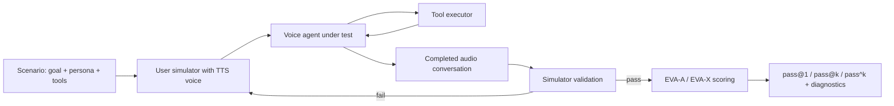
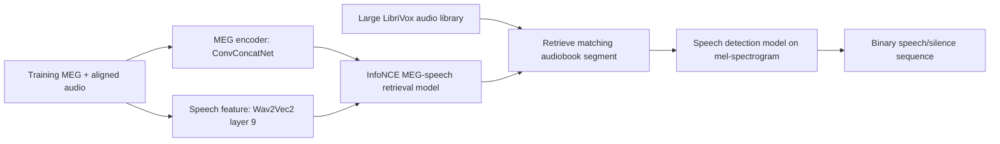
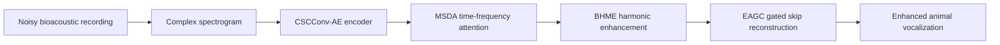
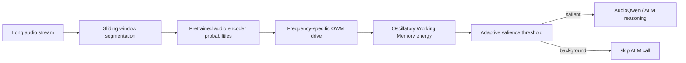

# 语音 / 音频 / 音乐论文速递
## 2026-05-14

> 实际对应 arXiv 更新日：**2026-05-14**  
> 检索范围：`cs.SD + eess.AS`  
> 只放按 ML 顶会审稿口径看，最值得多数读者花时间看的 **5 篇**

## 📋 总览

- 共收录 **5 篇** 相关论文
- 音乐生成 / 符号音乐：**1 篇**
- 语音智能体评测：**1 篇**
- 神经语音解码 / MEG：**1 篇**
- 生物声学增强：**1 篇**
- 音频大模型 / 长音频注意力：**1 篇**

今天这批不是传统 TTS/ASR 刷榜日，真正值得看的主线有三条。第一条是音乐生成从 MIDI 继续往“可读乐谱”走：`Text2Score` 把自然语言到 sheet music 拆成 LLM 规划和 ABC notation 执行模型，比直接让 LLM 吐 MusicXML/ABC 更像一条可控生产链。第二条是语音智能体评测开始补端到端短板：`EVA-Bench` 不再只测 ASR、TTS 或 LLM 单点，而是把多轮语音对话、工具调用、口音/噪声扰动、准确性和体验统一进一个 benchmark。第三条是音频/神经信号任务里的“绕路解决问题”：`Bypassing Direct Reconstruction` 不强行从 MEG 重建语音，而是先从大规模 LibriVox 里检索匹配音频，再做 speech/silence 检测，这个思路很工程但有效。

剩下两篇也各有定位。`BioSEN` 是把人类语音增强的思路改造成生物声学增强，重点在动物叫声的窄带谐波、间歇性和环境噪声；`NAACA` 则是一个 training-free 的长音频 salience gating 框架，用振荡工作记忆筛选要送给 AudioQwen 的片段，适合做长音频大模型推理成本和注意力稀释问题的参考。

## 精选入选规则

- **新意（0-3）**：是不是提出了新的表示、接口、训练组织方式，或者把旧问题拆得更对
- **影响力（0-3）**：是不是贴近语音大模型、音频智能体、音乐生成、神经语音解码、音频增强这些主线
- **证据强度（0-2）**：有没有像样的 baseline、消融和关键数值
- **受众匹配度（0-2）**：对语音大模型 / 语音前端 / 音乐方向 / 音频系统研究者有没有直接启发

分数校准：

- **6**：可读，但更像局部补丁或分析框架
- **7**：信息量够，值得过一遍
- **8+**：建议优先精读

## 总览表

| 方向 | 序号 | 论文 | 评分 | 关键词 |
|---|---:|---|---:|---|
| 音乐生成 / 符号音乐 | 1 | Text2Score | 8/10 | text-to-score, ABC notation, LLM planning, hierarchical decoder, MusicXML |
| 语音智能体评测 | 2 | EVA-Bench | 8/10 | voice agent, bot-to-bot simulation, EVA-A, EVA-X, robustness |
| 神经语音解码 / MEG | 3 | Bypassing Direct Reconstruction | 7/10 | MEG, speech detection, contrastive retrieval, LibriVox, LibriBrain |
| 生物声学增强 | 4 | BioSEN | 7/10 | bioacoustic enhancement, animal vocalization, MSDA, BHME, EAGC |
| 音频大模型 / 注意力门控 | 5 | NAACA | 6.5/10 | AudioQwen, salience gating, OWM, XD-Violence, training-free |

## 🎼 音乐生成 / 符号音乐

### [1] Text2Score: Generating Sheet Music From Textual Prompts

- **评分**：8/10
- **作者/机构**：Keshav Bhandari, Sungkyun Chang, Abhinaba Roy, Francesca Ronchini, Emmanouil Benetos, Dorien Herremans, Simon Colton；Queen Mary University of London、Singapore University of Technology and Design 等
- **论文链接**：https://arxiv.org/abs/2605.13431
- **PDF**：https://arxiv.org/pdf/2605.13431.pdf
- **代码链接**：**已开源** https://github.com/keshavbhandari/text2score/
- **Demo 链接**：https://keshavbhandari.github.io/portfolio/text2score

#### 📌 简介

这篇做的是 text-to-sheet-music，不是普通 text-to-MIDI。作者认为直接训练“文本提示 -> 乐谱 token”的端到端模型很容易被两个问题卡死：高质量文本-乐谱配对数据少，自动 caption 又容易和音乐内容错位。`Text2Score` 的办法是拆成两步：先让 LLM 把 prompt 变成 measure-wise structural plan，再让专门训练的执行模型根据 plan 生成 interleaved ABC notation，最后可转成可渲染乐谱。

这条路线的关键不是“用了 LLM”，而是把 LLM 放在结构规划层，避免它直接吐长串符号乐谱时 hallucination。执行阶段用 `ModernBERT-base` 编码 measure-wise plan，再用 GPT-2 风格的层级 decoder 生成 ABC notation。

#### ☠️ 毒舌点评

这篇是今天最值得看的之一。它没有继续把 MIDI 当最终产物糊弄过去，而是直面 sheet music 的可读性、可演奏性和 notation 合法性问题。短板也清楚：LLM 规划阶段仍可能把细粒度和声、voice-leading、演奏法描述得太粗；但比“让大模型直接写 ABC/MusicXML”靠谱得多。

实验也不是只放 demo。它对比了 ComposerX、Midi-LLM、Infer-Align、MidiLM，并且把 objective metrics、API 调用成本和人类听评都放进来。对符号音乐生成来说，这篇比很多纯 MIDI 生成论文更接近实际创作工具。

#### 🔧 技术方案

- **模型解决的问题**：
  现有 text-to-music 多数偏音频或 MIDI，真正面向 sheet music 的 text-driven generation 数据稀缺。直接端到端生成 MusicXML/ABC 容易出现乐器名 hallucination、结构不一致、节拍/调号错、乐谱不可编译等问题。
- **模型架构**：
  - **输入**：自然语言音乐提示，例如风格、乐器、情绪、结构、速度、调性、段落变化。
  - **输出**：interleaved ABC notation，可进一步转成 MusicXML/乐谱渲染和合成音频。
  - **主干**：两阶段 `LLM planner + execution model`。规划阶段用 GPT-5.1 生成 measure-wise plan；执行阶段用 `ModernBERT-base` plan encoder + hierarchical GPT-2 decoder 生成 ABC。
  - **关键模块**：
    - `Measure-wise plan`：每小节包含乐器、key/time signature、tempo、pitch-class set、note density、dynamics 等结构字段。
    - `Plan encoder`：把结构化 plan 编码成条件表示。
    - `Hierarchical decoder`：包含 measure-level 和 character-level decoder，生成 interleaved ABC notation。
    - `ABC / MusicXML conversion`：通过 ABC notation 和 MuseScore 等工具转成可读乐谱。
- **信号流**：

- **关键设计 / 核心创新**：
  - 把自然语言推理和乐谱 token 生成拆开，让 LLM 做更擅长的结构规划，而不是直接承担符号乐谱长序列生成。
  - 用 measure-wise plan 给执行模型提供可监督的中间逻辑，降低文本-乐谱配对数据稀缺带来的训练难度。
  - 使用 interleaved ABC notation，面向多声部、多乐器的乐谱组织，而不是只生成单轨 MIDI。
  - 开源数据、代码和 demo，复现入口比大多数 symbolic music 论文更完整。
- **训练 / 推理策略**：
  - 数据集由 **621,162** 首 ABC notation pieces 组成，包括 ABC Notation Data **316,118**、SymphonyNet **45,629** 以及 MIDI-to-ABC 和在线来源。
  - 预训练阶段从 symbolic XML 中抽 consecutive measure-wise plans，用 plan 条件训练 ABC 生成。
  - 推理时先调用 LLM 生成 plan，再由执行模型生成 ABC；不是每次都让 LLM 直接生成完整乐谱。
  - 论文没有给出传统实时性能指标，但给了 API 调用成本：Text2Score 对 238 prompts 总成本约 **$2.00**，ComposerX 约 **$112.10**。

#### 📊 实验结果

客观评测使用 **238** 条 prompt suite。对比基线包括 `ComposerX`、`Midi-LLM`、`Infer-Align`、`MidiLM`。Table 2 中，Text2Score 的 valid files generation 为 **99.16%**，ComposerX 只有 **50.00%**，Midi-LLM 是 **100.00%**，Infer-Align **99.58%**，MidiLM **97.90%**。Text2Score 在 pitch span **99.67%**、rhythmic overlap **99.60%** 上都很强，tempo match 为 **92.61%**，不如 ComposerX/Midi-LLM 的接近满分，但整体更均衡。

主观评测里，Text2Score 在五个维度都显著优于 ComposerX 和 Midi-LLM。论文明确写到 Text2Score 在 Musicality **3.52**、Usability **3.44** 等维度领先；ComposerX 的 Usability 为 **2.65**，Midi-LLM 为 **1.52**，差距不是小数点级别。所有主观改进都达到统计显著，p < **0.05**。

值得注意的是，Text2Score 不是所有指标都碾压。ComposerX 和 Midi-LLM 在部分 tempo/validity 指标上有优势，但 ComposerX 的 API 调用次数高达 **4,484** 次，成本和稳定性都不适合当作轻量生产链。

#### 💡 为什么值得看

如果你关注 music generation，这篇的价值在于把“生成能看的乐谱”拆成规划和执行，而不是把 prompt 直接扔给 LLM 祈祷它写出合法 MusicXML。它的中间 plan、ABC 数据集和开源代码都值得跟，尤其适合想做可编辑、可渲染、可演奏 symbolic music 工具的人。

## 🗣️ 语音智能体评测

### [2] EVA-Bench: A New End-to-end Framework for Evaluating Voice Agents

- **评分**：8/10
- **作者/机构**：Tara Bogavelli, Gabrielle Gauthier Melançon, Katrina Stankiewicz, Oluwanifemi Bamgbose, Fanny Riols, Hoang H. Nguyen, Raghav Mehndiratta, Lindsay Devon Brin；ServiceNow
- **论文链接**：https://arxiv.org/abs/2605.13841
- **PDF**：https://arxiv.org/pdf/2605.13841.pdf
- **代码链接**：**已开源** https://github.com/ServiceNow/eva
- **Demo / 项目**：https://servicenow.github.io/eva

#### 📌 简介

`EVA-Bench` 是一个端到端 voice agent 评测框架。它解决的问题很现实：现在很多语音智能体评测只看 ASR、TTS、LLM 或工具调用的单点能力，但真实 voice agent 的失败常发生在多轮交互、口音噪声、打断、工具结果复述、TTS 关键实体读错和过长回答里。

框架由两部分组成：一边是 bot-to-bot audio conversation simulation，带用户 simulator validation；另一边是 `EVA-A` 和 `EVA-X` 两组复合指标。`EVA-A` 看 task completion、faithfulness、speech fidelity；`EVA-X` 看 conversation progression、spoken conciseness、turn-taking timing。

#### ☠️ 毒舌点评

这篇比“又测一个语音助手榜单”扎实得多。它真正把 voice agent 当成语音系统评，而不是把文字 agent benchmark 套一层 TTS/ASR。尤其是 speech fidelity 和 turn-taking 这类指标，确实是文本 agent benchmark 看不到的坑。

短板也要说清：大量评分依赖 LLM-as-Judge/LALM-as-Judge，工程实现复杂，评估成本不低；而且 213 个场景集中在 enterprise domain，不代表开放闲聊或消费级助手。但如果你做语音智能体，这篇是很实用的 benchmark 设计参考。

#### 🔧 技术方案

- **模型解决的问题**：
  现有 voice agent evaluation 要么只测组件，要么只测单轮 query，要么把文字 agent 指标照搬过来，无法覆盖多轮语音交互里的真实失败模式。EVA-Bench 要评的是完整语音对话：用户是否合理、agent 是否完成任务、工具结果是否忠实、TTS 是否读对关键实体、turn-taking 是否自然。
- **模型架构**：
  - **输入**：213 个 enterprise scenarios，覆盖 Airline Customer Service Management、Healthcare HRSD、Enterprise ITSM；每个 scenario 包含 user goal、persona、decision tree、工具和 agent policy。
  - **输出**：每个 voice agent 的 EVA-A / EVA-X pass@1、pass@k、pass^k，以及诊断指标。
  - **主干**：自动 bot-to-bot audio simulation + simulator validation + quality measurement pipeline。
  - **关键模块**：
    - `User Simulator`：根据目标、persona 和 TTS voice 发起多轮语音对话。
    - `Voice Agent under test`：支持 cascade、hybrid、S2S 三类架构。
    - `Tool Executor`：确定性执行 agent 工具调用，避免环境随机性。
    - `Simulator Validation`：检查用户模拟器是否偏离任务或行为不可信，失败则重生成。
    - `EVA-A / EVA-X`：分别评价准确性和体验。
- **信号流**：

- **关键设计 / 核心创新**：
  - 不是静态 query，而是 live bot-to-bot 多轮语音会话。
  - simulator 也要被验证，避免评估结果其实是在测“用户模拟器出错”。
  - `EVA-A` 和 `EVA-X` 分开，避免一个 agent 任务完成但体验极差时仍被总分掩盖。
  - 同一套指标覆盖 cascade、hybrid、speech-to-speech agent，支持跨架构比较。
  - 加入口音、背景噪声、连接质量等 perturbation，专门测语音系统鲁棒性。
- **训练 / 推理策略**：
  - 这不是训练新模型，而是评测框架；核心是多 trial simulation 和复合指标设计。
  - 每个 scenario 跑多个 trials，报告 pass@1、pass@k 和 pass^k。pass^k 更严，表示同一 scenario 多次都要成功。
  - accuracy pass 条件包括 task completion = **1.0**、faithfulness ≥ **0.5**、speech fidelity ≥ **0.95**。
  - experience pass 条件包括 turn-taking ≥ **0.8**、conversation progression ≥ **0.5**、conciseness ≥ **0.5**。

#### 📊 实验结果

EVA-Bench 评估了 **12** 个系统，覆盖 cascade、hybrid 和 S2S。一个关键结论很刺眼：没有系统能同时在 `EVA-A pass@1` 和 `EVA-X pass@1` 上超过 **0.5**。这说明现在 voice agent 不是“差一点就能产品化”，而是 accuracy 和 experience 还没有同时过线。

clean 条件下，cascade 系统 `Nova-3 + GPT-5.4 + Sonic 3` 的 EVA-A pass@1 为 **0.504 ± 0.044**，但 EVA-X pass@1 只有 **0.007 ± 0.006**，典型是任务能力强、交互体验差。S2S 系统 `GPT-Realtime-1.5` 的 EVA-A pass@1 是 **0.467 ± 0.052**，EVA-X pass@1 是 **0.566 ± 0.039**，体验更强但准确性也没真正稳住。`Gemini-3.1-Flash-Live` 的 EVA-X pass@1 到 **0.589 ± 0.035**，但 EVA-A pass@1 只有 **0.292 ± 0.048**。

论文还指出 peak 和 reliable performance 差距很大：12 个系统里，pass@k 和 pass^k 的 median gap 在 EVA-A 上是 **0.44**，EVA-X 上是 **0.24**。也就是说很多系统偶尔能做好，但无法稳定做好。口音和噪声扰动造成的平均变化最高到 **0.314**，鲁棒性问题非常明显。

#### 💡 为什么值得看

如果你做语音 agent，这篇比单纯看 ASR WER 或 LLM tool accuracy 有用得多。它告诉你 voice agent 的验收不能只问“任务有没有完成”，还要问“用户听得懂吗、关键实体读对了吗、回答够短吗、打断自然吗、口音噪声下还稳吗”。这套指标可以直接改造成内部评测基线。

## 🧠 神经语音解码 / MEG

### [3] Bypassing Direct Reconstruction: Speech Detection from MEG via Large-Scale Audio Retrieval

- **评分**：7/10
- **作者/机构**：论文首页未稳定抽出完整机构；LibriBrain Competition 2025 相关参赛工作
- **论文链接**：https://arxiv.org/abs/2605.13099
- **PDF**：https://arxiv.org/pdf/2605.13099.pdf
- **代码链接**：暂无
- **Demo / 竞赛页面**：https://neural-processing-lab.github.io/2025-libribrain-competition/prizes/

#### 📌 简介

这篇做的是从 MEG 脑磁信号中检测 speech/silence，但它没有硬走“MEG -> mel -> speech reconstruction”这条很难的路。作者观察到非侵入式脑信号直接重建语音特征的精度很低，于是把问题改写成两步：先用 MEG-speech contrastive retrieval 在大规模 LibriVox 音频库里找到测试 MEG 对应的音频片段，再对匹配音频做 speech detection，最后把二值 speech/silence 序列映射回 MEG 时间轴。

这个方法听起来像钻规则空子，但工程上很聪明。竞赛任务要求输出 MEG 对应的 speech/silence 序列，如果测试音频来自可检索的 LibriVox 片段，那么先找音频再做检测，确实比直接从低 SNR MEG 重建强。

#### ☠️ 毒舌点评

这篇不是神经解码基础模型突破，更像“理解数据生成过程之后绕过最难子问题”。如果你期待脑信号直接合成可懂语音，它不满足；但如果你关心 BCI/MEG decoding 的工程方法，它很值得看，因为它诚实地承认 direct reconstruction 当前不够好。

短板也明显：方法依赖测试音频能在大规模库里被检索到，不是一般化的脑到语音解码。它赢竞赛可以，但离开放世界 BCI 还有距离。

#### 🔧 技术方案

- **模型解决的问题**：
  LibriBrain speech detection 要从 MEG 输出二值 speech/silence 序列。直接从 MEG 重建动态语音特征很难，论文提到 EEG mel-spectrogram decoding Pearson correlation 通常低于 **0.2**，他们自己的 MEG mel-spectrogram decoding 也只有约 **0.4**，不足以合成可懂语音。
- **模型架构**：
  - **输入**：测试 MEG 片段，以及训练阶段对齐的 MEG/audio pair；外部大规模 LibriVox 音频库。
  - **输出**：每个时间步的二值序列，`0` 表示 silence，`1` 表示 speech。
  - **主干**：`MEG-speech match-mismatch contrastive retrieval + speech detection model`。
  - **关键模块**：
    - `MEG encoder`：使用 ConvConcatNet，把 MEG segment 编码成低维 latent。
    - `Speech representation`：使用 Wav2Vec 2.0 第 9 层输出作为 speech feature。
    - `InfoNCE contrastive loss`：对齐 MEG 和对应 speech segment。
    - `Speech detection model`：输入 mel-spectrogram，输出 speech/silence binary sequence。
    - `MMIS`：Matched MEG ID Sequence，用来判断候选音频是否和 test MEG 时间顺序一致。
- **信号流**：

- **关键设计 / 核心创新**：
  - 把 speech detection 从 direct MEG reconstruction 改写成 retrieval + audio-side detection。
  - 利用 LibriBrain 数据中测试 MEG 对应公开有声书音频的特点，通过 LibriVox 大库检索匹配片段。
  - MMIS 要求匹配索引呈单调递增，利用时间顺序排除大量错误音频。
  - 对找不到匹配音频的前半段 MEG，再回退到直接 MEG binary decoding。
- **训练 / 推理策略**：
  - MEG/speech 训练切成非重叠 **3 秒** windows。
  - MEG encoder latent 维度设为 **8**，降低后续检索成本。
  - InfoNCE temperature τ = **0.015**；validation Top-10 accuracy 连续 **5** 个 epoch 不提升则 early stop。
  - speech detection 使用 ConvConcatNet，输入 mel-spectrogram，Adam 学习率 **1e-3**。
  - 测试 MEG 总时长 **2243 秒**，用 **5 秒** sliding window、**0.1 秒** stride，得到 **22,380** 个 MEG segments。

#### 📊 实验结果

论文的关键证据不是传统 leaderboard 表，而是检索过程。作者下载约 **60%** 的 LibriVox 子集，包含约 **10,000** 本 audiobook。对每个候选音频片段，系统在 22,380 个 MEG segments 中寻找最相似位置，并检查 MMIS 是否接近单调递增。最终只有 `studyinscarlet13` 能匹配 holdout MEG 的后半段，从 **1398 秒** 开始。

他们从 `studyinscarlet13` 中确认前 **126** 个 sentences 与测试 MEG 匹配，然后插入相应 silence，使合成的 MEGaudio 与 1398 秒后的 MEG 对齐，再用 speech detection model 生成 binary sequence。前 **1398 秒** 找不到匹配音频，则用直接 MEG binary decoder 处理。

对比基线可以理解为 direct reconstruction/direct binary decoding 路线。论文给出的背景数字说明 direct mel reconstruction 目前很弱：EEG mel decoding Pearson correlation 通常 < **0.2**，MEG mel decoding 约 **0.4**；match-mismatch 在 **1000+** candidates 中可达到约 **41%** 平均准确率。最终方法赢得 LibriBrain competition speech detection task，说明 retrieval-first 在这个数据设定下更有效。

#### 💡 为什么值得看

这篇最值得看的不是模型多复杂，而是问题重写能力。它提醒神经语音解码研究者：当 direct reconstruction 信噪比不够时，retrieval、alignment 和外部音频库可能是更现实的中间路线。但它也提醒你别过度解读，开放世界 BCI 不能默认有可检索的原始音频。

## 🐦 生物声学增强

### [4] BioSEN: A Bio-acoustic Signal Enhancement Network for Animal Vocalizations

- **评分**：7/10
- **作者/机构**：论文首页未稳定抽出完整机构
- **论文链接**：https://arxiv.org/abs/2605.12534
- **PDF**：https://arxiv.org/pdf/2605.12534.pdf
- **代码链接**：暂无
- **Demo 链接**：暂无

#### 📌 简介

`BioSEN` 是面向 animal vocalizations 的生物声学增强模型。它的出发点是：人类语音增强做得很多，但动物叫声和人声不一样，常见于低 SNR 自然环境，包含风、雨、水流、昆虫声、其他物种重叠叫声，而且动物叫声通常更窄带、更间歇、更依赖谐波结构。

模型在 CSCConv-AE 基础上加入三个模块：`MSDA` 做 time-frequency 多尺度双轴注意力，`BHME` 做 bio-harmonic 多尺度增强，`EAGC` 用频率能量权重保护目标 vocalization，避免 skip connection 把噪声原样传过去。

#### ☠️ 毒舌点评

这篇不是要颠覆语音增强，而是把成熟 speech enhancement 迁移到 bioacoustics 时做了相对合理的 domain-specific 改造。它的优点是问题真实、模块和动物叫声特性有对应关系，实验也覆盖了三个数据集。

短板是 pseudo-clean target 仍然依赖人类语音预训练增强模型，真实“干净动物叫声”不可得的问题并没有根治。没有代码也影响复现。但作为 animal vocalization enhancement baseline，它比直接拿 DCCRN/FullSubNet 硬套更有针对性。

#### 🔧 技术方案

- **模型解决的问题**：
  生物声学录音通常含强环境噪声，目标动物叫声窄带、短促、谐波明显，并且干净参考数据稀缺。人类语音增强模型可能把动物叫声当成噪声抹掉，或者通过 skip connection 把环境噪声传到输出。
- **模型架构**：
  - **输入**：带噪动物叫声音频的 complex spectrogram / time-frequency representation。
  - **输出**：增强后的动物 vocalization 音频。
  - **主干**：以 `CSCConv-AE` 为 baseline backbone 的 complex convolution autoencoder。
  - **关键模块**：
    - `MSDA`：multi-scale dual-axis attention，沿时间和频率两个轴提取动物叫声特征。
    - `BHME`：bio-harmonic multi-scale enhancement，用多分支卷积建模不同 fundamental frequency 和 harmonic pattern。
    - `EAGC`：energy-adaptive gating connection，用频率权重保护 vocalization，减少噪声通过 skip connection 泄漏。
    - `Pseudo-clean target generation`：用 speech-pretrained enhancement model 生成伪干净参考。
- **信号流**：

- **关键设计 / 核心创新**：
  - 不把动物叫声当成人声，而是针对 narrow-band harmonic、intermittent calls 和强环境噪声设计模块。
  - EAGC 专门控制 skip connection，防止增强网络把输入噪声一起复制到输出。
  - 使用 pseudo-clean reference 解决 bioacoustics clean target 稀缺问题，虽然这也是一个潜在误差源。
  - 计算量只有 **3.15 GFLOPs**，比许多 speech enhancement baseline 更轻。
- **训练 / 推理策略**：
  - 训练使用 Xeno Bird 转 pseudo-clean 数据，并在 Bird Song、Biodenoising、Mixed data 上测试。
  - 数据覆盖 Birds、Chicken、Lion、Fruit Bats、Otters 等物种；Bird Song 和 Biodenoising SNR 范围为 **[-10, -5]**，Mixed data 为 **[-5, 10]**。
  - 训练 loss 为 negative SI-SDR，初始学习率 **1e-3**，decay coefficient **0.7**，batch size **16**。
  - 推理时输出增强音频，论文没有给出 RTF，但报告了 GFLOPs。

#### 📊 实验结果

Bird Song 数据集上，BioSEN 达到 SNR **5.73 dB**、SNRi **13.54 dB**、SI-SDR **3.47**、SI-SDRi **11.27**，GFLOPs **3.15**。baseline `CSCConv-AE` 的 SNR 是 **3.23 dB**、SNRi **11.04 dB**，说明 BioSEN 三个模块不是纯装饰。

在 Biodenoising 和 Mixed data 上，BioSEN 也给出最优或接近最优结果。Table 3.2 中，BioSEN 在 Biodenoising 上 SI-SDR **9.44**、SI-SDRi **16.93**、SNR **6.52**、SNRi **10.23**；在 Mixed data 上 SI-SDR **16.16**、SI-SDRi **13.27**、SNR **16.10**、SNRi **12.90**。论文提到 FullSubNet 在 Biodenoising 上接近 BioSEN，DCCRN 在 Mixed data 上也接近，说明优势不是绝对碾压，但 BioSEN 更轻且更针对生物声学。

#### 💡 为什么值得看

如果你做 bioacoustics 或野外录音清洗，这篇可以作为比 speech enhancement baseline 更合理的起点。它最有用的点是把动物叫声的谐波、窄带、间歇性和 skip noise leakage 具体落到了模块设计上，而不是一句“迁移语音增强模型”带过。

## 🔊 音频大模型 / 长音频注意力门控

### [5] NAACA: Training-Free NeuroAuditory Attentive Cognitive Architecture with Oscillatory Working Memory for Salience-Driven Attention Gating

- **评分**：6.5/10
- **作者/机构**：Zhongju Yuan, Geraint Wiggins, Dick Botteldooren；Ghent University 等
- **论文链接**：https://arxiv.org/abs/2605.13651
- **PDF**：https://arxiv.org/pdf/2605.13651.pdf
- **代码链接**：**已开源** https://github.com/zjyuan1208/NAACA-Oscillatory-Working-Memory
- **Demo 链接**：暂无

#### 📌 简介

`NAACA` 试图解决 Audio Language Models 在长音频上的 attention dilution：长音频里大多数片段是稳定背景，真正值得 ALM 推理的是突发或行为相关的 salient event。作者提出 training-free 的 `Oscillatory Working Memory`，先用 pretrained audio encoder 得到 auditory object probability trajectories，再把这些概率变成频率特定的振荡输入，驱动一个 2D recurrent field。只有 OWM energy fluctuation 超过 adaptive threshold 的片段，才送给 AudioQwen 做高层语义判断。

这不是训练一个新 audio LLM，而是一个前置 salience gate。它的目标是少喂无聊背景给大模型，降低调用次数，同时减少长上下文里 rare event 被淹没的问题。

#### ☠️ 毒舌点评

这篇想法有意思，但包装有点重。神经科学术语很多，真正落地看的是一个 training-free drift/salience detector 能不能比 random gating 更会选片段。好消息是它给了 AudioQwen、random 4s segment、XD-Violence 等对比；坏消息是方法依赖 PANN/AudioQwen 基座，且很多 USoW 结果是 qualitative case study。

所以我不会给太高分。它适合当长音频大模型的前置筛选思路参考，不适合被吹成通用认知架构突破。

#### 🔧 技术方案

- **模型解决的问题**：
  长音频输入中，大量稳定背景会稀释 Audio Language Model 的注意力和计算预算。全量滑窗调用 ALM 成本高，直接长上下文推理又可能漏掉稀有但重要的事件。
- **模型架构**：
  - **输入**：长音频流，按 sliding windows 切分。
  - **输出**：被判定为 salient 的音频片段，以及送入 ALM 后的语义分类/解释。
  - **主干**：`pretrained audio encoder + Oscillatory Working Memory + adaptive threshold gate + AudioQwen`。
  - **关键模块**：
    - `PANN / pretrained encoder`：把每个窗口转为 audio object probabilities。
    - `OWM lattice`：64 × 64 的 2D recurrent field，用 primary / velocity neurons 和 wave dynamics 维护近期上下文。
    - `Frequency-specific oscillatory drive`：不同声音类别映射到不同 carrier frequencies 和 spatial parcels。
    - `Adaptive threshold`：T = μ + 2σ(1 + α · trend)，检测 energy change rate。
    - `ALM invocation gate`：只把 salient windows 发给 AudioQwen。
- **信号流**：

- **关键设计 / 核心创新**：
  - 把长音频 ALM 推理改成“先检测 salience，再调用高成本模型”的门控流程。
  - OWM 不需要目标数据微调，也不需要离线历史 baseline calibration。
  - 通过振荡频率和 2D lattice 状态维持短期上下文，避免简单阈值对持续背景过敏。
  - 明确区分“减少 ALM 调用次数”和“提升 ALM 本身推理速度”，没有把成本节省说成模型加速。
- **训练 / 推理策略**：
  - 方法标称 training-free：pretrained encoder、OWM 和 ALM 不在目标数据上微调。
  - XD-Violence 只使用 audio track，评估 **500** 个测试样本。
  - OWM 使用 **64 × 64** grid，Δt = **0.01**，kp = kv = **10**，carrier frequencies **51–1200 Hz**。
  - 推理时在线切窗，检测到 drift/salience 才调用 AudioQwen；不是 post-hoc pruning。

#### 📊 实验结果

XD-Violence 上，baseline `AudioQwen` AP 为 **53.50%**，NAACA 达到 **70.60%**，绝对提升 **17.10** 个百分点。random 4s segment baseline 达到 **60.44%** AP，说明“短片段输入”本身能带来一部分收益，但 OWM selection 额外贡献约 **10.16** 个百分点。

和专门训练的 audio/video baseline 比，`HL-Net` 为 **60.50%** AP，NAACA 更高；但 video-based `TRACE` 有 **83.67%** AP，说明纯音频 training-free 方法仍然比不上视觉信息充分的监督模型。OWM drift points 与 frame-level ground truth timestamps 的对齐比例为 **61.1%**。

效率方面，NAACA 把 60 秒 clip 的 ALM 调用从约 **57** 次降到约 **34** 次，Time Sent Ratio 中位数在 XD-Violence 为 **0.597**，USoW 为 **0.650**，约等于减少 **40%** 的 ALM invocations。论文也明确说这不是改变 ALM intrinsic speed，而是少送无关音频。

#### 💡 为什么值得看

如果你做长音频理解或音频大模型部署，这篇的价值在于“前置 salience gate”这个系统思路。它不一定是最强检测器，但它把成本、长上下文注意力稀释和 rare event detection 放在同一个问题里。真正复现时建议重点看它相对 random gating、简单能量阈值和现有 VAD/event detector 的收益是否稳定。

## 最后结论

今天优先级我会这样排：

1. **Text2Score**：最值得精读。它把 text-to-sheet-music 拆成 LLM planning 和 ABC execution model，开源完整，实验也覆盖 objective + subjective。
2. **EVA-Bench**：如果你做语音智能体，这篇优先级很高。它把 voice agent 的准确性、体验、TTS fidelity、turn-taking 和鲁棒性放进统一评测，比单点指标更接近产品验收。
3. **Bypassing Direct Reconstruction**：不是通用神经语音解码突破，但问题重写很聪明，对 MEG/BCI 方向有启发。

`BioSEN` 适合生物声学和野外录音增强方向跟进；`NAACA` 更适合作为长音频 ALM 的 salience gating 参考，不建议因为“neuroauditory cognitive architecture”这个名字就过度神化。
