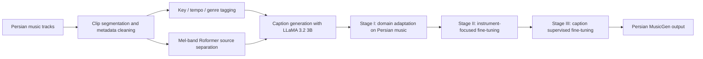
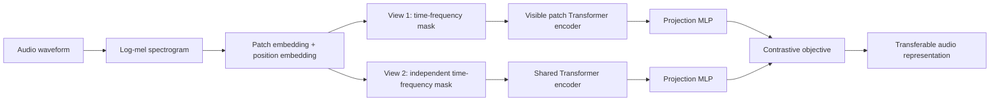
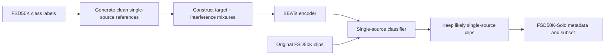
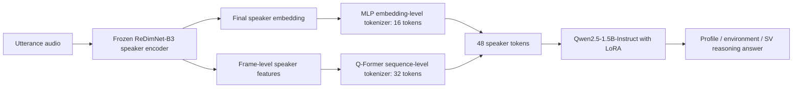
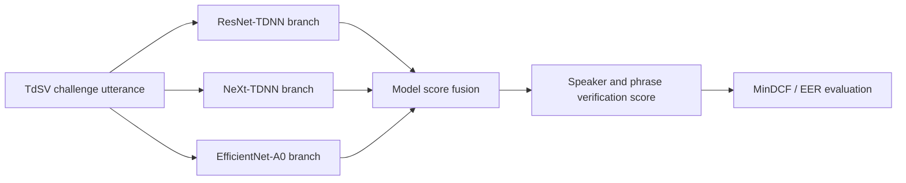

# 语音 / 音频 / 音乐论文速递
## 2026-05-15

> 实际对应 arXiv 更新日：**2026-05-15**  
> 检索范围：`cs.SD + eess.AS`  
> 只放按 ML 顶会审稿口径看，最值得多数读者花时间看的 **5 篇**

## 📋 总览

- 共收录 **5 篇** 相关论文
- 音乐生成 / 地域文化音乐建模：**1 篇**
- 音频自监督表示学习：**1 篇**
- 音频数据清洗 / 单声源事件数据集：**1 篇**
- 语音大模型 / 说话人理解与验证推理：**1 篇**
- 文本相关说话人验证挑战系统：**1 篇**，仅拿到 abstract 与 arXiv 元信息，已显式降级

今天这批最值得优先看的主线有三条。第一条是音乐生成从“通用欧美语料”往地域文化语料走：`Persian MusicGen` 不只是拿 MusicGen 微调一下，而是先做 900 小时级 Persian music 数据、自动标签、stem 分离和 caption，再把 MusicGen-small 做三阶段适配。它最有价值的地方不是模型多新，而是把文化音乐生成里常被忽略的 key、tempo、genre、乐器和 Persian modal texture 放进了训练闭环。

第二条是音频表示学习和数据治理：`AudioMosaic` 用独立时频 mask 构造 contrastive positive pairs，既降低 Transformer attention 成本，也让 audio SSL 在 AudioSet、ESC-50、SpeechCommands、音频语言对齐上有稳定增益；`FSD50K-Solo` 则反过来处理数据源问题，用生成式单声源 reference 和可控 mixture 训练过滤器，从 FSD50K 里筛出更干净的 single-source subset。一个解决表示，一个解决训练样本纯度，工程价值都比“又多堆一点参数”的论文更实。

第三条是说话人方向：`SpeakerLLM` 把 speaker encoder、层级 speaker tokenizer 和 Qwen2.5-1.5B-Instruct 接起来，让模型输出 speaker profiling、环境状态和 verification reasoning；`TdSV Challenge 2024` 更像系统报告，亮点是 ensemble 后 MinDCF/EER 数字不错，但因为正文无法拿到，这里只能作为 abstract 级参考，不能按全文论文吹。

## 精选入选规则

- **新意（0-3）**：是不是提出了新的表示、训练组织、数据构建方式，或者把旧问题拆得更清楚
- **影响力（0-3）**：是不是贴近语音大模型、音频表示、音乐生成、说话人验证这些主线
- **证据强度（0-2）**：有没有像样的 baseline、指标、消融和关键数值
- **受众匹配度（0-2）**：对语音大模型 / 音频前端 / 音乐生成 / 数据工程研究者有没有直接启发

分数校准：

- **6**：可读，但更像局部系统报告或小修补
- **7**：信息量够，值得过一遍
- **8+**：建议优先精读

## 总览表

| 方向 | 序号 | 论文 | 评分 | 关键词 |
|---|---:|---|---:|---|
| 音乐生成 / Persian music | 1 | Persian MusicGen: A Large-Scale Dataset and Culturally-Aware Generative Model for Persian Music | 8/10 | Persian MusicGen, 900h dataset, MusicGen-small, LLaMA captions, chroma similarity |
| 音频自监督表示 | 2 | AudioMosaic: Contrastive Masked Audio Representation Learning | 8/10 | time-frequency masking, contrastive SSL, ViT-B/16, AudioSet, audio-language alignment |
| 音频数据清洗 / 数据集 | 3 | FSD50K-Solo: Automated Curation of Single-Source Sound Events | 7.5/10 | FSD50K, single-source filtering, synthetic mixtures, BEATs classifier, metadata release |
| 语音大模型 / Speaker understanding | 4 | SpeakerLLM: A Speaker-Specialized Audio-LLM for Speaker Understanding and Verification Reasoning | 8/10 | ReDimNet-B3, Qwen2.5-1.5B, hierarchical tokenizer, SV reasoning, speaker profiling |
| 文本相关说话人验证 | 5 | Text-Dependent Speaker Verification (TdSV) Challenge 2024: Team Naive System Report | 6.5/10 | TdSV challenge, ResNet-TDNN, NeXt-TDNN, EfficientNet-A0, ensemble |

## 🎵 音乐生成 / 地域文化音乐建模

### [1] Persian MusicGen: A Large-Scale Dataset and Culturally-Aware Generative Model for Persian Music

- **评分**：8/10
- **作者/机构**：Mohammad Hossein Sameti, Diba Hadi Esfangereh, Sepehr Harfi Moridani, Leili Javidpour, Mahdieh Soleymani Baghshah
- **论文链接**：https://arxiv.org/abs/2605.14765
- **PDF**：https://arxiv.org/pdf/2605.14765.pdf
- **代码链接**：未在正文中看到可信官方开源链接

#### 📌 简介

这篇做 Persian music 的大规模数据集和文化适配音乐生成模型。它的出发点很现实：MusicGen 这类模型在通用英文/西方流行音乐语料上表现不错，但对 Persian traditional / pop / rock 里的音阶、调式、乐器和节奏组织不一定靠谱。作者没有只写一句“low-resource culture”，而是实际爬取并整理了超过 **900 小时**、**67,796 tracks** 的 Persian music 数据，然后围绕 genre、key、tempo、vocal/instrument stem 和文本 caption 做训练闭环。

模型侧以 `MusicGen-small` 为基础，先做无监督领域适配，再做传统 Persian 乐器导向的 instrument fine-tuning，最后用 caption 条件做 supervised fine-tuning。它不是新架构论文，但作为“通用音乐生成模型怎么迁移到特定文化音乐域”的案例，信息密度够高，尤其适合做地域音乐生成、民族乐器生成或低资源音乐风格建模的人参考。

#### ☠️ 毒舌点评

这篇的优点是工作量真有，数据规模和 pipeline 不是随便凑一个 demo。900 小时 Persian music、按 key/tempo/genre 统计、再用 stem 分离和 LLaMA caption 接到 MusicGen 训练上，这至少比很多“换个 prompt 就说文化适配”的音乐生成稿子扎实。

但它也别被包装成“解决 Persian music generation”的终局方案。模型只用 MusicGen-small，主观听评没有成为强证据，microtonal interval、传统调式细节和 caption 噪声都还是风险点。它值得读，不是因为架构多高级，而是因为它把文化音乐生成落到了数据、条件和实验数值上。

#### 🔧 技术方案

- **模型解决的问题**：
  通用 text-to-music 模型对 Persian music 的风格、乐器、旋律结构和调式掌握不足。直接用通用 MusicGen 生成 Persian prompt 时，容易得到表面像“异域风格”的泛化样本，而不是保留 Persian pop/traditional 的 key、tempo、乐器纹理和旋律组织。
- **模型架构**：
  - **输入**：Persian music audio clips、自动生成或人工整理的文本 caption、genre/key/tempo 等标签，以及可选的短音频 continuation context。
  - **输出**：符合 Persian music 风格的生成音频，覆盖传统单音乐器、复音乐器组合和 Persian pop 场景。
  - **主干**：`MusicGen-small`，基于 EnCodec token 的 autoregressive music generation。
  - **关键模块**：
    - 数据爬取与清洗：从 Persian music source 收集曲目并切分 clips。
    - 标签预测：抽取 key、tempo、genre 等音乐属性。
    - vocal/instrument separation：使用 Mel-band Roformer 把人声和伴奏分开，降低 caption 与条件噪声。
    - caption generation：使用 `LLaMA 3.2 3B` 生成训练文本条件。
    - 三阶段训练：domain adaptation、traditional instrument tuning、caption supervised tuning。
- **信号流**：

- **关键设计 / 核心创新**：
  - 把 Persian music 作为单独文化音乐域处理，而不是把它当成通用 music generation 的 prompt 变体。
  - 数据集覆盖超过 **900 小时**、**67,796 tracks**，其中 Persian pop 占 **63,531** 首，Persian rock **3,276** 首，traditional **1,277** 首，alternative **232** 首。
  - 用传统乐器阶段把 tar、setar、santur、kamancheh、daf 等声音压进模型，避免只学到 Persian pop 的表层配器。
  - 同时评估 text-only、text+1s、text+3s、text+5s continuation，能看出模型在不同条件强度下的稳定性。
- **训练 / 推理策略**：
  - Stage I 使用超过 900 小时 Persian music audio 做无监督领域适配，让 MusicGen-small 先吸收整体风格分布。
  - Stage II 使用传统 Persian solo-instrument recordings，让模型更直接地学习传统乐器 timbre 和纹理。
  - Stage III 使用 paired captions 和 solo/multi-instrument data 做 supervised fine-tuning，使文本条件和音频生成对齐。
  - 推理时可以只给文本，也可以加 1/3/5 秒音频 context 做 continuation，论文分别报告了 KLD 和 chroma similarity。

#### 📊 实验结果

和 `MusicGen baseline` 比，这篇的模型在 Persian traditional 与 pop 场景上整体更稳。传统单音乐器设置里，KLD 从 **6.37** 降到 **5.28**，chroma similarity 从 **0.33** 提到 **0.40**；传统复音乐器里，KLD 从 **3.43** 降到 **3.23**，chroma similarity 从 **0.36** 到 **0.44**；Persian pop 里，KLD 从 **4.27** 降到 **3.64**，chroma similarity 从 **0.46** 到 **0.51**。

continuation 条件下也能看到趋势：text-only 的 multi-instrument chroma 为 **0.4471**，MusicGen baseline 是 **0.3689**；solo 是 **0.4011** 对 **0.3316**；pop 是 **0.5115** 对 **0.4663**。当给到 5 秒 context，multi-instrument 到 **0.6131**，baseline **0.6037**，pop 任务则 baseline **0.6855** 略高于本模型 **0.6735**。这说明领域适配在 text-only 和弱条件时更明显，但强 continuation 条件下通用模型也能借助音频上下文补回来。

#### 💡 为什么值得看

如果你做音乐生成，这篇的价值在于把“特定音乐文化适配”拆成了可执行流水线：数据规模、标签、stem、caption、三阶段训练和 chroma/KLD 评估。它不是最炫的生成架构，但对低资源音乐风格、民族乐器生成、地域音乐产品化更有参考价值。

## 🔊 音频自监督表示学习

### [2] AudioMosaic: Contrastive Masked Audio Representation Learning

- **评分**：8/10
- **作者/机构**：Hanxun Huang, Qizhou Wang, Xingjun Ma, Cihang Xie, Christopher Leckie, Sarah Erfani；University of Melbourne / Institute of Trustworthy Embodied AI 等
- **论文链接**：https://arxiv.org/abs/2605.14231
- **PDF**：https://arxiv.org/pdf/2605.14231.pdf
- **代码链接**：https://github.com/HanxunH/AudioMosaic

#### 📌 简介

`AudioMosaic` 做的是音频自监督表示学习，核心是把 contrastive learning 和 masked spectrogram modeling 结合起来。它不是像 MAE 那样重建被 mask 的 patch，而是对同一条音频的两个独立 time-frequency masked views 做 contrastive 对齐。被 mask 的 patch 直接省掉，Transformer 只看 visible tokens，所以除了表示学习，计算量也实打实下降。

这篇值得看，是因为它不只在 AudioSet fine-tuning 上报一个数字，还覆盖了 linear probing、deepfake environment detection、audio-language alignment、memory usage 和 mask/batch/layer ablation。实验面铺得比较完整，说明它不是靠单个 benchmark 巧合刷分。

#### ☠️ 毒舌点评

这篇的想法不玄，甚至可以说很工程：音频 spectrogram 的 time/frequency 结构天然适合做 structured mask，两个 masked views 做对比，顺便省算力。它的优点是把这个工程直觉做成了比较扎实的一套 SSL recipe。

短板是方法论上不算惊天动地，很多灵感来自 vision MAE、SimCLR/BYOL 系列和 AudioMAE/EAT/BEATs 的路线。真正让它有价值的是结果稳定和消融完整。如果你只追“全新理论”，它不够刺激；如果你要找能迁移到音频分类、音频语言对齐和低显存预训练的 SSL baseline，它很值得试。

#### 🔧 技术方案

- **模型解决的问题**：
  现有音频自监督方法要么重建 spectrogram，训练目标偏低层；要么直接做 contrastive，对增强策略和 batch size 依赖大；同时全 token Transformer 在长音频上显存压力明显。AudioMosaic 想用结构化时频 mask 同时提高表示鲁棒性和降低 attention 成本。
- **模型架构**：
  - **输入**：10 秒 mono 16 kHz audio，转换为 log-mel spectrogram 后切成 patch tokens。
  - **输出**：音频表示向量，用于 AudioSet、ESC-50、SpeechCommands、deepfake 环境检测和 audio-language alignment。
  - **主干**：`ViT-B/16` Transformer encoder，约 **86M** 参数。
  - **关键模块**：
    - independent time masking：沿时间维随机遮盖片段。
    - independent frequency masking：沿频率维随机遮盖频带。
    - visible-token encoder：只编码未遮盖 patch，降低 attention 成本。
    - projection MLP：把两个 masked views 的 representation 投到 contrastive space。
    - contrastive loss：拉近同源 views，推开 batch 内其他样本。
- **信号流**：

- **关键设计 / 核心创新**：
  - 用 time mask 和 frequency mask 的组合构造正样本，逼表示学习同时保留 temporal events 和 spectral patterns。
  - 被遮盖 patch 不进 encoder；当 visible ratio 为 0.5 时，quadratic attention cost 理论上减少 **75%**。
  - 默认 mask ratios 为 `rho_t=0.6`、`rho_f=0.4`，不是随便随机增强，而是针对音频二维结构调参。
  - 评估不局限于音频分类，还接到 LLaMA-7B 做 audio-language alignment，检查表示是否能服务更高层任务。
- **训练 / 推理策略**：
  - 预训练数据为 AudioSet，包括 unbalanced、balanced 20k 和 eval 19k。
  - 默认 batch size 可做到 2048，论文也讨论更大 batch 到 6144 的影响。
  - 下游可做 full fine-tuning，也可做 linear probing；还可以把 AudioMosaic encoder 接入 LLM 做音频语言任务。
  - 训练时只用 masked visible tokens，推理/下游时使用完整或任务需要的音频表示。

#### 📊 实验结果

AudioSet fine-tuning 上，`AudioMosaic` 在 AS-20K 得到 **42.5 mAP**，AS-2M 得到 **50.2 mAP**，ESC-50 **97.5%**，SPC-2 **98.4%**，SPC-1 **99.0%**。作为 baseline，对照的 `SSLAM` 是 **40.9 / 50.2 / 96.2 / 98.1 / 98.8**，`EAT` 是 **40.2 / 48.6 / 95.9 / 98.3**。它不是每项都绝对碾压，但整体非常稳。

Linear probing 更能看表示质量：`BEATs` 在 AS-20K / AS-2M / ESC-50 上是 **8.2 / 12.2 / 72.7**，`AudioMosaic` 是 **29.4 / 28.7 / 93.0**。音频语言对齐表里，接 `LLaMA-7B` 后 ESC-50 为 **86.5**，DCASE **48.9**，VGGSound **54.6**，AudioCaps SPICE **17.1**，Clotho SPICE **12.5**。显存方面，batch 64/128/256/512 分别约 **3.3 / 6.3 / 12.3 / 24.3 GB**，比 EAT 在 batch 64 就 **34.6 GB** 的负担轻得多。

#### 💡 为什么值得看

如果你需要一个音频 SSL backbone，这篇比“只在 AudioSet 上报 mAP”的论文更实用。它给了 mask ratio、batch、layer-wise representation、显存和跨任务迁移的细节，适合拿来做音频分类、声音事件检测、音频 LLM encoder 预训练的 baseline / 对照。

## 🧹 音频数据清洗 / 单声源事件数据集

### [3] FSD50K-Solo: Automated Curation of Single-Source Sound Events

- **评分**：7.5/10
- **作者/机构**：Ningyuan Yang, Sile Yin, Li-Chia Yang, Bryce Irvin, Xiao Quan, Marko Stamenovic, Shuo Zhang；工作包含 Bose Corporation 实习与支持，论文标注为 EUSIPCO 2026
- **论文链接**：https://arxiv.org/abs/2605.13931
- **PDF**：https://arxiv.org/pdf/2605.13931.pdf
- **代码链接**：未在正文中看到可信官方开源代码；论文说明释放完整 clip-level metadata

#### 📌 简介

这篇不是新模型炫技，而是做音频数据集清洗：从弱标注的 `FSD50K` 里自动筛出 single-source sound events，形成 `FSD50K-Solo`。问题很具体：FSD50K 里很多 clip 虽然有标签，但可能同时包含多个声音事件、背景噪声或标签稀疏，直接拿来训练单声源声音模型会污染目标。

作者的做法比较巧：先用文本 prompt 生成干净 single-source reference audio，再构造不同 SNR、不同干扰类型的 controlled mixtures，训练一个判别模型去区分 single-source 和 multi-source。最后把这个过滤器跑到 FSD50K 上，输出 32,880 个更偏单声源的样本和元数据。

#### ☠️ 毒舌点评

这篇的价值比标题看起来更大。音频研究里太多人默认“有标签就是干净样本”，但真实开源音频库常常一段 clip 里塞了多个事件，训练时模型学到什么全靠运气。`FSD50K-Solo` 至少把这个脏问题正面摊开。

当然，它也有明显风险：用生成音频训练过滤器，过滤器可能学到生成器的 artifact，而不是现实世界 single-source 的本质；内部 Bose Sound Events 数据不完全公开，也会影响复现判断。它适合当数据治理工具，不适合被包装成万能数据清洗答案。

#### 🔧 技术方案

- **模型解决的问题**：
  FSD50K 是弱标注开放音频数据集，很多样本并非单声源。对需要干净 event exemplar 的任务来说，multi-source clip 会造成标签噪声和条件混淆。人工逐条清洗成本高，因此需要自动判别 single-source / multi-source 的过滤器。
- **模型架构**：
  - **输入**：FSD50K clip 或由生成器/mixture pipeline 构造的训练音频。
  - **输出**：single-source / multi-source 分类结果，以及被保留到 FSD50K-Solo 的样本 metadata。
  - **主干**：pretrained `BEATs` audio encoder + binary classifier。
  - **关键模块**：
    - prompt-based single-source generation：使用类别标签生成 reference samples。
    - controlled mixture builder：把 target event、interference event 和 urban background 按 SNR 混合。
    - BEATs discriminative classifier：学习识别是否为单声源。
    - FSD50K filtering stage：把训练好的分类器应用到 dev/eval split。
    - quality scoring：用 Audiobox Aesthetics 的 PC/PQ 评估筛选后质量。
- **信号流**：

- **关键设计 / 核心创新**：
  - 用生成式 reference audio 解决“缺少大规模单声源标注”的冷启动问题。
  - mixture 设计覆盖 single interference、dual interference、TAU Urban background、interference+background，SNR 从 **-10 dB 到 +15 dB**。
  - 从 target clip 中选择 top-5 high-energy chunks，长度 **1-10 秒**，更贴近事件显著片段。
  - 最终不是只给模型，而是给出可用于下游的数据 subset 与 clip-level metadata。
- **训练 / 推理策略**：
  - 判别器使用 `BEATs` 预训练 encoder，后接分类头。
  - 训练使用 AdamW，**20 epochs**，cosine learning rate schedule，并有 **10% warmup**。
  - 生成/混合训练集按 **8:1:1** 切分 train/val/test，数据增强只用于 train。
  - 推理时对 FSD50K dev/eval clips 打分，过滤掉极短小于 **0.5s** 和大于 **30s** 的样本。

#### 📊 实验结果

在生成测试集上，过滤器 precision **89.31%**，recall **98.72%**，F1 **93.81%**，accuracy **93.47%**。在内部专家整理的 `Bose Sound Events` 测试集上，precision **98.58%**，recall **92.35%**，F1 **95.36%**，accuracy **95.51%**。这说明它不只是记住了生成数据，在真实专家数据上也有一定外推。

应用到 FSD50K 后，作者排除 **1,727** 个短于 0.5 秒的样本和 **13** 个长于 30 秒的样本；分类器判定 dev split 中 **69.17%**、eval split 中 **55.91%** 为 single-source。最终 `FSD50K-Solo` 包含 **32,880 samples**。和原始 FSD50K 以及人类 PP 标签这个 baseline / 对照相比，筛选后 PC/PQ 质量指标也提升，说明过滤不仅是在改变分布，确实提高了听感/事件清晰度。

#### 💡 为什么值得看

如果你做声音事件检测、audio tagging、音频生成数据筛选或训练集清洗，这篇很实用。它提醒一个朴素但常被忽略的问题：很多模型性能瓶颈不在网络结构，而在训练样本到底是不是你以为的那个声音事件。

## 🗣️ 语音大模型 / 说话人理解与验证推理

### [4] SpeakerLLM: A Speaker-Specialized Audio-LLM for Speaker Understanding and Verification Reasoning

- **评分**：8/10
- **作者/机构**：KiHyun Nam, Jungwoo Heo, Siu Bae, Ha-Jin Yu, Joon Son Chung
- **论文链接**：https://arxiv.org/abs/2605.15044
- **PDF**：https://arxiv.org/pdf/2605.15044.pdf
- **代码链接**：未在正文中看到可信官方开源链接

#### 📌 简介

`SpeakerLLM` 做的是 speaker-specialized audio LLM。它不满足于让模型输出“是不是同一个人”，而是让模型同时处理 speaker profiling、recording condition understanding、speaker verification 和带证据组织的 verification reasoning。换句话说，它想把传统 speaker verification 的分数，变成能被语言模型解释和组织的判断过程。

架构上它比较清楚：冻结 `ReDimNet-B3` speaker encoder，用层级 speaker tokenizer 把 utterance 压成 **48 个 speaker tokens**，再喂给 `Qwen2.5-1.5B-Instruct`。训练分两阶段，先做 speaker understanding，再做 verification reasoning tuning。这个方向很值得关注，因为说话人识别长期停留在 embedding + score，现在 audio LLM 产品需要的是“能说明为什么像/不像”的接口。

#### ☠️ 毒舌点评

这篇的卖点比很多 audio LLM 论文更具体。它没有泛泛说“理解音频”，而是盯着 speaker 这个垂直任务做 tokenizer、数据、prompt 和 reasoning schema。层级 token 设计也有必要，因为说话人信息既有全局 embedding，也有帧级线索，直接丢一个 pooled embedding 给 LLM 往往太粗。

但也不能被“reasoning”两个字骗太深。它的解释主要是监督格式下的 evidence organization，不等于模型真的具备人类法庭式因果推理。profile metadata 也不完整，年龄、region、timbre brightness 等属性本来就有噪声。它值得优先读，但读的时候要把“可解释输出格式”和“真实解释能力”分开。

#### 🔧 技术方案

- **模型解决的问题**：
  传统 speaker verification 通常输出 embedding similarity 或 score，难以回答“两个声音为什么像/不像”、录音条件是否影响判断、说话人 profile 是否兼容等问题。通用 audio LLM 又不专门建模 speaker traits，容易把 ASR 内容当成主要依据。
- **模型架构**：
  - **输入**：单条或成对 utterances，以及 speaker profiling / environment / verification reasoning 相关指令。
  - **输出**：speaker attributes、environment status、profile compatibility、same/different speaker decision 和结构化 reasoning。
  - **主干**：冻结 `ReDimNet-B3` speaker encoder + hierarchical speaker tokenizer + `Qwen2.5-1.5B-Instruct`。
  - **关键模块**：
    - embedding-level tokenizer：把最终 speaker embedding 变成 **16** 个 token。
    - sequence-level tokenizer：用 Q-Former 从 frame-level features 中抽 **32** 个 token。
    - speaker token sequence：每个 utterance 合计 **48** 个 speaker tokens。
    - LoRA language adaptation：让 Qwen2.5-1.5B 学会 speaker-specific QA 和 reasoning 格式。
    - verification reasoning schema：`ENVIRONMENT_STATUS / PROFILE_COMPATIBILITY / DECISION` 三段式输出。
- **信号流**：

- **关键设计 / 核心创新**：
  - 用冻结 speaker encoder 保留强 speaker discriminative representation，避免 LLM 训练把底层 speaker 特征冲坏。
  - 层级 tokenizer 同时利用 pooled embedding 和 frame-level features，消融显示不是简单 token 数量越多越好。
  - training target 不只包含 same/different，还包含环境状态、profile compatibility 和决策理由，逼模型不要只背 profile 相似度。
  - 加入 reversal cases，降低模型用 gender/region 等 profile shortcut 直接判同人的风险。
- **训练 / 推理策略**：
  - 数据来自 `VoxCeleb1-dev` 和 `LibriTTS-R clean-360h` 的 metadata-enriched supervision corpus，主训练集约 **265k utterances**、**530.8 hours**。
  - VoxCeleb1-dev 部分包含 **148,642 utterances**、**1,211 speakers**、**340.4 hours**。
  - Stage 1 做 speaker understanding：先 warm-up tokenizer 的 short-form targets，再训练 tokenizer + LoRA 做 sentence adaptation。
  - Stage 2 做 verification reasoning tuning：在 SpeakerLLM-Base 上加入 verification reasoning 和 compatibility QA。
  - 训练中 speaker encoder 始终冻结，trainable speaker tokenizer 约 **21.2M** 参数，tokenizer+LoRA 约 **26.7M** 参数。

#### 📊 实验结果

VoxCeleb1-O 评估包含 **37,611 trials**、**40 speakers**、约 **10.8 hours**。warm-up 对结果影响很明显：`SpeakerLLM-Base` 的 SV accuracy 从 **91.20** 提到 **96.05**，gender **99.89**，age **39.83**，region **83.14**，pitch **72.44**，timbral brightness **54.19**，noise **52.70**，reverb **51.72**。年龄和 timbre brightness 数字不高，反而说明这类 profile 属性并不好做，不是模型全能。

tokenizer 消融也有信息量：hierarchical **48 tokens** 的 SV accuracy 为 **95.6**，只用 Q-Former **48 tokens** 是 **90.7**，说明提升不是简单靠 token 数量，而是 pooled speaker embedding 和 frame-level features 的互补。论文还把通用 audio-LLM baseline 如 `Qwen2.5-Omni-7B`、`Qwen3.0-Omni-30B`、`CoLMbo` 纳入对照，并强调专门的 speaker tokenizer / reasoning tuning 对 SV 和 profile QA 更稳。

#### 💡 为什么值得看

如果你做 speaker verification、voice identity safety、AI cover 音色确认或说话人画像，这篇值得优先读。它给了一条从传统 speaker encoder 到 audio LLM 解释接口的路径：不是丢掉验证分数，而是把 speaker embedding 变成 LLM 能消费的结构化 token，再输出可读判断。

## 🎙️ 文本相关说话人验证

### [5] Text-Dependent Speaker Verification (TdSV) Challenge 2024: Team Naive System Report

- **评分**：6.5/10
- **作者/机构**：Amir Mohammad Rostami, Pourya Jafarzadeh
- **论文链接**：https://arxiv.org/abs/2605.14896
- **PDF**：https://arxiv.org/pdf/2605.14896.pdf
- **代码链接**：未在 arXiv 页面看到可信官方开源链接
- **阅读状态**：⚠️ 基于 abstract 精读；arXiv HTML 转换不可用，本地未取得可解析全文，因此只按 abstract 和元信息做保守判断

#### 📌 简介

这篇是 `2024 Text-Dependent Speaker Verification Challenge` 的 Team Naive 系统报告。它的任务不是普通 text-independent SV，而是同时需要 speaker 和 phrase 条件成立：系统要判断说话人是否匹配，也要判断指定短语是否匹配。abstract 里给出的系统由 `ResNet-TDNN`、`NeXt-TDNN` 和轻量 `EfficientNet-A0` 组成，最后通过 ensemble 做文本相关说话人验证。

由于正文没有可用全文，这里不能把它当成完整方法论文来解读。能确定的信息是：作者把已有在 VoxCeleb 上训练的强 speaker models 迁移到 TdSV challenge，并额外训练 EfficientNet-A0 适配挑战数据，最终报告了 MinDCF 和 EER。它更像 challenge engineering report，而不是提出新说话人验证框架。

#### ☠️ 毒舌点评

这类 challenge report 的价值通常在“系统配方”和“榜单经验”，不是在理论创新。abstract 里的 MinDCF **0.0461**、EER **1.3%** 看着不错，但没有全文就看不到数据划分、augmentation 细节、score fusion、phrase verification 分支和 calibration 策略，所以不能过度解读。

它适合需要 TdSV baseline 的人快速扫一眼。如果你要找可复现工程方案，必须等 PDF/正文可解析后再判断；如果只是日报筛选，它排在第五很合理，保留但不吹。

#### 🔧 技术方案

- **模型解决的问题**：
  Text-dependent speaker verification 不只问“是不是同一个 speaker”，还要问“是不是说了指定 phrase”。这比 text-independent SV 多了 phrase/content consistency 约束，系统需要同时处理 speaker embedding 和 phrase verification。
- **模型架构**：
  - **输入**：challenge speech utterances，包含待验证说话人和指定文本/短语条件。
  - **输出**：speaker / phrase verification decision，以及用于挑战评估的 verification score。
  - **主干**：`ResNet-TDNN`、`NeXt-TDNN` 和 `EfficientNet-A0` 的 multi-model ensemble。
  - **关键模块**：
    - ResNet-TDNN：使用 VoxCeleb 预训练 speaker representation。
    - NeXt-TDNN：作为另一路强 speaker verification backbone。
    - EfficientNet-A0：轻量模型，在 challenge dataset 上专门训练以增强域适配。
    - data augmentation：abstract 明确提到 extensive augmentation，但未给可核查细节。
    - ensemble scoring：融合多模型输出以提升 speaker 与 phrase verification。
- **信号流**：

- **关键设计 / 核心创新**：
  - 采用已在 VoxCeleb 上训练的强 SV backbone，降低 challenge 时间紧、资源有限时从零训练的风险。
  - 加入专门在 challenge 数据上训练的 EfficientNet-A0，补上 domain adaptation 和轻量分支。
  - 通过 ensemble 处理 speaker verification 与 phrase verification 的双重目标。
  - 由于全文缺失，phrase-level modeling、loss function、calibration 和 score normalization 细节无法确认。
- **训练 / 推理策略**：
  - abstract 明确说使用 extensive data augmentation 和优化后的 hyperparameters，但未提供可核查的增强类型和参数。
  - ResNet-TDNN / NeXt-TDNN 从 VoxCeleb 预训练模型适配到 TdSV challenge。
  - EfficientNet-A0 在 challenge dataset 上训练，用于增强 ensemble 的适配能力。
  - 推理阶段融合多个模型分数，输出挑战评估所需的 verification score。

#### 📊 实验结果

abstract 报告最终系统达到 **MinDCF 0.0461**、**EER 1.3%**。这些数字说明系统在 challenge setting 下表现不错，但由于没有全文，无法确认具体 baseline、单模型分数、ensemble 增益、phrase verification 子任务表现和 score calibration 方法。

因此这里的证据强度只能算中等偏低。它有明确数值，也有 backbone 名称，但缺少完整实验表和消融。和 `SpeakerLLM` 这种有较多表格和 token 消融的论文比，它更像可备注的系统报告，而不是值得深挖的研究主线。

#### 💡 为什么值得看

如果你手头有文本相关说话人验证任务，这篇可以作为 challenge baseline 线索：ResNet-TDNN、NeXt-TDNN、EfficientNet-A0 和 ensemble 是可参考组合。但在全文不可用前，不建议把它当成可复现 recipe，只适合放进日报作为低优先级参考。

## 最后结论

2026-05-15 这批论文里，最值得优先读的是 `SpeakerLLM` 和 `AudioMosaic`。前者直接贴近语音大模型产品里“说话人身份、音色、环境、验证理由怎么输出”的问题，后者给了一个可落地的音频 SSL backbone 配方，并且有多任务和显存证据。

`Persian MusicGen` 的价值在音乐生成数据工程：它证明文化音乐适配不能只靠 prompt，需要数据、caption、stem、传统乐器样本和分阶段训练。`FSD50K-Solo` 则提醒音频任务的老问题：数据不干净时，换模型往往只是把噪声拟合得更漂亮。

`TdSV Challenge 2024` 保留为第五篇，但只按 abstract 降级处理。它有 MinDCF/EER 数字，有明确 backbone 名称，但没有正文细节，不适合拿来做强结论。整体看，这一天没有“必须马上复现”的爆款模型，但有几条很实用的工程路线：speaker LLM tokenization、masked contrastive audio SSL、文化音乐生成数据闭环、单声源数据自动筛选。
