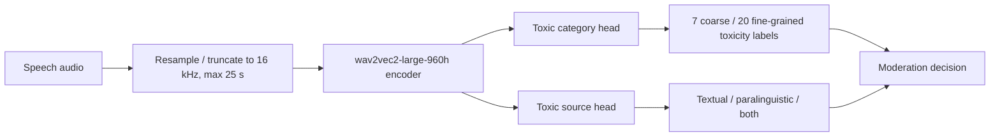
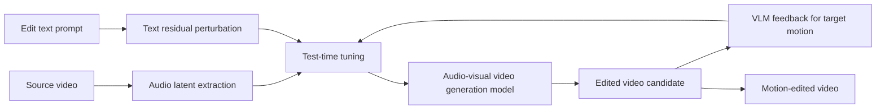
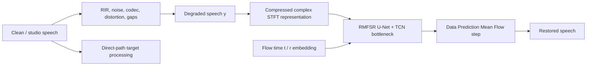
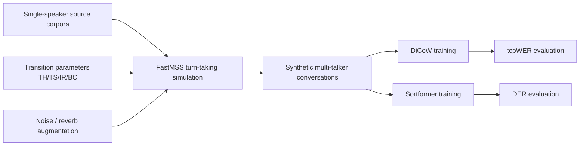
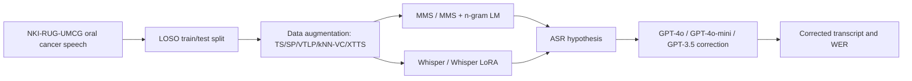

# 语音 / 音频 / 音乐论文速递
## 2026-05-18

> 实际对应 arXiv 更新日：**2026-05-18**  
> 检索范围：`cs.SD + eess.AS`  
> 只放按 ML 顶会审稿口径看，最值得多数读者花时间看的 **5 篇**

## 📋 总览

- 共收录 **5 篇** 相关论文
- 语音安全 / paralinguistic toxicity：**1 篇**
- 音频驱动视频编辑 / 多模态生成控制：**1 篇**，仅拿到 abstract，已显式降级
- 实时语音恢复 / flow matching：**1 篇**
- 多说话人 ASR / 说话人分离标注：**1 篇**
- 病理语音 ASR / LLM 后纠错：**1 篇**

今天这批最值得看的主线不是“又一个通用大模型”，而是三类很工程的问题。第一类是语音安全：`ToxiAlert` 明确把毒性来源拆成文本内容、语气/韵律等 paralinguistic cues，以及二者共同作用，给出 32,561 条、60.82 小时的 ToxiAlert-Bench，并用双头模型同时做 toxic category 和 source identification。它解决的是很多审核系统只看文字、忽略声音表达方式的问题。

第二类是实时音频前端：`Real-time Speech Restoration using Data Prediction Mean Flows` 把 flow matching / mean flow 往低延迟语音恢复上推，重点不是离线大模型听感，而是 20 ms latency、7.8M 参数、1.22G MAC/s 这种部署约束。它还用真实 SIG2024 测试集和 ITU P.804 主观听评做验证，比只报 DNSMOS 的恢复论文更可信。

第三类是数据合成到底怎么影响多说话人任务：`Mind the Gap` 系统比较了 turn-taking、source domain、noise/reverb augmentation 和 synthetic-real mixing，对 DiCoW 多说话人 ASR 与 Sortformer diarization 的影响方向甚至相反。这类论文不一定有新网络，但对真正训练多说话人系统很有价值。

`Oral Cancer ASR` 和 `Sound Sparks Motion` 分别是小数据病理语音和音频-文本控制视频编辑方向。前者结果有 WER 表，工程上很直接；后者由于正文未能解析，只能作为 abstract 级线索保留，不能按完整论文判断。

## 精选入选规则

- **新意（0-3）**：是否提出新的数据定义、训练组织、低延迟结构或任务拆法
- **影响力（0-3）**：是否贴近语音安全、实时前端、多说话人处理、病理语音 ASR 或音频多模态生成
- **证据强度（0-2）**：是否给出 baseline、指标、消融和关键数值
- **受众匹配度（0-2）**：对语音大模型 / 语音前端 / 音频系统 / 数据工程研究者是否有直接参考价值

分数校准：

- **6**：有线索，但证据不完整或偏系统报告
- **7**：值得过一遍，能给工程方案提供参考
- **8+**：建议优先精读或进入复现候选

## 总览表

| 方向 | 序号 | 论文 | 评分 | 关键词 |
|---|---:|---|---:|---|
| 语音安全 / toxicity detection | 1 | Beyond Content: A Comprehensive Speech Toxicity Dataset and Detection Framework Incorporating Paralinguistic Cues | 8/10 | ToxiAlert-Bench, paralinguistic cues, wav2vec2, dual-head, Macro-F1 |
| 音频驱动视频编辑 | 2 | Sound Sparks Motion: Audio and Text Tuning for Video Editing | 6.5/10 | audio latent, text residual, test-time tuning, VLM feedback, motion editing |
| 实时语音恢复 | 3 | Real-time Speech Restoration using Data Prediction Mean Flows | 8/10 | Mean Flow, Data Prediction, RMFSR, 20 ms latency, ITU P.804 |
| 多说话人 ASR / diarization | 4 | Mind the Gap: Impact of Synthetic Conversational Data on Multi-Talker ASR and Speaker Diarization | 8/10 | FastMSS, DiCoW, Sortformer, tcpWER, DER |
| 病理语音 ASR / LLM correction | 5 | Improving Automatic Speech Recognition for Speakers Treated for Oral Cancer using Data Augmentation and LLM Error Correction | 7.5/10 | oral cancer speech, Whisper, MMS, XTTS, GPT correction |

## 🛡️ 语音安全 / Paralinguistic Toxicity

### [1] Beyond Content: A Comprehensive Speech Toxicity Dataset and Detection Framework Incorporating Paralinguistic Cues

- **评分**：8/10
- **作者/机构**：Zhongjie Ba, Liang Yi, Peng Cheng, Qingcao Li, Qinglong Wang, Li Lu
- **论文链接**：https://arxiv.org/abs/2605.15984
- **PDF**：https://arxiv.org/pdf/2605.15984.pdf
- **代码链接**：https://github.com/yiliang-la/ToxiAlert

#### 📌 简介

这篇做的是语音毒性检测，但它不只把音频转文字后做文本审核，而是把毒性来源拆成文本内容和 paralinguistic cues。也就是说，一句话的字面内容可能安全，但说话方式、情绪、讽刺、威胁感或声音表达本身可能带有攻击性；反过来，字面有敏感词但语气场景也可能影响判断。论文围绕这个问题构建 `ToxiAlert-Bench`，并提出 `ToxiAlert` 检测框架。

数据集规模不小：**32,561 audio samples**，共 **60.82 hours**，同时覆盖真实语音和合成毒性语音。标签不是单一 toxic/safe，而是包括 7 个 coarse toxic categories、20 个 fine-grained labels，以及 toxic source 是 textual、paralinguistic，还是二者共同作用。这个定义比很多“文本毒性分类器接 ASR”的方案更接近真实语音社交场景。

#### ☠️ 毒舌点评

这篇值得看，原因是它抓住了语音审核里常被偷懒绕开的部分：声音表达方式本身就是信号。很多 moderation 系统把音频当成 ASR 的输入格式，最后还是做文本审核；这会漏掉讽刺、恐吓、情绪化攻击、戏谑式伤害等非字面线索。

短板也要说清楚。数据构建大量依赖 GPT-4o、Gemini、R1 这类模型做标注和生成，标签偏差和安全策略偏差会被带进数据集。合成 toxic speech 对 paralinguistic-only 场景有帮助，但也可能让模型学到合成器的风格。它是一个强数据和任务定义论文，不是证明语音安全问题已经被解决。

#### 🔧 技术方案

- **模型解决的问题**：
  现有语音毒性检测通常只看文本内容，或者只做二分类 toxic/safe，无法判断毒性来自字面语义、语音表达方式，还是二者共同作用。真实语音社交平台需要识别 sarcasm、threatening tone、sexualized tone、horror intent、hate/extremism 等多层标签。
- **模型架构**：
  - **输入**：最长 25 秒的 16 kHz speech audio。
  - **输出**：toxic/safe、7 类 coarse toxicity category、20 类 fine-grained label，以及 source identification，即 textual / paralinguistic / both。
  - **主干**：`wav2vec2-large-960h` audio encoder。
  - **关键模块**：
    - ToxiAlert-Bench construction pipeline：真实语音筛选、MLLM 辅助标注、GPT-4o 描述抽取、合成样本生成、专家 proofreading。
    - Toxic category head：多类 toxic category 分类。
    - Source head：多标签判断 toxic signal 来自文本、paralinguistic cues 或二者。
    - Multi-stage training：先训练 source head，再训练 category head，最后联合微调。
    - Class-balanced sampler：缓解类别和 source type 不均衡。
- **信号流**：

- **关键设计 / 核心创新**：
  - 数据集不是只做 toxic/safe，而是把毒性来源显式标出来，支持分析“字面无毒但语气有毒”的样本。
  - ToxiAlert-Bench 包含 **6,953** 条 textual-only toxic、**6,728** 条 paralinguistic-only toxic、**2,551** 条 textual+paralinguistic toxic。
  - 使用双头架构把 category prediction 和 source identification 绑定训练，避免模型只记文本关键词。
  - 评估加入 Qwen2-Audio、GPT-4o Audio、Gemini-2.5-Flash、DeToxy、YIDUN 等 baseline，而不是只和小模型比较。
- **训练 / 推理策略**：
  - 数据按约 **7:1:2** 划分，训练集 **22,787**，验证集 **3,255**，测试集 **6,519**。
  - Stage 1 训练 source head，学习 toxicity source。
  - Stage 2 训练 category head，学习 coarse/fine toxic label。
  - Stage 3 用完整数据联合微调两个 head。
  - 损失包含 source multi-label BCE、category weighted cross entropy，以及联合阶段的组合目标，source 辅助权重论文中设置为 `lambda=0.2`。

#### 📊 实验结果

在 ToxiAlert-Bench category classification 上，`ToxiAlert` 的 overall accuracy 为 **80.04%**，Macro-F1 为 **69.69%**，Binary ACC 为 **86.33%**。最强通用 MLLM baseline `Gemini-2.5-Flash` 为 **70.84% ACC / 57.55 Macro-F1 / 75.38 Binary ACC**；`GPT-4o Audio` 为 **61.89% / 39.91 / 64.52**；`Qwen2-Audio` 为 **55.15% / 19.24 / 60.41**。论文声称相对最强 baseline Macro-F1 提升 **21.1%**，accuracy 提升 **13.0%**。

source identification 上，paralinguistic source 的识别最关键。`ToxiAlert` 在 Para. 上达到 **91.18 ACC / 83.30 F1**，Tex. 上达到 **86.21 ACC / 75.66 F1**，sample-level subset accuracy 为 **80.21**。generalization 到 DeToxy-B 时，`ToxiAlert` 的 Balanced ACC **72.29**、F1-Binary **55.83**、Toxic ACC **80.94**，超过 `GPT-4o Audio` 的 **69.20 / 54.32 / 48.51**。消融里去掉 source head 后 toxic classification accuracy 降到 **75.04**，Macro-F1 降到 **66.01**；去掉 multi-stage 后降到 **78.25 / 68.79**。

#### 💡 为什么值得看

如果你做语音审核、语音社交安全、直播语音风控或语音大模型安全评测，这篇比单纯 ASR 后接文本分类更有参考价值。它的关键启发是：语音安全必须把“说了什么”和“怎么说的”拆开建模，否则系统会系统性漏掉 paralinguistic toxicity。

## 🎬 音频驱动视频编辑 / 多模态生成控制

### [2] Sound Sparks Motion: Audio and Text Tuning for Video Editing

- **评分**：6.5/10
- **作者/机构**：AmirHossein Naghi Razlighi, Aryan Mikaeili, Ali Mahdavi-Amiri, Daniel Cohen-Or, Yiorgos Chrysanthou
- **论文链接**：https://arxiv.org/abs/2605.15307
- **PDF**：https://arxiv.org/pdf/2605.15307.pdf
- **项目页**：https://amirhossein-razlighi.github.io/Sound_Sparks_Motion/
- **阅读状态**：⚠️ 基于 abstract 精读；arXiv HTML 正文不可用，本地未取得可解析全文，因此只按 abstract、arXiv 元信息和项目页链接做保守判断

#### 📌 简介

这篇做 motion-centric video editing。问题是：很多生成式视频模型对外观编辑反应还行，比如换颜色、换材质，但对已有视频里的具体动作、局部运动和状态变化控制很弱。作者提出 `Sound Sparks Motion`，不改模型权重，而是在测试时调两类轻量变量：来自 source video 的 audio latent，以及 text-conditioning residual perturbation。

方法的核心说法是：音频通道里可能隐含一些可复用 motion control directions，测试时调整 audio latent 和文本残差，可以诱导底层 audio-visual video generation model 产生 prompt-only 难以实现的动作编辑。由于 abstract 没给完整结构和实验表，这里只能把它当作多模态控制线索，而不是完整音频论文精读。

#### ☠️ 毒舌点评

这篇在本日报里优先级不高，因为它更偏 video editing / graphics，而不是语音音频主线。它入选是因为标题和方法里确实使用 audio conditioning，而且 test-time tuning 的思路可能对音频控制生成有启发。

风险也很明显：只有 abstract 时看不到 baseline、指标、用户研究、失败案例和 tuning 成本。VLM feedback 做 semantic objective 听起来合理，但如果没有严谨评估，很容易变成“挑几个好看的视频 demo”。所以这里保留，但不建议当成语音/音频方向重点复现对象。

#### 🔧 技术方案

- **模型解决的问题**：
  大型视频生成/编辑模型对外观改动更敏感，对具体动作、局部状态变化和时间对齐控制不足。prompt-only 往往无法稳定让已有 clip 产生指定 motion edit。
- **模型架构**：
  - **输入**：source video、目标编辑文本 prompt，以及从 source video 派生出的 audio latent。
  - **输出**：保持原视频主体和视觉质量，同时出现目标动作/状态变化的 edited video。
  - **主干**：底层 audio-visual video generation model；abstract 未给出可核查的具体 backbone。
  - **关键模块**：
    - audio latent tuning：只调整音频条件变量。
    - text-conditioning residual perturbation：在文本条件上加入可学习残差。
    - VLM feedback objective：用视觉语言模型判断目标 motion 是否出现。
    - regularization and perceptual-temporal constraints：约束内容保持、时序一致和视觉质量。
- **信号流**：

- **关键设计 / 核心创新**：
  - 不训练模型权重，只在测试时调 conditioning variables，避免为每个动作重新 fine-tune 大模型。
  - 把 audio latent 当成 motion control 的入口，而不是只靠文本 prompt。
  - 用 VLM 反馈替代难以直接定义的 text-motion temporal alignment 指标。
  - abstract 声称 learned latent controls 可以跨视频迁移，说明可能不是单样本过拟合。
- **训练 / 推理策略**：
  - 论文描述为 training-free framework，主要计算发生在 test-time tuning。
  - 优化变量是 audio latent 和 text residual，不更新 video model weights。
  - 推理过程中生成视频候选，再由 VLM 给目标动作是否出现的反馈，迭代调整条件。
  - 正文不可用，无法确认迭代步数、优化器、regularization 权重和实际推理成本。

#### 📊 实验结果

abstract 没有给具体数值，只说相比 prompt-only control，更容易诱导模型实现 motion edits，并且 learned latent controls 在不同视频间有 transferability。这里能确认的 baseline 只有 prompt-only editing 这个概念性对照，无法看到 CLIP/VideoScore/user study 等指标，也无法看到失败率。

因此这篇证据强度明显弱于同日其他 4 篇。它的价值是提供一个“通过音频条件通道控制视频动作”的思路；但没有全文表格前，不能判断它相对现有 video editing baseline 的真实优势。

#### 💡 为什么值得看

如果你关心音频条件生成、AIGC 视频编辑或“声音控制动作”的多模态接口，可以扫一下项目页和 demo。对语音/音频主线来说，它不是优先复现对象；但它提示了一个方向：audio latent 可能不只是配音条件，也可能成为 motion control 的隐式手柄。

## 🎧 实时语音恢复 / Flow Matching

### [3] Real-time Speech Restoration using Data Prediction Mean Flows

- **评分**：8/10
- **作者/机构**：Sebastian Braun
- **论文链接**：https://arxiv.org/abs/2605.16251
- **PDF**：https://arxiv.org/pdf/2605.16251.pdf
- **代码链接**：未在正文中看到可信官方开源链接；论文给出音频示例页

#### 📌 简介

这篇做 real-time speech restoration，目标不是普通降噪，而是处理更难的非线性和非唯一恢复问题：带宽缺失、codec artifacts、clipping、distortion、TF masking/gaps、dropouts、过强噪声抑制等。传统 speech enhancement 多处理 additive noise / reverb，但这些破坏会让恢复问题更像生成式重建。

作者把 flow matching 和 Mean Flow 用到实时语音恢复，并提出 `RMFSR` 低延迟结构。重点是部署约束：**20 ms** algorithmic latency、**7.8M** 参数、**1.22G MAC/s**，并用 Data Prediction + Improved Mean Flow 让低 NFE 推理更接近大模型质量。这个方向对通信、会议、助听、实时音频链路很有实际意义。

#### ☠️ 毒舌点评

这篇比很多“离线大模型修音频”的论文更务实。音频恢复 demo 很容易靠大模型、长 lookahead 和离线处理做得好听，但一到实时通信场景就没法用。作者把延迟、复杂度、context、MAC/s 摆出来，这一点很重要。

不过它也没有把问题完全解决。论文自己承认 one-step inference 质量仍不足，RMFSR-DP-IMF 虽接近 non-causal NCSN++，但 WER 仍有差距，discontinuity 也可能出现 chopped syllables。它值得看，是因为它清楚地展示了实时约束下 flow matching 能到哪里，而不是因为它已经替代 GAN 或大离线模型。

#### 🔧 技术方案

- **模型解决的问题**：
  实时语音链路中常见的退化不只是噪声和混响，还包括带宽限制、notch filter、非线性失真、MP3/GSM codec、phase distortion、amplitude modulation、bit-crush、dropouts 和过强 noise suppression。大 diffusion/FM 模型质量高但 latency 和 compute 不适合实时。
- **模型架构**：
  - **输入**：degraded speech spectral representation，以及 flow time embedding。
  - **输出**：restored speech spectrum / waveform，目标是接近 studio-quality target。
  - **主干**：`RMFSR`，5-layer U-Net with inverted residual bottleneck layers + frequency attention + TCN bottleneck。
  - **关键模块**：
    - Data Prediction loss：替代纯 velocity FM loss，提高恢复质量。
    - Improved Mean Flow：用较少步数逼近多步 flow。
    - Causal convolutional encoder：避免 NCSN++ temporal downsampling 带来的大 lookahead。
    - Pink noise prior and logit-normal time sampling：改善 flow-path distribution。
    - On-the-fly degradation pipeline：构造 degraded/target pair。
- **信号流**：

- **关键设计 / 核心创新**：
  - 把 Mean Flow 和 data prediction 结合，用于一般 speech restoration，而不是只做标准噪声增强。
  - RMFSR 以 20 ms STFT latency 为主要延迟，不引入额外大 lookahead。
  - 模型复杂度比 NCSN++ causal 低很多：RMFSR **7.8M** 参数、**1.22G MAC/s**，NCSN++ causal 是 **53.0M** 参数、**142.78G MAC/s**。
  - 训练退化覆盖真实通信和设备链路问题，而不是只加噪声。
- **训练 / 推理策略**：
  - 训练数据用 EARS clean speech，RIR 模拟房间，DNS Challenge noise 做背景噪声。
  - 退化包括 100-800 Hz lower cutoff、1.5 kHz-Nyquist upper cutoff、notch filters、nonlinear distortion、MP3/GSM codec、spectral masking、phase distortion、amplitude modulation、10-80 ms dropouts。
  - Flow time 使用 logit-normal distribution，mean 为 **0.4**；prior noise 使用 pink noise，`sigma_max=0.3`、`sigma_min=1e-8`。
  - 推理以低 NFE 为目标；NFE 越少实时性越好，但质量和 WER 会受影响。

#### 📊 实验结果

复杂度表里，baseline / 对比模型 `NCSN++ noncausal` latency **600 ms**、参数 **53.0M**、**66.41G MAC/s**、context **7.3s**；`NCSN++ causal` latency **20 ms**、参数 **53.0M**、**142.78G MAC/s**、context **0.61s**；`StreamFM` latency **32 ms**、**27.9M** 参数、**282G MAC/s**；`RMFSR` latency **20 ms**、**7.8M** 参数、**1.22G MAC/s**、context **2.13s**。这个部署差异是这篇最硬的证据。

主观 ITU P.804 表里，`RMFSR-DP-IMF` Overall MOS **2.91**，高于 unprocessed **2.72** 和 `NCSN++ causal-DP` **2.31**，但低于 `NCSN++ noncausal-DP` **3.20**。在 Noise / Reverb / Loudness 上，RMFSR-DP-IMF 分别 **4.35 / 4.41 / 4.31**，超过 noncausal 的 **4.05 / 4.36 / 3.96**；但 Coloration、Discontinuity、Signal、Overall 仍落后。这说明它在实时约束下很强，但不是全指标压过离线上界。

#### 💡 为什么值得看

如果你做实时语音增强、语音恢复、会议通信、低延迟音频 SDK，这篇很值得读。它不是简单刷 MOS，而是把 latency、MAC/s、NFE、WER、主观听评和真实退化链路放在一起看，能直接帮助判断 flow matching 是否适合进实时产品。

## 🧑‍🤝‍🧑 多说话人 ASR / Speaker Diarization

### [4] Mind the Gap: Impact of Synthetic Conversational Data on Multi-Talker ASR and Speaker Diarization

- **评分**：8/10
- **作者/机构**：Alexander Polok, Ivan Medennikov, Jan Černocký, Shinji Watanabe, Lukáš Burget, Samuele Cornell；Brno University of Technology, Carnegie Mellon University, NVIDIA 等
- **论文链接**：https://arxiv.org/abs/2605.15442
- **PDF**：https://arxiv.org/pdf/2605.15442.pdf
- **代码/模型线索**：论文说明 release FastMSS，并引用 DiCoW / Sortformer Hugging Face 模型链接

#### 📌 简介

这篇研究 synthetic conversational data 对多说话人 ASR 和 speaker diarization 的影响。它不提出一个新 ASR 模型，而是系统回答一个更实际的问题：训练 DiCoW 这类多说话人 ASR 和 Sortformer diarization 时，合成对话数据应该怎么生成？turn-taking、overlap、source domain、noise/reverb 和 synthetic-real mixing 到底怎么影响结果？

论文使用 `FastMSS` 生成多说话人长对话，比较不同 turn-taking transition、不同源语料、不同声学增强和真实数据混合策略。最有价值的结论是：同一套合成策略不能同时最优服务 ASR 和 diarization。增加 overlap 对 DiCoW 有利，但会伤害 Sortformer 的边界学习。

#### ☠️ 毒舌点评

这篇很实用，因为多说话人系统的失败经常不是模型结构，而是合成数据做得像假的。很多人把单说话人语音随机 overlap 一下就叫 conversation simulation，然后指望模型学会会议场景；这篇至少把 turn-taking statistics、source mismatch 和 far-field augmentation 拆开做了。

短板是它更像系统实验论文，不会给你一个新网络模块。它依赖 DiCoW 和 Sortformer 这两个既有模型，结论也可能随 backbone 变化。但对工程训练来说，这种“合成数据怎么配”的结论往往比新模块更有用。

#### 🔧 技术方案

- **模型解决的问题**：
  多说话人 ASR 和 diarization 都依赖大量对话数据，但真实多说话人会议数据稀缺。合成数据可以扩规模，却容易在 turn-taking、overlap、声学环境和 source domain 上偏离真实世界，导致模型学到错误分布。
- **模型架构**：
  - **输入**：单说话人 source utterances、turn-taking transition parameters、noise/reverb 配置。
  - **输出**：multi-speaker synthetic conversations，以及用于 DiCoW / Sortformer 训练的音频和对齐标签。
  - **主干**：`FastMSS` simulator + `DiCoW` multi-talker ASR + `Sortformer` speaker diarization。
  - **关键模块**：
    - Turn-taking model：TH/TS/IR/BC 四类转移，分别表示 same-speaker hold、speaker switch、interruption、backchannel。
    - Source domain selection：LibriSpeech、VoxPopuli、otoSpeech、AMI close-talk、NSF-1 close-talk、Combined。
    - Acoustic augmentation：noise、reverb、noise+reverb。
    - Training strategy comparison：synthetic only、real only、real+synthetic、synthetic to real fine-tuning。
- **信号流**：

- **关键设计 / 核心创新**：
  - 同时评估 MT-ASR 和 diarization，而不是只在一个任务上调合成数据。
  - 明确比较 flat prior、NSF-1 fitted、CALLHOME fitted、CALLHOME overlap boosted 四种 turn-taking。
  - 分析 source domain diversity 是否比精确 domain matching 更重要。
  - 把 synthetic-only、real-only、joint training、synthetic pretrain then real fine-tune 放在同一个表里比较。
- **训练 / 推理策略**：
  - DiCoW 使用 Whisper-based target-speaker ASR，主要用 tcpWER 评估，5 秒 collar。
  - Sortformer 使用 4-speaker offline setup，初始化自 109M 参数 NEST-L encoder，使用 DER with 0s collar。
  - DiCoW 训练常用 500h simulated conversations；Sortformer 使用 2,000h simulated conversations。
  - 合成 turn-taking 用 transition matrix 控制 TH、TS、IR、BC；overlap boosted 会提高 interruption/backchannel 概率。

#### 📊 实验结果

turn-taking 结果很有信息量。以 flat prior 作为 baseline / 对比，DiCoW 在 NSF-1 上从 **24.8 tcpWER** 降到 NSF-1 fitted **23.6**，CALLHOME **22.8**，CALLHOME overlap boosted **22.1**；AMI 上也从 **29.2** 降到 **25.1**。但 Sortformer 相反，CALLHOME 的 macro DER **26.1**，overlap boosted 变差到 **27.6**。这直接说明 ASR 喜欢更多 overlap 暴露，diarization 更需要准确说话人边界。

source domain 表里，DiCoW synthetic-only `Combined` macro avg **10.0**，比 real-only **10.9** 还好；`Real + Combined` 到 **8.8**。augmentation 表里，DiCoW 加 noise 只从 **14.0** 到 **13.7**，noise+reverb **13.8**，提升有限；Sortformer 则从 clean macro DER **26.1** 降到 noise+reverb **22.2**。最终 data combination 里，Sortformer `Synthetic -> real` macro DER **15.5**，优于 real only **17.4** 和 real+synthetic **16.3**。

#### 💡 为什么值得看

如果你在训练会议 ASR、说话人分离、diarization 或多说话人语音大模型，这篇非常值得读。它的核心价值是告诉你：合成数据不是越真实越好，也不是越 overlap 越好，而是必须按任务目标拆开调。

## 🏥 病理语音 ASR / LLM 后纠错

### [5] Improving Automatic Speech Recognition for Speakers Treated for Oral Cancer using Data Augmentation and LLM Error Correction

- **评分**：7.5/10
- **作者/机构**：Hidde Folkertsma, Thomas Tienkamp, Sebastiaan de Visscher, Max Witjes, Rob van Son, Jiapan Guo, Bence Mark Halpern
- **论文链接**：https://arxiv.org/abs/2605.15854
- **PDF**：https://arxiv.org/pdf/2605.15854.pdf
- **代码链接**：未在正文中看到可信官方开源链接

#### 📌 简介

这篇做 oral cancer speech 的 ASR 改进。口腔癌治疗后，舌、颌、口腔结构变化会导致发音不清、共振变化和节奏变化，普通 ASR 对这类病理语音通常很差。论文在 Dutch oral cancer speech 数据集 `NKI-RUG-UMCG` 上比较多种数据增强和 LLM error correction。

方法不复杂，但实验比较完整：增强包括 time stretching、speed perturbation、VTLP、kNN-VC 和 XTTSv2 TTS；ASR 模型包括 MMS、MMS+n-gram LM、Whisper、Whisper LoRA；后处理用 GPT-4o、GPT-4o-mini、GPT-3.5-turbo 纠正 ASR 输出。它是小数据病理语音里很务实的一篇。

#### ☠️ 毒舌点评

这篇没有新模型，但比很多“病理语音大模型”论文更诚实。它把小数据、speaker leave-one-out、增强方法和 LLM 后纠错都摆出来比较，最终明确说 TTS 增强和 LLM correction 有用。

局限也很硬：数据只有 **11** 个 oral cancer patients 和 **8** 个 controls，还是 sound booth 里的 read speech，不代表真实聊天、门诊或电话环境。LLM correction 也可能把医学场景里重要但罕见的词改错。它适合做工程 baseline，不适合被当成泛化结论。

#### 🔧 技术方案

- **模型解决的问题**：
  普通 ASR 在 oral cancer speech 上 WER 高，原因包括发音器官变化、构音不清、说话节奏和共振改变。病理语音数据少，难以从零训练 ASR，因此需要数据增强和输出后纠错。
- **模型架构**：
  - **输入**：Dutch oral cancer speech audio。
  - **输出**：Dutch transcription，经过可选 LLM correction 后重新计算 WER。
  - **主干**：`MMS` CTC ASR、`MMS + Dutch n-gram LM`、`Whisper` seq2seq、`Whisper LoRA`。
  - **关键模块**：
    - Time stretching / Speed perturbation：改变节奏。
    - VTLP：模拟 vocal tract length 变化。
    - kNN-VC：用 WavLM feature nearest neighbors 做 voice conversion。
    - XTTSv2：用 Dutch Common Voice prompts 合成更多文本覆盖。
    - LLM correction：GPT-4o、GPT-4o-mini、GPT-3.5-turbo 对 ASR hypothesis 做句子级修正。
- **信号流**：

- **关键设计 / 核心创新**：
  - 在同一个 Dutch oral cancer speech benchmark 上比较传统信号增强、VC、TTS 和 LLM correction。
  - 用 leave-one-speaker-out，避免同一患者语音泄漏到训练和测试。
  - XTTS 使用 Dutch Common Voice 21.0 的前 **2222** 条 validated sentences，补足原数据 prompt 少的问题。
  - LLM correction 不只测一个模型，而是比较 GPT-4o、GPT-4o-mini、GPT-3.5-turbo。
- **训练 / 推理策略**：
  - 数据集包含 **202 prompts**，由 **11** 名患者和 **8** 名 age-matched controls 朗读；每次 held-out 一个 patient，形成 **11** 个 finetuning runs。
  - 原始 all-speaker 训练集约 **2496 utterances / 4.45h**；patients-only 约 **1560 utterances / 2.89h**。
  - MMS 和 Whisper 都 batch size **32**，finetune **750 steps**，warmup **100 steps**；MMS 学习率 `1e-3`，Whisper 学习率 `1e-4`。
  - LLM correction temperature 设为 **0**，每个 test sentence 运行 3 次并取平均 WER。

#### 📊 实验结果

无 finetuning 时，MMS WER **44.5**，MMS+n-gram **29.1**，Whisper **21.7**，Whisper LoRA **21.7**。patients-only finetuning 后，Whisper 到 **19.6**，Whisper LoRA 到 **16.3**。加 XTTS 后，MMS uncorrected 从 patients-only **36.1** 到 **32.7**，MMS+n-gram 从 **20.3** 到 **17.9**，Whisper 从 **19.6** 到 **17.3**；论文总结 TTS 平均带来约 **8% relative WER decrease**。

LLM correction 的提升更大。XTTS + GPT-3.5-turbo 下，MMS WER **17.6**，MMS+n-gram **15.3**，Whisper **12.9**，Whisper LoRA **13.4**。全表最优 WER **12.9**，出现在 `Whisper + XTTS + GPT-3.5-turbo` 和 `Whisper LoRA + VTLP + GPT-3.5-turbo`。论文总结 finetuned ASR 模型经 LLM correction 后 WER 相对下降 **21.4-26.2%**，non-finetuned 模型约 **10.0%**；整体相对 baseline，Whisper 约 **40%**、MMS 约 **50%** WER decrease。

#### 💡 为什么值得看

如果你做病理语音、低资源 ASR、口音/构音异常识别或医疗场景语音转写，这篇可以直接当实验 recipe。它的启发是：小数据特殊人群 ASR 不一定先造新模型，TTS 增强、LoRA 微调和 LLM 后纠错的组合，可能比单点模型替换更有效。

## 最后结论

2026-05-18 这批最值得优先读的是 `ToxiAlert`、`RMFSR` 和 `Mind the Gap`。`ToxiAlert` 解决语音安全里“字面内容之外的声音毒性”问题；`RMFSR` 把 flow matching 拉回实时部署约束；`Mind the Gap` 则把多说话人合成数据的关键旋钮拆清楚。

`Oral Cancer ASR` 是小数据病理语音方向的实用工程论文，TTS 增强和 LLM 后纠错都给了明确 WER 数字。`Sound Sparks Motion` 只按 abstract 降级保留，不建议当成当天重点论文。

这次失败的根因不是候选抓取，而是渲染稿仍然会输出候选稿/证据稿污染内容，过不了满意版结构门禁。正式交付必须继续以全文证据人工收敛，不能把脚本渲染稿当最终报告。
