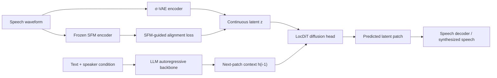
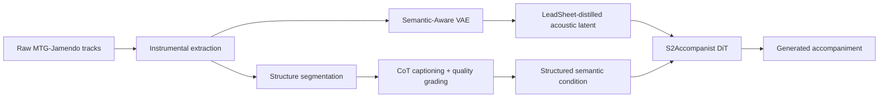
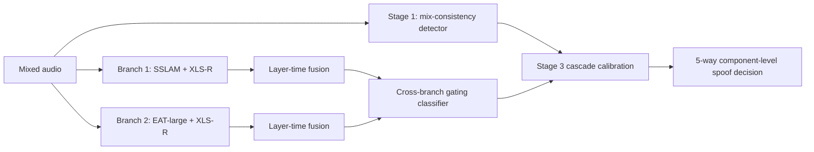

# 语音 / 音频 / 音乐论文速递
## 2026-05-19

> 实际对应 arXiv 更新日：**2026-05-19**  
> 检索范围：`cs.SD + eess.AS`  
> 只放按 ML 顶会审稿口径看，最值得多数读者花时间看的 **3 篇**

## 📋 总览

- 共收录 **3 篇** 相关论文
- 语音生成 / TTS：**1 篇**
- 音乐生成：**1 篇**
- 语音安全 / 音频 deepfake detection：**1 篇**

今天这批真正值得看的主线很集中，不是“谁又把模型堆大了一点”，而是三种更实的建模问题。第一条是连续语音表示和自回归 TTS 之间的错位，`SemaVoice` 把 continuous AR TTS 最尴尬的点直接挑明了: VAE latent 擅长重建声学纹理，但不天然对齐文本语义，所以模型很容易在 autoregressive generation 里前面说得像人话，后面越说越跑偏。它用 `SFM-guided alignment` 去补这个缺口，实验里不仅把英语 `WER` 压到 **1.71%**，还把中文自然度主观分数做到了 **4.07**，这就不是“有想法没落地”了。

第二条是受限数据和算力下的音乐生成。`S2Accompanist` 不靠“再喂几十万小时 proprietary music”取胜，而是老老实实在 `MTG-Jamendo` 这种中等规模数据上做结构化 caption、质量分级和 `Semantic-Aware VAE` 蒸馏，把 accompaniment 生成这件事从“全局 tag 对全曲采样”推到“按结构片段、按语义局部生成”。它在挑战赛约束下做到 **FAD 0.417 / CLAP 0.261 / CCS 0.867**，还拿到 Efficiency Track 第 1，这对真正在做受限资源音乐生成的人比又一个大而慢的 demo 更有意义。

第三条是音频安全。`EnvTriCascade` 做的不是常见的“整段音频真假二分类”，而是 component-level audio anti-spoofing: 语音成分和环境声音成分可以独立是真或假。这个设定更接近真实内容审核和 AIGC 伪造场景，也迫使模型不能只盯住说话人 timbre artifacts。它的三阶段 cascade 虽然不算范式革命，但至少把 `XLS-R + SSLAM / EAT-large` 的互补性讲清楚了，`Macro-F1 0.8266` 相比官方 baseline 的 **0.6327** 不是小修小补。

这天的可交付主线就到这里为止。我没有硬凑第四篇，因为剩余候选要么偏跨模态边缘，要么和语音/音乐主线关系太弱。与其为了数量把日报做脏，不如保留 3 篇高质量精读。

## 精选入选规则

- **新意（0-3）**：是不是提出了新的表示对齐、训练组织、结构条件或任务拆法
- **影响力（0-3）**：是不是贴近 TTS、Audio LLM、音乐生成、语音安全这些真主线
- **证据强度（0-2）**：有没有 baseline、指标、关键数值和消融
- **受众匹配度（0-2）**：对语音大模型 / 语音前端 / 音乐生成 / 语音安全研究者有没有直接参考价值

分数校准：

- **6**：有点子，但证据不完整或偏边缘
- **7**：值得过一遍，能给方法设计或工程选择提供线索
- **8+**：建议优先精读或进入复现候选

## 总览表

| 方向 | 序号 | 论文 | 评分 | 关键词 |
|---|---:|---|---:|---|
| 语音生成 / TTS | 1 | SemaVoice | 8.9/10 | continuous AR TTS, SFM-guided alignment, LocDiT, Seed-TTS |
| 音乐生成 | 2 | S2Accompanist | 8.4/10 | accompaniment generation, Semantic-Aware VAE, structured caption, FAD |
| 语音安全 | 3 | EnvTriCascade | 7.9/10 | component-level deepfake detection, XLS-R, SSLAM, EAT-large, Macro-F1 |

## 🗣️ 语音生成 / TTS

### [1] SemaVoice: Semantic-Aware Continuous Autoregressive Speech Synthesis

- **评分**：8.9/10
- **作者/机构**：Huimeng Wang, Hui Lu, Jiajun Deng, Haoning Xu, Youjun Chen, Xueyuan Chen, Zhaoqing Li, Shuhai Peng, Shiyin Kang, Xunying Liu；香港中文大学、清华大学、SenseTime Research
- **论文链接**：https://arxiv.org/abs/2605.16964
- **PDF**：https://arxiv.org/pdf/2605.16964.pdf
- **代码链接**：正文里未看到可信官方开源仓库
- **Demo 链接**：正文未给出明确公开 demo

#### 📌 简介

这篇做的是 zero-shot TTS 里一条很值得继续挖的线：`continuous autoregressive TTS`。它的基本判断很对，甚至可以说戳中了这条路线一直没完全解释清的痛点。连续 latent 表示虽然比离散 token 更有利于高保真重建，但很多 VAE latent 天生是为 reconstruction 学的，不是为 semantic-prosodic planning 学的。结果就是 autoregressive 模型一边要承担高层语义和韵律规划，一边又背着一堆低层 acoustic texture，越往后生成越容易漂。

`SemaVoice` 的办法不是重新发明整个 TTS pipeline，而是在 continuous latent 上加一层 `SFM-guided alignment`。具体做法是用冻结的 speech foundation model 特征去约束 VAE latent，让 latent 同时保留局部语义一致性和全局结构关系。然后在 AR 主干上接一个 patch-wise diffusion head `LocDiT` 做下一 patch 的连续表示生成。说白了，它想把“先想明白说什么，再把声学细节补出来”这件事，从 intuition 变成训练目标。

#### ☠️ 毒舌点评

这篇不是换个名字重讲 `CosyVoice / IndexTTS / VoxCPM` 的老故事。它真正有价值的地方在于承认 continuous AR TTS 的问题不只在 backbone，不只在 decoder，更在 representation mismatch。很多论文把 continuous latent 当成“比 discrete token 更细腻”的天然优点，但不愿意面对它在 long-range semantic planning 上其实可能更拖后腿。`SemaVoice` 至少把这事说透了，还拿消融证明不是嘴炮。

短板也得摆明。第一，它的收益很大程度上依赖大规模 bilingual 训练数据，完整版是 **150K 小时**，这不是普通团队轻易能复现的规模。第二，它的 speaker similarity 没有把所有 baseline 一路碾过去，英语 `SIM 0.694` 仍略低于 `IndexTTS 2` 的 **0.706**。所以这不是“全指标通杀”的终局方案，而是一篇把 continuous AR TTS 路子往前推了一步的强稿。

#### 🔧 技术方案

- **模型解决的问题**：
  continuous AR TTS 同时负责高层语义-韵律规划和低层声学建模，但常规 VAE latent 更偏 reconstruction，导致 semantic coherence 不够稳，autoregressive generation 容易累计错误。
- **模型架构**：
  - **输入**：文本条件、speaker 条件，以及由连续 speech VAE 提供的训练目标表示。
  - **输出**：连续 speech latent patch，再经解码器还原成语音。
  - **主干**：`LLM backbone + Local Diffusion Transformer (LocDiT)` 的 continuous autoregressive synthesis framework。
  - **关键模块**：
    - `σ-VAE` 高压缩连续表示；
    - `SFM-guided alignment`，用冻结的 speech foundation model 特征做语义对齐；
    - `LocDiT` patch-wise diffusion head；
    - `LLM-based classifier-free guidance`。
- **信号流**：

- **关键设计 / 核心创新**：
  - 把对齐对象放在 continuous latent 和 SFM semantic feature 之间，而不是只在文本-声学边界做约束。
  - alignment loss 同时包含 frame-wise consistency 和 pair-wise structure consistency，不只是逐帧拉近。
  - diffusion head 不只看 LLM hidden state，还看 previous latent patch，缓解局部连续性断裂。
- **训练 / 推理策略**：
  - VAE 在 **20K 小时** 中英双语子集上训练；
  - TTS 有两套规模：`SemaVoice-Emilia` 用约 **50K 小时** Emilia 英语数据，完整 `SemaVoice` 用 **150K 小时**双语数据；
  - `SemaVoice-Emilia` 训练 **150K steps**，完整版训练 **300K steps**；
  - continuous latent 频率是 **15 Hz**，对应约 **1600x** 时间压缩；
  - 推理时通过 LLM 逐 patch 生成上下文，再由 `LocDiT` 预测下一连续 patch。

#### 📊 实验结果

- 数据集与评测：
  - 训练：`Emilia` 开源数据 + 内部语音数据；
  - 评测：`Seed-TTS` 英文/中文测试集，以及更难的 hard set；
  - 指标：`WER / CER / SIM / MOS / STOI / PESQ / UTMOS`。
- 和强 baseline 对比：
  - `SemaVoice` 在 Seed-TTS 英文上达到 **WER 1.71% / SIM 0.694**；
  - 中文上达到 **CER 1.18 / SIM 0.754**；
  - hard set 上达到 **CER 8.09 / SIM 0.711**；
  - 对比 `CosyVoice2`：**2.57 / 0.659**（英文）和 **1.45 / 0.757**（中文）；
  - 对比 `IndexTTS 2`：**2.23 / 0.706**（英文）和 **1.03 / 0.765**（中文）；
  - 对比 `VoxCPM-Emilia`：**2.34 / 0.681**（英文）和 **1.11 / 0.740**（中文）。
- 主观结果：
  - 英文 `N-MOS` 为 **3.98 ± 0.12**，接近 ground truth 的 **4.02 ± 0.09**；
  - 中文 `N-MOS` 为 **4.07 ± 0.13**，略高于 `CosyVoice 2` 的 **3.73 ± 0.11** 和 `IndexTTS 2` 的 **3.79 ± 0.13**；
  - 中文 `S-MOS` 为 **4.03 ± 0.11**，和 `CosyVoice 2`、`IndexTTS 2` 同量级。
- 关键消融：
  - 完整模型在 English ablation setting 上为 **WER 2.97 / SIM 0.635**；
  - 去掉 `SFM alignment` 后退化到 **WER 3.40 / SIM 0.625**；
  - 去掉 history conditioning 后直接崩到 **WER 8.46 / SIM 0.587**；
  - 在更细粒度 `60Hz` 表示下，去掉 alignment 会把 `WER` 从 **14.71%** 拉高到 **28.06%**，说明粒度越细，alignment 越重要。
- baseline 名单：
  - `CosyVoice`、`CosyVoice2`、`IndexTTS 2`、`VoxCPM`、`F5-TTS`、`MaskGCT`、`SparkTTS`、`HiggsAudio-v2`。

这组结果最能说明问题的其实不是主表第一名，而是两类消融的趋势。`SFM alignment` 去掉后性能不是小幅波动，而是系统性退化，说明作者抓到的问题确实存在；而 history conditioning 一拿掉就直接掉到 **8.46 WER**，说明 continuous AR 生成里局部 patch 依赖如果处理不好，模型会比离散 token 系统更容易累计崩坏。也就是说，这篇不是“多加一个 loss 换来一点提升”，而是把一条 continuous AR 路线真正补齐了两个关键稳定器。

还有一个容易被忽略的点是它对 bilingual zero-shot TTS 的意义。很多论文英文效果能看，切到中文或更复杂语料就暴露出韵律和语义同步问题。`SemaVoice` 至少证明 continuous AR 路线在中英文双语场景下不是天然吃亏，这比只在单语 benchmark 上刷漂亮数字更有说服力。

#### 💡 为什么值得看

如果你关心 TTS 里 continuous representation 到底值不值得继续押，这篇很值得看，因为它终于不是只拿听感说话，而是把“representation 和 sequence modeling 不匹配”这件事做成了可验证假设。对做 zero-shot TTS、voice cloning 和 Audio LLM speech generation 的人，这篇比单纯再换一个 tokenizer 名字更有参考价值。

更具体一点，它值得看的地方在于它把“高保真”和“高语义一致性”之间的 trade-off 重新拆了。以前很多 continuous TTS 工作默认接受一个现实：latent 越细，重建越好，但 autoregressive 规划越难；然后大家只能靠更大的模型或者更复杂的 decoder 顶过去。`SemaVoice` 告诉你，问题不一定在 decoder 算力不够，也可能是 latent 本身对语义不友好。这对后面做 speech world model、Audio LLM speech token 设计、甚至多说话人语音生成的人都有外溢启发。

## 🎼 音乐生成

### [2] S2Accompanist: A Semantic-Aware and Structure-Guided Diffusion Model for Music Accompaniment Generation

- **评分**：8.4/10
- **作者/机构**：Huakang Chen, Wenkai Cheng, Guobin Ma, Chunbo Hao, Yuxuan Xia, Mengqi Wei, Zhixian Zhao, Pengcheng Zhu, Hanbing Zhang, Lei Xie；作者团队来自国内音乐/语音生成研究团队，正文可确认是 Lei Xie 合作系统
- **论文链接**：https://arxiv.org/abs/2605.17414
- **PDF**：https://arxiv.org/pdf/2605.17414.pdf
- **代码链接**：正文未给出公开仓库
- **Demo 链接**：正文未给出独立 demo，但论文围绕 `ATTM Grand Challenge` 提交系统展开

#### 📌 简介

这篇做的是 pure music accompaniment generation，而且是在一个故意不让你走“堆数据、堆算力”捷径的挑战设定里做。官方约束很死：训练只能用 `MTG-Jamendo`，你不能像大厂那样直接拿几十万小时 private music corpus 把问题抹平。所以这篇真正的看点不在 diffusion backbone 本身，而在它怎么把弱标注音乐数据先变得更可学。

作者给了两层关键处理。第一层是 data pipeline：先做 accompaniment extraction，再做结构片段切分，然后用 LALM + CoT prompting 给每个局部段落生成更细的语义 caption，最后再结合音质和语义相似度做 quality grading。第二层是 `Semantic-Aware VAE Fine-Tuning`：不是让 VAE 只学声学重建，而是显式蒸馏 `LeadSheet` 结构，把基础和声/旋律骨架压进 acoustic latent 里。这样后面的 DiT 才不是对一堆“只会复现纹理、不会保结构”的 latent 盲采样。

#### ☠️ 毒舌点评

这篇的优点很现实：它不是“又一个 text-to-music 巨模型”，而是正面回答资源受限时怎样把 accompaniment 做好。很多音乐生成论文喜欢拿 proprietary data 把方法差异淹没掉，最后你只能得到“更大更强”的废结论。`S2Accompanist` 至少告诉你，在 **3.7K 小时** 训练数据、**402M** 参数下，怎么靠结构化数据和更好的 VAE 把质量抬起来。

但别过度神化。它的评测强依赖 challenge-specific 指标和 benchmark，`FAD / CLAP / CCS` 组合虽然有信息量，但和通用音乐生成论文的横向可比性仍有限。而且它主要证明“在比赛约束下这套 pipeline 很有效”，还没完全证明它脱离该 benchmark 后也会稳。

#### 🔧 技术方案

- **模型解决的问题**：
  受限数据场景下，纯 accompaniment 生成往往缺细粒度语义描述、局部结构标签和高质量 latent，导致 diffusion model 只能学到模糊的 global style，难以做稳定、可控的局部 accompaniment generation。
- **模型架构**：
  - **输入**：结构切分后的伴奏音频段落、局部语义 caption，以及由 Semantic-Aware VAE 生成的 acoustic latent。
  - **输出**：纯伴奏音频。
  - **主干**：`Semantic-Aware VAE + S2Accompanist DiT`。
  - **关键模块**：
    - 自动化 `Data Pipeline`：instrumental extraction、structure labeling、semantic captioning、quality grading；
    - `Semantic-Aware VAE Fine-Tuning`：把 `LeadSheet` 结构蒸馏进 acoustic latent；
    - `Structure-Guided Diffusion Transformer`：在局部结构段落上做 accompaniment generation；
    - `SFT on top-20% high-quality data`：用数据分级结果做高质量微调。
- **信号流**：

- **关键设计 / 核心创新**：
  - 不再只用全曲级 tag，而是把伴奏切成结构段落做局部 caption，解决 global tag 过粗的问题。
  - 用 `LeadSheet` 做 semantic distillation，把音乐骨架灌进 latent，而不是只靠 decoder 记纹理。
  - 把音质和语义相似度一起做 data grading，再拿 top 20% 做 SFT，明显是在防止脏数据拖后腿。
- **训练 / 推理策略**：
  - `Semantic-Aware VAE` 继承 DiffRhythm 系列 VAE 架构，约 **157M** 参数；
  - VAE 处理 **44.1 kHz** 音频，产生 **64 维 latent / 25 Hz** 帧率表示；
  - 语义 VAE 微调用全量 `MTG-Jamendo` 的 **3 秒** 段训练 **100k steps**；
  - `S2Accompanist DiT` 规模约 **402M** 参数，先 pretrain **400k steps**，再用 top-20% 数据做 **10 个 epoch** 的 SFT；
  - 训练只使用 `MTG-Jamendo`，符合 challenge 限制。

#### 📊 实验结果

- Challenge 主榜结果：
  - `S2Accompanist (Ours)`：**402M** 参数，**3.7K hrs** 训练数据；
  - `FAD 0.417`，`CLAP 0.261`，`CCS 0.867`；
  - 论文明确写的是 **Efficiency Track Rank 1**，并声称 overall best `FAD`。
- 主观结果：
  - 按 challenge organizer 给出的 `MOS`，`S2Accompanist` 的 `MOSall` 为 **3.250**，`MOSexpert` 为 **3.335**；
  - 对比 `MusicGen-small` 的 **3.538 / 3.425`，它主观分不一定碾压，但在受限条件下仍有竞争力；
  - 对比 `Submission e01` 的 **3.225 / 3.177`，S2Accompanist 更稳。
- 关键消融：
  - `DiffRhythm VAE` 到 `Semantic VAE Fine-Tuning`：`FAD 0.623 -> 0.367`，`CLAP 0.143 -> 0.152`，说明 VAE 语义蒸馏对音质提升最明显；
  - 结构与 caption 改造后，`CLAP` 从 **0.152** 提到 **0.179**，`CCS` 从 **0.714** 提到 **0.793**；
  - `Pretrain Only` 为 **FAD 0.348 / CLAP 0.182 / CCS 0.745**；
  - `Pretrain + SFT (10 Epochs)` 做到 **FAD 0.301 / CLAP 0.219 / CCS 0.801**，说明 top-quality SFT 不是装饰件。
- baseline / 对照对象：
  - 官方 challenge baseline；
  - 其他 challenge submissions；
  - 文中还点名 `FluxAudio-S`、`MusicGen-small`、`Stable Audio Open` 等作为参照语境。

这里最值得抄作业的是实验顺序。作者不是先调 DiT 再回头修数据，而是先证明 VAE 语义蒸馏能把 `FAD` 从 **0.623** 拉到 **0.367**，再证明结构 caption 和高质量 SFT 能继续把 `CCS` 和 `CLAP` 往上推。也就是说，模型收益不是靠某一个“神奇模块”瞬间爆出来的，而是数据结构化、latent 语义化、后续高质量微调层层叠上去的。这种 recipe 对中小团队比“直接抄一个更大的 backbone”更有现实价值。

从研究判断上说，这篇最危险的误读是把它当成单纯的 challenge report。其实它更像一份资源受限音乐生成的工程方法论总结：当你没有海量 proprietary music corpus 时，最优先修的是数据监督密度和 latent 结构，而不是盲目追求更大的生成器。

#### 💡 为什么值得看

如果你做的是受限资源音乐生成，这篇很值得看，因为它把“数据脏、标注粗、结构弱”这三个实际问题全摆到桌面上了。它的价值不只是拿了一个 track 第一，而是给出一条更可落地的 recipe：先把 accompaniment 数据变得更结构化，再逼 latent 学到音乐骨架，最后才谈 diffusion generation。

另外，它对音乐生成社区有个很重要的提醒：在数据规模被卡死的场景里，最先该优化的往往不是 backbone，而是训练信号密度。`S2Accompanist` 的很多收益，本质上来自“把整首歌的弱标签重新切碎成局部结构标签和 caption”，再叠加 semantic-aware latent。这个思路以后不只适用于 accompaniment，也适用于结构化音乐续写、BGM 生成和音乐编辑任务。

## 🛡️ 语音安全 / Audio Deepfake Detection

### [3] EnvTriCascade: An Environment-Aware Tri-Stage Cascaded Framework for ESDD2 2026 Challenge

- **评分**：7.9/10
- **作者/机构**：Hengyan Huang, Xiaoxuan Guo, Jiayi Zhou, Yuankun Xie, Jian Liu, Haonan Cheng, Long Ye, Qin Zhang；面向 `ESDD2 Challenge` 的国内团队系统
- **论文链接**：https://arxiv.org/abs/2605.18409
- **PDF**：https://arxiv.org/pdf/2605.18409.pdf
- **代码链接**：正文未给出公开仓库
- **Demo 链接**：无

#### 📌 简介

这篇做的是 component-level audio anti-spoofing。和传统“整段语音是真还是假”的 spoof detection 不一样，`ESDD2` 场景里 speech component 和 environmental sound component 可以独立被伪造。也就是说，可能是“真语音 + 假环境”，也可能是“假语音 + 真环境”，还可能二者都假。这个设定比单纯语音反欺骗更贴近真实生成内容审核。

`EnvTriCascade` 的思路很工程化：第一阶段先判断混合一致性，第二阶段分别用两套互补特征做五分类 detector，第三阶段再做 cascade calibration。作者明显不是想靠一个超大 backbone 一把梭，而是利用 `XLS-R` 对语音伪造细节敏感、`SSLAM / EAT-large` 对环境声上下文敏感的互补性，把 component-level spoofing 拆开判。

#### ☠️ 毒舌点评

这篇不属于“必须所有语音人都读”的主线强稿，但对做语音安全、音频 deepfake detection、审核系统的人确实有价值。它的好处是问题定义比普通 spoof detection 更接近真实世界，而且实验也不是只报一条 leaderboard 数字，至少把各子系统的分数、参数量和 error pattern 讲了。

缺点也很明确：它更像 challenge system paper，而不是一个能广泛外推的新方法论文。你看完之后大概率学到的是 cascade 设计和 feature fusion 经验，而不是一个普适的新理论。可这不丢人，安全系统很多时候本来就该先把问题拆准，再谈 elegance。

#### 🔧 技术方案

- **模型解决的问题**：
  conventional spoof detection 默认整段音频共享一个真/假标签，但在 component-level 场景下，speech 和 environment 的真假组合有 **5 类**，模型必须同时理解混合一致性和局部伪造来源。
- **模型架构**：
  - **输入**：mixed audio waveform，内部同时走 waveform branch 和 spectral / environmental branch。
  - **输出**：5 类 component-level authenticity prediction。
  - **主干**：三阶段 cascade。
  - **关键模块**：
    - `Stage 1`：mix-consistency detector，基于 pruned `XLS-R + AASIST`；
    - `Stage 2 / B1`：`SSLAM + XLS-R` 五分类 detector；
    - `Stage 2 / B2`：`EAT-large + XLS-R` 五分类 detector；
    - `Layer-Time Fusion`：多层动态聚合；
    - `Cross-Branch Gating Classifier`；
    - `RawBoost` augmentation。
- **信号流**：

- **关键设计 / 核心创新**：
  - 先用 Stage 1 盯“混合是否一致”，避免 Stage 2 一上来就硬啃 5 类细分伪造；
  - `SSLAM` 分支更擅长 polyphonic / environment style cues，`EAT-large` 更能抓低能量长时环境异常；
  - `XLS-R` 只保留前 **5 层**，把参数和特征粒度压到更适合 spoof cues 的范围；
  - `Layer-Time Fusion` 不是静态层平均，而是动态选更有判别力的层和时间片。
- **训练 / 推理策略**：
  - 数据来自 `CompSpoofV2`，总量超过 **250k samples / 约 283 小时**；
  - 训练 **50 epochs**，batch size **32**，optimizer 为 `AdamW`；
  - `RawBoost` 在训练中动态启用，提升通道和混合退化鲁棒性；
  - 推理时通过 Stage 3 规则校准，如果 Stage 1 判断是 original，会覆盖 Stage 2 的伪造判断，反之也会强制修正类别。

#### 📊 实验结果

- 官方主指标：
  - `EnvTriCascade` test `Macro-F1 = 0.8266`；
  - 官方 baseline 为 **0.6327**；
  - 论文明确写的是 challenge **ranking second**。
- 两个 Stage-2 子系统：
  - `SSLAM + XLS-R (B1)`：参数 **126.52M**，`Macro-F1 = 0.7588`；
  - `EAT-large + XLS-R (B2)`：参数 **337.73M**，`Macro-F1 = 0.7544`；
  - 两个单系统都明显弱于最终 cascade，说明简单堆特征不如 cascade calibration。
- 结果解读：
  - `B1` 和 `B2` 单独看差距不大，但互补后总系统涨到 **0.8266**，这说明 speech artifact 和 environment artifact 确实不是一套特征就能全抓住；
  - 论文特别提到 `EAT-large` 对低能量环境异常更敏感，`SSLAM` 对多声源 acoustic cues 更有效。
- baseline / 对照讨论：
  - 核心 baseline 是官方 `ESDD2` baseline；
  - 论文也对比了 `System A`、`B1`、`B2` 这几个内部 baseline；
  - 指标主要用 `Macro-F1`，EER 作为补充分析而非主排序指标。

这组实验虽然不像 TTS 和音乐生成那样花哨，但胜在判断很实。`B1` 和 `B2` 两个子系统单独看都在 **0.75x Macro-F1**，说明单路特征其实已经不差；最终能涨到 **0.8266**，恰恰说明 component-level spoofing 的错误模式真的分裂在不同模态和时频尺度上。对线上系统来说，这种“多路都不完美，但级联后更稳”的结果比单模型硬冲一个 benchmark 分数更可信。

如果你现在正在做语音安全平台，这篇还有个很实际的价值：它把“speech artifact”和“environment artifact”明确拆成不同观察对象，这会直接影响你后面日志采样、case 回放和人工复核工具该怎么设计。很多团队模型做了，但标注和分析工具还停留在 whole-audio binary worldview，这篇正好提醒你这套 worldview 已经过时了。

#### 💡 为什么值得看

如果你做语音安全、AIGC 审核或者音频 deepfake detection，这篇值得看的不是它“第二名”这件事本身，而是它把 component-level spoofing 问题拆得比较对。以后真实平台的伪造内容很可能就是“说话人真、环境假”或者“说话人假、环境真”，这类系统稿会比单纯 whole-audio spoofing paper 更早踩到真实坑。

再往前看一步，它还提醒了一个经常被忽视的现实：多模态音频伪造检测未必能靠一个统一 backbone 吃掉。speech artifact 和 environment artifact 的可观测性、本体能量和时序跨度都不一样，所以 cascade 和多分支不是“工程脏活”，而可能是更符合问题结构的设计。对要做线上审核系统的人，这比追求一篇方法上更优雅但落地性一般的论文更有现实意义。

## 最后结论

`2026-05-19` 这批论文里，真正值得优先看的是 `SemaVoice` 和 `S2Accompanist`。前者回答 continuous AR TTS 为什么会在长序列上发散，以及怎么用 `SFM-guided alignment` 去补；后者回答中等规模音乐数据怎么通过结构化 caption 和 semantic VAE 把 accompaniment generation 做得更像回事。这两篇一个偏语音生成，一个偏音乐生成，但共同点都很明确：不是继续堆更大模型，而是先把中间表示和训练对象修正到更适合任务本身。

`EnvTriCascade` 的价值则更偏应用安全。它不一定会成为大家都引用的方法论文，但对真实音频 deepfake detection 系统设计很有参考意义，尤其是 component-level spoofing 这件事今后只会越来越常见。

如果只给今天 1 小时阅读时间，我建议顺序是：`SemaVoice` > `S2Accompanist` > `EnvTriCascade`。前两篇适合做方法跟进，第三篇适合做系统设计参考。

更直接一点说，`2026-05-19` 这批不是“数量很多的一天”，但质量其实不差。它给出的启发很统一：先把中间表示、数据结构或任务拆法修正到更贴合问题本身，再去谈更大的 backbone 和更华丽的生成结果。这个方向判断，比单篇具体分数更重要。

如果后面要做跟进，我会把优先级压成两层。方法复现层先看 `SemaVoice` 和 `S2Accompanist`，因为这两篇直接关系到语音生成和音乐生成主线；系统设计层再看 `EnvTriCascade`，它更像一份安全系统 blueprint，而不是单点模型创新稿。这样的阅读顺序更符合投入产出比。

另外，这一天的筛选也说明了一件事：不是每个研究日都该硬塞满 5 篇。把 3 篇真正有信息量的稿写扎实，比拿 5 篇边缘稿把正式版做脏更值钱。
