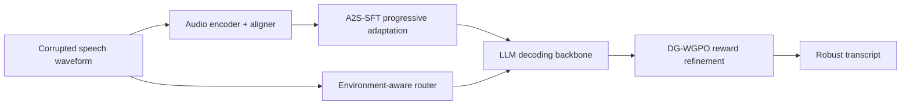
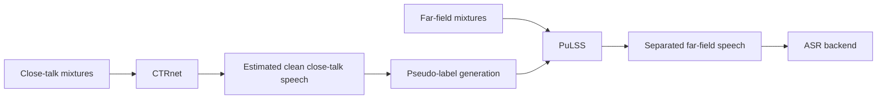
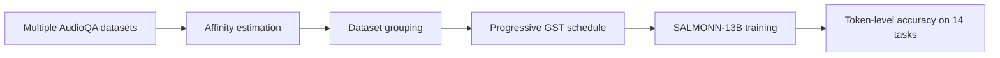
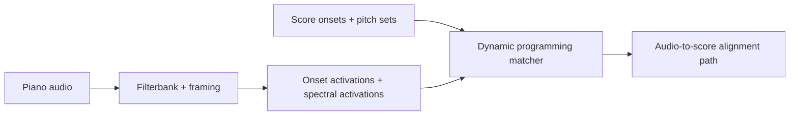
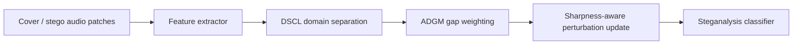

# 语音 / 音频 / 音乐论文速递
## 2026-05-20

> 实际对应 arXiv 更新日：**2026-05-20**  
> 检索范围：`cs.SD + eess.AS`  
> 只放按 ML 顶会审稿口径看，最值得多数读者花时间看的 **5 篇**

## 📋 总览

- 共收录 **5 篇** 相关论文
- 鲁棒 ASR / 语音前端：**2 篇**
- 语音大模型训练：**1 篇**
- 音乐理解 / MIR：**1 篇**
- 语音安全 / 隐写分析：**1 篇**

今天这批最值得看的主线很明确，不是“哪个模型又更大”这种陈词滥调，而是三类更实的增量。`Mega-ASR` 代表的是鲁棒 ASR 真正开始把“复合声学扰动”当训练对象来做，而不是只在单一噪声集上刷榜；`Cross-Talk Speech Reduction` 则把真实会话数据里最烦人的 close-talk 串音问题拆开，顺手把 far-field separation 和下游 ASR 一起拉起来；`GST` 虽然不是新模型，但它把 Audio LLM 多数据混训里“谁在拖后腿”这件事讲明白了，对正在堆多数据集训练的人比又一个漂亮 demo 更有用。

## 精选入选规则

- **新意（0-3）**：是不是提出了新的表示、训练组织方式，或者把老问题拆得更对
- **影响力（0-3）**：是不是贴近鲁棒 ASR、语音前端、Audio LLM、音乐理解这些主线
- **证据强度（0-2）**：有没有像样的 baseline、消融和关键数值
- **受众匹配度（0-2）**：对语音大模型 / 语音前端 / 音乐方向研究者有没有直接启发

分数校准：

- **6**：可读，但更像局部补丁
- **7**：信息量够，值得过一遍
- **8+**：建议优先精读

## 总览表

| 方向 | 序号 | 论文 | 评分 | 关键词 |
|---|---:|---|---:|---|
| 鲁棒 ASR | 1 | Mega-ASR | 8.8/10 | compound acoustics, A2S-SFT, DG-WGPO, Voices-in-the-Wild-2M |
| 语音前端 / 分离 | 2 | Cross-Talk Speech Reduction, by Separation, for Separation | 8.6/10 | CTRnet, PuLSS, CHiME-6, real-recorded training |
| 语音大模型训练 | 3 | Heterogeneity-Aware Dataset Scheduling for Efficient Audio Large Language Model Training | 8.0/10 | GST, dataset affinity, SALMONN, AudioQA |
| 音乐理解 / MIR | 4 | Precise and Simple Audio-to-Score Alignment | 7.8/10 | audio-to-score alignment, dynamic programming, onset-spectral features |
| 语音安全 | 5 | DASM | 7.2/10 | VoIP steganalysis, sharpness minimization, domain shift |

## 🤖 鲁棒 ASR / 语音前端

### [1] Mega-ASR: Towards In-the-wild^2 Speech Recognition via Scaling up Real-world Acoustic Simulation

- **评分**：8.8/10
- **作者/机构**：Zhifei Xie, Kaiyu Pang, Haobin Zhang, Deheng Ye, Xiaobin Hu, Shuicheng Yan, Chunyan Miao；NTU、NUS、Shanghai AI Lab
- **论文链接**：https://arxiv.org/abs/2605.19833
- **PDF**：https://arxiv.org/pdf/2605.19833.pdf
- **代码链接**：暂无明确仓库，文中写明代码、模型和数据将发布
- **Demo 链接**：https://xzf-thu.github.io/Mega-ASR/

#### 📌 简介
这篇做的是鲁棒 ASR 的硬问题，不是拿普通语音数据加点噪声增强就算完。作者把真实场景里同时出现的噪声、远场、遮挡、录制失真、传输丢包等复合扰动系统化成 `Voices-in-the-Wild-2M`，然后围绕“先把声学信息听明白，再用语义把句子补回来”设计了一整套训练方案。

#### ☠️ 毒舌点评
这篇不是那种“把大模型拖进来然后讲个故事”的水文。它的价值在于承认一个事实：WER 上 30% 以后，错误模式已经不是普通 token 错几个字，而是整句空白、胡编乱造、语义断裂。作者真的针对这件事改了训练和奖励，而不是继续拿统一 WER 奖励硬顶。短板也有，核心 backbone 还是站在 `Qwen3-ASR-1.7B` 肩膀上，不是从零起新范式。

#### 🔧 技术方案
- **模型解决的问题**：传统 ASR 或 audio LLM 在单一噪声集上还能撑住，但一旦进入“远场 + 回声 + 录制失真 + 传输损伤”这类复合环境，就容易出现空输出、幻觉和语义崩盘。`Mega-ASR` 要解决的是高 WER 区间下的真实鲁棒识别。
- **模型架构**：
  - **输入**：受多种声学扰动影响的语音波形。
  - **输出**：最终转写文本。
  - **主干**：以 `Qwen3-ASR-1.7B` 为基础，保留音频编码器、aligner 和 LLM 解码骨架。
  - **关键模块**：
    - `Voices-in-the-Wild-2M`：7 类原子声学效应扩展成 54 类复合场景。
    - `A2S-SFT`：Acoustic-to-Semantic Progressive Supervised Fine-Tuning。
    - `DG-WGPO`：Dual-Granularity WER-Gated Policy Optimization。
    - `Environment-aware router`：推理时判断是否挂载鲁棒 LoRA。
- **信号流**：

- **关键设计 / 核心创新**：
  - 先做 `WER<30% -> <50% -> <70%` 的分阶段课程学习，避免模型一上来就在重灾区里乱学。
  - 用 `Rfine + Rstruc` 的双粒度奖励，把“局部 token 修正”和“整句语义重建”分开。
  - 推理时加路由器，避免为了鲁棒性把干净语音性能一并拉垮。
- **训练 / 推理策略**：
  - `A2S-SFT` 三阶段：先训音频编码器和 aligner，再训 LLM，最后全参数联合。
  - RL 阶段跑 `6000 steps`，每个输入 `K=16` rollouts，最终奖励是 `0.4 Rrule + 0.6 Rdynamic`。
  - `DG-WGPO` 默认超参为 `τ=0.3`、`αs=0.4`、`αdyn=0.6`。
  - 推理时可加 `router`，在噪声重场景切换到鲁棒版本；文中给了额外路由开销，但没在正文主表详细展开显存。

#### 📊 实验结果
- 数据与评测：
  - 训练集 `Voices-in-the-Wild-2M`
  - 标准 ASR：`LibriSpeech`、`CommonVoice22`、`FLEURS`、`AISHELL-1`、`WenetSpeech`、`VoxPopuli`
  - 鲁棒基准：`CHiME-4`、`VOiCES`、`NOIZEUS`
  - 复合环境：`Voices-in-the-Wild-Bench`
- 关键结果：
  - 在 `CHiME-4 + VOiCES + NOIZEUS` 上平均 WER 为 **6.70**，优于 `Qwen3-ASR` 的 **7.93**、`Whisper-Large-v3` 的 **10.72**
  - `NOIZEUS 0dB` 上 WER **19.80**，优于 `Qwen3-ASR` 的 **23.97**
  - `VOiCES R4-B-F` 上 **45.69% vs. 54.01%**，`NOIZEUS Sta-0` 上 **21.49% vs. 29.34%**
  - `Voices-in-the-Wild-Bench` 混合退化场景下，`Ours` 为 **2.73/4.57**，而 `Whisper-Large-v3` 是 **8.91/14.79**
- 消融：
  - 去掉 A2S 后 `Voices/Noizeus` 变成 **8.31/8.79**
  - 完整 `Mega-ASR` 为 **7.35/7.64**
  - 去掉 `Rstruc` 比去掉 `Rfine` 退化更明显，说明句级重建在高 WER 区域更关键
- baseline：`Whisper-L-v3`、`Canary-1B-v2`、`Qwen2.5-Omni`、`Qwen3-ASR`、`Kimi-Audio`、`Gemini-3-Flash` 等

#### 💡 为什么值得看
做鲁棒 ASR 的人可以直接看这篇，因为它终于把“复合声学扰动下的错误模式变化”当一等公民了。比起再发一个干净数据集上的低 WER 结果，这套 `A2S-SFT + DG-WGPO` 至少回答了高噪环境下应该怎么训、怎么奖、怎么不把模型训成胡说八道。

### [2] Cross-Talk Speech Reduction, by Separation, for Separation

- **评分**：8.6/10
- **作者/机构**：Zhong-Qiu Wang, Samuele Cornell；Southern University of Science and Technology、Carnegie Mellon University
- **论文链接**：https://arxiv.org/abs/2605.19695
- **PDF**：https://arxiv.org/pdf/2605.19695.pdf
- **代码链接**：暂无明确仓库
- **Demo 链接**：https://zqwang7.github.io/demos/CTRnet%20journal%20demo/index.html

#### 📌 简介
这篇盯的是会话语音数据里一个非常实际但经常被糊弄过去的问题：close-talk 麦克风并不干净，里面有别人的串音和背景噪声，所以它不能直接拿来监督 far-field separation。作者先做 `CTRnet` 把 close-talk 串音剥掉，再用得到的 pseudo-label 去训练 `PuLSS`，最后把 far-field 分离和下游 ASR 一并抬起来。

#### ☠️ 毒舌点评
这类论文最容易犯的错，是拿一堆模拟数据把 separation 模型训得很漂亮，到了真实会话场景就掉地上。作者这次反过来干：先承认真实数据才是王道，再围着真实数据设计弱监督和半监督训练。这比再堆一个更大的模拟语音分离器靠谱得多。缺点是工程链路很长，落地成本不低。

#### 🔧 技术方案
- **模型解决的问题**：真实会话语音里，close-talk mixture 本身带强串音，直接当 far-field separation 的伪标签会把错误一层层放大。论文要解决的是如何先清理 close-talk，再反哺 far-field 分离。
- **模型架构**：
  - **输入**：每个说话人的 close-talk mixtures，加上 far-field microphone arrays。
  - **输出**：净化后的 close-talk speech，以及分离后的 far-field speech。
  - **主干**：两阶段框架，先 `CTRnet`，后 `PuLSS`。
  - **关键模块**：
    - `CTRnet`：把 cross-talk reduction 建模成 blind deconvolution。
    - `FCP`：forward convolutive prediction，用线性滤波器重建串音路径。
    - `Weakly / Semi-supervised CTRnet`：利用 speaker activity timestamps 和模拟数据。
    - `PuLSS`：pseudo-label based far-field speech separation。
- **信号流**：

- **关键设计 / 核心创新**：
  - 把串音抑制写成盲反卷积问题，而不是简单掩码增强。
  - 用 speaker-activity timestamps 做 frame muting 和弱监督，抑制 over-separation。
  - `PuLSS` 不是拿模拟 clean target 训，而是用 `CTRnet` 产出的 close-talk 伪标签去贴真实 far-field 数据。
- **训练 / 推理策略**：
  - `CTRnet` 支持无监督、弱监督、半监督三种训练路径。
  - 默认 `CTRnet` 与 `PuLSS` 都用 `TF-GridNet`，Adam 优化。
  - 训练中每个 epoch 随机采样约 `5%` 训练块；real + simulated 混训时 batch size 为 `2`
  - 推理时可使用 oracle diarization 或估计 diarization；块级推理再拼接整段输出。

#### 📊 实验结果
- 数据集：`CHiME-6`，并和 `CHiME-7/8` challenge 系统做对比
- close-talk 侧：
  - 原始 unprocessed mixture 的 test `cpWER` 为 **29.4**
  - `GSS (8-channel)` 为 **28.2**
  - `Semi-supervised CTRnet` 最优到 **21.8**
- far-field 侧：
  - 原始 far-field mixture `cpWER` **62.6**
  - `GSS (24-channel)` **38.5**
  - `PuLSS` + 更强 ASR backend 后，test `cpWER` **19.5**
  - 比 `USTC` 的 `19.8` 略好，超过所有已公开 `CHiME-7/8` 提交
- estimated diarization 下：
  - `PuLSS + USTC diar.` 的 `tcpWER` **28.5**
  - `GSS + USTC diar.` 的 `tcpWER` **33.5**
- baseline：`GSS`、`Supervised CTRnet`、多个 `CHiME-7/8` challenge 系统

#### 💡 为什么值得看
这篇最值钱的地方不是某个单模块，而是它展示了一条“如何把真实会话数据变成可训练 separation 监督”的路线。做远场会议 ASR、阵列前端、真实录音鲁棒建模的人都该看，因为这套思路比继续迷信纯模拟训练靠谱得多。

## 🧠 语音大模型 / 训练方法

### [3] Heterogeneity-Aware Dataset Scheduling for Efficient Audio Large Language Model Training

- **评分**：8.0/10
- **作者/机构**：Yanru Wu, Jianning Wang, Chongxin Gan, Yang Li；Tsinghua University Shenzhen International Graduate School、Independent Researcher、The Hong Kong Polytechnic University
- **论文链接**：https://arxiv.org/abs/2605.19101
- **PDF**：https://arxiv.org/pdf/2605.19101.pdf
- **代码链接**：暂无
- **Demo 链接**：暂无

#### 📌 简介
这篇不造新 Audio LLM，而是处理更少人愿意认真做的脏活：多数据集混训时，为什么统一 mix-all 经常又慢又不稳。作者提出 `Grouped Sequential Training (GST)`，按数据集 affinity 先分组，再渐进式引入，目标是兼顾并行混训的稳定性和顺序训练的低冲突。

#### ☠️ 毒舌点评
这类训练策略论文一不小心就会写成“换个 curriculum 排序然后堆理论符号”。这篇好一点的地方，是它既给了收敛分解，也给了 `SALMONN-13B + 14 个 AudioQA 数据集` 的完整实证。问题在于，它还是建立在一个比较温和的 open-source 平台上，离真正几十 B 模型的生产训练还差最后那口气。

#### 🔧 技术方案
- **模型解决的问题**：Audio LLM 多数据集联合训练时，不同数据集的任务目标、标注风格和声学侧重点差异很大，uniform mixing 会引入冲突梯度和慢收敛。
- **模型架构**：
  - **输入**：14 个 AudioQA 数据集统一后的音频-问答样本。
  - **输出**：token-level answer prediction。
  - **主干**：不改 backbone，直接在 `SALMONN-13B` 上做训练调度。
  - **关键模块**：
    - `GST`：Grouped Sequential Training。
    - `gradient-based affinity`：按梯度距离做数据集分组。
    - `progressive grouped training`：逐组扩容，而非硬切换。
- **信号流**：

- **关键设计 / 核心创新**：
  - 把全局异质性拆成组内和组间两部分，解释为什么纯并行和纯顺序都不够好。
  - 用梯度距离而不是昂贵的 transferability 测试做 affinity 估计。
  - 实践上用 progressive GST 近似严格的 sequential groups，减少 catastrophic forgetting。
- **训练 / 推理策略**：
  - 平台是 `SALMONN-13B`，Whisper encoder + Vicuna-13B backbone。
  - 14 个数据集统一成 `AudioQA` 格式。
  - 训练对比 `Parallel (Mix-all)`、`Sequential`、`Independent`、`GST-T2 / GST-G2 / GST-G3`
  - 低资源设定中，每个数据集限制到 `250` 样本。

#### 📊 实验结果
- 数据集：`AudioCaps`、`ChimeHome`、`Clotho`、`CochlScene`、`IEMOCAP`、`Jamendo`、`MACS`、`MusicNet`、`MusicQA`、`OpenAQA`、`PromptSpeech`、`SoundDescs`、`TextrolSpeech`、`WavCaps`
- Full-data training：
  - `Mix-all` 的 weighted avg 为 **74.2**
  - `GST-T2` 为 **74.5**
  - `GST-G3` 为 **75.0**
  - 训练时长从约 **4 天** 降到 **2 天**，加速约 **30%–40%**
- Low-resource finetuning：
  - `Mix-all` weighted avg **63.9**
  - `GST-T2` **64.7**
  - `GST-G3` **63.4**
  - 加速没 full-data 明显，但稳定性没有掉
- 排序策略：
  - `Progressive` 明显好于 `Reverse Progressive`
  - `Strict Cycle Sequential` 在 weighted avg 上掉到 **64.0 / 68.2** 一档
- baseline：`Original SALMONN`、`Individual`、`Sequential`、`Mix-all`

#### 💡 为什么值得看
如果你正在做 Audio LLM 多数据集训练，这篇是少数真正在讨论“训练组织”而不是“再换一个模型名”的论文。它不会立刻给你一个新 SOTA，但会逼你承认：数据集怎么排、怎么分组、什么时候引进复杂任务，本身就是性能的一大块。

## 🎼 音乐理解 / MIR

### [4] Precise and Simple Audio-to-Score Alignment

- **评分**：7.8/10
- **作者/机构**：Silvan D. Peter, Patricia Hu, Gerhard Widmer；Johannes Kepler University、LIT AI Lab
- **论文链接**：https://arxiv.org/abs/2605.20014
- **PDF**：https://arxiv.org/pdf/2605.20014.pdf
- **代码链接**：暂无
- **Demo 链接**：暂无

#### 📌 简介
这篇解决的是钢琴场景下的 audio-to-score alignment。作者不走“先转录成 MIDI 再对齐”的重路线，也不只做 audio-to-audio DTW，而是把 onset 和 spectral activation 直接映射到 score 位置，用一个符号对齐风格的动态规划去匹配。

#### ☠️ 毒舌点评
这不是 flashy 的大模型论文，但对 MIR 来说是很干净的一击：问题定义清楚，算法解释透，实验指标也直给。缺点也明显，它主要是 solo piano，泛化到更复杂编制和更乱的音色场景还没交作业。

#### 🔧 技术方案
- **模型解决的问题**：传统 audio-to-score alignment 要么依赖合成分数和 DTW，要么依赖先转录再做 symbolic alignment，各有误差和成本。作者想要一个直接在 audio-like feature 与 score symbol 之间对齐的方法。
- **模型架构**：
  - **输入**：钢琴录音，以及 score onset times 和 pitch sets。
  - **输出**：每个 score onset 对应的音频时间位置。
  - **主干**：基于动态规划的 note-level matching。
  - **关键模块**：
    - 88 个频带的 IIR Butterworth filterbank
    - `onset activation` 特征
    - `spectral presence` 特征
    - 带局部 beat period 估计的 DP 匹配
- **信号流**：

- **关键设计 / 核心创新**：
  - 不通过独立转录模型，而是直接把音频特征和符号级得分事件对齐。
  - 代价函数由 onset term、stretch term、spectral term 组成。
  - 复杂度在最坏情况下对短 score、长音频仍然是线性级别可控。
- **训练 / 推理策略**：
  - 这篇没有神经网络训练主线，核心是 DSP + DP 算法。
  - 推理时维护局部 beat period 估计，并对候选 frame window 做动态规划搜索。
  - 参数有速度与精度 trade-off，如窗口大小、frame rate、threshold。

#### 📊 实验结果
- 数据集：`(n)ASAP Dataset` 上 **300+** 钢琴演奏
- 对比方法：
  - `Audio-to-Audio` baseline：合成 score + onset/chroma + DTW
  - `MIDI-to-Score`：作为上界近似
- 核心数值：
  - `Audio-to-Audio baseline`：mean **135 ms**，median **49 ms**
  - `Audio-to-Score (ours)`：mean **86 ms**，median **21 ms**
  - `< 50 ms` 的精度从 **53.2%** 提升到 **83.7%**
  - `< 100 ms` 从 **74.4%** 提升到 **91.7%**
- baseline 讨论：作者明确说自家方法全面优于 audio-to-audio baseline，但仍不如近乎完美转录前提下的 `MIDI-to-Score`

#### 💡 为什么值得看
如果你做 MIR、score following 或者钢琴转录后处理，这篇很值得过一遍。它提醒了一件事：不是所有问题都该先丢给大模型，很多时候把表示和匹配逻辑理顺，收益反而更直接。

## 🔐 语音安全 / 隐写分析

### [5] DASM: Domain-Aware Sharpness Minimization for Multi-Domain Voice Stream Steganalysis

- **评分**：7.2/10
- **作者/机构**：Pengcheng Zhou, Pianran Guo, Shuhua Chen, Mengqin Zhao, Zhongliang Yang, Linna Zhou；National University of Singapore、北京邮电大学、吉林大学
- **论文链接**：https://arxiv.org/abs/2605.19955
- **PDF**：https://arxiv.org/pdf/2605.19955.pdf
- **代码链接**：正文提到代码可用，但摘要页未给出明确仓库
- **Demo 链接**：暂无

#### 📌 简介
这篇做的是 VoIP 语音隐写分析的 domain generalization。作者观察到不同隐写算法域之间 gap 很小、很不均衡，普通模型容易掉进 saddle point 或 sharp minima，于是提出 `DASM`，把 sharpness-aware optimization、domain-supervised contrastive learning 和 adaptive gap modulation 拼起来。

#### ☠️ 毒舌点评
这篇方向比较偏安全子圈，不是大众向语音主线稿。好处是实验做得扎实，问题也真实；坏处是任务本身和主流语音/音乐建模离得远，而且它更像优化器论文，不是会直接改变你语音系统设计的那种作品。

#### 🔧 技术方案
- **模型解决的问题**：VoIP steganalysis 里，不同算法域如 `QIM/PMS/LSB/AHCM` 的统计差异很小，导致模型在跨域时泛化差。
- **模型架构**：
  - **输入**：cover 与 stego 音频 patch，带不同 embedding rate 和不同隐写算法域标签。
  - **输出**：二分类检测结果。
  - **主干**：Transformer backbone 上套 `DASM` 优化框架。
  - **关键模块**：
    - `DSCL`：Domain-Supervised Contrastive Learning
    - `ADGM`：Adaptive Domain Gap Modulation
    - `SAM-style perturbation`
- **信号流**：

- **关键设计 / 核心创新**：
  - 用 `DSCL` 强行把不同 stego 域从 cover 域拉开。
  - 用 `ADGM` 动态给难域更高权重，避免容易域主导优化。
  - 两步优化 `min_theta max_{||eps||<=rho} L(theta+eps)` 保持 flat minima。
- **训练 / 推理策略**：
  - `ρ=0.03`，`τ=0.1`，EMA momentum `μ=0.9`
  - batch size `128`，learning rate `0.001`
  - 训练 `100 epochs`，早停按 validation loss
  - 硬件是 `NVIDIA vGPU-32GB`

#### 📊 实验结果
- 域与设置：`QIM`、`PMS`、`LSB`、`AHCM`，embedding rate `0.1~0.5`
- 主要 baseline：`Transformer + ERM`、`SAM`、`DISAM`、`FSAM`、`DGSAM`、`SAGM`，以及任务专用方法 `DAEF-VS`
- `ER=0.5` 主表：
  - `SAM` 平均 **87.96**
  - `DAEF-VS` 平均 **85.54**
  - `DASM` 平均 **93.06**
  - 在最难的 `PMS` 域，`DASM` **82.38**，而 `DAEF-VS` **73.31**
- embedding rate 趋势：
  - `ER=0.1` 时 `DASM` 平均 **78.05**
  - 同条件下 `SAM` **76.47**，`Adam` **72.82**
- 消融：
  - `DSCL only` 平均 **89.13**
  - `ADGM only` **90.68**
  - full `DASM` **93.06**
- 额外分析：
  - zeroth-order sharpness 从 `Adam` 的 **2.33** 降到 `DASM` 的 **0.25**
  - 训练时延约 `370.0 ms/batch`，仅比 `SAM` 的 `366.4 ms/batch` 略高

#### 💡 为什么值得看
如果你做语音安全、隐写检测、或跨域微弱信号识别，这篇的优化视角有参考价值。对主流 TTS/ASR 研究者来说，它不是今天最该追的主线，但作为“如何在域差异很小的任务里避免训练塌掉”的案例，还是有点东西。

## 最后结论

今天最值得优先看的顺序是：

1. `Mega-ASR`：因为它不是再刷一遍普通鲁棒基准，而是真正处理了高 WER 复合环境下的训练目标失配。
2. `Cross-Talk Speech Reduction, by Separation, for Separation`：因为它给出了真实会话语音里 close-talk 串音到 far-field separation 的完整可训练链路。
3. `GST`：因为只要你在做 Audio LLM 多数据集训练，这篇会直接影响你怎么排数据、怎么分组、怎么节省时间。

剩下两篇里，`Precise and Simple Audio-to-Score Alignment` 是干净利落的 MIR 小而硬结果，适合相关方向直接借鉴；`DASM` 更偏安全子任务，实验靠谱，但受众明显更窄。
