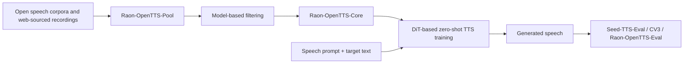
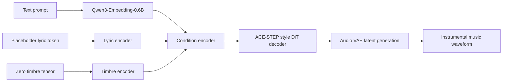

# 语音 / 音频 / 音乐论文速递
## 2026-05-21

> 实际对应 arXiv 更新日：**2026-05-21**  
> 检索范围：`cs.SD + eess.AS`  
> 只放按 ML 顶会审稿口径看，最值得多数读者花时间看的 **3 篇**

## 📋 总览

- 共收录 **3 篇** 相关论文
- 语音大模型可信性 / 评测框架：**1 篇**
- 零样本 TTS / 开放数据：**1 篇**
- 音乐生成 / T2M 架构消融：**1 篇**

今天这批里，真正值得看的不是“谁又把参数堆更大”，而是三个更硬的问题。第一，`A Survey of Large Audio Language Models: Generalization, Trustworthiness, and Outlook` 把 Audio LLM 领域最容易被故意忽略的一件事讲明白了：能力往前冲得太快，但安全、鲁棒、隐私和认证这几条防线还几乎没建起来。第二，`Raon-OpenTTS` 不是只拿开源权重喊口号，它用 **615K 小时** 开放语音池和 **510K 小时** 过滤核心集，把“没有私有百万小时也能把 TTS 做到可用”这件事真的做成了。第三，`Instrumental Text-to-Music Generation with Auxiliary Conditioning Branches` 把一个很反直觉的现象钉死了：即便 lyric / timbre 分支在器乐任务里喂进去的几乎是空信号，它们依然可能在训练阶段充当结构锚点，删掉之后质量就是掉。

如果你做的是 Audio LLM、TTS 或音乐生成，这三篇对应三类完全不同但都很现实的工程难点：

- 可信性不是附录，而是部署前必须补的账。
- 数据规模和数据组织，往往比“再换一个花哨模型名”更决定 TTS 上限。
- 看起来没用的辅助分支，可能在训练动力学里真有用，不能只靠推理时 ablation 下结论。

## 精选入选规则

- **新意（0-3）**：是不是提出了新的问题拆法、训练组织方式、评测框架或可复用数据资产
- **影响力（0-3）**：是不是贴近 Audio LLM、TTS、music generation 这些主线
- **证据强度（0-2）**：有没有 baseline、关键数值、消融或系统性分析
- **受众匹配度（0-2）**：对语音大模型 / 语音生成 / 音乐生成研究者有没有直接启发

分数校准：

- **6**：可读，但更像补充材料
- **7**：信息量够，值得过一遍
- **8+**：建议优先精读

## 总览表

| 方向 | 序号 | 论文 | 评分 | 关键词 |
|---|---:|---|---:|---|
| 语音大模型可信性 / 综述框架 | 1 | A Survey of Large Audio Language Models: Generalization, Trustworthiness, and Outlook | 8.6/10 | trustworthiness taxonomy, fidelity-stability-alignment, cross-modal jailbreaking, privacy leakage |
| 零样本 TTS / 开放数据 | 2 | Raon-OpenTTS: Open Models and Data for Robust Text-to-Speech | 8.8/10 | open data, 615K hours, DiT TTS, robustness benchmark, zero-shot TTS |
| 音乐生成 / 架构分析 | 3 | Instrumental Text-to-Music Generation with Auxiliary Conditioning Branches | 8.2/10 | ACE-STEP, auxiliary branches, training-time anchors, 457 hours, T2M challenge |

## 🛡️ 语音大模型可信性 / 综述框架

### [1] A Survey of Large Audio Language Models: Generalization, Trustworthiness, and Outlook

- **评分**：8.6/10
- **作者/机构**：Kaiwen Luo, Zhenhong Zhou, Leo Wang, Liang Lin, Yang Xiao, Tianyu Shao, Yuanhe Zhang, Yuxuan Li 等；南洋理工大学、香港理工大学、北京理工大学、中山大学等多机构联合
- **论文链接**：https://arxiv.org/abs/2605.20266
- **PDF**：https://arxiv.org/pdf/2605.20266.pdf
- **代码链接**：**资料库已开源** https://github.com/Kwwwww74/Awesome-Trustworthy-AudioLLMs

#### 📌 简介
这篇不是“又一篇把已有工作按主题拼起来”的综述水文，而是很明确地围绕 `Large Audio Language Models` 的可信性缺口来写。作者的基本判断很对：Audio LLM 已经从级联式 speech system 往端到端统一模型走了，但一旦把连续声学信号和大语言模型硬拼到一起，风险面会比文本 LLM 大得多，而且更难做标准化防御。文章最大的价值，是把原本分散在 hallucination、jailbreak、deepfake、speaker privacy、bias、authentication 各个角落里的讨论，压成一个统一的 taxonomy 和 evaluation roadmap。

#### ☠️ 毒舌点评
这类综述最容易犯的错，是把“别人做了什么”抄成目录，然后用一些听起来很大的词把自己包装成 blueprint。好在这篇没那么虚。它至少把问题拆成了可操作的几层：先看 LALM 的内生机制，再看六个 trustworthiness 维度，再给出 evaluation 三支柱和未来防线。缺点也同样明显：它本身不产出新 benchmark，不给新 defense，不做统一复现实验，所以你不能把它当解决方案；它更像一份“这个方向现在到底欠了哪些账”的系统盘点。

#### 🔧 技术方案
- **模型解决的问题**：
  这篇综述本质上解决的不是单个模型任务，而是一个领域级问题：`LALM` 从传统任务模型进化为统一音频智能系统后，为什么文本时代那套安全与对齐思路已经不够用了，以及该如何系统化评估这些新风险。
- **模型架构**：
  - **输入**：现有 `LALM` 文献、代表性模型家族、攻击与防御论文、现有 benchmark 和案例分析。
  - **输出**：一套可信性 taxonomy、评测三支柱框架，以及未来研究路线图。
  - **主干**：`内生机制分析 -> trustworthiness taxonomy -> evaluation hierarchy -> future roadmap`
  - **关键模块**：
    - `Endogenous Mechanisms of LALMs`：分析 acoustic encoder、alignment projector、LLM backbone 和 end-to-end multimodal pipeline
    - `Six analytical pillars`：`hallucination`、`robustness`、`safety`、`privacy`、`fairness`、`authentication`
    - `Three-pillar evaluation hierarchy`：`Fidelity`、`Stability`、`Alignment`
    - `Defense-in-Depth roadmap`：分层防御、causal auditory world modeling、intrinsic representation engineering
- **信号流**：

- **关键设计 / 核心创新**：
  - 它没有只按任务分类，而是先从架构层解释为什么 audio modality 会扩大攻击面。
  - 它把六个可信性维度压到一张统一地图里，这比只谈 jailbreak 或只谈 deepfake 更完整。
  - 它把评测进一步组织成 `Fidelity / Stability / Alignment` 三支柱，而不是继续堆零散指标。
  - 对 Audio LLM 领域来说，最重要的创新不是“提出新模型”，而是明确指出 offensive research 已经跑在 defensive mechanism 前面太多。
- **训练 / 推理策略**：
  - 作为综述论文，它没有模型训练流程，但它给了一个很清晰的“分析执行流程”。
  - 第一层是回溯从级联系统到 unified LALM 的架构演化。
  - 第二层是逐维度梳理风险与现有 defense。
  - 第三层是把评测指标收敛到三大支柱下，避免只看 aggregate accuracy。
  - 如果把这篇当作研究指南来用，推理策略就是先判断你当前工作属于哪一类风险，再映射到对应的 benchmark 和 defense gap。

#### 📊 实验结果
这篇不是传统意义上的“实验论文”，但它还是给了足够硬的 benchmark 级证据和对比线索：

- 可信性大类：
  - 明确覆盖 **6 个** trustworthiness 维度：`hallucination`、`robustness`、`safety`、`privacy`、`fairness`、`authentication`
  - 再把 evaluation 收束为 **3 个**总支柱：`Fidelity`、`Stability`、`Alignment`
- 关键数值证据：
  - 文章点名 `ChronosAudio` 在 **36,000** 个 test instances 和多种任务类型上系统暴露长音频理解与 temporal locality 失败
  - 这意味着很多 LALM 的 aggregate score 看起来还能过，但一旦换成长音频、时间定位或对话流任务，崩得很快
- 风险面例子：
  - `cross-modal jailbreaking`
  - `latent acoustic backdoors`
  - `biometric privacy leakage`
  - `spoofing / authentication failure`
- 和既有综述的区别：
  - 论文在 Table 1 里把 prior surveys 按对象和阶段做对比，指出已有综述往往只覆盖 `speech trustworthiness`、`deepfake detection` 或 `evaluation` 的一角
  - 相比只做 `speech` 或 `multimodal` 某一侧的 survey，它是少数把 `Audio-LLM + Speech-LM + MLLM trustworthiness` 放进一张表里比的文章
- baseline / comparison 视角：
  - 它的“baseline”不是单一模型，而是过去一批偏任务综述、偏 deepfake 综述、偏 audio evaluation 综述
  - 论文的主张是：这些已有工作只能覆盖局部风险，无法支撑统一 LALM 的可信部署
- 最有用的实验性判断：
  - 文中反复强调目前防御研究还停留在 reactive、局部、缺统一标准的状态
  - 换句话说，现在领域里的对比，更多是在“谁攻击得更花”而不是“谁防得更稳”

#### 💡 为什么值得看
如果你做 Audio LLM，这篇值得看的原因不是它给你一个新 SOTA，而是它逼你承认一个不太好听的事实：今天很多系统论文把注意力全放在效果展示上，却没有认真回答模型在长音频、对抗音频、隐私泄露、声纹伪造和多模态诱导攻击下会怎样坏掉。它适合拿来做研究选题清单，也适合拿来给团队做“为什么现在还不能放心上线 voice agent / audio assistant”的技术说明。

#### 评分：8.6/10
理由：作为综述，它的问题意识很准，组织方式也明显强于普通“论文列表型” survey。扣分点是没有统一新 benchmark 和复现实验，因此它更像高质量路线图，而不是可以直接复用的防御工具箱。

## 🗣️ 零样本 TTS / 开放数据

### [2] Raon-OpenTTS: Open Models and Data for Robust Text-to-Speech

- **评分**：8.8/10
- **作者/机构**：Semin Kim, Seungjun Chung, Taehong Moon, Sangheon Lee, Minyoung Ahn, Keon Lee, Nam Soo Kim, Jaewoong Cho 等；KRAFTON、首尔大学、KAIST、Stanford 等
- **论文链接**：https://arxiv.org/abs/2605.20830
- **PDF**：https://arxiv.org/pdf/2605.20830.pdf
- **代码链接**：**代码与数据已开源** https://github.com/krafton-ai/RAON-OpenTTS

#### 📌 简介
这篇核心不是“我们也做了个 DiT TTS”，而是把开放数据 TTS 真正往 foundation scale 推了一步。作者先构建 `Raon-OpenTTS-Pool`，规模做到 **615K 小时 / 240M segments**，再通过模型驱动过滤得到 `Raon-OpenTTS-Core`，保留 **510K 小时 / 194M segments** 的高质量核心集，最后基于它训练 **0.3B 到 1.0B** 的 `DiT-based` 零样本 TTS。论文的含义很直接：只要数据组织和过滤做得够狠，开源路线不一定只能永远落后私有百万小时体系一大截。

#### ☠️ 毒舌点评
这篇比很多“开放 TTS”文章更像真工程，而不是道德表态。很多人嘴上说开源，实际上只放权重不放训练信号；这篇至少把数据池、过滤逻辑、benchmark 和 checkpoint 一起摆出来了。更难得的是，它没有只在最干净的基准上报好看数字，而是自己新做了 `Raon-OpenTTS-Eval` 去测 `Clean / Noisy / Wild / Expressive` 四类场景。短板也得说清楚：当前还是英语单语系统，Noisy 条件下大规模 in-the-wild 数据也不是全方位增益，说明“数据越野越多越好”这种说法依然站不住。

#### 🔧 技术方案
- **模型解决的问题**：
  现有强 TTS 模型往往依赖闭源、超大规模私有语音库，外界很难复现。`Raon-OpenTTS` 要解决的是两件事：
  - 能不能用公开可复现的数据把零样本 TTS 拉到接近闭源系统的水平。
  - 能不能把鲁棒评测从干净朗读语音扩展到真实世界的 `wild / noisy / expressive` 条件。
- **模型架构**：
  - **输入**：语音 prompt、目标文本，以及开放语音池中构建好的大规模训练样本。
  - **输出**：保持说话人相似度的零样本合成语音。
  - **主干**：`diffusion transformer (DiT)` TTS，分为 `Raon-OpenTTS-0.3B` 和 `Raon-OpenTTS-1B`
  - **关键模块**：
    - `Raon-OpenTTS-Pool`：**615K hours / 240M segments** 的开放语音池
    - `Raon-OpenTTS-Core`：经模型过滤后的 **510K hours / 194M segments**
    - `Raon-YouTube-Commons`：补充 in-the-wild 语音覆盖
    - `Raon-OpenTTS-Eval`：**12 个**数据集组成的鲁棒基准
- **信号流**：

- **关键设计 / 核心创新**：
  - 不是只拼规模，而是先建 `Pool` 再用过滤管线压出 `Core`，把规模和质量拆开处理。
  - 把鲁棒评测做成独立 benchmark，而不是继续迷信单一 `Seed-TTS-Eval`。
  - 同时给出 **0.3B** 和 **1.0B** 两个规模，方便观察“数据质量”和“模型大小”分别贡献了什么。
  - 用 `matched-scale` 和 `with / without YouTube-Commons` 的 ablation 去回答数据来源问题，而不是一句“更多数据更好”糊过去。
- **训练 / 推理策略**：
  - 训练数据主集使用 `Raon-OpenTTS-Core`，并比较 `Pool-Matched-47K` 与常见开源数据 `Emilia`
  - 对数据来源影响的实验统一用 `Raon-OpenTTS-0.3B`、`200K steps`
  - `Raon-OpenTTS-Eval` 按 `Clean / Noisy / Wild / Expressive` 四类条件组织
  - 每个 evaluation dataset 抽取 **500** 条 prompt，总计 **6,000** 个 prompt-text pairs
  - 推理时统一比较公开权重 baseline 的官方推荐设置，尽量避免人为偏置

#### 📊 实验结果
- 数据与评测：
  - `Seed-TTS-Eval`
  - `CV3-EN / CV3-Hard-EN`
  - 自建 `Raon-OpenTTS-Eval`
  - 后者覆盖 **12 个** evaluation datasets，分为 `Clean / Noisy / Wild / Expressive`
- 主要 baseline：
  - `F5-TTS`
  - `MaskGCT`
  - `CosyVoice 2`
  - `CosyVoice 3`
  - `VoxCPM`
  - `Qwen3-TTS`
- Seed-TTS-Eval：
  - `Raon-OpenTTS-1B`：`WER 1.78% / SIM 0.749`
  - 文中说它在 WER 上排第二，在 open-weight baseline 的 SIM 上排第一
  - `Raon-OpenTTS-0.3B` 相比同架构同量级 `F5-TTS`，`WER 1.95 vs. 2.04`，`SIM 0.687 vs. 0.671`
- CV3 结果：
  - `Raon-OpenTTS-1B` 在 `CV3-EN` 上 `WER 3.92`
  - `CV3-Hard-EN` 上 `WER 6.15 / SIM 0.775 / DNSMOS 3.85`
  - 对比 `Qwen3-TTS` 的 `7.89 / 0.666 / 3.87`
  - 对比 `CosyVoice 3` 的 `10.77 / 0.740 / 3.98`
  - `Raon-OpenTTS-0.3B` 也把 `CV3-EN` 的 WER 从 `F5-TTS` 的 `8.54` 压到 `4.62`
- Raon-OpenTTS-Eval：
  - `Raon-OpenTTS-1B overall`：`WER 2.81 / SIM 0.695`
  - 四类条件分别是：
    - `Clean 1.44 / 0.718`
    - `Noisy 3.51 / 0.769`
    - `Wild 5.61 / 0.656`
    - `Expressive 2.77 / 0.633`
  - `Raon-OpenTTS-0.3B overall`：`WER 2.93 / SIM 0.623`
  - 对比 `Qwen3-TTS overall`：`WER 17.59 / SIM 0.626`
  - 对比 `CosyVoice 3 overall`：`WER 4.43 / SIM 0.647`
  - 最扎眼的是 `Wild` 条件下，很多 baseline 明显翻车：`F5-TTS 136.03`、`Qwen3-TTS 79.14`、`VoxCPM 43.83`
- 主观评价：
  - `CMOS` 以 `Raon-OpenTTS-1B` 为参考时，其他模型 overall 多为负值
  - `SMOS` 上 `Raon-OpenTTS-1B` overall **3.70**
  - `Raon-OpenTTS-0.3B` overall **3.60**
  - `Qwen3-TTS` overall **3.59**
  - `CosyVoice 3` 与 `MaskGCT` 都是 **3.58**
- 数据消融：
  - 在 matched scale 的 **47K hours** 对比里，`Pool-Matched-47K` 相比 `Emilia`：
    - overall `WER 3.09 vs. 3.33`
    - overall `SIM 0.605 vs. 0.558`
    - `Wild WER 5.97 vs. 7.35`
  - 引入 `Raon-YouTube-Commons` 后：
    - `Clean WER 2.17 -> 1.72`
    - `Wild WER 7.62 -> 6.15`
    - `Expressive WER 3.43 -> 2.63`
    - 但 `Noisy WER 4.21 -> 6.79`，说明 in-the-wild 数据不是无脑全增益

#### 💡 为什么值得看
这篇对 TTS 圈最重要的价值，是它把“开放路线到底能做到什么程度”从口号变成了数据和表格。你既能直接拿它的数据过滤思路去复用，也能从 `Raon-OpenTTS-Eval` 学到一个更靠谱的鲁棒 benchmark 组织方法。更关键的是，它提醒了一件经常被忽略的事：高质量开放数据建设本身，就是 TTS 研究里最稀缺的核心贡献之一，不比再发一个新采样器低级。

#### 评分：8.8/10
理由：数据资产、过滤管线、benchmark 和数值都很硬，而且真把 open-data TTS 做到了“可打”的程度。扣分点是目前只覆盖英语，且 Noisy 条件上的数据扩展还暴露了明显 trade-off。

## 🎼 音乐生成 / 架构分析

### [3] Instrumental Text-to-Music Generation with Auxiliary Conditioning Branches

- **评分**：8.2/10
- **作者/机构**：Junyoung Koh
- **论文链接**：https://arxiv.org/abs/2605.21433
- **PDF**：https://arxiv.org/pdf/2605.21433.pdf
- **代码链接**：暂无明确开源仓库

#### 📌 简介
这篇做的是器乐 `text-to-music`，但真正有意思的点不是“又训练了一个 challenge submission”，而是它拿一个本来为 vocal song generation 设计的 `ACE-STEP 1.5` 架构，故意搬到 instrumental-only 场景里，看 lyric 和 timbre 这两个看似已经失效的辅助分支到底还有没有价值。结果很反直觉：如果训练时把这两个分支整个删掉，哪怕把省下来的参数补回更深的 `DiT`，在 `AudioBox aesthetics`、`LLM-as-judge` 和 human MOS 上还是会掉。

#### ☠️ 毒舌点评
这篇最难得的地方，是它没有只拿 challenge 榜单吹自己，而是顺手把一个“很多人以为一眼就能回答”的架构问题认真做了消融。很多生成模型论文只会做推理时 ablation，然后得出“这个条件可有可无”；这篇指出，训练动力学和推理依赖根本不是一回事。缺点也很明显：数据量只有 **457 小时**，而且 human evaluation 里有一部分还是单作者评分，所以你不能把它当音乐生成终局答案，它更像一篇很有价值的训练动力学分析。

#### 🔧 技术方案
- **模型解决的问题**：
  文章想回答两个问题：
  - 在严格受限的数据规模和无外部预训练条件下，器乐 T2M 还能靠哪些训练 / 推理技巧把效果拉起来。
  - 在 instrumental-only 任务里，`lyric` 和 `timbre` 这两个看似退化成常量输入的辅助分支，是否仍然提供结构性收益。
- **模型架构**：
  - **输入**：自然语言音乐描述；器乐场景下 lyric 分支喂固定占位 token `[Instrumental]`，timbre 分支喂零张量
  - **输出**：`10-second` 的生成音乐音频
  - **主干**：基于 `ACE-STEP 1.5` 的 `Diffusion Transformer`
  - **关键模块**：
    - `frozen AutoencoderOobleck` 作为音频 VAE
    - `frozen Qwen3-Embedding-0.6B` 作为文本编码器
    - `condition encoder` 融合 `text / lyric / timbre` 三路条件
    - `DiT decoder` 作为主生成器
- **信号流**：

- **关键设计 / 核心创新**：
  - 不是发明新 backbone，而是把 `ACE-STEP` 在器乐场景下重新解释成“结构锚点实验平台”。
  - 明确区分了 `inference-time zeroing` 和 `from-scratch retrain removing branches` 两种 ablation。
  - 证明“删掉辅助分支再把参数堆回主干”并不能等价替代原结构。
  - 论文还顺手验证了 caption 质量、CFG interval、EMA averaging、Min-SNR 等常见 trick 在低数据 T2M 下谁更值钱。
- **训练 / 推理策略**：
  - 训练数据只用 `MTG-Jamendo raw_30s subset`，约 **55,700 tracks / 457 hours**
  - 两个提交模型：
    - `Efficiency`：**499.0M**
    - `Performance`：**2,419.1M**
  - 训练均为 **120 epochs**
  - 优化器 `AdamW`，learning rate `3e-4`，weight decay `0.01`，warmup `200 steps`
  - 使用 `Min-SNR-γ`，其中 `γ=5.0`
  - 采用 `adaptive timestep sampling`、`random 10-second crop`、`post-hoc EMA averaging`
  - 推理时使用 `100-step Euler ODE sampling`，并把 CFG 限定在 `t in [0.1, 0.9]` 的 guidance interval 内

#### 📊 实验结果
- challenge 配置：
  - `Efficiency model`：`499.0M`
  - `Performance model`：`2,419.1M`
  - 数据规模：**457 hours**
- caption 策略：
  - `Template captions` 的 validation loss 是 **0.968**
  - `JamendoMaxCaps` 和官方 `Qwen2-Audio captions` 都降到 **0.943**
  - 单看 loss，caption 升级带来 **-0.025** 改善，这是文中说最值钱的单项改进之一
- incremental training ablation：
  - baseline `0.968`
  - + 官方 vocal-separated audio 后 `0.960`
  - + 官方 `Qwen2-Audio captions` 后 `0.943`
  - + `Post-hoc EMA averaging` 后 `0.938`
  - 模型从 `414M -> 499M` 后 `0.916`
  - 说明 caption 质量和模型尺度都是真增益，不是只靠调 CFG 糊出来
- final test challenge 结果：
  - `Ours, Efficiency 499M`：`FAD 0.487 / CLAP 0.305 / CCS 0.800 / MOSall 2.969 / MOSexp 2.929`
  - `Ours, Performance 2.4B`：`FAD 0.514 / CLAP 0.306 / CCS 0.800 / MOSall 3.344 / MOSexp 3.327`
  - 论文明确写到：
    - `Performance` 提交在 objective metrics 和 organizer-administered MOS 上都排 **第一**
    - `Efficiency` 提交在 objective metrics 上并列 **第二**
- inference ablation：
  - 去掉 guidance interval，CLAP 从 baseline `0.4958` 掉到 `0.4652`
  - 50 steps 反而到 `0.4986`，比 100 steps 略高，说明 50-step 是实用加速点
  - 把 EMA window 拉满到全程 `96 snapshots`，CLAP 掉到 `0.4455`
- 架构消融：
  - `Efficiency Original 499M`：`msclap 0.4993`
  - 推理时去掉 lyric encoder：`0.5005`
  - 推理时去掉 timbre encoder：`0.4996`
  - 但如果从头重训、直接删掉 lyric+timbre：
    - `371M text-only retrain`：`0.4718`
    - `489M capacity-matched deeper DiT`：`0.4844`
  - 在 human preference 上：
    - 原始 `Efficiency` 的 `P=2.75`
    - `text-only retrain` 掉到 `2.15`
    - `capacity-matched deeper DiT` 只有 `2.65`
  - 这就是全文最重要的结论：辅助分支的作用主要体现在训练期，而不是推理期
- baseline 对比：
  - `Stable Audio Open`
  - `MusicGen-small / medium / large`
  - challenge organizer 的 `MusicGen-small baseline`
  - 从单作者 human MOS 看，`MusicGen` 家族整体还是更强，但那反映的是数据规模差距，不代表本文结论无效
- failure cases：
  - 乐器保真度不稳，`saxophone / harmonica / vibraphone` 容易被生成成泛化 timbre
  - tempo precision 不够
  - 四件以上乐器的复杂编排容易糊成一团

#### 💡 为什么值得看
这篇最值得看的不是榜单，而是它给了一个非常清楚的反例：某些辅助条件在推理时看起来像无用信息，但在训练期可能通过 cross-attention 或条件锚定改变了整个优化路径。做音乐生成、语音生成、甚至多模态生成的人都该留意这个信号，因为“删模块节省参数”并不总等价于“保性能压成本”。如果你正在做结构裁剪，这篇是很好的提醒材料。

#### 评分：8.2/10
理由：问题提得准，消融也真做到了点子上，而且 challenge 结果不是纸面摆拍。扣分点是数据规模偏小，human evaluation 一部分证据还不够硬，所以它更像强分析论文，而不是通用音乐生成王者。

## 最后结论

今天最值得优先精读的，是 `Raon-OpenTTS` 和这篇 LALM 可信性综述。

先说 `Raon-OpenTTS`。它的价值不只是结果能打，而是完整回答了三个现实问题：

- 开放数据是否真能把零样本 TTS 做上来。
- 如何把海量开放语音先做成可训练的 `Pool`，再筛成更干净的 `Core`。
- 为什么鲁棒性评测不能一直只看干净朗读语音。

如果你现在在做 TTS、voice cloning、speech generation，直接看这篇最省时间，因为里面既有模型，也有数据工程，也有 benchmark 设计，属于一整套能落地复用的资产。

再说综述稿。它比一般 survey 强的地方，是没有回避最尴尬的事实：Audio LLM 的能力扩张速度，已经明显快过可信性建设速度。现在很多系统论文还停留在“能听懂、能说、能对话”，但真正进到产品或安全敏感场景时，`cross-modal jailbreak`、`biometric privacy leakage`、`spoofing`、长音频失真这些坑根本没填平。这篇适合做方向导航，不适合拿来直接复现；但你如果要做下一步选题，它很有用。

`Instrumental Text-to-Music Generation with Auxiliary Conditioning Branches` 则属于“可能不会大火，但研究判断很值钱”的那类论文。它告诉你一个经常被误判的事实：模型里某些看似没在推理时显性发挥作用的结构，可能在训练动力学里非常关键。这个结论不只对 T2M 有用，对语音生成、跨模态生成、甚至一般的条件扩散模型都值得警惕。

一句话总结今天这批论文的主线：

- `Raon-OpenTTS` 说明开放数据和鲁棒评测可以把 TTS 做得更像一门工程。
- `LALM Survey` 说明 Audio LLM 现在最缺的不是能力展示，而是可信部署框架。
- `Instrumental T2M` 说明架构删改不能只看推理 ablation，训练阶段的结构锚点同样重要。
