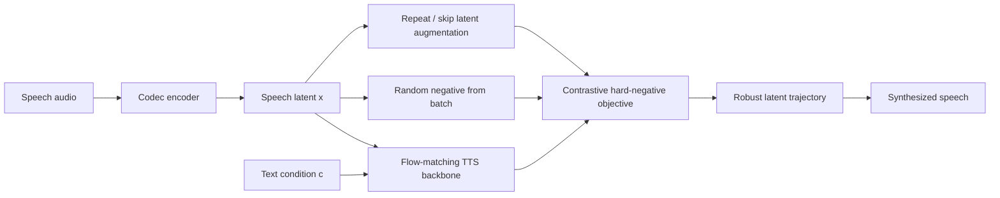
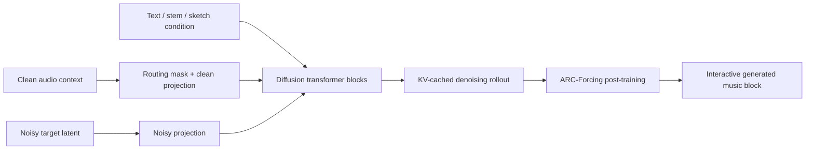
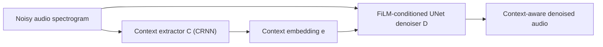
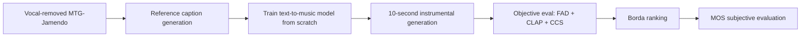
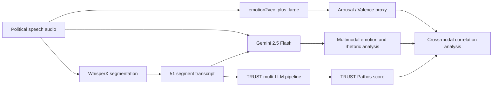

# 语音 / 音频 / 音乐论文速递
## 2026-05-22

> 实际对应 arXiv 更新日：**2026-05-22**  
> 检索范围：`cs.SD + eess.AS`  
> 只放按 ML 顶会审稿口径看，最值得多数读者花时间看的 **5 篇**

## 📋 总览

- 共收录 **5 篇** 相关论文
- 语音生成 / TTS 鲁棒性：**1 篇**
- 音乐生成 / 实时交互：**1 篇**
- 音频前端 / 去噪：**1 篇**
- 音乐生成评测 / 数据与基准：**1 篇**
- 语音大模型 / 多模态修辞分析：**1 篇**

今天这批最值得先看的，不是那篇政治演讲情绪分析，也不是挑战赛综述，而是两篇真正碰生产问题的工作。`RobustSpeechFlow` 直面 flow-matching TTS 最烦人的 skip/repeat 错误，不靠外部对齐器、不靠偏好数据，直接在 latent 空间合成“故障负样本”去修内容保真；`Live Music Diffusion Models` 则不是再做一个离线 text-to-music 大模型，而是认真回答“扩散音乐模型怎么进 live 交互、怎么把首帧时延压到几十毫秒”。

剩下三篇里，`Automatic Contextual Audio Denoising` 虽然还只是 baseline 级工作，但它把“什么算噪声取决于场景语义”这个前端问题提得很对；`Academic Text-to-Music Grand Challenge` 的价值也不在模型，而在它给学术界补了一套可玩的公开 benchmark 和评测协议；`Beyond Acoustic Emotion Recognition` 则更像一篇警示文，提醒大家 acoustic SER 别动不动就冒充 rhetorical understanding。

## 精选入选规则

- **新意（0-3）**：是不是提出了新的训练组织、建模接口、交互机制，或者把旧问题拆得更对
- **影响力（0-3）**：是不是贴近 TTS、音乐生成、音频前端、语音大模型这些主线
- **证据强度（0-2）**：有没有 baseline、关键数值、消融和清楚的任务设定
- **受众匹配度（0-2）**：对语音大模型 / 语音生成 / 音乐生成 / 音频系统研究者有没有直接启发

分数校准：

- **6**：可读，但更像局部补丁或案例分析
- **7**：信息量够，值得过一遍
- **8+**：建议优先精读

## 总览表

| 方向 | 序号 | 论文 | 评分 | 关键词 |
|---|---:|---|---:|---|
| 语音生成 / TTS 鲁棒性 | 1 | RobustSpeechFlow | 8.8/10 | flow matching, skip-repeat errors, hard negatives, ZERO500, compact TTS |
| 音乐生成 / 实时交互 | 2 | Live Music Diffusion Models | 8.5/10 | streaming diffusion, KV cache, ARC-Forcing, prompt transition, live co-creation |
| 音频前端 / 去噪 | 3 | Automatic Contextual Audio Denoising | 7.6/10 | context-aware denoising, ASC embedding, FiLM UNet, SI-SDR, scene-aware suppression |
| 音乐生成评测 / 数据与基准 | 4 | Academic Text-to-Music Grand Challenge | 7.8/10 | MTG-Jamendo, FluxAudio-S, FAD, CLAP, CCS, MOS |
| 语音大模型 / 修辞分析 | 5 | Beyond Acoustic Emotion Recognition | 6.6/10 | emotion2vec, Gemini, TRUST-Pathos, political speech, multimodal analysis |

## 🗣️ 语音生成 / TTS 鲁棒性

### [1] RobustSpeechFlow: Learning Robust Text-to-Speech Trajectories via Augmentation-based Contrastive Flow Matching

- **评分**：8.8/10
- **作者/机构**：Jinhyeok Yang, Hyeongju Kim, Yechan Yu, Joon Byun, Frederik Bous, Juheon Lee；Supertone Inc 与独立研究者联合
- **论文链接**：https://arxiv.org/abs/2605.22083
- **PDF**：https://arxiv.org/pdf/2605.22083.pdf
- **代码链接**：暂无正式开源仓库
- **Demo 链接**：https://robustspeechflow.github.io/

#### 📌 简介
这篇盯的不是零样本 TTS 最好听的样本，而是更烦人的内容保真问题。现在很多 flow-matching TTS 在 speaker similarity 和 naturalness 上已经很能打，但一碰到长句子、复杂韵律或低步数推理，就容易跳词、漏词、重复词。`RobustSpeechFlow` 的想法很直接：既然真实故障主要就是 `repeat` 和 `skip`，那就别再拿随机 batch negatives 做对比学习了，直接在 latent 空间造出这两类“长度不变但文本对齐已坏掉”的 hard negatives，让模型学会远离这些坏轨迹。

#### ☠️ 毒舌点评
这篇最值得肯定的是问题选得对，而且没靠一堆外部模块撑门面。很多 TTS 论文一发现内容错误，就往外接 aligner、偏好模型、额外教师网络，最后系统越来越像施工现场。它这里反而把改动压缩在训练目标里，用最小结构改动去修最常见的 failure mode，这很像认真做产品的人会走的路。缺点也得说清楚：它的提升主要体现在 intelligibility / alignment，上限仍然受限于 `0.06B` 的小模型骨架，SIM 没提升，说明这不是万能药。

#### 🔧 技术方案
- **模型解决的问题**：
  flow-matching TTS 在低 NFE 或复杂文本下，容易因为 cross-attention 对齐不稳而出现 `skip/repeat`。传统随机负样本虽然能做对比正则，但和真实 TTS 故障差得太远，惩罚不到点子上。`RobustSpeechFlow` 解决的是“如何构造贴近真实失败模式的对比目标，从而提升内容保真”。
- **模型架构**：
  - **输入**：文本条件 `c`、参考说话人语音，以及 codec latent `x`
  - **输出**：TTS latent trajectory 对应的语音
  - **主干**：基于 `SupertonicTTS` 的 compact flow-matching TTS
  - **关键模块**：
    - `Baseline`：原始 `SupertonicTTS`
    - `ContrastiveFM`：加入随机 batch negative 的对比流匹配
    - `RobustSpeechFlow`：进一步加入 augmentation-based hard negatives
    - `Repeat augmentation`：复制局部片段制造重复错误
    - `Skip augmentation`：未来片段前移并用 silence latent 补尾，制造漏词错误
- **信号流**：

- **关键设计 / 核心创新**：
  - 把负样本从“随机别人的 utterance”升级成“还是这个说话人、这个音色、这段语音风格，但文本对齐被故意破坏”的 hard negatives。
  - `repeat` 和 `skip` 增广严格保持全局长度不变，避免模型只学会根据长度作弊。
  - 目标函数是 `L = Lpos - λrand Lrand - λaug Laug`，也就是在正向 flow matching 外，显式把模型从错误轨迹推开。
- **训练 / 推理策略**：
  - 训练数据约 **10k 小时**、**5M utterances**、每种语言约 **80k speakers**，覆盖英语和韩语。
  - 所有模型都训练 **500k steps**，使用 **8 张 H100**，`AdamW lr=5e-4`
  - `RobustSpeechFlow` 设 `λrand = λaug = 0.2`，而 `ContrastiveFM` 仅保留 `λaug = 0`
  - 推理面向部署场景，使用 `Euler solver`，`CFG=3.0`，`NFE ∈ {12, 24}`

#### 📊 实验结果
- Seed-TTS-eval：
  - `Baseline(SupertonicTTS)`：`WER 1.44 / SIM 0.60`
  - `ContrastiveFM`：`WER 1.41 / SIM 0.60`
  - `RobustSpeechFlow`：`WER 1.38 / SIM 0.60`
  - 也就是在 **0.06B** 参数下，把 WER 从 **1.44** 压到 **1.38**，相对 baseline 下降约 **4.2%**
- 与更大模型对比：
  - `F5-TTS 0.3B`：`WER 2.00 / SIM 0.67`
  - `VoxCPM 0.5B`：`WER 1.85 / SIM 0.73`
  - `DiTAR 0.6B`：`WER 1.69 / SIM 0.74`
  - `RobustSpeechFlow` 在 WER 上是整张表里最低之一，但 SIM 还是明显低于大模型
- ZERO500 @ 500k steps：
  - 英文 `NFE=24`：`Baseline 0.48 / 1.18`，`ContrastiveFM 0.39 / 1.06`，`RobustSpeechFlow 0.35 / 1.03`（`CER / WER`）
  - 韩文 `NFE=24`：`Baseline 0.81 / 8.40`，`ContrastiveFM 0.65 / 7.72`，`RobustSpeechFlow 0.57 / 7.45`
  - 韩文 `NFE=12` 下也从 `0.93 / 8.46` 提升到 `0.57 / 7.59`
- 训练稳定性：
  - 文中 Figure 1 显示韩文条件下，`RobustSpeechFlow` 的 CER 曲线到 **500k** 时稳定在 **0.57**，而 baseline 在 `NFE=24` 仍停在 **0.81**
- baseline / comparison：
  - `Baseline(SupertonicTTS)`
  - `ContrastiveFM`
  - 公开零样本 TTS baseline 包括 `MegaTTS3`、`Seed-TTSDiT`、`DiTAR`、`F5-TTS`、`CosyVoice3`、`VoxCPM`

#### 💡 为什么值得看
如果你正在做 flow-matching TTS，这篇很值得看，因为它不是又提一个更大的 backbone，而是明确告诉你：`skip/repeat` 这种错，最好直接在训练目标里建模，而不是期待模型自己长出来。对做小模型部署的人尤其有参考价值。

#### 评分：8.8/10
理由：问题真，改动小，提升稳定，而且不依赖外部对齐器或偏好数据。扣分点是 speaker similarity 没被一起拉起来，说明这更像强针对性的内容保真修补，而不是全面升级。

## 🎼 音乐生成 / 实时交互

### [2] Live Music Diffusion Models: Efficient Fine-Tuning and Post-Training of Interactive Diffusion Music Generators

- **评分**：8.5/10
- **作者/机构**：Zachary Novack, Stephen Brade, Haven Kim, Hugo Flores García, Nithya Shikarpur, Chinmay Talegaonkar, Suwan Kim, Valerie K. Chen；UC San Diego、MIT、Adobe 等
- **论文链接**：https://arxiv.org/abs/2605.22717
- **PDF**：https://arxiv.org/pdf/2605.22717.pdf
- **代码链接**：暂无正式开源仓库

#### 📌 简介
这篇不想和离线 `text-to-song` 巨模正面拼参数，而是去做另一件更难的事：把开源音频扩散模型改造成可以和音乐人实时互动的 live generator。作者提出 `Live Music Diffusion Models (LMDMs)`，核心不是新 backbone，而是给现有 diffusion 模型加了 routing mask 和 attention mask，让 clean context 在扩散采样时可以被 KV-cache 复用；随后又加上 `ARC-Forcing` 做 rollout 级 post-training，专门压制长时交互中的 error accumulation。

#### ☠️ 毒舌点评
这篇的好处是它真的在解 live interaction，而不是把离线生成硬叫 interactive。很多音乐生成论文嘴上说“面向创作者”，结果 TTFF 十秒起步，谁跟你现场玩。它这里把首帧时延、prompt transition、accompaniment visibility 这些真正会卡 live 场景的指标全摆出来了。短板也很清楚：CLAP 还没到离线大模型那一档，Block-Causal 变体实现也不够成熟，说明这条路现在更偏系统工程而不是绝对质量最优。

#### 🔧 技术方案
- **模型解决的问题**：
  标准 block-wise diffusion outpainting 每个扩散 step 都要重复处理整段上下文，导致延迟高、无法流式交互；而长时自回归 rollout 又会快速积累漂移。`LMDMs` 解决的是“如何把 diffusion 音乐生成做成可缓存、可流式、可 post-train 的 live 系统”。
- **模型架构**：
  - **输入**：过去 `s` 帧 clean audio context、目标控制条件 `c`（文本、stem、sketch 等）
  - **输出**：未来 `o` 帧音频 latent 或最终音频
  - **主干**：在现有 diffusion transformer 上改造出的 `LMDM`
  - **关键模块**：
    - `Routing mask r=[0,1]`：把 context frame 与 target frame 分流到不同投影路径
    - `Encoder-Decoder LMDM`：context 仅自注意，target 可看全 context，实现 noise-wise KV cache
    - `Block-Causal LMDM`：进一步做 block-causal mask，实现跨时间缓存
    - `ARC-Forcing`：rollout 对抗式 post-training，不用 RL reward model
    - `CFG++ adapted ping-pong sampler`：用于 prompt transition 时避免过饱和
- **信号流**：

- **关键设计 / 核心创新**：
  - 关键不是改 loss，而是先把输入图结构改掉：context hidden state 不再和 noisy target 在每个 step 里混在一起。
  - `Enc-Dec` 变体把复杂度降到和传统 encoder-decoder LMM 同阶；`Block-Causal` 则继续压到只更新最近 block。
  - `ARC-Forcing` 把 differentiable diffusion rollout 和 adversarial relativistic contrastive training 结合起来，直接监督长时生成质量。
- **训练 / 推理策略**：
  - 初始 LMDM 训练可直接复用标准 flow matching pipeline，只对 target frame 计算额外稳定版 flow loss mask
  - pre-ARC 阶段在 `6000 Pro Blackwell GPU` 上 round-trip latency 约 **110-170ms**
  - 加 post-training 后，用 distill 版 `ping-pong` sampler 把总 latency 压到约 **30ms** 级
  - prompt transition 时，在 dominant prompt 切换点丢弃前 `d=180` frames context，并用改造 `CFG++` 增强文本控制

#### 📊 实验结果
- Text-conditioned global metrics（无 priming）：
  - `Stable Audio Open`：`TTFF 10.35s`，`FD 96.51`，`KD 0.55`，`CLAP 0.41`
  - `MusicGen-Large`：`TTFF 10.81s`，`FD 190.47`，`KD 0.52`，`CLAP 0.31`
  - `LMDM (ED)`：`TTFF 0.11s`，`FD 61.06`，`KD 1.14`，`CLAP 0.20`
  - `LMDM (ED)+AF`：`TTFF 0.03s`，`FD 35.88`，`KD 0.74`，`CLAP 0.29`
  - `LMDM (BC)+AF`：`TTFF 0.02s`，`FD 47.26`，`KD 0.91`，`CLAP 0.23`
- Text-conditioned with priming：
  - `LMDM (ED)+AF` 达到 `FD 29.00`、`KD 0.35`、`CLAP 0.32`
  - 明显优于未加 post-training 的 `LMDM (ED)`：`FD 35.35`、`KD 0.62`、`CLAP 0.23`
- Sketch-conditioned on `MUSDB18`：
  - `LMDM (ED)`：`FD 101.01`，`KL 1.52`，`CLAP 0.23`，`Mel 0.26`，`Rhy 0.45`
  - `LMDM (ED)+AF`：`FD 181.79`，`KL 1.24`，`CLAP 0.14`，`Mel 0.27`，`Rhy 0.45`
  - `Bidir Flow Model`：`FD 78.51`，`KL 1.23`，`CLAP 0.19`，`Mel 0.33`
  - 说明 live 友好设计和离线质量之间仍有真实 trade-off
- 其他证据：
  - 论文正文明确说 LMDM 用接近 **100x less data**、约一半参数量，就拿到与 LMM 类模型竞争的质量和更低时延
  - accompaniment 任务里，当 `future visibility tf < 0` 时，模型 alignment 虽下降但没有退化到 random pairing 水平
- baseline / comparison：
  - `Magenta RealTime`
  - `Stable Audio Open`
  - `MusicGen-Large`
  - `Bidir Flow Model`

#### 💡 为什么值得看
如果你做音乐生成但真的想落到 live instrument / co-creation，这篇值得看，因为它把“能跑起来”和“能互动物理上来得及”放在了第一位。比很多离线大模型更有系统启发。

#### 评分：8.5/10
理由：交互目标清晰，系统设计有料，时延指标很硬。扣分点是文本对齐和离线质量还没完全追平最强离线模型，而且部分变体实现还显得粗糙。

## 🔊 音频前端 / 去噪

### [3] Automatic Contextual Audio Denoising

- **评分**：7.6/10
- **作者/机构**：Diep Luong, Konstantinos Drossos, Mikko Heikkinen, Tuomas Virtanen；Tampere University、Nokia
- **论文链接**：https://arxiv.org/abs/2605.22262
- **PDF**：https://arxiv.org/pdf/2605.22262.pdf
- **代码链接**：数据已公开到 Zenodo，代码未见正式仓库

#### 📌 简介
这篇想做的不是传统意义上的“把噪声尽量压没”，而是更语义化的 `contextual denoising`。作者指出，某个声音成分是不是噪声，取决于当前任务上下文，比如交通声在通话里是噪声，但在城市声景监控里反而是关键信号。于是他们先训练一个 acoustic scene context extractor，再把这个 learned context 喂给 FiLM-conditioned UNet 去做去噪。

#### ☠️ 毒舌点评
方向判断是对的，这比继续刷通用 denoising 指标更接近真实应用。问题在于它现在还只是“baseline + synthetic dataset”阶段，提升有，但没有大到让人拍桌子。更麻烦的是作者自己也承认，模型可能在利用 clean/OC source 的统计失配，而不一定真的学会了上下文语义。所以这篇值得读，但更像研究题目开了个头，不是已经把答案做完了。

#### 🔧 技术方案
- **模型解决的问题**：
  传统 denoising 默认“目标语音/目标声音”固定不变，而这里目标由 context 决定。`ACAD` 解决的是“如何自动推断当前声景上下文，并据此决定什么该保留、什么该去除”。
- **模型架构**：
  - **输入**：noisy audio spectrogram `x~`
  - **输出**：estimated clean/context-relevant audio `x^`
  - **主干**：`context extractor C + denoiser D`
  - **关键模块**：
    - `C`：CRNN-based acoustic scene classifier，输出 context embedding `e`
    - `D`：UNet denoiser，使用 `FiLM` 注入 context
    - `UNetoracle`：直接喂 scene class one-hot
    - `UNetconst`：喂全 1 常量向量，验证“无信息条件”是否真的有用
- **信号流**：

- **关键设计 / 核心创新**：
  - 不是预先给 oracle scene label，而是从 noisy 输入里自己学 context
  - 提供 `frozen` 和 `joint finetune` 两种模式，验证 context extractor 与 denoiser 是否需要对齐训练
  - 明确加入 `UNetconst` 作为负控制，防止把“加任何向量都变好”误判成 context 有效
- **训练 / 推理策略**：
  - 两阶段训练：先预训练 `C` 做 acoustic scene classification，再训练 `D`
  - 第二阶段分别测试 `C frozen` 与 `C finetuned`
  - `C` 是 3 个卷积残差块 + RNN + temporal attention pooling + FC
  - `D` 是带 FiLM 的 `5-block` deep encoder-decoder UNet

#### 📊 实验结果
- Context extractor：
  - `ASC` 测试准确率 **84.18%**
- Baseline 对比：
  - `UNet`：`SI-SDR 10.16 dB`，`SDR 10.56 dB`
  - `UNetoracle`：相对 `UNet` 提升 **0.66 dB / 0.67 dB**
  - `UNetFr-ASC`：相对 `UNet` 提升 **0.88 dB / 0.91 dB**
  - `UNetTu-ASC`：相对 `UNet` 提升 **1.96 dB / 2.00 dB**
- 额外观察：
  - `UNet` 相比 noisy input 也能拿到 **+5.89 dB SI-SDR**，说明数据构造里存在统计失配捷径
  - `UNetconst` 两种设置都比 `UNet` 更差，说明无信息条件不但没帮忙，反而会分散注意力
- 定性分析：
  - 文中 `t-SNE` 显示带 informative context 的模型在 bottleneck feature 上按 scene 类别聚得更开
- baseline / comparison：
  - `UNet`
  - `UNetoracle`
  - `UNetconst`
  - `UNetFr-ASC`
  - `UNetTu-ASC`

#### 💡 为什么值得看
做音频前端的人值得看这篇，不是因为它现在指标炸裂，而是因为它把“去噪目标应不应该随任务/场景变化”这个问题说得很明确。未来如果要做 audio agent 或 task-aware front-end，这个问题迟早得补。

#### 评分：7.6/10
理由：问题设得对，实验设计比一般 baseline paper 更认真。扣分点是数据构造 confound 明显，提升幅度还不够把这个方向彻底坐实。

## 🎵 音乐生成评测 / 数据与基准

### [4] Academic Text-to-Music Grand Challenge: Datasets, Baselines, and Evaluation Methods

- **评分**：7.8/10
- **作者/机构**：Fang-Chih Hsieh, Wei-Jaw Lee, Chun-Ping Wang, Hung-yi Lee, Hao-Wen Dong, Yi-Hsuan Yang；台湾大学、Academia Sinica 等
- **论文链接**：https://arxiv.org/abs/2605.21538
- **PDF**：https://arxiv.org/pdf/2605.21538.pdf
- **代码链接**：**挑战基线与评测已开源** https://github.com/ntu-musicailab/ICME26-ATTM-GC-FluxAudio 、https://github.com/ntu-musicailab/ICME26-ATTM-GC-Evaluation

#### 📌 简介
这篇不是新 T2M 模型论文，而是 ICME 2026 `Academic Text-to-Music (ATTM)` 挑战赛的技术说明。它想解决的是一个很现实的学术界痛点：现在 text-to-music 基本被大私有数据、大算力公司把门焊死了，学校实验室根本没法公平比。于是作者把任务限制成“只准用公开 CC 授权的 instrumental MTG-Jamendo 子集，从头训练”，再配上公开 caption、公开 baseline、公开 objective evaluation code。

#### ☠️ 毒舌点评
这类 challenge paper 最大风险是只做赛事宣传，技术含量稀薄。好在这篇至少把数据、caption、objective metric、主观测评和 leaderboard 聚合逻辑都讲清楚了，尤其 `CCS` 这个 concept-level 评测比只看 CLAP 更像回事。问题也很明显：它的核心贡献是 benchmark 和 protocol，不是算法创新；如果你只想找新模型结构，这篇会嫌“没料”，但如果你想做可复现学术 T2M，这篇反而很有用。

#### 🔧 技术方案
- **模型解决的问题**：
  学术界缺少一个不依赖私有大数据、能公平评估 text-to-music 模型的公开 benchmark。`ATTM` 解决的是“如何定义一个从数据、caption 到 objective + subjective evaluation 都可复现的学术挑战框架”。
- **模型架构**：
  - **输入**：文本 prompt 与标准化的 instrumental 训练音频
  - **输出**：10 秒 instrumental music clip
  - **主干**：挑战赛不是单模型，而是 `benchmark + baseline + evaluation pipeline`
  - **关键模块**：
    - `Efficiency Track`：core generative model 限制 **500M** 参数
    - `Performance Track`：不限制参数
    - `FluxAudio-S baseline`：**120M** 参数，Flux-style Transformer + conditional flow matching
    - `Qwen2-Audio` 与 `Music Flamingo + Qwen3-4B` 两套 caption pipeline
    - `CCS`：基于 `Qwen3-Omni` 的 concept coverage score
- **信号流**：

- **关键设计 / 核心创新**：
  - 明确把“学术可用性”当目标，不再默认允许私有 20k 小时数据碾压。
  - `CCS` 不只看整体语义相似度，而是检查 genre / instrument / mood 三元组里到底命中了几个 target concept。
  - 用 `Borda count` 聚合 `FAD + CLAP + CCS`，避免单一指标统治排行榜。
- **训练 / 推理策略**：
  - 训练数据分两档：完整 instrumental `MTG-Jamendo` 约 **3,777 小时**，以及 30 秒子集约 **464 小时**
  - 基线 `FluxAudio-S` 在单张 `RTX A6000 48GB` 上训练 **200,000 steps**，batch size **128**
  - objective ranking 只用 **80** 个 ID prompts，另有 **20** 个 OOD prompts 仅作泛化观察
  - subjective 阶段比较 **6** 个 finalist + `MusicGen-small`

#### 📊 实验结果
- Objective leaderboard（Table II）：
  - `FluxAudio-S (Baseline)`：`FAD 0.757`，`CLAP 0.088`，`CCS 0.592`，总排名 **17**
  - `Submission e07`：`FAD 0.417`，`CLAP 0.261`，`CCS 0.867`，Efficiency Track **第 1**
  - `Submission e01`：`0.577 / 0.338 / 0.863`，Efficiency Track **第 2**
  - `Submission p05`：`0.514 / 0.306 / 0.800`，Performance Track **第 1**
  - `MusicGen-large` topline：`FAD 0.553`，`CLAP 0.379`，`CCS 0.888`
- Subjective MOS（Table III）：
  - `Submission p05`：`MOS_all 3.344 ± 1.116`，`MOS_expert 3.327 ± 1.137`
  - `Submission e07`：`3.250 ± 1.234`，`3.186 ± 1.286`
  - `MusicGen-small`：`3.538 ± 1.009`，`3.425 ± 0.998`
  - 说明挑战赛最优公开方案已经逼近，但还没超过官方 MusicGen-small anchor
- 额外规模信息：
  - 共 **18** 支队伍注册
  - 实际提交为 Efficiency Track **12** 支，Performance Track **4** 支
  - objective finalist 选出 **6** 个系统
- baseline / comparison：
  - `FluxAudio-S`
  - `Stable Audio Open`
  - `MusicGen-small/medium/large`
  - `MeanAudio-S/L-Full`

#### 💡 为什么值得看
如果你做音乐生成研究，但又没有工业级私有数据和几千卡预算，这篇非常值得存档。它不是给你最强模型，而是给你一个能让学术组真正站上牌桌的 benchmark 与评测协议。

#### 评分：7.8/10
理由：对学术界是很有价值的基础设施工作，开放度和评测设计都不错。扣分点是它主要是 challenge framework，不是方法创新论文。

## 🤖 语音大模型 / 多模态修辞分析

### [5] Beyond Acoustic Emotion Recognition: Multimodal Pathos Analysis in Political Speech Using LLM-Based and Acoustic Emotion Models

- **评分**：6.6/10
- **作者/机构**：Jürgen Dietrich；Democracy Intelligence gGmbH
- **论文链接**：https://arxiv.org/abs/2605.22732
- **PDF**：https://arxiv.org/pdf/2605.22732.pdf
- **代码链接**：暂无

#### 📌 简介
这篇想论证一件事：传统 acoustic emotion recognition 能不能拿来代理政治演讲里的 `Pathos`，也就是修辞层面的情感诉求。作者拿德国联邦议院 Felix Banaszak 的一段演讲做 case study，把 `emotion2vec_plus_large`、`Gemini 2.5 Flash` 和一个三模型 `TRUST` 修辞评分管线做对照，最后发现 acoustic SER 几乎抓不住 rhetorical pathos，而多模态 LLM 反而更接近。

#### ☠️ 毒舌点评
这篇的问题意识其实不错，至少它知道“情绪分类”不等于“政治修辞里的 pathos”。但它的证据形态更像精致版案例研究，而不是可推广的方法论文。单 speaker、单 speech、单语言、单情境，拿来说明“SER 不能冒充 discourse analysis”可以，拿来宣称一条新研究范式还差得远。

#### 🔧 技术方案
- **模型解决的问题**：
  传统 SER 输出的是声学情绪类别或 Arousal/Valence，但政治演讲中的 `Pathos` 依赖语义、修辞功能和 discourse context。论文要解决的是“acoustic model 与 multimodal LLM，谁更能贴近政治修辞中的 Pathos 定义”。
- **模型架构**：
  - **输入**：完整演讲音频、51 段带时间戳转写文本
  - **输出**：segment-level 情绪 / Arousal / Valence / Pathos 评分
  - **主干**：三路对照分析
  - **关键模块**：
    - `emotion2vec_plus_large`：输出 8 类情绪概率，再后处理投影到 Russell Circumplex
    - `Gemini 2.5 Flash`：音频 + transcript 联合分析，输出 open-ended emotion 与 A/V
    - `TRUST`：`gemini-2.5-flash + gpt-5.2 + claude-sonnet-4-6` 三 advocate，再由 supervisor 聚合 Pathos
- **信号流**：

- **关键设计 / 核心创新**：
  - 不是直接比较 emotion accuracy，而是比较它们与 `TRUST-Pathos` 的相关性
  - 明确指出把 `emotion2vec` 概率投影到 Russell Circumplex 依赖 **3 个未经验证的假设**
  - 采用 open-ended LLM annotation，避免 forced-choice taxonomy 限制
- **训练 / 推理策略**：
  - 不涉及新模型训练，主要是多模态分析与统计相关性
  - 演讲总长 **232s**，切成 **51** 段，其中 `TRUST relevance filter` 保留 **41** 段
  - 相关性使用 `Spearman ρ`，显著性阈值 `α=0.05`

#### 📊 实验结果
- EMO-DB 上的 Gemini 开放式标注：
  - 总体 semantic match 仅 **30.1%**，平均 confidence 却有 **0.82**
  - `Neutral 65.8%` 最好，`Disgust 0.0%` 最差，`Boredom 12.3%`
  - 说明开放式 LLM 情绪标签和传统 acted corpus taxonomy 并不天然一致
- 演讲分析统计（51 段）：
  - `Gemini Arousal mean 0.59`
  - `Gemini Valence mean -0.56`
  - `emotion2vec Arousal mean 0.36`
  - `emotion2vec Valence mean 0.04`
  - `TRUST-Pathos mean -0.37`
- 关键相关性（Table 4）：
  - `Gemini Valence ↔ TRUST-Pathos`：`ρ = +0.664, p < 0.001`
  - `Gemini Arousal ↔ TRUST-Pathos`：`ρ = -0.535, p < 0.001`
  - `e2v Valence ↔ TRUST-Pathos`：`ρ = +0.097, p = 0.499`
  - `e2v Arousal ↔ TRUST-Pathos`：`ρ = -0.155, p = 0.278`
  - acoustic 与 multimodal 两路几乎不对齐：`e2v/Gemini Arousal ρ=0.239`，`Valence ρ=0.200`
- 额外 baseline 线索：
  - 文中引用 `WavLM Large` 在 EMO-DB 上可达 **92.67% weighted accuracy**
  - 但作者的核心结论是，这类 acted SER accuracy 并不能转译成 political rhetoric understanding

#### 💡 为什么值得看
如果你在做 voice agent、speech analytics 或 political/audio discourse analysis，这篇值得看作“别把 SER 当万能修辞理解器”的反例。它不是强方法论文，但对问题边界划分有提醒价值。

#### 评分：6.6/10
理由：研究问题有辨识度，相关性结果也有点意思。扣分点是证据范围太窄，本质仍是单案例分析，很难当成通用结论。

## 最后结论

今天这批最该优先读的是 `RobustSpeechFlow` 和 `Live Music Diffusion Models`。前者说明 TTS 里很多内容错误，不一定要靠更大模型和更多外挂模块解决，先把负样本设计对了就能明显稳住；后者则提醒音乐生成别再只盯离线大模型排行榜，实时交互这条线有自己独立的系统难题和值得做的创新空间。

`Automatic Contextual Audio Denoising` 和 `ATTM Grand Challenge` 也值得留档，但定位要摆正。前者是题目立得好、答案还没做满；后者是学术基础设施，不是方法 SOTA。至于 `Beyond Acoustic Emotion Recognition`，更适合当反思材料看，别把它误读成“Gemini 已经会做政治修辞科学分析”。
