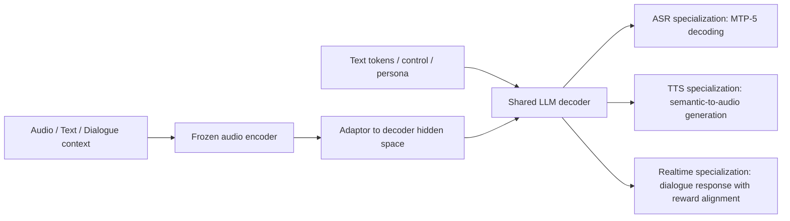
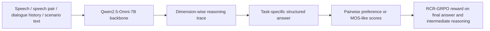
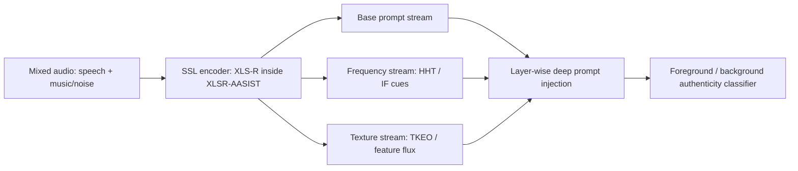
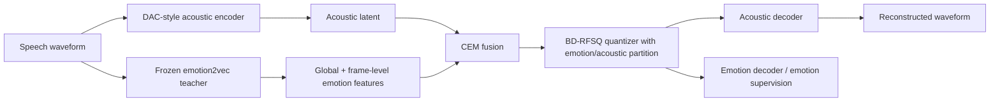

# 语音 / 音频 / 音乐论文速递
## 2026-05-25

> 实际对应 arXiv 更新日：**2026-05-25**
> 检索范围：`cs.SD + eess.AS`
> 只放按 ML 顶会审稿口径看，最值得多数读者花时间看的 **5 篇**

## 📋 总览

- 共收录 **5 篇** 相关论文
- 统一语音系统 / 语音大模型：**2 篇**
- 语音 codec / 安全：**2 篇**
- 音频可解释性：**1 篇**

今天这批里最值得优先看的，不是某个单点指标刷得多高，而是三条更成体系的主线。`StepAudio 2.5` 代表的是“一个共享骨干，靠后训练和解码策略把 ASR、TTS、Realtime 三条线都顶上去”的统一系统路线；`AffectCodec` 和 `MixFake` 则分别打在两个很现实的瓶颈上，一个是 codec 会把情感信息压没，一个是 deepfake 检测一进真实混音场景就掉链子；`UniSRM` 虽然不如前两类吸睛，但它把 speech judge / reward model 从“只会打总分”推进到“按维度推理再给奖励”，对后续 RLHF 式语音优化是更长期的基础设施。

## 精选入选规则

- **新意（0-3）**：是不是提出了新的表示、结构约束、训练组织方式，或者把老问题拆得更对
- **影响力（0-3）**：是不是贴近语音大模型、codec、ASR、TTS、语音安全这些主线
- **证据强度（0-2）**：有没有像样的 baseline、消融和关键数值
- **受众匹配度（0-2）**：对语音大模型 / 语音前端 / 音乐与安全方向研究者有没有直接启发

分数校准：

- **6**：能读，但更像局部补丁或窄场景分析
- **7**：信息量够，值得过一遍
- **8+**：建议优先精读

## 总览表

| 方向 | 序号 | 论文 | 评分 | 关键词 |
|---|---:|---|---:|---|
| 统一语音系统 / 语音大模型 | 1 | StepAudio 2.5 Technical Report | 8.5/10 | unified audio-language model, MTP-5, RLHF, realtime |
| 语音安全 / deepfake | 2 | MixFake: Benchmarking and Enhancing Audio Deepfake Detection in Diverse Real-world Mixed Audio | 8.5/10 | mixed audio deepfake, prompt tuning, HHT, TKEO |
| 语音 codec / 情感保真 | 3 | AffectCodec: Emotion-Preserving Neural Speech Codec with Block-Diagonal Residual FSQ | 8/10 | emotion codec, BD-RFSQ, multi-rate training, low bitrate |
| 语音评测 / reward model | 4 | UniSRM: A Unified Speech Reward Model for Reasoning-Based Fine-grained Assessment | 8/10 | speech judge, reward model, RCR-GRPO, QualiSpeech |
| 音频可解释性 | 5 | Evaluating the Temporal Detection Capability of Integrated Gradients Applied on Sound Classifier | 7/10 | integrated gradients, temporal localization, weak SED |

## 🤖 统一语音系统 / 语音大模型

### [1] StepAudio 2.5 Technical Report

- **评分**：8.5/10
- **作者/机构**：StepFun-Audio Team；论文首页以团队名义署名，未逐条展开个人机构
- **论文链接**：https://arxiv.org/abs/2605.23463
- **PDF**：https://arxiv.org/pdf/2605.23463.pdf
- **代码链接**：暂无
- **Demo 链接**：暂无

#### 📌 简介
这篇技术报告的核心不是“我们也做了个 omni 模型”，而是想证明统一 audio-language foundation 不必天然输给专用系统。作者把同一个共享骨干往三条方向特化：ASR 用可验证 multi-token prediction 拉效率，TTS 用偏好优化拉可控性，Realtime 用生成式 reward model 做低时延对话对齐。

#### ☠️ 毒舌点评
这篇是大厂技术报告味道很重的稿子，优点是系统观完整，缺点也是系统观太强，很多地方更像“我们怎么把一整条产线磨顺”而不是单点方法论文。它不是那种每个模块都新到离谱的 paper，但它至少没有拿统一模型当借口糊弄，ASR、TTS、Realtime 三条线都给了可用结果；做语音大模型的人值得读，做纯学术 novelty hunting 的人会觉得它不够锋利。

#### 🔧 技术方案
- **模型解决的问题**：
  现有统一语音模型最大的问题不是不能跑通，而是跑通之后往往哪条都不够深，ASR 不够快，TTS 不够稳，Realtime 又不够像真人。`StepAudio 2.5` 想解决的是“在共享骨干不拆家的前提下，怎么靠数据、目标和解码约束把三种部署目标都做强”。
- **模型架构**：
  - **输入**：音频波形对应的声学特征、文本 token、控制指令、对话历史和 persona 条件
  - **输出**：ASR 分支输出转写文本；TTS 分支输出语音 token / 中间音频表示；Realtime 分支输出带显式推理痕迹的语音对话响应
  - **主干**：`frozen audio encoder + lightweight adaptor + large decoder` 的统一 audio-language backbone
  - **关键模块**：
    - ASR 分支的 `MTP-5` 多未来 token 预测头
    - TTS 分支的语义到音频对齐与 preference-based RLHF
    - Realtime 分支的 generative reward modeling 与 staged RLHF
    - 共享的数据生产流水线与分阶段 multimodal pretraining
  - **信号流**：

- **关键设计 / 核心创新**：
  这篇真正有价值的点，不是“共用一个 backbone”这句废话，而是把任务差异明确定义成三类 operational regime。ASR 方向强调 grounded decoding，所以用可验证 lookahead；TTS 方向强调可控与表达，所以用 context-rich supervision + preference RLHF；Realtime 方向则把 persona、一致性和 paralinguistic sensitivity 放进奖励体系里。
- **训练 / 推理策略**：
  - 预训练先做 `3B` token 的 ASR 对齐，只训 adaptor，不动 audio encoder 和 LLM
  - 之后进入统一 multimodal 训练，主训练混合里包含 `800B` text token 和 `800B` speech token
  - 最后 cooldown 阶段再用 `600B` 高质量长上下文数据把序列长度拉到 `32K`
  - ASR SFT 用短长句混合，`10K steps`，峰值学习率 `2e-5`
  - ASR 的推理核心是 `MTP-5` 验证式前瞻，不是无脑一次吐多 token
  - TTS 和 Realtime 都继续走 RLHF；Realtime 明确用了带 KL 正则的 PPO 风格优化和生成式 reward model
  - 推理性能里，文中明确给了 ASR `RTF 0.0053`；TTS / Realtime 没给统一的延迟表，只给了竞技式结果

#### 📊 实验结果
- **ASR**：
  - 中文平均 `CER 2.97%`
  - `AISHELL-1` 做到 `0.71%`
  - `FLEURS zh` 做到 `2.63%`
  - 英文平均 `WER 3.68%`
  - `LibriSpeech clean 1.38%`，长语音平均错误率 `3.70%`
  - 对比基线包括 `VibeVoice-ASR`、`FunASR-Nano`、`Doubao-ASR-2603`、`Qwen3-ASR-1.7B`
- **效率**：
  - `RTF 0.0053`
  - 明显快于 `Qwen3-ASR-1.7B` 的 `0.0094`
  - 也快于 `FunASR-Nano 0.0591` 和 `VibeVoice-ASR 0.1039`
  - `MTP-5` 相比 `MTP-3` 带来约 `39%` 的平均接受长度增益，继续加到 `MTP-7` 只多约 `22%`
- **TTS**：
  - 在 `774` 条 prompt 的 arena 评测里，总体 pairwise win rate 是 `67.6%`
  - 对手是 `MiniMax-2.8-HD`、`Elevenlabs-v3`、`Gemini-3.1-Flash-TTS`
  - 这不是那种只赢一两个样本的摆拍结果，但论文也没有把每个对手的逐项胜率全摊开
- **Realtime**：
  - 相比次优系统，主观人评高出 `+10.0`
  - 在 `Step-SPQA` 上高出 `+16.6`
  - 论文强调同时提升了主观对话质量和音频理解，但图里细粒度原始分数在正文文字里没有完全展开

#### 💡 为什么值得看
如果你关心 unified speech model 到底能不能真落地，这篇比大多数“我们也做了 omni”更值得读。它的启发不是某个孤立模块，而是后训练如何按任务目标拆分：哪些能力该靠解码策略吃出来，哪些能力该靠奖励模型对齐出来，哪些能力只能靠数据引擎托底。

### [4] UniSRM: A Unified Speech Reward Model for Reasoning-Based Fine-grained Assessment

- **评分**：8/10
- **作者/机构**：Yuanyuan Wang, Dongchao Yang, Yayue Deng, Zhiyong Wu, Yiwen Guo, Helen Meng, Xixin Wu；香港中文大学、清华大学、独立研究者
- **论文链接**：https://arxiv.org/abs/2605.23261
- **PDF**：https://arxiv.org/pdf/2605.23261.pdf
- **代码链接**：**代码已开源** https://github.com/lavendery/UniSRM
- **Demo 链接**：暂无

#### 📌 简介
这篇想解决的不是“怎么再做一个 speech judge”，而是怎么把 speech reward model 从单一任务、单一分数、单一回合评价，升级成多任务、多维度、带显式 reasoning 的统一评测器。作者同时给了数据、benchmark 和模型训练方案，目标是让 reward model 真能服务后续 speech RLHF，而不是只做一个会打分的黑盒。

#### ☠️ 毒舌点评
这篇最大优点是问题意识很准。很多语音评测工作还停留在“给个总分就算 judge”，这篇至少知道中间推理不受控，最后 reward 也会漂。短板也很明显：它的数据标注很依赖 Gemini 生成监督，虽然作者做了人审和跨数据验证，但这条链天然还是有 teacher bias；不过在现阶段 speech reward model 里，它已经算比较像样的一篇。

#### 🔧 技术方案
- **模型解决的问题**：
  现有 speech reward model 覆盖任务窄，经常只看 utterance-level quality 或单轮对话，而且推理过程和最终分数经常不一致。`UniSRM` 想解决的是“能不能用统一模型支持 A/B 偏好判断、MOS 式评分、场景一致性和多轮对话评价，并把维度级 reasoning 直接纳入奖励”。
- **模型架构**：
  - **输入**：文本提示、单条或成对语音、场景上下文、对话历史
  - **输出**：带 `<think>` 式维度分析的显式推理，以及最终偏好决策或多维评分
  - **主干**：以 `Qwen2.5-Omni-7B` 为底座的 end-to-end speech reward model
  - **关键模块**：
    - `UniSRM-Data` 与 `UniSRM-Bench`
    - 两阶段训练：`SFT + GRPO`
    - `RCR-GRPO`，即 Reasoning-Consistent Rewards
    - 按维度拆分的 reward：格式、最终答案、维度一致性
  - **信号流**：

- **关键设计 / 核心创新**：
  核心不是再堆一个 judge 数据集，而是把 reward 直接下沉到维度级 reasoning。作者认为只用 accuracy-based reward 会让模型为了结果对而胡编中间解释，所以加了 `RCR` 去约束每个维度的比较和打分逻辑，逼模型在“怎么得出结论”上也要一致。
- **训练 / 推理策略**：
  - 四类任务统一进一个条件生成框架：A/B 偏好、单句质量、场景一致性、多轮对话评价
  - 数据构造里用 `Gemini-2.0-Flash` 和 `Gemini-2.5-Pro` 生成多维标注与解释，再做人工校验
  - SFT 阶段让模型先学会按结构输出 reasoning 和结论
  - RL 阶段基于 `GRPO`，总 reward 由 `Rfmt + Racc + Rrc` 组成
  - 推理时，模型先输出维度分析，再输出最终偏好或 MOS 类分数
  - 文中没把部署延迟、吞吐、显存这些系统指标讲清楚，重点还是 reward 行为而不是 serving

#### 📊 实验结果
- 总体结果见 `UniSRM-Bench`：
  - `Task 1` A/B 偏好：`65.06`
  - `Task 2` 细粒度质量：`39.74 / 0.551`
  - `Task 3-En`：`85.61`
  - `Task 3-Zh`：`91.30`
  - `Task 4` 多轮对话：`88.89`
- 对比基线：
  - `Gemini-2.5-Pro`：`60.67 / 28.93 / 0.517 / 67.31 / 63.47 / 82.40`
  - `Qwen2.5-Omni-7B`：`51.20 / 24.03 / 0.289 / 49.45 / 52.17 / 56.35`
  - `UniSRM` 整体都更强，尤其在 Task 3/4 上拉开明显差距
- 消融很关键：
  - 去掉 `RCR-GRPO` 后，总体掉到 `60.44 / 37.58 / 80.81 / 81.42 / 82.54`
  - 只做 SFT、不做 GRPO，则进一步掉到 `60.24 / 39.20 / 67.16 / 70.95 / 74.60`
  - 这说明只盯最终答案对错，真的会把 reasoning 训歪
- `QualiSpeech` 的维度级结果：
  - `UniSRM` 平均 `PCC 0.505`
  - `Noise 0.754`，`Distortion 0.547`，`Overall 0.551`
  - 比 `w/o RCR-GRPO` 的 `0.481` 更稳
- 跨数据泛化：
  - `BVCC`: `0.4977 / 49.16`
  - `SOMOS-Clean`: `0.2612 / 41.70`
  - `SOMOS-Full`: `0.2347 / 52.97`
  - 也明显强于 `Qwen2.5-Omni-7B` 和 `Gemini-2.5-Pro`

#### 💡 为什么值得看
做 speech RLHF、TTS 评测或对话音频评测的人都该看这篇，因为它真正碰的是 reward quality 这个根问题。它告诉你：judge 不是会打分就够了，维度级 reasoning 如果不对齐，后续 reward optimization 很容易把模型往假进步上带。

## 🔒 语音安全 / deepfake

### [2] MixFake: Benchmarking and Enhancing Audio Deepfake Detection in Diverse Real-world Mixed Audio

- **评分**：8.5/10
- **作者/机构**：Qingcao Li, Yipeng Lin, Weichen Lian, Zhongjie Ba, Peng Cheng, Zhichao Lian；南京理工大学网络空间安全学院、浙江大学区块链与数据安全全国重点实验室、杭州高新区区块链与数据安全研究院
- **论文链接**：https://arxiv.org/abs/2605.23201
- **PDF**：https://arxiv.org/pdf/2605.23201.pdf
- **代码链接**：**代码已开源** https://github.com/saltfish233/MixFake
- **Demo 链接**：暂无

#### 📌 简介
这篇抓得很准：现在很多 speech deepfake detector 在干净语音上已经能卷到小数点后两位了，但一进真实场景，背景音乐、环境声一混，模型就开始瞎。作者一边做了一个专门针对混音场景的大规模基准 `MixFake`，一边给出 `Multi-stream Prompt Tuning`，把频率和纹理先验注入 SSL backbone，专门补“语义中心主义”这块短板。

#### ☠️ 毒舌点评
这是那种看标题就知道比普通榜单 paper 更有现实意义的工作。它的创新不在 backbone 本身，而在任务设定和 prompt 注入的信号先验组织方式。缺点是方法主体还是站在 `XLSR-AASIST` 这条老骨架上做增强，不是推翻重来；但对做语音安全的人来说，这种现实场景补丁往往比空喊大模型更值钱。

#### 🔧 技术方案
- **模型解决的问题**：
  传统 deepfake detector 大多假设输入主体是干净语音，重点盯语义相关的伪造痕迹；一旦背景里也有合成音乐、环境声或者复杂混音，模型就抓不住。`MixFake` 解决的是“在 foreground / background 都可能有伪造成分的混音环境下，怎么同时做 benchmark 和检测方法”。
- **模型架构**：
  - **输入**：单源或混源音频，前景为语音，背景为音乐或环境声，SNR 从 `-5` 到 `20 dB`
  - **输出**：前景真实性判断或背景真实性判断
  - **主干**：`XLSR-AASIST` backbone，上面叠加 multi-stream deep prompt injection
  - **关键模块**：
    - `Base Stream`：标准可学习 prompt
    - `Frequency Stream`：基于 `HHT` / 瞬时频率异常的 prompt 调制
    - `Texture Stream`：基于 `TKEO` 和 feature flux 的纹理 prompt
    - 三流 prompt 在每个 Transformer layer 里和 SSL 特征一起注入
  - **信号流**：

- **关键设计 / 核心创新**：
  第一层价值是数据：`MixFake` 不是随便糊几个噪声增强，而是把前景 / 背景真实性组合、单源与混源、SNR 扫描全系统化。第二层价值是方法：把频率异常和非线性能量纹理显式塞进 prompt，而不是继续把一切都押在 SSL 语义特征上。
- **训练 / 推理策略**：
  - 数据集总量 `252,500` 条样本，约 `673.69` 小时
  - 训练集 `116,000`，开发集 `20,500`，测试集 `116,000`
  - 背景和前景做真实性交叉配对，`mix ratio = 4`
  - SNR 随机采样自 `{−5, 0, 5, 10, 15, 20}`
  - 训练时冻结 SSL encoder 原参数，只训练多流 prompt、信号分析模块和后端分类器
  - 评价指标是 `EER`

#### 📊 实验结果
- 数据规模：
  - `252,500` 条样本
  - 约 `673.69` 小时
  - 单源约 `510.59` 小时，混源约 `163.10` 小时
- 主结果：
  - 前景检测 `EER 0.95%`
  - 背景检测 `EER 12.40%`
- 对比基线：
  - `XLSR-AASIST`：`2.84% / 20.12%`
  - `XLSR-Mamba`：`1.37% / 17.86%`
  - `WPT-XLSR-AASIST`：`2.85% / 15.81%`
  - 也就是说背景检测上对 `XLSR-AASIST` 绝对提升 `7.72` 个点
- 鲁棒性：
  - 前景检测在 `15 dB` 时最低 `EER 0.36%`
  - 最难的 `-5 dB` 条件下，方法仍能把前景检测压到 `3.10%`
  - 同条件下 `XLSR-AASIST 6.46%`，`WPT-XLSR-AASIST 5.48%`
  - 背景检测在 `-5 dB` 时最好，最低 `11.24%`
  - 到 `20 dB` 时，`XLSR-AASIST` 背景检测升到 `27.05%`
- 跨数据泛化：
  - In-the-wild 上，本文 `6.24%`
  - `XLSR-AASIST 9.60%`
  - `XLSR-Mamba 6.71%`
  - `WPT-XLSR-AASIST 7.35%`
- 消融：
  - 只用 `Pbase`：`3.05% / 14.31%`
  - 只用频率流：`2.01% / 13.50%`
  - 只用纹理流：`2.13% / 14.89%`
  - 频率+纹理：`1.35% / 13.10%`
  - 三流全开最好：`0.95% / 12.40%`

#### 💡 为什么值得看
做语音安全的人几乎都该看，因为这篇碰的是很少有人认真补的真实场景缺口。它不靠花哨 backbone 取巧，而是把“混音下 deepfake 检测到底缺什么信息”讲明白了，数据和方法都能直接复用。

### [3] AffectCodec: Emotion-Preserving Neural Speech Codec with Block-Diagonal Residual FSQ

- **评分**：8/10
- **作者/机构**：Zhaoyang Meng, Zhengyao Ma, Kecan Mao, Yingming Gao, Ya Li；北京邮电大学
- **论文链接**：https://arxiv.org/abs/2605.23373
- **PDF**：https://arxiv.org/pdf/2605.23373.pdf
- **代码链接**：暂无，论文写明接收后公开训练代码
- **Demo 链接**：暂无

#### 📌 简介
这篇很实在地指出一个经常被忽略的问题：神经语音 codec 把声学质量压得不错，不等于它保住了情感信息。作者提出 `AffectCodec`，核心量化器是 `BD-RFSQ`，用块对角约束强行把 emotion 子空间和 acoustic 子空间隔开，避免重建梯度把情感维度直接占满。

#### ☠️ 毒舌点评
这不是那种“再换一个 quantizer 名字”的水活。作者真的把问题拆开了：为什么低码率下情感先死，为什么简单拼一个 emotion embedding 没用，为什么要在量化器结构上硬隔离。短板是它还停留在 16kHz 语音和外部 SER 代理指标上，离直接证明下游 SLM 真收益还有一步；但就 codec 论文本身来说，已经比一堆只拼 PESQ/STOI 的稿子强很多。

#### 🔧 技术方案
- **模型解决的问题**：
  现有 speech codec 优先优化重建和语义保真，情感这种跨多尺度的细粒度信息在低比特率下很容易先被牺牲。`AffectCodec` 解决的是“如何在低码率离散 codec 里显式保留 emotion 相关信息，而不是指望下游模型自己补回来”。
- **模型架构**：
  - **输入**：16kHz 语音波形
  - **输出**：离散 codec token，以及重建语音和 emotion 重建信号
  - **主干**：`DAC-style acoustic encoder-decoder + frozen emotion2vec teacher + BD-RFSQ quantizer`
  - **关键模块**：
    - `Emotion-Acoustic Dual-Path`
    - `Multi-granularity Emotion Conditioning Module (CEM)`
    - `BD-RFSQ`，即 Block-Diagonal Residual Finite Scalar Quantization
    - multi-rate reconstruction 和 biased stage dropout
  - **信号流**：

- **关键设计 / 核心创新**：
  真正的新意在 `BD-RFSQ`。作者不是靠 loss balancing 去“希望”模型给情感留空间，而是直接把输入 / 输出投影做成块对角形式，让 emotion 维度和 acoustic 维度在量化器里结构上隔离。这个设计把 bit allocation 从隐式结果变成显式架构约束。
- **训练 / 推理策略**：
  - 通用语音数据用 `LibriSpeech 960h`，情感语音用 `IEMOCAP` 训练集约 `10h`
  - 评测覆盖 `IEMOCAP`、`CREMA-D`、`ESD`
  - `K=8` 个 residual stage，对应 `6.0 kbps`；裁剪到 `2` 或 `4` stage 时分别得到 `1.5 kbps` 和 `3.0 kbps`
  - emotion 分区是 `3` 个维度、每维 level `2`；acoustic 分区 `6` 维、每维 level `4`
  - 总目标同时包含重建、量化、emotion feature loss 和 cycle-consistency loss
  - 训练时刻意偏置低码率采样，重点补最容易掉情感的 `1.5 / 3.0 kbps`
  - 推理时可直接按活跃 stage 数截断码率，不需要重训

#### 📊 实验结果
- 情感保真最关键的 `MEDR`：
  - `1.5 kbps / IEMOCAP`：`AffectCodec 5.27%`
  - 对比 `X-Codec 9.09%`
  - 对比 `DAC 17.05%`
  - `1.5 kbps / CREMA-D`：`12.67%`，而 `X-Codec 26.72%`
  - `6.0 kbps / IEMOCAP`：`0.85%`，仍优于 `DAC 1.95%`
- 情感误差 `MSE` 也基本同步领先：
  - `1.5 kbps / IEMOCAP`：`2.48`
  - `3.0 kbps / ESD`：`0.85`
  - `6.0 kbps / ESD`：`0.30`
- 声学质量没有明显崩：
  - `1.5 kbps / IEMOCAP`：`ViSQOL 3.31`，`STOI 0.730`，`WER 15.39`
  - 同条件 `X-Codec` 的 `WER 9.54` 更好，但 `AffectCodec` 的情感保真强太多
  - `3.0 kbps / IEMOCAP`：`ViSQOL 3.82`，`STOI 0.833`，`WER 6.99`
  - `3.0 kbps / CREMA-D`：`WER 3.44`
  - `6.0 kbps / ESD`：`ViSQOL 4.44`，`STOI 0.963`，`WER 1.79`
- 对比基线：
  - `EnCodec`
  - `DAC`
  - `SpeechTokenizer`
  - `X-Codec`
- 消融很说明问题：
  - 把 `BD-RFSQ` 换成普通 `RVQ`，`MEDR 5.27% -> 14.44%`
  - 换成 `Factorized RFSQ` 也只有 `10.23%`
  - 去掉 `MRT`，`MEDR` 升到 `8.37%`
  - 去掉 `CEM`，`MEDR` 升到 `6.94%`
  - 满配模型是 `MEDR 5.27 / WEDR 5.63 / MSE 2.48 / ViSQOL 3.31 / STOI 0.730`

#### 💡 为什么值得看
如果你做 codec tokenizer、speech LLM 前端或者情感语音，这篇非常值得看，因为它证明了“属性保护”不能只靠 loss。只要量化器结构还允许声学梯度侵占情感维度，低码率下情感就会被先压死；这篇给的是一个很具体、可落地的结构解法。

## 🧪 音频可解释性 / 分析

### [5] Evaluating the Temporal Detection Capability of Integrated Gradients Applied on Sound Classifier

- **评分**：7/10
- **作者/机构**：Martynas Dumpis, Tuomas Virtanen；Tampere University
- **论文链接**：https://arxiv.org/abs/2605.23293
- **PDF**：https://arxiv.org/pdf/2605.23293.pdf
- **代码链接**：暂无
- **Demo 链接**：暂无

#### 📌 简介
这篇论文的问题很直接：把 `Integrated Gradients` 用在 sound classifier 上，得到的 attribution 到底能不能拿来做时间定位，而不只是画个好看的热力图。作者用合成 domestic soundscape 做了系统评测，把 IG 的时序定位能力拿去跟弱监督和强监督的 framewise CNN 做对比。

#### ☠️ 毒舌点评
这是篇小而硬的分析文，不花哨，也不装大。它的边界很清楚，就是测 IG 在弱监督音频分类里的 temporal detection 能力。缺点也清楚：任务场景比较窄，数据是合成 domestic soundscape，不是复杂真实世界长音频；但如果你做音频 XAI、弱监督 SED 或者想知道 attribution 图到底有多可信，这篇很值。

#### 🔧 技术方案
- **模型解决的问题**：
  很多音频可解释性工作停留在“看起来像定位到了”，但很少真正量化 attribution map 和事件边界的对齐程度。本文解决的是“IG 能不能在没有时间标注监督的分类器上，恢复出足够有意义的时序检测能力”。
- **模型架构**：
  - **输入**：`10s / 32kHz` 音频波形，内含 `1-3` 个前景事件和背景噪声
  - **输出**：clip-level 多标签分类结果，以及按类别生成的 IG attribution 序列
  - **主干**：`CNN14` 预训练分类器；另有 `FW-WS` 和 `FW-SS` 两个 framewise CNN 作为对比
  - **关键模块**：
    - `Integrated Gradients`
    - `CNN14` 预训练于 `AudioSet`
    - `FW-WS` 弱监督帧级模型
    - `FW-SS` 强监督帧级模型
  - **信号流**：

- **关键设计 / 核心创新**：
  论文并没有发明新 attribution 方法，创新点在于把 IG 是否具备 temporal detection capability 这件事系统化地测出来，并且和直接学 framewise detector 的上界比较，而不是只给几张 case study 图。
- **训练 / 推理策略**：
  - 数据来自 `DESED + Scaper`
  - 训练集 `823` 条，验证 `96` 条，测试 `97` 条
  - 10 个家庭声音类别，事件时长约 `0.25–4.2s`
  - IG 用 `Captum` 计算，积分步数 `n = 50`
  - baseline 输入为静音波形
  - 只对分类概率超过 `0.5` 的类别生成 IG
  - 时序评价把 attribution 聚合到 `100 ms` 帧，再做阈值化
  - 阈值从 `1–99` percentile 扫描，避免拿拍脑袋阈值糊弄

#### 📊 实验结果
- 分类 sanity check：
  - `Speech` 的 clip-level `F1 0.95`
  - `Cat 0.90`
  - `Blender 0.27`
  - `Frying 0.29`
- 时间定位主结果：
  - `IG`：`Mean IoU 0.39`，`F1 0.52`，`PG 82.6%`
  - `FW-WS`：`0.42 / 0.55 / 97.3%`
  - `FW-SS`：`0.45 / 0.58 / 97.9%`
  - `Random baseline`：`0.19 / 0.30 / 28.3%`
  - `Energy baseline`：`0.16 / 0.24 / 15.9%`
- 说明：
  - IG 跟弱监督 framewise 模型已经很接近
  - 但在 Pointing Game 上仍明显弱于真正的帧级 detector
- 类别级差异：
  - `Electric shaver/toothbrush` 最好，`IoU 0.67 / F1 0.79`
  - `Blender` 也高，`0.63 / 0.75`
  - `Dishes` 最差，`0.20 / 0.31`
  - `Speech` 只有 `0.32 / 0.46`
  - 对比 `FW-SS`，`Speech` 可到 `0.43 / 0.57`
- 阈值敏感性：
  - IG 最优 IoU 在 `56th percentile`
  - IG 最优 F1 在 `57th percentile`
  - 常见的 `80th percentile` 反而把 IoU 从 `0.39` 拉低到 `0.34`
  - `FW-WS` 最优在 `43rd percentile`
  - `FW-SS` 最优在 `28th–29th percentile`

#### 💡 为什么值得看
这篇最值得看的不是它证明了 IG 天下无敌，而是它把一个很容易被“可视化好看”掩盖的问题量化了。对做音频 XAI 或弱监督事件检测的人来说，这篇告诉你 attribution 确实有时序信息，但距离可替代真正 detector 还差一截，尤其是在瞬态事件和阈值选择上。

## 最后结论

今天最值得优先读的顺序，我会排成这样：

1. `StepAudio 2.5 Technical Report`
2. `MixFake: Benchmarking and Enhancing Audio Deepfake Detection in Diverse Real-world Mixed Audio`
3. `AffectCodec: Emotion-Preserving Neural Speech Codec with Block-Diagonal Residual FSQ`
4. `UniSRM: A Unified Speech Reward Model for Reasoning-Based Fine-grained Assessment`
5. `Evaluating the Temporal Detection Capability of Integrated Gradients Applied on Sound Classifier`

原因很简单。`StepAudio 2.5` 是统一语音系统怎么做后训练拆分的完整样本；`MixFake` 和 `AffectCodec` 则分别打在“真实混音安全”和“低码率情感保真”这两个实打实的工程痛点上；`UniSRM` 更偏基础设施，但对后续 speech RLHF 的长期价值不低；IG 那篇最窄，不过做 XAI 或弱监督分析的人看了不会亏。
