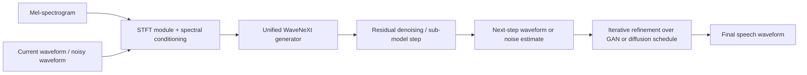
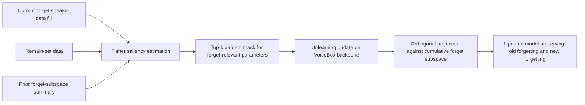
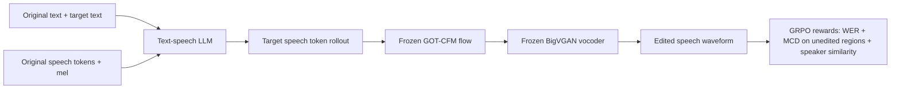
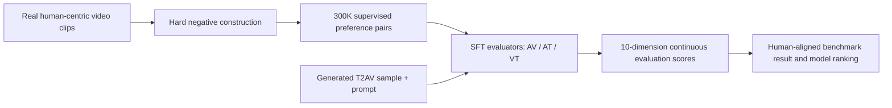
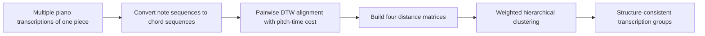

# 语音 / 音频 / 音乐论文速递
## 2026-05-26

> 实际对应 arXiv 更新日：**2026-05-26**  
> 检索范围：`cs.SD + eess.AS`  
> 只放按 ML 顶会审稿口径看，最值得多数读者花时间看的 **5 篇**

## 📋 总览

- 共收录 **5 篇** 相关论文
- 语音生成 / 语音编辑 / 音色安全：**3 篇**
- 音频视频评测 / 多模态基建：**1 篇**
- 音乐理解 / 数据治理：**1 篇**

今天这批最值得看的，不是“谁又把模型做大了”，而是几篇真正碰工程痛点的稿子。`CosyEdit2` 把语音编辑从“靠配对编辑数据硬拟合”推进到 reward-driven 后训练，顺手还把 zero-shot TTS 拉高了一截；`WaveNeXt 2` 则是很实在的声码器工程论文，统一了 GAN 和 diffusion 两条线，重点还放在 CPU 推理和训练成本，不是只卷一张漂亮主观试听图；`CORTIS` 讨论的是更少人认真做的事: 当 voice cloning 模型收到连续删除请求时，怎么在不保留旧用户数据的前提下避免“忘了又学回来”。

剩下两篇也有价值，但受众更聚焦。`AVBench` 对做原生音视频生成评测、数据过滤、reward modeling 的团队很有参考意义，它不是再造一个泛泛 benchmark，而是直接把人类偏好的细粒度评测训练成专用 evaluator；`Score-Agnostic Structure Analysis` 则是音乐数据治理向的工作，没有 flashy 模型，但它解决的是大规模钢琴 AMT 数据最容易被忽略的脏问题: 同一作品不同结构 realization 混在一起时，后续分析和训练都会被带偏。

## 精选入选规则

- **新意（0-3）**：是不是提出了新的表示、训练组织方式、评测接口，或者把老问题拆得更对
- **影响力（0-3）**：是不是贴近语音生成、语音编辑、音色安全、音视频评测、音乐理解这些主线
- **证据强度（0-2）**：有没有像样的 baseline、关键数值、消融和现实约束讨论
- **受众匹配度（0-2）**：对语音大模型 / 语音前端 / 音乐方向 / 多模态评测研究者有没有直接启发

分数校准：

- **6**：能读，但更像局部补丁或偏窄的分析工具
- **7**：信息量够，适合相关方向的人认真过一遍
- **8+**：建议优先精读，里面有能直接借走的方法或判断框架

## 总览表

| 方向 | 序号 | 论文 | 评分 | 关键词 |
|---|---:|---|---:|---|
| 语音生成 / 声码器 | 1 | WaveNeXt 2 | 8/10 | ConvNeXt vocoder, unified GAN-diffusion, residual denoising, CPU inference |
| 音视频生成评测 | 2 | AVBench | 8/10 | human-centric benchmark, specialized evaluator, hard negatives, continuous scoring |
| 语音安全 / 机器遗忘 | 3 | CORTIS | 8.5/10 | speaker unlearning, RTBF, Fisher masking, orthogonal projection |
| 音乐理解 / 数据治理 | 4 | Score-Agnostic Structure Analysis | 7/10 | DTW, hierarchical clustering, AMT cleanup, structure grouping |
| 语音编辑 / Zero-shot TTS | 5 | CosyEdit2 | 8.5/10 | speech editing, GRPO, target-speech-free training, CosyVoice2 |

## 🔊 语音生成 / 语音编辑 / 音色安全

### [1] WaveNeXt 2: ConvNeXt-Based Fast Neural Vocoders With Residual Denoising and Sub-Modeling for GAN and Diffusion Models

- **评分**：8/10
- **作者/机构**：Wangzixi Zhou, Takuma Okamoto, Yamato Ohtani, Sakriani Sakti, Hisashi Kawai；奈良先端科学技术大学院大学、日本信息通信研究机构
- **论文链接**：https://arxiv.org/abs/2605.25506
- **PDF**：https://arxiv.org/pdf/2605.25506.pdf
- **代码链接**：暂无
- **Demo 链接**：https://37integer.github.io/WAVENEXT-2

#### 📌 简介
这篇做的是统一声码器骨干。作者的目标不是再做一个只属于 GAN 或只属于 diffusion 的 vocoder，而是把 `WaveNeXt` 这套 ConvNeXt generator 改造成一个同时适配两条路线的通用生成器，再用 residual denoising 和 sub-modeling 把多说话人场景、CPU 推理速度和训练成本这几件现实问题一起收拾掉。

#### ☠️ 毒舌点评
这不是那种靠“听起来更自然”糊弄过去的声码器稿子，表格里把 `HiFi-GAN`、`WaveFit`、`FastDiff` 都拉进来了，连 CPU RTF 和单卡训练时长都报了，工程味很重。短板也明显: GAN 版为了速度和统一骨干把参数量抬上去了，和 `HiFi-GAN` 比 `log F0 RMSE` 也不是全面占优，所以它更像部署导向的 trade-off 论文，不是绝对质量统治者。

#### 🔧 技术方案
- **模型解决的问题**：传统 fast vocoder 基本分成 GAN 和 diffusion 两摊，各自优化，各自堆技巧。GAN 版推理快但训练重、稳定性差；diffusion 版更稳但 CPU 推理慢。作者想解决的是，能不能用一套 `ConvNeXt` 生成器同时服务两种范式，并把多说话人场景下原始 `WaveNeXt` 的性能短板补掉。
- **模型架构**：
  - **输入**：`mel-spectrogram`，以及当前步骤下的波形或带噪波形经过 STFT 后形成的 `STFT-spec`
  - **输出**：当前时刻的噪声分量或去噪后的波形，最终生成语音 waveform
  - **主干**：统一的 `WaveNeXt-based generator + STFT module`
  - **关键模块**：
    - `ConvNeXt-based residual denoising`
    - `sub-modeling`，把不同噪声范围拆给不同子模型
    - GAN 侧使用 `fixed-point iteration`
    - diffusion 侧使用 `BDDM` 风格 noise schedule predictor
- **信号流**：

- **关键设计 / 核心创新**：
  - 把原始 `WaveNeXt` 从“只在 GAN 里用得顺手”的 generator，改造成 `GAN + diffusion` 都能用的统一骨干。
  - GAN 侧不再照搬 `WaveFit` 的初始噪声和 gain adjustment，而是做了更简化的 fixed-point denoising。
  - diffusion 侧把 4 个 noise range 拆成 4 个 sub-model，并加了 time-invariant spectral enhancement post-filter，专门补低步数下容易掉的高频细节。
- **训练 / 推理策略**：
  - 数据使用 `LibriTTS-R`，约 `585 小时`，24 kHz，多说话人英文朗读语音。
  - GAN 版沿用 `WaveFit` 的判别器和 loss 定义，保证 adversarial training 不乱飘。
  - diffusion 版训练 4 个子模型，对应 4 段噪声区间；4-step noise schedule 为 `[1.0e-04, 2.8e-02, 5.6e-01, 9.1e-01]`。
  - 推理同时报告 `A100 GPU` 和 `AMD EPYC 7542 CPU` 上的 `RTF`，这点很关键，因为很多声码器只敢报 GPU。

#### 📊 实验结果
- 数据集与测试集：`LibriTTS-R test-clean-100` 的 `4,824` 条样本，另有 `20` 条样本做主观 MOS，`20` 位英语母语听者参加测试。
- baseline 对比：`HiFi-GAN V1`、`WaveFit`、原始 `WaveNeXt`、`FastDiff`
- GAN 路线最关键的数值：
  - `GAN-WaveNeXt 2 (4 iterations)`：`RTF(GPU)=0.0066`，`RTF(CPU)=0.20`，`NISQA=4.01`，`UTMOS=4.04`，`MCD=0.95`
  - 对比 `WaveFit (4 iterations)`：`0.0213 / 4.28 / 3.97 / 3.99 / 1.01`
  - 对比 `HiFi-GAN V1`：`0.0110 / 0.80 / 3.99 / 4.05 / 2.34`
  - 也就是说，GAN 版在主观预测质量基本打平 `WaveFit / HiFi-GAN` 的前提下，把 CPU RTF 压到了 `0.20`，明显更适合部署。
- diffusion 路线最关键的数值：
  - `Diff-WaveNeXt 2`：`RTF(GPU)=0.0164`，`RTF(CPU)=0.16`，`NISQA=3.81`，`UTMOS=3.87`，`MCD=4.16`，`log F0 RMSE=0.12`
  - 对比 `FastDiff w/ sub-model`：`0.0282 / 0.80 / 3.67 / 3.78 / 4.32 / 0.24`
  - 对比 `Diff-WaveNeXt 2 wo/ sub-model`：`MCD 7.34`，说明 sub-modeling 不是点缀，而是真正决定 diffusion 版能不能用的核心。
- 训练成本：
  - `Diff-WaveNeXt 2` 训练仅 `32 小时`
  - `FastDiff` 为 `96 小时`
  - `GAN-WaveNeXt 2` 和 `WaveFit` 都在 `410 小时`
- 局限：
  - GAN 版模型尺寸会随 sub-model 数增加到 `59.94M`，明显高于 `WaveFit 15.51M`
  - 与 `HiFi-GAN` 相比，`log F0 RMSE` 不是全面占优，说明 pitch/prosody 维度没有神奇逆天

#### 💡 为什么值得看
如果你做语音合成部署，这篇比“某个大模型 TTS 又涨了 0.1 MOS”更有现实价值。它回答的是一个很具体的问题: 在 `CPU 推理速度`、`多说话人稳健性`、`训练成本` 都要顾的情况下，声码器架构怎么统一、怎么取舍。这个问题不 glamorous，但确实是生产链路里的硬骨头。

#### 评分：8/10
理由：工程价值很高，实验也老实，尤其是 CPU RTF 和训练时长这两项非常加分。扣分点是 GAN 版参数膨胀明显，而且它更像强部署方案，不是绝对音质新 SOTA。

### [3] Continual Speaker Identity Unlearning with Minimal Interference

- **评分**：8.5/10
- **作者/机构**：Jinju Kim, Yunsung Kang, Gyeong-Moon Park, Jong Hwan Ko；成均馆大学、高丽大学
- **论文链接**：https://arxiv.org/abs/2605.25962
- **PDF**：https://arxiv.org/pdf/2605.25962.pdf
- **代码链接**：暂无
- **Demo 链接**：https://cumulativeortis.github.io/

#### 📌 简介
这篇讨论的是 voice cloning 时代很少有人真正认真处理的合规问题: 用户要求“忘掉我的声音”时，系统往往不是只处理一次删除请求，而是会不断收到新的 sequential requests。现有 speaker unlearning 方法大多默认所有待删除说话人一次性给齐，这在部署里根本不成立。作者提出的 `CORTIS` 目标很明确: 不保留旧 forget speaker 数据，也能在后续删除请求到来时维持之前的遗忘状态。

#### ☠️ 毒舌点评
这篇不是靠伦理口号刷存在感，它把 failure mode 说得很具体: 旧方法不是“忘得不够彻底”，而是处理新请求时会把之前删掉的 speaker 又学回来。这个问题一旦成立，前面的合规叙事就全塌了。方法上也不是拍脑袋加个 regularizer，而是把 `Fisher masking + orthogonal projection` 组合起来，证据比很多 AI safety 文章硬得多。

#### 🔧 技术方案
- **模型解决的问题**：零样本文本转语音模型的 speaker unlearning 往往只考虑 one-shot forget set，但真实系统里的删除请求是连续到来的。若简单把旧方法顺序重复应用，新 speaker 的 unlearning 会破坏旧 speaker 的遗忘结果，作者把这个现象叫做 `catastrophic re-learning`。
- **模型架构**：
  - **输入**：当前 forget speaker `f_i` 的语音数据、remain set 数据、上一轮模型参数 `θ_{i-1}`
  - **输出**：新一轮完成 unlearning 的 TTS 模型参数 `θ_i`
  - **主干**：基于 `VoiceBox` 的 continual speaker identity unlearning framework
  - **关键模块**：
    - `Contrastive Parameter Localization`
    - `Fisher-information-based parameter mask`
    - `Orthogonal Projection on Cumulative Forget Subspace`
    - 固定秩 merged basis 用于控制持续增长的投影开销
- **信号流**：

- **关键设计 / 核心创新**：
  - `saliency_i = F_fi / max(F_Ri, F_f1 ... F_f{i-1})` 这一步很关键，本质是在参数层面找“现在该改、但过去不能再碰”的区域。
  - 对每一轮 unlearning 结束后抽取 rank-`R` 的梯度子空间表示，再用能量加权的 merged basis 构造累计 forget subspace，避免投影成本无限涨。
  - 整个框架不需要访问以前已经删掉的用户数据，这点才真正符合 RTBF 场景。
- **训练 / 推理策略**：
  - backbone 用 `VoiceBox`，`24` 层 transformer。
  - 预训练语料使用 `LibriHeavy`；forget speakers 继承 prior work 的筛选集合，每人约 `20 分钟` 音频。
  - 实验按顺序处理 forget requests，例如 `1166 -> 7199 -> 3912 -> 9437 -> 8866`。
  - 每次更新后只保留子空间摘要，不保留旧 forget 数据；投影操作在 trainable mask 内进行，减少无关参数被连坐。

#### 📊 实验结果
- baseline 对比：`SGU`、`TGU`、`UN (Update Normalization)`、`SelFT`
- 评测指标：
  - `W-R`：remain set 上的 WER
  - `W-F`：forget set 平均 WER
  - `S-R`：remain speaker similarity
  - `S-fi`：第 `i` 个 forget speaker 的 similarity
  - 判定阈值：`S-R >= 0.46` 视为 retain 成功，`S-fi < 0.32` 视为 forget 成功
- 三次 sequential request 后的主结果：
  - `CORTIS`：`W-R=2.8`，`W-F=2.6`，`S-R=0.557`，`S-f1=0.172`，`S-f2=0.148`，`S-f3=0.124`
  - 这是表里唯一一条同时满足“retain 没塌”和“所有已忘 speaker 都没回魂”的方法。
- 最具杀伤力的对比：
  - `TGU` 在 Request 1 时 `S-f1=0.164`，看起来忘得不错
  - 但到 Request 2，`S-f1` 直接反弹到 `0.612`
  - 到 Request 3 仍有 `0.603`
  - 这就是作者强调的 `catastrophic re-learning`，不是轻微退化，是直接把旧 speaker 学回来了。
- `SGU` 的问题相反：
  - forget speaker 维持得住，但 `S-R` 从 `0.479` 一路掉到 `0.315`
  - 说明 retain utility 被持续蚕食，模型越来越不像正常 TTS
- 五次 sequential request 的摘要结论：
  - 论文摘要给出的结论是，`CORTIS` 在 `5` 次请求后仍把每个 forget speaker similarity 压到 `0.18` 以下
  - 相比预训练 baseline，平均下降约 `75%`
- 额外代价：
  - 文中说明累计子空间投影会增加训练开销，但采用 fixed-rank merged basis 后成本可控
  - 这不是“零成本安全”，而是付出少量训练复杂度换真正可部署的遗忘稳定性

#### 💡 为什么值得看
如果你关心 voice cloning 的隐私、版权、合规，这篇是少见真正把系统约束想清楚的文章。它不是泛泛讲“要可解释要安全”，而是直接把 sequential deletion 这个现实场景 formalize 出来，再证明旧方法为什么在这个场景下会失效。对做 speaker adaptation、voice rights management、模型删除机制的人，这篇值得优先精读。

#### 评分：8.5/10
理由：问题很真，failure mode 很准，方法设计也克制有效。扣分点是目前验证仍集中在 `VoiceBox + Libri*` 体系，跨 backbone、跨语言的外推还要后续工作补。

### [5] CosyEdit2: Speech-Editing-Oriented Reinforcement Learning Unlocks Better Zero-Shot TTS

- **评分**：8.5/10
- **作者/机构**：Junyang Chen, Yuhang Jia, Hui Wang, Jiaming Zhou, Yongchang Gan, Yong Qin；南开大学计算机学院、人工智能学院
- **论文链接**：https://arxiv.org/abs/2605.25930
- **PDF**：https://arxiv.org/pdf/2605.25930.pdf
- **代码链接**：暂无
- **Demo 链接**：https://cjy1018.github.io/CosyEdit2

#### 📌 简介
这篇是今天最像“真能往生产里带东西”的稿子之一。作者从 `CosyVoice2` 出发，把 speech editing 看成一个比 zero-shot TTS 约束更强的任务: 不只是说得像，还要在未编辑区域、边界自然度、环境一致性上尽量不露痕迹。`CosyEdit2` 的核心不是再做一版 SFT，而是把 speech editing 的后训练切成两阶段: 先用监督数据把能力点亮，再用 editing-oriented `GRPO` 在没有 target speech 的条件下把局部编辑行为拉实。

#### ☠️ 毒舌点评
这篇最难得的地方，是它没有停在“RL for speech 很潮”这种空话上。奖励设计里明确区分了编辑内容是否正确、未编辑区域是否被破坏、speaker 是否还在，实验也直接承认 `deletion` 比 insertion / substitution 难，不装。真要挑刺，就是它仍然 heavily 依赖 `CosyVoice2` 的原有能力，创新更偏后训练范式和 reward 组织，而不是从骨干上另起炉灶。

#### 🔧 技术方案
- **模型解决的问题**：单纯依赖 paired editing data 的 SFT 会把配对数据里的边界不准、录音条件不一致、局部监督粗糙这些问题直接学进模型，导致 speech editing 老是在“改对内容”和“保住原声上下文”之间拉扯。作者想解决的是，能不能在不依赖人工构造 target speech 的前提下，用 reward 驱动的训练把编辑行为再往上提一档。
- **模型架构**：
  - **输入**：原始文本、目标文本、原始语音，以及对应的 text / speech token
  - **输出**：目标编辑后的语音 token，再经 Flow 和 vocoder 解码成 waveform
  - **主干**：`CosyVoice2` 风格的 `text-speech LLM + GOT-CFM Flow + BigVGAN`
  - **关键模块**：
    - 双文本 tokenizer 与 speech tokenizer
    - `GOT-CFM` 条件流模型
    - 为 editing 重新训练的 `BigVGAN`
    - 仅更新 LLM 的 `editing-oriented GRPO`
- **信号流**：

- **关键设计 / 核心创新**：
  - 用 `TTS-to-Edit Prompt Construction` 把普通 `speech + transcription` 语料自动转成 editing prompt，不再要求人工录制目标编辑语音。
  - reward 不是只看 `WER` 或只看 speaker similarity，而是先把 `WER` 和未编辑区域的 `DTW-aligned MCD` 乘性组合成 `r_wer-mcd`，再和 speaker reward 做加权，先保编辑正确，再保上下文不裂。
  - Stage 2 的 GRPO 只更新 LLM，`Flow` 和 `BigVGAN` 冻结，这样训练成本相对可控，也更容易把改进定位到 token generation 行为。
- **训练 / 推理策略**：
  - Stage 1：在 `250 小时` 的 `GigaEdit` 上做 supervised adaptation，点亮基础 editing 能力。
  - vocoder：单独训练 `BigVGAN`，使用约 `625 小时` 干净与 in-the-wild mel 混合数据，增强复杂录音条件下的重建鲁棒性。
  - Stage 2：GRPO 初始化自 Stage 1 checkpoint，优化 `380 steps`，每个 prompt 采样 `G=4` 个 rollout。
  - reward 超参包括 `k_w=12`、`α=1.5`、`k_m=0.2`、`δ=2`、`γ=0.5`。
  - reward 权重调度：
    - 前 `290` steps：`(λ_c, λ_s) = (0.9, 0.1)`，优先保证内容和保真
    - 后 `90` steps：`(0.8, 0.2)`，再抬 speaker consistency
  - 训练资源：`2` 张 `NVIDIA H800`

#### 📊 实验结果
- 英文 `Ming-Freeform-Audio-Edit`：
  - baseline 对比：`VoiceCraft-X`、`SSR-Speech`、`Ming-UniAudio`
  - `Insertion`：
    - `CosyEdit2`：`WER 1.90 | 1.93`，`SS 0.93 | 0.93`，`MAE 0.107 | 0.108`
    - `SSR-Speech`：`2.03` 的 full WER，`0.94` 的 SS，`0.128` 的 MAE
    - `VoiceCraft-X`：`6.27` 的 full WER，`0.84` 的 SS
  - `Deletion`：
    - `CosyEdit2`：`5.52 | 5.83`，`0.90 | 0.90`，`0.131 | 0.131`
    - `SSR-Speech`：`5.22 | 5.29`，`0.91 | 0.91`
    - 这里它没有全面碾压 `SSR-Speech`，但已经明显强过 `VoiceCraft-X 10.65` 和 `Ming-UniAudio 24.37`
  - `Substitution`：
    - `CosyEdit2`：`1.43 | 1.52`，`0.89 | 0.90`，`0.137 | 0.132`
    - `SSR-Speech`：`1.90 | 1.95`
    - 这是它最亮眼的一项
- `RealEdit` 真实环境编辑基准（`310` 条，含背景噪声和音乐）：
  - `CosyEdit2`：`WER 4.31`，`SS 97.91`，`MCD 3.93`，`MOSNet 3.21`，`MAE 0.25`
  - `CosyEdit`：`WER 4.50`，`SS 97.34`，`MCD 4.94`
  - `SSR-Speech`：`WER 5.05`，`SS 98.31`
  - `Ming-UniAudio`：`WER 9.98`，`SS 96.70`，`MCD 5.36`
  - 这里最关键的是 `MCD 4.94 -> 3.93`，说明它不是只把字改对，而是把未编辑区域保得更像原始录音。
- zero-shot TTS 迁移收益：
  - `SEED-TTS-EVAL`
  - `test-zh`：`CER 1.16`，对比同骨干 `CosyVoice2 1.36`
  - `test-en`：`WER 1.95`，对比 `CosyVoice2 3.10`
  - speaker similarity 基本持平，说明 editing-oriented GRPO 没把普通 TTS 反向练坏。
- 局限：
  - 删除任务依然最难，面对最强 cascaded baseline 时没有做到全线压制
  - 论文的主要创新在 post-training 和 reward 设计，骨干能力上限仍继承自 `CosyVoice2`

#### 💡 为什么值得看
这篇值得看的不是“RL 也能做语音”，而是它终于把 speech editing 的 reward 目标说清楚了。很多文章只盯着生成段文本对不对，却默认未编辑区域自然就会保住。`CosyEdit2` 明确把 preservation 拉进训练目标，而且用真实 benchmark 证明这种目标设计还能反哺 zero-shot TTS。对做语音编辑、可控 TTS、后训练对齐的人，这篇非常值得跟。

#### 评分：8.5/10
理由：任务理解准确，reward 设计有针对性，实验也不虚。扣分点是方法仍建立在强骨干之上，而且 deletion 这类最棘手场景还没真正统治。

## 🎬 音视频生成评测 / 多模态基建

### [2] AVBench: Human-Aligned and Automated Evaluation Benchmark for Audio-Video Generative Models

- **评分**：8/10
- **作者/机构**：Jialiang Yang, Bin Xia, Ruihang Chu, Dingdong Wang, Wanke Xia, Zhun Mou, Tianyang Zhong, Yiting Zhao, Wenming Yang；清华大学、香港中文大学
- **论文链接**：https://arxiv.org/abs/2605.24652
- **PDF**：https://arxiv.org/pdf/2605.24652.pdf
- **代码链接**：暂无明确开源
- **Demo 链接**：https://yajialiang.github.io/AVBench-site/

#### 📌 简介
这篇不是直接做生成模型，而是做原生音视频生成的评测基建。作者认为现有 benchmark 的问题很明显：要么只看单模态视频质量，要么拿没专门训过的通用 MLLM 做离散打分，对人物说话、情绪、口型、语义一致性这类人类最敏感的细节几乎抓不住。`AVBench` 想做的是一套 fully automated、human-aligned、还能输出连续分数的音视频评测框架。

#### ☠️ 毒舌点评
评测 benchmark 很容易水成“列十个指标，换个表名”，但这篇至少有两点不是虚活。第一，它真做了大量 hard negative 构造，不是直接搬 CLAP / ImageBind / Qwen 当 judge；第二，它拿人类偏好相关性和 instance-level 准确率去打 generic evaluator 的脸，证据够直接。问题在于，它更偏原生 `T2AV` 赛道，离传统语音任务还是有点距离，如果你不做音视频联合生成，这篇不是今天的第一优先级。

#### 🔧 技术方案
- **模型解决的问题**：原生音视频生成的评测长期处在“视频美学一个分、音频质量一个分、同步再凑一个分”的粗糙阶段，尤其在人类相关场景里，声音、口型、动作、情绪、文本语义经常互相打架。作者要解决的是，如何做一套对 human-centric 场景更敏感、可自动化运行、且对人类偏好更对齐的评测系统。
- **模型架构**：
  - **输入**：生成的音视频样本、文本 prompt，以及由真实视频构造出的正负样本对
  - **输出**：10 个维度上的连续评测分数，以及 pairwise preference 风格的比较结果
  - **主干**：`specialized SFT evaluators + human-centric evaluation suite`
  - **关键模块**：
    - `AV / AT / VT` 三个专用 consistency evaluator
    - `Normal / Hard` 双层测试集
    - 10 维评测体系：包括 `AV consistency`、`AT consistency`、`VT consistency`、`Lip Sync`、`Speech Content`、`Speech Realism`、`Audio Quality`、`Audio Aesthetics`、`Video Quality`、`Video Aesthetics`
    - 连续打分机制：用 `Yes / No` 二分类概率归一化得到连续 score
- **信号流**：

- **关键设计 / 核心创新**：
  - 从 `30K` 条高质量 human-centric 真实视频出发，扩展成每个 consistency 维度 `100K` 训练对，总计 `300K` 条监督样本。
  - hard negative 不只是粗暴打乱，而是包含亚秒级时移、情绪不匹配、LLM 驱动的语义变异等细粒度错误。
  - evaluator 不是 zero-shot judge，而是对 `Qwen2.5-Omni / Qwen2-Audio` 做专门 SFT，让模型学会真正区分微妙错位，而不是永远给“看起来还行”的正分。
- **训练 / 推理策略**：
  - `VT` 与 `AV` evaluator 基于 `Qwen2.5-Omni`，`AT` evaluator 基于 `Qwen2-Audio`。
  - 每个 consistency evaluator 用 `100K` 精选正负样本训练。
  - 评测阶段采用 `Normal` 和 `Hard` 两个子集，后者强调复杂情绪、多人互动、细粒度错位。
  - 输出不是离散文字判断，而是连续概率分数，方便后续做数据过滤和 RLHF reward。

#### 📊 实验结果
- 对比模型：`Sora 2`、`Veo 3 Fast`、`Wan 2.6`、`Kling 2.6`、`Seedance 1.5 Pro`
- `AVBench` 本身揭示出的模型格局很有意思：
  - `Wan 2.6` 的 `Speech Content` 最强：`91.5568`（Normal）与 `84.4512`（Hard）
  - `Kling 2.6` 的 `Lip Sync` 最强：`8.1027`（Normal）与 `3.9844`（Hard）
  - `Seedance 1.5 Pro` 在 `NISQA` 和 `Audiobox` 等音频质量维度非常强：`3.6411 / 4.1686`（Normal）
  - `Sora 2` 在 `AV consistency` 上达到 `0.8713`（Normal）与 `0.9320`（Hard），更像综合均衡型
  - 这说明当前 T2AV 模型仍然严重解耦：有人语义准，有人口型强，有人声音好看，但很少全都稳。
- evaluator 的 hard-negative 检测准确率：
  - `Audio-Text`：`AVBench 0.8437`，对比 `CLAP 0.4888`、`Qwen2-Audio 0.2500`
  - `Video-Text`：`AVBench 0.9144`，对比 `ViCLIP 0.5494`、`Qwen2.5-Omni 0.4891`
  - `Audio-Video`：`AVBench 0.9817`，对比 `ImageBind 0.4991`、`Qwen2.5-Omni 0.3606`
  - 这基本是在说：不用专门训练，通用 judge 对细粒度错配几乎就是瞎的。
- 与人类偏好的相关性：
  - `AT consistency ρ=0.9488`
  - `VT consistency ρ=0.9653`
  - `Speech Content ρ=0.9779`
  - `DF-Arena Bonafide ρ=0.9668`
  - `NISQA MOS ρ=0.8012`
- instance-level human preference prediction：
  - 平均准确率 `85.4%`
  - `Speech Content` 最高可到 `98.1%`
- 局限：
  - 评测重点偏 human-centric T2AV，不直接覆盖更广泛的环境音频生成或纯语音任务
  - 目前还没看到成熟公开代码仓库，短期复现门槛不算低

#### 💡 为什么值得看
如果你做音视频生成、数据过滤或者 evaluator-as-reward，这篇比“再测一堆 CLAP 分数”更值得花时间。它真正有用的点是：把 human-centric 场景里那些最容易翻车的细节变成了可以自动训练、自动打分、还能和人类偏好对齐的评测器。这对后续做筛数、偏好优化、模型迭代都有直接意义。

#### 评分：8/10
理由：评测问题抓得准，hard-negative 设计和 human alignment 证据都够强。扣分点是赛道偏原生 T2AV，通用语音研究者的直接受益面没那么宽。

## 🎼 音乐理解 / 数据治理

### [4] Score-Agnostic Structure Analysis in Large-Scale Performance Datasets

- **评分**：7/10
- **作者/机构**：Patricia Hu, Silvan D. Peter, Gerhard Widmer；约翰内斯开普勒大学林茨分校、LIT AI Lab
- **论文链接**：https://arxiv.org/abs/2605.25951
- **PDF**：https://arxiv.org/pdf/2605.25951.pdf
- **代码链接**：**代码已开源** https://github.com/huispaty/score-agnostic-structuring
- **Demo 链接**：https://github.com/CPJKU/mpteval

#### 📌 简介
这篇不做大模型，也不做生成，而是解决大规模钢琴 performance 数据集里一个很容易把下游研究带偏的问题：同一首作品的不同演绎版本，经常存在 repeat pattern、版本结构、AMT 错转录等差异。如果这些 transcription 没先按结构 realization 分好组，后面的 performance analysis、风格建模甚至生成训练都会被噪声拖垮。作者提出的是一种不依赖 score 的结构分析与聚类方法。

#### ☠️ 毒舌点评
这种论文最容易被嫌“没模型、不够大”，但做过真实音乐数据的人都知道，这类脏活没人干，后面所有 fancy model 都是在烂地基上起楼。它的确不性感，实验规模也没有 foundation model 级别震撼，但问题选得很实。缺点是它的收益主要体现在数据清洗和分析可靠性上，对想直接拿来做生成 SOTA 的人刺激没那么强。

#### 🔧 技术方案
- **模型解决的问题**：大规模钢琴 AMT 数据集往往只有自动转录，没有干净的 score 对齐，也没有标好结构 realization。结果是同一作品不同结构版本会被当成一类样本混着用，导致 performance comparison 与统计分析失真。作者要解决的是，如何在没有 score 的前提下，自动把这些 transcription 按结构分组。
- **模型架构**：
  - **输入**：同一作品的多条 piano transcription note sequence
  - **输出**：按结构 realization 聚好的 transcription clusters
  - **主干**：`sequence-to-sequence alignment + hierarchical clustering`
  - **关键模块**：
    - chord sequence conversion
    - `Dynamic Time Warping`
    - 自定义 pitch-time 距离函数
    - 4 个 distance matrices 的加权层次聚类
- **信号流**：

- **关键设计 / 核心创新**：
  - 先把 note 序列按 `τ_IOI` 与 `τ_chord` 两个阈值转成 chordwise representation，再做 pairwise DTW，对 performance 数据比直接在原始 note 流上硬比更稳。
  - 距离函数不是纯 pitch，也不是纯 time，而是 `cost = α * Jaccard(pitch classes) + (1-α) * normalized onset difference`。
  - 聚类不是只看 alignment cost，而是同时看：
    - normalized alignment cost
    - stretch relative to optimal path
    - stretch relative to mean sequence length
    - sequence length ratio
  - 这套设计的本质，是把“结构不同”和“只是演绎速度不同”尽量分开。
- **训练 / 推理策略**：
  - 这不是监督训练模型，核心是 pipeline 参数搜索与聚类评估。
  - 作者在 `77 / 88` 个作品、共 `1,220` 条转录上做 grid search，搜索 distance matrix 权重、cluster method 与 threshold。
  - 最终在 `11` 个作品、`296` 条人工修正结构标签的转录上评估。
  - 评估指标用 `homogeneity`、`completeness`、`V-Measure`，优先追求 homogeneity，避免一个 cluster 混进多个结构 realization。

#### 📊 实验结果
- 数据来源与 baseline 对象：`ATEPP` 为主，并讨论了 `ASAP`、`GiantMIDI-Piano` 等大规模自动转录钢琴数据的现实问题。
- 关键数值：
  - grid search 运行在 `77` 个作品、`1,220` 条转录上
  - 人工校正后的正式评估集为 `11` 个作品、`296` 条转录
  - 最终达到平均 `homogeneity = 96.39%`
- baseline / 对比逻辑：
  - 不是和某个大模型 baseline 比 WER，而是和 score-dependent repeat identification 的估计结果做结构分组近似对照
  - 作者指出 score-agnostic 方法在面对自动转录错误、版本差异时更稳，不需要先拿到可靠 score
- 质性分析：
  - 论文给了 KV 331 片段的 distance matrices 和 dendrogram，可直观看到不同结构 realization 如何被逐步分开
  - 作者特别强调 alignment cost 与相对最优路径的 stretch 对 cluster homogeneity 更重要，说明“只是长短不同”和“结构根本不同”需要分层处理
- 局限：
  - 目前 demonstration 主要在钢琴独奏数据
  - 还不是完整 end-to-end 数据清洗系统，对更复杂编制、多乐器场景仍要额外扩展

#### 💡 为什么值得看
如果你碰过大规模音乐数据，这篇的价值非常直接：先把结构脏样本分开，后面模型分析才不至于建立在错配样本上。它不提供一个新生成器，但提供了一套相当实用的数据治理视角。对做 piano performance modeling、符号音乐理解、AMT 后处理的人，这篇比很多大词堆满的模型文章更值得收藏。

#### 评分：7/10
理由：问题选得好，方法清楚，代码也开了。扣分点是赛道较窄，主要价值在数据治理，不会对泛语音研究者形成普适冲击。

## 最后结论

如果只让我排今天最值得优先看的 3 篇，会是：

1. **CosyEdit2**  
   这是今天最完整的一篇语音生成后训练论文。它把 speech editing 真正需要优化的目标拆开了，而且结果不是只体现在编辑任务上，还反哺了 zero-shot TTS。
2. **Continual Speaker Identity Unlearning with Minimal Interference**  
   如果你关心 voice cloning 的合规和删除机制，这篇几乎是今天最硬的系统论文。它把 sequential unlearning 的坑挖出来，又给了一个不依赖旧数据的修法。
3. **WaveNeXt 2**  
   对声码器和部署链路来说很有参考价值，尤其是你在意 CPU 速度、训练时长、GAN 与 diffusion 的统一设计时。

`AVBench` 更适合做原生音视频生成评测、reward 建模和数据过滤的团队；`Score-Agnostic Structure Analysis` 则是音乐数据治理向的好工具，受众不算大，但对真正要用大规模 performance 数据的人很有用。
