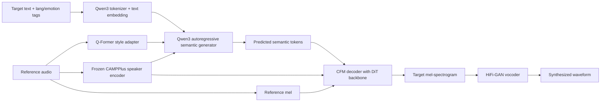
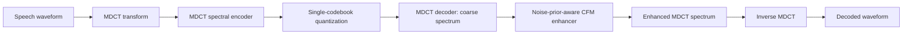
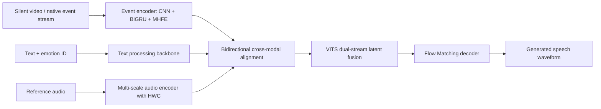
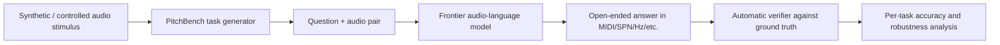
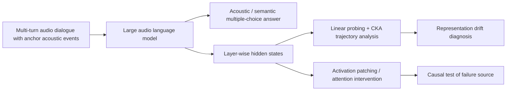

# 语音 / 音频 / 音乐论文速递
## 2026-05-27

> 实际对应 arXiv 更新日：**2026-05-27**  
> 检索范围：`cs.SD + eess.AS`  
> 只放按 ML 顶会审稿口径看，最值得多数读者花时间看的 **5 篇**

## 📋 总览

- 共收录 **5 篇** 相关论文
- 语音生成 / 多模态语音：**2 篇**
- 语音 codec / 语音前端：**1 篇**
- 音乐理解 / 音频评测：**1 篇**
- 语音大模型分析：**1 篇**

今天这批最值得看的，不是“谁又把参数堆大了”，而是三条更实的主线。`PilotTTS` 代表的是一条很现实的工程路线：不用几百万小时私有数据，也能把 zero-shot TTS、情感、拟声和方言控制做得很能打；`CFMDCTCodec` 则是在低码率 speech codec 里把 MDCT 域建模和 flow matching 真正焊在一起，0.65 kbps 这种几乎没法听的区间还能拉回可用质量；`EventSpeech` 虽然题目有点像“新传感器换个壳”，但它至少拿出真实事件相机数据和对 RGB 高频运动模糊的系统性反击，不只是摆概念。剩下两篇里，`PitchBench` 很适合给一堆“懂音乐的 ALM”泼冷水，`EnvMem` 则把音频大模型多轮记忆失效这件事拆到了表示层，而不是继续怪 attention。

## 精选入选规则

- **新意（0-3）**：是不是提出了新的表示、接口、训练组织方式，或者把旧问题拆得更对
- **影响力（0-3）**：是不是贴近语音大模型、TTS、codec、音乐理解、音频前端这些主线
- **证据强度（0-2）**：有没有像样的 baseline、消融和关键数值
- **受众匹配度（0-2）**：对语音大模型 / 语音前端 / TTS / 音乐方向研究者有没有直接启发

分数校准：

- **6**：可读，但更像局部补丁或评测材料
- **7**：信息量够，值得过一遍
- **8+**：建议优先精读

## 总览表

| 方向 | 序号 | 论文 | 评分 | 关键词 |
|---|---:|---|---:|---|
| 语音生成 / 多模态语音 | 1 | PilotTTS | 8.5/10 | autoregressive TTS, Q-Former, decoupled conditioning, zero-shot cloning |
| 语音 codec / 低码率 | 2 | CFMDCTCodec | 8/10 | MDCT codec, conditional flow matching, low bitrate, spectral enhancer |
| 语音生成 / 事件视觉 | 3 | EventSpeech | 8/10 | event camera, expressive speech generation, audio-visual alignment, EVT-SPK |
| 音乐理解 / 音频评测 | 4 | PitchBench | 7.5/10 | ALM evaluation, pitch hearing, music understanding, open-ended benchmark |
| 语音大模型分析 | 5 | EnvMem | 7.5/10 | long-context LALM, acoustic memory, representation drift, activation patching |

## 🗣️ 语音生成 / 多模态语音

### [1] PilotTTS: A Disciplined Modular Recipe for Competitive Speech Synthesis

- **评分**：8.5/10
- **作者/机构**：Bowen Li, Shaotong Guo, Zhen Wang, Yang Xiang, Mingli Jin, Yihang Lin, Jiahui Zhao, Weibo Xiong 等；Amap, Alibaba Group，The Chinese University of Hong Kong, Shenzhen
- **论文链接**：https://arxiv.org/abs/2605.27258
- **PDF**：https://arxiv.org/pdf/2605.27258.pdf
- **代码链接**：**代码已开源** https://github.com/AMAPVOICE/PilotTTS
- **Demo 链接**：暂无单独 demo，论文公开了权重与代码

#### 📌 简介
这篇的核心不是“又发明了一个 TTS 新范式”，而是把一堆成熟开源模块重新组织成一条相对克制、可复现、但结果仍然够硬的零样本 TTS 路线。作者用约 `200K` 小时数据、Q-Former 条件器、Qwen3 自回归语义预测和 CFM+DiT 声学解码，做出了同时支持 voice cloning、情感、拟声和中文方言控制的统一系统。

#### ☠️ 毒舌点评
这篇最大的优点就是不装。它明确承认自己靠的是“严肃数据工程 + 模块拼装”而不是颠覆性模型创新，但结果却比很多号称 foundation TTS 的大工程更能打。缺点也很明显：single-codebook tokenizer、mel + vocoder 解码链路都还是旧世界框架，所以它更像一篇强工程报告，而不是下一代语音生成范式。

#### 🔧 技术方案
- **模型解决的问题**：在资源没那么离谱的前提下，怎么把 zero-shot TTS 做到可用，同时别把情感、拟声、方言这些控制能力拆成三四套系统。作者要补的是“中等资源团队如何造出强零样本 TTS”的工程缺口。
- **模型架构**：
  - **输入**：目标文本、语言标签、情感标签、参考语音。
  - **输出**：目标说话人音色下的语音波形。
  - **主干**：`speech tokenizer + autoregressive text-to-semantic + CFM decoder + HiFi-GAN vocoder`。
  - **关键模块**：
    - `CosyVoice 3` 的 `FSQ` 单码本 speech tokenizer，25 Hz 产生离散 semantic token。
    - 基于 `Qwen3` 的自回归 text-to-semantic 模块。
    - `Q-Former` 风格的 `Semantic Content Adapter`，从参考语音里提 style condition token。
    - 冻结的 `CAMPPlus` 说话人编码器，抽全局 speaker embedding。
    - `Conditional Flow Matching` + `DiT` 声学解码器，把 semantic code 解成 mel，再经 `HiFi-GAN` 出波形。
- **信号流**：

- **关键设计 / 核心创新**：
  - 把 speaker identity 和 dynamic style 拆成两路：`CAMPPlus` 管静态音色，`Q-Former` 管风格与韵律。
  - 用 cross-sample paired training，让参考音频来自同 speaker 的另一条语音，逼模型别偷抄内容。
  - 方言能力不是靠神秘大模型涌现，而是用 Mandarin-dialect paired construction 和 mixed-prompt sampling 硬做数据组织。
- **训练 / 推理策略**：
  - 预训练数据约 `200,000` 小时，中英双语，全部经开源流程做质量评估、标注和过滤。
  - 语义 tokenizer 直接复用 `CosyVoice 3` 的预训练模块，不再额外改造。
  - 情感控制用约 `2,200` 小时情感标注数据后训练；方言微调用约 `16,000` 小时方言数据；拟声数据约 `200` 小时。
  - 推理时文本经 `Qwen3` 自回归生成 semantic token，再通过 `CFM` `10-step` 迭代解码 mel，最后 vocoder 出音频。
  - 推理性能文中没给完整 latency/RTF，但至少给了固定 10-step CFM 设计，说明速度意识不是零。

#### 📊 实验结果
- 零样本 TTS 基准：`Seed-TTS Eval`
  - `PilotTTS` 在 `test-zh` 上做到 `CER 0.87% / SIM 0.862`，在 `test-en` 上做到 `WER 1.50% / SIM 0.815`。
  - 对比 `Seed-TTS`：`1.12 / 0.796 / 2.25 / 0.762`；对比 `F5-TTS`：`1.56 / 0.741 / 1.83 / 0.647`；对比 `CosyVoice-3-0.5B`：`1.16 / 0.780 / 2.02 / 0.718`。
  - 中文 CER 仅略逊于 `MiniMax-Speech 0.83%`，但 speaker similarity 明显更高。
- 情感控制：
  - 主情感平均成功率 `88.1%`，高于 `CosyVoice 3` 的 `83.8%`。
  - 全部 11 类情感平均 `85.7%`，高于 `Fish-Speech S2 60.2%`，也高于 `VoxCPM 31.9%`。
  - 情感控制前后 speaker similarity：`0.8101 -> 0.7329`，仍高于 `CosyVoice3 0.7963 -> 0.6940`。
- 拟声与方言：
  - 拟声三项平均成功率 `85.1%`，高于 `CosyVoice 3 80.4%` 和 `Fish-Speech S2 64.3%`。
  - `LAUGH` 达到 `97.6%`，明显超过 `CosyVoice 3` 的 `83.3%`。
  - 方言控制准确率：`Same-Dialect 91.80%`，`Mandarin-to-Dialect 86.46%`，`Cross-Dialect 85.38%`。
- 消融：
  - 去掉 `Q-Former condition tokens` 后，`test-hc CER 7.830% -> 10.623%`，说明细粒度条件对内容稳定性不是装饰。
  - 去掉 speaker embedding 后，`test-hc SIM 0.8470 -> 0.8355`，说明双通道解耦确实在保音色。
- baseline 覆盖：`Seed-TTS`、`F5-TTS`、`FireRedTTS-2`、`CosyVoice-3-0.5B`、`VoxCPM-0.5B`、`Qwen3-TTS-25Hz-0.6B`、`MiniMax-Speech`、`VibeVoice-1.5B`

#### 💡 为什么值得看
如果你做 TTS 落地，这篇的价值很高，因为它回答的是“有限资源怎么把系统搭到能打”而不是“怎么把论文标题写得像 AGI 语音”。Q-Former + speaker embedding 的双路条件化、paired training 的解耦方式、以及多控制能力统一在一个主干里，都是能直接迁移到工程线上的东西。

## 🔊 语音 codec / 低码率语音前端

### [2] CFMDCTCodec: A Low-Bitrate Neural Speech Codec with Noise-Prior-aware Conditional Flow Matching for MDCT-Spectral Enhancement

- **评分**：8/10
- **作者/机构**：Xiao-Hang Jiang, Yang Ai, Hui-Peng Du, Zhen-Hua Ling, Ji Wu；University of Science and Technology of China，Tsinghua University
- **论文链接**：https://arxiv.org/abs/2605.26812
- **PDF**：https://arxiv.org/pdf/2605.26812.pdf
- **代码链接**：暂无
- **Demo 链接**：暂无

#### 📌 简介
这篇做的是低码率 speech codec，核心思路是在 `MDCT` 频谱域先做一个轻量编码解码，再用带噪声先验的 `conditional flow matching` 增强器把粗糙频谱拉回来。重点不是“把 flow matching 塞进 codec”这么简单，而是它真的在 `0.65 kbps` 这种极低码率上把质量做出了明显感知提升。

#### ☠️ 毒舌点评
这篇不是革命，但挺有含金量。很多 codec 论文在中高码率区间刷指标，到了超低码率就全靠嘴硬；这篇至少正面去打最难的低码率区间，还把效率、复杂度和消融讲明白。问题在于它在高码率下并没有全面碾压，而且 `LSD` 指标并不漂亮，所以别把它吹成万能神码本。

#### 🔧 技术方案
- **模型解决的问题**：超低码率下比特流只保留很粗的轮廓，细粒度音色、自然度和高频结构会被压没。作者要解决的是“能不能在几乎没什么比特预算的前提下，先保住可压缩主干，再靠生成式频谱增强找回细节”。
- **模型架构**：
  - **输入**：语音波形，经 `MDCT` 变换后的实值频谱。
  - **输出**：增强后的 `MDCT` 频谱，再经 `IMDCT` 还原语音波形。
  - **主干**：`single-codebook MDCT codec + noise-prior-aware CFM enhancer`。
  - **关键模块**：
    - `MDCT-spectral encoder/decoder`：轻量卷积式主 codec。
    - `single-codebook vector quantization`：避免 RVQ 多码本在低码率时过于臃肿。
    - `conditional MDCT velocity-field filter + ODE solver`：在频谱域做 CFM 增强。
    - `magnitude-adaptive noise prior`：高能区更积极补细节，低能和静音区更稳。
    - `MDCT range normalization`：先归一化再做流匹配，提升训练稳定性。
- **信号流**：

- **关键设计 / 核心创新**：
  - 不直接在波形上用大模型硬做 codec，而是在 `MDCT` 域里先做轻量表示，再用 CFM 后增强。
  - `adaptive noise prior` 是关键：增强器不是一把梭哈，而是按频谱能量分布调噪声注入。
  - 全链路 joint training，而不是先训 codec 再单独训 post-filter，这点和 `FlowDec` 明显不同。
- **训练 / 推理策略**：
  - 训练目标联合了 reconstruction、quantization 和 `CFM` 目标，强调 non-adversarial joint optimization。
  - 16 kHz 实验基于 `LibriTTS`，48 kHz 实验基于 `VCTK`。
  - 码率设置覆盖 `0.65 / 1.3 / 1.95 / 3.9 kbps`。
  - 推理时需要 ODE 求解，但仍给出 CPU/GPU `RTF`、FLOPs 和参数量，说明作者没忽略部署代价。

#### 📊 实验结果
- 16 kHz `LibriTTS`，`0.65 kbps`：
  - `CFMDCTCodec`：`STOI 0.866`，`SI-SDR -3.206`，`SIM 0.942`，`DNSMOS 3.186`，`UTMOS 3.761`，`MUSHRA 76.81±3.64`
  - 对比 `MDCTCodec`：`DNSMOS 3.207` 接近，但 `UTMOS 2.971`、`MUSHRA 64.88` 明显低；论文特别指出主观分数提升约 `12` 分。
  - 对比 `FlowDec`：`UTMOS 1.915`，`MUSHRA 67.01`，说明拿高码率后滤器硬套低码率真不行。
  - 对比 `BigCodec`：`MUSHRA 78.15` 稍高，但参数和计算都重得多。
- 16 kHz `1.3 kbps`：
  - `CFMDCTCodec`：`STOI 0.906`，`SI-SDR 0.591`，`SIM 0.963`，`UTMOS 3.862`，`MUSHRA 81.66`
  - `BigCodec` 在 `MUSHRA 82.36` 略强，但代价显著更高。
- 复杂度：
  - `0.65 kbps` 时 `CFMDCTCodec` 参数量 `14.61M`、FLOPs `11.93G`、CPU `RTF 0.442`、GPU `RTF 0.088`。
  - 对比 `DAC`：`73.86M` 参数、`55.53G` FLOPs；对比 `FlowDec`：`97.54M` 参数、`2306.48G` FLOPs。
  - 论文明确写到它只用 `BigCodec` 大约 `13%` 参数量，却能做出可比性能。
- 消融：
  - 去掉 `range normalization` 后，`UTMOS 3.761 -> 3.437`。
  - 去掉 `adaptive prior` 后，`STOI 0.866 -> 0.844`，`SI-SDR -3.206 -> -5.490`，`UTMOS 3.761 -> 3.140`。
- baseline 覆盖：`MDCTCodec`、`DAC`、`BigCodec`、`WavTokenizer`、`FlowDec`

#### 💡 为什么值得看
如果你做语音 codec 或低码率前端，这篇最值钱的是它把“轻量频谱 codec + 生成式后增强”这条路线做成了明确的工程折中，不是只会说大模型更强。尤其是它对超低码率、复杂度和 joint training 的处理，比不少单纯刷客观分数的 codec 文更实用。

### [3] Can We Hear from Events? Generating Speech from Event Camera

- **评分**：8/10
- **作者/机构**：Jingping Fang, Lin Chen, Chenyang Xu, Tong Zhao, Weidong Cai, Xiaoming Chen；Beijing Technology and Business University，Xidian University，Tongji University，The University of Sydney
- **论文链接**：https://arxiv.org/abs/2605.26672
- **PDF**：https://arxiv.org/pdf/2605.26672.pdf
- **代码链接**：暂无单独仓库，论文页提供 demo
- **Demo 链接**：https://xrfang-0102.github.io/EventSpeechWeb/

#### 📌 简介
这篇想解决的是 RGB 视频做视觉辅助语音生成时天然存在的时间分辨率瓶颈。作者提出 `EventSpeech`，把神经形态事件相机引入语音生成，用微秒级事件流替代普通帧相机去捕捉嘴唇、下颌和微表情的高速运动，再通过专门的音频编码与双向对齐模块合成更有情绪起伏的语音。

#### ☠️ 毒舌点评
这篇不是那种“换个传感器就发一篇”的水文。它至少提出了一个清晰的问题定义 `Temporal Granularity Mismatch`，还做了真实事件相机数据集和对高速 RGB 的消融。不过也别过度神化，它目前还是明显偏研究型设定，真实应用前提是你得真有 event camera，这个门槛不是大多数 TTS 场景愿意付的。

#### 🔧 技术方案
- **模型解决的问题**：标准 RGB 相机在 `30 fps` 左右依赖固定曝光，天然会把高速唇动、下颌加速度和细粒度表情模糊掉，导致视觉条件只能给出被时间平均过的低频信息。作者要补的是“视觉条件里真正和高频 prosody 对应的高速运动信息”。
- **模型架构**：
  - **输入**：文本、参考音频、由静音视频或真实事件相机得到的事件流。
  - **输出**：与视觉动作和情绪一致的语音波形。
  - **主干**：`Event Encoder + Multi-Scale Audio Encoder + Hierarchical Alignment + VITS dual-stream + Flow Matching decoder`。
  - **关键模块**：
    - `V2E` 事件模拟器或原生 `DAVIS346` 事件相机，把视频变成正负事件流。
    - `Spatial CNN + BiGRU` 的事件编码器，提 lip motion、AU、head pose、speaking rhythm、visual prosody 五路特征。
    - 带 `HWC (Hierarchical Wavelet Contextualizer)` 的多尺度音频编码器，结合 `SSM/Mamba` 与 wavelet 建模。
    - `Bidirectional alignment`，做视觉和声学两侧的边界、节奏与语义同步。
    - 基于 `VITS` 的双流框架和 `Flow Matching` 解码器，把跨模态潜变量映射回语音。
- **信号流**：

- **关键设计 / 核心创新**：
  - 核心概念是 `Temporal Granularity Mismatch`：RGB 帧是时间积分，事件流是异步触发，后者更接近语音高频变化的物理节律。
  - 事件特征不是只拿来做分类，而是被拆成显式物理分量和隐式韵律分量，再通过双向注意力约束与音频对齐。
  - 作者不满足于纯模拟事件，还构建了 `EVT-SPK`，包含合成子集和 `DAVIS346` 原生采集的真实子集。
- **训练 / 推理策略**：
  - 训练依赖文本、音频和事件流的多模态联合学习；文中提到在 `EVT-SPK-Synth` 上训练约 `940K` iterations，并使用 `OneCycleLR`。
  - 推理既支持带事件流的 vision-augmented synthesis，也支持 `EventSpeech-T` 这种只用文本的 learned alignment prior。
  - 视觉分支会用 `OpenFace` 风格伪标签监督部分物理特征，隐式节奏/韵律分量则靠正交约束和时序建模自监督分离。
  - 推理性能、延迟和硬件成本文中没给，这是它离落地还差的一大截。

#### 📊 实验结果
- 数据集：`EVT-SPK-Synth`（基于 `RAVDESS`、`MEAD` 等高情绪音视频数据合成），`EVT-SPK-Real`（`DAVIS346` 真机采集，`2.8K` clips、约 `4` 小时）
- `EVT-SPK-Synth`：
  - `EventSpeech`：`MCD 3.67`，`LSE-C 0.843`，`F0-RMSE 0.156`，`MCD-SL 2.94`，`KL 0.126`，`CMOS -0.36±0.12`，`SMOS 4.21±0.11`
  - `EventSpeech-T`：`MCD 3.89`，`LSE-C 0.756`，`F0-RMSE 0.179`
  - 强基线如 `VoiceCraft-Dub`：`MCD 4.35`，`LSE-C 0.762`；`VTS+VE`：`MCD 4.76`，`LSE-C 0.715`；`StyleDubber`：`MCD 5.65`，`LSE-C 0.655`
- `EVT-SPK-Real`：
  - `EventSpeech`：`MCD 3.18`，`LSE-C 0.843`，`F0-RMSE 0.124`
  - `EventSpeech-T`：`MCD 3.56`，`LSE-C 0.771`，`F0-RMSE 0.165`
  - 论文明确说完整模型在真实事件数据上拿到最高 `LSE-C`，同时 `MCD` 和 `F0-RMSE` 最优。
- 消融：
  - 高速 RGB 也救不了根本问题：`RGB 25/60/120 FPS` 的 `MCD` 分别是 `5.43 / 4.58 / 4.12`，都不如事件流版本 `3.67`；`LSE-C` 分别是 `0.685 / 0.762 / 0.794`，事件流为 `0.843`。
  - 去掉 `Mamba + Wavelet` 的 HWC 组合后，`MCD` 从 `3.67` 退化到 `5.90`。
  - 双向跨模态对齐优于 naive concat/线性插值/单向注意力：`Bi-DiAtten` 的 `LSE-C 0.843` 明显领先。
- baseline 覆盖：`VALL-E 2`、`MATCHA-TTS`、`MMAudio+AS`、`Diff-Foley+AS`、`VTS`、`VoiceCraft-Dub`、`HPMDubbing`、`StyleDubber`、`VTS+VE`

#### 💡 为什么值得看
这篇真正有意思的地方不是“事件相机很酷”，而是它把视觉辅助语音生成的物理瓶颈说清楚了，并且给了真实数据和高速 RGB 对照。对做 audio-visual speech、歌声口型驱动、极端表情/快速发音场景的人来说，这篇提供了一个很明确的新传感器路线；对普通 TTS 团队来说，更多是启发，而不是明天就能上生产。

## 🎼 音乐理解 / 音频评测

### [4] PitchBench: Measuring Pitch Hearing in Audio-Language Models

- **评分**：7.5/10
- **作者/机构**：Milan Liessens Dujardin, Song-Ze Yu, Craver Corbyn Thomas-Smith, David M. Chan, Karina Nguyen；University of California, Berkeley，Thoughtful Lab
- **论文链接**：https://arxiv.org/abs/2605.26176
- **PDF**：https://arxiv.org/pdf/2605.26176.pdf
- **代码链接**：论文提到会发布 Python package，文中给出仓库 `https://github.com/vaclisinc/PitchBench`
- **Demo 链接**：数据集页面 `https://huggingface.co/datasets/pitchbench-authors/PitchBench`

#### 📌 简介
这篇不是造模型，而是拿一个很基础但总被糊弄的问题开刀：现有音频语言模型到底会不会“听音高”。作者做了 `PitchBench`，用 `28` 个实验、`17,667` 条问答样本系统测绝对音高、相对音高、和弦、时序定位、时长/响度/失真/背景噪声等条件下的 pitch hearing。

#### ☠️ 毒舌点评
这篇很适合打脸一堆“懂音乐”的 ALM 宣传稿。很多模型在 caption、问答、推荐里看着像懂音乐，结果一到开放式音高识别就烂得很稳定。它的局限是 benchmark 还主要基于算法合成刺激，不够贴近真实表演录音，但作为“先问模型到底听没听清音高”这道体检题，价值很高。

#### 🔧 技术方案
- **模型解决的问题**：现有音乐/音频 benchmark 多半测高层任务，比如 caption、分类、和弦识别，但很少直接问模型是否能从音频里稳健解析 pitch。作者补的是 ALM 在 pitch perception 上的基础能力评测缺口。
- **模型架构**：
  - **输入**：音频样本 + 自然语言问题。
  - **输出**：开放式 pitch 答案、时间戳、计数或序列响应。
  - **主干**：论文本身不是模型，而是一个 benchmark suite。
  - **关键模块**：
    - 五类音高表征：`MIDI`、`SPN`、`DoReMi`、`Hz` 等答题格式兼容。
    - `28` 个实验，覆盖单音、和弦、序列、时间定位、音色/时长/失真/噪声等变量。
    - Python package 和可复现实验脚本，支持固定随机种子复跑。
- **信号流**：

- **关键设计 / 核心创新**：
  - 强调开放式回答而不是全靠多选题，因为 MCQ 很容易把不会听的模型洗白。
  - 把 pitch hearing 拆成 absolute、relative、polyphonic、temporal localization 等层级，而不是一个总分糊过去。
  - 把答题表征本身也当作变量分析，暴露模型的 notation prior。
- **训练 / 推理策略**：
  - 这篇不训练模型，只对现成前沿模型评测。
  - 数据全部算法合成，控制精确，便于穷举 pitch、instrument、duration、effects、noise 条件。
  - 总样本 `17,667`，每个实验一般 `120-240` 个测试，A1 几乎穷举 note/instrument/format 组合。
  - 推理成本指标文中没重点报，重心就是听觉稳健性。

#### 📊 实验结果
- 评测模型：`Gemini 3.1 Pro`、`Gemini 3 Flash`、`GPT-4o audio`、`Qwen-3.5 Omni Plus`、`Qwen-3.5 Omni Flash`、`Audio Flamingo Next Instruct`
- 总体均分：
  - `Qwen-3.5 Omni Plus 47.7%`
  - `Qwen-3.5 Omni Flash 34.2%`
  - `Gemini 3.1 Pro 17.8%`
  - `Audio Flamingo Next Instruct 15.4%`
  - `Gemini 3 Flash 14.0%`
  - `GPT-4o audio 8.4%`
- 典型任务：
  - A1 单音 pitch ID：`Qwen Plus 91.6%`，`Qwen Flash 75.1%`，`Gemini 3.1 Pro 14.9%`，`GPT-4o audio 6.1%`
  - B3/B4/B5 时间与多音结构任务多数模型几乎接近 `0`，说明时序和复调 tracking 仍然很烂
  - F1/F2 无调性与有调性高级结构任务上，所有模型都是 `0.0`
- MCQ 虚高现象：
  - `Gemini 3.1 Pro` 在 A1 开放式 baseline 只有 `7.1%`，改成三选一多选后平均变成 `45.8%`，净增 `+38.7`
  - `GPT-4o audio` 从 `2.4%` 提到 `26.2%`，净增 `+23.8`
  - `Qwen Plus` 本来就高，`90.5% -> 91.1%`，只涨 `+0.6`
- 鲁棒性：
  - `50 ms` 短时长几乎让大多数模型归零，说明它们并没有稳定的 pitch parsing 能力。
  - `Qwen Plus` 在 baseline `90.5%` 下，遇到 detuning/off-pitch 会大幅崩掉；论文分析指出模型更像在做“就近半音量化”，不是真的跟踪连续频率。
- baseline 名称与指标都给得很明确，这点比很多只报“beats frontier models”的 benchmark 文老实得多。

#### 💡 为什么值得看
如果你做 music understanding、audio-language model 或音频 agent，这篇该看，因为它告诉你“模型到底有没有把 pitch 听明白”这件事现在远没解决。它不解决模型，但能防止你把一堆实际上听不清音高的系统包装成“懂音乐”的产品。

## 🧠 语音大模型分析

### [5] Why Can't They Remember? Uncovering Representation and Retrieval Bottlenecks in Multi-Turn Acoustic Memory

- **评分**：7.5/10
- **作者/机构**：Yang Xiao, Siyi Wang, Han Yin, Hong Jia, Vidhyasaharan Sethu, Eun-Jung Holden, Ting Dang；The University of Melbourne，KAIST，The University of Auckland，UNSW Sydney
- **论文链接**：https://arxiv.org/abs/2605.27039
- **PDF**：https://arxiv.org/pdf/2605.27039.pdf
- **代码链接**：暂无
- **Demo 链接**：暂无

#### 📌 简介
这篇不是再造一个 LALM，而是专门研究“为什么音频大模型在多轮对话里记不住环境声”。作者提出 `EnvMem` 这个可控 benchmark，把 spoken semantic memory 和 environmental acoustic memory 分开测，然后用线性探针、CKA、attention 分析和 activation patching 去定位失效根因。

#### ☠️ 毒舌点评
这篇的优点是诊断做得比嘴炮扎实。它没有停在“模型上下文变长会忘记音频信息”这种废话，而是把锅从 attention 身上挪开，明确指出是表示轨迹漂移。短板也很明显：它更像一篇分析论文，不是改进算法本身；如果你只关心怎么立刻提指标，它的直接产出不多。

#### 🔧 技术方案
- **模型解决的问题**：现有 LALM 在多轮长上下文里能记住语义文本，但对非语音环境声记忆会明显退化。作者要回答的是，这种失败到底来自表示丢失，还是来自 retrieval / attention 没把关键信息取出来。
- **模型架构**：
  - **输入**：多轮音频对话序列 + 4 选 1 问题，问题可能问 acoustic cue，也可能问 semantic cue。
  - **输出**：模型对目标轮次环境声或语义内容的选择结果。
  - **主干**：论文本身不是新模型，而是 `EnvMem` 评测框架 + 后验分析工具。
  - **关键模块**：
    - `EnvMem`：`10` 类环境声音、`N ∈ {2,4,8,16}` 多轮上下文。
    - 相对退化指标 `Δ(N)`，衡量 acoustic 相对 semantic 的额外记忆衰减。
    - 层级线性探针分析，检测 acoustic 信息是否仍在 hidden state 里可解码。
    - `CKA` 跨层轨迹分析与 activation patching，定位 representation drift。
- **信号流**：

- **关键设计 / 核心创新**：
  - 不是混着测语义和环境声，而是用受控模板把两类记忆拆开。
  - 用 `Δ(N)` 区分“本来就听不清”和“长上下文后额外忘了”的差别。
  - 通过 activation patching 验证：不是 acoustic information 完全消失，而是它在表示空间里漂到了 decoder 不会用的位置。
- **训练 / 推理策略**：
  - 不训练新模型，直接评测 `Qwen2.5-Omni`、`Qwen2-Audio`、`Kimi-Audio`。
  - 每个条件 `50` 个对话模板，acoustic 和 semantic probe 各 `2,000` 个测试样本，总计 `4,000`。
  - 分析包括线性探针、attention mask intervention、clean donor activation patching。
  - 推理性能文中不是重点，重点是 failure diagnosis。

#### 📊 实验结果
- 基线 perception gap：
  - `Qwen2-Audio` 在 `N=2` 时 acoustic accuracy 只有 `0.39`，而 semantic accuracy 是 `0.90`，说明它一开始就更不会编码非语音 cue。
  - `Qwen2.5-Omni` 和 `Kimi-Audio` 的 acoustic baseline 分别约 `0.70` 和 `0.57`，更适合分析长上下文退化。
- 多轮退化：
  - `Qwen2.5-Omni` 从 `N=2 -> N=16`，semantic accuracy `0.92 -> 0.84`，acoustic accuracy `0.70 -> 0.56`，对应 `Δ = +12%`
  - `Kimi-Audio` 在 `N=16` 也有 `Δ = +8%`
  - `Qwen2-Audio` 虽然早期基线差，但长上下文后绝对 acoustic-semantic gap 也收敛到 `Δ = +8%`
- 表示层分析：
  - 在 `N=16` 时，layer-25 线性探针 accuracy 仍能到约 `70%`，失败样本上也有约 `48%`，显著高于 `10%` chance，说明信息没完全丢。
  - 这支持作者结论：问题不是“记忆被擦除”，而是表示轨迹 drift。
- 因果验证：
  - `Qwen2.5-Omni` 在 `N=16` 失败样本上，clean same-class donor activation patching 能把正确率从约 `0.13` 拉到 `0.75`。
  - 错类 donor 只有 `0.17`，污染同类 donor 只有 `0.22`，说明必须是“格式兼容”的好表示才能救回来。
  - attention intervention 最大增益只有约 `+3.7`，而且置信区间覆盖 `0`，基本证明 attention 不是主锅。
- baseline 模型：`Qwen2.5-Omni`、`Qwen2-Audio`、`Kimi-Audio`

#### 💡 为什么值得看
如果你做音频大模型、语音 agent 或长上下文多模态记忆，这篇值得看，因为它把一个常见 failure 从“模型记不住”细化成了“表示轨迹漂移但信息仍在”。这对后续怎么做数据、怎么做后训练、怎么设计 memory mechanism 都比继续盲调 attention 更有方向感。

## 最后结论

今天最值得优先看的顺序，我给的是：

1. `PilotTTS`：最接近现实工程价值，结构清楚，baseline 足，很多做 TTS 的团队能直接抄到方法组织层。
2. `CFMDCTCodec`：如果你关心低码率 codec 或语音前端，这篇在超低码率区间给出了少见的硬结果和复杂度账本。
3. `EventSpeech`：研究味更重，但“事件视觉捕捉高速 articulation”这条线不是空想，真实数据和高速 RGB 对照让它有继续跟的资格。
4. `EnvMem`：做音频大模型诊断的人应该读，它把 acoustic memory failure 从猜测变成了可验证的表示层问题。
5. `PitchBench`：不一定是今天方法创新最强的一篇，但很适合作为 ALM 音乐能力体检工具，能帮你少信很多营销词。
