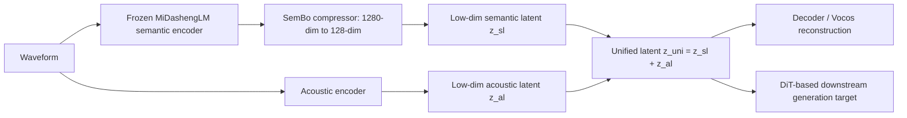
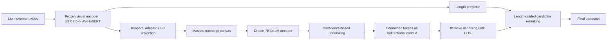
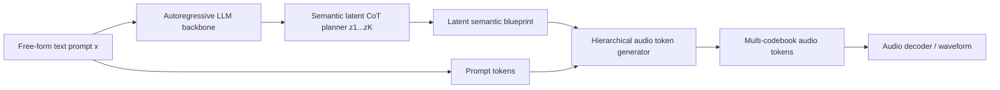
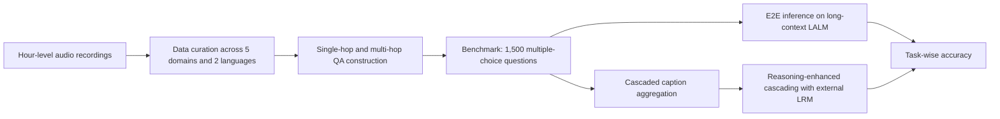
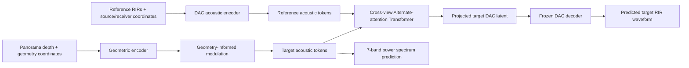

# 语音 / 音频 / 音乐论文速递
## 2026-05-28

> 实际对应 arXiv 更新日：**2026-05-28**  
> 检索范围：`cs.SD + eess.AS`  
> 只放按 ML 顶会审稿口径看，最值得多数读者花时间看的 **5 篇**

## 📋 总览

- 共收录 **5 篇** 相关论文
- 语音表示 / tokenizer：**1 篇**
- 语音识别 / 视觉语音：**1 篇**
- 统一音频生成 / 语音生成：**1 篇**
- 语音大模型评测 / 长上下文理解：**1 篇**
- 空间音频 / RIR 建模：**1 篇**

今天这批最值得看的，不是“谁又发了个更大的音频模型”，而是三条更硬的主线。`LoSATok` 直面一个很少有人认真处理的问题：统一音频表示如果还维持 1280 维那种奢侈配置，DiT 训练成本和建模负担就会被活活拖死；`DLLM-VSR` 把视觉语音识别里最蠢的一件事点破了，很多 token 明明要等后文才能 disambiguate，却还在用左到右解码强行抢答；`VoiceGiraffe` 则把“大模型能做长音频理解”这句空话拆成了可以打脸的 benchmark，直接证明当前 LALM 的真正短板不是不会答题，而是记不住。

剩下两篇也都不是凑数。`PlanAudio` 的价值在于它试图把 speech 和 sound 的自由组合生成做成一个统一接口，而且 latent CoT 设计确实有实验支撑；`EigeNet` 虽然题目偏 niche，但它把几何先验和 RIR 预测真正焊到一起，属于“方向窄，但方法不虚”的那类工作。

## 精选入选规则

- **新意（0-3）**：是不是提出了新的表示、接口、训练组织方式，或者把老问题拆得更对
- **影响力（0-3）**：是不是贴近语音大模型、ASR、TTS、音频生成、空间音频这些主线
- **证据强度（0-2）**：有没有像样的 baseline、消融和关键数值
- **受众匹配度（0-2）**：对语音大模型 / 语音前端 / 语音识别 / 音乐方向研究者有没有直接启发

分数校准：

- **6**：可读，但更像局部补丁
- **7**：信息量够，值得过一遍
- **8+**：建议优先精读

## 总览表

| 方向 | 序号 | 论文 | 评分 | 关键词 |
|---|---:|---|---:|---|
| 语音表示 / tokenizer | 1 | LoSATok | 8.5/10 | semantic-acoustic tokenizer, 128-d latent, SemBo, DiT generation |
| 语音识别 / 视觉语音 | 2 | Diffusion Large Language Models for Visual Speech Recognition | 8.5/10 | DLLM, masked denoising, visual speech recognition, length-guided decoding |
| 统一音频生成 / 语音生成 | 3 | Unified Synthesis of Compositional Speech and Sound from Free-Form Text Prompts | 8/10 | unified audio generation, latent CoT, free-form prompt, PlanAudio |
| 语音大模型评测 / 长上下文 | 4 | VoiceGiraffe | 8/10 | hour-level audio benchmark, long-context LALM, memory bottleneck, bilingual |
| 空间音频 / 声场建模 | 5 | EigeNet | 7.5/10 | novel-view RIR, alternate-attention, geometry-informed modulation, sim-to-real |

## 🧩 语音表示 / tokenizer

### [1] LoSATok: Low-dimensional Semantic-Acoustic Tokenizer for Cross-Domain Audio Understanding and Generation

- **评分**：8.5/10
- **作者/机构**：Zhisheng Zhang, Xiang Li, Yixuan Zhou, Jing Peng, Guoyang Zeng, Zhiyong Wu；清华大学深圳国际研究生院、ModelBest Inc.
- **论文链接**：https://arxiv.org/abs/2605.27840
- **PDF**：https://arxiv.org/pdf/2605.27840.pdf
- **代码链接**：**代码已开源** https://github.com/wxzyd123/LoSATok
- **Demo 链接**：暂无

#### 📌 简介
这篇做的是统一音频 tokenizer，但它抓住的问题比“统一理解和生成”这句口号更具体：高维 semantic representation 的确语义强，可一旦你把它直接喂给 DiT，后端训练和推理负担会立刻膨胀。`LoSATok` 的核心贡献是把 `MiDashengLM` 的 1280 维语义表示压到 128 维，同时通过 `SemBo + dual-level semantic supervision` 让这个低维 latent 还能兼顾理解能力、声学重建和下游生成。

#### ☠️ 毒舌点评
这篇不是那种“压缩一下维度然后宣布统一建模成功”的水活。作者至少拿跨语音、音乐、通用音频三域一起打，问题问得也很准：真正拖垮 unified audio generation 的往往不是没有语义，而是语义表示又大又难建模。缺点同样明显，`LoSATok` 的理解能力离最强原始 semantic encoder 还有差距，重建也打不过纯 acoustic tokenizer，所以它不是银弹，只是很像目前更合理的折中点。

#### 🔧 技术方案
- **模型解决的问题**：现有 unified tokenizer 往往把语义和声学都塞进高维连续 latent，结果理解和生成两边都想兼顾，最后是 DiT 训练最先爆炸。`LoSATok` 解决的是“能不能学一个低维、语义还够强、又能重建和生成的统一表示”。
- **模型架构**：
  - **输入**：原始音频波形。
  - **输出**：128 维统一 `semantic-acoustic` latent，以及经 decoder 还原的音频。
  - **主干**：`Semantic Bottleneck + acoustic encoder + unified latent + Vocos-style decoder`。
  - **关键模块**：
    - `SemBo`：把 `MiDashengLM` 的 1280 维语义特征压缩到 128 维，再通过 restorer 重建回高维语义空间。
    - `time-relation loss`：不是只做逐帧重建，而是保持时序关系矩阵一致，避免低维表示只学到平均值。
    - `dual-level semantic supervision`：同时用高维语义监督 `LH` 和低维语义监督 `LL` 约束 unified latent。
    - `acoustic encoder`：2D 卷积式 patch 压缩，把声学细节补进统一表示。
    - `KL regularization`：把 latent 规整到更利于下游 DiT 建模的分布。
- **信号流**：

- **关键设计 / 核心创新**：
  - 不是简单 PCA 降维，而是专门设计 `SemBo` 学习高低维语义空间之间的非线性映射。
  - 用高维和低维双重语义监督，让 unified latent 既保留语义，又别彻底丢声学。
  - 论文把 tokenizer 价值标准从“重建最好”换成“理解、生成、建模成本三者平衡”，这点比很多 codec/tokenizer 论文更现实。
- **训练 / 推理策略**：
  - 训练集约 **13.2K 小时**，其中 **34.6% speech / 28.6% music / 36.8% general audio**。
  - 训练在 **8 张 H100** 上跑 **1M steps**，全局 batch size **64**，AdamW，初始学习率 `1e-4`。
  - 关键损失权重为 `{λmel, λsem, λKL, λfm, λadv} = {45, 45, 1e-2, 1, 1}`。
  - 下游生成采用 `UniFlow-Audio` 风格 DiT，主实验 DiT 隐维 **512**、**12 层**、约 **208M** 参数；推理 `CFG=3.0`，step 数 **20**。
  - 单任务训练里，TTA 在 `WavCaps` 上 **100K** steps，TTM 在 `LP-MusicCaps-MTT` 上 **50K** steps，TTS 在 `LibriTTS` 上 **50K** steps；多任务联合训练则用 **8 张 GPU** 跑 **150K** steps。

#### 📊 实验结果
- 理解任务：
  - 在 `XARES` 的 **15 个**跨域任务上，`LoSATok` 平均分 **59.30**，明显高于 `HuBERT 49.82` 和 `WavLM 44.33`。
  - 在音乐理解任务 `MT` 上，加入 acoustic 细节后，`LoSATok` 从低维语义版本的 **22.86** 提升到 **41.87**。
  - `SemBo` 本身的平均分是 **70.49**，已经接近 `MiDashengLM 75.48`，说明 128 维语义瓶颈并不是纯摆设。
- 生成任务：
  - 单任务 TTS：`LoSATok` 达到 **WER 3.030 / SIM 0.548 / UTMOS 3.367**，优于 `UniFlow-Audio` 的 **3.589 / 0.408 / 2.768**。
  - 单任务 TTA：`LoSATok` 在 `AudioCaps`/`WavCaps` 风格评测上做到 **FAD 2.760 / FD 25.743 / KL 1.844 / CLAP 0.381**，优于 `UniFlow-Audio` 的 **4.925 / 40.017 / 2.613 / 0.243**。
  - 单任务 TTM：相较同参数量 `UniFlow-Audio 208M`，`LoSATok` 在 `FAD / FD / CLAP` 上也整体更稳；论文结论是同等或更少参数下，`LoSATok` 比高维 unified tokenizer 更适合 DiT 训练。
  - 小数据 `AudioCaps` 训练下，`LoSATok` 仍有 **FAD 1.813 / CLAP 0.507**，说明它不是只能靠大数据堆出来。
- DiT 维度分析：
  - 当 DiT hidden dim 压到 **128** 时，纯 acoustic tokenizer 几乎没法生成可用结果，`UniFlow-Audio` 的 `CLAP` 只有 **0.06**，`FAD` 高达 **10.87**。
  - `LoSATok` 在相同 128 维 DiT 下还能维持非平凡生成能力，这恰好证明低维语义 rich latent 的价值。
- 重建与消融：
  - 纯重建上它不算最强，`LoSATok` 在 `AudioSet / MUSDB / SeedTTS-EN` 上是 **Mel-16k 0.760 / 0.712、STFT-16k 2.296 / 2.159、PESQ 3.051、STOI 0.947**，明显弱于 `UniFlow-Audio` 的重建指标。
  - 但去掉低维语义监督 `LL` 后，理解能力直接塌：`ESC / FSC / GTZAN` 变成 **47.25 / 6.30 / 53.76**。
  - 去掉高维语义监督 `LH` 也会掉到 **91.10 / 54.79 / 86.99**，说明双层监督缺一不可。
- 基线对比结论：作者把 `HuBERT`、`WavLM`、`MiDashengLM` 和 `UniFlow-Audio` 都放进同一评测协议里直接比较，最终说明 `LoSATok` 真正赢的是跨域理解与低维可建模性，不是重建保真天花板。

#### 💡 为什么值得看
如果你正在做 unified audio tokenizer、speech/music latent、或者 DiT 音频生成，这篇很值得读，因为它把“表示该长什么样”从抽象审美题，变成了一个有成本约束的工程问题。它不追求最强重建，而是追求更低维、更好训、更能跨任务，这比很多单纯刷 codec 指标的工作更接近真实研发需求。

## 👄 语音识别 / 视觉语音

### [2] Diffusion Large Language Models for Visual Speech Recognition

- **评分**：8.5/10
- **作者/机构**：Jeong Hun Yeo, Chae Won Kim, Hyeongseop Rha, Yong Man Ro；KAIST Integrated Vision Language Lab
- **论文链接**：https://arxiv.org/abs/2605.28456
- **PDF**：https://arxiv.org/pdf/2605.28456.pdf
- **代码链接**：**代码已开源** https://github.com/JeongHun0716/dllm-vsr
- **Demo 链接**：暂无

#### 📌 简介
这篇做的是视觉语音识别（lip reading），但它没有继续在 visual encoder 上无止境堆料，而是从 decoder 下手：既然唇形天然有 viseme ambiguity，那就不该强迫模型左到右抢着出 token。作者提出 `DLLM-VSR`，把 VSR 转成 diffusion large language model 的 masked denoising 问题，再配上两阶段训练和长度引导候选解码，把“先解最确定的位置”这件事真正落地。

#### ☠️ 毒舌点评
这篇是很像样的 decoder-side 创新。很多 VSR 论文嘴上说“利用上下文”，实际还是 autoregressive 一步步硬猜，碰到 `PACK/BACK` 这种视觉近义歧义就先犯错再一路错下去。`DLLM-VSR` 至少抓住了这个根因。缺点也有，它高度依赖强 frozen visual encoder 和 Dream-7B，本质上不是重新定义 VSR，只是把解码顺序改对了；另外 length-guided candidate decoding 的高精度版本速度不算便宜。

#### 🔧 技术方案
- **模型解决的问题**：传统 VSR 的左到右解码会在看不到充分上下文时过早提交模糊 token，尤其是 viseme group 相近的辅音。`DLLM-VSR` 解决的是“如何先提交高置信 token，再用这些 token 反过来 disambiguate 难位置”。
- **模型架构**：
  - **输入**：唇动视频序列。
  - **输出**：文本转写序列。
  - **主干**：`frozen visual encoder + projection + Dream-7B based DLLM decoder`。
  - **关键模块**：
    - `confidence-based unmasking`：每轮先提交高置信位置，没有超过阈值就提交最可信的一个。
    - `two-stage masked-denoising training`：Stage 1 只学 transcript + EOS，Stage 2 再把 padding completion 加进来。
    - `length predictor`：从视觉特征预测 transcript 长度。
    - `length-guided candidate decoding`：在 `Kpred ± R` 的局部窗口里并行解多个长度假设，再做联合 rerank。
- **信号流**：

- **关键设计 / 核心创新**：
  - 不是用 diffusion 装点门面，而是把 token commitment order 变成方法核心。
  - 两阶段训练把内容学习和 padding/长度学习拆开，解决固定 canvas 下 padding supervision 过重的问题。
  - 长度引导不是暴力 beam，而是用视觉长度先验缩小搜索窗，再用 `Σ log ci + λ log pk - βnk` 联合排序。
- **训练 / 推理策略**：
  - 使用 `LRS3` 作为主训练集，Stage 1 训练 **42K** steps，学习率 `1e-4`；Stage 2 在 Stage 1 基础上再训 **4K** steps，学习率 `5e-5`。
  - 训练硬件为 **8 张 RTX 3090**，bf16 + DeepSpeed ZeRO-2。
  - LoRA 作用在 Dream-7B 线性层上，`rank=16, α=32`。
  - 推理时固定 canvas 长度 **T=32**，长度窗口 `Kpred ± 5`，commit threshold 为 **0.9**。
  - `AV-HuBERT/LRS3` 的最优 `(λ, β)` 为 **(0.9, 0.7)**，`USR 2.0/LRS3` 为 **(0.9, 0.6)**，`USR 2.0/LRS2` 为 **(1.0, 0.9)**。

#### 📊 实验结果
- `LRS3` 主结果：
  - `AV-HuBERT + Dream-7B DLLM` 达到 **21.9% WER**。
  - `USR 2.0 + Dream-7B DLLM` 达到 **19.5% WER**。
  - 对比 `Cappellazzo et al. (2026)` 的 `AV-HuBERT + Qwen2.5-7B AR decoder` **24.9% WER**，直接少了 **5.4** 个点。
  - 论文还复现了 `USR 2.0 + autoregressive Qwen2.5-7B`，结果是 **25.8% WER**，用 DLLM 后降到 **19.5%**， improvement 很实。
- 解码顺序分析：
  - 在同样左到右约束下，仅仅把 decoder 换成 bidirectional 结构，`24.9 -> 24.3`。
  - block size 逐渐放大到 full-parallel 时，`AV-HuBERT` 从 **24.3** 降到 **23.1**，`USR 2.0` 从 **22.2** 降到 **20.5**。
  - 这说明收益不只是大模型语言先验，而是 flexible-order decoding 本身。
- 两阶段训练与长度建模：
  - 只做 Stage 1 时，oracle length 下还能到 **21.9 / 17.8 WER**，但 implicit length 直接炸到 **188.0 / 275.0 WER**，说明 Stage 2 不是可选装饰。
  - 完整 two-stage 后，oracle length 为 **20.2 / 17.7**，implicit length 为 **23.1 / 20.5**。
  - 加入 length-guided rerank 后，进一步降到 **22.7 / 20.2**；再加 iteration penalty 后就是最终的 **21.9 / 19.5**。
- `LRS2` 泛化与效率：
  - `USR 2.0 + Transformer decoder (greedy)`：**24.7 WER / 0.09 RTF**
  - `USR 2.0 + Qwen2.5-7B AR beam=5`：**20.5 WER / 0.34 RTF**
  - `DLLM-VSR implicit length`：**17.8 WER / 0.14 RTF**
  - `DLLM-VSR length-guided`：**16.8 WER / 1.53 RTF**
  - 结论很明确：最实用的是 implicit-length 版本，想要极致精度再上 candidate decoding。
- 长度预测器：
  - `Acc@0` 约 **44%**
  - `Acc@1` 约 **88%**
  - `Acc@3` 约 **99.4%**
  - `MAE` 约 **0.71** token
- 基线对比结论：和 `Transformer decoder`、`Qwen2.5-7B` 自回归解码器以及 `Cappellazzo et al. (2026)` 这些基线相比，`DLLM-VSR` 的优势主要来自解码顺序重排，而不只是 backbone 换成更大的语言模型。

#### 💡 为什么值得看
这篇最值钱的地方不是“把 diffusion 用到 VSR”，而是它把视觉语音识别里的信息不均衡问题讲清了：有些 token 本来就该等后文再定。只要你做过 CTC 之外的 sequence decoder、做过 noisy ASR/AVSR，都会立刻明白这套思路能迁移到别的场景。

## 🎛️ 统一音频生成 / 语音生成

### [3] Unified Synthesis of Compositional Speech and Sound from Free-Form Text Prompts

- **评分**：8/10
- **作者/机构**：Yuyue Wang, Xihua Wang, Xin Cheng, Yijing Chen, Ruihua Song；中国人民大学
- **论文链接**：https://arxiv.org/abs/2605.28063
- **PDF**：https://arxiv.org/pdf/2605.28063.pdf
- **代码链接**：暂无
- **Demo 链接**：暂无

#### 📌 简介
这篇论文的核心是：别再让用户或外部 LLM 先把 prompt 拆成 “speech track + sound track + timing script”，而是直接从自由文本 prompt 生成统一音频。作者提出 `PlanAudio`，用一个自回归 LLM 先在连续 latent 空间里做 `semantic latent CoT`，再把这个隐式规划结果拿去指导后续分层音频 token 生成。

#### ☠️ 毒舌点评
这条方向很容易做成“prompt engineering + demo sampling”型论文，但这篇至少没有只拿几个花哨案例糊弄过去。`PlanAudio-Bench`、CoT 机制对比、数据 curriculum 实验都给了，说明作者知道这个任务最难的是语义布局和事件编排，不是单句 TTS。问题也很明显：最硬的 speech 指标还是没能压过专用系统，代码也没放，所以它离生产级统一生成平台还有距离。

#### 🔧 技术方案
- **模型解决的问题**：传统 pipeline 会先重写 prompt，再分别喂给 TTS 和 T2S，最后混音，结果时序错位和交互关系很难对齐。`PlanAudio` 解决的是“如何让模型直接理解自由 prompt 里的 speech、sound 及其关系，并输出一段统一音频”。
- **模型架构**：
  - **输入**：自由文本 prompt。
  - **输出**：统一音频的分层 token，最终解码为波形。
  - **主干**：`Qwen2.5-1.5B initialized autoregressive LLM + latent planning stage + hierarchical audio token generation`。
  - **关键模块**：
    - `Semantic Latent CoT`：先预测长度为 `K=6` 的连续潜变量序列 `z`，相当于隐式事件编排蓝图。
    - `Acoustic Generation`：在 `x + z` 条件下，逐步预测 `Q` 个 codebook 的音频 token。
    - `text-encoder-free design`：不额外引入显式文本 encoder，直接使用 LLM 的语言理解能力。
    - `AF3Encoder supervision`：用目标语义 embedding 序列 `h` 监督 latent planning。
- **信号流**：

- **关键设计 / 核心创新**：
  - 不是显式文字链式推理，而是在 latent 空间先做音频结构规划，避免中间推理文本太长、太脆弱。
  - 把 composite audio 当成核心任务，而不是先把 speech 和 sound 单任务各做一遍。
  - `PlanAudio-Bench` 专门围绕 composite 音频评估，至少比拿普通 AudioCaps 指标硬拽“统一生成成功”更可信。
- **训练 / 推理策略**：
  - 训练池共 **1.27M** 样本，包含 **371k composite / 451k sound / 354k speech**，每条音频配 **5** 个多样文本标注。
  - 复合音频训练数据从 `AudioSet` 里筛出，使用 `Whisper` 和 `Gemini-2.5 Pro` 做转写和非语言描述整理；评测基准 `PlanAudio-Bench` 选取 **4,500** 个强交互样本。
  - 模型初始化自 `Qwen2.5-1.5B`，使用 delayed token interleaving。
  - `AF3Encoder` 输出 **750** 个语义 embedding，再用 mean pooling 下采样到 `K=6`。
  - 训练在 **8 张 A800 80GB** 上做 **70 epochs**，约 **10 天**；Adam，初始学习率 `1e-4`，warmup **3000** steps，inverse square root decay，推理 `top-k=25`。

#### 📊 实验结果
- Composite 场景 `PlanAudio-Bench`：
  - `PlanAudio`：`FDPANNs 8.52`、`FDPaSST 201`、`KLPaSST 0.91`、`KLPANNs 1.03`、`IS 3.43`、`CLAP 0.20`、`WER 0.41`、`UTMOS 2.43`
  - 对比 `VoiceLDM-m`：`22.9 / 363 / 1.32 / 1.41 / 2.86 / 0.19 / 0.09 / 2.81`
  - 对比 pipeline `AudioLDM2Sound + AudioLDM2Speech`：`14.3 / 240 / 1.10 / 1.15 / 4.11 / 0.21 / 0.71 / 2.16`
  - 结论是 sound-related 指标上 `PlanAudio` 明显更强，但 speech 纯识别指标仍不如最强专用或半专用方案。
- 主观评测：
  - `PlanAudio` 在 `Quality / Temporal / Semantic / Authenticity` 上分别达到 **3.23 / 3.16 / 3.36 / 3.47**
  - 全部高于 `VoiceLDM-s/m` 和 pipeline baseline，说明它最大的优势确实是复合事件时序和真实性。
- Sound 生成 `AudioCaps`：
  - `PlanAudio`：`FDPANNs 24.7`、`FDPaSST 233`、`KLPaSST 1.93`、`KLPANNs 1.89`、`IS 8.02`、`CLAP 0.19`
  - 对比 `VoiceLDM-m`：`55.8 / 433 / 3.37 / 3.05 / 4.18 / 0.07`
  - 对比 `AudioLDM2`：`32.5 / 395 / 1.56 / 1.51 / 8.54 / 0.21`
  - 它在 unified baseline 里是明显最强，但跟专用 sound generator 比还有互有胜负。
- Speech 生成 `LibriTTS`：
  - `PlanAudio`：`WER 0.11 / UTMOS 3.11`
  - 优于 `VoiceLDM-s 0.62 / 2.75` 与 `VoiceLDM-m 0.13 / 2.99`
  - 但 `PromptTTS++` 这种专用系统仍有更高 `UTMOS 3.51`。
- CoT 机制消融：
  - 完整 `PlanAudio` 在 composite 上达到 `FD 177 / KL 1.07 / CLAP 0.20 / WER 0.86 / UTMOS 2.24 / SCF 0.34`
  - 去掉 CoT 后变成 `217 / 1.43 / 0.15 / 0.92 / 2.16 / 0.12`
  - 用显式文本 CoT 或 acoustic CoT 都更差，说明 latent CoT 不是噱头。
- 数据 curriculum：
  - `Constant` 策略整体优于 `Gradual` 和 `Disjoint`
  - 论文结论是持续混合 sound/speech/composite 的训练，比先单任务后复合更稳，也能避免 catastrophic forgetting。
- 基线对比结论：无论对比 `VoiceLDM-s/m` 这类 unified baseline，还是 `AudioLDM2`、`PromptTTS++` 这种单任务专用系统，`PlanAudio` 的优势都集中在复合事件组织，而 speech 单项上它还没有彻底超过专用强基线。

#### 💡 为什么值得看
如果你关心的是“真正的 unified audio generation 应该怎么做”，这篇比很多只会喊 end-to-end 的论文更具体。它最有启发的地方不是模型多大，而是它把“先规划再生成”这件事塞进 latent 空间，避免了中间文本重写管线的脆弱性。即使最后你不复现它整套系统，`latent CoT + composite-first benchmark` 这两个设计也值得借鉴。

## 🦒 语音大模型评测 / 长上下文理解

### [4] VoiceGiraffe: A Benchmark for Extreme Long-Context Audio-Language Understanding

- **评分**：8/10
- **作者/机构**：Jashin Ye, Dongxiao Wang, Yixuan Ye, Sashuai Zhou, Weihuang Lin, Mingyang Han, Kunpeng Wang, Zeyu Yuan, Boyu Li, Haoxiang Shi, Jingchen Shu, Jun Song, Bo Zheng；Future Living Lab, Alibaba
- **论文链接**：https://arxiv.org/abs/2605.27976
- **PDF**：https://arxiv.org/pdf/2605.27976.pdf
- **代码链接**：**代码已开源** https://github.com/LivingFutureLab/VoiceGiraffe
- **Demo 链接**：暂无

#### 📌 简介
这篇不是新模型，而是一个专门戳穿“长音频理解已经差不多了”幻觉的 benchmark。`VoiceGiraffe` 面向 hour-level audio-language understanding，覆盖英中双语、五类真实场景、123 段录音，总时长 113.1 小时，平均单条 55.2 分钟。它把问题分成 single-hop perception 和 multi-hop reasoning 两层，再用 1,500 道多选题去测当前 LALM 到底是听不懂、记不住，还是推不动。

#### ☠️ 毒舌点评
benchmark 论文很容易沦为“我收了点数据，然后把模型都骂一遍”。这篇相对好很多，因为它把失败机制拆得够细，尤其是把 `Causal Alignment` 和 `Event Tracking` 分开，直接证明现在的 LALM 更像“会总结显眼线索”，不是“能长期记住稀疏事件状态”。短板也很直白：它毕竟不是方法论文，很多读者只会摘它的结论，不会真去复现整个评测流程；另外 cascaded captioning 设定本身也会引入中间瓶颈。

#### 🔧 技术方案
- **模型解决的问题**：现有音频 benchmark 不是片段太短，就是靠拼接短片假装长上下文，根本测不出 hour-scale 音频理解的真实瓶颈。`VoiceGiraffe` 解决的是“如何用真实长音频、真实场景和多跳问题，系统评估 LALM 的长程感知、记忆与推理能力”。
- **模型架构**：
  - **输入**：小时级长音频录音、问题文本、候选答案。
  - **输出**：多选题答案，以及不同推理设置下的准确率。
  - **主干**：`benchmark construction pipeline + three inference settings`。
  - **关键模块**：
    - `hour-scale native recordings`：不是拼接短片，而是真实长录音。
    - `dual-level taxonomy`：single-hop 覆盖时间定位、语义内容、声学事件、副语言信息；multi-hop 覆盖 causal alignment 和 event tracking。
    - `cascaded caption aggregation`：30 秒窗口滑动 caption，再汇总成长上下文文本。
    - `reasoning-enhanced cascading`：用外部大推理模型在 caption 序列上再推一次。
- **信号流**：

- **关键设计 / 核心创新**：
  - 把长音频 benchmark 从“几分钟”直接推进到“约 1 小时级”，这是量变到质变的差别。
  - bilingual + speech/sound/music 自然交织，避免了只测纯语音 transcript 的假长上下文。
  - 最重要的是把 memory persistence 单独打出来，而不是把所有长上下文错误都归结为 token 长度不够。
- **训练 / 推理策略**：
  - 这篇不是训练新模型，重点在评测协议。
  - `E2E`：直接把完整长音频喂给支持长上下文的模型。
  - `Cascaded Caption Aggregation`：用 **30 秒** 窗口先做 clip-level caption，再拼成长文本给 LALM。
  - `Reasoning-Enhanced Cascading`：再把这些 caption 交给外部 LRM 做二次推理。
  - 评估指标是多选题 `macro-average accuracy`；论文没有统一给 latency/成本基准，这也是 benchmark 工具化时还需要补的一块。

#### 📊 实验结果
- Benchmark 规模：
  - **123** 条录音
  - 总时长 **113.1 小时**
  - 平均时长 **55.2 分钟**
  - 共 **1,500** 题，其中 **1,000** single-hop、**500** multi-hop
- 核心结果：
  - 只有 `Qwen3.5-Omni-Plus` 在 `E2E` 设定下整体分数 **76.00**，超过人工参考 **70.51**。
  - 开源模型在不带外部推理的 plain cascaded 设定下，最好也只有 `Qwen3-Omni` 的 **50.60**，其余大多在 **30%-45%** 区间。
  - 论文给出的总结统计是：开放模型加上外部 LRM 后，平均总体分数可从 **37.15%** 拉到 **55.39%**。
- 模式差异：
  - `Gemini-3.1-Pro` 在 plain cascaded 下达到 **75.13**，但 `E2E` 只剩 **40.53**，说明直接喂小时级原始音频不一定比 caption pipeline 强。
  - `Qwen3.5-Omni-Plus` 则相反，`E2E 76.00` 明显高于 plain cascaded 的 **66.20**，说明强模型可以吃下长原始音频的细粒度信息。
- LRM 影响：
  - `Gemini-3.1-Pro` 作为外部 reasoning model 时，对 open-source LALM 整体更稳，论文概括的平均增益约 **+22%**，对 open-source 甚至约 **+28%**。
  - `GPT-5.2` 对弱模型帮助明显，但会拖累强 proprietary 模型，尤其多跳任务会引入伪 causal cue。
- 记忆瓶颈：
  - 模型在 `Causal Alignment` 上普遍高于 `Event Tracking`，差距对 proprietary model 大约 **4%-20%**，对 open-source 最多到 **38%**。
  - 人类则相反，在 `Event Tracking` 上比 `Causal Alignment` 高 **8.9%**，这个对照很杀。
- 副语言与语言偏置：
  - proprietary 模型在 `Gender` 和 `Emotion` 上平均能到 **92.5%** 与 **78.2%**，open-source 差很多。
  - `Pitch` 是所有模型共同弱项，open-source 平均只有 **37.8%**，proprietary 也只有 **50.6%**。
  - `Qwen3.5-Omni-Plus` 的整体中英差值 `Δ=AccEN-AccZH` 为 **-5.2**，说明当前长音频理解也不是天然语言无关。
- 基线对比结论：这篇的比较对象不是单一模型，而是 `E2E`、`plain cascaded`、`cascaded + LRM` 三套协议下的开源与闭源系统横评；真正的基线差异说明，当前瓶颈首先是长程记忆维护，而不是把推理链再拉长一点。

#### 💡 为什么值得看
如果你做 LALM、长音频 agent、播客总结、会议助手，这篇几乎是必读。它最重要的贡献不是“榜单谁第一”，而是把一个常见误判掰正了：很多模型不是不会 reasoning，而是根本扛不住小时级音频里的长期记忆维护。这个结论会直接影响你到底该优化 encoder、context compression、memory module，还是评测协议。

## 🌐 空间音频 / RIR 建模

### [5] EigeNet: Geometry-Informed Multi-Modal Learning for Few-shot Novel View RIR Prediction

- **评分**：7.5/10
- **作者/机构**：Chong Jing, Zitong Lan, Junan Zhang, Zhizheng Wu；香港中文大学（深圳）、University of Pennsylvania
- **论文链接**：https://arxiv.org/abs/2605.28101
- **PDF**：https://arxiv.org/pdf/2605.28101.pdf
- **代码链接**：**代码已开源** https://github.com/FEAfeatherTHER/EigeNet
- **Demo 链接**：暂无

#### 📌 简介
这篇做的是 few-shot novel-view RIR prediction，也就是在只给少量参考位置 RIR 和房间几何信息的情况下，预测新位置的 room impulse response。作者提出 `EigeNet`，核心由 `Cross-view Alternate-attention Transformer`、`geometry-informed modulation block` 和 `power spectrum auxiliary loss` 组成，主打的是把几何先验和多视角关系显式写进模型，而不是纯黑盒回归。

#### ☠️ 毒舌点评
这不是大众向论文，但在它自己的问题域里算认真。和很多“多模态 + transformer”式论文不同，这篇至少没把房间几何当背景板，而是真把它拿来调制 target acoustic token，还给了 power spectrum 这个物理上说得通的辅助目标。短板是任务场景太窄，而且真实场景上的误差仍然不算小，所以它更像很硬的研究增量，不是那种一读就能大面积迁移的通用方法。

#### 🔧 技术方案
- **模型解决的问题**：现有 novel-view RIR 方法要么难以同时建模单个 RIR 的时间结构和多视角空间关系，要么完全把任务当黑盒映射，缺少物理可解释性。`EigeNet` 解决的是“如何在极少参考视角下，把房间几何、多视图关系和声学序列建模同时做好”。
- **模型架构**：
  - **输入**：参考源/受体位置坐标、参考 RIR、目标源位置，以及接收点视角的 panorama depth map。
  - **输出**：目标位置的 RIR 波形。
  - **主干**：`geometric encoder + DAC acoustic tokens + geometry-informed modulation + Cross-view Alternate-attention Transformer`。
  - **关键模块**：
    - `geometric encoder`：把深度图和坐标投影成 6 通道张量，再用 ViT 编成几何 token。
    - `reference acoustic encoder`：使用预训练 16 kHz `DAC` 的连续 latent 作为参考声学 token。
    - `geometry-informed modulation block`：用目标视角几何 token 调制目标 acoustic token，并回归 7-band octave power spectrum。
    - `CVAT`：局部 attention 处理单视角内时间结构，全局 attention 处理跨视角关系，二者交替堆叠。
    - `DAC decoder head`：把预测 latent 解码回 RIR 波形。
- **信号流**：

- **关键设计 / 核心创新**：
  - 把 `VGGT` 风格的 alternate-attention 从纯视觉 3D 任务迁到 RIR 建模，重点是局部时间结构和跨视角空间关系交替更新。
  - 用几何信息直接调制 target acoustic token，而不是只做 late fusion。
  - 引入 multi-octave power spectrum 辅助损失，把单目标 RIR 回归转成多任务学习，这一步有明显的 architecture-agnostic 收益。
- **训练 / 推理策略**：
  - 预测 16 kHz、长度 **8000** 采样点（约 **0.5s**）的 RIR。
  - DAC frame rate 为 **50 Hz**，因此每条 RIR 对应 **25** 个 1024 维 acoustic token。
  - 几何分支把 `256 x 512` 的张量切成 `16 x 32` patch，用 **8-head 4-layer ViT** 编码；CVAT 使用 **6 个** alternate-attention block，特征维度 **1024**、head 数 **16**。
  - 总参数量约 **132.54M**。
  - 总损失为 `LMRSTFT + λEDC * LEDC + λspectrum * Lspectrum`，其中 `λEDC=1`、`λspectrum=0.01`，后两项在前 **2000** step 线性 warmup。
  - 训练在 **8 张 H100** 上跑 **10 epochs**，batch size **48**，Adam。

#### 📊 实验结果
- tokenizer 适配性：
  - 预训练 16 kHz DAC 在 `AcousticRooms` 上的重建误差为 **EDT 0.004 / C50 0.606 / T60 4.963**，说明拿它当 RIR latent 不是拍脑袋。
- `AcousticRooms` 主结果：
  - `K=1` 时，`xRIR` 为 **EDT 0.076 / C50 2.124 / T60 12.617**，`EigeNet` 为 **0.052 / 1.488 / 10.213**。
  - `K=4` 时，`xRIR` 为 **0.054 / 1.540 / 10.052**，`EigeNet` 为 **0.047 / 1.398 / 8.061**。
  - `K=8` 时，`xRIR` 为 **0.050 / 1.442 / 9.393**，`EigeNet` 为 **0.041 / 1.242 / 7.605**。
  - 对比 `Linear Interp.`、`Nearest Neighbor`、`Random Same Room` 等传统 baseline，`EigeNet` 在所有 `K∈{1,4,8}` 上都更稳，尤其 sparse reference 时优势更明显。
- Sim-to-real 观察：
  - 在 `Hearing-Anything-Anywhere` 的 `dampenedBase` 场景，论文给出 `xRIR` 的 `T60` 误差大约仍有 **191%-254%**，而 `EigeNet` 可稳定到 **46%-49%** 区间。
  - 文中结论是 `EigeNet` 在真实场景的 `C50 / EDT / T60` 上也保持相对优势，说明几何调制和频谱辅助目标对 sim-to-real 确实有帮助。
- 消融与 baseline 讨论：
  - 论文明确把 `Few-shot RIR`、`xRIR`、经典插值/KNN 拿来做对比，结论是 alternate-attention 和 power spectrum loss 都是关键组件。
  - 其中作者特别强调：同样加 modulation block，如果没有对应 power spectrum loss，收益不会像完整版本那么稳定。
- 基线对比结论：`EigeNet` 相对 `xRIR`、`Few-shot RIR`、线性插值和 KNN 这几类基线的优势，不是单一指标偶然领先，而是在 `K=1/4/8` 和 sim-to-real 两种设定下都更稳定。

#### 💡 为什么值得看
如果你碰巧做 spatial audio、RIR、scene acoustics，这篇很值得读，因为它不是单纯换 backbone，而是把几何和声学之间那条本来就存在的物理联系写进了训练目标。对大多数语音研究者来说它没那么“主线”，但对做空间听觉和沉浸式音频的人，这种带物理先验的多模态建模比纯黑盒 transformer 更有复现价值。

## 最后结论

今天最值得优先读的顺序，我会给：

1. `LoSATok`：如果你关心统一音频表示、DiT 音频生成、跨 speech/music/audio 的 latent 设计，这篇最有实际方法论价值。
2. `Diffusion Large Language Models for Visual Speech Recognition`：它把 VSR 解码顺序这个老问题用 DLLM 重新做对了，是真正能启发别的序列解码任务的工作。
3. `VoiceGiraffe`：如果你做 LALM 或长音频 agent，这篇 benchmark 能直接告诉你当前系统到底卡在“记忆”还是“推理”。
4. `Unified Synthesis of Compositional Speech and Sound from Free-Form Text Prompts`：统一 speech+sound 生成这条线终于有了不只靠 demo 说话的版本，但离最强专用模型还有差距。
5. `EigeNet`：方向偏窄，但在 RIR / 空间音频这个子领域是认真而且有物理直觉的一篇。

一句话收束：今天这批论文真正的共同点，不是“大模型更大了”，而是大家都在逼近一个更现实的问题边界: 表示要更低维、解码顺序要更聪明、评测要更接近真实长上下文、生成要先规划结构、物理先验要重新拿回来。这比空喊 unified foundation model 值钱多了。
