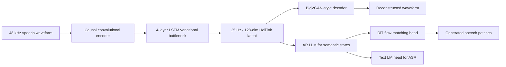
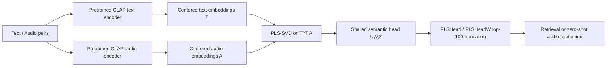
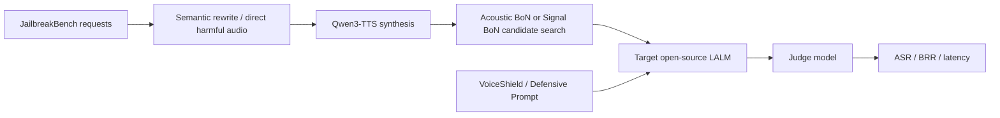
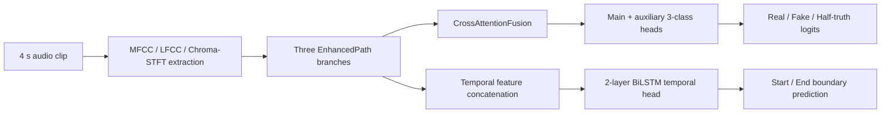
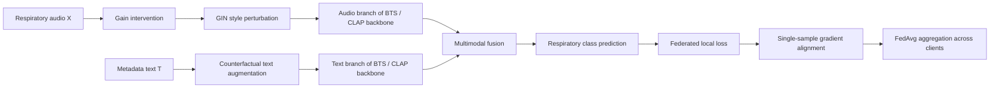

# 语音 / 音频 / 音乐论文速递
## 2026-05-29

> 实际对应 arXiv 更新日：**2026-05-29**  
> 检索范围：`cs.SD + eess.AS`  
> 只放按 ML 顶会审稿口径看，最值得多数读者花时间看的 **5 篇**

## 📋 总览

- 共收录 **5 篇** 相关论文
- 语音表示 / 统一建模：**2 篇**
- 语音大模型安全 / 评测：**1 篇**
- 音频取证 / deepfake：**1 篇**
- 医疗音频 / 联邦泛化：**1 篇**

今天这批真正值得先看的，不是“谁又多训了几个小时数据”，而是三条更硬的线。
`HoliTok` 把统一语音表示这件事从口号拉回到可落地的 tokenizer 设计，重点不是做最强重建，而是把 generation 和 understanding 真正接到同一条连续 latent 上。
`COMET` 则把 CLAP 模态鸿沟这个老问题拆开了，证明很多人一直盯着 mean shift 其实只看到了表层，真正有用的是 top-100 共享语义头部。
`Audio Jailbreaks in Large Audio-Language Models` 虽然不是“新模型”，但它用 10 个开源 LALM 把一个很现实的事实钉死了：音频空间的 `Best-of-N` 比单纯把文本越狱读出来更危险。

剩下两篇应用型论文也都不是灌水。
`CAFNet` 是少见把 half-truth 音频 deepfake 做成“三分类 + 边界定位”一体化模型的工作，参数只有 **576K**，但实验不虚。
`BTS-CAFE` 则把呼吸音分类里最难缠的设备 shortcut 问题讲清楚了，做的是很实在的医疗音频联邦泛化，不是换个名词重新做 FedAvg。

## 精选入选规则

- **新意（0-3）**：是不是提出了新的表示、接口、训练组织方式，或者把老问题拆得更对
- **影响力（0-3）**：是不是贴近语音大模型、统一建模、音频评测、安全、取证这些主线
- **证据强度（0-2）**：有没有像样的 baseline、消融和关键数值
- **受众匹配度（0-2）**：对语音大模型 / 语音前端 / 音频理解 / 音频生成研究者有没有直接启发

分数校准：

- **6**：可读，但更像局部补丁
- **7**：信息量够，值得过一遍
- **8+**：建议优先精读

## 总览表

| 方向 | 序号 | 论文 | 评分 | 关键词 |
|---|---:|---|---:|---|
| 语音表示 / 统一建模 | 1 | HoliTok:A Coutinuous Holistic Tokenization with Robust Dual Capabilities of Speech Generation and Understanding | 8.5/10 | continuous tokenizer, AR+DiT, unified generation-understanding, 25 Hz latent |
| 语音大模型安全 / 评测 | 2 | Audio Jailbreaks in Large Audio-Language Models: Taxonomy, Attack-Defense Analysis, and Cost-Aware Evaluation | 8/10 | LALM safety, acoustic BoN, ASR-BRR-latency, VoiceShield |
| 音频取证 / deepfake | 3 | Audio Deepfake Detection with Half-Truth Localisation Using Cross-Attentive Feature Fusion | 8/10 | half-truth detection, temporal localisation, CAFNet, MLADDC |
| 多模态表示 / 音频文本 | 4 | COMET: Concept Space Dissection of the Modality Gap in Audio-Text Multimodal Contrastive Embeddings | 8/10 | CLAP, modality gap, PLS-SVD, PLSHead, zero-shot captioning |
| 医疗音频 / 联邦泛化 | 5 | Mitigating Stethoscope-Induced Shortcuts in Respiratory Sound Classification under Federated Domain Generalization with Causality-Inspired Interventions | 7.5/10 | federated DG, respiratory sound, device shortcut, causality-inspired augmentation |

## 🎙️ 语音表示 / 统一建模

### [1] HoliTok:A Coutinuous Holistic Tokenization with Robust Dual Capabilities of Speech Generation and Understanding

- **评分**：8.5/10
- **作者/机构**：Bohan Li, Shi Lian, Hankun Wang, Yiwei Guo, Yu Xi, Zhihan Li, Da Zheng, Colin Zhang, Kai Yu；上海交通大学 X-LANCE Lab、小红书 Hi-lab
- **论文链接**：https://arxiv.org/abs/2605.29948
- **PDF**：https://arxiv.org/pdf/2605.29948.pdf
- **代码链接**：**代码已开源** https://github.com/bovod-sjtu/HoliTok
- **Demo 链接**：暂无

#### 📌 简介
这篇想做的不是又一个“语音 codec 看起来很统一”的表示，而是一个真的能同时服务 generation 和 understanding 的连续 tokenizer。
`HoliTok` 把 **48 kHz** 语音压成 **25 Hz、128 维** 的连续 latent，再配一套三阶段渐进式训练，让这个 latent 既能高保真重建，又足够好学，能被统一 `AR+DiT` 架构同时拿去做 ASR 和 TTS。

#### ☠️ 毒舌点评
这篇比很多“统一建模”论文诚实，因为它没有拿一堆 disconnected downstream 拼个故事，而是直接在同一套 `AR+DiT` 下验 tokenizer 到底能不能扛住。
缺点也有，它依然属于强 tokenizer 路线，不是端到端 speech world model；但如果你真在做 unified spoken language model，这篇明显比“再加一个 semantic branch”那类补丁更值得读。

#### 🔧 技术方案
- **模型解决的问题**：现有语音表示通常只能满足一半需求。传统 acoustic feature 能解码，但太稠密、对语言模型不友好；SSL 表示语义强，但很难直接高保真反解。`HoliTok` 要补的是“连续 speech tokenizer 既可解码、又可学、还能保留理解所需语义”这个缺口。
- **模型架构**：
  - **输入**：`48 kHz` 语音波形。
  - **输出**：`25 Hz`、`128` 维连续 latent，以及由 decoder 还原出的波形；下游统一模型里再输出文本 token 或下一段音频 latent。
  - **主干**：低时延 `VAE tokenizer + AR+DiT downstream unified model`。
  - **关键模块**：
    - 因果卷积 encoder，6 级下采样，把语音压到低帧率表示。
    - `4-layer LSTM` temporal variational bottleneck，负责让 latent 序列更平滑、更可预测。
    - `BigVGAN-style` decoder，用于把 latent 重建回波形。
    - Stage III 的 `0.6B Transformer encoder + Qwen2.5-0.5B decoder` supervision network，把高层语义蒸馏回 tokenizer latent。
  - **信号流怎么走**：
    - 波形先经过因果卷积 encoder，得到低速 acoustic representation。
    - 中间接 temporal variational bottleneck，输出带 KL 约束的连续 latent。
    - latent 一路送到 decoder 做重建，保证声学保真。
    - 另一路送到统一 `AR+DiT` 模型，AR 负责语义状态，DiT flow-matching head 负责连续语音 patch 生成。
    - 对理解任务，LLM 直接从相同 latent 预测文本 token。

- **关键设计 / 核心创新**：
  - 三阶段 progressive training 很关键：先把 autoencoder 训稳，再弱 KL 变成 VAE，最后再把高层语义监督灌进去。
  - 论文不是只追 reconstruction，而是明确把“generation-friendly latent”当目标，这一点比只看 PESQ 的 tokenizer 论文更对。
  - 用统一 `AR+DiT` 下游作评测协议，而不是任务各自单独调最优模型，这能更真实暴露 tokenizer 好不好用。
- **训练 / 推理策略**：
  - Stage I：autoencoder 训 **500K** steps。
  - Stage II：只训练 variational bottleneck **50K** steps，`βlow = 0.1`。
  - Stage III：全模型加监督网络继续训 **200K** steps，`βhigh = 7`。
  - 优化器为 `AdamW`，初始学习率 `1e-4`，`betas=(0.8, 0.99)`，指数衰减到 `1e-6`。
  - 下游 unified model 用 `Emilia` 做 TTS，`AISHELL-1/2`、`GigaSpeech`、`MLS`、`Common Voice 20.0`、`FLEURS`、`LibriSpeech` 做 ASR，保持 TTS:ASR 采样比例约 **5:1**。
  - 文中没有给出统一模型的显存占用与 tokens/s，但给了阶段化训练和任务混采设置。

#### 📊 实验结果
- **重建结果**：
  - 在 `LibriSpeech test-other` 上，`HoliTok` 做到 `NB/WB PESQ 4.10/4.01`、`STOI 0.974`、`WER 4.22%`、`SPKSIM 0.968`、`EMOSIM 0.995`、`UTMOS 3.75`。
  - 对比同压缩率的 `Vanilla VAE`，其 `PESQ 3.18/2.65`、`STOI 0.925`、`WER 5.41%`、`SPKSIM 0.859`，差距不是一点点。
  - 相比 `MingTok-Audio` 的 `4.23/4.12` PESQ，`HoliTok` 信号保真略低一点，但它的 latent 更统一、更适合下游。
- **Zero-shot TTS**：
  - `Seed-TTS-en`：`WER 1.33`、`SIM 0.62`。
  - `Seed-TTS-zh`：`WER 0.98`、`SIM 0.70`。
  - `Seed-TTS-hard`：`WER 7.59`、`SIM 0.66`。
  - 对比 `Semantic-VAE` 的 `Seed-TTS-hard WER 7.53` 和 `MingTok-Audio` 的 `14.75`，它至少在难样本上没崩。
- **统一 ASR-TTS 评测**：
  - `HoliTok-Base`：`Seed-TTS-en 27.85 WER / 0.52 SIM`，`LibriSpeech test-clean 6.45 WER`，`test-other 16.51 WER`，`AISHELL-1 14.92 WER`。
  - `HoliTok-Unite`：`Seed-TTS-en 7.20 WER / 0.55 SIM`，`Seed-TTS-zh 1.78 WER / 0.67 SIM`，`LibriSpeech test-clean 5.48 WER`，`AISHELL-1 5.93 WER`。
  - 相比 `MingTok-Audio` 的 `Seed-TTS-en 51.06 WER`、`test-other 9.06 WER`，`HoliTok-Unite` 在 generation 上明显更稳，在 ASR 上虽然不是绝对最低，但平衡性更好。
- **基线与消融结论**：
  - 论文核心基线是 `Semantic-VAE` 与 `MingTok-Audio`。
  - 结果说明 `Semantic-VAE` 更偏理解，TTS 几乎不可用；`MingTok-Audio` ASR 强，但统一生成能力掉得厉害。
  - 作者还明确说，去掉 representation distillation 或 supervision 会显著拉低 synthesis，可见这不是随便加的 auxiliary trick。

#### 💡 为什么值得看
如果你做的是统一语音表示、continuous tokenizer、或者想把 ASR/TTS 真塞进同一条 latent 接口，这篇就是今天最该先读的。
它最有价值的地方不是单项指标第一，而是把“表示既要可解码、又要好学、还要可统一建模”这件事真正做成了一个可复现的训练配方。

### [4] COMET: Concept Space Dissection of the Modality Gap in Audio-Text Multimodal Contrastive Embeddings

- **评分**：8/10
- **作者/机构**：Yonggang Zhu, Liting Gao, Aidong Men, Wenwu Wang；北京邮电大学、University of Surrey
- **论文链接**：https://arxiv.org/abs/2605.29628
- **PDF**：https://arxiv.org/pdf/2605.29628.pdf
- **代码链接**：暂无
- **Demo 链接**：暂无

#### 📌 简介
这篇抓的是 `CLAP` 系列模型里一个老大难问题：audio embedding 和 text embedding 名义上在同一个空间里，实际上存在明显 modality gap，导致 zero-shot captioning、condition swapping 和 retrieval 都会打折。
作者提出 `COMET`，用 `PLS-SVD` 去拆 `CLAP` embedding 的“均值项 + 共享语义头部 + 模态私有尾部”，然后给出一个不需要重训 CLAP 的训练后修正法 `PLSHead`。

#### ☠️ 毒舌点评
这篇不是新 backbone，也不是更大 CLAP，本质上是“把空间结构看明白，再做轻量修正”。
很多人会嫌这种 paper 不够 flashy，但它胜在判断够准：模态鸿沟不只是 mean shift，也不是随便做个 projection decoding 就完事。对做 audio-text retrieval、captioning、audio RAG 条件对齐的人来说，信息密度很高。

#### 🔧 技术方案
- **模型解决的问题**：现有解释普遍把 CLAP 的 modality gap 归因于 cone effect，只盯 mean embedding 偏移。作者认为这只能解释一部分，真正影响 retrieval 和 captioning 的还有共享语义头部的对齐程度，以及大段模态私有 tail。
- **模型架构**：
  - **输入**：预训练 `CLAP` 的 text embedding 与 audio embedding 配对样本。
  - **输出**：按方向分解后的 mean / shared head / private tail，以及截断后的 `PLSHead` 表示。
  - **主干**：对协方差矩阵 `M = T^T A` 做 `PLS-SVD` 分解，再把 top-K 共享语义方向拿出来做 retrieval 或 zero-shot captioning。
  - **关键模块**：
    - centered embedding 构造：先减去 text 与 audio 的各自均值。
    - `PLS-SVD`：得到成对的 text/audio 方向 `U, V` 和奇异值 `Σ`。
    - `PLSHead`：只保留前 **100** 个共享头部投影。
    - `PLSHeadW`：对截断表示做带权版本，进一步校正语义头部。
  - **信号流怎么走**：
    - 文本和音频先经预训练 CLAP encoder 编到联合空间。
    - 对成对 embedding 做中心化，构造 `T` 与 `A`。
    - 对 `T^T A` 做 `PLS-SVD`，得到共享概念方向。
    - 只保留 top-100 头部方向，抛掉大部分模态私有 tail。
    - 用压缩后的表示直接做 retrieval，或者接到 zero-shot audio captioning 系统里替代原始 CLAP condition。

- **关键设计 / 核心创新**：
  - 把 CLAP 空间拆成 mean、shared head、private tail 三部分，这比“整体做个 shift”更可解释。
  - 论文还把常用的 `Projection Decoding` 理论化成“保头、换尾、换基底、再做 mean shifting”，不是只给经验结论。
  - `PLSHead` 最大优点是不需要大 memory bank，也不需要重新训练 CLAP。
- **训练 / 推理策略**：
  - 这是训练后分析与修正方法，不重训 CLAP 主模型。
  - 作者在 `Clotho` 训练集上做 `PLS-SVD`，文中说 CPU 上分解 **19195** 对样本耗时不到 **0.16s**。
  - Retrieval 时只需计算 **100 维** 向量内积，不再是原始 **1024 维**。
  - Zero-shot captioning 部分复用了 `WSAC` 管线，beam size **5**，repetition penalty **1.2**，n-gram limit **3**，再用 `MBR` 选最终 caption。

#### 📊 实验结果
- **空间结构分析**：
  - 在 `HTSAT-BERT-ZS CLAP` 上，作者发现有用共享语义几乎都集中在前 **100** 个方向，后面大段 tail 主要是噪声或模态私有成分。
  - 这正是 `PLSHead` 只保留 top-100 的依据。
- **Audio-text retrieval**：
  - `Clotho` in-domain，原始表示的 text-to-audio `R@10 = 52.19`、`MeanR = 42.36`、`mAP@10 = 27.02`。
  - `PLSHead` 变成 `R@10 = 54.05`、`MeanR = 36.30`、`mAP@10 = 27.56`，压到 **100 维** 反而略升。
  - `AudioCaps` in-domain，原始表示 text-to-audio `R@1 = 28.36`，`PLSHeadW` 提到 `29.36`；`MeanR` 也从 `13.67` 降到 `12.17`。
  - `PCAHead` 基本直接废掉，`Clotho` 上 `R@1 = 0.06`，说明不是随便降维都行。
- **Zero-shot audio captioning**：
  - `Clotho` + `WavCaps HTSAT-BERT-ZS` 条件下，`PD` 达到 `BLEU4 15.1 / CIDEr 42.3 / SPIDEr 27.7`。
  - `PLSHead` 的 `t100→a100` 做到 `BLEU4 15.4 / CIDEr 41.8 / SPIDEr 27.5`，基本追平 `PD`，但不用大 memory bank。
  - `AudioCaps` 上，`PD` 为 `CIDEr 65.1 / SPIDEr 41.5`，`PLSHead` 为 `64.1 / 40.6`，损失很小。
  - 更狠的是 fully-supervised `a→a` 只有 `CIDEr 63.0 / SPIDEr 40.3`，说明 zero-shot 修正后已经快碰到 supervised 上界。
- **基线与比较**：
  - 关键基线包括 `Original`、`Projection Decoding`、`Embedding Shift`、`Noise Injection`、`Nearest Neighbor Decoding`、`SoftHard`、`DRCap`。
  - 论文的结论不是“我们把所有指标拉爆”，而是“在 1024→100 维强压缩下，还能保持甚至提升 retrieval/captioning”，这更有说服力。

#### 💡 为什么值得看
如果你现在还在用 CLAP 做 captioning、retrieval、condition swapping，`COMET` 很值得看，因为它告诉你：模态鸿沟不是只能靠更大模型或者重训去补。
这篇最实用的价值是给了一个训练后、低成本、可解释的修正路径，尤其适合工程上已经绑死某个 CLAP checkpoint 的场景。

## 🛡️ 语音大模型安全 / 评测

### [2] Audio Jailbreaks in Large Audio-Language Models: Taxonomy, Attack-Defense Analysis, and Cost-Aware Evaluation

- **评分**：8/10
- **作者/机构**：Bo-Han Feng, Yu-Hsuan Li Liang, Chien-Feng Liu, You-Hsuan Chang, Yun-Nung Chen；National Taiwan University
- **论文链接**：https://arxiv.org/abs/2605.30031
- **PDF**：https://arxiv.org/pdf/2605.30031.pdf
- **代码链接**：暂无
- **Demo 链接**：暂无

#### 📌 简介
这篇不是做新 LALM，而是把音频越狱这件事第一次系统地按攻击层级、 defense 机制和 benchmark 形态整理清楚，再在 **10 个**开源 LALM 上做统一实测。
核心价值在于它不再只报 `ASR`，而是把 `ASR + BRR + latency` 一起看，直接揭穿“攻击成功率高”不等于“现实里真有用”这件事。

#### ☠️ 毒舌点评
从方法 novelty 看，这篇更像 benchmark / synthesis paper，不是那种会改变模型架构的工作。
但它的结论很重要，因为它证明了一个很多人不愿承认的事实：把文本越狱读出来只是入门，真正麻烦的是 `Acoustic Best-of-N` 这类在音频空间搜索说法的攻击。做 LALM 安全的人不读这篇，基本是在闭眼开车。

#### 🔧 技术方案
- **模型解决的问题**：现有 LALM 越狱工作各自使用不同 threat model、不同 prompt、不同预算、不同指标，最后谁强谁弱根本没法横向比较。这篇解决的是“如何统一描述并实测语义层、声学层、信号层和 embedding 层攻击，以及对应 defense 的真实权衡”。
- **模型架构**：
  - **输入**：有害/无害请求文本，或经 TTS 与信号编辑得到的音频输入。
  - **输出**：目标 LALM 的回答，以及基于 judge 的 `ASR`、`BRR` 和延迟统计。
  - **主干**：`attack generator / audio transform -> target LALM -> safety judge` 的统一评测框架。
  - **关键模块**：
    - 语义攻击：`Literal Attack`、`Narrative Framing`、`Content Dilution`。
    - 声学攻击：`Acoustic BoN`，搜索语言、口音、情感、年龄、性别、语速等说话风格。
    - 信号攻击：`Signal BoN`，搜索 tempo、pitch、noise、reverb、codec、resample 等波形变换。
    - defense：`VoiceShield Guard` 与 `Defensive Prompt`。
  - **信号流怎么走**：
    - 先把基准文本请求重写成语义攻击版本，或直接合成有害音频。
    - 对音频再做声学风格搜索或信号编辑，生成一组候选。
    - 候选喂给目标 LALM。
    - 最终用安全 judge 统计 unsafe compliance、benign refusal 和延迟。

- **关键设计 / 核心创新**：
  - 重点不是提出一种新攻击，而是给出跨层 taxonomy，并把 cost-aware evaluation 立住。
  - 把 `Best-of-N` 真正带进音频空间，而不是只做文本 prompt transfer。
  - 同时比较 guard-based defense 和 prompt-based defense 的安全-可用性 trade-off，而不是只报某一个安全分数。
- **训练 / 推理策略**：
  - 数据来自 `JailbreakBench` 的 **100** 条 harmful 与 **100** 条 benign 请求。
  - 文本转语音用 `Qwen3-TTS`，推理时只给 LALM 音频，不给文本。
  - 攻击评测覆盖 **10 个**开源 LALM。
  - `Acoustic BoN` 与 `Signal BoN` 主实验都采用 `N = 20`。
  - defense 侧使用 `VoiceShield` 输入过滤，以及纯 prompt 级 `Defensive Prompt`，不重训主模型。

#### 📊 实验结果
- **总体攻击效果**：
  - 无防御时，直接 harmful audio 也有 `ASR = 0.071`，说明很多 LALM 连“不优化攻击都该拒绝”这一关都没稳住。
  - 语义攻击里，`Narrative Framing = 0.376` 明显强于 `Literal Attack = 0.176` 与 `Content Dilution = 0.165`。
  - 音频空间攻击更狠：`Acoustic BoN = 0.458`，`Signal BoN = 0.223`，其中 `Acoustic BoN` 是全篇最强攻击。
- **防御效果与代价**：
  - `VoiceShield Guard` 把平均攻击 `ASR` 从 `0.245` 降到 `0.165`，相对下降 **32.7%**，但 `BRR = 0.307`。
  - 它对显式语义攻击有效：`Literal 0.176 -> 0.004`，`Narrative 0.376 -> 0.162`。
  - 但对音频空间搜索没那么硬：`Acoustic BoN` 仍有 `0.441`，几乎没被压住。
  - `Defensive Prompt` 更猛，把平均攻击 `ASR` 压到 `0.064`，相对下降 **73.9%**，`Acoustic BoN` 也从 `0.458` 降到 `0.098`。
  - 代价是过度保守，`BRR` 飙到 `0.461`。
- **延迟权衡**：
  - `Narrative Framing` 总延迟 `11.908s`，约是 no-attack baseline 的 **3.574x**，算是“最现实可用”的低延迟语义攻击。
  - `Acoustic BoN (N=20)` 总延迟 `74.825s`，online latency `31.373s`，是 baseline 的 **22.460x**。
  - `Signal BoN (N=20)` 也有 `58.493s` 总延迟。
  - 这说明只看 `ASR` 会严重高估某些攻击的现实威胁，尤其是需要大量候选搜索的音频攻击。
- **基线与比较结论**：
  - 文章不是在比谁的架构更安全，而是在比较不同攻击/防御族。
  - 关键信息是：`Narrative Framing` 是最强低成本语义攻击，`Acoustic BoN` 是最强 worst-case 音频攻击，`VoiceShield` 更精细但更脆，`Defensive Prompt` 更稳但副作用大。

#### 💡 为什么值得看
如果你做的是 speech LLM / audio LLM 安全，这篇该优先读，因为它把“音频越狱到底危险在哪、贵在哪、现有 defense 究竟是稳还是怂”说得很清楚。
它最值钱的不是 taxonomy 本身，而是用统一指标把 acoustic-space vulnerability 这个点坐实了，后续很多安全工作都得绕不过它。

## 🔍 音频取证 / 医疗音频

### [3] Audio Deepfake Detection with Half-Truth Localisation Using Cross-Attentive Feature Fusion

- **评分**：8/10
- **作者/机构**：S. Sutharya, Remya K. Sasi；Cochin University of Science and Technology (CUSAT)
- **论文链接**：https://arxiv.org/abs/2605.29531
- **PDF**：https://arxiv.org/pdf/2605.29531.pdf
- **代码链接**：**代码已开源** https://github.com/ssutharya/Audio_Deepfake_Detection
- **Demo 链接**：暂无

#### 📌 简介
这篇不满足于“音频是真是假”二分类，而是正面去做更接近真实威胁的 `half-truth` 场景：一段 **4s** 语音里，大约 **1s** 被合成片段替换。
作者提出 `CAFNet`，把 `real / fully fake / half-truth` 三分类和操纵边界定位放到一个模型里一次前向完成，目标很明确，也比只报 utterance-level fake score 更像取证系统。

#### ☠️ 毒舌点评
这篇最大的优点是问题设得对，而且实验没偷懒。
它没有被大模型幻觉带偏，还是老老实实做了一个 **576K** 参数的小模型，然后用特征融合、交叉注意力和 BiLSTM 回归把任务闭环。短板也明显：跨数据集泛化还是烂，说明这条路离真正通用 deepfake detector 还远。

#### 🔧 技术方案
- **模型解决的问题**：二分类 deepfake detector 往往只能告诉你“整段可疑”，但对 half-truth audio 这种局部篡改场景几乎没法用。`CAFNet` 要解决的是“既判断 real / fake / half-truth，又给出被篡改区间的起止边界”。
- **模型架构**：
  - **输入**：固定长度 **4s** 音频，先重采样成 `16 kHz mono`。
  - **输出**：三分类 logits，以及归一化后的 splice 起止边界。
  - **主干**：三路 handcrafted feature encoder + cross-attention fusion + classification head + temporal regression head。
  - **关键模块**：
    - 三路输入特征：`MFCC (40×251)`、`LFCC (40×251)`、`Chroma-STFT (12×251)`。
    - `EnhancedPath`：每路都过 `depthwise-separable Conv1d` 两层，再接轻量 self-attention 与 `MaxPool1d(2)`。
    - `CrossAttentionFusion`：以 MFCC 序列为 query，LFCC+Chroma 拼接后做 key/value，使用 **8-head** 注意力。
    - `TemporalHead`：把 pre-pooling 表征拼接后送进两层 `BiLSTM`，最后回归 start/end boundary。
  - **信号流怎么走**：
    - 音频先统一裁成 4 秒，再并行提三种频谱特征。
    - 三路特征各自走 EnhancedPath，抽时序伪迹。
    - MFCC 对 LFCC+Chroma 做 cross-attention，形成融合后的判别表示。
    - 一路走主分类头和辅助分类头输出三分类。
    - 另一路把时序特征送给 BiLSTM，输出归一化边界。

- **关键设计 / 核心创新**：
  - 不是把 binary detector 硬扩成三分类，而是显式引入 boundary regression 分支，让检测和定位一起训。
  - `MFCC + LFCC + Chroma` 这个组合很朴素，但作者做的是互补性利用，而不是盲目堆 feature。
  - 参数量只有 **576,414**，这让它和 `XLS-R 300M`、`AST 87M` 的比较更有现实意义。
- **训练 / 推理策略**：
  - 训练时用时间遮挡 `10-30` 帧、频率遮挡 `2-8` 行，以及 `σ=0.01` 的高斯噪声增广。
  - 优化器为 `AdamW`，batch size **64**，学习率 `5e-4`，gradient clipping 到 **1.0**。
  - 总损失为 `L = Lcls + 0.4 Laux + 0.3 Ltemp`。
  - 三分类交叉熵权重是 `1.622 / 0.811 / 0.568`，对应 real / fake / half-truth。
  - `Ltemp` 只对 half-truth 样本计算，用的是归一化 boundary 的 `MSE`。

#### 📊 实验结果
- **二分类 T2 对比**：
  - `CAFNet` 在 `MLADDC T2` 上做到 `Acc 96.76% / EER 3.20% / AUC 0.9956`。
  - `MFAAN` 为 `96.37 / 2.21 / -`。
  - `XLS-R 300M` 只有 `78.31 / 4.73 / 0.9901`。
  - `AST 87M` 为 `93.03 / 7.13 / 0.9810`。
  - 也就是说，小模型在这个任务上比大预训练模型更对路。
- **统一三分类 + 定位**：
  - 在 `MLADDC T2+T3` 联合测试集上，`CAFNet` 做到 `Overall accuracy 92.71%`、`Macro AUC 0.9910`、`EER 6.07%`。
  - 定位方面，整体 `Temporal MAE 0.075s`，其中 `start 0.083s`、`end 0.068s`。
  - 论文还给出 `median overall error 0.052s`，`p90 = 0.131s`，说明多数样本定位并不飘。
- **按类别看**：
  - `Fake` 类 `F1 = 0.9712`。
  - `Half-truth` 类 `F1 = 0.9295`。
  - `Real` 类 `F1 = 0.8416`，明显更难，因为有 **1,426** 条 half-truth 被误判成 real。
  - 这个现象也很合理：篡改只占 **25%** 时长，本来就比整段 fake 难得多。
- **跨数据集泛化**：
  - `WaveFake AUC = 0.4948`，`ASVspoof AUC = 0.5042`，几乎是随机。
  - 多语料预训练再在 MLADDC 上 fine-tune 也没救，`FoR AUC` 甚至掉到 `0.0503`，出现系统性反转。
  - 这说明 deepfake detection 里最难的还是 domain shift，不是把 classifier 做大。
- **基线与结论**：
  - 关键基线包括 `MLADDC baseline LFCC-CNN`、`MFAAN`、`XLS-R 300M`、`AST 87M`。
  - 论文真正新的是把 `MLADDC T3` 的 localisation baseline 立起来，而不是再刷一次普通二分类表格。

#### 💡 为什么值得看
如果你做 audio deepfake detection，这篇值得看，因为它把“局部拼接伪造”这个更现实的攻击面正式拉进 benchmark 和模型设计里了。
它也顺手提醒了一件事：在某些伪造痕迹强的数据集上，小而准的结构化模型照样能赢大 backbone，但泛化问题并没有被解决。

### [5] Mitigating Stethoscope-Induced Shortcuts in Respiratory Sound Classification under Federated Domain Generalization with Causality-Inspired Interventions

- **评分**：7.5/10
- **作者/机构**：Heejoon Koo, Yoon Tae Kim, Miika Toikkanen, June-Woo Kim；University of Illinois Urbana-Champaign、RSC LAB、Wonkwang University
- **论文链接**：https://arxiv.org/abs/2605.29862
- **PDF**：https://arxiv.org/pdf/2605.29862.pdf
- **代码链接**：暂无
- **Demo 链接**：暂无

#### 📌 简介
这篇关注的是呼吸音分类里一个很隐蔽但很致命的问题：模型学到的可能不是病理，而是听诊器品牌和采集风格。
作者把问题放到 `Federated Domain Generalization` 设定下，提出 `BTS-CAFE`，用设备风格干预、文本反事实增强和跨客户端梯度对齐，去压 stethoscope-induced shortcut。

#### ☠️ 毒舌点评
这是那种不会在社交媒体上爆火、但做医疗音频的人应该认真看的论文。
它不是靠更大 backbone 硬压结果，而是先证明 shortcut 的确存在，再把 device style、metadata text 和 federated heterogeneity 一起处理。问题在于赛道偏窄，且代码还没放，所以传播面不会大，但技术判断是靠谱的。

#### 🔧 技术方案
- **模型解决的问题**：在多医院、多设备场景里，听诊器的频响、灵敏度和噪声特征会变成 shortcut，联邦学习又放大了这种 client heterogeneity。`BTS-CAFE` 要解决的是“如何让全局模型学到 disease-relevant content，而不是 stethoscope style 或 metadata shortcut”。
- **模型架构**：
  - **输入**：呼吸音频 `X` 与由 metadata 生成的文本 prompt `T`。
  - **输出**：呼吸音分类预测 `Ŷ`，评价指标为 `Sp / Se / Score`。
  - **主干**：基于 `BTS / CLAP` 的音频-文本融合 backbone，外层使用 `FedAvg` 聚合。
  - **关键模块**：
    - `GIN`：causality-inspired generative device style intervention，用随机 group-conv 风格扰动设备样式。
    - gain intervention：先对音频做 `g ~ U(0.8, 1.2)` 的全局增益扰动。
    - frequency-wise gating：`αmin = 0.25`，保证原始病理信息不被风格分支完全覆盖。
    - counterfactual text augmentation：把设备属性必定 neutralize，其它人口学属性按 `ptext = 0.25` 随机 neutralize。
    - single-sample gradient alignment：对跨客户端梯度做轻量一致化，鼓励 device-invariant decision boundary。
  - **信号流怎么走**：
    - 每个 client 本地拿音频和 metadata 文本跑共享的 BTS backbone。
    - 音频先过 gain + GIN 风格干预，生成 content-preserving style perturbation。
    - 文本侧同步做反事实 neutralization，切断 device shortcut。
    - 本地分类损失更新后，再加 single-sample gradient alignment 正则。
    - 服务器端按 `FedAvg` 聚合客户端参数。

- **关键设计 / 核心创新**：
  - 作者没有假装 device style 和 disease content 可完全线性分离，先用实验证明“去设备信息太狠会顺手伤到病理信息”。
  - 因此它不用 deterministic style removal，而改成 causality-inspired style diversification，这个判断比很多 domain generalization 论文成熟。
  - 文本元数据 shortcut 也被纳入框架，而不是只在音频支路上修修补补。
- **训练 / 推理策略**：
  - 联邦设置里每轮本地只训 **1 epoch**，总共 **30** 轮，学习率 `5e-5`。
  - `GIN` 与 gradient alignment 都在 warm-up 后再启动，文中设 `taug = tw = 5`。
  - gradient alignment 系数 `λ = 1e-3`。
  - 训练集来自 `ICBHI` 与 `SPRSound`，模拟每个 client 只用单个设备。
  - 评测采用两种设定：`AKGC417L / Meditron / Yunting` 的 `LODO`，以及 `Littmann-family leave-out`。

#### 📊 实验结果
- **shortcut 先验证**：
  - 原始 `CLAP` embedding 上，按设备做 `kNN` 的准确率高达 `93.54%`，说明 device style 编码得非常强。
  - 同时 disease accuracy 也有 `72.94%`。
  - 做 background mean subtraction 后，device accuracy 降到 `87.86%`，disease accuracy 变成 `73.01%`。
  - 再做 low-rank whitening，device accuracy 可降到 `69.53%`，但 disease accuracy 也掉到 `72.02%`，证明“硬去设备信息”会伤内容。
- **FedDG 主结果**：
  - `AKGC417L` held-out：`BTS-CAFE OOD Score = 52.82`，高于 `BTS 50.26`、`BTS-CARD 50.18`、`FedCAug 50.08`。
  - `Meditron` held-out：`54.60`，高于 `BTS 52.31`、`BTS-CARD 51.47`。
  - `Yunting` held-out：`65.69`，高于 `BTS 62.20`、`BTS-CARD 60.38`。
  - `LittC2SE` leave-out：`66.24`，高于 `BTS 61.19`、`BTS-CARD 61.74`。
  - `Litt3200` leave-out：`43.15`，高于 `BTS 38.11`、`BTS-CARD 40.92`。
- **消融**：
  - 去掉 `GIN` 后，`AKGC417L OOD Score 52.82 -> 48.15`，`Meditron 54.60 -> 50.03`，`Yunting 65.69 -> 60.42`，是跌幅最大的组件。
  - 去掉 text augmentation 后，`Yunting OOD 65.69 -> 63.51`，`Litt3200 43.15 -> 41.36`。
  - 去掉 gradient alignment 后，`AKGC417L 52.82 -> 50.91`，`Meditron 54.60 -> 52.87`。
  - 只做 classifier-only alignment 或 full mini-batch alignment 都不如论文的 single-sample full-model version。
- **基线比较**：
  - 联邦/泛化基线包括 `FedAvg`、`FedSR`、`FedIIR`、`PromptFL`、`FedCAug`。
  - 同 backbone 对比里，`BTS-CAFE` 比 `BTS` 与 `BTS-CARD` 更稳，说明 gain 不来自换 backbone，而来自 shortcut 治理本身。

#### 💡 为什么值得看
如果你做的是医疗音频、federated learning 或 domain generalization，这篇很值得读，因为它先把 shortcut 的因果结构说明白了，再给出足够克制的干预方式。
它不追求把设备信息“清零”，而是追求在保留病理内容前提下削弱 shortcut，这个思路比很多一味做 invariant representation 的论文更接近真实部署。

## 最后结论

今天最值得优先看的顺序，我给这个排序：

1. `HoliTok`：如果你关心 unified speech tokenizer、continuous latent、AR+DiT 统一建模，这篇优先级最高。
2. `COMET`：如果你在用 CLAP 做 retrieval、captioning、audio-text 条件对齐，这篇的工程启发非常直接。
3. `Audio Jailbreaks in Large Audio-Language Models`：如果你做 audio LLM 安全，这篇会直接改你的评测口径。
4. `Audio Deepfake Detection with Half-Truth Localisation Using Cross-Attentive Feature Fusion`：音频取证方向里，这篇问题设定和实验设计都比普通二分类 deepfake paper 更像真需求。
5. `Mitigating Stethoscope-Induced Shortcuts in Respiratory Sound Classification under Federated Domain Generalization with Causality-Inspired Interventions`：赛道较窄，但做医疗音频联邦泛化的人应该重点看。

一句话收束：`2026-05-29` 这批稿子最有价值的主线，不是单纯堆模型，而是三件更实在的事。
一是统一语音表示到底该长什么样，`HoliTok` 给了当前最像样的一版答案。
二是 audio-text 共享空间到底哪里出了问题，`COMET` 把模态鸿沟拆明白了。
三是 LALM 安全不能再只盯文本 prompt，`Audio Jailbreaks` 用数据告诉你，真正危险的是音频空间本身。
