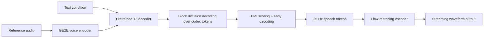
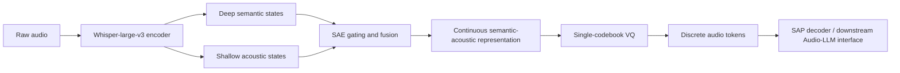
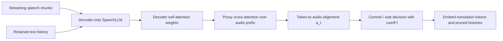
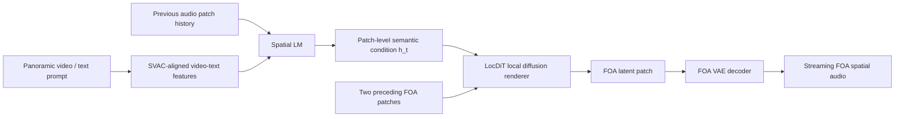
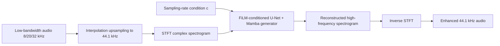

# 语音 / 音频 / 音乐论文速递
## 2026-06-01

> 实际对应 arXiv 更新日：**2026-06-01**  
> 检索范围：`cs.SD + eess.AS`  
> 只放按 ML 顶会审稿口径看，最值得多数读者花时间看的 **5 篇**

## 📋 总览

- 共收录 **5 篇** 相关论文
- 语音生成 / TTS：**1 篇**
- 语音 tokenizer / Audio-LLM 接口：**1 篇**
- 语音大模型 / 流式翻译：**1 篇**
- 空间音频生成：**1 篇**
- 音频修复 / 带宽扩展：**1 篇**

今天这批最值得看的主线，不是“谁参数更大”，而是三个很具体的技术缺口。`Chatterbox-Flash` 回答的是 streaming zero-shot TTS 到底能不能摆脱 AR 串行瓶颈，而且不是靠胡乱并行，而是用 `prior-calibrated scoring + early decoding` 把 block diffusion 真正拉到可流式部署区间；`UniAudio-Token` 则对准 Audio-LLM 里很现实的老问题，语义 tokenizer 一旦只盯 ASR 语义就会“听不见”音乐、环境声和音色细节，它用 `SAP + SAE` 这套监督和门控把 single-codebook 路线补成了更通用的音频接口；`SwanSphere` 的价值在于它不满足于“能生成空间音频”，而是把 `首包延迟`、`全景视频中的空间对齐` 和 `FOA 精度` 放到同一张账本里算清楚。剩下两篇也不是凑数：`DOA` 值得做 SpeechLLM / SimulST 的人看，因为它把“decoder-only 模型能不能靠 self-attention 做流式策略”这个问题做成了训练无关的实证；`FiPA-SR` 虽然不是大模型路线，但它在多带宽音频超分上给出了一个很干净的低成本基线，适合做工程落地的人直接抄。

## 精选入选规则

- **新意（0-3）**：是不是提出了新的表示、接口、训练组织方式，或者把旧问题拆得更对
- **影响力（0-3）**：是不是贴近 TTS、Audio-LLM、流式语音、空间音频、音频修复这些主线
- **证据强度（0-2）**：有没有像样的 baseline、消融和关键数值
- **受众匹配度（0-2）**：对语音大模型 / 语音前端 / 生成 / 音频系统研究者有没有直接启发

分数校准：

- **6**：可读，但更像局部补丁
- **7**：信息量够，值得过一遍
- **8+**：建议优先精读

## 总览表

| 方向 | 序号 | 论文 | 评分 | 关键词 |
|---|---:|---|---:|---|
| 语音生成 / TTS | 1 | Chatterbox-Flash | 8.5/10 | block diffusion, streaming TTS, PMI scoring, early decoding |
| 语音 tokenizer / Audio-LLM | 2 | UniAudio-Token | 8.5/10 | semantic-acoustic primitives, single codebook, SAE gating, general audio perception |
| 语音大模型 / SimulST | 3 | DOA | 8/10 | decoder-only attention policy, training-free streaming, self-attention alignment, long-form SimulST |
| 空间音频生成 | 4 | SwanSphere | 8.5/10 | FOA generation, SVAC, autoregressive diffusion transformer, ODPO |
| 音频修复 / 超分辨率 | 5 | FiPA-SR | 7.5/10 | bandwidth extension, FiLM conditioning, GAN super-resolution, multi-bandwidth |

## 🗣️ 语音生成 / TTS

### [1] Chatterbox-Flash: Prior-Calibrated Block Diffusion for Streaming Zero-Shot TTS

- **评分**：8.5/10
- **作者/机构**：Deokjin Seo，Gangin Park，Kihyun Nam；Resemble AI，Seoul National University，KAIST
- **论文链接**：https://arxiv.org/abs/2605.30748
- **PDF**：https://arxiv.org/pdf/2605.30748.pdf
- **代码链接**：**代码已开源** https://github.com/resemble-ai/chatterbox-flash
- **Demo 链接**：论文仓库内提供音频样例

#### 📌 简介
这篇做的是 streaming zero-shot TTS，但重点不是再造一个新 backbone，而是把现成的 `Chatterbox-TTS` 自回归解码器改造成 `block diffusion` 解码器，同时保住原来的 block-by-block 流式能力。真正有价值的点在于作者没有把并行解码包装成一句口号，而是正面解决了离散 speech codec token 在 block diffusion 里会被高频 token 偏置拖垮的问题。

#### ☠️ 毒舌点评
这篇不是范式革命，但是真有工程含金量。很多“并行 TTS”文章最后都在质量或 latency 里选一个认输，这篇至少把两边都做到了可交代的水平。缺点是它本质上仍然是对 `Chatterbox` 的聪明改造，不是从头定义下一代语音生成框架；但如果你真在做流式 TTS，这比一堆大而空的 foundation story 更值得看。

#### 🔧 技术方案
- **模型解决的问题**：AR zero-shot TTS 质量强、也天然适合流式输出，但输出 token 必须一个个生成，墙钟时延跟长度线性增长。作者要补的是“怎么把 AR decoder 变成支持并行 token 恢复的 block diffusion，同时别把离散 speech token 的可懂度和说话人相似度一起搞崩”。
- **模型架构**：
  - **输入**：文本条件、说话人参考音频。
  - **输出**：25 Hz 离散 speech token 序列，再经 flow-matching vocoder 输出波形。
  - **主干**：`pretrained Chatterbox T3 decoder -> block diffusion decoder`。
  - **关键模块**：
    - `hybrid attention mask`：文本条件因果注意力，块内双向、块间因果。
    - `prior-calibrated scoring (PMI)`：在块内 position selection 时减去 block marginal token prior，抑制 silence / 高频 token 抢位。
    - `early decoding`：基于置信度自适应提前终止 denoising step。
    - `chunk-wise streaming vocoder`：第二阶段 flow-matching vocoder 支持首包快速发出。
- **信号流**：

- **关键设计 / 核心创新**：
  - 离散 speech codec 序列的长尾 token 分布会让普通 block diffusion 在局部窗口里过分偏向高频 token，这正是 `Fast-dLLM v2` 直接套过来会爆 `WER` 的原因。
  - `PMI` 只在推理时改分数，不改结构、不加前向传播，这一点很实用。
  - `early decoding` 不是固定少跑几步，而是依据校准后的 confidence 决定何时停。
- **训练 / 推理策略**：
  - 从预训练 `Chatterbox-TTS` checkpoint 继续训练，替换成 masked denoising objective。
  - 训练数据约 `70k` 小时英语语音，来自 `GLOBE 582k`、`HiFi-TTS 324k`、`Expresso 12k`、私有对话集、`IVR 445k` 等，总计 `43.8M` 样本、约 `528k speakers`。
  - 训练用 `AdamW + cosine lr`，峰值学习率 `1e-5`，有效 batch size `440`，`bfloat16`。
  - 推理默认配置：`D=16`、`K=8`、`τ=0.5`、`w=1.0`、`T=0.2`、`β=5`；效率模式用 `α=0.5`。
  - 推理性能给得比较完整：`TTFP`、`RTF` 都报了，不是只会报客观质量。

#### 📊 实验结果
- 数据集：`LibriSpeech-PC test-clean`、`Seed-TTS test-en`
- 与 AR backbone `Chatterbox` 对比：
  - `LibriSpeech-PC`：`SIM-o 0.717 vs 0.707`，`WER 1.67 vs 1.99`，`UTMOS 4.29 vs 4.29`
  - `Seed-TTS`：`SIM-o 0.704 vs 0.685`，`WER 1.96 vs 2.20`，`UTMOS 4.09 vs 4.10`
- 与 NAR / Block-AR baseline 对比：
  - `PMI (α=0)` 在 `LibriSpeech-PC` 上 `SIM-o 0.717 / WER 1.67 / UTMOS 4.29`
  - `PMI+ED (α=0.5)` 保持 `WER 1.67`，平均 step/blk 从 `8 -> 6.47`
  - 直接套 `Fast-dLLM v2` 解码会崩到 `WER 15.36 / 14.49`，正说明 speech token 上直接照搬 dLLM 技术根本不行
- 流式效率：
  - `Chatterbox-Flash D=16, α=0.5`：`TTFP 118 ms`，`RTF 0.107`
  - `D=32, α=0.75` 可到 `RTF 0.076`
  - 对比 `Qwen3-TTS 25Hz-1.7B`：`TTFP 150 ms`，`RTF 0.253`
- 人评：
  - `NMOS 3.91 vs ElevenLabs v3 4.04`
  - `SMOS 4.56 vs ElevenLabs v3 3.50`
- 消融：
  - `α=0.5` 时 compute 节省约 `20%`，`α=1.0` 最多可省约 `41%`，但 `WER` 只轻微上升到约 `+0.6`
  - `D >= 24` 时 `WER` 明显恶化，说明大 block 并不是白拿吞吐
- baseline 名称：`Chatterbox`、`Qwen3-TTS`、`OmniVoice`、`F5-TTS`、`MaskGCT`、`IndexTTS2`、`CosyVoice3`、`VoxCPM`

#### 💡 为什么值得看
如果你做的是能上线的 TTS，而不是只想在论文里写“并行生成”，这篇很值得读。它把 speech token 的特殊分布问题讲明白了，也给了一个几乎不改结构、主要改推理策略的实用解法。它不一定是未来五年的终局，但至少是今天把 streaming zero-shot TTS 做到又快又不太难听的一条真路线。

## 🧠 语音 tokenizer / Audio-LLM 接口

### [2] UniAudio-Token: Empowering Semantic Speech Tokenizers with General Audio Perception

- **评分**：8.5/10
- **作者/机构**：Yuhan Song，Linhao Zhang，Aiwei Liu，Chuhan Wu，Sijun Zhang，Wei Jia，Yuan Liu，Houfeng Wang，Xiao Zhou；Peking University，Tencent WeChat AI
- **论文链接**：https://arxiv.org/abs/2605.31521
- **PDF**：https://arxiv.org/pdf/2605.31521.pdf
- **代码链接**：**代码已开源** https://github.com/Tencent/Universal_Audio_Tokenizer
- **Demo 链接**：同代码仓库

#### 📌 简介
这篇的目标很明确：保留 semantic speech tokenizer 那种 `single-codebook + 强文本对齐` 的优点，但别再做成“只能听懂语音字词、听不懂环境声和音乐”的半盲接口。作者用 `Semantic-Acoustic Primitives (SAP)` 做结构化监督，再用 `Semantic-Acoustic Equilibrium (SAE)` 从浅层补回声学细节，想把 tokenizer 真正升级成 Audio-LLM 的通用音频入口。

#### ☠️ 毒舌点评
这是少数把“Audio-LLM 接口层”当成核心问题来做的论文，而不是又堆一个更大的后端 LLM。优点是问题非常实，实验也覆盖理解、重建、TTS 三条线；缺点是它本质上还是在 `Whisper-large-v3` 语义骨架上修补，不是完全跳出 ASR 语义范式。但在 single-codebook 路线上，它已经明显比一堆只会吹统一接口的 paper 更像真东西。

#### 🔧 技术方案
- **模型解决的问题**：现有 semantic tokenizer 天然有语言对齐和短序列优势，但高层 ASR encoder 会主动压掉 timbre、环境声、音乐等“非语言细节”，导致 Audio-LLM 在 sound / music 上先天残疾。作者想解决的是“能不能继续用语义 tokenizer 这条轻量路线，同时把一般音频感知补回来”。
- **模型架构**：
  - **输入**：原始音频波形。
  - **输出**：25 Hz、单码本、`8192` 词表的离散 audio token。
  - **主干**：`audio encoder + SAE + VQ codebook + SAP decoder`。
  - **关键模块**：
    - `SAP`：把音频拆成 `linguistic content + vocal attributes + auditory scenes` 三类结构化标签。
    - `SAE`：从浅层 encoder 特征里按内容自适应注入 acoustic cue，弥补深层语义表示的声学信息流失。
    - `single-codebook VQ`：维持 LLM 友好的紧凑 token 序列。
    - `SAP decoder`：从预训练 ASR decoder 改造成兼顾语义与声学原语的解码器。
- **信号流**：

- **关键设计 / 核心创新**：
  - `SAP` 不是一堆松散 caption，而是把声学监督拆成 vocal attribute 与 auditory scene 原语，强迫 codebook 学到非语义信息。
  - `SAE` 不是固定残差，而是内容相关门控；论文明确显示它在噪声增强和 music 片段里门值会变大。
  - 仍然坚持 `single-codebook`，避免又回到多码本 codec 难接 LLM 的老路。
- **训练 / 推理策略**：
  - 初始化来自 `whisper-large-v3`，先保住语义对齐。
  - 两阶段训练：
    - Stage 1：绕过 VQ，只用 `LSAP` 训练 SAE 和 decoder，让连续 hidden state 对齐 SAP。
    - Stage 2：插入 VQ，联合优化 `SAP loss + quantization loss + commitment loss`。
  - 词表 `8192`，帧率 `25Hz`。
  - 数据规模很大：`Emilia 96,750h`、`Yodas 29,155h`、`AudioSet 4,922h`，再加 `MLS 27,322h`、`GigaSpeech 10,000h`、`WenetSpeech 10,005h` 等。
  - 学习率分层：encoder `1e-5`、decoder `6e-4`、其余 `2e-4`，说明作者很清楚哪个部分该保守，哪个该猛训。

#### 📊 实验结果
- 语音重建（Table 3）：
  - `UniAudio-Token` 平均 `WER 3.68`、平均 `MOS 4.19`
  - 对比 `StableToken`：平均 `WER 4.47`、`MOS 4.03`
  - 对比 `GLM-4-Voice-Tokenizer`：平均 `WER 5.04`、`MOS 4.08`
  - 对比 `WavTokenizer`：平均 `WER 6.95`、`MOS 3.15`
- 下游 Audio-LLM 理解（Table 4）：
  - `MMAU overall 61.10%`，比 `GLM-4-Voice-Tokenizer 55.20%` 高 `+5.90`
  - `MMAR overall 45.80%`，比最强 baseline 高 `+5.70`
  - `MMSU overall 43.54%`，比 `StableToken 40.56%` 更高
  - 在 `Sound 70.27%`、`Music 67.96%` 上优势尤其大，说明补回的不是虚假声学信息
- TTS（Table 5）：
  - `UniAudio-Token` 在 `SEED-TTS` 上 `SIM 0.792 | 0.742 | 0.767`
  - `WER 1.78 | 1.29 | 1.54`
  - `MOS 4.07 | 3.68 | 3.88`
  - 对比 `CosyVoice2` 的平均 `WER 2.05`、平均 `MOS 3.56`
- SAE 消融（Table 6）：
  - baseline 无 SAE：`LS-clean WER 2.47`，`LS-other 5.71`，`NLS 2.93`
  - `+SAE(L3)`：`2.43 / 5.58 / 3.16`，是最优平衡点
  - `L1` 虽然 clean WER 更好一点，但 NLS 不如 `L3`；`L5` 已经过度语义化
- baseline 名称：`WavTokenizer`、`CosyVoice2`、`GLM-4-Voice-Tokenizer`、`StableToken`

#### 💡 为什么值得看
如果你做 Audio-LLM，这篇的价值非常高，因为它在最容易被忽略、却最决定上限的地方动刀了：tokenizer。它告诉你很多 sound/music 任务做不好，不一定是后端 LLM 太笨，而是前面的 token 就已经把信息扔掉了。更关键的是，它不是靠多码本大 codec 强行堆复杂度，而是在 single-codebook 约束里把问题修到可用，这对真想接 LLM 的系统尤其重要。

## 🌐 语音大模型 / 流式翻译

### [3] DOA: Training-Free Decoder-Only Attention Policy for Long-Form Simultaneous Translation with SpeechLLMs

- **评分**：8/10
- **作者/机构**：Sara Papi，Luisa Bentivogli；Fondazione Bruno Kessler
- **论文链接**：https://arxiv.org/abs/2605.31432
- **PDF**：https://arxiv.org/pdf/2605.31432.pdf
- **代码链接**：**代码已开源** https://github.com/hlt-mt/simulstream
- **Demo 链接**：集成在 `SimulStream` toolkit

#### 📌 简介
这篇不训练新模型，而是直接问一个很多人嘴上默认不行的问题：decoder-only SpeechLLM 的 self-attention 里，到底有没有稳定到足够做 streaming policy 的对齐信号。作者提出 `DOA`，把 self-attention 裁成 proxy cross-attention，再据此做 token 是否可以提交、历史音频是否可以裁剪的判断。

#### ☠️ 毒舌点评
这篇的优点是够克制，不搞“再训一个 streaming LLM”这种大工程，而是先测现成模型身上有没有可用的结构信号。对做 SimulST 的人来说，这很值钱，因为它把 decoder-only 路线从纯 heuristic `wait-k` 往前推了一步。缺点也很明显：这不是提 SOTA 质量的万能药，它更像是一个让现有 SpeechLLM 勉强进入流式场景的 policy 层。

#### 🔧 技术方案
- **模型解决的问题**：现有 streaming SimulST 多依赖 encoder-decoder 架构里的 cross-attention 做 read/write 决策。SpeechLLM 是 decoder-only，没有显式 cross-attention，于是大多数工作要么重训、要么用很粗糙的 `wait-k`。`DOA` 要解决的是“能不能不重训，仅靠 decoder self-attention 做出可用的同步翻译策略”。
- **模型架构**：
  - **输入**：流式语音 chunk 和当前保留的文本历史。
  - **输出**：逐步提交的翻译 token。
  - **主干**：不是新模型，而是附着在 `Phi4-Multimodal`、`Qwen3-Omni` 上的 `training-free attention policy`。
  - **关键模块**：
    - `proxy cross-attention`：从 decoder self-attention 中切出指向音频 prefix 的部分。
    - `alignment extraction`：对每个生成 token 选最大注意力音频位置 `a_t`。
    - `cutoff hyperparameter f`：最后 `f` 帧视为不稳定，不提交对齐到这些帧的 token。
    - `history selection`：文本侧支持 `fixed words` 或 `punctuation`，音频侧按对齐裁掉已翻译前缀。
- **信号流**：

- **关键设计 / 核心创新**：
  - 核心不是重新定义模型，而是证明 `self-attention` 确实能给出足够稳定的 proxy alignment。
  - 文本历史选择里，`punctuation` 在 decoder-only SpeechLLM 上反而比固定词数更稳，这一点和以前 AED 结果不同。
  - 音频裁剪与文本裁剪联动，避免长上下文越滚越长。
- **训练 / 推理策略**：
  - 完全 training-free，不对 SpeechLLM 做额外 streaming 微调。
  - 评测模型：`Phi4-Multimodal 5.6B`、`Qwen3-Omni 30B-A3B`，AED baseline 为 `SeamlessM4T 1B`。
  - 语言方向：`en-de`、`en-it`，基于 `ACL 60/60` 与 `MCIF`。
  - 推理时按 latency regime 扫 `f` 参数，同时比较 `punctuation`、`fixed words N=10/20/30`。
  - 论文没回避空输出问题，明确报告了 `empty%`。

#### 📊 实验结果
- `ACL 60/60` 上，`Phi4` + punctuation：
  - `f=25` 时 `BLEU 34.70`，`COMET 0.7673`，`LongYAAL 3219 ms`
  - 同等设置下 `fixed words (N=10)` 只有 `COMET 0.7550`
  - 说明 punctuation history 对 decoder-only SpeechLLM 更友好
- `MCIF en-de`：
  - `Qwen3-Omni f=15`：`BLEU 26.49`，`COMET 0.7884`，`LongYAAL 2744 ms`
  - `Qwen3-Omni f=25`：`COMET 0.7911`，但 latency 到 `3749 ms`
  - `Phi4 f=15`：`BLEU 29.40`，`COMET 0.7602`，`LongYAAL 2240 ms`
  - `SeamlessM4T f=12`：`BLEU 24.58`，`COMET 0.7124`
- `MCIF en-it`：
  - `Qwen3-Omni f=25`：`BLEU 38.14`，`COMET 0.8282`
  - `Phi4 f=25`：`BLEU 33.68`，`COMET 0.7985`
  - `SeamlessM4T f=12`：`BLEU 36.48`，`COMET 0.7725`
- 分析结论：
  - 层选择不稳定，单层有时会直接失败；`layers + heads averaging` 最稳
  - 某些 head 的确略好，但收益很小，不值得工程上做复杂特判
- baseline 名称：`SeamlessM4T`、`StreamAtt`、`Phi4-Multimodal`、`Qwen3-Omni`

#### 💡 为什么值得看
如果你在做 SpeechLLM 的 streaming 化，这篇的价值不在它把指标抬多高，而在它证明了一件更基础的事：decoder-only 模型不是天生不能做流式决策，关键是你要从 self-attention 里把对齐信号榨出来。它更像一把诊断刀和工具刀，而不是最终产品，但这种刀很少见。

## 🌊 空间音频生成

### [4] Towards Streaming Synchronized Spatial Audio Generation via Autoregressive Diffusion Transformer

- **评分**：8.5/10
- **作者/机构**：Ke Lei，Yu Zhang，Changhao Pan，Xueyi Pu，Wenxiang Guo，Ruiqi Li，Zhou Zhao；Zhejiang University，ByteDance
- **论文链接**：https://arxiv.org/abs/2605.30940
- **PDF**：https://arxiv.org/pdf/2605.30940.pdf
- **代码链接**：暂无
- **Demo 链接**：https://swanaigc.github.io

#### 📌 简介
这篇做的是从全景视频或文本直接生成 `FOA spatial audio`，但真正的看点不是“能不能生成”，而是它同时追空间精度、语义一致性和 streaming 首包延迟。作者提出 `SwanSphere`，用 `autoregressive semantic planning + local diffusion rendering` 的两阶段框架，把全局时间结构和局部高保真空间细节拆开建模。

#### ☠️ 毒舌点评
这篇比很多空间音频论文更像系统论文，而不是概念演示。它知道自己要解决的是首包延迟、空间对齐和真实全景场景，而不是在离线全序列上报一个好看指标。缺点是模型仍然很重，`1.09B` 不是随手就能部署的规模；但从研究价值和系统完整度看，它确实值得排在今天前列。

#### 🔧 技术方案
- **模型解决的问题**：现有空间音频生成常见两个硬伤：一是 diffusion 全局去噪导致首包太慢，二是视觉 encoder 往往只懂语义、不懂空间，做不准声源方向。`SwanSphere` 解决的是“怎么把高保真 FOA 生成改造成真正可流式，同时把空间对齐做准”。
- **模型架构**：
  - **输入**：全景视频、文本 caption，或两者之一。
  - **输出**：四通道 `FOA` 空间音频。
  - **主干**：`Spatial LM + LocDiT` 的自回归扩散两阶段架构。
  - **关键模块**：
    - `SVAC (Spatial Video-Audio Contrastive Learning)`：构造 semantic、temporal、spatial 多类 hard negatives，对齐全景视频与音频空间语义。
    - `Spatial LM`：按 patch 级别做全局语义规划，输入视频空间特征和历史音频摘要。
    - `LocDiT`：在 patch 内执行 diffusion / flow matching，高保真补细节。
    - `history encoder`：把前一 patch 压成紧凑历史表征，喂给当前 patch。
    - `ODPO`：用空间、语义、保真三种 reward 组合做在线 preference 优化。
    - `FOA-VAE`：把 4 通道 FOA 压到连续 latent，避免离散 codebook 的量化误差。
- **信号流**：

- **关键设计 / 核心创新**：
  - 把大 diffusion 拆成 `全局 semantic planning` 和 `局部连续渲染`，这才让 streaming 首包延迟降下来。
  - `SVAC` 不是普通对比学习，而是特意加了 `instance exchange`、`temporal offset`、`audio rotation`、`video rotation` 这些物理感知负样本。
  - `ODPO` 的 reward 拆成 `spatial 0.4 + semantic 0.4 + fidelity 0.2`，明显是按产品体验做权重，而不是只追一个指标。
- **训练 / 推理策略**：
  - 数据集：聚合公开源和爬取数据，做成 `165,000` 对全景视频-音频片段、约 `458` 小时；另有约 `1M` 非空间音频样本做 curriculum pretraining。
  - `SVAC` 在 `2×H800` 上训 `100k` steps；主模型在 `8×H800` 上训 `600k` steps。
  - `LocDiT` 使用 `20 diffusion steps per patch`。
  - patch 配置：`patch size 4 latent frames`、`temporal stride 4`、`causal context window 2 patches`。
  - 首包延迟拆解也给出来了：`0.03s` Spatial LM、`0.14s` LocDiT、`0.04s` 编码解码，总计 `0.21s`。

#### 📊 实验结果
- 视频到空间音频（Table 1）：
  - `SwanSphere`：`FD 120.28`，`KL 1.36`，`Δabs θ 1.14`，`Δabs ϕ 0.40`，`Δangular 1.03`，`MOS-SQ 4.32`，`MOS-AF 4.44`
  - 对比 `OmniAudio`：`157.67 / 1.93 / 1.25 / 0.47 / 1.27 / 4.12 / 4.27`
  - 对比 `ViSAGe`：`232.17 / 2.67 / 1.57 / 0.63 / 1.59 / 3.82 / 3.78`
  - 对比 cascaded `MMAudio+AS`：`FD 261.65`，`KL 2.43`
- 文本到空间音频（Table 2）：
  - `SwanSphere`：`FD 142.80`，`KL 1.43`，`MOS-SQ 4.31`，`MOS-AF 4.43`
  - `OmniAudio(text)`：`174.13 / 1.83 / 4.11 / 4.16`
  - `Tango2+AS`：`235.71 / 2.42 / 3.95 / 3.27`
- 效率：
  - `SwanSphere` 首包/总时长：`0.21s / 9.13s`
  - `OmniAudio`：`0.85s`
  - `ViSAGe`：`20.19s`
- `SVAC` 消融（Table 3）：
  - full model `FD 120.28 / KL 1.36 / Δangular 1.03`
  - `sem-only` 退化到 `127.12 / 1.41 / 1.12`
  - `CLIP` 更差，`FD 140.28 / KL 1.44 / Δangular 1.34`
- baseline 名称：`MMAudio+AS`、`Diff-Foley+AS`、`ViSAGe`、`OmniAudio`、`AudioLDM-2+AS`、`Tango2+AS`

#### 💡 为什么值得看
如果你做 immersive audio、空间视频生成或者 XR 内容，这篇很值得看，因为它把“空间音频生成”从离线好玩 demo 推向了更接近可交付系统的方向。它最值钱的不是某一个指标，而是它把空间对齐、首包延迟和语义一致性放进同一个可训练、可评测的闭环。

## 🧩 音频修复 / 超分辨率

### [5] FiPA-SR -- FiLM-Conditioned Perceptually Informed Audio Super-Resolution

- **评分**：7.5/10
- **作者/机构**：Wallace Abreu，Luiz W. P. Biscainho；Federal University of Rio de Janeiro
- **论文链接**：https://arxiv.org/abs/2605.30594
- **PDF**：https://arxiv.org/pdf/2605.30594.pdf
- **代码链接**：暂无
- **Demo 链接**：暂无

#### 📌 简介
这篇做的是音频带宽扩展 / 超分辨率，核心目标不是把单一采样率做到最强，而是让一个模型同时处理多种输入带宽。作者在之前的 `AEROMambaP` 基础上引入 `FiLM`，让模型根据输入采样率动态调节重建过程，统一处理 `8 / 20 / 32 kHz` 到 `44.1 kHz` 的带宽恢复。

#### ☠️ 毒舌点评
这不是 flashy paper，但挺实用。它的价值在于把一个很像产品需求的问题做干净了：同一系统面对不同退化带宽时，别每个带宽训练一套模型。短板也很清楚，实验规模不大，而且是 `MUSDB` 音乐场景，不是更复杂的真实语音通信链路；但作为低成本带宽扩展方案，它是合格的。

#### 🔧 技术方案
- **模型解决的问题**：传统 bandwidth extension 往往一档带宽一个模型，或者用扩散模型统一建模但推理成本太高。`FiPA-SR` 要解决的是“能否用一套轻量模型，在不同输入带宽下都稳住主观质量，而且推理足够快”。
- **模型架构**：
  - **输入**：低分辨率音频，先插值上采样到 `44.1 kHz` 后做复数谱输入。
  - **输出**：补齐高频后的 `44.1 kHz` 音频。
  - **主干**：`U-Net + Mamba + MelGAN multi-scale discriminator` 的 GAN 超分模型。
  - **关键模块**：
    - `prior upsampling`：先把不同采样率统一插值到同一长度和谱尺寸。
    - `FiLM layers`：根据采样频率条件向量 `c_i = fs(i) / 44100` 调节 feature map。
    - `Mamba + GLU residual block`：处理长时依赖和局部建模。
    - `PAQM` 感知损失：引导更接近主观听感。
- **信号流**：

- **关键设计 / 核心创新**：
  - 最大的创新不是 backbone，而是 `FiLM` 让同一个模型学会不同带宽条件下不同的高频补偿模式。
  - 对比直接把 `AEROMambaP` 粗暴扩展成多带宽版本 `PA-SR`，`FiLM` 明显更稳。
  - GAN 路线保持单步前向，和扩散方法相比极大降低部署成本。
- **训练 / 推理策略**：
  - 数据集 `MUSDB`：`100` 首训练、`50` 首测试，约 `10h` 音乐。
  - 训练同时混合 `8 / 20 / 32 kHz` 三档输入。
  - 参数：`window 512`、`hop 256`、segment `4s`、batch size `8`、训练 `105 epochs`，`Adam`，学习率 `3e-4`。
  - 生成器损失：`Ladv + Lrec + λLfmap - γLPAQM`
  - 推理性能是重点：作者专门测了 `10s` 音频的 GPU 显存和耗时。

#### 📊 实验结果
- 多带宽客观指标（Table II）：
  - `8 kHz`：`FiPA-SR ViSQOL 2.82 / LSD 1.24`，优于 `PA-SR 2.56 / 1.52` 和 `AudioSR 2.72 / 1.69`
  - `20 kHz`：`3.53 / 1.04`，优于 `PA-SR 3.12 / 1.19` 和 `AudioSR 3.33 / 1.30`
  - `32 kHz`：`4.41 / 0.68`，优于 `PA-SR 4.21 / 0.87`，也优于 `AudioSR 3.85 / 1.06`
- 速度与资源（Table III）：
  - `FiPA-SR`：`VRAM 3000 MB`，`10s inference 0.087 s`，参数量 `19,487,758`
  - `AudioSR`：`VRAM 14,396 MB`，`5.663 s`，参数量 `1,285,395,637`
  - 也就是大约 `3x` 更省显存、`60x+` 更快
- 分析结论：
  - `PA-SR` 去掉 FiLM 后，在 `8` 和 `20 kHz` 下明显退化，说明单纯把单带宽架构拼成多带宽并不够
  - `AudioSR` 虽然是强 baseline，但作者指出它更偏“听感 plausible”而不是频谱忠实，容易引入过强瞬态
- baseline 名称：`PA-SR`、`AudioSR`、`Low-Resolution input`

#### 💡 为什么值得看
如果你做的是音频修复、通信链路增强或者老录音带宽补偿，这篇值得看，因为它解决的是非常真实的系统问题：输入条件变了，模型别立刻废掉。它不靠超大参数，也不靠慢到没法上线的扩散采样，在工程成本和质量之间给出了一个挺像样的折中。

## 最后结论

今天最值得优先看的顺序，我给的是：

1. `Chatterbox-Flash`：对流式 TTS 最有直接价值，问题真、结果硬、延迟和质量都给了清楚账本。
2. `UniAudio-Token`：如果你做 Audio-LLM，这篇非常关键，因为 tokenizer 接口层经常比后端模型更决定上限。
3. `SwanSphere`：空间音频生成里少见的系统强稿，把首包延迟、空间对齐和主观质量放到一个闭环里。
4. `DOA`：做 SpeechLLM streaming 化的人应该看，它提供了一条不重训也能工作的 policy 路线。
5. `FiPA-SR`：创新级别没前三篇高，但在多带宽超分这个工程问题上非常实用。
