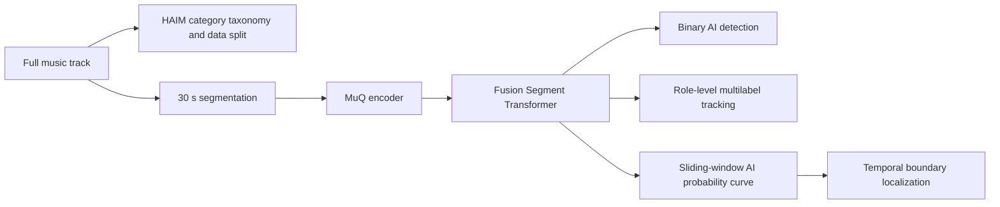
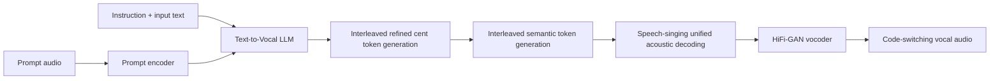
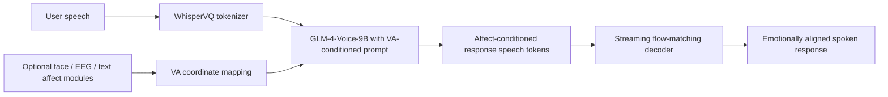

# 语音 / 音频 / 音乐论文速递
## 2026-06-02

> 实际对应 arXiv 更新日：**2026-06-02**  
> 检索范围：`cs.SD + eess.AS`  
> 只放按 ML 顶会审稿口径看，最值得多数读者花时间看的 **5 篇**

## 📋 总览

- 共收录 **5 篇** 相关论文
- 情感语音 / 语音生成控制：**2 篇**
- 音乐生成 / 视频配乐：**1 篇**
- 音乐检测 / 数据集：**1 篇**
- 语音与歌声统一生成：**1 篇**

今天这批最值得看的主线，不是“谁又堆了一个更大的音频模型”，而是三条更实用的路线。`DUET` 证明了扩散 / flow-matching TTS 的隐藏状态里本来就埋着可线性操纵的情感方向，重点不在再训一个情感 TTS，而在训练外插桩能否把 frozen backbone 拉出可控情感；`UniVocal` 则对准一个很少有人正面解决的场景，把 speech 和 singing 的自动切换从“人工打 tag”推进到由文本语义自己触发；`JenBridge` 的价值在于它没有停在短视频配一段 BGM，而是真把长视频的片段配乐、桥接转场、主观连贯性放进了同一套可评测系统。剩下两篇也不是凑数：`HAIM` 把 AI 音乐检测从二分类粗暴升级到制作环节级追踪，这对音乐取证和平台治理都更现实；`Sympatheia` 虽然还是合成数据驱动，但它至少把连续 valence-arousal 控制、语音对话和多模态情绪感知真连在了一起。

## 精选入选规则

- **新意（0-3）**：是不是提出了新的表示、接口、控制方式，或者把老问题拆得更对
- **影响力（0-3）**：是不是贴近 TTS、SpeechLLM、音乐生成、音频安全与评测这些主线
- **证据强度（0-2）**：有没有像样的 baseline、消融和关键数值
- **受众匹配度（0-2）**：对语音大模型 / 语音生成 / 音乐生成 / 平台治理研究者有没有直接启发

分数校准：

- **6**：可读，但更像局部补丁或任务定义稿
- **7**：信息量够，值得过一遍
- **8+**：建议优先精读

## 总览表

| 方向 | 序号 | 论文 | 评分 | 关键词 |
|---|---:|---|---:|---|
| 情感语音 / 情感控制 TTS | 1 | DUET | 8.5/10 | hidden-state steering, differentiable vocoder guidance, plug-and-play emotional TTS |
| 音乐生成 / 长视频配乐 | 2 | JenBridge | 8/10 | long-form soundtrack, adaptive transition, VMPT, LLM transition director |
| 音乐检测 / 数据集 | 3 | HAIM | 8/10 | AI music tracking, hybrid production, role-level attribution, temporal localization |
| 语音与歌声统一生成 | 4 | UniVocal | 8.5/10 | speech-singing code-switching, refined cent token, curriculum learning, SCSBench |
| 情感语音助手 / 多模态情绪感知 | 5 | Sympatheia | 7.5/10 | valence-arousal control, speech-to-speech dialogue, multimodal affect sensing |

## 🎭 情感语音 / 情感控制 TTS

### [1] DUET: Unified Dual-Space Emotion Control for Diffusion and Flow-Matching Driven Text-to-Speech

- **评分**：8.5/10
- **作者/机构**：Xu Zhang，Longbing Cao，Zhangkai Wu；Macquarie University Frontier AI Research Centre
- **论文链接**：https://arxiv.org/abs/2606.00066
- **PDF**：https://arxiv.org/pdf/2606.00066.pdf
- **代码链接**：暂无
- **Demo 链接**：文中未提供公开 demo

#### 📌 简介
这篇做的不是“再训练一个情感 TTS”，而是证明预训练扩散 / flow-matching TTS 的冻结隐藏状态里，本来就存在可线性解码的情感方向，而且和说话人身份方向几乎正交。`DUET` 在此基础上做了一个真正 plug-and-play 的双空间控制框架，用 hidden-state steering 管全局情感走向，用 mel-space guidance 修局部声学细节。

#### ☠️ 毒舌点评
这篇比大部分“情感可控 TTS”论文更有新意，因为它没有把答案预设成“多打标签重训一遍”。真正硬的部分是，它把 frozen backbone 里到底有没有稳定情感几何结构这件事做成了可验证结论。短板也很明显：目前还是离散情感类控制，angry 这类瞬态很强的情感仍然偏难；但对做情感语音、可控 TTS、机器人语音的人来说，值得认真读。

#### 🔧 技术方案
- **模型解决的问题**：现有情感 TTS 大多要用带标签语料重新训练，每换一个 backbone 都得重做一遍，而且情感常常和 speaker identity 糊在一起。`DUET` 要补的是“能不能在不重训 backbone 的前提下，对情感做可解释、可插拔的推理时控制”。
- **模型架构**：
  - **输入**：文本，以及某些 backbone 可选的中性参考语音。
  - **输出**：目标情感下的 mel 频谱与最终波形。
  - **主干**：冻结的 diffusion / flow-matching TTS backbone，例如 `GradTTS`、`F5-TTS`、`Matcha`、`ProDiff`、`StableTTS`。
  - **关键模块**：
    - `emotion probe`：在线性 probe 层面找出最能分离情感的隐藏层。
    - `discriminant direction`：从 probe 权重中取出目标情感方向。
    - `hidden-state steering`：在采样每一步沿情感方向推动隐藏状态。
    - `mel-space guidance`：通过可微 vocoder 把情感识别器梯度反传到 mel 空间，补局部谱细节。
    - `dual-space update`：把两种干预并到同一 denoising step。
- **信号流**：

- **关键设计 / 核心创新**：
  - 论文最值钱的发现是：预训练 TTS hidden state 中，情感方向是线性可解的，而且与 speaker direction 近似正交。文中在 `F5-TTS` 上给出 `|cos θ| = 0.029`，这不是随口说 disentangle。
  - hidden-state steering 解决全局韵律方向，mel guidance 解决愤怒类情感里的局部尖锐谱细节，两者分工很清楚。
  - 不是所有 inference-time control 都能迁到 TTS；作者明确说明仅靠表示层操作够不到最终波形细节，所以才要引入 differentiable vocoder 路线。
- **训练 / 推理策略**：
  - backbone 完全冻结，不做情感监督重训。
  - probe 使用带情感标签语料做线性分类训练，只为找层和方向。
  - 评测使用 `HuBERT-large` 与 `WavLM-large` 两个独立 SER 模型做宏平均，避免单一 evaluator 偏置。
  - 所有结果在单张 `NVIDIA H100` 上跑，数值取 `3` 次独立运行平均。
  - 推理时 guidance 强度按 backbone 尺度调节，文中没有把所有模型强行套一个超参。

#### 📊 实验结果
- 数据集：`ESD`、`CREMA-D`、`IEMOCAP`
- 与 10 个有监督情感 TTS baseline 对比：
  - `ESD` 上最强 baseline 是 `Qwen3-TTS`，平均情感准确率 `46.8%`
  - `DUET + GradTTS` 达到 `75.5%`，绝对提升 `+28.7`
  - `DUET + F5-TTS` 为 `64.9%`，`DUET + Matcha` 为 `64.3%`，`DUET + ProDiff` 为 `63.6%`
- 跨语料泛化：
  - `CREMA-D` 上 `DUET + ProDiff` 达到 `75.5%` 平均准确率
  - `IEMOCAP` 上 `DUET + Matcha` 达到 `75.8%`
  - 即便最弱的 `StableTTS`，在 `IEMOCAP` 也有 `48.8%`，仍高于全部 supervised baseline
- 消融：
  - 完整 `DUET` 在 `F5-TTS + ESD` 上平均准确率 `64.9`
  - 去掉 mel guidance 只剩 steering，降到 `45.4`
  - 去掉 steering 只剩 guidance，进一步掉到 `40.6`
  - 说明两者不是装饰性堆叠，是真互补
- 主观评测：
  - `DUET` 的 `EMOS 3.93`，高于 `Qwen3-TTS 3.75` 和 `CosyVoice2 3.32`
  - `NMOS 3.83`，略低于 `Qwen3-TTS 4.18`，但高于 `EmoKnob 3.54`
- baseline 名称：`Qwen3-TTS`、`CosyVoice2`、`EmoVoice`、`Chatterbox`、`ChatTTS`、`IndexTTS2`、`OpenAudio`、`EmoSphere++`、`EmotiVoice`、`EmoKnob`

#### 💡 为什么值得看
这篇最值得看的地方，不是“情感 TTS 效果又涨了”，而是它给了一个更通用的看法：很多控制能力其实已经潜伏在大模型 / 生成模型表示空间里，只是以前没人把几何结构挖出来。对于以后做情感控制、说话风格控制甚至更细粒度语音属性编辑，这篇都很像一个可迁移的方法论起点。

## 🎼 音乐生成 / 长视频配乐

### [2] JenBridge: Adaptive Long-Form Video Soundtracking across Scene Transitions

- **评分**：8/10
- **作者/机构**：Jiashuo Yu，Yao Yao，Boyu Chen，Alex Wang；Jen Music AI
- **论文链接**：https://arxiv.org/abs/2606.01703
- **PDF**：https://arxiv.org/pdf/2606.01703.pdf
- **代码链接**：文中说明将公开代码与 benchmark，当前未给正式仓库
- **Demo 链接**：文中未给独立 demo 页

#### 📌 简介
这篇想解决的是长视频自动配乐里最尴尬的一段空白：短视频音乐生成已经很多，但一到多场景长视频，系统要么整段生成一首大而空的音乐，要么简单拼接导致转场极烂。`JenBridge` 把问题拆成片段级配乐和片段间转场两部分，再加一个 LLM 作为“转场导演”去选过桥策略。

#### ☠️ 毒舌点评
这篇不是“音乐大模型”那种炫参数论文，而是一个很工程化、很系统的工作。优点是任务切得准，benchmark 也补到了长视频这个真实缺口；缺点是它有明显系统堆叠味道，模块不少，未来复现门槛不低。如果你只关心纯生成模型结构，这篇不一定让你热血沸腾；但如果你真做视频配乐产品，它比很多花哨 text-to-music paper 更有用。

#### 🔧 技术方案
- **模型解决的问题**：现有 video-to-music 系统一般只处理单个短 clip，既不会处理多场景叙事，也没机制保证转场自然。`JenBridge` 要补的是“如何让长视频每段音乐既贴画面，又能在段与段之间平滑过桥”。
- **模型架构**：
  - **输入**：长视频序列。
  - **输出**：与视频同步的长时长背景音乐。
  - **主干**：`视频切段 -> 片段级视频配乐生成 -> 自适应转场` 三段式系统。
  - **关键模块**：
    - `semantic video segmentation`：用 `PySceneDetect` 按语义切段。
    - `VMPT`：把视频 caption 翻译成更适合音乐生成的 prompt。
    - `MMDiT`：在 neural audio codec latent 上做 text / video 条件生成。
    - `transition toolkit`：提供 `abrupt cut`、`silent gap`、`fade-out/fade-in`、`generative transition` 四类转场。
    - `LLM agent`：使用 `Qwen3-8B` 根据前后场景与音乐上下文自动选转场类型。
    - `inpainting transition model`：用 ControlNet 风格 inpainting 在两段音乐中间补桥。
- **信号流**：

- **关键设计 / 核心创新**：
  - 这篇真正的创新不在单个 backbone，而在把“片段生成”和“跨片段叙事连贯性”分开建模。
  - 转场工具箱不是花样列表，而是明确区分什么时候用 abrupt cut，什么时候需要生成式 bridge。
  - 生成式桥接不是重新训一个大 transition model，而是利用大规模 text-audio 数据训练出的 inpainting 模型，再通过 `slerp` 插值文本与 latent 条件来做训练外适配。
- **训练 / 推理策略**：
  - `VMPT` 在 `V2M-20k` 上微调，使用 `Qwen3-8B + LoRA`，训练 `3 epochs`，硬件是 `2 x A800 80G`
  - Stage 1 文本到音乐模型用 `100k` 首授权高保真歌曲、约 `3700h` 音频，训练 `400k steps`，`64 x A800`
  - transition inpainting 模型在同数据上继续训 `100k steps`
  - Stage 2 视频对齐用筛选后的 `110k` 视频-音乐样本、约 `600h`，训练 `200k steps`，`8 x A800`
  - LLM agent 通过 few-shot in-context learning 直接做转场决策，不再额外监督训练

#### 📊 实验结果
- 基准：作者新建 `LVS Benchmark`
- 对比 baseline：`CMTS`、`CMTL`、`LORIS`、`AudioX`、`VidMuseS`、`VidMuseL`
- 客观指标：
  - `JenBridge` 的 `ImageBindavg 0.224`，高于最强 baseline `VidMuseS 0.162`
  - `PQ 8.12`，高于 `VidMuseL 6.89`
  - `PC 7.83`，比最佳长视频 baseline `VidMuseL 5.56` 高 `+2.27`
  - `CE 8.21`，也领先所有基线
- 主观指标：
  - `Music 4.4`，`Alignment 4.3`，`Transition 4.2`，`Overall 4.3`
  - 其中 `Transition 4.2` 比 `VidMuseL 2.5` 高 `+1.7`
  - 作者还特别指出，相比所有简单拼接系统，JenBridge 的转场分数基本翻倍
- 消融（Table 2）：
  - 去掉 `Adaptive Transition`，`Transition 4.2 -> 2.8`
  - 去掉 `Visual Conditioning`，`ImageBind 0.224 -> 0.171`
  - 去掉 `VMPT`，`PQ 8.12 -> 7.48`
  - 去掉 `LLM Agent`，`Transition 4.2 -> 3.5`
  - `slerp` 换成 `lerp` 也有小幅退化：`Transition 4.2 -> 3.9`
- baseline 名称：`CMTS`、`CMTL`、`LORIS`、`AudioX`、`VidMuseS`、`VidMuseL`

#### 💡 为什么值得看
这篇最值得看的地方，是它终于把长视频自动配乐里真正烦人的部分拿出来正面做了。很多生成论文都默认“生成一段就算完”，但真实配乐系统最难的往往是前后段落怎么接。`JenBridge` 给出的不是终极答案，但它已经是一套可以直接拿来拆产品 pipeline 的设计图。

## 🧪 音乐检测 / 数据集

### [3] HAIM: Human-AI Music Datasets for AI Music Production Tracking Benchmark

- **评分**：8/10
- **作者/机构**：Seonghyeon Go，Yumin Kim；论文正文未明确给出机构
- **论文链接**：https://arxiv.org/abs/2606.01686
- **PDF**：https://arxiv.org/pdf/2606.01686.pdf
- **代码链接**：暂无
- **Demo 链接**：暂无

#### 📌 简介
这篇的核心不是“再做一个 AI 音乐检测数据集”，而是把任务本身从二分类改成更细的 `AI music tracking`。作者的观点很直接：现实里已经不是一首歌全人类 or 全 AI 这么干净了，AI 可以只做 vocal、只做 master、只做中间一段拼接，如果数据和模型还只会出一个二元标签，那就已经脱离真实生产流程了。

#### ☠️ 毒舌点评
这是那种任务定义和数据集比模型本身更有价值的论文。它不花哨，但问题问得比大多数“AI 音乐检测 99% 准确率”论文都更现实。缺点也要说清楚：role-level attribution 目前还很不稳，尤其 lyricist 这种从纯音频几乎看不出来的角色，作者自己也没装懂。尽管如此，这篇对做音乐取证、平台审查、版权治理的人非常值得看。

#### 🔧 技术方案
- **模型解决的问题**：现有 AI 音乐检测默认整首歌只有一个来源标签，但真实生产里可能是 human 作曲 + AI vocal + human mastering，或者 AI 片段插在整首歌中间。`HAIM` 要解决的是“如何把 AI 介入精确到制作角色和时间区间，而不是只给 whole-track binary label”。
- **模型架构**：
  - **输入**：完整歌曲音频。
  - **输出**：二分类 AI 检测结果、四角色级 AI 参与概率、以及时间轴上的 AI 段落定位。
  - **主干**：数据集 + benchmark 为主，模型采用改造后的 `MuQ-FST`。
  - **关键模块**：
    - `HAIM taxonomy`：13 个类别，覆盖 baseline、hybrid、temporal mix 三大组。
    - `MuQ encoder`：333M 参数音乐理解 backbone，输入 30 秒 segment。
    - `Fusion Segment Transformer`：汇聚 segment-level 特征做整曲判断。
    - `multilabel head`：输出 `Composer / Lyricist / Vocalist / Engineer` 四角色 AI 概率。
    - `sliding-window temporal localization`：用 10s 窗、1s hop 把 segment 概率曲线转成边界。
- **信号流**：

- **关键设计 / 核心创新**：
  - `HAIM` 最大的贡献是任务粒度，不是把旧 benchmark 做大一点。
  - 13 类设计里最关键的是把 `B1-B9` 这类 hybrid production 和 `C1-C2` 这种 temporal mixing 都拉进来了。
  - 作者明确承认 lyric / role attribution 不是纯声学就能完全解决，这比很多假装“全都能测”的工作诚实。
- **训练 / 推理策略**：
  - 数据总量约 `196,000` 首，按 `A1/A2/B/C` 三大组组织。
  - `A1` 纯人类音乐 `94,654` 首，`A2` 全 AI `55,485` 首。
  - `B1-B4` 每类 `6,000` 首，`B5` `2,040` 首，`B6-B9` 每类 `2,000` 首。
  - `C1/C2` 各 `6,000` 首，用于时序混合定位。
  - `MuQ-FST` 训练使用 `AdamW`，学习率 `5e-6`，有效 batch size `64`，并只微调 MuQ 后 `6` 层。

#### 📊 实验结果
- 任务定义：
  - `A1` 到 `A2` 是 binary 真标签端点
  - `B1-B9` 是混合制作链
  - `C1/C2` 是时间轴混合
- 二分类检测（Table 4）：
  - `MuQ-FST` 在 `A1` 假阳率仅 `0.1%`
  - 在 `A2` 全 AI 检出率 `99.8%`
  - `Deezer` 为 `A1 1.7 / A2 74.2`
  - `SpecTTTra` 只有 `A2 44.8`
  - `FST` 为 `A2 59.8`
- source-level breakdown（Table 5）：
  - `MuQ-FST` 对 `Suno / ACE / MusicGen / Udio / Mureka / Lyria` 六类生成器分别为 `99.9 / 99.8 / 100.0 / 99.8 / 99.6 / 100.0`
  - `Deezer` 对 `Lyria` 只有 `8.3%`，暴露明显 source dependence
  - `FST` 对 `Mureka` 只有 `2.5%`
- hybrid categories：
  - `B1`（AI mastering human track）对多数检测器触发很弱，但 `MuQ-FST` 会给到 `52.0%`
  - `B2-B4` 在 `Deezer` 和 `MuQ-FST` 上都接近 `100%`，说明 AI 生成指纹经过传统后期并不会自然消失
- temporal localization（Table 7）：
  - 使用 `10s` window 时，`C1` 边界 `F1 = 0.914`
  - `C2` 边界 `F1 = 0.783`
  - 作者明确说这是 zero-shot emergent capability，不是专门加 boundary supervision 训出来的
- baseline 名称：`Deezer`、`SpecTTTra`、`CLAM`、`FST`、`MuQ-FST`

#### 💡 为什么值得看
这篇最值得看的点，是它把 AI 音乐检测从一个“刷准确率”的静态问题，改造成了更像现实取证和治理的动态问题。以后平台如果真要判断一首歌里 AI 到底参与了什么环节、参与了多大程度，路线更接近 `HAIM` 这种 tracking，而不是继续死磕整曲二分类。

## 🎙️ 语音与歌声统一生成

### [4] UniVocal: Unified Speech-Singing Code-Switching Synthesis

- **评分**：8.5/10
- **作者/机构**：Yufei Shi，Qian Chen，Wen Wang，Xiangang Li，Zhen-Hua Ling，Yang Ai；Alibaba Group Tongyi Fun Team，Independent Researcher
- **论文链接**：https://arxiv.org/abs/2606.01677
- **PDF**：https://arxiv.org/pdf/2606.01677.pdf
- **代码链接**：**代码已开源** https://github.com/FunAudioLLM/FunResearch/tree/main/UniVocal
- **Demo 链接**：https://project-univocal-demo.github.io/demo/

#### 📌 简介
这篇盯上的问题很少有人正经做：在一个输出里自然地从 speech 切到 singing，再切回来，而且切换点由文本语义自己决定，而不是靠人工插 `<sing>` 标签。`UniVocal` 在 `CosyVoice 2` 基础上用两阶段课程学习、合成数据流水线和 `refined cent token + CoT` 机制，把 `speech-singing code-switching` 做成了单模型任务。

#### ☠️ 毒舌点评
这篇是真有工作量。很多“统一 speech + singing”论文最后只是多任务拼一起，真正要切换时还是靠显式控制符。`UniVocal` 至少把“何时切”也拉进建模目标里了。缺点是 implicit-only 场景依然难，作者自己的案例分析也承认模型会误把歌词样文本当叙述 prose；但整体上，这已经比大多数只会喊 unified audio generation 的工作更接近真实能力。

#### 🔧 技术方案
- **模型解决的问题**：现有 TTS 只会说，SVS 只会唱，所谓 unified audio model 大多也只是“一次生成一种模式”。`UniVocal` 要解决的是“同一段文本里什么时候该说、什么时候该唱，能不能不靠标签，由语义自己触发”。
- **模型架构**：
  - **输入**：待生成文本，以及可选的自然语言任务说明 / prompt 音频。
  - **输出**：可在 speech 与 singing 间切换的 vocal audio。
  - **主干**：基于 `CosyVoice 2` 适配出的 `Text-to-Vocal LLM`。
  - **关键模块**：
    - `refined cent token`：用 cent 级高分辨率 pitch token 补足语义 tokenizer 丢掉的细粒度旋律信息。
    - `interleaved CoT generation`：先在序列里交错生成 refined cent token 与 semantic token，先计划 prosody / melody，再补内容。
    - `two-stage curriculum learning`：Stage 1 对齐 speech / singing latent space，Stage 2 学自动切换。
    - `scalable synthetic data pipeline`：用 LLM 生成多场景 script，再用 stage-1 模型合成 SCS 训练数据。
    - `SCSBench`：专门测切换点对不对。
- **信号流**：

- **关键设计 / 核心创新**：
  - `refined cent token` 很关键。作者明确指出 chromagram 12 半音分辨率太粗，不够建模 speech prosody；所以改成 cent 级 pitch 表示。
  - `CoT` 在这里不是语言模型花活，而是先显式起草音高轨迹，再生成语义 token，属于真正有作用的 planning。
  - 两阶段课程学习是必要的：先把说和唱对齐进同一 latent space，再学 mode switching，否则直接一锅炖会塌。
- **训练 / 推理策略**：
  - Stage 1 在 `CosyVoice 2` 上继续预训练，speech : singing 比例约 `1 : 4`
  - Stage 2 加入合成的 code-switching 数据，学习自动切换
  - 合成数据先用 Gemini 生成语义自然、含隐式和显式切换线索的脚本，再用 stage-1 模型合成
  - 训练使用 `A800 GPUs`，正文说明细节在 appendix
  - 模型有标准配置和 expressive 配置：前者更适合对齐密集任务，后者带 CoT，更适合美学表现

#### 📊 实验结果
- `SCSBench` 切换准确率（Table 1）：
  - `SCSBench-Mixed` 上 `UniVocal` 达到 `F1(O) 0.871 / F1(S) 0.810`
  - 显著高于 `Gemini + Bark` 的 `0.465 / 0.199`
  - 也高于 cascaded baseline `Gemini + Cosy2 + LeVo` 的 `0.607 / 0.566`
- SCS 语音质量（Table 2）：
  - `SCSBench-Mixed` 上 `WER 10.90`，`UTMOS 4.36`
  - `SCSBench-Implicit` 上 `WER 5.83`，明显优于 `Gemini + Cosy2 + LeVo` 的 `17.97`
  - 但 `SIM` 不如 cascaded baseline，说明 timbre consistency 还不是绝对领先
- 常规 TTS（Table 3）：
  - `SeedTTS-EN` 上 `UniVocal WER 2.69 / SIM 0.703 / UTMOS 4.21`
  - 对比 `CosyVoice 2` 的 `2.96 / 0.744 / 4.18`
  - 语义正确性和自然度保住了，但 speaker similarity 没有赢 `CosyVoice 2`
- singing generation（Table 4）：
  - `GTsinger` 上 `AES 5.44 / WER 18.07 / SIM 0.703 / QUA 10.70`
  - `Fullsong` 上 `WER 35.88 / SIM 0.72 / QUA 7.75 / N-MOS 2.23 / M-MOS 2.18`
  - 比 `Vevo 1.5` 的 `N-MOS 2.17 / M-MOS 2.08` 更好，也比 `LeVo` 更稳
- 消融（Table 5）：
  - 去掉 `CoT` 后，`E-MOS 2.26 -> 2.03`，`P-MOS 2.22 -> 1.84`，`SCSBench-Mixed WER 5.99 -> 10.90`
  - 但 `F1` 反而从 `0.716` 升到 `0.810`，说明 CoT 更偏提升美学和 intelligibility，不一定提升切换边界稳定性
  - 去掉 curriculum learning 后，`F1` 直接掉到 `0.496`，这是更致命的损失
- baseline 名称：`Gemini + Bark`、`Gemini + Cosy2 + LeVo`、`F5-TTS`、`CosyVoice 2`、`Vevo 1.5`、`YuE`、`LeVo`

#### 💡 为什么值得看
这篇最值得看的，不是“speech 和 singing 都能做”，而是它把二者之间的切换本身当成了任务。以后如果要做会讲、会唱、会哼的多模态角色语音，这种从文本语义直接触发 mode switching 的路线，比继续堆一堆手工 tag 更像可扩展方向。

## 💬 情感语音助手 / 多模态情绪感知

### [5] Sympatheia: Emotionally Adaptive Voice Assistant with Continuous Affect Conditioning

- **评分**：7.5/10
- **作者/机构**：Sukru Samet Dindar，Riki Shimizu，Xilin Jiang，Nima Mesgarani；Columbia University Department of Electrical Engineering
- **论文链接**：https://arxiv.org/abs/2606.00851
- **PDF**：https://arxiv.org/pdf/2606.00851.pdf
- **代码链接**：**代码已开源** https://github.com/susameddin/sympatheia
- **Demo 链接**：https://susameddin.github.io/sympatheia/

#### 📌 简介
这篇想做的是一个真正会“带情绪回应”的 speech-to-speech 语音助手，而且不只靠用户说话里那点含糊的情绪线索，还允许外部模块给它一个连续的 `valence-arousal` 条件。`Sympatheia` 基于 `GLM-4-Voice` 做 LoRA 微调，再配上作者构造的 `Sympatheia-18k` 数据集，让模型既能从语音隐式推情绪，也能显式吃 VA 控制信号。

#### ☠️ 毒舌点评
这篇胜在把问题设得很现实：真实对话里用户情绪常常不明显，单靠语音自己猜确实不够。它也没有再走离散 emotion label 那条老路，而是用 VA 连续空间做接口。缺点也同样明显：数据还是合成的，评测很大程度靠 Qwen3-Omni judge，离真实人类长期对话还差一大截。所以这篇更像一篇“方向靠谱、证据中上”的系统稿，而不是已经把 empathetic assistant 做成了。

#### 🔧 技术方案
- **模型解决的问题**：很多情感对话系统默认用户情绪在语音里表达得很强，但真实场景常常是 neutral、暧昧甚至混合情绪，单模态推理容易跑偏。`Sympatheia` 要解决的是“如何把语音中的隐式情绪和外部多模态情绪估计用一个统一接口喂给 speech assistant”。
- **模型架构**：
  - **输入**：用户语音，以及可选的连续 `valence-arousal (VA)` 条件。
  - **输出**：语义和情绪都对齐的语音回复。
  - **主干**：`WhisperVQ tokenizer + GLM-4-Voice-9B + streaming flow-matching decoder`
  - **关键模块**：
    - `single-codebook discrete speech tokens`：12.5 Hz 语音 token 化。
    - `VA prompt interface`：在 system prompt 中显式插入 `(valence=v, arousal=a)`。
    - `multimodal sensing adapters`：把 face、EEG、eye tracking、ECG、GSR、text description 等都映射到统一 VA 坐标。
    - `condition dropout`：训练时随机对三分之一非中性样本丢掉 VA，逼模型保留从语音自身推情绪的能力。
- **信号流**：

- **关键设计 / 核心创新**：
  - 用连续 VA 而不是离散 label 做接口，这一点比“你是 angry 还是 happy”更适合真实模糊情绪。
  - 统一接口设计得很朴素，但很实用：任何感知模块只要能给 VA，就能接进来。
  - condition dropout 这个细节很重要，否则模型很容易过度依赖外部 cue，一旦没 cue 就废掉。
- **训练 / 推理策略**：
  - backbone 是 `GLM-4-Voice-9B`，只做 `LoRA` 微调。
  - speech tokenizer 为 `WhisperVQ`，12.5 Hz 单码本 token。
  - 训练数据 `Sympatheia-18k`，包含 12 个情绪锚点，并专门设置 neutral split，让同一 query 能对应多种情绪化回复。
  - 训练时对三分之一非中性样本随机丢掉 VA 条件。
  - 推理时如果没有外部情绪模块，就省略 VA prompt，让模型只依赖语音自身。

#### 📊 实验结果
- 自动评测（Table 1）：
  - `Sympatheia-Neutral 4.37`，显著高于 `GLM-4-Voice 1.76`
  - `Sympatheia-Emotional 4.74`，略高于 `Qwen3-Omni 4.69`
  - `VoiceBench-CommonEval 4.22`，高于 `Kimi-Audio 3.75`
  - `Emotion MOS 3.86`，高于 `Qwen3-Omni 3.32` 与 `GLM-4-Voice 2.23`
  - 同时 semantic / lexical similarity 更低（`0.801 / 0.223`），说明输出会随目标情绪变化，而不是所有情绪都给一个标准答案
- prosody correlation（Table 2）：
  - `F0μ 0.28/0.40`，`F0σ 0.23/0.46`
  - `F0 range 0.23/0.45`
  - 能量和谱质心相关性也普遍高于 `GLM-4-Voice`、`Qwen3-Omni`、`Kimi-Audio`
  - 说明模型真把 VA 信号落到了语音表达上，不只是文字内容变了
- 多模态情绪感知（Table 3）：
  - face offline：`with cue 3.64` vs `without cue 1.92`
  - face live：`3.39` vs `1.98`
  - EEG：`3.14` vs `1.75`
  - text description：`3.57` vs `1.63`
  - 证明外部 cue 在 speech 本身不明显时确实有帮助
- 对话能力保留：
  - 微调后 `UTMOS 4.18`，高于 base `4.02`
  - `BERT F1 0.627` vs `0.569`
  - `ASR-WER 5.42` vs `5.73`
  - 至少没把原本对话能力训坏
- baseline 名称：`GLM-4-Voice`、`Qwen3-Omni`、`Qwen2.5-Omni`、`Kimi-Audio`、`OpenS2S`、`OSUM-EChat`

#### 💡 为什么值得看
这篇最值得看的，是它把“情绪感知”和“语音助手”之间的接口设计得足够干净。哪怕你不照搬它的模型，`continuous VA as system interface` 这个思路也很值得借。它离真正可信的 empathetic assistant 还有距离，但至少不是再做一遍离散情绪分类然后硬塞进对话模板。

## 最后结论

今天最值得优先看的顺序，我给的是：

1. `DUET`：如果你关心情感可控 TTS，这篇最有方法论价值，训练外控制思路明显比“重训一个情感模型”更可迁移。
2. `UniVocal`：真正在做 speech / singing 混合生成的人应该先看它，任务定义、数据构造、课程学习和 CoT 设计都比较完整。
3. `JenBridge`：长视频自动配乐里最稀缺的是转场和连贯性，这篇正好踩在那个真实痛点上。
4. `HAIM`：不是最 flashy，但对音乐平台治理和 AI 取证很重要，任务粒度升级比模型本身更值钱。
5. `Sympatheia`：方向靠谱，接口设计干净，但离真实世界长期对话还有数据与评测上的欠账。
