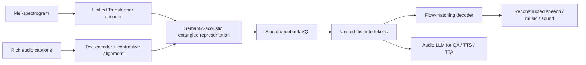
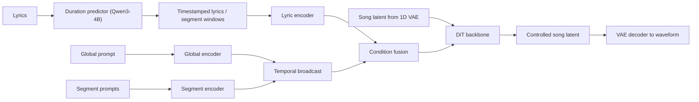
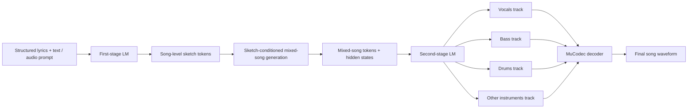
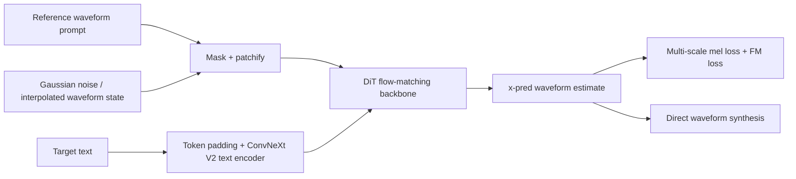
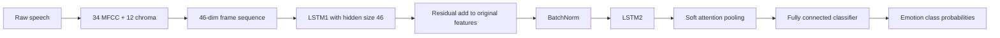

# 语音 / 音频 / 音乐论文速递
## 2026-06-03

> 实际对应 arXiv 更新日：**2026-06-03**  
> 检索范围：`cs.SD + eess.AS`  
> 只放按 ML 顶会审稿口径看，最值得多数读者花时间看的 **5 篇**

## 📋 总览

- 共收录 **5 篇** 相关论文
- 语音 tokenizer / audio LLM 表示：**1 篇**
- 可控歌曲生成：**2 篇**
- 零样本 TTS / 波形建模：**1 篇**
- 轻量语音前端 / 情感识别：**1 篇**

今天这批真正值得优先看的主线有三条。第一条是 `EntangleCodec` 代表的“统一离散 token 到底能不能同时撑住理解和生成”，这篇不是讲故事，理解、重建、TTS、TTA 和大模型 scaling 都给了硬证据。第二条是 `SegTune + SketchSong` 这组歌生成论文，核心不是“谁声音更像商用产品”，而是谁真正把 song-level planning 和 segment-level control 拆清楚了；这对后面做可编辑、可交互音乐生成的人更有价值。第三条是 `WavTTS`，它认真回答了“脱离 codec / mel 中间表示，直接做 raw waveform zero-shot TTS 是否可行”，而且不是只放 demo，训练目标、噪声调度、推理时间步都做了成体系验证。

剩下的 `ResLSTM-SA` 不属于范式级新东西，但它是这批里最务实的一篇：如果你需要一个几十 K 参数、能在边缘设备上跑的 SER baseline，这种工作比再堆一个 3 亿参数 SSL 大模型更有工程意义。

## 精选入选规则

- **新意（0-3）**：是不是提出了新的表示、控制接口、训练组织方式，或者把老问题拆得更对
- **影响力（0-3）**：是不是贴近语音大模型、TTS、歌曲生成、前端部署这些主线
- **证据强度（0-2）**：有没有像样的 baseline、消融和关键数值
- **受众匹配度（0-2）**：对语音大模型 / 语音前端 / 音乐生成 / 语音识别研究者有没有直接启发

分数校准：

- **6**：可读，但更像局部补丁或窄场景实验
- **7**：信息量够，值得过一遍
- **8+**：建议优先精读

## 总览表

| 方向 | 序号 | 论文 | 评分 | 关键词 |
|---|---:|---|---:|---|
| 统一表示 / audio LLM | 1 | EntangleCodec | 9/10 | unified discrete tokenizer, rich caption alignment, TTS/TTA/QA, MMAR scaling |
| 可控歌曲生成 | 2 | SegTune | 8.5/10 | segment prompt, duration predictor, DiT song generation, fine-grained control |
| 零样本 TTS / 波形建模 | 3 | WavTTS | 8.5/10 | raw waveform flow matching, mel auxiliary loss, PolyShift, zero-shot TTS |
| 轻量语音前端 / SER | 4 | ResLSTM-SA | 7/10 | residual LSTM, soft attention, MFCC+chroma, edge deployment |
| 歌曲生成 / 分层规划 | 5 | SketchSong | 8/10 | sketch planning, 4-track modeling, LeVo extension, arrangement control |

## 🤖 统一表示 / audio LLM

### [1] EntangleCodec: A Unified Discrete Audio Tokenizer via Semantic-Acoustic Entanglement

- **评分**：9/10
- **作者/机构**：Hui Li, Yangfan Gao, Junlin Shang, Changhao Jiang, Tao Gui, Qi Zhang, Xuanjing Huang；Fudan University
- **论文链接**：https://arxiv.org/abs/2606.02739
- **PDF**：https://arxiv.org/pdf/2606.02739.pdf
- **代码链接**：**代码已开源** https://github.com/luckyerr/EntangleCodec
- **Demo 链接**：暂无

#### 📌 简介
这篇做的不是“再发明一个 codec 名字”，而是试图把离散 audio tokenizer 真正做成统一接口：同一套 token 既能做重建，又能做 audio understanding，还能直接接 TTS 和 text-to-audio。它的关键思路是把语义和声学先在量化前纠缠到同一个表示里，再做离散化，而不是像很多语义 codec 那样分成 semantic / acoustic 双流后面再缝起来。

#### ☠️ 毒舌点评
这篇是今天最值得先读的一篇。原因不是“参数大”，而是它真把 codec 论文最容易糊弄的地方堵上了：统一表示、重建质量、下游理解、生成任务、LLM scaling 都给了同一套实验链。短板也有，`TTA` 的音质分数还没全面压过纯重建型 codec，8B 也离真正超大模型很远，但这已经不是换皮 incremental 了。

#### 🔧 技术方案
- **模型解决的问题**：传统重建型 codec 保真但不懂语义，适合压缩不适合问答；语义型 tokenizer 又常常拆成两个流，量化前后容易语义和声学打架。`EntangleCodec` 想补的是“能不能在单一离散 token 流里同时保住语言内容、说话人、情感、韵律和一般声音事件”，让 audio LLM 不必为理解和生成分别维护两套表示。
- **模型架构**：
  - **输入**：`128` 维 mel-spectrogram 序列，外加由 LLM 生成的 rich audio captions。
  - **输出**：单码本离散 token 序列，以及基于这些 token 重建出的音频表征。
  - **主干**：`unified encoder + single-codebook vector quantizer + flow-matching decoder`。
  - **关键模块**：
    - `Unified Encoder`：不用双编码器，而是先把语义和声学压进同一前量化表示。
    - `Rich Semantic Alignment`：不用 ASR transcript，而是用 rich captions 做 CLIP 风格对比学习。
    - `Single-codebook VQ`：把融合后的语义-声学表示量化成统一 token。
    - `Flow-Matching Decoder`：基于 Rectified Flow 的解码器，负责把 token 还原成可重建的音频表征。
    - `Two-stage training`：第一阶段联合学 encoder/text encoder/quantizer/decoder；第二阶段冻结编码端，只精修 decoder 重建质量。
- **信号流**：

- **关键设计 / 核心创新**：
  - 真正的新点不是“加个对比学习损失”，而是把 rich caption 对齐放在量化前，让语义和声学先纠缠再离散化。
  - 监督信号从 ASR-only 升级为 speaker identity、emotion、prosody、scene 全覆盖的文本描述，直接改变 token 的可问答性。
  - 同一套 token 可以被同一个 audio LLM 当成问答输入，也可以当成 TTS / TTA 的生成目标，不需要任务专属 tokenizer。
- **训练 / 推理策略**：
  - 训练数据覆盖 `LibriSpeech`、`MusicBench`、`AudioSet`、`AudioCaps`、`WavCaps` 等 speech / music / general audio 混合语料。
  - 第一阶段用 `Lflow + LVQ + contrastive loss` 联合训练，建立语义-声学统一表示。
  - 第二阶段冻结 encoder 和 quantizer，丢掉 text encoder，只训练 decoder，专门补重建质量。
  - 下游理解和生成任务使用统一 token 接到 `Qwen3-0.6B` 音频语言模型上做 codec-controlled 对比；scale-up 实验再扩到 `4B` 和 `8B`。
  - 论文重点报告的是表示质量和下游性能，推理延迟不是主卖点，文中没有给统一的端到端 RTF。

#### 📊 实验结果
- **重建质量**：
  - 语音重建上，`EntangleCodec` 的 `UTMOS 3.96`，只略低于 `XCodec2 4.02`，`F1 0.98` 追平最好基线。
  - 在 sound / music `AudioBoxScore` 上，它不是每个子项都第一，但能稳定排在前列，是少数同时兼顾 speech、sound、music 的统一 tokenizer。
  - 作者明确点名对比 `DAC-Codec`、`EnCodec`、`WavTokenizer`、`SpeechTokenizer`、`XCodec`、`XCodec2`、`Mimi`、`XY-Tokenizer`。
- **音频理解**：
  - 在统一 `Qwen3-0.6B` backbone 下，`EntangleCodec` 在 `MMAU-mini / MMAU / MMAR` 上分别做到 `34.2 / 35.1 / 34.3`。
  - 相比第二好的离散 tokenizer，提升分别是 `+1.5 / +2.5 / +7.4`，其中 `MMAR` 的增益最大，说明它对细粒度语义和音乐/声音推理更有帮助。
  - `0.6B` 的 `EntangleCodec-LLM` 已经能超过 `SALMONN-13B` 在三项 benchmark 上的结果，而且参数少 `22x`。
  - scale 到 `8B` 后，`MMAU-mini / MMAU / MMAR` 达到 `56.2 / 52.6 / 42.6`，`MMAR` 明确超过所有对比系统。
- **生成任务**：
  - 在 codec-controlled `TTS` 上，`WER 9.8%`、`UTMOS 3.89`，比第二好的 codec 基线再降 `2.3` 个点 WER，`UTMOS` 多 `+0.94`。
  - 在 `TTA` 上，`CLAP 0.17`，比第二名高 `+0.13`，是 `XY-Tokenizer 0.04` 的四倍多。
  - 不过 `AudioBoxScore` 仍略输 `XCodec`，这说明它的统一表示不是在所有感知质量维度都绝对最强。
- **消融**：
  - 去掉 contrastive loss 后，`UTMOS 3.96 -> 3.04`，`SIM 0.66 -> 0.50`，跌得非常明显。
  - 用 ASR-only 替代 rich captions 后，`UTMOS 3.96 -> 3.24`，`SIM 0.66 -> 0.51`，说明 rich caption 的增益不是噱头。
  - 不做第二阶段 decoder refinement，`UTMOS` 也会掉到 `3.40`。

#### 💡 为什么值得看
如果你做 audio LLM，这篇最值钱的地方不是“它又赢了几分 benchmark”，而是它把一个长期被默认接受的前提拆掉了：离散 tokenizer 不一定只能服务重建，表示质量本身也能决定后面的理解上限。它把“token 设计”和“模型规模”放到了同一张桌子上比较，这个视角比很多一味堆大模型的论文更有启发。

#### 评分：9/10
理由：问题抓得准，实验链完整，结论和方法是闭环的。扣分点主要在于统一表示还没把所有生成指标都做成绝对第一，但今天这批里它最像一篇能影响后续路线的论文。

## 🎼 可控歌曲生成

### [2] SegTune: Structured and Fine-Grained Control for Song Generation

- **评分**：8.5/10
- **作者/机构**：Yuejiao Wang, Zihao Ji, Pengfei Cai, Xu Li, Haorui Zheng, Zewen Song, Zhongliang Liu, Chen Zhang, Pengfei Wan；Kling Team, Kuaishou Technology / 中国科学技术大学 / 北京大学
- **论文链接**：https://arxiv.org/abs/2606.02638
- **PDF**：https://arxiv.org/pdf/2606.02638.pdf
- **代码链接**：**代码已开源** https://github.com/KlingAIResearch/SegTune
- **Demo 链接**：https://github.com/KlingAIResearch/SegTune

#### 📌 简介
`SegTune` 想解决的是当前 open-source song generation 最尴尬的问题：几乎所有系统都说自己“可控”，但控制信号大多只有全局 prompt，根本管不到段落级别的情绪、节奏和配器变化。它把 global prompt、segment prompt 和时间对齐歌词一起喂给 `DiT`，再用一个 `Qwen3-4B` duration predictor 自动给歌词打句级时间戳，把细粒度控制真正落到时间轴上。

#### ☠️ 毒舌点评
这篇比很多“可控歌生成”论文更像真正的系统论文。好处是它不仅给段落 prompt，还给了 `segment MuLan`、gender/age control、duration predictor MAE 这些更贴着控制问题的指标。缺点也很明显：实验重心基本还是普通话流行歌，`DPO` 还把性别和年龄跟随搞退化了，所以它离“人人可控创作”还差得远。

#### 🔧 技术方案
- **模型解决的问题**：过去的歌生成系统主要靠全局 prompt 控风格，结果就是段落变化、情绪演进、编曲起伏都容易塌成一锅粥；另一个痛点是歌词时长往往靠人工时间戳或零样本 LLM 乱猜，稳定性很差。`SegTune` 解决的是“如何在 NAR 歌生成里同时做到段落级控制和相对可靠的歌词时序对齐”。
- **模型架构**：
  - **输入**：歌词、全局文本 prompt、分段文本 prompt，外加 1D VAE 压缩后的歌曲 latent。
  - **输出**：在对应时间窗内满足全局风格和局部属性约束的歌曲 latent，再经 VAE decoder 还原音频。
  - **主干**：`1.1B parameter DiT`，基于 conditional flow matching。
  - **关键模块**：
    - `Global encoder`：编码 genre、gender、timbre、整体情绪等全局属性。
    - `Segment encoder`：编码 verse / chorus 等结构标签以及局部 emotion、rhythm、instrumentation。
    - `Duration predictor`：用 `Qwen3-4B-Base` 预测 LRC 格式句级时间戳。
    - `Lyric conditioning`：用时间戳把 phoneme 序列写到 latent 时间轴上。
    - `Prompt data pipeline`：先做音频质量过滤，再用 `Audio Flamingo 3` 生成 global / segment prompts。
- **信号流**：

- **关键设计 / 核心创新**：
  - 段落 prompt 不是简单把文本塞进歌词，而是单独编码后按时间窗广播到 latent 序列。
  - duration predictor 不再依赖人工时间戳，直接学 sentence-level LRC 预测。
  - 作者额外设计了 `segment MuLan`、gender/age control 这些指标，专门检查“控制是不是只停在口头宣传”。
- **训练 / 推理策略**：
  - 音频先经 `1D VAE` 压成 `21.5 Hz` latent，采样率是 `44 kHz`。
  - 三阶段训练：先大规模预训练，再 `SFT`，最后做两轮 `DPO`。
  - 预训练保留约 `370k` 首歌、约 `27k` 小时；更严格质量过滤后的 `SFT` 数据约 `50k` 首、约 `4k` 小时；`DPO` 每轮从生成样本里构造约 `20k` 个偏好对。
  - 训练时对 global / segment conditions 各自做 `20%` dropout，用于 classifier-free guidance。
  - 推理时全局和局部条件都参与 CFG，负条件下移除歌词并替换为 negative prompts。

#### 📊 实验结果
- **主表结果**：
  - `SegTune-SFT` 的 `PER` 最低，为 `14.5%`，明显好于 `LeVo 29.8%`、`DiffRhythm+ 27.4%`、`ACE-Step 35.6%`、`YuE 48.5%`。
  - `SegTune-DPO` 在 `SongEval` 侧更强，`Coh / Mem / NVBP / CSS / OM` 做到 `4.25 / 4.06 / 4.09 / 4.08 / 3.97`，基本是整张表里最强的一档。
  - 但 `DPO` 把 `PER` 从 `14.5%` 拉回到 `18.5%`，而且 gender accuracy 从 `96.7%` 掉到 `81.0%`，说明偏好优化确实引入了偏置。
- **主观评价**：
  - `SegTune-DPO` 的 Musicality MOS 为 `4.57 ± 0.52`，是所有 baseline 里最高且方差最小。
  - Quality MOS 为 `3.87 ± 0.56`，略低于 `LeVo 3.96 ± 0.87`，但作者报告 Wilcoxon signed-rank 检验对 Musicality 和 Quality 的优势都达到 `p < .001`。
- **Prompt encoder 消融**：
  - 在 global-only 设定下，`Qwen3-Embedding` 的 gender control 到 `92.2%`，而 `MuQ-MuLan` 只有 `47.6%`，几乎接近随机。
  - concatenate 设定下，`Qwen3 + Qwen3` 的 gender control 可到 `96.7%`，说明通用长文本编码器比音乐专用嵌入更适合吃 singer 属性描述。
- **Duration predictor 消融**：
  - 自己微调的 `Qwen3-SFT` duration predictor `MAE 0.99s`，明显好于 `GPT-4o 3.24s`。
  - 在几乎所有音乐性指标上，它也不输 `GPT-4o`，而 `Segment MuLan` 和 gender control 基本保持稳定。
- **baseline 范围**：
  - 论文明确对比 `YuE`、`LeVo`、`DiffRhythm+`、`ACE-Step`。
  - 指标既包括 `Audiobox-Aesthetics`、`SongEval`，也包括 `G-Mulan / S-Mulan / Gender / Age`，不是只看一个总分。

#### 💡 为什么值得看
如果你关心歌曲生成里的“可控”到底是不是一句空话，这篇非常值得看。它真正有价值的不是单个指标，而是把控制问题拆成了三个层面：局部 prompt 注入、歌词时序预测、控制指标设计。即使你不做 song generation，只要你在做长音频条件生成，它的条件广播方式和 duration predictor 设计都值得借鉴。

#### 评分：8.5/10
理由：控制接口设计和实验组织都很扎实，属于有明确系统价值的工作。扣分点是数据域还偏窄，且 `DPO` 的 demographic fidelity 退化说明系统并没有彻底把“可控”问题解决干净。

### [5] SketchSong: Hierarchical Song Generation with Sketch Planning and Fine-Grained Multi-Track Modeling

- **评分**：8/10
- **作者/机构**：Xiaoyue Duan, Nanxing Hu, Yutang Feng, Xudong Yan, Jiatao Chen, Jinchao Zhang, Jie Zhou；Pattern Recognition Center, WeChat AI, Tencent Inc.
- **论文链接**：https://arxiv.org/abs/2606.03169
- **PDF**：https://arxiv.org/pdf/2606.03169.pdf
- **代码链接**：暂无
- **Demo 链接**：暂无

#### 📌 简介
`SketchSong` 和 `SegTune` 关心的是同一个大方向，但切入点更像 LeVo 的结构化升级版。它把 full-song generation 拆成两层：第一层先预测一个低速率的 song-level sketch，决定整首歌的大致发展；第二层再把 mixed-song 表示细化成 `vocals / bass / drums / other` 四轨。作者想证明的是：长程编排和细粒度配器不是一回事，最好分开建模。

#### ☠️ 毒舌点评
这篇比 `SegTune` 更 incremental，但也更老实。它没有试图吹成“全面超越所有系统”，而是很清楚地说明：对公平对比的直接基线 `LeVo (our trained)` 它有明显提升，但对 `ACE-Step 1.5` 这类强开放基线并不是所有指标都赢。优点是两个设计点都做了干净消融，短板是没有 post-training，而且三条非 vocal 轨共用 accompaniment codec，离真正细粒度多轨系统还有距离。

#### 🔧 技术方案
- **模型解决的问题**：现有 full-song 模型要么只在 mixed token 层面一次性生成，长程编排容易散；要么只是简单地分 vocal / accompaniment，两层次都不够细。`SketchSong` 解决的是“能不能先显式规划整首歌的走势，再把不同乐器角色拆开生成”，从而把 arrangement development 和 part-aware refinement 分开学。
- **模型架构**：
  - **输入**：结构化歌词、可选文本描述、可选音频 prompt，以及第一阶段得到的 mixed-song 表示。
  - **输出**：第一阶段输出 sketch tokens 和 mixed-song tokens；第二阶段输出四条 token 流：`vocals / bass / drums / other instruments`。
  - **主干**：建立在 `LeVo` 两阶段自回归框架上。
  - **关键模块**：
    - `Song-level sketch planning`：从 `MuQ-MuLan` 5 秒窗口特征训练 `RVQ`，得到 sketch tokens。
    - `Sketch-conditioned first-stage LM`：先预测 sketch，再在其条件下生成 mixed audio。
    - `Four-track second-stage LM`：利用第一阶段 hidden states 做 sketch-informed refinement。
    - `Codec-based decoder`：复用 `MuCodec` 解码流程，vocal 用 vocal codec，其他三轨共用 accompaniment codec。
- **信号流**：

- **关键设计 / 核心创新**：
  - sketch 不只是分析工具，而是第一阶段显式生成的中间计划，可在推理时直接替换为用户提供的 reference sketch。
  - 四轨建模比传统 vocal / accompaniment 粗切更细，有助于 bass、drums 这类强结构部件单独成形。
  - 第二阶段不是盲修，而是吃第一阶段的 hidden states，把“已经学到的编排意图”带下去。
- **训练 / 推理策略**：
  - 训练集约 `100 万` 首歌、`54k` 小时，通过 `SongPrep` 管线得到结构歌词、section label 和四轨分离结果。
  - 第一阶段两相训练：`Phase 1` 只学 sketch loss，`Phase 2` 学 `mixed token loss + λ * sketch loss`。
  - 第二阶段单独训练四轨 token 的平均交叉熵损失。
  - 两个阶段都在 `64 × A100` 上训练；第一阶段 `100k + 100k` steps，第二阶段 `50k` steps。
  - 推理时可以自己生成 sketch，也可以外部注入 sketch 来做 style steering。

#### 📊 实验结果
- **对直接基线 LeVo 的提升**：
  - 相比 `LeVo (our trained)` 的 `FAD 3.73 / MuQ-T 0.29 / PER 32.3`，`SketchSong` 做到 `FAD 3.06 / MuQ-T 0.32 / PER 27.8`。
  - `Audiobox` 里的 `CE / CU / PC / PQ` 为 `7.76 / 7.94 / 6.27 / 8.42`，比直接基线整体更强。
  - `SongEval` 的 `Coh / Mus / Mem / Cla / Nat` 为 `3.84 / 3.59 / 3.67 / 3.65 / 3.48`，总体也明显好于 `LeVo (our trained)`。
- **与开放基线的关系**：
  - `ACE-Step 1.5` 的 `FAD 2.62`、`Mus 4.11` 依然更强，说明 `SketchSong` 不是全维度 SOTA。
  - `DiffRhythm 2` 的 `MuQ-T 0.40` 也高于它的 `0.32`，说明文本-音乐对齐不是它最强的一环。
  - 但作者特别说明，除 `YuE` 外很多开源方法带有 post-training，而当前 `SketchSong` 还没有引入这一步。
- **消融**：
  - 只加 `Sketch planning` 时，`FAD` 能做到全表最好 `3.05`，而 `SSC / AD` 的主观 MOS 也升到 `3.88 / 3.90`，说明它主要改善长程结构与段落发展。
  - 只加 `Multi-track modeling` 时，`PQ 8.43` 最好，`IR` 主观 MOS 从 `3.56` 提到 `3.78`，但 `FAD 3.82` 反而变差，说明多轨细化更偏向配器丰富度而非整体保真。
  - 完整模型把两者合起来后，主观 `OVL / SSC / AD / IR / VQ` 达到 `3.68 / 3.84 / 3.87 / 3.84 / 3.80`，整体最均衡。
- **可控性分析**：
  - 把同一个文本 prompt 分别配 soulful ballad / rock & roll sketch 后，生成结果会在 `MuQ-MuLan` 相似度和能量分布上明显偏向对应 reference，证明 sketch 替换确实能控制高层走向。

#### 💡 为什么值得看
这篇最值得看的不是某个单点分数，而是它把“先计划，再细化”这件事做成了能量化验证的两段式结构。对做长音频生成的人来说，这个思路很重要：不要指望一个统一 token LM 同时把全局编排和细节配器都学到位。哪怕最后你不照搬它的 sketch token，这种分层建模的思路也值得抄。

#### 评分：8/10
理由：结构清楚、消融诚实、结论可信。扣分点是它还明显依赖 LeVo 体系，且在最强开放基线前并没有形成全面碾压，属于强增量而不是范式改写。

## 🗣️ 零样本 TTS / 波形建模

### [3] WavTTS: Towards High-Quality Zero-Shot TTS via Direct Raw Waveform Modeling

- **评分**：8.5/10
- **作者/机构**：Wenxi Chen, Dongya Jia, Yushen Chen, Zhikang Niu, Yuzhe Liang, Xiquan Li, Ruiqi Yan, Ziyang Ma, Guanrou Yang, Sanyuan Chen, Yue Wang, Zhuo Chen, Kai Yu, Xie Chen；上海交通大学 / Shanghai Innovation Institute / ByteDance Seed
- **论文链接**：https://arxiv.org/abs/2606.03455
- **PDF**：https://arxiv.org/pdf/2606.03455.pdf
- **代码链接**：暂无
- **Demo 链接**：暂无

#### 📌 简介
这篇想回答一个被默认回避了很久的问题：zero-shot TTS 为什么一定要借助 mel、VAE latent 或 neural codec 这些中间表示？`WavTTS` 的答案是，直接在 raw waveform 空间做 flow matching 是可行的，但必须重新设计训练目标、噪声调度和推理时间步分配，否则高维波形空间会把训练直接拖死。

#### ☠️ 毒舌点评
这篇不是那种“codec-free 所以更纯粹”的营销稿，它认真把 raw waveform 建模的困难拆出来了。好处是实验非常系统，`x-prediction`、mel 辅助损失、方差对齐、训练噪声分布、推理时间步调度都给了对照。缺点也别装看不见：它在 speaker similarity 上还没赢过最强 latent-space 模型，所以“直接波形建模终结 codec”这话现在说还太早。

#### 🔧 技术方案
- **模型解决的问题**：mel / codec latent 能加速训练，但也会带来信息损失和两阶段依赖；raw waveform 没有这个上限，但维度极高、噪声主导区域太大，标准 diffusion / flow matching 很难训稳。`WavTTS` 解决的是“如何让 raw waveform 的 zero-shot TTS 在可训练、可推理的前提下逼近主流 latent-space NAR TTS 的质量”。
- **模型架构**：
  - **输入**：参考音频 prompt、目标文本，以及在 text-conditioned speech infilling 任务下被 mask 的目标波形区间。
  - **输出**：直接生成目标语音波形，而不是先生成 mel 或 codec token。
  - **主干**：基于 `DiT` 的 flow matching backbone。
  - **关键模块**：
    - `Waveform patchification`：`16 kHz` 波形按 `160` 采样点切 patch，对应 `100 Hz` patch 序列。
    - `x-prediction objective`：不预测 velocity，直接预测 clean waveform。
    - `Multi-scale mel-spectrogram loss`：在 masked 区域额外加多尺度 mel 感知监督。
    - `Signal-Noise Variance Alignment`：用缩放因子 `k=9` 让目标波形方差和高斯噪声更匹配。
    - `Noise-shifted scheduling`：训练采用 `LogitNormal(μ=-0.8, σ=0.8)`，推理采用 `PolyShift`。
- **信号流**：

- **关键设计 / 核心创新**：
  - `x-prediction` 把训练目标从预测噪声/速度改成直接恢复 clean waveform，更适合高维波形。
  - `Signal-Noise Variance Alignment` 不是装饰项，解决了原始波形方差远小于高斯先验导致的低 SNR 训练问题。
  - `PolyShift` 把推理时间步前移到高噪声区间，明显改善 zero-shot TTS 的整体质量。
- **训练 / 推理策略**：
  - 训练集使用 `Emilia`，约 `95K` 小时英中语音；标准 TTS 比较另用 `LJSpeech` 和 `LibriSpeech-PC`。
  - 训练 `1.2M` steps，`8 × A100 80GB`，batch 相当于 `153,600` 个 audio patch frames。
  - `λmel = 0.05`，训练时采用 `k=9` 的波形缩放，`CFG scale α=3`。
  - 推理使用 `50` 次 function evaluations，默认 schedule 为 `PolyShift(p=2.0, s=3.0)`。
  - 文中没有给统一 RTF，但给了不同推理 schedule 的质量对比，核心是说明调度比盲目增步数更关键。

#### 📊 实验结果
- **Seed-TTS zero-shot**：
  - 英文 `Seed-TTS test-en` 上，`WavTTS` 的 `WER 1.50%`、`UTMOS 3.92`，两项都是所有对比方法里最强。
  - 对比 `F5-TTS 1.65 / 0.66 / 3.73`，它的 intelligibility 和 naturalness 都更强。
  - 对比 `ZipVoice 1.60 / 0.70 / 3.83`，它在 `WER / UTMOS` 更好，但 `SIM-o 0.65` 低于 `ZipVoice 0.70`。
  - 中文 `Seed-TTS test-zh` 上，`WavTTS` 为 `CER 1.59% / SIM-o 0.73 / UTMOS 3.08`，比 `LongCat-AudioDiT` 的 `1.10 / 0.81 / 3.16` 还弱，说明跨语种 / speaker similarity 并没完全赢。
- **和传统 end-to-end 波形系统的比较**：
  - 在 `LJSpeech` 上，`WavTTS` 的 `WER 3.43 / UTMOS 4.39`，比 `WaveGrad 2 (25.19 / 3.24)` 好得多，也略优于 `VITSLJ 3.72 / 4.37` 和 `JETS 3.73 / 4.36`。
  - 在 `LibriSpeech-PC` 上，`WavTTS` 的 `WER 2.02 / UTMOS 4.36`，比 `JETS 3.00 / 4.34` 更稳。
  - 这说明它不只是概念验证，作为纯 waveform end-to-end TTS 体系已经有实战竞争力。
- **关键消融**：
  - `x-prediction + λmel=0.05` 是默认最优设置，达到 `WER 1.65 / SIM-o 0.65 / UTMOS 3.93`。
  - 没有 mel 损失时，指标掉到 `1.92 / 0.56 / 3.77`，而且论文明确说 `200k` steps 时还生成不出可懂语音。
  - 缩放因子 `k=1` 时直接崩，`WER 4.18 / SIM-o 0.32 / UTMOS 2.40`；`k=9` 则达到最优平衡。
  - 推理 schedule 上，默认 `PolyShift(p=2.0, s=3.0)` 对应 `WER 1.65 / SIM-o 0.65 / UTMOS 3.93`；更激进的 `s=5.0` 虽然 `WER 1.58` 更低，但主观噪声更重。
- **scale 和表示比较**：
  - `Emilia 100K hrs + 673M` 模型下，`WER 1.65 / SIM-o 0.65 / UTMOS 3.93`；如果只用 `LibriTTS 585 hrs`，`SIM-o` 只能到 `0.31~0.35`，说明 raw waveform 真的很吃数据。
  - 与 mel-space 相比，waveform 在 `200k` steps 时的早期 `WER 4.10` 明显优于 mel 的 `9.76`，而 `1M` steps 时 `UTMOS 3.93` 也高于 mel 的 `3.68`。

#### 💡 为什么值得看
如果你正在做 TTS 基础路线判断，这篇值得看的地方不是“它有没有赢 F5-TTS”，而是它把 raw waveform generation 的工程难点讲清楚了：目标函数怎么改、噪声怎么配、时间步怎么采样、什么地方是 speaker similarity 的真实瓶颈。它提供的是一套能继续往上扩的波形建模 recipe，而不是单次榜单胜负。

#### 评分：8.5/10
理由：研究问题硬，实验覆盖扎实，方法设计自洽。扣分点是最关键的 speaker similarity 还没翻过 latent-space 强基线，说明原生波形路线还在爬坡，不是已经稳赢。

## 🧩 轻量语音前端 / 情感识别

### [4] Speech Emotion Recognition using Attention-based LSTM-Network with Residual Connection

- **评分**：7/10
- **作者/机构**：Daniil Krasnoproshin, Maxim Vashkevich；Belarusian State University of Informatics and Radioelectronics
- **论文链接**：https://arxiv.org/abs/2606.03359
- **PDF**：https://arxiv.org/pdf/2606.03359.pdf
- **代码链接**：**代码已开源** https://github.com/Mak-Sim/ResLSTM-SER
- **Demo 链接**：暂无

#### 📌 简介
这篇做的是一个非常务实的目标：别再拿几亿参数的 SSL 模型硬打 SER 了，能不能做一个几万参数、真能上边缘设备的情感识别模型。作者在经典 `LSTM + soft attention` 框架上加了一个与输入维度对齐的 residual LSTM 层，得到 `ResLSTM-SA`，主打低参数量下的识别精度和部署友好性。

#### ☠️ 毒舌点评
这不是会被很多人转发的 flashy paper，但并不水。它没有吹自己超过 wav2vec 2.0，反而很老实地把定位钉死在“compact, task-trained model”。如果你做情感识别学术前沿，这篇不是最先看的；如果你做 edge device、实时语音助手、低资源部署，它比又一个 317M 参数模型更有实际价值。

#### 🔧 技术方案
- **模型解决的问题**：SER 的绝对最好分数越来越依赖大规模预训练模型，但很多真实场景并没有这个算力预算。`ResLSTM-SA` 要解决的是“如何在极低参数量下，尽量保住时间建模和情绪线索提取能力”。
- **模型架构**：
  - **输入**：逐帧语音特征序列，由 `34` 维 `MFCC` 和 `12` 维 chroma 拼成 `46` 维特征。
  - **输出**：8 类情感标签的分类概率。
  - **主干**：`Residual LSTM layer + BatchNorm + attention-based LSTM + soft attention pooling + FC classifier`。
  - **关键模块**：
    - `LSTM1`：隐藏维度固定为 `46`，和输入维度一致，便于做 residual addition。
    - `Residual connection`：把上下文增强后的时序表示加回原始输入。
    - `LSTM2 + soft attention`：负责聚合情绪相关的关键时间片。
    - `Optuna-based hyperparameter search`：不是模型模块，但对公平比较很关键。
- **信号流**：

- **关键设计 / 核心创新**：
  - 最关键的设计不是 attention，而是第一层 LSTM 故意对齐输入维度 `46`，保证 residual 连接不会破坏原始声学特征形状。
  - 作者用 residual 层承担“上下文增强但保底原始特征”的职责，让第二层 attention LSTM 可以专注于高阶情绪模式。
  - 这属于典型的小模型结构优化，而不是靠外部预训练模型借力。
- **训练 / 推理策略**：
  - 数据集使用 `RAVDESS` 音频子集，共 `1,440` 个 `16-bit / 48 kHz` 文件、`24` 位演员、`8` 类情绪。
  - 特征是逐帧 `MFCC + chroma` 拼接，不引入大模型前端。
  - 训练使用 `Adam + cosine annealing`，Xavier 初始化，forget gate bias 设为 `1`。
  - 通过 `Optuna` 搜 `learning rate / weight decay / dropout / annealing cycles / batch size`。
  - 每个模型跑 `100` epochs，并用 `5-fold speaker-independent CV + 10` 次独立随机种子复验，评价指标是 `UAR`。
  - 推理成本是这篇的核心卖点之一，但文中没有给出毫秒级 latency，只通过参数量和结构复杂度证明其部署友好。

#### 📊 实验结果
- **与同系列 LSTM 基线比较**：
  - `LSTM-SA-h32 / h64 / h128` 的 mean UAR 依次是 `0.5352 / 0.5751 / 0.5895`。
  - `ResLSTM-SA-h32 / h64 / h128` 则是 `0.6130 / 0.6232 / 0.6107`。
  - 最优模型 `ResLSTM-SA-h64` 的 mean UAR 是 `0.6232 ± 0.0119`，max UAR `0.6517`，参数量只有 `46.8k`。
  - 它不仅比对应的 `LSTM-SA-h64 (0.5751)` 明显强，也比更大的 `LSTM-SA-h128 (0.5895, 91.6k params)` 更好。
- **与文献基线比较**：
  - 在 `RAVDESS` 上，它超过 `AlexNet embeddings + SVM 0.4580`、`CNN+LSTM 0.5671`、`GResNet+S 0.5970`、`Fine-tuned AlexNet 0.6167`。
  - 但它仍落后于大模型路线：`Fine-tuned CNN14 0.7658`，`xlsr-wav2vec 2.0 0.8182`，`wav2vec 2.0 + augmentation 0.8229`。
  - 也就是说，它的卖点是 `0.05M` 参数拿到 `0.6517`，不是绝对精度登顶。
- **分析结论**：
  - 作者指出 residual 连接带来的提升最高可到 `7.7` 个百分点。
  - `h=64` 是最佳平衡点，继续加宽到 `128` 反而有点过拟合。
  - 混淆矩阵里 `happy` 和 `neutral` 最容易互相混淆，这和 RAVDESS 的常见问题一致。

#### 💡 为什么值得看
这篇最值得看的点是态度正确：它没有假装自己解决了 SER 的上限问题，而是认真优化“低算力场景下的有效 baseline”。如果你在做语音助手、车载、嵌入式或任何资源受限的情感识别系统，这种小结构改动往往比追求 SOTA 绝对分数更有价值。

#### 评分：7/10
理由：作为轻量部署论文，它目标清晰、实验诚实、结果也站得住。扣分点是任务本身偏传统，创新高度有限，而且在绝对指标上还是被 SSL 大模型远远压着。

## 最后结论

今天最值得优先精读的顺序，我给这份排序：

1. **EntangleCodec**：如果你做 audio LLM、统一 token、speech/music/sound 跨任务建模，这篇必须先看。它把 tokenizer 设计从“配角”抬成了性能主变量。
2. **SegTune**：如果你做歌曲生成控制接口，这篇比很多只会放 demo 的论文扎实得多，segment prompt 和 duration predictor 都是能迁移出去的方法。
3. **WavTTS**：如果你正犹豫要不要继续押 codec latent，这篇值得仔细看。它没证明 raw waveform 已经统治 TTS，但证明了这条线完全可打，而且 recipe 相当完整。
4. **SketchSong**：更像强增量系统论文，适合做 full-song pipeline、编排规划和多轨建模的人精读。
5. **ResLSTM-SA**：不是今天最“前沿”的一篇，但如果你关心部署而不是排行榜，它的价值反而非常直接。

一句话收尾：今天这批最有信息量的，不是“谁又更大了”，而是三种更实在的工程分解方式已经开始成型了。`EntangleCodec` 在拆表示，`SegTune / SketchSong` 在拆控制层级，`WavTTS` 在拆波形空间训练难点。真正值得跟的，就是这种把问题拆对了的工作。
