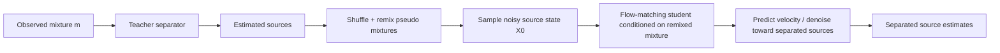
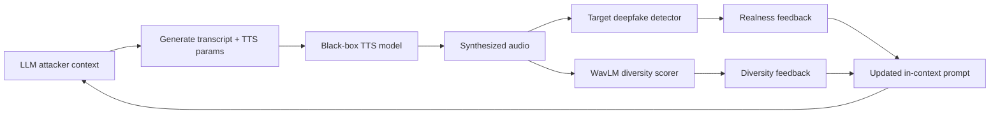
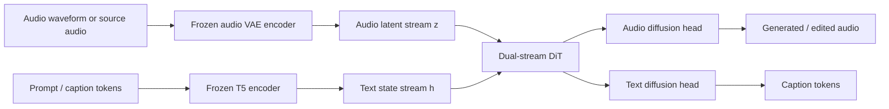
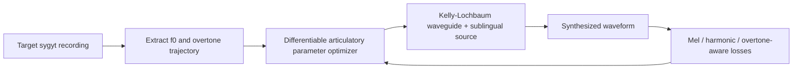

# 语音 / 音频 / 音乐论文速递
## 2026-06-04

> 实际对应 arXiv 更新日：**2026-06-04**  
> 检索范围：`cs.SD + eess.AS`  
> 只放按 ML 顶会审稿口径看，最值得多数读者花时间看的 **5 篇**

## 📋 总览

- 共收录 **5 篇** 相关论文
- 语音前端 / 无监督分离：**1 篇**
- 音频安全 / 伪造检测：**2 篇**
- 统一音频生成 / 理解：**1 篇**
- 音乐声学 / 可解释建模：**1 篇**

今天这批真正值得优先看的主线有三条。第一条是 `SURF` 这类“把生成式 flow matching 真正拉进无监督分离”的路线，它不是再拿 MixIT 小修小补，而是把 teacher-student remixing 和 flow 模型接起来，实验也确实把老的 ReMixIT / Self-Remixing 压下去了。第二条是音频安全：`FoeGlass` 很实用，它直接证明现在不少 audio deepfake detector 的 benchmark 覆盖面根本不够，靠 LLM 给 TTS 造输入，黑盒就能把 FNR 顶上去。第三条是统一建模：`UAT` 不是又一个“加个 caption head”的拼装货，而是认真做了 dual-stream diffusion，试图把 audio generation、editing、captioning 放进一套 diffusion 范式里。

剩下两篇里，`Differentiable Articulatory Copy-Synthesis of Biphonic Singing` 很窄，但方法干净，属于做 overtone singing / 可解释声学建模的人会真觉得有用的论文；`DetectZoo` 则是典型基础设施稿，不提供新 detector，但如果你现在正被一堆 anti-spoof / AIGC detection 仓库折磨，它的工程价值大于算法新意。

## 精选入选规则

- **新意（0-3）**：是不是提出了新的表示、训练机制、接口，或者把老问题拆得更对
- **影响力（0-3）**：是不是贴近语音前端、音频安全、统一音频建模、音乐生成这些主线
- **证据强度（0-2）**：有没有像样的 baseline、关键指标和可复核数值
- **受众匹配度（0-2）**：对语音大模型 / 语音前端 / 音频安全 / 音乐研究者有没有直接启发

分数校准：

- **6**：能读，但更像工具补丁、局部经验总结或受众很窄的工作
- **7**：有明确信息量，值得快速精读
- **8+**：建议优先看，至少有一项不是泛泛增量

## 总览表

| 方向 | 序号 | 论文 | 评分 | 关键词 |
|---|---:|---|---:|---|
| 语音前端 / 无监督分离 | 1 | SURF | 9/10 | unsupervised source separation, flow matching, ReMixIT, Self-Remixing, Wake-Sleep |
| 音频安全 / 伪造检测 | 2 | FoeGlass | 8.5/10 | audio deepfake, red teaming, black-box attack, in-context learning, diversity feedback |
| 统一音频生成 / 理解 | 3 | UAT | 8.5/10 | unified audio-text diffusion, generation, editing, captioning, dual-stream DiT |
| 音乐声学 / 可解释建模 | 4 | Differentiable Articulatory Copy-Synthesis of Biphonic Singing | 8/10 | sygyt, overtone singing, articulatory synthesis, Kelly-Lochbaum, DDSP |
| 音频安全基础设施 | 5 | DetectZoo | 7/10 | AI-generated content detection, audio deepfake, unified toolkit, reproducibility, benchmark |

## 🎧 语音前端 / 无监督分离

### [1] SURF: Separation via Unsupervised Remixing Flow

- **评分**：9/10
- **作者/机构**：Henry Li, Robin Scheibler, Efthymios Tzinis, Matt Shannon, Arnaud Doucet, John R. Hershey；Google / Google DeepMind
- **论文链接**：https://arxiv.org/abs/2606.04921
- **PDF**：https://arxiv.org/pdf/2606.04921.pdf
- **代码链接**：暂无
- **Demo 链接**：https://google.github.io/df-conformer/surf/

#### 📌 简介
这篇做的是单通道无监督源分离，但不是传统 ReMixIT 那种纯回归路线，而是把生成式 `flow matching` 真接进来了。作者的核心想法是：先让 teacher 从真实混合音里估计源，再把这些估计值打乱重混，拿来给 student flow model 做自监督训练，从而在完全不依赖 clean source 数据的前提下学分离。

#### ☠️ 毒舌点评
这篇是真货，不是“给 ReMixIT 换个大模型壳”。它最值钱的地方是把 generative prior 和 self-supervised remixing 接通了，而且理论分析没摆设，直接把方法和 Wake-Sleep 关系讲清了。短板也有：它仍然吃一个不错的 teacher 起点，离“从零无监督学一切”还有距离，但在这个问题上已经比很多只会卷 backbone 的分离稿硬不少。

#### 🔧 技术方案
- **模型解决的问题**：传统无监督分离方法如 MixIT、ReMixIT、Self-Remixing，虽然不需要 clean label，但本质还是回归 teacher 伪标签，容易带入 teacher artifact，也很难享受生成式 prior 的好处；而监督式 diffusion / flow 分离又严重依赖 clean source。`SURF` 想补的就是这条断层：能不能直接从 observed mixtures 出发，训练一个生成式 flow 分离模型。
- **模型架构**：
  - **输入**：单通道混合音 `m`，以及由 teacher 估计并重组得到的 pseudo source tuple。
  - **输出**：每个时间步对应的 source velocity / 最终分离源波形。
  - **主干**：teacher-student 式的 `unsupervised remixing + flow matching` 框架。
  - **关键模块**：
    - 冻结或 EMA 更新的 `teacher separator`
    - `ReMixIT` 式伪监督重混模块
    - `Self-Remixing` 式 mixture-consistency 监督
    - 条件 `flow matching velocity field`
    - 稳定训练用 `hybrid teacher sampler`
- **信号流**：

- **关键设计 / 核心创新**：
  - 把监督式 flow matching 的 clean-source target 换成由 teacher 估计出的 remix 伪监督目标，形成真正的 `unsupervised flow matching`。
  - 同时兼容 `ReMixIT` 与 `Self-Remixing` 两种监督口径，不是只做一种 trick。
  - 给出 population-level 分析，说明这些自监督 remix loss 到底在逼近什么，并把一部分训练过程解释成 `Wake-Sleep`。
- **训练 / 推理策略**：
  - 先训练一个 `MixIT` teacher，再用它初始化 student / teacher。
  - student 训练时用 `Algorithm 1` 做重混 pseudo pair，teacher 再用 `EMA` 动态更新。
  - 音频实验里，冻结 teacher 是较小 `ConvTasNet`，student / updated teacher 用 `MB-TFLocoformer`，总参数约 `36M`。
  - 对于 audio 分离，teacher 采样中还用了 `hybrid teacher` 稳定前期训练；文中没有报在线推理延迟或 RTF。

#### 📊 实验结果
- `FUSS + LibriSpeech` 两源混合上：
  - `SURF (Self-Remixing)` 达到 `SI-SDR 15.23`、`ESTOI 0.840`、`PESQ 2.93`、`DNSMOS 2.57`
  - 对比 `ReMixIT` 的 `14.29 / 0.793 / 2.85 / 2.51`
  - 对比 `Self-Remixing` 的 `14.81 / 0.784 / 2.81 / 2.56`
- `Libri2Mix` 两源混合上：
  - `SURF (ReMixIT)`：`SI-SDR 16.54`、`ESTOI 0.893`、`PESQ 3.30`、`DNSMOS 2.94`
  - `SURF (Self-Remixing)`：`16.28 / 0.889 / 3.28 / 2.93`
  - 明显高于 `MixIT 12.39 / 0.753 / 2.52 / 2.36`
- `FUSS` 多源设置里：
  - `SURF (ReMixIT)` 在 `1S` 上到 `32.67`
  - `SURF (Self-Remixing)` 在 `3Si` 上到 `11.63`，在 `2Si` 上到 `11.36`
  - 相比 `MixIT` 的 `1S 10.99` 和 `ReMixIT` 的 `2Si 9.91`，优势很明显
- baseline 覆盖：`Supervised Flow`、`MixIT`、`ReMixIT`、`Self-Remixing`
- 局部短板：在 `FUSS 4Si` 上 `SURF (ReMixIT)` 的 `7.52` 不是全局最优，说明它也不是所有混合度都无脑碾压

#### 💡 为什么值得看
如果你做语音前端、分离、音频生成式建模，这篇值得看的点不是“flow matching 也能做 separation”这句口号，而是它真的把无监督分离和生成式建模缝上了，而且缝得有理论、有实验、有泛化增益。后面谁再说“无监督分离只能回归 teacher 伪标签”，这篇就是直接反例。

## 🛡️ 音频安全 / 伪造检测

### [2] FoeGlass: Simple In-Context Learning Is Enough for Red Teaming Audio Deepfake Detectors

- **评分**：8.5/10
- **作者/机构**：Sepehr Dehdashtian, Jacob H. Seidman, Vishnu Naresh Boddeti, Gaurav Bharaj；Michigan State University / Reality Defender
- **论文链接**：https://arxiv.org/abs/2606.05101
- **PDF**：https://arxiv.org/pdf/2606.05101.pdf
- **代码链接**：暂无
- **Demo 链接**：暂无

#### 📌 简介
这篇做的是 `audio deepfake detector` 的自动化红队，而不是再训练一个新 detector。核心思路很直接也很有效：拿一个有推理能力的 LLM 当 attacker，让它给 TTS 模型持续生成 transcript 和生成参数，再用 target detector 的 realness score 和一个基于 `WavLM` 的 diversity score 反馈回去，逼它往 detector 的盲区钻。

#### ☠️ 毒舌点评
这篇最大的杀伤力，是它把很多 detector benchmark 的“覆盖幻觉”戳破了。你以为 ASVspoof5 已经很难了，结果黑盒条件下靠 prompt search 就能把 FNR 顶飞，这就说明 benchmark 很可能只是覆盖了几个常见 spoof 配方，不是真的覆盖了 TTS 输出空间。缺点是它更像安全评测与数据发现方法，不是 detector 建模本身的革命，但这恰恰更实用。

#### 🔧 技术方案
- **模型解决的问题**：现有 audio deepfake benchmark 要么手工收集，要么只在已有生成音频附近做小扰动，导致 detector 的高错误区域很难系统找到。`FoeGlass` 补的是“如何只靠黑盒访问 TTS 和 ADD，本地自动挖出自然的 false negative 样本”。
- **模型架构**：
  - **输入**：TTS 的 transcript、style / speed / pitch 等生成参数；target ADD 的黑盒评分接口。
  - **输出**：能骗过 detector 的 TTS 输入，以及对应生成音频。
  - **主干**：`LLM attacker + TTS generator + ADD evaluator` 的闭环搜索。
  - **关键模块**：
    - attacker LLM：文中使用 `DeepSeek-R1 distilled on Llama-3.1-8B`
    - TTS 后端：`VITS`、`Kokoro-82M`、`xTTS-v2`
    - detector feedback：`p(real | x')`
    - diversity feedback：基于 `WavLM embedding` 的 cosine distance
    - context designer：把历史攻击、CoT、反馈分数拼成下一轮 in-context prompt
- **信号流**：

- **关键设计 / 核心创新**：
  - 不需要白盒梯度，不需要 fine-tune attacker，也不需要已知 spoof recipe，完全黑盒。
  - diversity feedback 不是装饰项，它是防 mode collapse 的关键；否则 attacker 很容易反复生成同一种假音风格。
  - warm-start 只需要极少数 detector 输出样例，成本很低。
- **训练 / 推理策略**：
  - 没有额外模型训练，核心是迭代推理式 red teaming。
  - 每轮 attacker LLM 生成一组 TTS 输入，经 TTS 合成后送入 detector。
  - 真实感分数 `rt` 与多样性分数 `dt` 一起反馈进下轮 context；当 `dt < τd` 时，强制 LLM 调整 transcript 多样性。
  - 文中同时测试 `cold start` 和 `warm start`，后者只需要 `3` 个样本提示。

#### 📊 实验结果
- 在 `VITS -> VIT / VoxCelebSpoof / ConstantQ` 组合上：
  - 无条件采样 FNR 只有 `42.02%`
  - `FoeGlass cold start` 直接推到 `94.04%`
  - `warm start` 进一步到 `96.15%`
- 在 `VITS -> VIT / ASVspoof5 / ConstantQ` 上：
  - `16.85% -> 74.20% -> 81.34%`
  - 这基本就是对“现有 benchmark 足够覆盖”的公开处刑
- 在 `xTTS-v2 -> VIT / VoxCelebSpoof / MelSpectrogram` 上：
  - 无条件采样 `8.72%`
  - `FoeGlass cold start` 到 `87.87%`
  - `warm start` 到 `88.83%`
- 迁移与鲁棒性：
  - 论文明确说 FoeGlass 生成的攻击在不同 ADD 间有可迁移性
  - 用这些样本微调模型后，在 held-out `VITS` 数据上，`RawNetLite` 指标从 `49.6` 降到 `8.2`，`AASIST` 从 `15.2` 降到 `0.2`，明显强于无条件采样微调
- baseline / 对比对象：`unconditional sampling`、不同 `VIT / AST` detector、不同训练集版本、不同 TTS

#### 💡 为什么值得看
做音频安全的人应该优先看这篇，因为它不是在 detector architecture 上继续卷小数点，而是直接告诉你：如果你的数据发现流程不行，你训练出来的 detector 再花哨也只是学会了防守一个过窄的 spoof 子空间。这类工作对真实部署比再刷一点 EER 更重要。

### [3] DetectZoo: A Unified Toolkit for AI-Generated Content Detection Across Text, Audio, and Image Modalities

- **评分**：7/10
- **作者/机构**：Sajad Ebrahimi, Nima Jamali, Bardia Shirsalimian, Kelly McConvey, Wentao Zhang, Jalehsadat Mahdavimoghaddam, Maksym Taranukhin, Maura Grossman, Vered Shwartz, Yuntian Deng, Ebrahim Bagheri；University of Toronto / University of Waterloo / Toronto Metropolitan University / University of British Columbia / Vector Institute
- **论文链接**：https://arxiv.org/abs/2606.04205
- **PDF**：https://arxiv.org/pdf/2606.04205.pdf
- **代码链接**：**代码已开源** https://github.com/sadjadeb/DetectZoo
- **Demo 链接**：暂无

#### 📌 简介
这不是新 detector，而是一篇统一 benchmark / toolkit 论文。作者把文本、图像、音频三模态的 AIGC 检测器塞进一个统一 API 里，目标很现实：别再每篇反伪造论文都配一坨互不兼容、依赖炸裂、指标算法还不一致的仓库了。

#### ☠️ 毒舌点评
算法党看这篇会嫌它“不发明新模型”，这没错；但现在多模态 AIGC detection 这个方向最大的问题之一，本来就不是缺一个名字更怪的 detector，而是缺可复现实验底座。所以这篇的价值很工程，也很基础设施。缺点是论文本身的新意主要在整合和标准化，不在 detection methodology。

#### 🔧 技术方案
- **模型解决的问题**：当前 text / image / audio detector 各自为战，预处理、阈值、split、指标口径全都不一样，导致“谁更强”很多时候根本没法公平比。`DetectZoo` 解决的是如何统一加载 detector、统一跑 benchmark、统一算指标，并把公开结果复现到一个一致环境里。
- **模型架构**：
  - **输入**：文本字符串、图像路径、音频路径。
  - **输出**：统一格式的 `DetectionResult`，包含 `score / label / confidence / metadata`。
  - **主干**：`load_detector` 工厂 + `BenchmarkEvaluator` + 注册式数据集 / 模型接口。
  - **关键模块**：
    - `BaseDetector` / 模态特化 detector 抽象
    - 统一 `predict()` 调用接口
    - `BenchmarkEvaluator` 统一收集 score 与标签
    - 自动下载权重与 benchmark dataset loader
    - 指标层支持 `AUROC / AUPR / AP / EER / F1`
- **信号流**：

- **关键设计 / 核心创新**：
  - 真正把三模态 detector 收敛到同一套 API，而不是“名义统一，内部还是三套系统”。
  - 用注册式接口降低扩展成本，新 detector / dataset 直接 subclass + decorator 即可接入。
  - 论文明确把“复现性”当核心目标，不是假装自己发明了第 62 个 detector。
- **训练 / 推理策略**：
  - 这套系统本身不训练新 detector，主要负责标准化推理和复现实验。
  - 当前集成了 `61` 个 detector、`22` 个 benchmark dataset，其中音频方向是 `10` 个 detector。
  - 音频指标主打 `EER`，同时报 `AUROC` 和 `F1`；对某些模型还保留原论文要求的特殊推理步骤。

#### 📊 实验结果
- 基础设施规模：
  - `61` 个 detector
  - `22` 个 benchmark dataset
  - 音频子集 `10` 个 detector
- 音频 in-distribution 复现（`ASVspoof 2019`）：
  - `RawGAT-ST` 最低 `EER 0.60%`
  - `Res-TSSDNet` 综合最好：`EER 1.20%`、`AUROC 0.9995`、`F1 0.9900`
  - `AASIST` 也很稳：`EER 1.00%`
  - `RawNet2 / SAMO / AST-asvspoof` 则有 `5.20% - 6.20% EER`
- foundation model 跨域泛化：
  - 在 `FoR` 上，`AD(Wav2Vec2-Large)` 最稳，`EER 7.20%`
  - `HuBERT-XLarge` 反而掉到 `11.80% EER`，说明大模型容量不等于跨域鲁棒
  - 在 `In-the-Wild` 上，`AD(XLS-R 2B)` 最好，`EER 1.20%`、`AUROC 0.9987`、`F1 0.9860`
  - `XLS-R + SLS` 在 `In-the-Wild` 直接崩到 `12.80% EER`
- baseline / 复现对象：文中音频部分主要复现 `Ge et al.` 系列 deepfake detection 结果，以及多种 anti-spoof backbone

#### 💡 为什么值得看
如果你是做 anti-spoof / AIGC detection 的学生或者工程团队，这篇最值得看的不是它的“指标有多高”，而是它试图把一堆烂尾仓库和不兼容实验口径收拾成能真的比、真的复现的系统。对真正做实验的人，这种工作比又造一个小模型名字更有用。

## 🔀 统一音频生成 / 理解

### [4] UAT: Unified Audio-Text Diffusion for Audio Generation, Editing, and Captioning

- **评分**：8.5/10
- **作者/机构**：Hui Wang, Yifan Yang, Zeyue Tian, Yuhang Jia, Jinghua Zhao, Long Zhou, Bing Han, Cheng Liu, Jiaming Zhou, Geng Tu, Yong Qin；南开大学 / 腾讯 / 上海交通大学 / HKUST / Noiz AI
- **论文链接**：https://arxiv.org/abs/2606.04939
- **PDF**：https://arxiv.org/pdf/2606.04939.pdf
- **代码链接**：暂无
- **Demo 链接**：https://UAT-demo.github.io

#### 📌 简介
这篇想做一件很多人都想做、但大多做得很别扭的事：把 `audio generation`、`audio editing`、`audio captioning` 放进一个统一模型里。它的选择不是 AR token 路线，而是更少见的 `diffusion-centric` 统一建模，用连续音频 latent diffusion 处理声学生成，用 masked discrete diffusion 处理文本生成。

#### ☠️ 毒舌点评
这篇的优点是路子对，而且不是拿一个现成 TTA diffusion 模型硬接个 caption head 糊弄。它认真处理了文本流和音频流不对称的问题，所以 editing 和 captioning 都能做。缺点也很明确：captioning 还没干过最强专用模型，说明“统一”仍有代价；但如果你关心未来的 unified audio model，这篇比很多纯 AR 拼 token 的路线更值得盯。

#### 🔧 技术方案
- **模型解决的问题**：音频生成通常走连续扩散，音频理解 / captioning 通常走自回归 LLM，两边的 latent、目标和训练范式不统一，导致一个模型很难同时把声学质量和语义理解做好。`UAT` 解决的是如何用同一套 diffusion 范式同时覆盖生成、编辑和 captioning。
- **模型架构**：
  - **输入**：音频波形 `a`、文本 prompt `y`，或编辑条件中的 `source audio + editing prompt`。
  - **输出**：生成音频、编辑后音频，或音频描述文本。
  - **主干**：`frozen modality encoders + coupled dual-stream DiT + audio/text diffusion heads`
  - **关键模块**：
    - 冻结音频 `VAE encoder Ea`，把波形映射到连续 latent `z0`
    - 冻结 `T5 encoder Et`，把文本编码成 token-level states
    - `dual-stream DiT`：audio stream 与 text stream 层间交替耦合
    - `audio diffusion head`：预测连续 latent 的 velocity
    - `text diffusion head`：在 mask token 上做离散重建
- **信号流**：

- **关键设计 / 核心创新**：
  - 不走 AR-centric 统一建模，而是明确主张 `diffusion-centric` unified audio-text model。
  - 在 backbone 里引入动态更新的 text stream，解决传统 TTA diffusion 里“文本只是静态条件”的结构不对称。
  - 用 `continuous latent diffusion + masked discrete diffusion` 桥接音频连续空间和文本离散空间。
- **训练 / 推理策略**：
  - 音频分支使用连续 latent diffusion：`zt = αt z0 + σt ε`
  - 文本分支使用 masked discrete diffusion，对 caption token 做随机 mask，再重建被 mask 的 token
  - 训练数据来自 `4` 个过滤后的音频文本数据集，总计 `2,363,765` 条、`6,620.620` 小时
  - 文中 generation 训练采样比为 `AudioSetCaps / AudioCaps 2.0 / VGGSound / WavCaps = 50 / 20 / 15 / 15`
  - captioning 训练采样比为 `15 / 60 / 25`
  - 编辑推理中从 step `70` 启动编辑轨迹，classifier-free guidance scale 用 `7.0`

#### 📊 实验结果
- `AudioCaps` 文本生成音频：
  - `UAT`：`KL 1.39`、`IS 12.47`、`FD 14.47`、`FAD 2.87`、`CLAP 0.491`
  - 对比 unified baseline `Audio-Omni`：`1.39 / 9.94 / 45.43 / 2.00 / 0.498`
  - 对比专用 `AudioX`：`1.37 / 12.05 / 13.03 / 2.03 / 0.488`
  - 说明它在 unified model 里 generation 最强，且已接近专用模型
- `VGGSound` 上：
  - `UAT`：`KL 1.28`、`IS 9.34`、`FD 22.07`、`FAD 4.91`、`CLAP 0.434`
  - 也明显优于 `Audio-Omni` 的 `IS 8.31` 与 `FD 53.97`
- 人评：
  - `OVL 4.260 ± 0.131`
  - `REL 4.260 ± 0.155`
  - 已经贴近 `Ground Truth 4.347 / 4.407`
- 音频编辑：
  - Add：`CLAP 0.406`、`FAD 3.220`、`IS 4.072`
  - Delete：`0.350 / 4.243 / 3.325`
  - Replace：`0.439 / 5.199 / 3.682`
  - 统一 baseline `Audio-Omni` 在三种设置下 FAD 都在 `45+`，差距很离谱
- 音频 captioning：
  - `UAT` 只有 `1.7B` 参数，达到 `CIDEr 0.406`、`SPICE 0.139`、`SPIDEr 0.272`、`SBERT-SIM 0.572`、`FENSE 54.08`
  - 不如 `UniAudio 2.0` 的 `CIDEr 0.603 / SPIDEr 0.375`
  - 但显著强于 `Audio-Omni` 的 `0.167 / 0.149 / 0.555 / 48.89`

#### 💡 为什么值得看
这篇最值得看的是它认真回答了一个很大的问题：统一音频模型一定要走 AR token 吗？它给出的答案是“不一定”，而且用 generation、editing、captioning 三个任务一起证明了这个答案不是空话。虽然 captioning 还没打穿专用理解模型，但作为 unified audio-text direction，这篇明显是靠谱起点。

## 🎼 音乐声学 / 可解释建模

### [5] Differentiable Articulatory Copy-Synthesis of Biphonic Singing

- **评分**：8/10
- **作者/机构**：Mateo Cámara, María Pilar Daza-Llin, Fernando Marcos-Macías, José Luis Blanco；Universidad Politécnica de Madrid
- **论文链接**：https://arxiv.org/abs/2606.04943
- **PDF**：https://arxiv.org/pdf/2606.04943.pdf
- **代码链接**：暂无
- **Demo 链接**：https://mateocamara.com/khoomei-supp-materials

#### 📌 简介
这篇聚焦非常窄的题：图瓦双音歌唱 `sygyt` 的 copy-synthesis。作者不是用黑盒生成模型去“听起来像”，而是回到可解释的 articulatory synthesis，用可微的 Kelly-Lochbaum 声道波导、舌下第二声源、B-spline 声道参数化和空间可学习阻尼，直接从录音反推能复现 overtone structure 的物理参数。

#### ☠️ 毒舌点评
这不是大众向热稿，但方法很干净，属于“题小，活细，而且真做对了”。它的优点是用物理结构把 overtone singing 这种很容易被 end-to-end 黑盒糊过去的任务重新掰开讲清楚；缺点也很明显：数据规模小，任务窄，离通用 singing synthesis 还远。可如果你做 overtone、民族声学、可解释歌声建模，这篇比又一个大一统 singing model 更值得看。

#### 🔧 技术方案
- **模型解决的问题**：`sygyt` 这种双音歌唱依赖 1-3 kHz 区域极窄的共振聚焦，常规低维 articulatory 参数化很难精准复现，纯 DDSP 又缺少足够强的物理归因。本文想解决的是如何在保留可解释性的前提下，直接从音频做 articulatory copy-synthesis。
- **模型架构**：
  - **输入**：目标 `sygyt` 录音，以及从目标音频提取出的 `f0` 与 overtone 频率轨迹。
  - **输出**：合成音频，以及一组可解释的 vocal tract / source 参数。
  - **主干**：可微 `Kelly-Lochbaum waveguide` articulatory synthesizer。
  - **关键模块**：
    - `sublingual second source`
    - `cubic B-spline tract parameterization`
    - `spatially varying learnable damping`
    - overtone-aware objective `Lot`
    - 对比 baseline：`articulator chain` 与 `DDSP harmonic+noise`
- **信号流**：

- **关键设计 / 核心创新**：
  - 把 `sygyt` copy-synthesis 表述成一个端到端可微优化问题，而不是手工调 formant。
  - 关键不是简单换 B-spline，而是加入 `sublingual second source + variable damping` 这套物理偏置，逼模型在 overtone region 上更像真实发声机制。
  - 目标函数里专门加了 overtone salience loss，不让模型只顾全频带平均误差。
- **训练 / 推理策略**：
  - 文中不是大规模 SGD 预训练，而是针对每段音频做 `500 iterations` 优化。
  - `f0` 与 overtone 频率先固定提取，再优化 tract shape 和 source 参数。
  - 16 kHz 下单段在 CPU 上大约 `30` 分钟，显然不是实时系统。
  - 训练损失包含 `mel loss`、harmonic consistency、energy term 和 overtone salience 项；文中明确说更细的 loss ablation 留给后续。

#### 📊 实验结果
- 数据规模：
  - 两个独立 `sygyt` 数据集
  - 共 `20` 段音频
  - `5` 位歌者、`10` 个音高
- `HFA` 数据集上：
  - `B-spline`：`LSD 9.64 ± 0.29`
  - 对比 `Artic. chain 13.84 ± 0.54`
  - 对比 `DDSP 10.99 ± 0.54`
  - 主观分 `Q1 44.8 ± 5.5`、`Q2 52.9 ± 5.8`，也高于 `DDSP 42.4 / 50.3`
- `Bergevin` 数据集上：
  - `B-spline`：`LSD 9.04 ± 0.46`
  - 对比 `Artic. chain 14.53 ± 0.93`
  - 对比 `DDSP 10.71 ± 0.72`
  - `SpCorr 0.88 ± 0.01`，也高于 `DDSP 0.83 ± 0.03`
- 总体结论：
  - 论文摘要里总结为相对 articulatory baseline 的 `LSD` 降低 `30% - 38%`
  - overtone 区域误差也更低，文中点名整体 `|∆eR| = 0.12`、`|∆Sot| ≈ 0.96 dB` 等指标优于 DDSP
- baseline 覆盖：`Artic. chain`、`DDSP`
- 局限：`B-spline` 在个别 overtone band 局部相似性上并非每项都碾压 DDSP，且小数据设定决定了泛化结论不能吹太满

#### 💡 为什么值得看
这篇最值得看的是它把“听起来像”重新拆回“为什么像”。在现在大家都爱拿黑盒大模型端到端吞任务的环境里，这种能把 overtone singing 的物理机理、可微建模和主观听感一起对齐的工作很稀缺。受众不广，但受众一旦对口，信息密度很高。

## 最后结论

今天最值得优先看的排序是：

1. **SURF**：如果你做语音前端、分离、生成式建模，这是今天最硬的一篇，方法和实验都过关。
2. **FoeGlass**：如果你做 audio deepfake detection，这篇几乎是必读，因为它直接暴露 benchmark 盲区。
3. **UAT**：如果你关心 unified audio model，这篇是很靠谱的 diffusion 路线样板。
4. **Differentiable Articulatory Copy-Synthesis of Biphonic Singing**：方向窄，但方法干净，适合做 singing / 声学机理的人深读。
5. **DetectZoo**：不是新算法，但对做实验的人很有用，尤其适合搭检测基线和 benchmark 环境。

一句话收束：今天不是“又一堆普通 TTS/ASR 小改款”，而是三条很明确的主线同时出现了像样工作。`SURF` 代表无监督分离开始认真拥抱生成式建模，`FoeGlass` 代表音频安全开始从“刷分”转向“找盲区”，`UAT` 则说明统一音频生成与理解这条线终于有人愿意在 diffusion 范式里认真做工程闭环。
