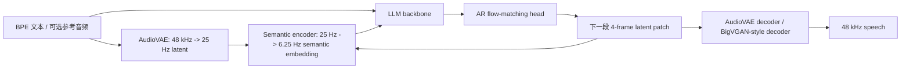
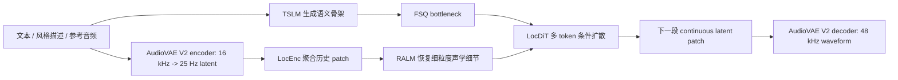
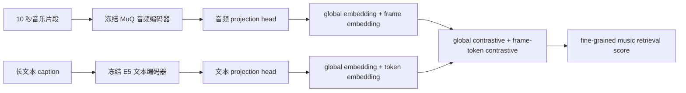
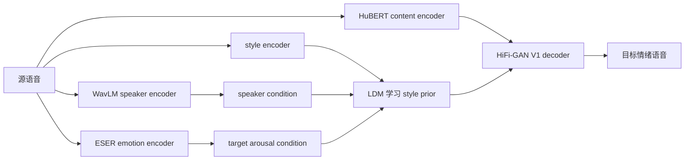

# 语音 / 音频 / 音乐论文速递
## 2026-06-08

> 实际对应 arXiv 更新日：**2026-06-08**  
> 检索范围：`cs.SD + eess.AS`  
> 只放按 ML 顶会审稿口径看，最值得多数读者花时间看的 **5 篇**

## 📋 总览

- 共收录 **5 篇** 相关论文
- 语音生成基础模型：**2 篇**
- 音乐理解 / 检索：**1 篇**
- 语音安全 / 反伪造：**1 篇**
- 情感语音编辑：**1 篇**

今天最值得看的主线非常清楚：第一条是**开源连续隐变量 TTS 基座开始进入“能打榜也能部署”的阶段**，`dots.tts` 和 `VoxCPM2` 都不再满足于做 demo，而是在长程稳定性、跨语种克隆、实时推理、控制接口上做系统化工程；第二条是**音乐检索终于有人认真处理“长 caption 里真正有用的信息为什么被 CLAP 吃掉”**，`FIGMA` 把 fine-grained retrieval 这件事讲明白了；第三条是**真实世界鲁棒性开始被正面处理**，无论是 deepfake 检测里的 proxy-to-wild gap，还是情感转换里的 in-the-wild 非平行数据，论文都不再拿实验室玩具问题糊弄。

## 精选入选规则

- **新意（0-3）**：是不是提出了新的表示、接口、训练组织方式，或者把旧问题拆得更对
- **影响力（0-3）**：是不是贴近语音大模型、TTS、语音安全、音乐理解这些主线
- **证据强度（0-2）**：有没有像样的 baseline、消融和关键数值
- **受众匹配度（0-2）**：对语音大模型 / 语音前端 / 音乐方向 / 安全方向研究者有没有直接启发

分数校准：

- **6**：可读，但更像局部补丁
- **7**：信息量够，值得过一遍
- **8+**：建议优先精读

## 总览表

| 方向 | 序号 | 论文 | 评分 | 关键词 |
|---|---:|---|---:|---|
| 语音生成基础模型 | 1 | dots.tts | 9/10 | continuous AR TTS, AudioVAE, SOAR, MeanFlow, streaming |
| 语音生成基础模型 | 2 | VoxCPM2 | 9/10 | multilingual TTS, controllable cloning, AudioVAE V2, unified sequence |
| 音乐理解 / 检索 | 3 | FIGMA | 8.5/10 | fine-grained retrieval, MuQ, frame-level contrastive, FGMCaps |
| 语音安全 / 反伪造 | 4 | Mitigating Proxy-to-Wild Domain Gap in Deepfake Speech | 8/10 | CodecFake, DSFA, post-trained SSL, CoSG ExtEval |
| 情感语音编辑 | 5 | TargetSEC | 7.5/10 | speech emotion conversion, latent diffusion, arousal, plug-and-play |

## 🗣️ 语音生成基础模型

### [1] dots.tts Technical Report

- **评分**：9/10
- **作者/机构**：Shi Lian, Changtao Li, Bohan Li, Hankun Wang, Da Zheng, Junfeng Tian, Yufeng Ma, Colin Zhang, Kai Yu；dots / Xiaohongshu Inc. / 上海交通大学 X-LANCE Lab
- **论文链接**：https://arxiv.org/abs/2606.07080
- **PDF**：https://arxiv.org/pdf/2606.07080.pdf
- **代码链接**：**代码已开源** https://github.com/rednote-hilab/dots.tts
- **Demo 链接**：https://rednote-hilab.github.io/dots.tts-demo

#### 📌 简介
这篇是少数把“连续隐变量 AR TTS 为什么总是越生成越漂”讲透并认真修掉的技术报告。作者没有回到离散 codec 老路，而是围绕 `AudioVAE + semantic encoder + LLM + autoregressive flow-matching head` 这条连续 AR 栈，把可学表示、长程稳定性、后训练和低延迟部署一口气补齐。

#### ☠️ 毒舌点评
这不是“换个大点 backbone 再刷一遍 Seed-TTS”那种流水线论文，真正有东西的是它把连续 AR 最疼的长程误差累积拆成了表示学习、语义规划、声学渲染和 post-training 四块来治。短板也很明确：低资源语言和复杂外来词仍然掉点，说明这套系统离“全语言无脑通吃”还远，但已经比很多只会放 demo 的 TTS technical report 硬得多。

#### 🔧 技术方案
- **模型解决的问题**：连续 latent AR TTS 没有离散 tokenizer 那种“每一步自动吸回合法声学状态”的量化缓冲，小误差会被 VAE 真实重建，再反喂给下一步，结果就是长句子越说越飘。`dots.tts` 要解决的就是：在保留连续表示上限和流式交互优势的前提下，怎么把这种 long-range drift 压下去。
- **模型架构**：
- **输入**：BPE 文本 token，外加可选参考音频；音频侧通过 AudioVAE 压成 25 Hz 连续 latent patch。
- **输出**：48 kHz 波形；中间生成目标是 25 Hz、128 维连续 latent patch。
- **主干**：`AudioVAE + semantic encoder + Qwen2.5-1.5B 初始化的 LLM + autoregressive flow-matching head (AR-FM)`。
- **关键模块**：
- `AudioVAE`：48 kHz 单声道音频压成 128 维 latent，25 Hz 输出。
- `semantic encoder`：把每个 25 Hz latent patch 再压成 6.25 Hz 语义 embedding，供 LLM 消费。
- `AR-FM head`：18 层 DiT，按 patch 自回归生成下一段连续 latent。
- `SOAR self-corrective alignment`：让 flow-matching head 暴露在自己推理时的 off-trajectory 误差里做 reward-free 后训练。
- `CFG-aware MeanFlow distillation`：把原来多步 ODE 推理压到 2 到 4 次函数评估，同时把 CFG 融进蒸馏目标。
- **信号流**：

- **关键设计 / 核心创新**：
- 第一，`AudioVAE` 不是只追 reconstruction，而是两阶段训练：第一阶段用 BigVGAN-v2 风格的 adversarial + mel + feature matching + KL/flow regularization 做重建；第二阶段再加 `WavLM` 对齐和多任务下游监督，把 latent 变成 LLM 真能学的空间。
- 第二，它把连续 AR 拆成“LLM 负责语义规划，AR-FM 负责局部声学渲染”，而不是让一个模块既想管 long-range semantics，又想管短时声学纹理。
- 第三，`SOAR + MeanFlow` 这套后训练 / 蒸馏链路很务实，直接面向推理误差和时延，不是把论文停在离线质量表格上。
- **训练 / 推理策略**：
- 训练语料规模约 **1.5M 小时**，覆盖语音、caption-style speech 和少量非语音音频。
- `AudioVAE` 两阶段训练后冻结，作为 backbone 的目标空间和输入空间。
- 主模型预训练后再做 `SOAR`，通过 self-corrective alignment 纠正多步 ODE 与真实推理轨迹之间的 mismatch。
- 推理时 `Pretrain` / `SOAR` 版本使用 **10 个 Euler 步 + CFG**；`MeanFlow` 蒸馏版用 **NFE=2/3/4** 的单条件前向替代。
- 实时部署支持 plain mode 和 `1T1A` interleaved dual-streaming；在单卡 H800 上，`1T1A` 可把首包延迟压到 **54.4 ms**，`RTF 0.245`。

#### 📊 实验结果
- `AudioVAE` 重建质量先过了硬门槛：在 `LibriSpeech test-other` 上，`dots.tts VAE` 达到 `PESQ-NB 4.09`、`PESQ-WB 3.95`、`STOI 0.973`、`SIM 0.969`、`WER 4.14`。对比离散 tokenizer，`XY-Tokenizer` 的 `WER 6.19`、`WavTokenizer 13.35`、`X-codec2 6.85`，说明它的 latent 本身就不是瓶颈。
- `Seed-TTS-Eval` 上，`dots.tts (SOAR)` 拿到 `test-en WER 1.30 / SIM 77.1`、`test-zh 0.94 / 81.0`、`test-zh-hard 6.60 / 79.5`，平均 `WER 2.95 / SIM 79.2`。对比 `VoxCPM2` 的平均 `3.65 / 76.7`、`CosyVoice 3` 的 `3.06 / 75.3`、`Qwen3-TTS` 的 `3.07 / 74.5`，它的平均指标是当前表里最强开源结果之一。
- `MeanFlow` 蒸馏的代价很小：`NFE=4` 版本平均 `WER 2.94 / SIM 78.2`，相比 `SOAR` 基本没掉 intelligibility，只损失约 **1 个 SIM 点**。
- `MiniMax-Speech` 24 语种测试里，`dots.tts (SOAR)` 的平均 `SIM 83.9`，高于 `VoxCPM2` 的 `82.3`；`CV3-Eval` 的跨语种克隆上，`en→zh SIM 75.0`、`zh→en SIM 72.8`，明显高于 `CosyVoice 3` 的 `66.9 / 66.4`。
- `EmergentTTS-Eval` 上，它虽然不是全列通杀，但 `dots.tts (Pretrain)` 的总体 win-rate 达到 **49.2%**，`SOAR` 在 `Syntactic Complexity` 上打到 **65.7%**，甚至压过表里的闭源系统；这说明它不是只会读标准句。
- baseline 对比里最关键的名字包括：`CosyVoice 3`、`F5-TTS`、`IndexTTS 2`、`Qwen3-TTS`、`Seed-TTS`、`VoxCPM2`。它最硬的优势不是单列第一，而是**平均质量、相似度和流式部署三项同时不掉链子**。

#### 💡 为什么值得看
如果你在看连续 AR TTS，这篇是今天的头号必读，因为它不是只证明“连续 latent 也能发声”，而是把**可学 latent、长程稳定性、后训练、蒸馏、双流流式部署**串成了一条能落地的 recipe。很多人嘴上说想做下一代 agent speech stack，真落到工程上，最缺的就是这种把系统级坑挨个填平的论文。

### [2] VoxCPM2 Technical Report

- **评分**：9/10
- **作者/机构**：Yixuan Zhou, Guoyang Zeng, Xin Liu, Xiang Li, Renjie Yu 等；清华深圳国际研究生院 THUHCSI、清华大学 THUNLP、ModelBest / OpenBMB 协作
- **论文链接**：https://arxiv.org/abs/2606.06928
- **PDF**：https://arxiv.org/pdf/2606.06928.pdf
- **代码链接**：**代码已开源** https://github.com/OpenBMB/VoxCPM
- **Demo 链接**：https://openbmb.github.io/voxcpm2-demopage/

#### 📌 简介
`VoxCPM2` 想做的不是单点克隆或单语种 TTS，而是一个**统一的、开源的、多语种、可控语音生成基础模型**。它在原版 `VoxCPM` 的 hierarchical diffusion-autoregressive 路线上继续往前推，把 `30` 种语言、`9` 种中文方言、voice design、style-controllable cloning、continuation cloning 都塞进同一个 2B backbone 里。

#### ☠️ 毒舌点评
这篇有很强 technical report 气质，产品面很重，学术 novelty 不是那种一眼新范式。但别因此小看它：作者是真把架构、codec、序列组织、参考音频接口和部署链条都重做了一轮，不是“数据变大了所以分数上去了”的糊弄文。问题在于它最亮眼的一些多语种能力仍有 internal benchmark 成分，而且公开 benchmark 上并非全面碾压 `Fish Audio S2` 这种强基线。

#### 🔧 技术方案
- **模型解决的问题**：离散 tokenizer 系 TTS 虽然好做 LLM next-token，但高层语义规划和底层声学恢复常常裂成多段流水线；而多语种、风格控制、语音续写又经常需要多套专用模型。`VoxCPM2` 的目标是：在**不依赖外部离散 speech tokenizer** 的前提下，用一个连续 latent backbone 统一这些生成模式。
- **模型架构**：
- **输入**：文本 token、可选参考音频、可选 style/voice description，以及 continuation cloning 场景下的 prompt audio + prompt text。
- **输出**：48 kHz 语音波形；中间状态是 `AudioVAE V2` 的连续 latent patch。
- **主干**：`AudioVAE V2 + Local Encoder (LocEnc) + Text-Semantic Language Model (TSLM) + FSQ bottleneck + Residual Acoustic Language Model (RALM) + Local Diffusion Transformer (LocDiT)`。
- **关键模块**：
- `AudioVAE V2`：16 kHz 编码、48 kHz 解码的非对称 codec，latent 25 Hz。
- `patch size P=4`：把语言模型侧 token rate 压到 **6.25 Hz**。
- `concatenation-projection fusion`：用拼接投影替代原版的 element-wise sum，把 `FSQ` 语义骨架和局部声学 embedding 保留得更完整。
- `LocDiT multi-token prefix conditioning`：不再把语义、残差信息和 diffusion timestep 糊成一个 token，而是拆开喂给 LocDiT。
- `isolated reference-audio pathway`：把参考音频单独作为 `REF_START / REF_END` 段插入，不必强依赖 continuation prefix。
- `unified sequence organization`：basic TTS、voice design、reference cloning、controllable cloning、continuation cloning 只靠输入布局区分。
- **信号流**：

- **关键设计 / 核心创新**：
- 第一，`AudioVAE V2` 采用 **16 kHz 编码 + 48 kHz 解码** 的不对称设计，既复用 16 kHz 大语料，又把输出质量抬到高采样率。
- 第二，`reference audio pathway` 把说话人身份条件和 continuation-style prefix 解耦，直接为 controllable cloning 打基础。
- 第三，统一序列组织很关键：不同模式共享参数、共享训练目标、共享推理路径，不再为每个功能堆一套专用模型。
- **训练 / 推理策略**：
- 训练数据规模超过 **200 万小时**，覆盖 **30 种语言 + 9 种中文方言**。
- backbone 规模扩到 **2B**，其中 `TSLM` 基于 `MiniCPM-4-1B`，最大序列长度扩到 **8192**。
- 推理时支持 `continuation only`、`reference only`、`reference + continuation` 三种 recipe；论文默认最强的是 `reference + continuation`。
- 在部署侧，单张 `RTX 4090` 上，`PyTorch` 路径 `RTF 0.30`，`Nano-vLLM` 路径 `RTF 0.13`，峰值显存约 **8 GB**。

#### 📊 实验结果
- `Seed-TTS-Eval` 上，`VoxCPM2` 给出 `test-EN WER 1.84 / SIM 75.3`、`test-ZH CER 0.97 / SIM 79.5`、`test-ZH-Hard CER 8.13 / SIM 75.3`。这些数字没有像 `dots.tts` 一样拿到平均最优，但依旧处在当前强开源阵列里。
- 更值得看的是它的 inference recipe 消融：`reference + continuation` 在英文集上做到 `WER 0.99 / SIM 79.5`，明显优于只用 continuation 或只用 isolated reference，说明这两种条件路径确实互补。
- `CV3-Eval` 多语种克隆上，`VoxCPM2` 的 `zh/en/hard-zh/hard-en` 分别为 `3.65 / 5.00 / 8.55 / 8.48`。它在 hardest subsets 上很稳，但 `Fish Audio S2` 在常规语种列上的 `2.65 / 2.43 / 9.10 / 4.40` 仍更猛，说明 `VoxCPM2` 不是公开 benchmark 全面统治者。
- 作者还构建了 internal `30-language` benchmark，平均 `WER/CER 1.68%`；这个数字很漂亮，但因为不是公开基准，所以更该把它当“能力证明”，不是直接拿来宣布封神。
- 主观听感上，`VoxCPM2` 的 `N-MOS 4.78 ± 0.02`、`S-MOS 4.74 ± 0.03`，对比 `Qwen3-TTS 4.80 / 4.69`、`Fish Audio S2 4.77 / 4.69`、`IndexTTS2 4.78 / 4.71`，说明它的 speaker similarity 主观侧确实过线。
- baseline 对比最关键的是：`CosyVoice 3`、`Seed-TTS`、`MiniMax-Speech`、`Fish Audio S2`、`Qwen3-TTS`、`IndexTTS2`、`LongCat-Audio-DiT`。`VoxCPM2` 的长板不是单个表格最强，而是**统一功能面、开源程度和部署效率一起给出来了**。

#### 💡 为什么值得看
如果你在做多语种可控 TTS，这篇值得看的不是单一分数，而是它把**codec、序列布局、reference 接口、控制指令、部署路径**整理成了一个统一框架。很多团队嘴上说要做 speech foundation model，最后做出来的是一堆模式互不兼容的小系统；`VoxCPM2` 至少证明了统一 continuous-latent 路线可以做成一个像样的开源产品底座。

## 🎼 音乐理解 / 检索

### [3] FIGMA: Towards FIne-Grained Music retrievAl

- **评分**：8.5/10
- **作者/机构**：Nishit Anand, Ashish Seth, Sreyan Ghosh, Dinesh Manocha, Ramani Duraiswami；University of Maryland, College Park
- **论文链接**：https://arxiv.org/abs/2606.06615
- **PDF**：https://arxiv.org/pdf/2606.06615.pdf
- **代码链接**：暂无公开
- **Demo 链接**：https://nishitanand.github.io/figma-website/

#### 📌 简介
这篇盯住了一个很实际但一直被 CLAP 系统糊弄过去的问题：长 caption 里如果写了 `110 BPM`、`F major`、`4/4 beat`、`chord progression` 这种细粒度音乐属性，现有 retrieval 模型其实大多听不懂。`FIGMA` 的核心不是再堆一个大 encoder，而是把**全局语义对齐**和**帧-词级细粒度对齐**同时纳入 contrastive 学习，并配了一个真正有音乐理论属性的 `FGMCaps` 数据集。

#### ☠️ 毒舌点评
这篇的亮点不在“模型神了”，而在它先证明了现有 CLAP 为啥不行，然后才给解法。很多音乐检索论文喜欢靠更大数据或更大 backbone 装神弄鬼，这篇反而把问题缩回到 objective 上，算是难得的正经活。短板也摆着：它还是 retrieval，不是生成；而且 caption 仍偏英语语境，跨语言检索暂时没真正验。

#### 🔧 技术方案
- **模型解决的问题**：现有 CLAP/MuLaN 一类模型把音频和文本都压成全局 embedding，再做一个 contrastive loss。这样做对“情绪、风格、大类语义”还行，但一旦 caption 里出现节拍、调性、和弦走向这类细粒度属性，多半在 pooling 里直接蒸发。
- **模型架构**：
- **输入**：`10` 秒、`24 kHz` 音乐片段，以及对应的长文本 caption。
- **输出**：共享 `512` 维音频 / 文本 embedding，用于 text-to-audio 和 audio-to-text 检索。
- **主干**：冻结的 `MuQ` 音频编码器 + 冻结的 `Multilingual E5 Large Instruct` 文本编码器 + 两个轻量 Transformer projection head。
- **关键模块**：
- `global contrastive loss`：保留整体语义对齐。
- `frame-level token-wise contrastive loss`：显式把音频 frame 和文本 token 对齐。
- `multi-view contrastive objective`：用超参 `α=0.6` 平衡全局和局部。
- `FGMCaps`：训练集 `380,878` 对、测试集 `10,000` 对，明确带 `tempo / key / chord progression / beat count / genre / mood` 标注。
- **信号流**：

- **关键设计 / 核心创新**：
- 第一，作者先通过 token truncation 实验证明：现有模型的检索性能在 caption 超过 **40 到 50 个 token** 后基本饱和，说明后半段细节几乎没被利用。
- 第二，`FIGMA` 的 frame-level loss 不是做花活，而是直接把“tempo / beat / chord”这类属性对应到音频局部结构。
- 第三，冻结大 encoder、只训练约 **2200 万** 参数的 projection heads，让这篇方法更像一个能被实际团队接上的 recipe，而不是只能烧大算力的玩具。
- **训练 / 推理策略**：
- 两个主编码器都冻结，总参数约 **8 亿**，可训练部分主要是 projection heads。
- 训练使用 `15 epochs`、`batch size 256`、`Adam 1e-4`，`InfoNCE τ=0.07`。
- 每个 projection head 由 **2 层 Transformer encoder、8 个注意力头、FFN 512** 组成。
- 负样本数固定为 `8 × batch size`；作者专门做了 negative set size ablation，发现更大的负池会稳定抬高 `R@10 / R@20`。

#### 📊 实验结果
- `MusicBench` 上，`FIGMA` 的 text-to-audio 检索达到 `R@1 34.52`、`R@5 65.99`、`R@10 81.73`、`R@20 91.37`。对比 `CLAMP 3` 的 `28.43 / 57.87 / 74.62 / 89.85`，仅 `R@1` 就有 **21.4% 相对提升**。
- 同一基准的 audio-to-text 上，`FIGMA` 做到 `R@1 39.09`、`R@5 68.02`，高于 `M2D-CLAP` 的 `36.55 / 63.96`，也把一票 `LAION-CLAP`、`MS-CLAP 2023`、`MuQ-MuLaN` 压住了。
- 更硬的是 `FMACaps-Eval`：`FIGMA` 的 text-to-audio `R@1 13.00`、`R@5 28.00`，对比第二名 `CLAMP 3` 的 `7.50 / 20.70`，作者给出的 `R@1` 相对提升高达 **73.3%**；audio-to-text 也有 `R@1 13.20`、`R@5 33.30`。
- 细粒度扰动实验说明它不是只会背数据分布：当 caption 中只改一个属性时，`FIGMA` 在 `key / BPM / tempo marking / beat count / chords` 五类 hard negative 上仍保持 `R@1 38.90 / 40.30 / 35.77 / 34.87 / 43.20`，原始 caption 是 `46.53`。说明它确实学到了一部分 attribute-level 对齐，而不是只记了“流派大概像什么”。
- baseline 对比最关键的是：`LAION-CLAP` 系列、`MS-CLAP 2022/2023`、`MuQ-MuLaN`、`M2D-CLAP`、`CLAMP 3`。`FIGMA` 真正赢的地方是**长 caption 的利用率**，不是 encoder 名字更吓人。

#### 💡 为什么值得看
如果你做 music-language retrieval，这篇的价值非常直接：它把“为什么 CLAP 对长 prompt 失聪”这件事讲明白了，还给了一个够轻、够实用的修法。就算你不打算复现整篇模型，光是 `FGMCaps` 的任务定义和 frame-level contrastive 这个设计，就足够拿来重新审视现在一堆看起来分数不错、其实只会吃 caption 前半句的音乐检索系统。

## 🛡️ 语音安全 / 情感编辑

### [4] Mitigating Proxy-to-Wild Domain Gap in Deepfake Speech

- **评分**：8/10
- **作者/机构**：Xuanjun Chen, Yun-Shing Wu, Wei-Chung Lu, Claire Lin, Haibin Wu, Hung-yi Lee, Jyh-Shing Roger Jang；National Taiwan University / NTU AI-CoRE
- **论文链接**：https://arxiv.org/abs/2606.07494
- **PDF**：https://arxiv.org/pdf/2606.07494.pdf
- **代码链接**：暂无公开
- **Demo 链接**：暂无

#### 📌 简介
这篇瞄准的是 `CodecFake` 检测里最烦人的现实问题：你可以拿 codec resynthesized speech (`CoRS`) 当 proxy 训练数据，但模型很容易学到训练集里那点固定 artifact，一到野外新 codec、新生成模型、新长音频就掉坑。作者提出的 `DSFA` 用特征统计扰动去模拟 domain shift，同时补了一个更难的 `CoSG ExtEval` 测试集，专门拿 **40 个未见生成模型** 来打你。

#### ☠️ 毒舌点评
这不是 flashy foundation model paper，但它很扎实，尤其是把“proxy 数据训得高分”和“wild 场景里真能用”这两件事分开看。真正有价值的是评测思路和训练取舍：`SupCon` 在 seen set 上更好，不代表对 extension 更稳。缺点也有，方法主体还是 augmentation + 好 backbone，不是新的 detector 范式。

#### 🔧 技术方案
- **模型解决的问题**：`CoRS` 训练虽然比传统 anti-spoof 数据更接近 `CodecFake`，但仍然和真实 wild 场景有三层 gap：`artifact mismatch`、`silence mismatch`、`content/speaker mismatch`。模型如果只记住代理数据里的固定统计特征，换 codec 或换生成器就废。
- **模型架构**：
- **输入**：`16 kHz` 语音波形，训练时切成 `4` 秒片段。
- **输出**：bona fide / spoof 二分类分数，最终以 `EER` 评估。
- **主干**：`post-trained Wav2Vec2-Large-AntiDeepfake SSL backbone + classifier`。
- **关键模块**：
- `PT-Wav2Vec2`：先在大规模异构 deepfake 检测数据上后训练，让表征对 spoof artifact 更敏感。
- `DSFA`：对 SSL latent feature map 的通道均值 `μ` 和标准差 `σ` 做随机扰动。
- `AdaIN-based augmentation`：用采样后的 `β(x)`、`γ(x)` 重新合成 feature map。
- `CE / CE+SupCon`：作者同时比较纯 CE 和加入 supervised contrastive 的版本。
- **信号流**：

- **关键设计 / 核心创新**：
- 第一，作者不把 proxy-to-wild gap 当成“多收点训练集就行”，而是直接在 feature statistics 上做 stochastic domain shift 建模。
- 第二，`CoSG ExtEval` 很重要：这个集合里有 **1366** 条 spoof、来自 **40** 个未见生成模型，还包含长音频，比原来 `CoSG Eval` 的 **17** 个模型苛刻得多。
- 第三，论文把“seen set 分更高”和“wild generalization 更强”明确拆开了，避免很多安全论文常见的自我催眠。
- **训练 / 推理策略**：
- 训练增强使用 `RawBoost`，优化器是 `Adam`，学习率 **1e-6**，权重衰减 **1e-4**，batch size **14**。
- `DSFA` 里同时试了 `Uniform` 和 `Gaussian` 采样；layer-wise ablation 显示不同层对不同分布的效果并不一致。
- 概率 ablation 里 `p=0.25` 最优，在不破坏 `CoSG Eval` 的情况下，把 `CoSG ExtEval` 压得最好。
- 评价指标统一用 `EER (%)`，这是这类任务里最直接的可比指标。

#### 📊 实验结果
- 先看旧范式有多脆：`Wav2Vec2-AASIST` 用 `CoRS (DEC Balance)` 训练时，在 `CoSG Eval` 上 `EER 11.91%`，到 `CoSG ExtEval` 直接炸到 **27.07%**。更差的配方甚至能到 `38.93%`。
- 只换成 post-trained SSL backbone 就已经很值钱：`PT-Wav2Vec2` 在**不做微调**时，`CoSG Eval 3.95%`、`CoSG ExtEval 22.19%`，相当于 baseline 直接大幅收敛。
- 再加 `DSFA` 后，最稳的是 `PT-Wav2Vec2-FT + RawBoost + DSFA + CE loss`，达到 `CoSG Eval 3.00%`、`CoSG ExtEval 21.80%`。这不是戏剧性飞跃，但在 harder extension set 上是真 improvement。
- 如果你只看 seen set，会误判 `SupCon` 很香：`CE+SupCon+DSFA` 把 `CoSG Eval` 压到 **2.78%**，但 `CoSG ExtEval` 反而回到 `23.00%`。这正好说明**对比学习让边界更漂亮，不等于对未见分布更稳**。
- 消融也给得实在：Gaussian 分布在 `Layer 1` 时可到 `2.78 / 22.61`，Uniform 在 `Layer 24` 时到 `2.78 / 22.85`；`DSFA` 概率从 `0.00` 到 `0.25` 时，`CoSG ExtEval` 从 `24.08` 降到 **22.77**，再继续加大反而回升。
- baseline 对比里最关键的是：`Wav2Vec2-AASIST`、`PT-Wav2Vec2`、以及不同 `CoRS` 采样策略。论文最有价值的结论不是“我们全赢了”，而是**要优先看 extension set，不要被单一 CoSG Eval 分数骗了**。

#### 💡 为什么值得看
如果你做 deepfake speech detection，这篇值得看的是它把**训练数据代理性**和**真实泛化**之间那条裂缝掀开了。很多检测论文在旧 benchmark 上刷小数点后两位，这篇至少逼着你承认：你到底是在学“这个数据集长什么样”，还是在学“未来没见过的生成器也能抓住的 spoof 特征”。

### [5] TargetSEC: Plug-and-Play In-the-Wild Speech Emotion Conversion via Arousal-Conditioned Latent Style Diffusion

- **评分**：7.5/10
- **作者/机构**：Constantin Alexander Auga；Hasso Plattner Institute / University of Potsdam
- **论文链接**：https://arxiv.org/abs/2606.07293
- **PDF**：https://arxiv.org/pdf/2606.07293.pdf
- **代码链接**：暂无公开
- **Demo 链接**：暂无

#### 📌 简介
`TargetSEC` 做的是 in-the-wild `Speech Emotion Conversion`：给源语音改情绪，但尽量保内容和说话人身份。它不在高维 mel 或 spectrogram 上直接扩散，而是把扩散过程搬到**紧凑 style latent** 里，再用 speaker embedding 和连续 arousal 条件来生成目标 style，最后 plug-and-play 接回已有的 HiFi-GAN 式解码器。

#### ☠️ 毒舌点评
这篇不是革命性大作，但思路很干净：把扩散放在 style embedding 上，而不是拿整个谱图硬扩。它最值得肯定的是承认 fixed-duration SEC 的天花板，没假装自己解决了极端情绪下的时长变化。弱点同样明显：在 `Arousal 1` 和 `7` 这种边界情绪上，它还是被 duration 问题卡住了。

#### 🔧 技术方案
- **模型解决的问题**：in-the-wild SEC 训练数据通常非平行、录音条件复杂、情绪分布偏中间值。传统 fixed-duration 方法要么情绪改不动，要么音质掉得厉害；直接做谱图扩散又容易把相位和自然度拖垮。
- **模型架构**：
- **输入**：源语音波形、目标连续 arousal 条件、说话人条件。
- **输出**：保持内容和 speaker identity 的目标情绪语音。
- **主干**：`HuBERT content encoder + WavLM speaker encoder + style encoder + ESER emotion encoder + latent diffusion model + HiFi-GAN V1 decoder`。
- **关键模块**：
- `HuBERT`：抽取内容表征，再经过量化映射成 `128` 维内容 embedding。
- `WavLM` speaker encoder：输出 `512` 维 d-vector。
- `style encoder`：输出 `128` 维 style vector，训练时作为 LDM 的目标。
- `ESER` emotion encoder：输出 `1024` 维 emotion embedding，并预测 arousal / valence / dominance。
- `velocity-parameterized LDM`：不直接预测噪声，而是预测 velocity，推理时配合 `CFG + rescaling`。
- **信号流**：

- **关键设计 / 核心创新**：
- 第一，它把扩散目标从高维谱图降到低维 `style embedding`，这是这篇最有价值的设计，直接减轻了相位和自然度问题。
- 第二，speaker conditioning 和 continuous arousal conditioning 同时进入 LDM，使它比只靠 direct embedding injection 的 HiFiGAN 基线更能稳住“谁在说”和“怎么说”。
- 第三，整个 SEC 模块是 plug-and-play 的，原则上只要重训轻量 diffusion prior，就能接不同 style descriptor。
- **训练 / 推理策略**：
- 数据集是 `MSP-Podcast v1.10`，包含超过 **150,000** 条带标注语音，约 **230 小时**。
- 训练分两阶段：先训 encoder-decoder backbone 重建音频，再训 LDM 去预测 ground-truth style embedding。
- backbone 训练用固定 **2.5 秒** segment；LDM 使用 `N=1000` 的线性噪声调度，`β ∈ [1e-4, 0.02]`。
- 推理时用 **100 步**、`CFG scale w=4`、`rescaling factor φ=0.7`；损失权重包括 `λfm=2`、`λrec=45`、`λemo=1`。

#### 📊 实验结果
- `MSP-Podcast Test1` 上，`TargetSEC` 的 `WVMOS 3.25`，几乎和 `HiFiGAN` 的 `3.26` 持平，明显好于在谱图上做扩散的 `EmoConv-Diff 2.56`。这说明把扩散移到 latent style space 确实减少了自然度损失。
- 情绪转换误差上，`TargetSEC` 的 `SER Lmse 0.068`、`Labs 21%`。对比 `HiFiGAN 0.084 / 24%`，进步是明确的；对比 `EmoConv-Diff 0.072 / 21%`，它用更好的音质打到相近甚至更好的误差；对比有显式时长建模的 `Uncert 0.069 / 20%`，它在**不做 duration prediction** 的前提下已经咬得很紧。
- speaker 保持度虽然不是特别夸张，但也不是瞎编：用 `ECAPA-TDNN` 算 source / converted 的 cosine similarity，`TargetSEC` 达到 `0.29 ± 0.11`，明显高于随机说话人对的 `0.05 ± 0.09`，只是和 ground-truth intra-speaker 的 `0.58 ± 0.17` 还有距离。
- 消融很说明问题：`MLP (Emo Only)` 是 `0.083 / 24%`，加 speaker 变 `0.080 / 24%`；换成 `LDM (Emo Only)` 直接降到 `0.070 / 22%`；完整 `TargetSEC (Full)` 再压到 `0.068 / 21%`。这说明扩散 prior 和 speaker 条件都不是装饰件。
- 论文也老实承认边界：在 `Arousal 1` 和 `7` 这些极端值上，模型性能会掉，因为 fixed-duration 结构没法处理显著的语速 / 时长变化。换句话说，baseline 对比赢了不代表它真把“极端情绪表达”搞定了。

#### 💡 为什么值得看
如果你做情感 TTS 或风格编辑，这篇值得看的是它给了一个**低侵入、可外挂、对 in-the-wild 数据更友好**的 SEC 方案。它没解决所有问题，但至少告诉你：想兼顾音质和情绪控制，先把扩散从全谱图挪到 style latent，再老老实实补 duration，路线会比一上来就端到端硬扩更靠谱。

## 最后结论

今天最值得优先看的顺序，我给得很明确：

1. `dots.tts`
2. `VoxCPM2`
3. `FIGMA`
4. `Mitigating Proxy-to-Wild Domain Gap in Deepfake Speech`
5. `TargetSEC`

前两篇之所以排在最前，不是因为它们名字更大，而是因为它们都在回答同一个更关键的问题：**连续 latent 语音基础模型到底能不能同时兼顾质量、控制、跨语种和部署**。`dots.tts` 更像一份把连续 AR 路线补到能上生产的 recipe；`VoxCPM2` 更像一份把 unified speech foundation model 做成开源系统的产品级说明书。`FIGMA` 则是今天最值得音乐方向读者精读的方法文，因为它把长 caption 检索失败的病根找准了。最后两篇都偏垂直，但对做 deepfake 泛化和情感编辑的人来说，都是那种“不看会继续在假问题上浪费时间”的论文。
