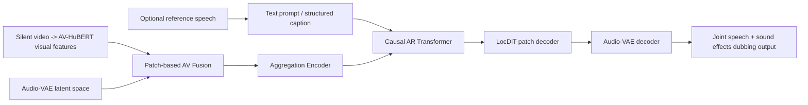
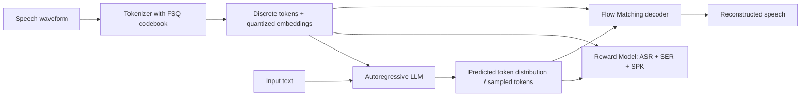
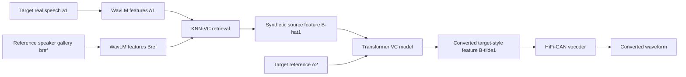
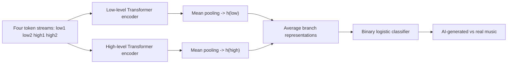
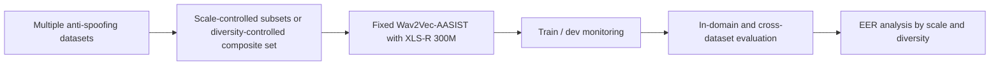

# 语音 / 音频 / 音乐论文速递
## 2026-06-09

> 实际对应 arXiv 更新日：**2026-06-09**  
> 检索范围：`cs.SD + eess.AS`  
> 只放按 ML 顶会审稿口径看，最值得多数读者花时间看的 **5 篇**

## 📋 总览

- 共收录 **5 篇** 相关论文
- 语音生成 / 视频配音：**2 篇**
- 音色转换：**1 篇**
- 音乐安全 / 检测：**1 篇**
- 语音安全 / 数据分析：**1 篇**

今天这批里最值得看的，不是“谁又把参数堆大了”，而是三条更具体也更硬的线。`HoliDubber` 把视频配音从“只配人声”推进到“人声+环境音+音效一体生成”，而且不是靠后期拼接糊过去；`End-to-End Training for Discrete Token LLM based TTS System` 盯住了离散 token TTS 最真实的短板，也就是 tokenizer、LLM、flow matching 各训各的接口错配；`Probing Token Spaces under Generator Shift in AI-Generated Music Detection` 则提醒大家，音乐 deepfake 检测里 token space 不是预处理小细节，而是决定跨 generator 泛化上限的主变量。

剩下两篇也不是凑数。`From A to B to A` 这篇 VC 论文虽然没有大厂式铺天盖地实验，但它用 KNN 合成伪配对、再做回文式训练，确实把 non-parallel zero-shot VC 做得很干净；`Exploring the Scale and Diversity of Speech Anti-spoofing Datasets` 则是少见肯认真打脸“大数据万能论”的 anti-spoofing 分析文，结论直接，而且对做数据集的人比对做模型的人还重要。

## 精选入选规则

- **新意（0-3）**：是不是提出了新的表示、接口、训练组织方式，或者把老问题拆得更对
- **影响力（0-3）**：是不是贴近 TTS、语音生成、VC、音频安全、音乐生成这些主线
- **证据强度（0-2）**：有没有像样的 baseline、消融和关键数值
- **受众匹配度（0-2）**：对语音大模型 / 语音前端 / 音乐方向 / 安全检测研究者有没有直接启发

分数校准：

- **6**：可读，但更像局部分析或补丁
- **7**：信息量够，值得过一遍
- **8+**：建议优先精读

## 总览表

| 方向 | 序号 | 论文 | 评分 | 关键词 |
|---|---:|---|---:|---|
| 视频配音 / 语音生成 | 1 | HoliDubber | 8.5/10 | holistic dubbing, patch-based AV fusion, LocDiT, structured caption |
| 离散 token TTS | 2 | End-to-End Training for Discrete Token LLM based TTS System | 8.5/10 | tokenizer-LLM-FM joint training, reward model, first-order loss, second-order loss |
| 音色转换 | 3 | From A to B to A | 8/10 | zero-shot VC, non-parallel, KNN retrieval, palindromic training |
| 音乐安全 / 生成检测 | 4 | Probing Token Spaces under Generator Shift in AI-Generated Music Detection | 8/10 | generator shift, CoMoE, X-Codec, MoM-open |
| 语音安全 / 数据分析 | 5 | Exploring the Scale and Diversity of Speech Anti-spoofing Datasets | 7.5/10 | anti-spoofing dataset, diversity vs scale, XLS-R 300M, cross-dataset EER |

## 🎬 视频配音 / 语音生成

### [1] HoliDubber: Holistic Video Dubbing for Complex Acoustic Scenes via Text-Guided Audio Synthesis

- **评分**：8.5/10
- **作者/机构**：Wenhao Guan, Yifan Duan, Junxi Liu, Yu Gu, Feng Dang, Kaidi Wang, Qingyang Hong, Lin Li, Xie Chen；厦门大学、上海交通大学、上海创新研究院、Joy Future Academy
- **论文链接**：https://arxiv.org/abs/2606.09098
- **PDF**：https://arxiv.org/pdf/2606.09098.pdf
- **代码链接**：暂无
- **Demo 链接**：https://holidubber.github.io

#### 📌 简介
这篇做的是“完整视频配音”，不是传统那种只把台词念出来的 dubbing。作者要解决的是复杂声学场景里的人声、背景音乐、环境声和突发音效要一起生成，而且还得跟嘴型和视觉动作同步。核心方法是一个 patch-based 的自回归 diffusion Transformer：上层建模全局时间结构，下层在 patch 内合成高保真连续音频 latent。

#### ☠️ 毒舌点评
这篇明显不是把 TTS 模型套个视频 encoder 就交差。真正有价值的地方在于它没有继续把“说话声”和“音效/环境声”拆成两条管线，再靠后期混音缝起来。缺点也很明显：WER 不是全场最好，说明它更偏 holistic generation，而不是纯语音识别意义上的字字精准；但做视频配音、影视本地化、可控 audio-for-video 的人，确实该读。

#### 🔧 技术方案
- **模型解决的问题**：
  现有自动配音大多只合成人声，复杂场景里背景音、音乐和音效还得手工补；而 video-to-audio 系统虽然能出声，但往往缺自然语言控制，也很难兼顾说话人一致性。`HoliDubber` 解决的是“能不能用一套统一模型，在视频条件下按照文本描述直接同时生成人声和非语音声学内容”。
- **模型架构**：
  - **输入**：静音视频 `V`、文本描述 `T`，可选 reference speech `R`。
  - **输出**：和视频同步的完整 acoustic scene，包括 speech、background sound、music 和 sound effects。
  - **主干**：`Audio-VAE + Patch-based Audio-Visual Fusion + Aggregation Encoder + Causal Autoregressive Transformer + Local Diffusion Transformer (LocDiT)`。
  - **关键模块**：
    - `Audio-VAE`：把 32 kHz 音频编码为连续 latent，统一 speech / non-speech / music 混合建模空间。
    - `Patch-based AV Fusion`：把视频 patch 特征和音频 patch latent 用 cross-attention 融合。
    - `Aggregation Encoder`：把 patch 内 token 聚合成单个 coarse embedding，供上层自回归建模。
    - `Causal AR Transformer`：负责 patch 级全局时序建模。
    - `LocDiT`：在当前 patch 内做 flow-matching / diffusion 风格细粒度生成。
- **信号流**：

- **关键设计 / 核心创新**：
  - 不再把 speech generation 和 sound generation 拆成双头或双系统，而是在一个共享 latent 空间里统一建模。
  - 引入结构化 caption：`<speaker profile> + <speech instruct> + <audio caption> + <text>`，把视频配音从“只看字幕”升级成多字段可控音频描述。
  - `patch-based` 设计把“长时全局结构”和“局部高保真细节”拆开，避免一把梭的大模型既贵又不稳。
  - 训练中对文本字段随机 dropout，让同一个模型既能做 zero-shot dubbing，也能做 text-prompt-guided dubbing。
- **训练 / 推理策略**：
  - 先训练 `Audio-VAE`，总音频规模约 **30,000 小时**，平均覆盖 speech、non-speech audio、music 及自然混合音频。
  - 再预训练 text-guided audio generation backbone，总规模约 **130,000 小时**：
    `80,000h Emilia` 语音、`20,000h` 自然混合 speech-audio、`20,000h` 结构化 caption 语音、`10,000h` 非语音与音乐。
  - 最终用 `VoxCeleb2` 与 `CelebV-Dub` 联合训练，视频以 **25 FPS** 输入，patch size 设为 **5**。
  - `Aggregation Encoder` 用 **4 层 Transformer**、`LocDiT` 用 **12 层 Transformer`；训练时随机丢弃辅助文本字段，推理阶段支持 reference-speech 模式和纯文本模式。
  - 推理性能数值文中未给出。

#### 📊 实验结果
- 零样本配音，`VoxCeleb2` 测试集：
  - `HoliDubber`：`LSE-C 6.83`、`LSE-D 7.87`、`SPK-SIM 0.68`、`WER 24.12`、`UTMOS 2.79`、`MOS 3.83`
  - 对比 `AlignDiT`：`SPK-SIM 0.55`、`WER 20.92`、`MOS 3.72`
  - 对比 `FunCineForge`：`LSE-C 1.56`、`LSE-D 13.29`、`SPK-SIM 0.46`、`UTMOS 3.70`、`MOS 3.91`
  - 结论是：`HoliDubber` 在 lip-sync 和 speaker similarity 上明显更稳，但纯语音 WER 不是最低。
- 文本引导配音，`CelebV-Dub`：
  - `HoliDubber`：`WER 19.42`、`MOS 3.99`、`FD 6.85`、`FAD 3.16`、`KLD 0.69`、`IS 1.32`
  - `FunCineForge`：`WER 22.17`、`MOS 3.96`、`FD 15.24`、`FAD 4.11`
  - 非语音内容生成质量上，`HoliDubber` 的 `FD/FAD` 明显更好。
- `HoliDub-Bench`：
  - 相比无视频条件的 text-to-audio backbone `TTA`，`HoliDubber` 的 `LSE-C 6.44 vs 1.21`，`WER 12.81 vs 15.28`，`FAD 3.08 vs 10.51`。
  - 说明视觉条件不是摆设，确实同时提升了同步和非语音音频保真。
- 消融：
  - 去掉 reference video：`LSE-C 6.83 -> 4.29`，`LSE-D 7.87 -> 10.21`
  - 去掉 patch-AV fusion：`SPK-SIM 0.68 -> 0.15`，`WER 24.12 -> 62.19`，直接崩盘
  - 去掉 prompt random dropout：`LSE-C 6.83 -> 4.61`
- baseline：`AlignDiT`、`VoiceCraft-Dub`、`FunCineForge`、`TTA`

#### 💡 为什么值得看
这篇最值得看的，不是它又做了一个“更全能”的视频音频模型，而是它把完整配音任务里最麻烦的三件事绑在了一起：语义控制、视觉同步、非语音声学内容生成。对做影视本地化、可控 audio generation、video-to-audio 的人，这个问题拆法比单看指标更有参考价值。

### [2] End-to-End Training for Discrete Token LLM based TTS System

- **评分**：8.5/10
- **作者/机构**：Changfeng Gao, Yong Ren, Jun Yuan, Ye Bai, Zhao You, ShiDong Shang；腾讯元宝
- **论文链接**：https://arxiv.org/abs/2606.09234
- **PDF**：https://arxiv.org/pdf/2606.09234.pdf
- **代码链接**：暂无
- **Demo 链接**：暂无

#### 📌 简介
这篇盯的是离散 token TTS 体系里最真实也最常被忽略的问题：tokenizer、LLM、flow-matching decoder 通常是各自训练的，结果 token space、语言模型预测分布和下游重建目标彼此并不匹配。作者直接把 tokenizer、LLM、FM，以及一个多任务 reward model 一起做 end-to-end 优化，目标是让 token 更适合“被预测”和“被还原”。

#### ☠️ 毒舌点评
这篇不是“又一个 TTS 大模型刷榜”那么浅。它抓住的是接口错配这个老问题，而且给了比较完整的系统级方案。真正的亮点不是把 CE 换个名字，而是 first-order / second-order 两层联合优化把 tokenizer 也拉进来。缺点是论文更偏工程体系优化，不是范式级新结构；但如果你真在做 discrete-token TTS，这比很多换 backbone 的文章更值得抄。

#### 🔧 技术方案
- **模型解决的问题**：
  当前离散 token TTS 往往先训 tokenizer，再训 LLM，再训 FM；tokenizer 学到的空间未必最利于文本到 token 的预测，也未必最利于后端语音重建。`E2E-TTS` 解决的是“如何让 speech tokenizer 的离散表示同时对 LLM 友好、对 FM 友好、对识别一致性也友好，并减少训练和推理分布错配”。
- **模型架构**：
  - **输入**：文本 `y1:N` 与语音 `x1:T`；训练时同时看到真值 token 和 LLM 预测 token。
  - **输出**：离散 speech token、量化 embedding，以及最终重建语音。
  - **主干**：`Speech Tokenizer + LLM + Flow Matching decoder + Reward Model`。
  - **关键模块**：
    - `Tokenizer`：基于 `FSQ` 单码本量化，把语音映射到离散 token 和量化表示 `q1:T`。
    - `LLM`：自回归预测下一个 speech token。
    - `FM`：根据 token / embedding 做连续语音重建。
    - `RM`：共享 Transformer audio encoder，同时做 `ASR + SER + SPK` 三任务监督。
- **信号流**：

- **关键设计 / 核心创新**：
  - `First-order loss`：同时用 `LLM next-token prediction + FM reconstruction + RM multi-task recognition` 直接塑造 tokenizer。
  - `Second-order loss`：把 LLM 采样得到的 token 喂回 FM 和 RM，在模型自己的生成分布上继续优化，减少 train-test mismatch。
  - 使用 `Gumbel-Softmax` 让 LLM 采样路径可反传，不再只在离散 token CE 上自嗨。
  - 把 tokenizer 训练问题从“代理任务优化”改成真正围绕下游 TTS 链路优化。
- **训练 / 推理策略**：
  - 三阶段训练：
    - **Stage 1**：联合训练 tokenizer、RM、FM、LM，对应 `L1 = αLLM + βLRM + γLFM`
    - **Stage 2**：冻结 tokenizer 后分别继续优化 RM、FM、LM，提高模块稳健性
    - **Stage 3**：引入 second-order loss `L2`，在 LLM 自身预测分布上继续优化
  - 训练数据为约 **100,000 小时** 的中英 in-house TTS 数据，语言比例约 **4:1**
  - 模型规模：
    - tokenizer **0.6B**
    - RM **0.6B**
    - LM **0.6B**
    - FM **0.5B**
  - 使用 **64 张 NVIDIA H20**
  - Stage 1 学习率峰值 `1e-4`，warmup `25k`；`LLM / FM / RM` loss 权重分别为 `0.1 / 1.0 / 1.0`
  - Stage 2 学习率降到 `1e-5`，并额外引入 `Emo2Vec-Large` 伪情感标签和 noisy speech 强化 RM
  - Stage 3 中 `LLRM` 里 `LSPK=0.1`、`LASR=1.0`
  - 推理性能如 RTF、吞吐、显存文中未给出。

#### 📊 实验结果
- `SEED-TTS` 零样本 TTS：
  - `E2E-TTS-Stage3`：中文 `CER 0.78 / SS 0.781`，英文 `WER 1.56 / SS 0.705`
  - 对比 `JoyVoice`：中文 `CER 0.97 / SS 0.786`，英文 `WER 1.69 / SS 0.736`
  - 对比 `Qwen3-TTS-0.6B`：中文 `CER 1.18`
  - 对比 `CosyVoice3-1.5B`：中文 `CER 1.12`，英文 `WER 2.21`
  - 对比非自回归 `F5-TTS`：中文 `CER 1.56`，英文 `WER 1.83`
- 去掉 E2E 联训：
  - `w/o E2E-training` 英文 `WER 1.89`，明显差于 `Stage3 1.56`
  - 同时中文 `CER 0.87` 也高于 `0.78`
- FM 重建能力：
  - 在 `CV3-Subject` 上，`Stage1 -> Stage2 -> Stage3` 的 `WER` 从 `11.71 -> 11.67 -> 11.56`
  - speaker similarity 从 `0.762 -> 0.781 -> 0.780`
  - 说明第二阶段联合调优对重建质量帮助最大，第三阶段主要继续修正 pronunciation。
- RM 识别能力：
  - `LibriSpeech test-clean ASR WER`：`Stage2 2.22`，优于 `S3-Tokenizer-FSQ` 的 `-` 和 `Qwen-TTS-Tokenizer` 对应设置
  - `CMV-zh`：`Stage2 6.50`，优于 `S3-Tokenizer-FSQ 7.27`
  - `MELD SER WA`：`55.6`
- token 统计：
  - 只用 `RM` 时 token 熵 `H(Xn)=10.905`
  - 加上 `FM` 后 `11.254`
  - 再加 `LM` 后 `11.363`
  - `I(Xn+1;Xn)` 从 `2.50 -> 2.55`
  - 说明联合优化后的 token space 更均匀、更可预测，不是只会挤在少数码字上。
- baseline：`Seed-TTS`、`CosyVoice3-1.5B`、`Qwen3-TTS-0.6B`、`JoyVoice`、`F5-TTS`、`MaskGCT`

#### 💡 为什么值得看
这篇真正值得看的，是它把“tokenizer 只是前处理”这个偷懒假设狠狠干掉了。离散 token TTS 以后还会继续卷，但谁要是还把 tokenizer、LM、decoder 三段完全割裂地训，多半就是在浪费一半性能上限。

## 🎤 音色转换

### [3] From A to B to A: Palindromic Zero-Shot Voice Conversion with Non-Parallel Data

- **评分**：8/10
- **作者/机构**：Moshe Mandel, Shlomo E. Chazan；Independent / OriginAI（Israel）
- **论文链接**：https://arxiv.org/abs/2606.08843
- **PDF**：https://arxiv.org/pdf/2606.08843.pdf
- **代码链接**：暂无
- **Demo 链接**：https://palindromic-vc.github.io

#### 📌 简介
这篇做的是 non-parallel、zero-shot、any-to-any VC。核心思路不靠平行数据，也不靠预先对齐句子，而是先用 `KNN-VC` 在 `WavLM` 表征空间里把目标说话人的真实语音变成一个“伪源语音”表示，再反过来训练模型把这个 synthetic source 映射回真实 target。作者把这种闭环叫 `palindromic training framework`。

#### ☠️ 毒舌点评
这篇最可取的是问题拆得挺克制，没有把 VC 强行包装成一个无所不能的大模型故事。方法看起来像“KNN + Transformer + vocoder”的熟人局，但关键是训练闭环设计得顺，而且 speaker loss 真起作用了。短板是规模不大、任务边界也偏窄，更多是一个强 baseline 级方法，不是能一统江湖的新范式。

#### 🔧 技术方案
- **模型解决的问题**：
  传统 VC 对 parallel / aligned data 很依赖，或者需要较长目标说话人参考音频；one-shot 场景下 KNN 检索也容易因为参考不足而自然度掉得厉害。本文解决的是“如何在非平行数据下，用可控的合成伪配对，让 zero-shot VC 也能获得 supervised learning 的好处”。
- **模型架构**：
  - **输入**：源说话人语音、目标说话人短参考语音。
  - **输出**：保留源内容、转换为目标音色的语音波形。
  - **主干**：`WavLM encoder + Transformer latent converter + HiFi-GAN vocoder`
  - **关键模块**：
    - `KNN retrieval over WavLM features`：在表示空间生成 synthetic source feature `B̂1`
    - `Palindromic triplet`：`A2`（目标参考）、`B̂1`（合成源）、`a1`（真实目标）
    - `Speaker verification loss`：用预训练 speaker verifier 在 waveform 级直接压 speaker identity
    - `Stage-3 vocoder post-training`：让 vocoder 适应 transformer 产出的 feature 分布
- **信号流**：

- **关键设计 / 核心创新**：
  - 用 `synthetic-to-real` 训练替代平行数据监督，避免对齐语料成本。
  - `palindromic` 关键不在名字，而在它把“目标语音 -> 合成伪源 -> 再转回目标”的可逆训练闭环建立起来。
  - `speaker verification` 波形级损失直接约束目标音色，而不是只在 feature space 里盲目做 L1。
- **训练 / 推理策略**：
  - **Stage 1**：训练 vocoder，从 `WavLM` 特征重建语音；损失含 `MR-STFT`、`MPD/MSD adversarial`
  - **Stage 2**：训练 **77M**、`6 层 / 16 heads / hidden 1024` 的 Transformer VC 模型，优化 feature L1 + speaker loss
  - **Stage 3**：再训练一版 vocoder 适配转换后特征分布
  - 预训练 vocoder **100k** steps，Transformer **800k** steps，再 vocoder post-training **100k** steps
  - `WavLM` 取 **第 6 层**特征；优化器 `Adam`，学习率 `3e-4`
  - 英文训练数据是 `LibriSpeech 960h`；多语言测试用 `Multilingual LibriSpeech`
  - 推理阶段只需真实源语音和目标短 prompt，不需要非平行对齐处理。

#### 📊 实验结果
- 英文测试，目标 prompt 时长 **10s**：
  - `Ours`：`Spk Sim 0.713`、`EER 0.180`、`WER 0.049`、`CER 0.022`、`MOS 3.647`
  - `KNN-VC`：`0.552 / 0.053 / 0.115 / 0.062 / 2.588`
  - `Vevo`：`0.639 / 0.133 / 0.033 / 0.011 / 3.765`
  - speaker similarity 明显更强，但 WER 不是每个设定都赢。
- 英文测试，**30s** prompt：
  - `Ours`：`Spk Sim 0.717`、`EER 0.170`、`WER 0.047`、`CER 0.019`、`MOS 3.666`
  - `Seed-VC`：`0.622 / 0.083 / 0.026 / 0.011 / 3.666`
  - `KNN-VC`：`0.617 / 0.070 / 0.042 / 0.018 / 3.500`
  - 可以看出它主打的是 speaker identity preservation，不是绝对最低 WER。
- 多语言泛化：
  - 在 `Dutch / French / German / Italian / Polish / Portuguese / Spanish` 的 `MLS` 测试上，无需非英文微调，`WER` 全面优于多基线，`speaker similarity` 与 `DNS-MOS` 保持可比。
- vocoder post-training 消融：
  - **60s** prompt 下，post-training 前 `DNS-MOS 3.801`，后 `3.819`
  - **10s** prompt 下 `Spk Sim 0.689`、`WER 0.042`、`DNS-MOS 3.770`
  - 说明后处理主要修音质和伪影，不明显影响内容保持。
- baseline：`KNN-VC`、`Seed-VC`、`Vevo`、`OOVC`

#### 💡 为什么值得看
如果你做 VC，这篇最值得看的不是它指标是不是全 SOTA，而是它把 non-parallel supervision 这件事做得很务实。很多 zero-shot VC 论文要么靠大数据堆平，要么靠复杂 disentanglement 神学；这篇反而用更便宜的 synthetic supervision 给出了一个挺干净的工程解。

## 🎼 音乐安全 / 生成检测

### [4] Probing Token Spaces under Generator Shift in AI-Generated Music Detection

- **评分**：8/10
- **作者/机构**：Joonyong Park, Jungwoo Kim, Junyoung Koh, Yuki Saito；The University of Tokyo、MAAP Lab、Yonsei University
- **论文链接**：https://arxiv.org/abs/2606.08663
- **PDF**：https://arxiv.org/pdf/2606.08663.pdf
- **代码链接**：**代码已开源** https://github.com/MAAP-LAB/CoMoE
- **Demo 链接**：暂无

#### 📌 简介
这篇研究的不是“怎么再堆一个更大 detector”，而是 generator shift 下哪种 audio token space 更扛打。作者把下游 classifier 固定成一个小模型 `CoMoE`，只换前端 token space，系统比较 `X-Codec`、`DAC`、`EnCodec`、`MERT k-means` 和 continuous `MERT`。结论很直接：假 generator 变了以后，tokenizer 选型会直接改写检测上限。

#### ☠️ 毒舌点评
这篇最有价值的是实验设计，不是模型复杂度。它刻意把 classifier 锁死，避免又陷入“谁网络大谁赢”的废话。真正戳痛点的是 `fake-source-restricted` 评测，一下就把很多在标准 split 里接近满分的方法打回原形。短板是它主要是 controlled study，不是端到端最强系统，但恰恰因为克制，结论更可信。

#### 🔧 技术方案
- **模型解决的问题**：
  AI 音乐检测在普通 benchmark 上经常几乎饱和，但现实部署里最难的是训练没见过的新 generator。本文解决的是“当 fake source 发生 shift 时，到底是哪种 token representation 更能迁移，而不是哪种 detector 在封闭 split 上更会背题”。
- **模型架构**：
  - **输入**：四路离散 token streams，来自 `X-Codec / DAC / EnCodec / MERT k-means` 等前端。
  - **输出**：二分类结果，判断音乐是 human-made 还是 AI-generated。
  - **主干**：固定结构的 `CoMoE (Codec-Mixture-of-Experts)`
  - **关键模块**：
    - 两个 lower-level token streams
    - 两个 higher-level token streams
    - 两个共享规格但分开的 Transformer encoders：`4 层`, `d=256`, `4 heads`
    - mean pooling 后做 binary logistic classifier
- **信号流**：

- **关键设计 / 核心创新**：
  - 真正的创新不是 classifier，而是 controlled probe：同一后端，只换 token space，强行把表示空间的影响单独剥出来。
  - 引入 `MoM-open`，把原来不可重分发的 real music 换成 `FMA-medium + MTG-Jamendo`，同时保留 fake-generator protocol。
  - 评测不只看 `base split`，还看 `real-source-restricted` 与 `fake-source-restricted`，尤其后者最接近真实 generator shift。
- **训练 / 推理策略**：
  - `MoM-open` 总计 **146,309** clips
  - real audio：`FMA-medium 24,979` + `MTG-Jamendo 52,501`
  - fake train：`Suno-v2 660`、`Suno-v3.5 28,611`、`Udio 19,500`
  - held-out fake：`Suno-v3 3,116`、`Suno-v4 27`、`YuE 5,278`
  - 训练时固定 classifier 架构和训练 recipe，只替换 token front-end
  - 阈值由 validation F1 决定，然后原封不动迁移到 held-out fake source 上，避免测试集作弊调参
  - 推理性能文中未给出。

#### 📊 实验结果
- `base split` 和 `real-source-restricted` 基本接近饱和：
  - `CoMoE(X-Codec)`：`base AUC 99.93`
  - `MLP(MERT)`：`99.77`
  - `CLAM`：`99.92`
  - 说明这类闭卷分法几乎测不出谁更稳。
- 真正关键的 `fake-source-restricted`：
  - `FAKE-Udio` 上：
    - `CoMoE(X-Codec) 89.04`
    - `DAC 77.28`
    - `MERT k-means 73.26`
    - `MERT-continuous 71.91`
    - `CLAM 66.51`
    - `EnCodec 58.64`
  - `FAKE-Suno3.5` 上：
    - `MERT-continuous 93.84`
    - `MERT k-means 92.22`
    - `DAC 88.33`
    - `X-Codec 86.97`
  - 结论不是“某个表示绝对最强”，而是不同 token space 对不同 generator shift 的迁移特性明显不同。
- 阈值迁移后的 held-out-fake detection rate 更残酷：
  - `FAKE-Udio`：
    - `CoMoE(X-Codec) 45.1%`
    - `DAC 29.2%`
    - `MLP(MERT) 26.0%`
    - `EnCodec 23.5%`
    - `MERT k-means 17.3%`
    - `CLAM 2.6%`
  - 这个结果说明很多高 AUC 方法一旦固定阈值，部署表现会直接塌。
- baseline：`CLAM`、`MLP(MERT)`、`CoMoE(DAC)`、`CoMoE(EnCodec)`、`CoMoE(MERT k-means)`、`MERT-continuous`

#### 💡 为什么值得看
如果你做音乐生成安全，这篇最值得看的不是 `CoMoE` 本身，而是它把“tokenizer 是预处理细节”这个错觉狠狠干掉了。以后谁在 cross-generator 检测里不报 fake-source-restricted，基本可以默认是在做闭卷刷分。

## 🛡️ 语音安全 / 数据分析

### [5] Exploring the Scale and Diversity of Speech Anti-spoofing Datasets: Experiments and Analysis

- **评分**：7.5/10
- **作者/机构**：Zhuolin Yi, Jun Xue, Yanzhen Ren, Yihuan Huang, Yi Chai, Daixian Li, Guanxiang Feng, Jiajun Liu；武汉大学网络安全学院
- **论文链接**：https://arxiv.org/abs/2606.08038
- **PDF**：https://arxiv.org/pdf/2606.08038.pdf
- **代码链接**：暂无
- **Demo 链接**：暂无

#### 📌 简介
这篇不是提新 anti-spoofing 模型，而是认真拆一个很少有人愿意正面回答的问题：数据集越大，语音 deepfake 检测就真的越强吗？作者用固定模型 `Wav2Vec-AASIST + XLS-R 300M`，分别研究训练数据规模和生成方法多样性对泛化的影响，结论很不客气：固定生成方法下盲目扩数据，收益很有限，甚至会伤害跨域泛化；反而是多样性更重要。

#### ☠️ 毒舌点评
这类论文最容易水，因为“分析型论文”常常等于“摆几张图然后喊结论”。这篇好在它至少做了两个拆分实验，而且结论跟直觉对着干。缺点是它没继续深挖 sample selection 或 model capacity 的相互作用，所以更像一篇方向纠偏文，而不是最终答案。但如果你还在相信 anti-spoofing 只要继续堆小时数就行，这篇应该先读。

#### 🔧 技术方案
- **模型解决的问题**：
  语音 anti-spoofing 社区近几年数据量暴涨，但“规模”和“多样性”常常一起涨，导致很难知道模型泛化到底是因为更多小时数，还是因为看过更多生成方法。本文解决的是“如何在固定模型下，把数据规模效应和生成方法多样性效应拆开测”。
- **模型架构**：
  - **输入**：来自多种 speech anti-spoofing 数据集的 real / fake speech
  - **输出**：spoof / bona fide 二分类
  - **主干**：固定 `Wav2Vec-AASIST`，预训练 backbone 为官方 `XLS-R 300M`
  - **关键模块**：
    - `scale experiment`：对同一数据集按 `1% / 5% / 10% / 20% / 50% / 100%` 采样
    - `diversity experiment`：从多个数据集每种生成方法抽定量样本，构建 composite set
    - `RawBoost` augmentation
- **信号流**：

- **关键设计 / 核心创新**：
  - 不换模型，不调容量，专门看训练数据属性。
  - 一组实验固定 generation methods 只改规模；另一组实验固定相对小规模但提高 generation-method diversity。
  - 用 composite training set 正面对比“大而单一”和“小而多样”。
- **训练 / 推理策略**：
  - 统一使用 `Wav2Vec-AASIST + XLS-R 300M`，训练时开启 `RawBoost`
  - `Speechfake-BD` 和 `ASVspoof5` 做 scale 实验，分别抽 `1%~100%`
  - diversity 实验从 `Speechfake-BD / ASVspoof5 / CD-ADD / Spoofceleb` 中每种生成方法抽 **1000** 条 fake，并用 `Speechfake-BD` 的 real 组成 composite set
  - composite set 总规模约 **94h**，覆盖 **53** 种 generation methods
  - 测试用 `In-the-Wild`、`VoiceWukong`、`FSW` 等跨域集，评价指标用 `EER`
  - 推理性能和参数开销文中未给出。

#### 📊 实验结果
- 数据集背景：
  - `ASVspoof2015` 只有 **16 小时**
  - `Speechfake` 覆盖 **46 种生成方法**、约 **3000+ 小时**
  - `AntiDeepfake` 通过多数据集联合训练堆到 **74,000 小时**
  - 但作者指出，规模暴涨并没有线性带来泛化收益。
- `scale` 实验：
  - 在 `Speechfake-BD` 上，最优 cross-domain 表现多数出现在 **20%** 数据量，而不是 `100%`
  - 在 `ASVspoof5` 上，最优往往出现在 **10% 或 20%**
  - 结论是：固定攻击类型时，越多样本不一定越好，反而可能过拟合已有生成器分布。
- `diversity` 实验，跨域 `EER`：
  - `Composite`：`Avg 13.03`，`In-the-Wild 2.06`，`VoiceWukong 19.46`，`FSW 17.58`
  - `Speechfake-BD`：`Avg 17.52`
  - `CD-ADD`：`21.65`
  - `ASVspoof5`：`27.92`
  - `Spoofceleb`：`19.67`
  - 最有意思的是：最大的 `Spoofceleb`（**1982h**, **10** 种生成方法）明显不如只有 **94h**、但覆盖 **53** 种方法的 composite set。
- baseline / 对比对象：
  - 不是多模型竞赛，而是固定 `Wav2Vec-AASIST` 在不同训练集配置下的横向对比。
  - 这个设计虽然不花哨，但更能说明“多样性比盲目扩规模更重要”。

#### 💡 为什么值得看
这篇最值得看的，不是它证明了“大数据没用”，而是它告诉你 anti-spoofing 数据工程真正该花钱的地方在哪。以后再有人拿更大的同质化数据集吹泛化，你最好先问一句：你到底多了多少新生成方法，而不是多了多少小时。

## 最后结论

今天最值得优先看的三篇，我会这么排：

1. `End-to-End Training for Discrete Token LLM based TTS System`
2. `HoliDubber: Holistic Video Dubbing for Complex Acoustic Scenes via Text-Guided Audio Synthesis`
3. `Probing Token Spaces under Generator Shift in AI-Generated Music Detection`

如果你做 `TTS / speech LM`，第一篇优先级最高，因为它碰的是系统接口而不是局部 patch。  
如果你做 `video dubbing / controllable audio generation`，第二篇最有工程启发。  
如果你做 `music deepfake detection / audio safety`，第四篇的评测设计比它的模型本身还值钱。

剩下两篇里，VC 那篇适合想找一个干净 non-parallel zero-shot baseline 的人；anti-spoofing 数据分析那篇适合带数据集或做安全评测的人拿来校正方向。总体上，2026-06-09 这批论文的特点不是“明星大一统模型很多”，而是有几篇愿意正面啃真实系统短板，这反而更值得花时间。
