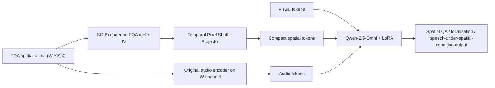
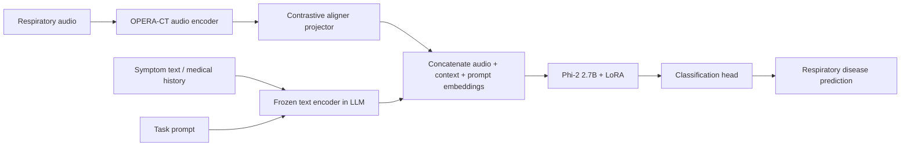
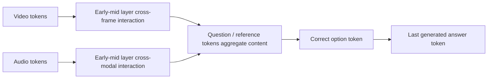
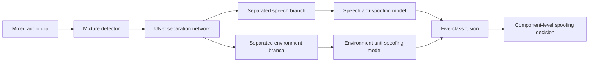
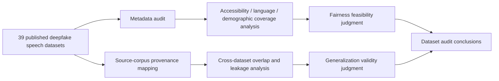

# 语音 / 音频 / 音乐论文速递
## 2026-06-10

> 实际对应 arXiv 更新日：**2026-06-10**  
> 检索范围：`cs.SD + eess.AS`  
> 只放按 ML 顶会审稿口径看，最值得多数读者花时间看的 **5 篇**

## 📋 总览

- 共收录 **5 篇** 相关论文
- 语音大模型 / 多模态理解：**2 篇**
- 语音安全 / deepfake：**2 篇**
- 医疗音频 / 多模态诊断：**1 篇**

今天这批真正值得看的主线，不是“某个模型又更大了”，而是三条更扎实的方向。`Spatial-Omni` 直接补 Omni LLM 在空间音频上的结构性短板，把 FOA 空间信息作为独立模态接进 Qwen-2.5-Omni；`RespiraMFM` 说明医疗音频多模态不是把症状文本和咳嗽声生拼硬接就行，先做 contrastive 对齐确实能把 zero-shot 诊断拉起来；`From Senses to Decisions` 则是少见的 AVLLM 机理分析稿，给了“音视频信息到底在哪几层、沿什么路径流到答案”的可操作结论。

另外两篇 deepfake 相关稿子定位不同。`ESDD2` 更像社区赛题复盘，方法本身不新，但它把环境声 spoofing 这个长期被忽略的坑讲清楚了；`Ethical and Technical Limits of Deepfake Speech Datasets` 没有新模型，但把语音 deepfake 评测里最常被糊弄的“数据集公平性”和“跨数据泛化”问题直接掀桌。做前沿模型的人未必都要细读，但做评测、做安全、做 benchmark 的人最好别装没看见。

## 精选入选规则

- **新意（0-3）**：是不是提出了新的表示、接口、训练组织方式，或者把旧问题拆得更对
- **影响力（0-3）**：是不是贴近语音大模型、音频理解、deepfake、医疗音频这些主线
- **证据强度（0-2）**：有没有像样的 baseline、消融和关键数值
- **受众匹配度（0-2）**：对语音大模型 / 语音前端 / 语音安全 / 音频系统研究者有没有直接启发

分数校准：

- **6**：可读，但更像经验总结或局部分析
- **7**：信息量够，值得过一遍
- **8+**：建议优先精读

## 总览表

| 方向 | 序号 | 论文 | 评分 | 关键词 |
|---|---:|---|---:|---|
| 语音大模型 / 空间理解 | 1 | Spatial-Omni | 8.5/10 | FOA, spatial token, Omni LLM, SO-Bench, staged training |
| 医疗音频 / 多模态诊断 | 2 | RespiraMFM | 8/10 | contrastive alignment, respiratory audio, Phi-2, zero-shot diagnosis |
| 语音大模型可解释性 | 3 | From Senses to Decisions | 8/10 | AVLLM interpretability, attention knockout, sequential flow, token discard |
| 语音安全 / 环境感知反欺骗 | 4 | ESDD2 | 7.5/10 | deepfake challenge, component-level spoofing, SSL backbone, Macro-F1 |
| 语音安全 / 数据集审计 | 5 | Ethical and Technical Limits of Deepfake Speech Datasets | 7.5/10 | dataset audit, fairness, provenance overlap, cross-dataset leakage |

## 🤖 语音大模型 / 空间理解

### [1] Spatial-Omni: Spatial Audio Understanding Integration in Multimodal LLMs via FOA Encoding

- **评分**：8.5/10
- **作者/机构**：Zhiyuan Zhu, Yixuan Chen, Yiwen Shao, Wenxiang Guo, Changhao Pan, Yu Zhang, Yuxiang Wang, Wei Liu, Houhua Zhang, Chengkuan Zeng, Wenbo Cheng, Yunxi Liu, Rui Yang, Steve Yves, Liefeng Bo, Zhou Zhao；浙江大学、Tencent Hunyuan
- **论文链接**：https://arxiv.org/abs/2606.10738
- **PDF**：https://arxiv.org/pdf/2606.10738.pdf
- **代码链接**：**代码已开源** https://github.com/dieKarotte/Spatial-Omni
- **Demo 链接**：暂无单独 demo，代码仓已公开数据与模型

#### 📌 简介
这篇解决的是 Omni LLM 长期把音频当单声道处理、把空间线索直接扔掉的问题。作者没有去暴改原始音频编码器，而是额外挂一个 `SO-Encoder`，把 FOA 空间音频编码成独立 spatial tokens，再和原始 audio / visual / text tokens 一起喂给 Qwen-2.5-Omni。

#### ☠️ 毒舌点评
这不是“给 LLM 加点空间特征”那么水的活。它真正像样的地方在于同时补了三块地基：编码分支、400K FOA 数据、2.1M QA 和 16 子任务 benchmark。短板也很明确，很多能力还是 benchmark 驱动出来的，离真实泛化空间听觉助手还有距离，但这已经比大多数 spatial-audio-LLM 论文扎实不少。

#### 🔧 技术方案
- **模型解决的问题**：现有 LALM / Omni LLM 的音频路径基本保留语义、丢掉方向、距离、运动和多声源关系，所以做空间定位、空间关系推理、带方向条件的语音理解时天然吃亏。`Spatial-Omni` 想补的是“怎么在不毁掉原始音频语义通道的前提下，把 FOA 空间信息可靠接进 Omni LLM”。
- **模型架构**：
  - **输入**：FOA 四通道空间音频 `(W, Y, Z, X)`，可选视觉输入与文本问题。
  - **输出**：空间音频问答结果，覆盖检测、定位、距离、关系、运动、语义推理和带空间条件的语音识别。
  - **主干**：`Qwen-2.5-Omni 7B` 主体不换，旁路增加 `SO-Encoder + Temporal Pixel Shuffle Projector`。
  - **关键模块**：
    - `SO-Encoder`：从 FOA mel + intensity vector 特征里提空间残差，保留方向、距离、运动、多源关系。
    - `Temporal Pixel Shuffle Projector`：把帧级 spatial latent 压成紧凑 spatial tokens，降低上下文开销。
    - 原始 audio encoder 继续只吃 `W` 通道，保持基座模型既有语义能力。
    - LLM 侧用 `LoRA` 做阶段式适配，不直接全量重训。
- **信号流**：

- **关键设计 / 核心创新**：
  - 不去改原始音频编码器，而是把空间音频作为独立模态接入，避免语义能力被破坏。
  - 用 staged training 先训 projector，再训 LoRA，再联合放开 `SO-Encoder`，降低一上来把 LLM 搞崩的风险。
  - 自建 `SO-Dataset / SO-QA / SO-Bench`，把“有空间编码器没数据”的老问题一起解决。
- **训练 / 推理策略**：
  - `SO-Dataset` 含约 **400K** FOA clip，`SO-QA` 含约 **2.1M** QA，`SO-Bench` 含 **16** 个空间理解子任务。
  - `SO-Encoder` 先做 **25 epochs** 训练，采用 `AdamW + cosine decay`，前期 class-only warmup，后期 spatial loss 逐步拉满。
  - LLM 部分三阶段训练：`Projector only (2 epochs)` → `Projector + LoRA (3 epochs)` → `Projector + LoRA + SO-Encoder (3 epochs)`。
  - 推理主实验用 greedy decoding；作者还做了 `beam=4` 消融，说明 beam 对定位类任务影响有限。
  - 额外开销不算离谱：参数从 `8.93B` 到 `9.09B`，峰值显存 `16.99GB -> 17.63GB`，端到端推理时间 `1.85s -> 1.94s`。

#### 📊 实验结果
- 空间编码器单测：
  - `SO-Encoder` 在 **63 类** 事件设置下做到 `F20 40.2%`、`DOA error 17.2°`、`relative distance error 0.22`。
  - 对比 `DCASE 2024 baseline 63类` 的 `11.2 / 28.1° / 0.33`，提升很明显。
  - 对比 `Spatial-AST` 的 `29.2 / 36.0° / 0.36`，说明 FOA 专门编码确实更有效。
- SO-Bench 主结果：
  - `SO-7B(MIX)` 在 `DS / EAzi / EEle / IS-Loc / CM` 等任务拿到最优，例如 `DS 53.97`、`EAzi 71.79`、`EEle 77.73`、`EDis 83.54`。
  - 对比 `Qwen-2.5-Omni` 的 `DS 6.75`、`EAzi 10.36`、`EEle 32.83`、`EDis 56.17`，原始 Omni 基本不会做严肃空间推理。
  - `SO-30B` 在 `IS-DoA 64.26`、`CEle 65.46`、`OL 88.09` 这类关系/定位任务更强，说明同一 spatial branch 能迁到更强 backbone。
  - `BAT` 这类现有 spatial baseline 虽然在 `IS-DoA 62.67`、`IS-Loc 58.56` 还行，但整体仍落后于 `SO-7B(MIX)`。
- 通用能力保真：
  - `MMAU` 上 `Qwen-2.5-Omni` 平均 `76.60`，`SO-7B` 掉到 `60.40`，`SO-7B(MIX)` 回到 `67.80`。
  - `MMAU-Pro spatial_audio` 上 `Qwen-2.5-Omni 26.15`，`SO-7B 44.92`，说明确实学到了空间音频理解，不只是 prompt trick。
- baseline 名字明确包括：`Qwen-2.5-Omni`、`Qwen-3-Omni`、`Phi-4-MM`、`Kimi-Audio`、`Audio Flamingo 3`、`BAT`、`Spatial-AST`、`DCASE 2024 baseline`。

#### 💡 为什么值得看
如果你在做 audio LLM 或 Omni LLM，这篇最值得看的不是“又一个 benchmark 冠军”，而是它把空间信息接入大模型的接口设计做得比较克制：保留原始语义通道，额外挂空间分支，再用 staged training 慢慢对齐。这比一上来重做整个 audio encoder 更现实，也更像真正能被后续系统复用的路线。

#### 评分：8.5/10
理由：问题真，接口设计克制，数据和 benchmark 也一起补齐了。扣分点是通用能力仍有回退，离“空间版全能 Omni”还差得远，但已经是这条线里少数像工程产品原型而不是概念秀的稿子。

## 🫁 医疗音频 / 多模态诊断

### [2] RespiraMFM: A Multimodal Foundation Model with Contrastive Audio-Language Alignment for Respiratory Disease Identification

- **评分**：8/10
- **作者/机构**：Shakhrul Iman Siam, Tiantian Feng, Jiankun Zhang, Shrikanth Narayanan, Mi Zhang；The Ohio State University、University of Southern California、University of Chicago
- **论文链接**：https://arxiv.org/abs/2606.09966
- **PDF**：https://arxiv.org/pdf/2606.09966.pdf
- **代码链接**：**代码已开源** https://github.com/AIoT-MLSys-Lab/RespiraMFM
- **Demo 链接**：https://respiramfm.github.io/

#### 📌 简介
这篇做的是呼吸系统疾病识别，但核心不在“医疗场景”三个字，而在它抓住了一个多模态老毛病：咳嗽声、听诊音这些非语言音频，和症状文本天然不对齐，直接拼接给 LLM 往往学不稳。`RespiraMFM` 的做法是先用 contrastive projector 把音频表示拉到文本语义空间，再做 instruction tuning 分类。

#### ☠️ 毒舌点评
这篇不像很多医疗 AI 论文那样全靠场景神圣性抬分。它的贡献确实不是大模型范式创新，但在“非语言医学音频 + 症状文本怎么对齐”这个具体问题上，做法比简单 linear projector 更靠谱，zero-shot 提升也不是摆设。缺点是任务还是分类头导向，不是什么真正开放式医疗推理。

#### 🔧 技术方案
- **模型解决的问题**：已有 respiratory multimodal 方法常把音频 encoder 输出直接投到 LLM 维度，再和症状文本拼接，但咳嗽、喘鸣、爆裂音这些声学 biomarkers 并不天然对应自由文本语义，导致 unified training 很容易学成“两个模态互相拖后腿”。`RespiraMFM` 补的是“如何先把呼吸音与临床文本做语义对齐，再让 LLM 吃到稳定多模态表示”。
- **模型架构**：
  - **输入**：呼吸音频 mel-spectrogram、患者症状/病史文本、任务 prompt。
  - **输出**：COVID-19、TB、COPD、asthma、pneumonia 等疾病分类概率。
  - **主干**：`OPERA-CT audio encoder + contrastive aligner + Phi-2 2.7B + classification head`。
  - **关键模块**：
    - `Frozen OPERA-CT`：提取 768 维音频 embedding。
    - `Contrastive Aligner`：`768 -> 1024 -> d_LLM` 的 MLP projector，带 `LayerNorm + ReLU + Dropout 0.1`。
    - `Frozen text encoder / LLM`：用 LLM 提取症状文本和 prompt 表示。
    - `LoRA`：只做参数高效微调，不全量重训。
- **信号流**：

- **关键设计 / 核心创新**：
  - 不把 projector 只当升维器，而是先单独训练成 audio-text semantic aligner。
  - 两阶段 decoupled 训练：先做 contrastive 对齐，再冻结对齐器做 instruction tuning。
  - 任务覆盖同病种跨数据集和未见病种 zero-shot，不只是 in-domain 测试。
- **训练 / 推理策略**：
  - 对齐阶段用标准 contrastive loss，温度 `τ = 0.07`，aligner 训练 **500 epochs**，学习率 `0.001`。
  - 指令微调阶段主干是 `Phi-2 2.7B`，`20 epochs`，`batch size 16`，`max sequence length 256`，`AdamW`，学习率 `1e-5`。
  - LoRA 配置：`rank 16`、`alpha 32`、`dropout 0.1`。
  - 音频先标准化到 **8 秒**，`64 ms` Hann window、`32 ms` hop，再转 mel-spectrogram。
  - 推理是标准分类，不是生成式长答案；文中没报延迟或显存。

#### 📊 实验结果
- 数据与任务：
  - 共 **7 个真实数据集**，构成 **9 个任务**。
  - 训练/域内评测任务 `T1-T4`：`UK COVID-19`、`Coughvid`、`TBscreen`、`ICBHI`。
  - zero-shot 任务 `T5-T9`：`Coswara`、`CodaTB`、`KAUH` 上的 COPD / Asthma / Pneumonia。
- 监督任务 AUROC：
  - `T1 UK COVID-19`：`0.910`，对比 `RespLLM 0.881`、`BTS 0.898`。
  - `T2 Coughvid`：`0.673`，对比 `RespLLM 0.613`。
  - `T3 TBscreen`：`0.709`，对比 `RespLLM 0.687`。
  - `T4 ICBHI(COPD)`：`0.999`，对比 `BTS 0.880`、`RespLLM 0.833`。
  - 平均 AUROC `0.823`，相对 `RespLLM` 平均 `0.754` 提升 **9.15%**。
- zero-shot 结果：
  - `T5 Coswara(COVID)`：`0.908`，略高于 `BTS 0.901`。
  - `T6 CodaTB`：`0.689`，高于 `RespLLM 0.669`。
  - `T7 KAUH(COPD)`：`0.829`，远高于 `Qwen2-Audio 0.581`、`BTS 0.491`。
  - `T8 KAUH(Asthma)`：`0.552`，对最强 baseline 提升 **20.55%**。
  - `T9 KAUH(Pneumonia)`：`0.709`，对最强 baseline 提升 **19.29%**。
  - zero-shot 平均 AUROC `0.738`，相对 `BTS` 平均 `0.61` 提升 **20.98%**。
- 消融：
  - Coswara 上 `Audio+Text` 总 AUC `0.8203`，优于 `Audio only 0.6102` 和 `Text only 0.7934`。
  - 加 alignment 模块后，`T5-T9` 的 AUC 全面高于 `without alignment`。
  - backbone ablation 里 `Phi-2` 平均分 `0.776`，高于 `GPT2-Medium 0.735`、`LLaMA-3 1B 0.738`、`LLaMA-3 8B 0.738`。
- baseline 名字明确包括：`Qwen2-Audio`、`BTS`、`RespLLM`。

#### 💡 为什么值得看
如果你做医疗音频、多模态诊断，或者任何“非语言音频 + 文本”的任务，这篇值得看的点非常具体：先对齐再融合，比直接把音频 embedding 升维塞进 LLM 靠谱得多。它给的提升不是玄学，而且连小模型 backbone 为什么反而更稳都顺手验证了。

#### 评分：8/10
理由：方法不花，但抓住了真正的融合瓶颈，zero-shot 结果也扎实。扣分点是任务仍然停留在分类范式，离开放式临床 reasoning 还差不少，而且部署成本、校准和误诊风险分析写得不够深。

## 🔍 语音大模型可解释性

### [3] From Senses to Decisions: The Information Flow of Auditory and Visual Perception in Multimodal LLMs

- **评分**：8/10
- **作者/机构**：Wish Suharitdamrong, Muhammad Awais, Xiatian Zhu, Sara Atito；University of Surrey, Surrey Institute for People-Centred AI, CVSSP
- **论文链接**：https://arxiv.org/abs/2606.10147
- **PDF**：https://arxiv.org/pdf/2606.10147.pdf
- **代码链接**：暂无
- **Demo 链接**：暂无

#### 📌 简介
这篇不是做新 AVLLM，而是研究现有 AVLLM 里音频和视觉信息到底怎么流到最终答案。作者用 `attention knockout` 这种因果干预式分析，不是只看 attention heatmap，而是直接把某些注意力边掐掉，看答案概率掉多少，从而定位真正 carrying information 的路径。

#### ☠️ 毒舌点评
这类 interpretability 论文最容易犯的错，是把注意力可视化当科学。好在这篇没停在那一步，而是用 knockout 验证“后层高 attention 到底有没有信息”。结论不算颠覆，但很实用：AVLLM 里晚层大块视觉 attention 很多时候只是 sink artifact，不是真在思考。

#### 🔧 技术方案
- **模型解决的问题**：现有 AVLLM 能听能看，但没人真正讲清楚 audio token、video token、question token、option token 在网络里谁给谁传信息、在哪几层完成聚合。作者想回答的是“AVLLM 的跨模态信息流是否沿用 VLM/VideoLLM 的 sequential route，以及多输入交错场景下是否会换路由”。
- **模型架构**：
  - **输入**：单个 audio-visual video，或多个交错的独立 audio / image 项目与文本问题。
  - **输出**：多项选择题答案 token。
  - **主干**：研究对象不是新模型，而是已有 `Qwen2.5-Omni 3B/7B` 和 `Video-SALMONN2 Plus 3B/7B`。
  - **关键模块**：
    - `Attention Knockout`：把指定 source→target 的 attention 边在若干层内置为 `-∞`。
    - `Sliding window over layers`：用 `k=7` 的层窗口滑动，定位某条路径在哪一段层最关键。
    - 问题内部再拆 `Question / CorrectOption / IncorrectOption / Reference / Candidates` 这些 token 组。
- **信号流**：

- **关键设计 / 核心创新**：
  - 不信任单纯 attention map，而是用 relative probability drop `Δp` 验证信息是否真沿某路径传播。
  - 同时分析两种配置：单视频的 sequential flow，和多输入 interleaved 的 parallel flow。
  - 把“token 什么时候可以丢弃而不伤性能”从 intuition 变成层级定位问题。
- **训练 / 推理策略**：
  - 没有重新训练模型，核心是 inference-time 因果干预。
  - 只在模型原本答对的样本上做 knockouts，避免把随机波动误认成路径重要性。
  - 主实验窗口大小 `k = 7`；作者还做了 `k={1,3,5,7,9,11}` 消融，认为 `k=7` 定位最稳。
  - 文中没有训练成本，主要是大规模推理分析。

#### 📊 实验结果
- 晚层 sink 结论：
  - 在 `Qwen2.5-Omni 3B` 上，原始 `AV-SpeakerBench` 准确率是 `42.24`。
  - 把 `31-35` 层的 video attention 给 last token mask 掉，准确率仍是 `42.24`。
  - 把 `31-35` 层中 video+audio 对所有 text 的 attention 都 mask 掉，准确率反而是 `42.52`。
  - 结论很直接：晚层那一大坨视频 attention 很多是 sink token artifact，不是有效信息流。
- 单视频路由：
  - 在 `AV-SpeakerBench` 的 **2,281** 个样本、5 个任务类别上，信息流呈现稳定的 `Modalities -> Question -> Last` 顺序路径。
  - cross-modal 与 cross-frame interaction 都集中在 early-to-middle layers，late layers 主要是 question 把信息带给最后答案 token。
  - `Speech Recognition / Speaker Detection` 这类细粒度 AV 对齐任务更依赖 audio↔video 交互；纯视觉偏强任务更多依赖 video→question。
- 多输入交错路由：
  - 在 `AV-Odyssey` 选取的 **1,304** 个样本上，作者观察到 `Candidates + Question -> Reference -> Last` 的并行聚合结构。
  - 不是所有内容都走单一 sequential path，多独立输入时 reference token 成了新的聚合点。
- token 可丢弃性：
  - 一旦信息完成 transfer，某些 audio/video/token 组可以在对应层后被丢弃，性能几乎不掉，甚至略升。
  - 这是对后续做 token pruning、推理加速最有价值的一点。
- baseline / 对比模型明确包括：`Qwen2.5-Omni 3B/7B`、`Video-SALMONN2 Plus 3B/7B`，并跨 `AV-SpeakerBench`、`WorldSense`、`AV-Odyssey` 三个数据集验证。

#### 💡 为什么值得看
如果你在做 AVLLM 压缩、token pruning、跨模态路由设计，或者只是想知道模型到底是不是“真在看真在听”，这篇值得读。它给的不是泛泛“模型很复杂”，而是可操作结论：哪些层在整合，哪些 attention 是假热闹，哪些 token 在什么时候可以删。

#### 评分：8/10
理由：不是 flashy 新模型，但证据链完整，结论能直接指导后续系统优化。扣分点是它主要解释现有模型，不直接带来任务指标飞升；如果你只盯榜单，这篇看起来不刺激，但做系统的人不该跳过。

## 🛡️ 语音安全 / Deepfake

### [4] Overview of ESDD2: Environment-Aware Speech and Sound Deepfake Detection Challenge

- **评分**：7.5/10
- **作者/机构**：Xueping Zhang, Han Yin, Yang Xiao, Lin Zhang, Ting Dang, Rohan Kumar Das, Ming Li；Duke Kunshan University、KAIST、The University of Melbourne、Johns Hopkins University、Fortemedia Singapore、The Chinese University of Hong Kong, Shenzhen
- **论文链接**：https://arxiv.org/abs/2606.10791
- **PDF**：https://arxiv.org/pdf/2606.10791.pdf
- **代码链接**：暂无统一代码仓；数据与挑战页公开
- **Demo 链接**：https://sites.google.com/view/esdd-challenge/esdd-challenges/esdd-2/description

#### 📌 简介
这篇不是单一新模型论文，而是 `ESDD2` challenge 的正式复盘。它把 deepfake 检测从“整段语音真假”进一步拆成“语音成分和环境声成分是否各自被伪造”，对应更接近真实攻击的 component-level spoofing 设定。

#### ☠️ 毒舌点评
挑战赛总结文最大的问题通常是“冠军配方大全”，看完只知道大家都 ensemble 了。`ESDD2` 稍好一点，因为它至少把环境声 spoofing 难在哪、哪些 backbone 真有用、为什么大模型堆参数没意义讲明白了。但它终究不是方法创新稿，更像一份很有用的社区路标。

#### 🔧 技术方案
- **模型解决的问题**：现实里的伪造音频不一定整段全假，可能只替换背景环境音，或者只伪造语音成分。传统 whole-utterance spoofing detector 很容易漏掉这种更细粒度的攻击。`ESDD2` 要解决的是 component-level environment-aware spoofing detection。
- **模型架构**：
  - **输入**：4 秒音频片段，可能包含 genuine speech + genuine/spoofed environmental sound 的任意组合。
  - **输出**：5 类标签：`original`、`bonafide_bonafide`、`spoof_bonafide`、`bonafide_spoof`、`spoof_spoof`。
  - **主干**：官方 baseline 是 `separation-enhanced joint learning framework`。
  - **关键模块**：
    - 先做 mixture-level detection。
    - 再用 `UNet-based separation network` 把 mixed audio 拆成 speech / environment。
    - 分别做 component-specific anti-spoofing，再融合成 5 类预测。
    - separation 与 anti-spoofing 联合训练，保证分离后 spoof cue 不被洗掉。
- **信号流**：

- **关键设计 / 核心创新**：
  - 不是单纯拉榜，而是把 task 明确设计成 speech 与 environment 两路真假组合判别。
  - 强调 modular decomposition、cross-domain SSL backbone、定向 augmentation 和 selective ensemble 的价值。
  - 用 `Macro-F1` 做主榜，避免类间不平衡把结果吹歪。
- **训练 / 推理策略**：
  - `CompSpoofV2` 超过 **250,000** 个 **4 秒** clip，总时长约 **283 小时**。
  - 训练/验证与测试采用同协议，但测试含未见过的生成器，专门考泛化。
  - 高频 augmentation 包括 `RawBoost`、codec augmentation、volume perturbation、additive noise、SpecAugment、Mixup 等。
  - 论文没给统一推理延迟，但明确指出很多高排名系统是在减参数而不是加参数。

#### 📊 实验结果
- 挑战规模：
  - **94** 支队伍注册，来自 **16** 个国家。
  - 最终保留 **13** 支符合要求的队伍进入正式榜单分析。
- leaderboard：
  - 第一名 `E2E-EA-SSDD`：**7** 模型 ensemble，**6.56B** 参数，测试集 `Macro-F1 0.8775`。
  - 第二名 `EnvTriCascade`：**2** 模型、仅 **540.81M** 参数，`Macro-F1 0.8266`。
  - baseline `Separation + AASIST`：`Macro-F1 0.6327`。
  - 第一名相对 baseline 提升非常明显，不是小修小补。
- diagnostic 指标：
  - baseline 在测试集 `EER_original 0.0173`、`EER_speech 0.1978`、`EER_env 0.4279`。
  - 环境声 spoofing 的 `EER_env` 明显最难，说明背景成分确实是现有 detector 的薄弱点。
  - 例如第 4 名 `GLADSE` 在测试集 `Macro-F1 0.8077`，`EER_env 0.0926`，说明专门建模双分支交互有效。
- 方法学观察：
  - 高分系统并没有统一押宝一个 backbone，而是结合 `XLS-R`、`EAT`、`SSLAM`、`Dasheng`、`DF-Arena` 等跨域 SSL 编码器。
  - 4 模型 ensemble、2 模型 cascade 都能压过 8 模型粗暴堆叠，说明结构与互补性比模型数更关键。
- baseline / 对比对象明确包括：`Separation + AASIST`、`EAT-XLSR-MTL`、`GLADSE`、`FrozenSSL-Ens4`、`CompEnsFusion` 等。

#### 💡 为什么值得看
如果你做音频反欺骗，这篇最值钱的不是冠军名字，而是它明确告诉你环境声 spoofing 已经不是边角料问题。未来 detector 如果还只盯语音声纹和声学伪迹，不处理背景和混合成分，你很可能在真实攻击里翻车。

#### 评分：7.5/10
理由：作为 challenge overview，信息密度够高，也把领域痛点说清了。扣分点是没有真正的新模型细节，读完更多得到的是“路线判断”，不是能直接复现的统一 SOTA 方法。

### [5] Ethical and Technical Limits of Deepfake Speech Datasets

- **评分**：7.5/10
- **作者/机构**：Vojtěch Staněk, Eva Trnovská, Kamil Malinka, Anton Firc；Security@FIT, Brno University of Technology
- **论文链接**：https://arxiv.org/abs/2606.10911
- **PDF**：https://arxiv.org/pdf/2606.10911.pdf
- **代码链接**：暂无
- **Demo 链接**：https://security-fit.github.io/deepfake_speech_datasets_app/

#### 📌 简介
这篇没有提新 detector，而是审计 deepfake speech 数据集本身。作者系统整理了 **39** 个 deepfake 语音数据集，检查可访问性、文档、性别/语言覆盖、数据规模、底层 bona fide 语音来源，以及不同数据集之间的源语料重叠。

#### ☠️ 毒舌点评
这类 dataset audit 很容易被嫌“不够技术”。但老实说，deepfake 检测圈最该被骂的恰恰就是数据集幻觉太重，拿着共享源语料的 cross-dataset 结果吹泛化，或者没人口统计元数据还敢讲公平性。这篇就是来拆这种台的，而且拆得有理有据。

#### 🔧 技术方案
- **模型解决的问题**：deepfake speech detector 的鲁棒性、公平性和可解释性，全都建立在数据集质量上。但现有 benchmark 常年只比规模和准确率，缺少 demographic metadata、synthesis pipeline 透明度和 provenance 审计。本文补的是数据层面的可信度审查。
- **模型架构**：
  - **输入**：39 个已发表 deepfake speech dataset 的论文、仓库、项目页与公开文档。
  - **输出**：结构化审计表、源语料重叠图、关于公平性和泛化有效性的结论。
  - **主干**：不是神经网络，而是 dataset-level audit pipeline。
  - **关键模块**：
    - 属性抽取：accessibility、license、language、gender、utterance 数、speaker 数、DF tools。
    - provenance mapping：把各 deepfake 数据集底层依赖的 bona fide 语料映射到同一图里。
    - fairness readiness check：检查能否做 subgroup 分析。
- **信号流**：

- **关键设计 / 核心创新**：
  - 不是停在“列数据集”，而是直接追底层 bona fide 语料重叠，指出 cross-dataset evaluation 可能根本不算 out-of-domain。
  - 把 fairness 问题从“模型结果不平衡”上溯到“数据集压根没法审”。
  - 给了可交互浏览器，方便社区检查 provenance overlap。
- **训练 / 推理策略**：
  - 无模型训练；核心是手工/规则结合的系统审计。
  - 只纳入含 bona fide + synthesized speech、且有足够公开文档的数据集。
  - 排除 2018 年前过旧、样本过少或不直接含 deepfake 语音的资源，但保留 `VCC 2016/2018` 这类被后续数据集复用的关键来源。

#### 📊 实验结果
- 覆盖范围：
  - 共审计 **39** 个数据集。
  - 其中 `25/39` 是单语，`6/39` 双语，只有 `8/39` 属于较新的多语数据集。
  - `6/39 (15%)` 完全不可公开获取，`8/39 (21%)` 没有明确 license。
- 数据规模与覆盖：
  - `ASVspoof 5`：**1,004,081** utterances，**1,922** speakers。
  - `MLAAD(v9)`：**140** 个 DF tools，**51** 种语言，**298,000** utterances。
  - `SpeechFake`：**46** 种语言，约 **3,338,508** 条样本。
  - `SCDF`：**5** 种语言，**237,250** 条样本，**50** 位说话人且性别平衡。
- 关键发现：
  - 大多数数据集缺 demographic metadata，很多连 gender 或 language 标签都不完整，公平性评估基本无从谈起。
  - 大量数据集复用 `LJSpeech`、`AISHELL`、`VCTK`、`LibriSpeech/LibriTTS` 等同一批 bona fide 语料，cross-dataset 测试容易被源语料特征泄漏污染。
  - 论文明确点名：共享 provenance 会让 detector 学到 corpus artifact，而不是 deepfake artifact，从而夸大所谓 generalization。
- 对比层面：
  - 不是模型 baseline 对比，而是跨数据集属性对比，例如 `MLAAD`、`ASVspoof 5`、`SCDF`、`SpeechFake` 等在语言覆盖和 metadata 完整度上相对更好。
  - 但作者也明确说：**没有任何一个**被审计的数据集同时满足所有无偏评测所需条件。

#### 💡 为什么值得看
如果你做 deepfake detection、benchmark 或安全评测，这篇值得看的原因很直接：它会逼你重新审视自己论文里写的“cross-dataset generalization”和“fairness”到底有没有证据。很多结果不是模型不行，而是数据集从一开始就不够干净、不够透明。

#### 评分：7.5/10
理由：没有新模型，但对领域健康度很重要，尤其适合做评测和安全的人读。扣分点是它给的是问题诊断，不是立即可部署的解决方案；但在现在这个数据集经常乱吹的领域，这种“泼冷水”的工作反而必要。

## 最后结论

今天最值得优先看的顺序，我会排成这样：

1. `Spatial-Omni`：如果你做 audio LLM / Omni LLM，这是今天最像“新能力接口方案”的论文。
2. `RespiraMFM`：如果你做非语言音频多模态，这篇把“先对齐再融合”的价值讲清楚了。
3. `From Senses to Decisions`：如果你做 AVLLM 压缩、解释或路由优化，这篇能直接给你设计启发。
4. `ESDD2`：做 deepfake 检测的人值得看，尤其是环境声 spoofing 这条坑。
5. `Ethical and Technical Limits of Deepfake Speech Datasets`：做 benchmark 和安全评测的人最好强制阅读，不然很多泛化结论都站不住。

一句话总结今天这批：有真方法增量的不是很多，但“空间音频接入大模型”“非语言音频多模态对齐”“AVLLM 信息流机理”“deepfake 数据与评测可靠性”这四条线都给了实打实的推进。比起又一个空泛 foundation model 宣传稿，这种稿子更值得花时间。
