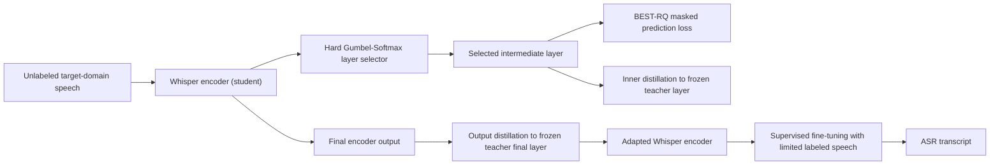
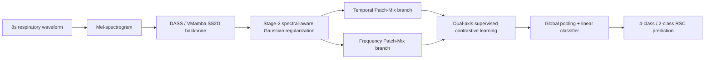
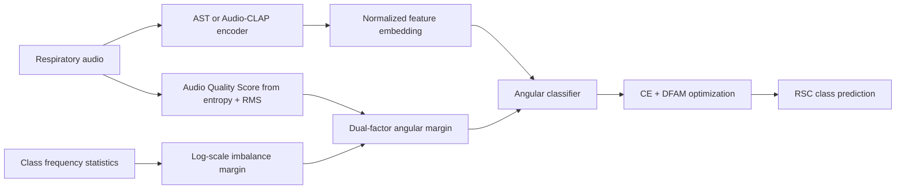

# 语音 / 音频 / 音乐论文速递
## 2026-06-11

> 实际对应 arXiv 更新日：**2026-06-11**  
> 检索范围：`cs.SD + eess.AS`  
> 只放按 ML 顶会审稿口径看，最值得多数读者花时间看的 **5 篇**

## 📋 总览

- 共收录 **5 篇** 相关论文
- 低资源 ASR / 域自适应：**1 篇**
- 语音压缩 / codec：**1 篇**
- 音频大模型评测：**1 篇**
- 医疗音频 / 呼吸音分类：**2 篇**

今天这批最值得看的，不是“又一个会说话的大模型”，而是三条更硬的技术线。`Gumbel-BEARD` 把 Whisper 自适应里最土但最关键的问题挑明了：到底该在哪一层做自监督蒸馏，别再靠人工拍脑袋搜层数；`Benchmarking Neural Speech Compression from a Rate-Distortion Perspective` 则是少见真正按压缩理论审神经 codec 的论文，不只比感知质量，还把实际码率、熵模型和后验压缩效率拉到台面上；`RAIL` 进一步说明，现有 LALM 很会“借语言知识答题”，但在纯听觉感知和处理效率上离人还远。

另外两篇呼吸音分类稿子属于小方向里的认真工作。`Lung-SRAD` 值得看的点在于它不是继续堆 AST patch trick，而是拿 SSM/VMamba 这条线做频谱偏置修正；`QLung` 则更像一篇稳扎稳打的训练目标论文，核心不是炫架构，而是利用音频质量和类别不平衡信息把 OOD 泛化往前推了一步。总体上，今天是“系统方法和评测框架比 flashy 模型更值得读”的一天。

## 精选入选规则

- **新意（0-3）**：是不是提出了新的表示、接口、训练组织方式，或者把老问题拆得更对
- **影响力（0-3）**：是不是贴近 ASR、codec、音频大模型、医疗音频这几条当前还在持续演进的主线
- **证据强度（0-2）**：有没有像样的 baseline、消融和关键数值，而不是只讲故事
- **受众匹配度（0-2）**：对语音大模型 / 语音前端 / 语音识别 / 音频系统研究者有没有直接启发

分数校准：

- **6**：可读，但更像经验总结或局部补丁
- **7**：信息量够，值得过一遍
- **8+**：建议优先精读

## 总览表

| 方向 | 序号 | 论文 | 评分 | 关键词 |
|---|---:|---|---:|---|
| 低资源 ASR / 域自适应 | 1 | Gumbel-BEARD | 8.5/10 | Whisper, self-supervised adaptation, hard Gumbel-Softmax, child ASR |
| 语音压缩 / codec | 2 | Benchmarking Neural Speech Compression from a Rate-Distortion Perspective | 8.5/10 | entropy-constrained codec, scalar quantization, hyperprior, actual bitrate |
| 音频大模型评测 | 3 | RAIL | 8/10 | CHC benchmark, auditory cognition, LALM evaluation, B-AUC |
| 医疗音频 / 呼吸音分类 | 4 | Lung-SRAD | 8/10 | DASS, VMamba, spectral-aware regularization, Patch-Mix |
| 医疗音频 / 呼吸音分类 | 5 | Quality Adaptive Angular Margin Learning for Respiratory Sound Classification | 7.5/10 | angular margin, audio quality score, class imbalance, OOD generalization |

## 🗣️ 低资源 ASR / 域自适应

### [1] Gumbel-BEARD: Automatic Layer Selection for Self-Supervised Adaptation of Whisper in Low-Resource Domains

- **评分**：8.5/10
- **作者/机构**：Zilai Wang, Natarajan Balaji Shankar, Mohan Shi, Kaiyuan Zhang, Abeer Alwan；University of California, Los Angeles
- **论文链接**：https://arxiv.org/abs/2606.11429
- **PDF**：https://arxiv.org/pdf/2606.11429.pdf
- **代码链接**：**代码已开源** https://github.com/Zilai-WANG/Gumbel_Beard
- **Demo 链接**：暂无

#### 📌 简介
这篇做的不是“换一个更大的 ASR backbone”，而是把 Whisper 域自适应里一个长期被糊弄的问题拉直了：自监督适配到底该作用在 encoder 的哪一层。作者在 BEARD 框架上加了硬式 `Gumbel-Softmax` 层选择器，让模型在无标注目标域数据上自动决定最有用的预测层，而不是先人工做一轮代价很高的 layer search。

#### ☠️ 毒舌点评
这类论文最容易被嫌“只是把超参搜索做可学习化”。如果只有这一层，那确实不够刺激。但这篇的价值在于它把自动选层和 Whisper 低资源域适配这个高摩擦场景绑在一起，结果还真有效：10 小时标注数据几乎追平 133 小时全监督基线，算力也明显更省。不是新范式，但绝对不是水活。

#### 🔧 技术方案
- **模型解决的问题**：BEARD 这类自监督域适配方法依赖在 Whisper encoder 的某一中间层上施加 `BEST-RQ` 预测损失和蒸馏约束，但“选第几层”通常靠人工穷举。对于低资源儿童语音、方言语音这类本来就数据少的场景，人工搜层既慢又不稳。`Gumbel-BEARD` 解决的是“如何在自监督适配阶段自动找到最适合目标域的中间表示层”。
- **模型架构**：
  - **输入**：阶段一输入无标注目标域语音；阶段二输入少量标注目标域语音和转写。
  - **输出**：最终 ASR 文本转写。
  - **主干**：`Whisper encoder-decoder` 不变，在 stage-1 的 BEARD 自监督适配流程里插入可训练的层选择器。
  - **关键模块**：
    - `Hard Gumbel-Softmax layer selector`：从 Whisper encoder 各层中离散选出一个 prediction layer。
    - `BEST-RQ quantization loss`：在选中的层上做 masked prediction。
    - `Inner distillation`：约束学生模型选中层与冻结 teacher 的对应表示相似。
    - `Output distillation`：约束最终 encoder 输出保持对原始 Whisper 知识的继承。
  - **信号流怎么走**：无标注语音先进入 Whisper encoder，层选择器在每一步训练时离散选出一个中间层；该层表示一边接 `BEST-RQ` 量化预测，一边和 teacher 同层表示做内层蒸馏；最终层再做输出蒸馏，完成无标注自适应；随后把适配后的 encoder 接回原始 decoder，在少量标注数据上做常规微调。

- **关键设计 / 核心创新**：核心不是再做一个新 SSL objective，而是把“预测层选择”从手工超参变成端到端可学变量。硬选择比软加权更靠谱，因为它避免把不同抽象层的表示混成一锅粥，训练信号更干净；同时保留 BEARD 的双蒸馏思路，降低适配时把 Whisper 原知识洗坏的风险。
- **训练 / 推理策略**：
  - stage-1 自监督适配沿用 BEARD 的两段式路线，学习率 `1e-4`、`batch size 32`、`1 epoch`、`λ=0.5`、`β=0.1`、codebook size `2048`。
  - Gumbel 温度 `τ` 从 `5.0` 线性退火到 `0.1`，让训练前期多探索、后期更接近离散选层。
  - stage-2 把适配后的 encoder 接回原 Whisper decoder，用少量标注数据做监督微调。
  - 论文明确说自适配阶段在 `Whisper-small` 上约 **1 GPU-hour**，而标准 BEARD 的穷举 layer search 大约要 **12 GPU-hours**。
  - 推理阶段就是正常 Whisper 解码；文中未额外报告推理时延增量。

#### 📊 实验结果
- `MyST` 儿童语音上，`Whisper-small` 的 WER：
  - `SFT`：`10.64 / 9.94 / 9.34`（1h / 10h / Full）
  - `BEARD`：`10.31 / 9.44 / 8.73`
  - `Gumbel-BEARD hard`：`10.18 / 9.35 / 8.51`
  - 这里最关键的是 **10h 标注时 9.35 几乎追平 133h 全监督 SFT 的 9.34**。
- `Whisper-medium` 在 `MyST` 上进一步把 WER 做到 `9.15 / 8.88 / 8.21`，其中 full-data `8.21` 还优于此前文中引用的 `Parakeet 1.1B` 的 `8.50`。
- `OGI Spontaneous` 跨域迁移上：
  - in-domain OGI 自适配：`11.06`
  - 用 MyST 无标注数据跨域适配再到 OGI 测试：`11.15`
  - `SFT baseline`：`11.57`
  - 说明它不是只会在同域上抠指标，跨儿童语音子域也能迁。
- `CORAAL` 方言评测上：
  - `Whisper-small`：`11.70 -> 11.01`
  - `Whisper-medium`：`9.81 -> 9.25`
  - 这部分对应文中所说的约 **6% relative WER reduction**。
- baseline 名字明确包括：`SFT`、`BEARD`、`Pseudo-Labeling`，以及更大规模的历史对照 `Parakeet`。

#### 💡 为什么值得看
如果你现在做的不是“从零训一个新 ASR”，而是拿现成 foundation model 往儿童语音、方言、行业语音上迁，这篇的参考价值很高。它回答的是一个会直接影响工程成本的问题：别再人工搜层了，让模型自己决定在哪一层接自监督信号，省算力也更稳。

#### 🧾 评分理由
它不是架构革命，但问题抓得准，数值也不是小修小补。尤其是 `10h ≈ 133h` 和 `1 GPU-hour vs 12 GPU-hours` 这两条，非常有工程说服力。

## 🔊 语音压缩 / Codec

### [2] Benchmarking Neural Speech Compression from a Rate-Distortion Perspective

- **评分**：8.5/10
- **作者/机构**：Jun Xu, Zhengxue Cheng, Fengxi Zhang, Yuhan Liu, Li Song, Wenjun Zhang；Shanghai Jiao Tong University
- **论文链接**：https://arxiv.org/abs/2606.11631
- **PDF**：https://arxiv.org/pdf/2606.11631.pdf
- **代码链接**：暂无明确开源实现
- **Demo 链接**：https://avery-xu.github.io/ECC-demo/

#### 📌 简介
这篇论文一半是 benchmark，一半是方法。前半部分它按真正的 rate-distortion 口径重审神经语音 codec，指出很多方法虽然“低码率主观质量不错”，但量化 latent 的概率结构根本没被好好建模；后半部分它直接给出 `ECC`，把标量量化、超先验、通道级熵模型、残差预测和 entropy skip 串成一个端到端的熵约束 codec。

#### ☠️ 毒舌点评
现在很多 neural codec 论文的坏毛病是：把 RVQ index 当固定代价 token 发出去，再在 paper 里假装自己做了压缩。`ECC` 这篇最值得肯定的点，就是它不陪这个游戏演了，直接把“实际 bitstream 长度”和“概率模型是否内生到训练目标里”拿出来说。短板也有，论文更偏压缩理论和系统设计，想拿它直接当现成开源生产方案的人会失望，因为官方实现还没完全放出来。

#### 🔧 技术方案
- **模型解决的问题**：现有 neural speech codec 大多把 latent 先量化成离散 token，再用固定码率或后处理熵编码去压缩。这样做的问题是表示学习和概率建模脱节，模型没有被训练成“既能还原、又容易编码”的 latent。`ECC` 解决的是“如何把熵模型真正并入 speech codec 的端到端训练与推理链路”。
- **模型架构**：
  - **输入**：语音波形，先转成 STFT 域表示。
  - **输出**：实际熵编码后的 bitstream，以及重建语音波形。
  - **主干**：时频域 analysis-synthesis codec，编码器和解码器都采用 `CRM (Conv-RWKV Mixture)` 模块。
  - **关键模块**：
    - `Scalar Quantization (SQ)`：不用 RVQ/codebook，而是走标量量化。
    - `Hyperprior`：生成 side information `z`，为主 latent `y` 的概率建模提供条件。
    - `Channel-wise entropy model`：按 slice 建模条件分布，而不是假设所有符号代价固定。
    - `Latent Residual Prediction (LRP)`：利用已解码上下文修正当前 slice。
    - `Entropy skip`：对极可预测 residual 直接跳过，不额外发 skip mask。
  - **信号流怎么走**：波形先做 STFT，进入带 `CRM` 块的分析变换得到主 latent `y`；`hyper-analysis` 再从 `y` 提取超先验 `z`，量化后解码出条件特征；主 latent 按通道 slice 逐步做条件概率估计、熵编码和残差补偿；最后通过对称的合成变换和 iSTFT 重建出波形。

```mermaid
flowchart LR
    A["Speech waveform"] --> B["STFT front-end"]
    B --> C["CRM-based analysis transform"]
    C --> D["Primary latent y"]
    D --> E["Hyper-analysis to z"]
    E --> F["Scalar quantization + hyperprior decoding"]
    F --> G["Channel-wise entropy model"]
    G --> H["Entropy skip + arithmetic coding"]
    H --> I["Decoded latent with LRP refinement"]
    I --> J["CRM-based synthesis transform"]
    J --> K["iSTFT waveform reconstruction"]
```

- **关键设计 / 核心创新**：
  - 用 `SQ + explicit entropy model` 替代主流 RVQ 路线，把 rate term 直接写进训练目标。
  - `CRM` 用 CNN 抓局部时频纹理、RWKV 抓长程时间依赖，在复杂度和上下文建模之间取平衡。
  - `Entropy skip` 不额外发 mask，而是利用 decoder 已知的 scale 规则决定哪些 residual 可以直接视为零，是真正面向 bitstream 的设计。
- **训练 / 推理策略**：
  - 训练数据主集是 `LibriTTS`，评测还覆盖 `VCTK` 和 `AISHELL-3` 跨语种测试。
  - 两阶段训练：stage-1 先训高码率感知模型，`λrd=10`，不开启 entropy skip，也不用 waveform L1；stage-2 再从高码率往低码率逐步 fine-tune，开启 entropy skip，并加入 waveform L1 以优化客观指标。
  - 重建损失由多尺度 mel loss、adversarial loss、feature matching loss 和可选 waveform L1 组成；判别器用 `MPD + MS-STFT`。
  - 文中明确说明 **不用 VQ/codebook/commitment loss**，而是用熵估计直接约束码率。
  - 推理阶段统计的是真实 entropy-coded bitstream 长度，不是名义 token rate；文中未给端侧实时 RTF。

#### 📊 实验结果
- 论文摘要给的总账已经很能打：相对 `FunCodec`，`ECC` 在 `LibriTTS + VCTK` 上平均 **BD-rate 降低 39.9%（ViSQOL）**、**76.3%（PESQ）**。
- `LibriTTS test-all` 上相对 `FunCodec` 的 BD-rate：
  - `ViSQOL -44.19%`
  - `PESQ -69.38%`
  - `STOI -58.35%`
  - `ESTOI -55.67%`
  - `WER -32.06%`
  - 对应 BD-metric 里 `ViSQOL +0.268`、`PESQ +0.597`
- `VCTK` 上相对 `FunCodec` 的 BD-rate：
  - `ViSQOL -35.65%`
  - `PESQ -83.25%`
  - `STOI -8.44%`
  - `ESTOI -43.60%`
  - `WER -11.14%`
  - 对应 BD-metric 里 `ViSQOL +0.186`、`PESQ +0.693`
- baseline 覆盖很全，不只比传统 codec，也比一票主流 neural codec：`Opus`、`EVS`、`AMR-WB`、`SoundStream`、`EnCodec`、`DAC`、`FunCodec`、`SpeechTokenizer`、`Mimi`、`BigCodec`、`SemantiCodec`、`TAAE`。
- 消融结果也说明它不是单点技巧：
  - `ECC CRM CWl4` 是最优变体，`BD-ViSQOL +0.195 / -45.86%`，`BD-PESQ +0.737 / -65.60%`
  - 纯卷积 backbone、只有 hyperprior、去掉通道上下文都会明显掉。
- 主观听感上，`MUSHRA` 实验显示 ECC 在更低实际码率下仍接近最强 neural baseline，不是“客观指标漂亮、耳朵一听就穿帮”。

#### 💡 为什么值得看
如果你做 codec、语音传输、语音 tokenization，甚至只是拿 neural codec 当 LLM 前端，这篇都值得认真读。它最有价值的不是单个表格，而是把“实际压缩”重新拉回研究中心：不是 latent 看起来像 token 就算 codec，真正的 bitstream、熵模型和 rate-distortion 才是硬通货。

#### 🧾 评分理由
这是今天信息密度最高的论文之一。它既补 benchmark 视角，也给出完整方法；唯一扣分点是官方开源闭环还不够完整，离社区快速复现还差最后一脚。

## 🤖 音频大模型评测

### [3] RAIL: Rethinking Auditory Intelligence in Large Audio-Language Models with a CHC-Grounded Benchmark

- **评分**：8/10
- **作者/机构**：Hongyu Jin, Siyi Wang, Yang Xiao, Jiaheng Dong, Shihong Tan, Kaiyuan Peng, Georgiana Juravle, Shanquan Chen 等；The University of Melbourne、Alexandru Ioan Cuza University of Iași、Wuhan University、The University of Hong Kong、The University of Auckland、Monash University
- **论文链接**：https://arxiv.org/abs/2606.11260
- **PDF**：https://arxiv.org/pdf/2606.11260.pdf
- **代码链接**：暂无
- **Demo 链接**：暂无

#### 📌 简介
这篇不是再造一个音频大模型，而是先问清楚“我们到底在评什么”。作者把 `Cattell–Horn–Carroll (CHC)` 人类认知框架搬到音频领域，构建了一个覆盖听觉感知、推理、记忆、处理效率和知识调用的 benchmark，用同一套口径去测 **26 个** LALM。

#### ☠️ 毒舌点评
现在的音频大模型 benchmark 很多都在做任务拼盘，最后只得到一个模糊结论：谁家模型答题更像人。`RAIL` 的好处是它不满足于“会不会答”，而是拆成“听觉感知行不行、记忆行不行、推理是不是靠语言捷径、效率是不是纯靠长思维链硬堆”。缺点也很明显：这还是 benchmark 论文，不是新模型，想抄架构的人不会爽。

#### 🔧 技术方案
- **模型解决的问题**：现有 LALM 评测大多按任务或数据域切分，结果是模型可能靠语言先验把题做对了，但你不知道它到底有没有真实的 auditory capability。`RAIL` 解决的是“如何按认知能力维度，而不是按任务菜单，去衡量音频大模型的听觉智能”。
- **模型架构**：
  - **输入**：音频样本、文本问题、候选答案或开放回答指令。
  - **输出**：分能力维度的 `ACC`、`LLM-as-Judge` 分数，以及效率指标 `B-AUC`。
  - **主干**：不是单个神经网络，而是一个 `CHC-grounded benchmark pipeline`。
  - **关键模块**：
    - `五大能力`：Auditory Processing、Reasoning、Memory、Processing Efficiency、Knowledge。
    - `32 个子能力任务`：覆盖音素辨别、节奏、定位、工作记忆、顺序推理、机械知识等。
    - `四阶段构建流程`：认知框架选择 → 任务设计 → 数据构建 → 认知专家质检。
    - `双评测协议`：严格 exact-match 的 `ACC`，以及语义等价的 `LLM-as-Judge`。
  - **信号流怎么走**：先基于 CHC 选定 5 大能力与 32 个子任务；再从现有音频语料中选样或合成新样本，配上规则生成或 LLM 辅助生成的 QA；认知专家复核题目有效性；最后把统一题集丢给 26 个 LALM，汇总成能力画像和人与模型对比结果。

```mermaid
flowchart LR
    A["CHC cognitive framework"] --> B["5 broad auditory capabilities"]
    B --> C["32 sub-capability task definitions"]
    C --> D["Existing corpora + synthesized audio"]
    D --> E["Rule-based / LLM-assisted QA generation"]
    E --> F["Human expert quality control"]
    F --> G["26 LALM evaluations"]
    G --> H["ACC + Judge + B-AUC capability profile"]
    H --> I["Human-model comparison and benchmark conclusions"]
```

- **关键设计 / 核心创新**：
  - 不是简单列任务，而是明确把评测对齐到人类听觉认知结构。
  - 把 `Processing Efficiency` 单独拉出来，并用 `B-AUC` 衡量“正确性与推理预算的折中”，而不是只看最终答案。
  - 同时引入真实人类作答子集，避免 benchmark 完全变成模型之间互卷。
- **训练 / 推理策略**：
  - 这篇**不训练新模型**，核心是 benchmark 构建和统一评测。
  - 数据集共 **5,306** 个样本、**30.6 小时** 音频，覆盖 **32** 个任务；其中新构造数据占 `3614/5306`，约 **68.1%**。
  - 人类评测子集是 **640** 个样本，**24** 名参与者，每题由 `2-5` 人作答。
  - 评测对象包括 **21 个开源模型** 与 **5 个闭源模型**，总规模从 `167M` 到 `33.5B`。
  - 效率指标不用 wall-clock latency，而用 reasoning token budget 的 `B-AUC`；文中明确认为服务基础设施会污染真实时延比较。

#### 📊 实验结果
- benchmark 本身的覆盖就很扎实：
  - Auditory Processing：`1170` 样本，`7` 个任务
  - Reasoning：`322` 样本，`3` 个任务
  - Memory：`1000` 样本，`6` 个任务
  - Processing Efficiency：`1800` 样本，`9` 个任务
  - Knowledge：`1014` 样本，`7` 个任务
- 五大能力平均表现：
  - `Knowledge 56.21`
  - `Memory 55.05`
  - `Auditory Processing 43.83`
  - 论文点得很明白：模型最弱的不是“不会说”，而是**真听不细**。
- 开源 vs 闭源：
  - overall macro-average：闭源 `65.10`，开源 `46.27`
  - 差值 `+18.83`，`p=0.00834`
- 具体模型层面：
  - `Gemini 3.1 Pro` 在 Table 3 中拿到 `Reasoning 79.85 / 82.89`、`Memory 85.39 / 85.84`、`B-AUC 70.90 / 71.96`、`Knowledge 79.68 / 79.19`
  - `Omni R1` 是开源里总体最强的一档，`Auditory Processing 54.53 / 54.44`、`Memory 72.16 / 73.19`、`B-AUC 59.09 / 63.71`、`Knowledge 67.85 / 68.54`
  - `Qwen3-Omni-30B` 也很强，但总体均值 `62.87` 仍略低于 `Omni R1` 的 `64.05`
- 人类对比：
  - 人类总体排名第 `7/26`
  - 但在 `Auditory Processing` 和 `Processing Efficiency` 上，人类是最强参照，论文附录还给出 **26/26 模型都低于人类** 的统计结果。
- baseline / 对比对象不是单一模型，而是完整的 26 模型族群，包括 `Qwen3-Omni-30B`、`Omni R1`、`Step Audio 2 mini`、`Kimi-Audio`、`Phi-4-MM`、`GPT-4o-Audio`、`Gemini 3.1 Pro` 等。

#### 💡 为什么值得看
如果你在做 audio LLM，这篇最大的价值不是“谁排第一”，而是它会逼你承认一个现实：很多模型主要靠语言知识和长推理链过关，真正的听觉感知能力还很弱。你想做更像人的 auditory agent，就不能只堆通用 LLM 能力，音频输入侧和评测侧都得重做。

#### 🧾 评分理由
它不是新模型 paper，但 benchmark 视角非常干净，结论也足够尖锐。扣分点在于很多任务仍然带有人工构造痕迹，且没有开源实现链接闭环，不过整体仍然很值得读。

## 🫁 医疗音频 / 呼吸音分类

### [4] Lung-SRAD: Spectral-Aware Regularized Audio DASS with Dual-Axis Patch-Mix Contrastive Learning for Respiratory Sound Classification

- **评分**：8/10
- **作者/机构**：Hemansh Shridhar, Miika Toikkanen, June-Woo Kim；RSC LAB, MODULABS、Wonkwang University、AI Convergence Research Institute
- **论文链接**：https://arxiv.org/abs/2606.11922
- **PDF**：https://arxiv.org/pdf/2606.11922.pdf
- **代码链接**：**代码已开源** https://github.com/RSC-Toolkit/Lung-SRAD
- **Demo 链接**：暂无

#### 📌 简介
这篇论文抓住了呼吸音分类里一个很具体但真实的问题：`AST + CLS token` 这套范式天然偏低频和全局上下文，可能不够敏感于 crackle、wheeze 这类短时局部异常。作者因此把 `DASS / VMamba` 式 SSM backbone 拉进来，再配上频谱感知正则和双轴 Patch-Mix 对比学习，试图保住局部异常模式。

#### ☠️ 毒舌点评
这篇的亮点不在于最终绝对分数把所有人都踩过去了，它其实**没有**超掉所有 CLAP 系 baseline；亮点在于它没有继续沿着 AST patch trick 那条已经有点挤的路走，而是认真分析频谱响应，再据此设计正则和混合策略。方向是对的，证据也不水，属于“小领域里有脑子的增量”。

#### 🔧 技术方案
- **模型解决的问题**：呼吸音里的异常事件通常是短时、局部、稀疏的时频结构，而 AST 这类全局注意力模型容易表现出 low-pass 倾向，加上 CLS token 汇聚后，细粒度局部差异可能被抹平。`Lung-SRAD` 想补的是“如何让 backbone 对中高频局部变化更敏感，同时不牺牲整体上下文”。
- **模型架构**：
  - **输入**：统一成 **8 秒**、`16 kHz` 的 respiratory cycle，转成 mel-spectrogram。
  - **输出**：`ICBHI` 上的 4 类或 2 类呼吸音分类标签。
  - **主干**：基于 `VMamba` 的 `DASS (Distilled Audio State Space)`，用 `SS2D` 做四方向 selective scan。
  - **关键模块**：
    - `DASS`：多阶段 SS2D 块 + patch merging + global pooling classifier。
    - `Spectral-aware regularization`：对频谱响应过强的中间层做深度可分离 Gaussian smoothing。
    - `Temporal Patch-Mix` 与 `Frequency Patch-Mix`：分别沿时间轴和频率轴做连续片段混合。
    - `Dual-axis contrastive learning`：把 time/freq 两种 Patch-Mix 联合进监督对比学习。
  - **信号流怎么走**：呼吸音先转 mel-spectrogram，进入 DASS 的多阶段 SS2D 主干；作者先分析不同 stage 的频谱响应，再只对 Stage-2 的高响应 block 做 Gaussian 平滑；与此同时构造沿时间和频率轴的 Patch-Mix 样本，通过 stop-gradient 的对比损失增强稳定性；最后全局池化后输出分类结果。

- **关键设计 / 核心创新**：
  - 先用频谱响应分析论证 AST 的低通偏置，再据此挑 Stage-2 block 做 targeted regularization，而不是盲目全层平滑。
  - Patch-Mix 不在展平 token 上乱混，而是沿时间轴和频率轴做连续片段替换，更贴合 VMamba 的扫描结构。
  - stop-gradient 式对比学习避免混合样本把 SSM 主干拖崩。
- **训练 / 推理策略**：
  - 数据预处理：每个 breathing cycle 统一到 **8 秒**、`16 kHz`，并加 `SpecAugment`，时间掩码最大 `160` 帧、频率掩码最大 `48` bins。
  - 优化器 `Adam`，学习率 `5e-5`，`batch size 16`，结果按 **5 个随机种子**取均值。
  - Gaussian 正则使用 `K=5`、`σ=3`，主要施加在 Stage-2 的 Block 2/3。
  - 对比学习温度 `τ=0.2`，Patch-Mix 的 Beta 分布参数 `β=1.0`。
  - 文中没有报告端侧推理速度或显存。

#### 📊 实验结果
- `ICBHI` 4-class 主结果：
  - `AST Fine-tuning`：`Score 59.55`
  - `AST Patch-Mix CL`：`62.37`
  - `DASS Fine-tuning`：`61.06 ± 1.27`
  - `DASS + Spectral-Aware`：`62.22 ± 1.29`
  - `Lung-SRAD`：`64.48 ± 0.25`
  - 对 `AST Fine-tuning` 是实打实 **+4.93** 分，对 AST 系 patch-mix 也有提升。
- `ICBHI` 2-class 结果：
  - `PAFA (BEATs)`：`72.08`
  - `DASS Fine-tuning`：`68.20 ± 2.05`
  - `Lung-SRAD`：`72.57 ± 0.47`
  - 这部分超过了表中 prior best。
- 细项指标上，4-class `Lung-SRAD` 的 `Sp / Se / Score = 79.53 / 49.42 / 64.48`，比 DASS 原始微调的 `74.68 / 47.43 / 61.06` 更均衡。
- 消融也站得住：
  - `Spectral-aware` 单独把 `61.06 -> 62.22`
  - `Freq-only Patch-Mix`：`63.18`
  - `Time-only Patch-Mix`：`62.83`
  - `Dual-axis` 合起来最好：`64.48`
- baseline 名字明确包括：`AST Fine-tuning`、`Patch-Mix CL`、`SG-SCL`、`LungAdapter`、`BTS`、`PAFA`、`BTS++`。

#### 💡 为什么值得看
如果你做医疗音频或更一般的异常声音分类，这篇的启发不是“换成 Mamba 就一定更强”，而是要先问 backbone 的频谱偏置到底适不适合你的异常事件类型。它把这个分析做出来，再顺着分析去改正则和数据增强，方法论比单看榜单更值钱。

#### 🧾 评分理由
不是全场最高分，但方法链条完整，且把 SSM/VMamba 引入 RSC 这个方向做得比较自洽。扣分点是 4-class 总榜还没压过最强 CLAP 系方法，影响力仍偏子领域。

### [5] Quality Adaptive Angular Margin Learning for Respiratory Sound Classification

- **评分**：7.5/10
- **作者/机构**：Yoon Tae Kim, Heejoon Koo, Miika Toikkanen, June-Woo Kim；RSC LAB, MODULABS、Wonkwang University、AI Convergence Research Institute
- **论文链接**：https://arxiv.org/abs/2606.11915
- **PDF**：https://arxiv.org/pdf/2606.11915.pdf
- **代码链接**：**代码已开源** https://github.com/RSC-Toolkit/QLung
- **Demo 链接**：暂无

#### 📌 简介
这篇不是做新 backbone，而是改训练目标。作者认为呼吸音分类里两个老问题经常被混着糊弄过去：一是录音质量参差不齐，二是类别分布极不平衡。`QLung` 就是把这两个信息显式写进 angular margin learning：用音频质量分数调节样本 margin，再用 log-scale 类别频率补偿尾类。

#### ☠️ 毒舌点评
这篇很典型，题目看着不炸裂，但比很多“又套一个 adapter”更务实。它没有 pretending to be foundation model，老老实实围绕低质量录音和类别不平衡做文章，结果在 OOD 数据上确实更有说服力。缺点是创新上限不高，本质还是 loss engineering，不是结构级突破。

#### 🔧 技术方案
- **模型解决的问题**：RSC 数据集常见问题是 low-quality recording 和 severe class imbalance。直接用普通 CE 训练，模型容易被嘈杂样本带偏，也容易让少数类边界塌掉。`QLung` 解决的是“如何用样本质量和类别频率共同调节 margin，让特征更稳定、更可泛化”。
- **模型架构**：
  - **输入**：标准化到 **8 秒** 的呼吸音样本，可走 AST 的 log-Mel 前端，也可走 Audio-CLAP tokenizer。
  - **输出**：4 类呼吸音标签。
  - **主干**：backbone 本身不新，主要在 `AST` 和 `Audio-CLAP` 上套一个 angular classifier 与 `DFAM` 损失。
  - **关键模块**：
    - `Angular Classifier`：对特征和类别权重都做 `L2 normalize`，让决策真正由角度决定。
    - `Audio Quality Score (AQS)`：由 spectral entropy 和 RMS 计算，`AQS = clip(1 - αHnorm + βRnorm, 0, 1)`。
    - `Log-scale class imbalance margin`：按 `log(N / ny)` 形式平滑放大尾类 margin。
    - `DFAM`：把质量 margin 和类别不平衡 margin 按权重 `γ` 融成统一角度惩罚。
  - **信号流怎么走**：音频先经过 AST 或 Audio-CLAP encoder 得到 embedding；embedding 与 classifier 权重一起归一化；并行计算样本级 `AQS` 和类别频率相关的 margin；两者合成 `DFAM` 后作用到目标类角度上；最终和标准 CE 一起优化模型。

- **关键设计 / 核心创新**：
  - 用 `AQS` 决定高质量样本该不该被施加更强 margin，避免把低质量录音当成同样可靠的监督信号。
  - 用对数而不是线性 inverse-frequency 增大尾类 margin，防止极端不平衡下训练发散。
  - 将这两个因素写成统一 `DFAM`，而不是各搞一个 heuristic weight。
- **训练 / 推理策略**：
  - AST 前端用 `25 ms` window、`10 ms` hop 的 `128` 维 log-Mel，配合 `SpecAugment`；Audio-CLAP 版本用 `LAION-CLAP-630K tokenizer`。
  - 优化器 `Adam`，学习率 `5e-5`，`batch size 8`，总计 **50 epochs**。
  - 关键超参：`λ=0.4`、`γ=0.5`、`mtarget=0.2`、`sa=37`、`sd=15`、`κ=0.5`。
  - `AQS` 中 `α=0.7`、`β=0.3`，平衡噪声敏感性与信号强度。
  - 推理阶段没有额外复杂流程，文中未报告时延或显存开销。

#### 📊 实验结果
- `ICBHI` 主结果：
  - `AST Fine-tuning`：`59.55`
  - `Patch-Mix CL`：`62.37`
  - `Audio-CLAP`：`62.56`
  - `BTS`：`63.54`
  - `QLung on AST`：`62.01 ± 1.18`
  - `QLung on Audio-CLAP`：`63.39 ± 0.40`
  - 也就是说，它对 AST 的提升很明显，但在 in-domain 上还没完全压过 BTS。
- 论文真正值得看的在 OOD：
  - `SPRSound` 上 `QLung on Audio-CLAP`：`59.80 ± 3.51`
  - 对比 `Audio-CLAP` 原始版：`56.29`
  - 对比 `BTS`：`53.42`
  - 对比 `Patch-Mix CL`：`51.01`
  - 这比单看 ICBHI 更有说服力。
- AST 消融结果也清楚：
  - `AST CE`：`59.55 ± 1.92`
  - `+ Fixed angular margin`：`59.72 ± 0.89`
  - `+ Audio quality`：`60.47 ± 0.96`
  - `+ Class imbalance`：`60.56 ± 0.83`
  - `+ Angular classifier (QLung)`：`62.01 ± 1.18`
  - 说明它不是靠某一个部件独奏，而是组合起来才有效。
- 细项上，`QLung on Audio-CLAP` 在 ICBHI 的 `Sp / Se / Score = 81.98 / 44.81 / 63.39`；在 SPRSound 上是 `74.71 / 44.88 / 59.80`。
- baseline 名字明确包括：`Patch-Mix CL`、`SG-SCL`、`Audio-CLAP`、`BTS`、`Lungmix`。

#### 💡 为什么值得看
如果你做的是 noisy medical audio、长尾分类、或者任何“样本可靠性差异很大”的小数据任务，这篇会给你一个很直接的启发：别只调 backbone，把样本质量和类别不平衡写进 margin，本身就能带来很值钱的泛化收益。

#### 🧾 评分理由
方法不炫，但 OOD 增益实在，比很多只在单一测试集上磨 0.x 分的论文更像真工作。扣分点是创新边界仍然在 loss design 这一层，且 in-domain 绝对 SOTA 还差一口气。

## 最后结论

今天最值得优先看的顺序，我会排成这样：

1. `Gumbel-BEARD`：如果你手里已经有 Whisper 或其他 encoder-decoder ASR，这是最能直接转成工程收益的一篇。
2. `Benchmarking Neural Speech Compression from a Rate-Distortion Perspective`：如果你做 codec、tokenizer、语音传输，这篇对“实际压缩”这件事的纠偏非常重要。
3. `RAIL`：如果你做 audio LLM，最好先看这篇再谈“模型已经具备听觉智能”。
4. `Lung-SRAD`：子领域论文，但在“先分析 backbone 偏置，再改模型”这点上做得比很多大词论文认真。
5. `QLung`：更像训练目标层面的稳健增量，适合在 noisy、小样本、长尾任务里借鉴。

一句话总结今天这批：没有特别 flashy 的 TTS 或音乐生成大稿，但“低资源自适应”“真实码率 codec”“听觉能力评测”“呼吸音稳健分类”这四条线都给了实打实的技术推进。对真正做系统的人来说，这种一天反而比看一堆空泛大模型宣传稿更有收获。
