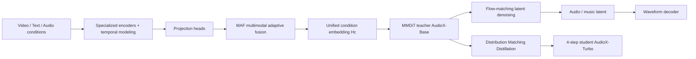
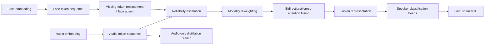
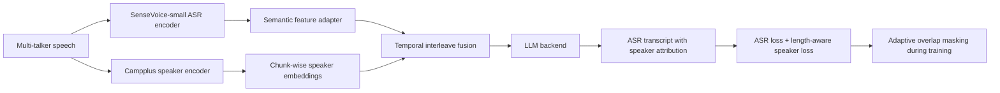
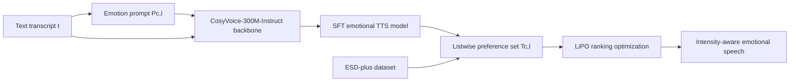
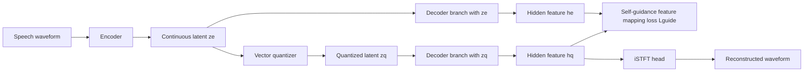

# 语音 / 音频 / 音乐论文速递
## 2026-06-12

> 实际对应 arXiv 更新日：**2026-06-12**  
> 检索范围：`cs.SD + eess.AS`  
> 只放按 ML 顶会审稿口径看，最值得多数读者花时间看的 **5 篇**

## 📋 总览

- 共收录 **5 篇** 相关论文
- 音频生成 / 音乐生成：**1 篇**
- 说话人识别 / 多模态鲁棒融合：**1 篇**
- 多说话人 ASR / 端到端 diarization：**1 篇**
- 情感 TTS / 对齐优化：**1 篇**
- 语音 codec / 音频 tokenizer：**1 篇**

今天最值得看的主线，不是“谁又把模型做大了一点”，而是三种很实在的系统改造。`AudioX-Turbo` 代表的是 anything-to-audio 统一框架终于开始认真解决数据、指令跟随和采样速度，而不是只拼 demo；`Balancing ASR and diarization in end-to-end LLMs for multi-talker speech recognition` 说明多说话人识别这条线真正卡住的不是参数量，而是 ASR 与说话人归因之间的训练平衡；`Self-Guidance` 则把神经 codec 里一个长期被默认接受的烂现实挑明了: quantization error 不是只能靠堆大 codebook 去补，decoder 自己也可以被训得更抗量化失真。

剩下两篇也各有价值。`MRAF` 不是在做人脸+语音多模态识别的普通 late fusion，而是很直接地解决“face 缺失时别崩”这个比赛里真会遇到的问题；`Emo-LiPO` 则把情感强度控制从“看 prompt 猜感情”推进到 listwise ranking，对做可控 emotional TTS 的人比大多数泛泛的 preference tuning 文章更有参考性。总体上，今天这批的共同特点是: 都不靠花哨口号，都是在把一个老问题中的关键瓶颈拆开修。

## 精选入选规则

- **新意（0-3）**：是不是提出了新的表示、接口、训练组织方式，或者把老问题拆得更对
- **影响力（0-3）**：是不是贴近音频生成、ASR、说话人识别、TTS、codec 这些主线
- **证据强度（0-2）**：有没有像样的 baseline、消融和关键数值
- **受众匹配度（0-2）**：对语音大模型 / 语音前端 / 语音识别 / 音乐与生成方向研究者有没有直接启发

分数校准：

- **6**：可读，但更像局部补丁
- **7**：信息量够，值得过一遍
- **8+**：建议优先精读

## 总览表

| 方向 | 序号 | 论文 | 评分 | 关键词 |
|---|---:|---|---:|---|
| 音频生成 / 音乐生成 | 1 | AudioX-Turbo | 8.5/10 | anything-to-audio, MMDiT, MAF, IF-caps-Pro, few-step distillation |
| 说话人识别 / 多模态鲁棒融合 | 2 | MRAF | 8/10 | missing token, reliability-aware cross-attention, POLY-SIM, audio-only distillation |
| 多说话人 ASR / diarization | 3 | Balancing ASR and diarization in end-to-end LLMs | 8/10 | dual-encoder, temporal interleave, cpCER, adaptive ASR mask |
| 情感 TTS / 对齐优化 | 4 | Emo-LiPO | 7.5/10 | listwise preference optimization, intensity control, ESD-plus, CosyVoice |
| 语音 codec / tokenization | 5 | Self-Guidance | 8.5/10 | decoder manifold alignment, XCodec2, low-bitrate codec, 4x codebook reduction |

## 🎼 音频生成 / 音乐生成

### [1] AudioX-Turbo: A Unified Framework for Efficient Anything-to-Audio Generation

- **评分**：8.5/10
- **作者/机构**：Zeyue Tian, Lei Ke, Zhaoyang Liu, Ruibin Yuan, Liumeng Xue, Yujiu Yang, Weijia Chen, Xu Tan, Qifeng Chen, Wei Xue, Yike Guo；The Hong Kong University of Science and Technology、Tsinghua University、Noiz AI、Independent Researcher
- **论文链接**：https://arxiv.org/abs/2606.12555
- **PDF**：https://arxiv.org/pdf/2606.12555.pdf
- **代码链接**：https://zeyuet.github.io/AudioX-Turbo/
- **Demo 链接**：https://zeyuet.github.io/AudioX-Turbo/

#### 📌 简介
这篇想做的是统一 anything-to-audio: 文本、视频、音频条件都能接，输出既可以是音效也可以是音乐，而且不是靠多个 task-specific 模型拼起来。作者的核心思路是先训练一个多步 teacher `AudioX-Base`，再蒸馏成只用 **4 步采样** 的 `AudioX-Turbo`，同时自己做了一个 **9.2M** 样本的 `IF-caps-Pro` 数据管线，把“统一建模”“大规模高质量数据”“少步推理”这三个常见口号一口气补齐。

#### ☠️ 毒舌点评
这篇不是“把 text-to-audio、video-to-audio、text-to-music 写在一张图里就算 unified”那种营销稿。它真的补了统一训练的数据和 few-step 采样这两个最难的坑，而且 `T2A-bench` 的指令跟随结果也不是小优。短板是: 2.7B teacher + 大规模多模态数据的门槛不低，普通组短期内很难完整复现，但作为方向判断，这篇值回票价。

#### 🔧 技术方案
- **模型解决的问题**：现有音频生成模型大多是单输入单输出，例如只做 `text-to-audio` 或只做 `video-to-music`；就算宣称统一，往往也缺组合条件、缺高质量多模态标注，或者一到推理就要几十到几百步 diffusion，延迟根本没法用。`AudioX-Turbo` 要解决的是“如何训练一个真统一、真可控、还足够快的 anything-to-audio 生成系统”。
- **模型架构**：
  - **输入**：文本、视频、音频三种条件，可单独用，也可任意组合。
  - **输出**：音频或音乐波形，对应 latent-space 中的目标表示。
  - **主干**：`Multimodal Diffusion Transformer (MMDiT)`。
  - **关键模块**：
    - `Multimodal Adaptive Fusion (MAF)`：把不同模态的条件 embedding 融成统一条件向量。
    - `AudioX-Base`：多步 teacher，负责高保真生成。
    - `Distribution Matching Distillation`：把 teacher 蒸馏成 few-step student。
    - `diffusion-based discriminator`：复用 teacher 早期 block 特征，稳住 4-step 蒸馏时的感知质量。
    - `IF-caps-Pro`：两阶段数据管线，统一视频-音频、视频-音乐和细粒度文本描述。
  - **信号流怎么走**：视频先过视觉编码器与时序建模器，文本过 `T5-base`，音频过 autoencoder；三路特征经 projection head 后进入 `MAF` 融成统一条件 `Hc`；生成端以 flow matching 方式在 latent space 上从噪声反演到目标音频 latent；teacher 训练完成后，再以 distribution matching distillation + adversarial objective 蒸馏 student，让 student 只用 4 步就逼近 teacher。

- **关键设计 / 核心创新**：
  - `MAF` 不是简单拼接条件，而是通过 gate 和 query 机制降低 cross-modal interference。
  - 数据层面不是直接拿原始标签凑数，而是用 `GeminiCap-aug` 这类多阶段细粒度文本增强，让 unified training 真能学到可控语义。
  - few-step 端不是直接套图像领域蒸馏，而是针对 flow matching 改写 `Distribution Matching Distillation`，再用冻结 teacher block 做 discriminator。
- **训练 / 推理策略**：
  - teacher 总参数约 **2.7B**，其中 `MAF` 约 **60M**，MMDiT 共 **24 层**。
  - 文本编码器用 `T5-base`，视频特征用 `CLIP-ViT-B/32 + Synchformer`，音频用 autoencoder。
  - 训练在 `H800 80GB` 集群上进行，batch size **240**，约 **100k steps**。
  - student 直接初始化自 teacher，固定蒸馏成 **4-step** 采样，并把 CFG 效果蒸馏进 student，因此 student 推理不再需要 teacher 那套双分支开销。
  - 文中报告 `RTF`、`Latency`、`NFE`，但没有给 consumer-grade 端侧内存曲线。

#### 📊 实验结果
- `AudioCaps` 上，`AudioX-Turbo` 只用 **4 steps / 4 NFE** 就做到：
  - `Latency 0.24s`
  - `RTF 0.02`
  - `KL 1.33`
  - `IS 12.37`
  - `FD 12.29`
  - `FAD 1.68`
  - 对比 200-step `Stable Audio Open` 的 `IS 10.36 / FD 28.74 / FAD 3.05`，质量明显更好。
- `MusicCaps` 上，`AudioX-Turbo` 同样 4 steps 达到：
  - `KL 1.31`
  - `IS 3.61`
  - `FD 9.50`
  - `FAD 1.54`
  - 比 50-step `AudioLDM-2` 的 `FD 16.14 / FAD 2.80` 更强，也逼近甚至略优于 50-step `AudioX-Base`。
- `T2A-bench` 指令跟随：
  - `AudioX-Base`：`Cat-acc 75.00 / Cnt-acc 24.00 / Ord-acc 52.80`
  - `AudioX-Turbo`：`74.80 / 21.80 / 55.40`
  - 这说明蒸馏后 student 基本没把细粒度控制能力洗掉，`Ord-acc` 反而略高。
- 数据管线消融 `GeminiCap-aug`：
  - `Instruction-following T2A` 上 `Cat-acc 28.91 / Cnt-acc 10.20 / Ord-acc 7.80`
  - 明显优于 `Labels` 的 `17.35 / 2.80 / 4.60` 和 `AudioSetCaps` 的 `27.85 / 6.40 / 4.80`
  - 说明高质量文本监督真的在拉 unified model。
- `MAF` 消融：
  - `Full MAF`：`IS 11.84 / FD 9.64 / FAD 1.98`
  - `w/o MAF`：`IS 10.70 / FD 11.60 / FAD 2.67`
  - 不是可有可无的融合装饰件。

#### 💡 为什么值得看
如果你做的是音频生成或音乐生成大模型，这篇值得看的不只是“4 步还挺快”，而是它把统一建模里最麻烦的三件事绑在了一起: 多模态条件对齐、细粒度文本监督、few-step 推理。很多统一模型只解决其中一件，这篇至少证明了三件可以一起做，而且不会马上塌。

#### 🧾 评分理由
统一框架、数据管线、蒸馏策略和 benchmark 都比较完整，分数给高是合理的。扣分点在于训练成本高，且“代码和数据将开放”还停在项目页阶段，不算真正低门槛复现。

## 🧑‍💻 说话人识别 / 多模态鲁棒融合

### [2] Missing-Token Prompted Reliability-Aware Fusion for Robust Polyglot Speaker Identification

- **评分**：8/10
- **作者/机构**：Peng Jia, Li Dai, Jia Li, Zhenzhen Hu, Ye Zhao, Richang Hong；Hefei University of Technology、Intelligent Interconnected Systems Laboratory of Anhui Province
- **论文链接**：https://arxiv.org/abs/2606.12495
- **PDF**：https://arxiv.org/pdf/2606.12495.pdf
- **代码链接**：**代码已开源** https://github.com/MSA-LMC/MRAF
- **Demo 链接**：暂无

#### 📌 简介
这篇做的是 polyglot speaker identification，但真正有价值的不是“多语言”三个字，而是 missing-face robustness。作者提出 `MRAF`，用可学习 missing token 代替零填充 face 特征，再加上 reliability-aware cross-attention，让模型在 face 缺失时别直接退化成瞎猜。

#### ☠️ 毒舌点评
多模态说话人识别这类比赛论文经常靠数据预处理和运气赢一点点，方法本身没啥可复用。`MRAF` 至少不是这样: 它把 missing modality 这个真实问题当成一等公民来建模，消融也说明 cross-attention 和 learnable token 都不是摆设。短板是任务仍偏 benchmark/challenge 导向，离大规模开域 face-voice linking 还有距离。

#### 🔧 技术方案
- **模型解决的问题**：现实里做人脸+语音说话人识别时，face 常常会被遮挡、检测失败或根本缺失。传统 zero filling 会引入非常假的视觉模式，late fusion 也假设两模态都靠谱。`MRAF` 要补的是“在 complete-modality、missing-face 和 cross-lingual 三种条件下，如何统一建模并动态相信更可靠的模态”。
- **模型架构**：
  - **输入**：FaceNet 提取的人脸 embedding 与 `ECAPA-TDNN` 提取的音频 embedding。
  - **输出**：说话人 ID 分类结果。
  - **主干**：modality-specific token 建模 + reliability-aware cross-attention fusion。
  - **关键模块**：
    - `learnable missing token`：face 缺失时不做 zero fill，而是用可训练 token 占位。
    - `reliability estimator`：估计 face/audio 的置信度分数并归一化成模态权重。
    - `bidirectional cross-attention fusion`：在 token 级别做 face-audio 交互。
    - `audio-only knowledge distillation`：缩小训练时双模态、测试时单模态的差距。
    - `center loss`：让说话人特征簇更紧。
  - **信号流怎么走**：face 与 audio 先转成各自 token 序列；若 face 缺失，则把零向量替换成 learnable missing token；随后估计两模态 reliability score，对 token 先做权重调整，再进入双向 cross-attention；融合后的表示送入分类头，同时保留单模态分支监督、蒸馏和 center loss 一起训练。

- **关键设计 / 核心创新**：
  - 把 missing face 建成 learnable token，而不是继续拿零填充这种伪输入糊弄模型。
  - reliability-aware fusion 不是 sample-level 一个权重了事，而是先调 token 表示，再做 cross-attention。
  - 音频单模态蒸馏和 center loss 让“face 在训练里有、测试里没”这个分布错位没那么严重。
- **训练 / 推理策略**：
  - 数据来自 `MAV-Celeb`，但按 `POLY-SIM 2026` protocol 只用 English 训练，Urdu 留作 cross-lingual 测试。
  - 优化器 `Adam`，学习率 `1e-4`，batch size **64**，embedding 维度 **512**，dropout **0.1**。
  - 训练时完整 audio-visual 与 audio-only 样本按 `pav=0.8`、`pa=0.2` 混采。
  - 蒸馏温度 `T=2.0`，蒸馏权重 `λkd=0.2`，center loss 权重 `λcenter=0.1`。
  - 文中未给推理延迟，但训练和消融都说明方法是为缺模态鲁棒性服务，不是为实时性服务。

#### 📊 实验结果
- `POLY-SIM 2026` 官方榜单：
  - `MRAF` 平均准确率 **0.99568**，总榜第 **2**
  - `P3=1.00000`，`P4=0.98948`，`P5=1.00000`，`P6=0.99322`
  - 对官方 baseline `mmosc` 的 **0.73373** 是大幅碾压，尤其 `P4` 提升 **+0.46417**、`P6` 提升 **+0.55451**。
- fusion 消融：
  - `Linear 0.8693`
  - `Gated 0.8633`
  - `LSTM 0.9935`
  - `Cross-attention 0.9957`
  - 说明真正决定上限的是 token-level cross-modal interaction，而不是简单拼接。
- missing-modality 处理消融：
  - `Zero filling Avg 0.9940`
  - `Audio completion Avg 0.9940`
  - `Memory bank Avg 0.9946`
  - `Learnable token Avg 0.9957`
  - 单看 `P6`，从 `0.9901` 提升到 `0.9932`。
- 训练采样比消融：
  - 最佳平均性能出现在 `pa=0.2, pav=0.8`
  - 说明如果 audio-only 采样过高，完整模态能力会被拖；过低又学不会缺模态。
- baseline 名字和设置比较清楚，包括：`Linear`、`Gated`、`LSTM`、`Cross-attention`、`Zero filling`、`Audio completion`、`Memory bank`，以及 challenge official baseline `mmosc`。

#### 💡 为什么值得看
如果你做的是任何存在模态缺失风险的多模态识别任务，这篇能给你一个很实际的启发: 缺失模态不该被当成普通坏样本，而应该被显式表示出来，再让模型学会如何在不完整证据下重分配信任。这个思路能迁到 far more than face-voice。

#### 🧾 评分理由
问题真、改动不花哨、数值也够硬，所以给 8 分没问题。扣分点是 task scope 还偏赛事化，且 backbone 用的都是现成特征抽取器，不属于范式级新模型。

## 🗣️ 多说话人 ASR / Diarization

### [3] Balancing ASR and diarization in end-to-end LLMs for multi-talker speech recognition

- **评分**：8/10
- **作者/机构**：Naijun Zheng, Yuke Lin, Sanli Tian, Mengtian Li, Zhiwei Lin, Longshuai Xiao, Dandan Tu；Huawei Technologies
- **论文链接**：https://arxiv.org/abs/2606.13095
- **PDF**：https://arxiv.org/pdf/2606.13095.pdf
- **代码链接**：暂无
- **Demo 链接**：暂无

#### 📌 简介
这篇做的是多说话人端到端识别，但它没有像很多 LLM 方案那样靠更多 meeting data 硬堆，而是针对一个更本质的问题动手: ASR 和 diarization 在一个模型里其实天然会互相拉扯。作者用 dual-encoder、temporal interleave、length-aware speaker loss 和 overlap 区域的 ASR mask，把“识别内容”和“认人归因”两件事强行拉回一个可平衡的训练框架。

#### ☠️ 毒舌点评
这篇的价值在于它承认了一个现实: 多说话人 LLM 不是参数够大就行，overlap 区域的 hallucination 和 speaker attribution 才是真坑。方法上有点工程味，称不上漂亮新范式，但表 2 和消融都说明它不是把老模块乱拼一遍。做会议转写、多人对话理解的人，值得读。

#### 🔧 技术方案
- **模型解决的问题**：pipeline 系统虽然稳，但 ASR 和 diarization 分开做会丢失上下文；LLM 端到端方案又常常需要大规模真实 meeting 数据，训练成本高，而且 overlap 区域容易胡说八道。本文要解决的是“在有限真实会议数据下，如何平衡 ASR 与 speaker attribution，让一个 0.7B 量级模型也能稳住多说话人识别”。
- **模型架构**：
  - **输入**：多说话人远场语音。
  - **输出**：带说话人归属的文本转写。
  - **主干**：dual-encoder + LLM backend。
  - **关键模块**：
    - `SenseVoice-small` ASR encoder + adapter，抽语义特征。
    - `Campplus` speaker encoder，按 chunk 产生 speaker 特征。
    - `Temporal interleave`：把语义块和说话人块按时间交织，而不是简单 feature concat。
    - `length-aware speaker ID loss`：更贴合 diarization 指标。
    - `adaptive ASR loss mask`：压低 overlap 高损 token 对训练的破坏。
  - **信号流怎么走**：原始语音同时送进 ASR encoder 和 speaker encoder；ASR encoder 的最终层与中间层 hidden 先拼接再过 adapter，speaker encoder 先分 chunk 再重复对齐到语义帧；两路特征以 temporal interleave 方式合并送入 LLM；训练时同时算 ASR loss 与 speaker loss，并对 overlap 区域的高损 token 做 threshold mask，减少 repetition hallucination。

- **关键设计 / 核心创新**：
  - temporal interleave 比 feature-wise concat 更贴合 speaker 标签随时间展开的结构。
  - `length-aware speaker ID loss` 把 diarization 需求拉进训练目标，而不是只靠普通 ASR loss 附带学。
  - overlap 高损 token 的自适应屏蔽很朴素，但确实命中多说话人 hallucination 根因。
- **训练 / 推理策略**：
  - 基础预训练主要靠模拟多说话人语音，后续再在 `AliMeeting` 与 `Aishell4` 上微调。
  - 只取录音第一通道；长录音切成 segment，再做 transcript realignment。
  - 最终模型规模约 **0.7B**。
  - `adaptive mask threshold` 通过 loss 均值动态设定，`T=∞` 等于不 mask，`T=0` 等于只留 speaker loss。
  - 推理时 temporal interleave 会让输入长度翻倍，因此作者还专门研究了 speaker frame downsampling 对性能的影响。

#### 📊 实验结果
- 主表 `AliMeeting / Aishell4`：
  - `Paraformer+3D speaker`：`AliMeeting Test CER/cpCER = 27.78 / 32.46`
  - `VibeVoice-ASR 7B`：`29.47 / 35.86`
  - 本文最终 `Temporal Interleave + mask`：`23.61 / 27.16`
  - `Aishell4 Eval` 上则是 `17.18 / 19.98`
  - 对比 `Paraformer+3D speaker` 的 `22.67 / 28.29`，cpCER 降得更明显。
- 文中摘要给的总账：
  - 相对 open-source baseline，`AliMeeting` 上约 **18%** 提升
  - `Aishell4` 上约 **24%** 提升
- 结构消融：
  - `Semantic Feature Only`：`AliMeeting Test 26.12 / 31.94`
  - `Feature-wise Concatenation + mask`：`24.27 / 29.64`
  - `Time-wise Concatenation + mask`：`25.29 / 30.10`
  - `Temporal Interleave + mask`：`23.61 / 27.16`
  - 说明 interleave 不只是看起来更合理，数值上也最好。
- loss 消融：
  - 去掉 speaker loss：`23.80 / 28.54`
  - 不做 ASR mask (`T=∞`)：`26.22 / 29.71`
  - 只留 speaker loss (`T=0`)：`26.59 / 30.34`
  - 去掉 segment realignment：`24.77 / 28.95`
  - overlap mask 带来的 cpCER relative gain，文中明确写了 `AliMeeting Test 8.5%`、`Aishell4 Eval 6.9%`。
- baseline 还拿 `SpeakerLM` 做了跨 protocol 对照，指出自己在更难 split 上仍能接近用 **7638 小时** meeting data 训练的 SpeakerLM。

#### 💡 为什么值得看
如果你在做 multi-talker ASR，这篇最有启发的地方是它没有把问题抽象成“更大的 LLM 会自动学会 diarization”。它明确告诉你: overlap 区域损失分布、speaker feature 长度、ASR 与 diarization 的目标冲突，才是该优先动手的点。这个判断很工程，也很有用。

#### 🧾 评分理由
工程针对性强，核心改动都能被消融支撑，所以 8 分合理。扣分点是方法更偏系统整合而不是新理论，而且还没给开源代码。

## ❤️ 情感 TTS / 对齐优化

### [4] Emo-LiPO: Listwise Preference Optimization for Fine-Grained Emotion Intensity Control in LLM-based Text-to-Speech

- **评分**：7.5/10
- **作者/机构**：Yihang Lin, Li Zhou, Congwei Cao, Dongchu Xie, Xiaoxue Gao, Chen Zhang, Haizhou Li；The Chinese University of Hong Kong, Shenzhen、Agency for Science, Technology and Research、National University of Singapore、Shenzhen Research Institute of Big Data、Shenzhen Loop Area Institute
- **论文链接**：https://arxiv.org/abs/2606.13006
- **PDF**：https://arxiv.org/pdf/2606.13006.pdf
- **代码链接**：**代码已开源** https://github.com/hlt-cuhksz/Emo-LiPO
- **Demo 链接**：数据集 https://huggingface.co/datasets/hlt-cuhksz/ESD-plus

#### 📌 简介
这篇盯的是 emotional TTS 里一个常被糊弄的问题: 情绪类别能控制，不代表情绪强度能稳定控制。作者把这件事重写成 listwise preference optimization 问题，用 `Emo-LiPO` 显式学习同一文本、同一情绪类别下不同强度之间的全局排序，同时构建了 `ESD-plus` 数据集来支撑强度层级评测。

#### ☠️ 毒舌点评
情感 TTS 这两年太容易掉进“听上去更激动一点就算 controllable”这种自嗨里。`Emo-LiPO` 的可取之处在于它没满足于 pairwise DPO，而是把强度控制拉成 ranking 问题，这个 framing 是对的。缺点也很清楚: 它还是建在 `CosyVoice-300M-Instruct` 这类现成 backbone 上，更多是 alignment 层进步，不是新一代 TTS 范式。

#### 🔧 技术方案
- **模型解决的问题**：prompt-conditioned emotional TTS 虽然能靠文本描述指定 happy/sad/angry，但“slightly / moderately / extremely”这类强度等级很容易在声学上实现得不稳定，尤其高强度时更明显。`Emo-LiPO` 要解决的是“如何让模型不仅知道情绪类别，还能按文本描述稳定输出相对强弱有序的情感表达”。
- **模型架构**：
  - **输入**：文本 transcript `t` + emotion prompt `Pc,l`，其中 `c` 是情绪类别，`l` 是强度等级。
  - **输出**：与文本和情绪强度匹配的语音。
  - **主干**：`CosyVoice-300M-Instruct` 作为 backbone，先 SFT 再 LiPO。
  - **关键模块**：
    - `LiPO listwise formulation`：用一个 target + 多个负样本的排序集合代替 DPO 的二元偏好。
    - `rule-based preference construction`：同文本下构造同类不同强度、neutral、异类情绪样本。
    - `distance-based weighting λ`：按强度距离强化更关键的排序关系。
    - `ESD-plus`：显式带情绪强度层级的多说话人数据集。
  - **信号流怎么走**：先用常规 SFT 让 backbone 会基本的 prompt-conditioned speech generation；再对同一文本构造 listwise preference set `Tc,l`，其中包含目标样本、同情绪其他强度样本、neutral 样本和异类情绪样本；LiPO 通过 ranking score 优化整个列表的相对次序，让模型学会把强度关系直接嵌进生成分布。

- **关键设计 / 核心创新**：
  - 不是把 intensity control 当连续回归或 pairwise preference，而是显式学列表排序。
  - `λ` 权重不是小修小补，而是为了强调“远距离强度差更应该被学对”。
  - `ESD-plus` 不是现成语料直接搬过来，而是基于 `ESD` 英文部分、`gpt-4o-mini-tts` 流水线和人工验证构造出来的强度级数据。
- **训练 / 推理策略**：
  - 数据集 `ESD-plus` 共 **45,500** 条样本，平均时长 **2.92s**，总时长约 **36.89h**。
  - dev/test 集做人工校验，**91.23%** 样本通过强度顺序验证。
  - baseline 包括 `CosyVoice`、`EmoVoice` 和三种 `Emo-DPO` 变体。
  - 训练分两阶段：先 `SFT`，再 `LiPO`；LiPO 阶段从参考模型 `πref` 初始化。
  - 文中没给推理时延，重点全在 controllability 和感知效果。

#### 📊 实验结果
- 主表 `Table 1`：
  - `CosyVoice`：`WER 4.47 / NISQA 4.71 / UTMOS 4.30 / Recall-ft 29.90`
  - `Emo-DPO (I)`：`WER 6.79 / UTMOS 4.00 / Recall-ft 37.21`
  - `Emo-LiPO`：`WER 4.26 / NISQA 4.79 / DNSMOS 3.26 / UTMOS 4.18 / EmoSIM 91.93 / Recall 27.56 / Recall-ft 39.54`
  - 它在 `Recall-ft` 上是最强，同时 WER 还比多数 preference baseline 更低。
- 去掉 `λ` 的消融：
  - `Emo-LiPO - w/o λ`：`Recall-ft 37.59`
  - 完整版：`39.54`
  - 说明 distance-aware weighting 不只是理论包装。
- 人工 Arena 胜率：
  - 对 `CosyVoice`，`Speech Quality 94.29`、`Emotion Expression 90.34`、`Intensity Control 86.08`
  - 对比 `Emo-DPO (E)` 与 `Emo-DPO (I)`，强度控制维度分别是 `66.44` 与 `58.33`
  - 说明 listwise 优化在主观强度控制上确实更稳。
- 论文还给出 `Recall-ft` 随强度从 low 到 high 单调上升的趋势图；作者明确说 `Emo-LiPO` 是唯一表现出稳定单调上升的模型。
- baseline 名字和配置比较清楚：`CosyVoice`、`EmoVoice`、`Emo-DPO (R)`、`Emo-DPO (E)`、`Emo-DPO (I)`。

#### 💡 为什么值得看
如果你正在做 emotional TTS，这篇真正有价值的不是某个单点分数，而是它把“强度控制”从 vague subjective preference 变成了结构化 ranking 问题。很多 controllable TTS 论文其实缺的就是这个任务建模层。

#### 🧾 评分理由
问题抓得准，数据集和实验也有说服力，所以比一般 DPO 套壳文强。扣分点是创新主要集中在对齐与数据构造层，离底层声学生成范式突破还有距离。

## 🔊 语音 Codec / Tokenizer

### [5] Self-Guidance: Enhancing Neural Codecs via Decoder Manifold Alignment

- **评分**：8.5/10
- **作者/机构**：Xiang Li, Yixuan Zhou, Jingran Xie, Zhiyong Wu, Hui Wang；Shenzhen International Graduate School, Tsinghua University、Pengcheng Laboratory
- **论文链接**：https://arxiv.org/abs/2606.12940
- **PDF**：https://arxiv.org/pdf/2606.12940.pdf
- **代码链接**：基于 XCodec2 官方开源实现复现，论文未给独立仓库
- **Demo 链接**：https://sgvqvae.github.io/sgvqvae-demo

#### 📌 简介
这篇论文的核心判断很简单，也很对: 神经 codec 的重建瓶颈往往不是 decoder 太弱，而是 quantization error 让 decoder 一直在吃烂输入。作者提出 `Self-Guidance`，在训练时额外喂 decoder 一份 pre-quantized latent，让 decoder 的内部特征流在 `ze` 和 `zq` 两条路径上尽量对齐，从而在**不改推理流程**的前提下提升重建质量。

#### ☠️ 毒舌点评
这篇最好的地方，是它没有顺着社区惯性继续喊“大 codebook 更强”。它反过来问: 能不能不把压力都扔给 quantizer，而是让 decoder 自己学会抗量化误差。实验说明答案是能，而且代价很低。短板是它更像 codec training trick，而不是新一代 tokenizer 架构，但这个 trick 足够值钱。

#### 🔧 技术方案
- **模型解决的问题**：VQ-VAE codec 里，decoder 处理连续 latent `ze` 时往往比处理量化后的 `zq` 重建得更好，说明 quantization error 本身就是大问题。常见补法是更大的 codebook、更多 residual codebook 或更复杂 quantizer，但这会给下游 LLM 语言建模添麻烦。`Self-Guidance` 解决的是“如何在不增加推理开销的情况下，让 decoder 对 `zq` 的失真更鲁棒”。
- **模型架构**：
  - **输入**：训练时同时用 quantized latent `zq` 和 pre-quantized latent `ze`；推理时只用 `zq`。
  - **输出**：重建语音波形。
  - **主干**：以 `XCodec2` 为载体的 VQ-VAE codec。
  - **关键模块**：
    - `additional decoder forward pass`：训练时用 `ze` 额外走一遍 decoder。
    - `feature mapping loss Lguide`：对齐 `he` 与 `hq`，即 decoder 末层 Transformer block 的隐藏状态。
    - `XCodec2 acoustic decoder`：Transformer backbone + iSTFT head。
    - 可泛化到 `FSQ`、`SimVQ`、`Residual FSQ` 和 `BigCodec` 等不同量化或 decoder 结构。
  - **信号流怎么走**：输入语音先经 encoder 得到连续 latent `ze`，再经 quantizer 得到 `zq`；训练时 decoder 分别接 `ze` 和 `zq` 走两条前向，抽取最终 Transformer block 的隐藏特征 `he` 与 `hq`；对两者加 `Lguide`，让 decoder 学会从 `zq` 也复现出尽量靠近 `ze` 分支的内部表征；推理时仍和普通 VQ-VAE 一样，只走 `zq -> decoder`。

- **关键设计 / 核心创新**：
  - 不去直接改 quantizer，而是通过 decoder manifold alignment 缓解 quantization artifact。
  - `Lguide` 只在训练时增加一次额外 forward，不需要反传 through `ze` 分支，因此几乎不加训练开销。
  - 论文还给了 `kNN Jaccard` 和 `Procrustes residual` 这类 manifold 对齐证据，不只是报感知指标。
- **训练 / 推理策略**：
  - 基于官方 `XCodec2` 开源实现，只需两处改动: 额外 decoder forward 和 generator loss 中加入 `Lguide`。
  - 所有 codec 训练在 **8 张 RTX 4090** 上进行，`600k iterations`。
  - 训练总时长约 **237.75 小时**；加入 self-guidance 后每 epoch 从 `25668.0s` 变成 `25783.8s`，额外开销 **<0.5%**。
  - 推理完全不变，仍只用 `zq`，没有额外 latency。
  - 论文还做了 `λguide` 灵敏度分析，并测试不同 codebook size 与 quantizer 类型。

#### 📊 实验结果
- `LibriSpeech test-clean` 主表：
  - `BigCodec 40Hz 8192`：`PESQ 2.11 / STOI 0.894 / WER 6.7 / SIM 0.66 / UTMOS 4.05`
  - `XCodec2 50Hz 8192`：`2.03 / 0.892 / 4.1 / 0.72 / 4.09`
  - `XCodec2+SG 50Hz 8192`：`2.13 / 0.898 / 3.8 / 0.73 / 4.08`
  - `XCodec2 50Hz 65536`：`2.28 / 0.910 / 3.2 / 0.79 / 4.06`
  - `XCodec2+SG 50Hz 65536`：`2.39 / 0.915 / 3.2 / 0.80 / 4.10`
- 最有杀伤力的一点是 codebook 缩减：
  - 论文明确说，带 `SG` 的 **16384** 级 codebook 可以在若干关键指标上追平原本 **65536** 级的 baseline，等于 **4x codebook reduction without fidelity loss**。
- 主观 AB 偏好：
  - `with SG 38.684%`
  - `without SG 15.351%`
  - `No Preference 45.965%`
  - 自引导版偏好率约是 baseline 的 **2x**。
- manifold 对齐指标：
  - `kNN Jaccard`：`0.276 -> 0.307`
  - `Procrustes residuals`：`0.265 -> 0.171`
  - 说明它不是仅仅 wave-level 指标偶然变好，decoder 内部表征真的更齐了。
- 下游 TTS continuation：
  - `XCodec2 16384`：`UTMOS 3.51 / WER 28.78 / SIM 0.56`
  - `XCodec2+SG 16384`：`3.58 / 28.02 / 0.58`
  - 至少对较小 codebook 场景，下游 LLM-based TTS 也是受益的。
- baseline 与比较对象包括：`DAC`、`WavTokenizer`、`BigCodec`、`TS3Codec`、`XCodec2`。

#### 💡 为什么值得看
如果你做 speech tokenizer 或 neural codec，这篇的价值很直接: 它告诉你别总想着把 VQ 做得更复杂，decoder robustness 本身也是一条便宜有效的路。对于要把 codec token 喂给 LLM 的人，这甚至比再提升一点 PESQ 更重要，因为它关系到 vocabulary complexity。

#### 🧾 评分理由
核心想法干净，实验覆盖 objective、subjective、manifold 和 downstream TTS 四层证据，属于今天最扎实的一篇。扣分点是方法更像训练机制创新而非新架构，但在 codec 方向这已经很有含金量。

## 最后结论

今天最值得优先看的顺序，我会这样排：

1. `AudioX-Turbo`：如果你关心统一音频生成，这篇是今天最像“完整系统方案”的一篇。
2. `Self-Guidance`：如果你做 codec 或 audio tokenizer，这篇的性价比非常高，几乎是立刻能借鉴的训练技巧。
3. `Balancing ASR and diarization in end-to-end LLMs`：多说话人场景里，真正有用的是它对目标冲突的处理，不是参数量。
4. `MRAF`：缺模态鲁棒性做得很认真，对多模态识别任务很有借鉴性。
5. `Emo-LiPO`：对做 emotional TTS 的人有启发，但它更偏 alignment 层提升，影响面略窄于前几篇。

一句话总结今天这批：没有那种“一眼改写方向格局”的神稿，但几篇都抓住了各自方向里最烦、最不 glamorous、却最影响落地的瓶颈。对真正做系统的人来说，这种一天其实比看十篇大词堆砌稿更值。
