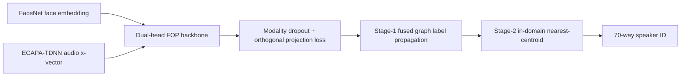
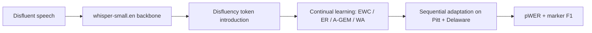
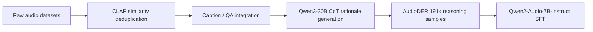
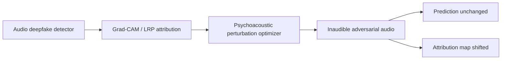

# 语音 / 音频 / 音乐论文速递
## 2026-06-15

> 实际对应 arXiv 更新日：**2026-06-15**
> 检索范围：`cs.SD + eess.AS`
> 只放按 ML 顶会审稿口径看，最值得多数读者花时间看的 **5 篇**

## 📋 总览

- 共收录 **5 篇** 相关论文
- 语音前端 / 说话人识别：**2 篇**
- 音频大模型 / 训练数据：**1 篇**
- 音频可解释性 / 安全：**1 篇**
- 语音大模型 / 空间音频理解：**1 篇**

今天这批稿子真正值得看的，不是“谁又把模型堆大了一点”，而是两条很清楚的主线：一条是前端和训练策略怎么把真实噪声、缺失模态、连续学习这些脏问题接住；另一条是音频大模型怎么把“听懂内容”推进到“听懂时间和空间”。`MaskedFOP` 和 `Learning to Hear Hesitation` 都是在做很硬的前端/ASR 适配，`AudioDER` 讲的是数据怎么整理才配得上后训练，`ST-AudioLM` 则是今天最像主线论文的一篇，终于把动态声源的语义、轨迹和问答绑到了一起。`Audio-XAI` 不是主流生成线，但它提醒得很直接：音频解释图一样能被玩坏，别把后验可视化当护身符。

## 精选入选规则

- **新意（0-3）**：是不是提出了新的表示、接口、控制方式，或者把老问题拆得更对
- **影响力（0-3）**：是不是贴近 TTS、ASR、音频大模型、音乐理解这些主线
- **证据强度（0-2）**：有没有像样的 baseline、消融和关键数值
- **受众匹配度（0-2）**：对语音前端、语音大模型、音频安全、音乐方向研究者有没有直接启发

分数校准：

- **6**：可读，但更像局部补丁
- **7**：信息量够，值得过一遍
- **8+**：建议优先精读

## 总览表

| 方向 | 序号 | 论文 | 评分 | 关键词 |
|---|---:|---|---:|---|
| 语音前端 / 说话人识别 | 1 | MaskedFOP | 8/10 | missing modality, graph label propagation, ECAPA-TDNN, FaceNet |
| 语音前端 / 连续学习 ASR | 2 | Learning to Hear Hesitation | 8/10 | disfluency token, continual learning, whisper-small.en, marker F1 |
| 音频大模型 / 后训练数据 | 3 | AudioDER | 8/10 | deduplication, CoT rationale, Qwen2-Audio, post-training |
| 音频可解释性 / 安全 | 4 | The Perceived Fragility of Explanations in Audio Models | 7.5/10 | psychoacoustic attack, Grad-CAM, LRP, deepfake detection |
| 语音大模型 / 空间音频理解 | 5 | Spatio-Temporal Audio Language Modeling for Dynamic Sound Sources | 8.5/10 | FOA, trajectory-aware tokens, ST-AudioQA, OLMo2 |

## 🧭 语音前端 / 说话人识别

### [1] MaskedFOP: Polyglot Speaker Identification under Missing Visual Modality via Cascaded Graph Label Propagation

- **评分**：8/10
- **作者/机构**：Ayoub Elkhouzari, Youssef Iraqi, Loubna Mekouar / Mohammed VI Polytechnic University
- **论文链接**：https://arxiv.org/abs/2606.14321
- **PDF**：https://arxiv.org/pdf/2606.14321.pdf
- **代码链接**：**代码已开源** https://github.com/Ayoub-Elkhouzari/POLY-SIM2026
- **Demo 链接**：暂无

#### 📌 简介
这篇做的是一个很具体但很难的识别问题：训练时有脸和声音，测试时脸没了，而且测试语音还换成了没见过的 Urdu。作者没有硬上一个“统一大模型”，而是把 FOP、模态 dropout、双头训练、跨种子音频平均、两阶段图传播和最近邻修正拼成一条完整链路，最后在 POLY-SIM 2026 上把分数做到 0.9989。

#### ☠️ 毒舌点评
这篇不是花架子，问题真、链路也真，唯一要警惕的是它很吃 closed-set 和 transductive 设定，离开放世界在线识别还差一截。说白了，它强在“竞赛协议下把工程打透”，不是强在发明了新范式；但对做说话人识别、跨模态身份对齐的人来说，确实值得读。

#### 🔧 技术方案
- **模型解决的问题**：脸缺失、语言跨域、训练语音单一，这三个坑一起出现时，普通 face-voice 融合模型很容易塌。`MaskedFOP` 解决的是“在缺失视觉模态和跨语言语音同时存在时，如何让 audio branch 真正独立站起来”。
- **模型架构**：
  - **输入**：预提取的 `FaceNet` 512 维 face embedding 和 `ECAPA-TDNN` 192 维 audio x-vector。
  - **输出**：70 类 closed-set speaker identity。
  - **主干**：`FOP` backbone + modality dropout dual-head network。
  - **关键模块**：
    - `EmbedBranch`：`Linear → BN → ReLU → Dropout → L2 norm`。
    - `modality dropout`：按样本随机丢 face，逼 audio 分支学会单独判别。
    - `orthogonal projection loss`：拉大类间差异、压实类内结构。
    - `multi-seed audio averaging`：两个独立种子的 audio embedding 做平均。
    - `Stage-1 graph label propagation`：先在多模态分支上做图传播。
    - `Stage-2 transductive nearest-centroid`：再用测试集 in-domain centroid 做 audio-only 归类。
- **信号流**：

- **关键设计 / 核心创新**：
  - 关键不是“融合”，而是把缺脸时的 audio-only 路径单独拎出来训练，并强制它在训练时见过缺模态场景。
  - 第二个关键点是 transductive centroid：它不靠 70 个训练原型硬猜，而是用测试集自己的高置信预测当锚点，密度直接上去。
  - 第三个关键点是多种子平均，虽然收益不大，但在竞赛里是白捡的稳定性。
- **训练 / 推理策略**：
  - `Adam`，学习率 `1e-3`，`weight decay 1e-5`，batch size `32`，`cosine annealing`，最长 `300 epochs`。
  - `label smoothing ε=0.05`，`OPL weight λ=0.5`。
  - 两个模型用不同随机种子训练，推理时先平均 audio embedding，再做图传播和 centroid 归类。
  - Stage-1 用 `K=7, α=0.65, 50 iters`；Stage-2 用测试集内域 centroid，不做图传播。

#### 📊 实验结果
- 数据：`3,756` 条 English face-audio 训练样本；测试集 `1,521` English + `1,623` Urdu。
- 关键结果：
  - 基线 `FOP` 总分 `0.7337`
  - `MaskedFOP` 总分 `0.9989`
  - 分项 `P3 0.9980 / P4 0.9980 / P5 1.0000 / P6 0.9994`
  - `P6` 甚至略高于 `P4`，说明 Urdu audio-only 没有想象中那么脆
- 消融：
  - 去掉 `modality dropout`，`P4` 从 `0.9764` 掉到 `0.8934`
  - 去掉 `Stage-1 fused LP`，`P4/P6` 明显退化
  - 只用训练原型做 LP，整体掉到 `0.9341 / 0.9107` 级别
- baseline 名称：`FOP`

#### 💡 为什么值得看
它不是在讲一个漂亮故事，而是在告诉你：缺模态、跨语言、闭集识别这几个麻烦一起上来时，靠什么细节能把系统真正拉稳。对做 speaker ID 或多模态身份识别的人，这篇比很多“统一表示”口号型文章更有可复用性。

### [2] Learning to Hear Hesitation: Continual Learning for Disfluency-Aware ASR

- **评分**：8/10
- **作者/机构**：Henri-Leon Kordt, Theresa Pekarek Rosin, Jae Hee Lee, Stefan Wermter / University of Hamburg
- **论文链接**：https://arxiv.org/abs/2606.14391
- **PDF**：https://arxiv.org/pdf/2606.14391.pdf
- **代码链接**：暂无
- **Demo 链接**：暂无

#### 📌 简介
这篇做的是 verbatim ASR 的一个老坑：系统一到 disfluency 就想把它删掉，结果信息丢失、幻觉变多。作者把 disfluency 统一成四类 token，塞进 `whisper-small.en`，再用 `EWC / ER / A-GEM / WA` 四种 continual learning 方法做顺序适应，比较它们在 marker 学习和 ASR 保真之间的真实取舍。

#### ☠️ 毒舌点评
这篇没有装作“我们发现了新大模型”，而是老老实实把一个很脏的工程问题做扎实了。最有价值的不是某个单点数字，而是它把 trade-off 讲明白了：你想让模型更会吐 disfluency marker，就得付出 pWER 代价；想把 pWER 压住，marker 往往就掉了。

#### 🔧 技术方案
- **模型解决的问题**：常规 ASR 习惯性吞掉 `uh / uhm / repetition / pause`，但 verbatim transcription 和临床场景偏偏需要这些东西。`Learning to Hear Hesitation` 解决的是“怎么在不把原始 ASR 底盘训坏的情况下，把 disfluency token 学进去”。
- **模型架构**：
  - **输入**：语音 + 4 类 disfluency token 标注。
  - **输出**：带 marker 的 verbatim transcript。
  - **主干**：`whisper-small.en`。
  - **关键模块**：
    - `FILLER / REP / DISRUPT / PAUSE` 四类 token 体系。
    - `EWC / ER / A-GEM / WA` 连续学习策略。
    - `head attribution`：找出 marker 依赖的 cross-attention heads。
    - `zero-mask ablation`：验证这些 heads 是不是“真在干活”。
- **信号流**：

- **关键设计 / 核心创新**：
  - 先把 marker 引入预训练模型，再做顺序适应，避免一上来就把底座冲垮。
  - 不是只看最终 WER，而是同时看 marker F1，直接暴露“会不会说脏词”和“说得准不准”的冲突。
  - 还顺手做了 attention head 机制分析，证明 marker 不是随机冒出来的，而是由一小撮 cross-attention heads 稳定承包。
- **训练 / 推理策略**：
  - `SME` 阶段训练 `10 epochs`，`lr 2e-5`，`batch size 16`。
  - `Pitt` / `Delaware` 顺序训练时，用 `80/20` 划分，`10%` rehearsal buffer，`ER` 每 batch 取 `25%` old data，`EWC importance=1000`。
  - 结果平均 `3` 次运行。
  - 评估用 `pWER`、`A-WER`、`A-F1`、`AI-WER`、`AI-F1`、`BWT`、`FWT`、`IM`。

#### 📊 实验结果
- Token 引入阶段：
  - `FT`：`SME pWER 12.21`，`LS pWER 5.06`，`SME F1 0.73`
  - `WA`：`SME pWER 9.64`，`LS pWER 3.41`，但 `SME F1 0.00`
  - `A-GEM / ER`：`SME F1 0.75 / 0.73`，marker 更会吐，但 pWER 没 WA 那么低
  - `EWC`：`SME pWER 10.34`，但 `SME F1 0.21`
- 顺序适应阶段：
  - `WA` 的 `A-WER 18.90`，最稳地保住 ASR
  - `ER` 的 marker `F1 0.49`，是最会保 disfluency 的
  - `LS pWER`：`WA 4.68`，`EWC 6.45`，`ER 7.14`，`A-GEM 8.36`
- 机制分析：
  - 去掉 top-5 marker heads，能删掉大约一半的 `FILLER`
  - `REP` / `PAUSE` 更难，说明 marker 不是同一套机制在无脑工作
- baseline 名称：`FT`、`A-GEM`、`ER`、`EWC`、`WA`

#### 💡 为什么值得看
它把一个看起来很小的 ASR 细节问题，拆成了“怎么学、学什么、学了会丢什么”三件事。对做 verbatim ASR、临床 speech、口吃/停顿识别的人，这篇比很多泛化大模型文章更接地气。

## 🤖 音频大模型 / 后训练数据

### [3] AudioDER: A Deduplication-Enhanced Reasoning Dataset for Post-Training Large Audio-Language Models

- **评分**：8/10
- **作者/机构**：Hui Geng, Yi Su, Han Yin, Tianjiao Wan, Qisheng Xu, Jiaxin Chen, Zijian Gao, Hengzhu Liu / 国防科技大学, KAIST
- **论文链接**：https://arxiv.org/abs/2606.14591
- **PDF**：https://arxiv.org/pdf/2606.14591.pdf
- **代码链接**：**代码已开源** https://github.com/MyVision666/AudioDER
- **Demo 链接**：暂无

#### 📌 简介
这篇不是改模型，而是改后训练数据。作者指出很多音频语言数据其实高度重复，继续盲目堆量只会把监督信号越堆越像，于是先做 CLAP embedding 去重，再把 caption、QA 统一成多项选择格式，最后用 `Qwen3-30B` 给每个样本补 CoT rationale，做出一个 191k 规模的 reasoning dataset。

#### ☠️ 毒舌点评
这篇最值钱的地方不在“我们又造了一个大数据集”，而在它承认了音频后训练里最烦人的问题其实是冗余，不是单纯少数据。它没有把数据集包装成模型魔法，但实验说明，数据整理得对，`Qwen2-Audio-7B-Instruct` 只做 SFT 就能明显涨，这比空喊 reasoning 更有说服力。

#### 🔧 技术方案
- **模型解决的问题**：LALM 后训练常被“数据很多”迷惑，实际上大量样本只是 acoustic 近重复。`AudioDER` 解决的是“如何在不增加无效重复的前提下，给大模型喂进真正能推理的音频监督”。
- **模型架构**：
  - **输入**：来自 `Clotho / MusicCaps / MTT / LibriTTS-R / CompA-R / MusicBench / AVQA` 等来源的音频与标注。
  - **输出**：统一的 `audio + caption + MCQ + 4 candidates + CoT rationale` 结构。
  - **主干**：`CLAP` 去重分析 + `Qwen3-30B` rationale 生成 + `Qwen2-Audio-7B-Instruct` 后训练。
  - **关键模块**：
    - `acoustic similarity-based deduplication`
    - `caption / QA annotation integration`
    - `CoT rationale generation`
    - `multiple-choice normalization`
- **信号流**：

- **关键设计 / 核心创新**：
  - 先去重，再做 reasoning annotation，而不是把重复数据都标一遍。
  - 直接复用已有 caption / QA，尽量少造垃圾标注。
  - 把 AVQA 的 `video` 题目改成 `audio`，这一步很朴素，但比重新编题靠谱。
- **训练 / 推理策略**：
  - `Qwen2-Audio-7B-Instruct` 做 `full fine-tuning`。
  - 学习率 `1e-6`，`2 epochs`，global batch size `20`，每 `100 steps` 存 checkpoint。
  - 评估主打 multiple-choice audio reasoning。
  - 数据去重阈值 `τ=0.99`，用 `CLAP` embedding 做相似度和 centroid 分析。

#### 📊 实验结果
- 数据规模：约 `191k` 样本，覆盖 `sound / speech / music` 三大域。
- 主结果：
  - `MMAU-mini` 总分：`59.60 -> 66.70`
  - `sound`: `67.27 -> 71.77`
  - `music`: `56.29 -> 66.77`
  - `speech`: `55.26 -> 61.56`
  - `MMSU`: `35.72 -> 56.49`
  - `MMAR`: `30.00 -> 50.10`
- baseline 名称：
  - `Audio-Reasoner`：`MMAU-mini 61.71`
  - `SARI`：`56.18`
  - `R1-AQA`：`51.80`
  - 以及 `LTU / LTU-AS / Audio Flamingo-Chat / SALMONN / Qwen-audio-Chat / GAMA / GAMA-IT / Mellow`
- 结论很直接：同一个 backbone，换成更好的数据和 rationales，涨幅就已经够大。

#### 💡 为什么值得看
如果你做的是音频大模型后训练，这篇比“再训更久”更接近真问题。它告诉你，数据冗余、标注格式和 CoT 监督才是音频 reasoning 的底层瓶颈，不先把这些收拾好，后面再堆模型大小都只是补丁。

## 🧪 音频可解释性 / 安全

### [4] The Perceived Fragility of Explanations in Audio Models: Manipulation of Attribution with Unchanged Predictions

- **评分**：7.5/10
- **作者/机构**：Piotr Kitłowski, Dominik Wiącek, Mateusz Modrzejewski / Warsaw University of Technology
- **论文链接**：https://arxiv.org/abs/2606.14466
- **PDF**：https://arxiv.org/pdf/2606.14466.pdf
- **代码链接**：**代码已开源** https://github.com/cncPomper/Audio-XAI
- **Demo 链接**：https://github.com/cncPomper/Audio-XAI

#### 📌 简介
这篇做的是一件很不讨喜但很重要的事：攻击音频模型的解释图，而不改它的预测。作者用 psychoacoustic masking 约束去构造 inaudible perturbation，让 `Grad-CAM` 和 `LRP` 的归因图被系统性挪走，同时 deepfake 分类结果保持不变。

#### ☠️ 毒舌点评
这篇不是在炫“解释也能被攻击”，而是在提醒你：很多音频 XAI 看着很像真相，其实只是在给模型找一个能自洽的视觉故事。它的实验比较完整，虽然创新点主要是把图像领域的思路严肃搬进音频，但这个搬法本身就很有价值。

#### 🔧 技术方案
- **模型解决的问题**：音频 deepfake 检测里的 post-hoc explanation 常被默认成可信，但实际上它可能比分类器更脆。`Audio-XAI` 解决的是“如何在预测不变的前提下，系统性操纵解释图”。
- **模型架构**：
  - **输入**：音频样本 + 目标解释区域约束。
  - **输出**：预测不变，但 attribution map 被改写的对抗样本。
  - **主干**：`Grad-CAM` / `LRP` 解释器 + psychoacoustic optimization。
  - **关键模块**：
    - `dynamic psychoacoustic masking threshold`
    - `prediction-preserving objective`
    - `explanation displacement loss`
    - `audio fragility score`
- **信号流**：

- **关键设计 / 核心创新**：
  - 不是简单 `Lp` 攻击，而是引入人耳 masking threshold，确保改图不靠可听噪声硬怼。
  - 同时看 `Grad-CAM` 和 `LRP`，避免只欺负一种解释器。
  - 用 `AFSstable` 这类连续指标描述解释脆弱性，而不是只看 attack success。
- **训练 / 推理策略**：
  - 优化目标同时约束 `explanation alignment`、`prediction preservation` 和 `audibility`。
  - 评估用 `PESQ / STOI / ViSQOL / PEAQ / Zimtohrli / CDPAM`。
  - 对 `AST / SpecTTTra / VGGish` 三类模型分别测试，保证不是单架构幻觉。

#### 📊 实验结果
- 感知质量：
  - `AST` 上，`Psychoacoustic` 的 `PESQ 4.06`、`ViSQOL 4.64`、`CDPAM 0.989`
  - `SpecTTTra` 上，`PESQ 3.77`、`ViSQOL 4.15`、`CDPAM 0.981`
  - `VGGish` 上，`PESQ 4.43`、`ViSQOL 4.89`、`CDPAM 0.995`
  - 相比 `PGD`，这些数都明显更像“听不出来”的攻击
- 脆弱性排名：
  - `SpecTTTra` 最抗打，`Mean Rank 7.83 ± 0.48`
  - `VGGish` 中间，`4.17 ± 0.95`
  - `AST` 最脆，`3.00 ± 0.58`
- baseline 名称：`PGD`、`X-Shift`、`Grad-CAM`、`LRP`

#### 💡 为什么值得看
这篇最值钱的地方，是它把“解释图能不能信”从哲学问题变成了可测的工程问题。做音频安全、deepfake 检测、XAI 的人都应该看，不然你可能以为自己在看模型思考，其实只是看了一张能被轻松改写的热图。

## 🌐 语音大模型 / 空间音频理解

### [5] Spatio-Temporal Audio Language Modeling for Dynamic Sound Sources

- **评分**：8.5/10
- **作者/机构**：Oh Hyun-Bin, Kazuki Shimada, Yuhta Takida, Kim Sung-Bin, Toshimitsu Uesaka, Takashi Shibuya, Kyeongyoon Lee, Tae-Hyun Oh, Yuki Mitsufuji / POSTECH, Sony AI, Sony Group Corporation, Sungkyunkwan University, KAIST
- **论文链接**：https://arxiv.org/abs/2606.14141
- **PDF**：https://arxiv.org/pdf/2606.14141.pdf
- **代码链接**：暂无
- **Demo 链接**：暂无

#### 📌 简介
这篇是今天最像主线论文的一篇。它不满足于让音频大模型回答“这是什么声音”，而是把问题推进到“这是什么、在哪里、什么时候动、怎么动、和别的源怎么相互作用”。作者做了一个 FOA 的 `ST-AudioQA`，再配一个时间分辨编码器 `ST-Audio Encoder` 和接 LLM 的 `ST-AudioLM`，直接把动态声源建模成语义 + 轨迹联合问题。

#### ☠️ 毒舌点评
这篇不是那种光说“多模态 reasoning”却不给任务定义的空稿子，它是真把动态空间音频的缺口补上了一块。问题定义清楚，编码器、问答基准、LLM 接法三件事都齐了；短板是合成渲染仍然偏控制环境，但作为方向起点已经够硬。

#### 🔧 技术方案
- **模型解决的问题**：现有 audio-language model 多半把一段音频当成静态 clip，只讲事件内容，不讲轨迹。`ST-AudioLM` 要解决的是“怎么让模型同时理解声音是什么、在哪里、怎么移动、何时改变空间关系”。
- **模型架构**：
  - **输入**：`FOA` 形式的动态声源音频。
  - **输出**：时空音频问答答案。
  - **主干**：`ST-Audio Encoder` + `OLMo2-7B-Instruct`。
  - **关键模块**：
    - `semantic token`
    - `direction-of-arrival token`
    - `distance token`
    - `trajectory tokens`
    - `two-layer MLP connector`
    - `LoRA adapters`
- **信号流**：

- **关键设计 / 核心创新**：
  - `ST-AudioQA` 不是一般的音频 QA，而是把静态、移动、两源混合和跨源关系拆成可控子任务。
  - 编码器不是只做静态 DoA，而是把 40 个时间 bin 的轨迹都保留下来，给 LLM 用的是带时间顺序的 audio tokens。
  - 这条线真正重要的地方在于，它试图把“语义理解”和“空间跟踪”做成同一个表示，而不是两个互不相干的头。
- **训练 / 推理策略**：
  - `ST-Audio Encoder` 三阶段训练：先学语义，再学静态定位，再学动态轨迹。
  - Stage 3 用 `100K` 单源移动 clip，`20 epochs`，`lr 3e-5`。
  - LLM 侧用 `OLMo2-7B-Instruct`，只训练 `MLP connector + LoRA`。
  - QA curriculum 分 `A / B / C` 三档，分别对应单源感知、双源 grounding、组合推理。

#### 📊 实验结果
- 编码器结果：
  - `ST-Audio Encoder` 的 `semantic mAP 62.8`
  - `DoA MAE 13.8°`
  - `Dist. MAE 0.32 m`
  - `Traj. Acc@20° 62.3`
  - 对比 `Spatial-AST-FOA (temporal crop)` 的 `45.2 mAP / 41.4° / 0.64 m`
  - `PSELDNets-mACCDOA + sem./dist. heads` 的 `29.7 mAP / 13.7° / 0.38 m / 61.4`
- QA 结果：
  - `Qwen2-Audio` 零样本只拿到很有限的空间理解
  - `ST-AudioLM` 在单源、双源 grounding 和组合推理上都领先静态 baseline
  - 文中给出的 `ST-AudioLM` 结果里，Type A / B / C 的关键值分别到 `27.6`、`93.7`、`81.6`、`59.3` 这一档，明显高于静态空间音频接口
- baseline 名称：`Qwen2-Audio`、`BAT`、`PSELDNets-mACCDOA + OLMo2`、`Spatial-AST-FOA + OLMo2`

#### 💡 为什么值得看
这篇最值得看的不是某个单点分数，而是它把“动态空间音频”这件事真正变成了一个可训练、可评测、可接 LLM 的任务。要做下一代音频大模型，光会描述声音不够，得开始会描述声音的时间和位置，这篇就是往那个方向最像样的一步。

## 最后结论

今天最值得优先看的顺序，我给的是：

1. `ST-AudioLM`：最像主线论文，语义、轨迹、问答三件事终于绑在一起了。
2. `AudioDER`：如果你做音频大模型后训练，这篇的价值很实在，数据比模型更关键。
3. `MaskedFOP`：缺模态 + 跨语言识别的工程链路打得很稳，竞赛味很重但可复用。
4. `Learning to Hear Hesitation`：ASR 里一个很脏但很真实的细节问题，连续学习分析做得扎实。
5. `Audio-XAI`：不是主线，但它把“解释图也会被攻击”这件事讲透了，做安全和可解释性的人别忽略。
