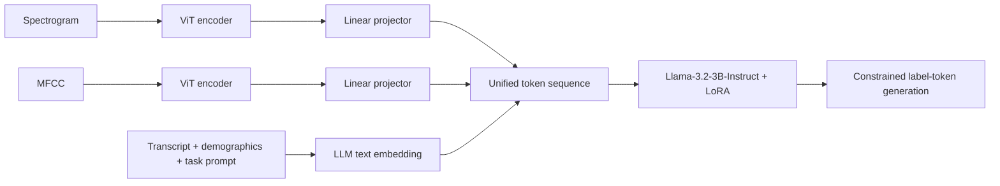
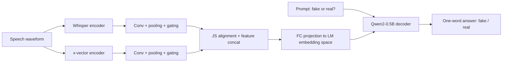
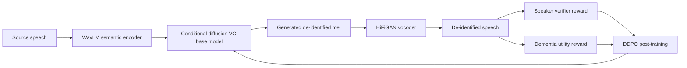
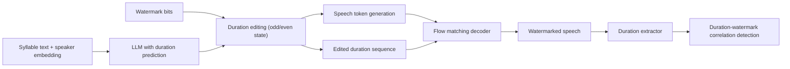
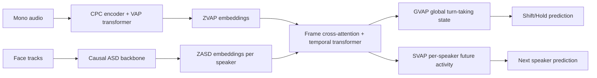

# 语音 / 音频 / 音乐论文速递
## 2026-06-16

> 实际对应 arXiv 更新日：**2026-06-16**  
> 检索范围：`cs.SD + eess.AS`  
> 只放按 ML 顶会审稿口径看，最值得多数读者花时间看的 **5 篇**

## 📋 总览

- 共收录 **5 篇** 相关论文
- 语音医疗 / 语音大模型判别：**1 篇**
- 语音安全 / deepfake / watermark：**3 篇**
- 对话建模 / 多模态 turn-taking：**1 篇**

今天这批最值得看的主线，不是“又多了几个 benchmark”，而是语音安全和语音交互都开始往更真实的部署约束上拧。`DuraMark` 真正回答了一个长期被回避的问题：如果攻击者直接上 neural codec 和 vocoder 重采样，信号级 watermark 基本就是纸糊的，所以它把水印打到 syllable duration 这种信息层变量里，路线是对的。`GARUDA + SEA-CF` 这篇则很实在，把东南亚语言的 codec fake 检测从英语中心主义里拖了出来，还顺手证明“大 ALM 不等于好 detector”。剩下两篇里，`DDPO-VC` 是少见把 speaker de-ID 和健康 utility 冲突正面摊开的工作，`MuVAP` 则是很像会落到机器人系统里的论文，用单目视频 + 单通道音频做 multiparty turn-taking，目标明确，不是摆模型体操。

## 精选入选规则

- **新意（0-3）**：是不是提出了新的表示、目标函数、问题拆法，或者把老问题的错误假设拆穿
- **影响力（0-3）**：是不是贴近语音安全、TTS、说话人隐私、对话系统、多模态交互这些主线
- **证据强度（0-2）**：有没有像样的 baseline、消融、跨设定测试和关键数值
- **受众匹配度（0-2）**：对语音大模型 / 语音前端 / 安全 / 多模态交互研究者有没有直接启发

分数校准：

- **6**：能读，但更像局部补丁或 benchmark 增量
- **7**：有明确信息量，适合方向内研究者快速过一遍
- **8+**：建议优先精读，至少有一个点能直接影响你后续做法

## 总览表

| 方向 | 序号 | 论文 | 评分 | 关键词 |
|---|---:|---|---:|---|
| 语音医疗 / 语音大模型 | 1 | NeurMLLM | 7.5/10 | neurodegenerative screening, multimodal LLM, spectrogram+MFCC, generative classification |
| 语音安全 / deepfake 检测 | 2 | SEA-CF + GARUDA | 8.5/10 | codec fake, SEA languages, small ALM, dual encoder, cross-codec generalization |
| 语音隐私 / 说话人去标识 | 3 | DDPO-VC | 8/10 | diffusion RL, speaker de-identification, privacy-utility tradeoff, dementia speech |
| TTS 安全 / watermark | 4 | DuraMark | 8.5/10 | duration watermark, information-level watermarking, codec attack robustness |
| 多模态对话 / turn-taking | 5 | MuVAP | 8/10 | multiparty turn-taking, monaural audio, single camera, role-relative projection |

## 🩺 语音医疗 / 语音大模型

### [1] Unifying Acoustic Features and Text with Multimodal LLMs for Neurodegenerative Screening

- **评分**：7.5/10
- **作者/机构**：Qingfeng Zhang, Yuanxiong Guo（University of Texas at San Antonio），Yanmin Gong（Texas A&M University）
- **论文链接**：https://arxiv.org/abs/2606.14788
- **PDF**：https://arxiv.org/pdf/2606.14788.pdf
- **代码链接**：暂无
- **Demo 链接**：暂无

#### 📌 简介
这篇做的是语音版神经退行性疾病分期，不只是判 AD / PD 有没有，而是把任务细到 stage 级别。作者提出 `NeurMLLM`，把 spectrogram、MFCC、转写文本和人口统计信息统一塞进一个 instruction-tuned LLM 里，用“生成标签 token”替代传统 classification head，主打的是小样本条件下的 multimodal generative classification。

#### ☠️ 毒舌点评
这类医疗语音论文最常见的毛病，是拿一堆 feature 拼一下再挂个“大模型”名头。`NeurMLLM` 至少没有这么偷懒：它真把 acoustic embedding、文本 prompt 和 demographic context 一起放进 LLM 自注意力里，还认真比较了 generative label-token 和 classification head。问题是数据规模仍然很小，所以这更像“设计方向是对的”而不是“已经能临床落地”。

#### 🔧 技术方案
- **模型解决的问题**：过去的神经退行性疾病语音筛查大多是 transcript-centric，或者声学、文本、人口统计各做各的；即便用 LLM，也常是 pooled embedding 后面接线性分类头。作者想解决的是：在隐私受限、样本少的前提下，怎么把多模态证据统一进一个生成式决策接口里做细粒度分期。
- **模型架构**：
  - **输入**：spectrogram map、MFCC map、任务文本 prompt、转写文本、年龄和性别等 demographic 信息。
  - **输出**：离散阶段标签 token。AD 任务输出 `{MCI, AD, CN}`，PD 任务输出 `{Mild, Advanced, HC}`。
  - **主干**：`双 ViT 声学编码器 + 线性 projector + Llama-3.2-3B-Instruct`。
  - **关键模块**：
    - spectrogram 与 MFCC 各自经过独立 ViT 编码器；
    - 两路声学 embedding 经线性层投到 LLM hidden size；
    - `[SPEC] / [MFCC] / [TEXT]` 模态标记与文本 embedding 串接后统一送入 LLM；
    - LLM 通过 LoRA 只改 query/value 投影层。
- **信号流**：

- **关键设计 / 核心创新**：真正的改动不在“用了 LLM”，而在把 staging 写成 constrained label-token generation，而不是再造一个随机初始化分类头。作者还显式比较了 Audio only、Text only、多模态和不同 LLM backbone，至少把“到底是谁在起作用”交代清楚了。
- **训练 / 推理策略**：
  - 训练数据来自 `Bridge2AI-Voice v3.0.0`，只提供导出的声学特征，不提供原始音频；
  - AD cohort 为 `156` 人，PD cohort 为 `167` 人；
  - backbone 用 `Llama-3.2-3B-Instruct`，LoRA 超参为 `r=8, alpha=16, dropout=0.05`；
  - batch size `16`，在 RTX A6000 上用 `bfloat16` 微调 `3 epochs`；
  - 训练目标是标签 token 上的 cross-entropy；
  - 推理时先聚合 participant-level 多样本预测，再输出 stage 标签。

#### 📊 实验结果
- 数据集与任务：
  - AD：`CN 83 / MCI 44 / AD 29`
  - PD：`HC 83 / Mild 34 / Advanced 50`
- 主要 baseline：`LR`、`CrossAttn`、`ClsHead`、`LLM-A-X`
- AD staging：
  - `NeurMLLM` 的 `macro-AUROC 0.917`、`Acc 0.823`、`macro-F1 0.757`、`macro-Recall 0.748`
  - 对比 `ClsHead` 的 `0.852 / 0.740 / 0.662 / 0.709`
  - 对比 `LR` 的 `0.587 / 0.496 / 0.525 / 0.517`
- PD staging：
  - `NeurMLLM` 的 `macro-AUROC 0.872`、`Acc 0.735`、`macro-F1 0.537`、`macro-Recall 0.648`
  - 对比 `ClsHead` 的 `0.823 / 0.658 / 0.504 / 0.607`
- 模态消融：
  - AD 上 `Audio only` 已有 `Acc 0.794`，`Text only` 只有 `0.556`
  - PD 上 `Audio only` 的 `macro-Recall 0.564`，多模态涨到 `0.648`
- backbone 对比：
  - AD 上 `Llama-3.2-3B-Instruct` 的 `Acc 0.823` 明显高于 `Qwen2.5-3B-Instruct` 的 `0.676`

#### 💡 为什么值得看
这篇最值得看的不是“医疗 + LLM”这个包装，而是它把一个很典型的小样本多模态分类问题，认真改写成了生成式 label-token 任务，并且用实验说明这不是花架子。如果你正做语音医疗、低资源语音诊断、或者任何“多模态 feature + LLM 判别”问题，这篇的接口设计值得抄。

## 🔐 语音安全 / deepfake / 隐私

### [2] Bridging the SEA Gap: An Initial Benchmark for Neural Audio Codec-Synthesized Speech Deepfakes in South-East Asian Languages

- **评分**：8.5/10
- **作者/机构**：Orchid Chetia Phukan, Girish, Mohd Mujtaba Akhtar, Arun Balaji Buduru；IIIT-Delhi / UPES / VBSPU
- **论文链接**：https://arxiv.org/abs/2606.15968
- **PDF**：https://arxiv.org/pdf/2606.15968.pdf
- **代码链接**：**代码已开源** https://github.com/CodeVault-girish/Neural-Codecs
- **Demo 链接**：https://helixometry.github.io/SEACodecFake/

#### 📌 简介
这篇一半是 benchmark，一半是 detector。作者先做了 `SEA-CF`，这是第一个面向东南亚语言的 neural audio codec-synthesized speech deepfake benchmark；然后为了避免“大 ALM 检测器体积太离谱”，又提了一个小模型 `GARUDA`，用 Whisper + x-vector 双编码器加 `Qwen2-0.5B` 解码器做 audio QA 式真假判别。

#### ☠️ 毒舌点评
这篇值钱的地方，不是又做了一个“fake or real”的分类器，而是把 codec fake 检测从英语自嗨里拖出来了。很多 deepfake detector 一到跨语言就露馅，这篇直接证明在 SEA 语种上是成片掉点。`GARUDA` 也不是随便凑的轻量版，它确实把 7B 级别 ALM 打下去了。唯一的问题是 benchmark 成分偏重，方法创新更多体现在系统组合和训练组织，不是新理论。

#### 🔧 技术方案
- **模型解决的问题**：现有 codec fake benchmark 主要围着英语和少量中文打转，SOTA detector 在 SEA 语言上泛化很差；同时最近流行的大型 ALM detector 虽然能训，但实际部署太重。作者要解决的是：补一个真正能测 SEA 语言 codec fake 的 benchmark，并给出一个能部署的 detector。
- **模型架构**：
  - **输入**：单条语音波形。
  - **输出**：文本式真假回答，限定为 `"fake"` 或 `"real"`。
  - **主干**：`Whisper encoder + x-vector encoder + conv/gating/projection + Qwen2-0.5B decoder`。
  - **关键模块**：
    - Whisper 抓语义和语言内容；
    - x-vector 抓 prosody / speaker-style 相关线索；
    - 卷积 + sigmoid gating 过滤双分支特征；
    - `JS divergence alignment loss` 对齐两路表示；
    - 连续前缀注入小型 decoder LM，转成 audio question answering。
- **信号流**：

- **关键设计 / 核心创新**：
  - 数据层：`SEA-CF` 覆盖 Tamil、Hindi、Thai、Indonesian、Malay、Vietnamese，并且显式区分 seen / unseen codec 测试。
  - 模型层：不盲信大 ALM，自建 `<1B` 的 Small-ALM，强调 audio encoder 选择和融合比 decoder 盲目做大更关键。
  - 训练层：把 deepfake detection 写成 audio QA，并加 JS 对齐损失来约束语义分支和韵律分支的一致性。
- **训练 / 推理策略**：
  - 训练数据是 `SEA-CF + CodecFake` 联合训练；
  - `GARUDA` 有两种训练方式：只训 projection module，或者连 decoder 用 LoRA 一起微调；
  - projection-only：`5 epochs`，batch size `32`，lr `1e-4`；
  - decoder LoRA：`3 epochs`，lr `1e-5`，rank `8`，scaling `32`；
  - 温度 `tau=0.5`，JS 损失权重 `lambda=0.4`；
  - 硬件为 `A100`；
  - 推理提示固定为 `Is the speech sample fake or real? Reply in one word "fake" or "real".`

#### 📊 实验结果
- 先验证跨域崩溃：
  - 用 `AASIST` 在旧 `CodecFake` 上训练时，原 benchmark 上有 `94.08% ACC / 6.76% EER`
  - 直接测到 `SEA-CF` 只剩 `70.65% ACC / 28.13% EER`
  - 这说明英语中心训练集根本不够用
- zero-shot 大 ALM 很烂：
  - `Qwen2-Audio-Base` 在 `SEA-CF` 上只有 `19.48% ACC / 80.47% EER`
  - `SeaLLMs-Audio-7B` 也只有 `18.35% ACC / 80.25% EER`
- seen setting 下最强结果：
  - `GARUDA-FT` 在 `SEA-CF` 上 `ACC 99.36 / EER 1.68`
  - 在 `CodecFake` 上 `ACC 98.41 / EER 2.78`
  - 平均 `ACC 98.89 / EER 2.23`
  - 对比 `Qwen2-Audio-Base-FT` 的平均 `94.47 / 5.58`
  - 对比最强传统 baseline `MiO` 的平均 `92.20 / 9.44`
- unseen codec 测试：
  - `GARUDA-FT` 在 unseen 上 `SEA-CF 97.11 / 3.17`，`CodecFake 98.06 / 2.23`
  - 平均 `97.59 / 2.70`
  - 仍优于 `Qwen2-Audio-Base-FT` 的平均 `92.67 / 6.79`
- 效率：
  - `GARUDA` 总参数量 `<1B`
  - `Qwen2-Audio-Base-FT` 平均推理时延 `12.32s`
  - `GARUDA-FT` 只有 `1.21s`

#### 💡 为什么值得看
如果你做语音 deepfake 检测，这篇有两个直接价值。第一，它提醒你别再拿英语 benchmark 上的漂亮分数装作泛化已经解决；第二，它用数据说明“好的 audio encoder 选择 + 合理 fusion + 小 decoder”比粗暴端上 7B 模型更实用。这个结论，对所有音频安全系统都很现实。

### [3] DDPO-VC: Speaker De-Identification via Diffusion Denoising Policy Optimization

- **评分**：8/10
- **作者/机构**：Liming Wang, Cody Karjadi, Rhoda Au, James Glass；MIT CSAIL / Boston University
- **论文链接**：https://arxiv.org/abs/2606.15313
- **PDF**：https://arxiv.org/pdf/2606.15313.pdf
- **代码链接**：**代码已开源** https://github.com/cactuswiththoughts/DDPO-VC
- **Demo 链接**：https://cactuswiththoughts.github.io/SpeakerDeID-Demo/

#### 📌 简介
这篇做 speaker de-identification，但不是老掉牙的 disentanglement 说辞。作者直接指出：在医疗语音里，speaker identity 和 cognitive health 本来就相关，硬做正交 disentangle 很容易既泄漏隐私又损坏 downstream utility。于是他们用 diffusion voice conversion 做生成器，再用 RL 后训练去优化 privacy-utility tradeoff，方法名叫 `DDPO-VC`。

#### ☠️ 毒舌点评
这篇最大的优点，是终于有人承认“隐私”和“有用信息”并不独立。很多 speaker anonymization 论文还在假装只要把 speaker embedding 抹掉就万事大吉，这篇起码在问题定义上更诚实。缺点也很明显：实验规模不算大，而且 reward hacking 风险作者自己也承认了，所以它更像方向正确的研究原型，不是已经成熟的隐私产品。

#### 🔧 技术方案
- **模型解决的问题**：传统 speaker de-id 大多基于 disentanglement 或固定 VC 变换，但在 dementia speech 这种高 stakes 场景里，speaker identity 和认知状态相关，硬拆会把有用病理线索一起抹掉。作者想解决的是：在保护 speaker privacy 的同时，尽可能保住 dementia classification utility。
- **模型架构**：
  - **输入**：原始语音的 Mel 频谱，以及由预训练语音编码器提取的语义表示。
  - **输出**：去说话人后的语音 Mel，再经 HiFiGAN 生成波形。
  - **主干**：`conditional DDPM voice conversion`。
  - **关键模块**：
    - 冻结 `WavLM` 前 18 层做 semantic encoder；
    - diffusion denoiser 学习 `p(x | c_tilde)`；
    - privacy teacher：`ECAPA-TDNN` speaker verifier；
    - utility teacher：dementia classifier（Whisper-based 或 EfficientNet-based）；
    - RL 后训练用 `DDPO`，并加 trust-region 风格 reward clipping。
- **信号流**：

- **关键设计 / 核心创新**：
  - 把 speaker de-id 从静态 disentanglement 改写成 reward-driven 生成后训练；
  - 奖励函数显式由 `rdementia + lambda * rspeaker` 组成，而不是只看 EER；
  - 在 diffusion 上做 RL post-training，而不是只停留在 base VC。
- **训练 / 推理策略**：
  - 预训练用 `FHS` 数据集的 `800h` 子集，healthy / dementia 平衡；
  - 后训练与评测主要在 `ADReSS` 和 `FHS gold 92`；
  - 10 秒音频片段训练，batch size 预训练 `32`、后训练 `16`；
  - 预训练 `100 epochs`，RL 后训练 `1000 steps`；
  - diffusion 采样步数 `50`，trust region `delta=0.5`，KL 正则 `beta=0.2`；
  - 训练硬件为 `2 x A6000`。

#### 📊 实验结果
- baseline：`KNN-VC`、`TriAAN-VC`、`VALL-E`、`LinearVC`、`VEVO`、`FACodec`
- ADReSS：
  - `DDPO-VC (base)`：`AUC(zs) 0.57`，`AUC(ft) 0.75`，`EER 0.42`
  - `DDPO-VC (fixed reward)`：`0.76 / 0.78 / 0.42`
  - `DDPO-VC (trainable reward)`：`0.77 / 0.87 / 0.43`
  - 相比 `LinearVC`，后者 `AUC(ft) 0.89` 但 `EER 0.28`，隐私更差
  - 相比 `VALL-E`，`EER 0.46` 最好，但它依赖 text 且 utility 保留不如 DDPO-VC
- FHS gold 92：
  - `DDPO-VC (trainable reward)`：`AUC(zs) 0.56`，`AUC(ft) 0.92`，`EER 0.50`
  - 对比 `FACodec`：`AUC(ft) 0.92`，`EER 0.44`
  - 也就是 utility 打平 FACodec，但隐私更强
- 消融：
  - Whisper reward teacher 比 EfficientNet teacher 整体更好：在 ADReSS 上 `AUC(zs) 0.76 vs 0.72`
  - `DDPO` 明显优于 diffusion `DPO`：ADReSS 上 `AUC(ft) 0.78 vs 0.60`
  - 调大 speaker reward 权重反而会伤 utility，说明 reward design 还很脆

#### 💡 为什么值得看
这篇最该看的地方，不是“diffusion + RL”这个组合词，而是它把 speaker de-ID 的目标函数重新说清楚了。只要你的任务里隐私变量和有用变量相关，这种 reward-level tradeoff 迟早要正面做，继续拿 disentanglement 当银弹只会自欺欺人。

### [4] DuraMark: Duration-Embedded Watermarking in LLM-based TTS

- **评分**：8.5/10
- **作者/机构**：Zhenwei Mou, Weili Jiang, Liping Chen, Zhen-Hua Ling, Kong Aik Lee, Kai Gao, Boyu Zhao；中国科学技术大学 / 公安部鉴定中心 / 香港理工大学
- **论文链接**：https://arxiv.org/abs/2606.15264
- **PDF**：https://arxiv.org/pdf/2606.15264.pdf
- **代码链接**：暂无
- **Demo 链接**：https://muzw.github.io/duramark_demo/

#### 📌 简介
这篇做的是 TTS watermark，但不是往 waveform 或 spectrogram 上再缝一个信号级后门。作者的核心判断是：一旦攻击者用 neural codec 或 vocoder 重建语音，信号级 watermark 会像噪声一样被抹平。所以 `DuraMark` 转去做 information-level watermark，把 bit 编进 syllable duration 的奇偶性里，再用一个 duration extractor 去做检测。

#### ☠️ 毒舌点评
方向上这是今天最像“终于做对问题”的一篇。过去不少 watermark 论文在普通压缩和加噪声上很能打，一遇到生成式重建就直接跪，原因不是调参不够，而是水印打在了错误层级。`DuraMark` 至少把靶点抬到了 prosody / duration 这个信息层。短板是它目前在中文 syllable 级设置里最自然，跨语言泛化和更复杂韵律系统还没完全证明。

#### 🔧 技术方案
- **模型解决的问题**：信号级 speech watermark 对传统信号处理攻击还行，但碰到 neural codec、vocoder 这类 generative attack 时非常脆，因为这些模型重建的是内容、语义和 prosody，顺手把细粒度信号扰动抹掉了。作者要解决的是：把 watermark 埋到生成模型自己也要保留的信息层变量里。
- **模型架构**：
  - **输入**：文本 syllable 序列、speaker embedding、待嵌入 watermark bit 序列。
  - **输出**：带水印的语音，以及检测时提取出的 duration 序列。
  - **主干**：`duration-controllable LLM-based TTS + duration extractor + flow matching decoder`。
  - **关键模块**：
    - LLM 先逐 syllable 预测 duration token，再预测 speech token；
    - watermark 通过把 duration 改到奇数 / 偶数状态嵌入；
    - flow matching decoder 条件于 duration 和 speech token 合成 Mel；
    - duration extractor 从语音中恢复 syllable durations 做检测。
- **信号流**：

- **关键设计 / 核心创新**：
  - 把 watermark 从 signal level 提升到 syllable duration 这种 information level；
  - duration 不是后处理瞎改，而是内嵌进可控 LLM-TTS 与 flow matching decoder；
  - 检测时把提取的 duration 序列映射到 `[-1, 1]` 与 watermark bit 做相关性判断。
- **训练 / 推理策略**：
  - 训练数据来自 `WenetSpeech 10000h`，用 `MFA` 对齐 syllable 边界；
  - 测试集是 `AISHELL-3`，214 位说话人；
  - 基于开源 `CosyVoice` 框架训练；
  - 用 Adam，学习率 `1e-5`，8 张 `MLU 580 GPU`；
  - loss 权重 `lambda_llm=1`，`lambda_flow=4`；
  - 推理时 speech token 用 `top-p 0.8`、`top-k 25` 采样，duration token 用 greedy。

#### 📊 实验结果
- **对比 baseline**：`AudioSeal`、`Timbre`、`WavMark`
- speech length 影响：
  - `33–64` syllables 时，`DuraMark-Info TPR@1%FPR = 0.998`
  - blind 检测也有 `0.987`
- generative attack 鲁棒性最关键：
  - `SpeechTokenizer` 攻击下：
    - `AudioSeal 0.773`
    - `Timbre 0.124`
    - `WavMark 0.015`
    - `DuraMark-Info 0.991`
  - `FACodec` 攻击下：
    - `AudioSeal 0.013`
    - `Timbre 0.036`
    - `WavMark 0.010`
    - `DuraMark-Info 0.994`
  - `BigVGAN / Vocos / HiFiGAN` 攻击下，`DuraMark-Info` 仍在 `0.994~0.997`
- 平均 TPR：
  - `AudioSeal 0.701`
  - `Timbre 0.790`
  - `WavMark 0.403`
  - `DuraMark-Info 0.993`
  - `DuraMark-Blind 0.978`
- 自然度：
  - ground truth `MOS 4.35`
  - unwatermarked `4.05`
  - `DuraMark 4.04`
  - CER `8.54%`，与 `AudioSeal 8.15`、`Timbre 8.56` 同一量级
- 消融：
  - 去掉 duration input，TPR 从 `0.998` 掉到 `0.455`
  - 去掉 `Lguide`，掉到 `0.327`

#### 💡 为什么值得看
如果你做语音 watermark，这篇基本是必须读。它最重要的启发不是“duration 也能藏 bit”，而是你得先问清楚攻击者会保留哪一层信息，再决定 watermark 应该嵌到哪一层。这个思路比再卷一点点 signal-level engineering 更值钱。

## 🤖 多模态对话 / turn-taking

### [5] MuVAP: Multimodal Multiparty Voice Activity Projection for Turn-taking Prediction in the Wild

- **评分**：8/10
- **作者/机构**：Haotian Qi, Gabriel Skantze；KTH Royal Institute of Technology
- **论文链接**：https://arxiv.org/abs/2606.16731
- **PDF**：https://arxiv.org/pdf/2606.16731.pdf
- **代码链接**：**代码已开源** https://github.com/Haotian-Qi/MuVAP
- **Demo 链接**：暂无独立 demo，代码仓库已公开

#### 📌 简介
这篇做 multiparty turn-taking prediction，但场景约束非常明确：只给你单通道音频和单个摄像头，不许用麦克风阵列，也不许多机位。作者提出 `MuVAP`，把传统 `Voice Activity Projection` 扩成一个 multimodal、multiparty、causal 框架，再用 `Role-Relative Projection` 把 N 人对话压成“当前 floor-holder vs 下一个 floor-holder”的相对状态，避免标签空间指数爆炸。

#### ☠️ 毒舌点评
这篇很像真正会进机器人系统的工作，不是论文里靠豪华传感器堆出来的 next speaker predictor。作者连数据集都顺手补了，因为现有 audiovisual dataset 不是剪辑太碎，就是视角不对。缺点是性能当然还谈不上“接近人类”，尤其 3 人 NSP 还不高，但这是问题本身难，不是它在糊弄。

#### 🔧 技术方案
- **模型解决的问题**：传统 VAP 在两人对话里很好用，但一到多人场景，joint future state 的 label 数爆炸；而很多多模态方法又依赖阵列麦克风、多相机或干净分轨，不适合 HRI。作者要解决的是：在真实单目单音频条件下，既预测何时 turn shift，也预测是谁接下一轮。
- **模型架构**：
  - **输入**：单通道 16kHz 音频流，以及每个可见说话人的 face track。
  - **输出**：`GVAP` 全局 turn-taking 状态预测，以及每个说话人的 `SVAP` 未来发声概率。
  - **主干**：`VAP backbone + causal ASD backbone + multimodal MuVAP fusion module`。
  - **关键模块**：
    - `VAP backbone` 用 CPC + Transformer 建模音频 turn-taking 先验；
    - `causal ASD` 用改造后的 TalkNet 做说话人视觉锚定；
    - `Role-Relative Projection` 把多人状态压成 current / next 两角；
    - `GVAP` 做全局状态预测，`SVAP` 做说话人级未来活动预测；
    - gated fusion 让 GVAP 作为“社会节拍器”调制 speaker 级预测。
- **信号流**：

- **关键设计 / 核心创新**：
  - `Role-Relative Projection` 是核心，把多人的联合状态压成当前说话人和候选下一个说话人的 pairwise 表示，从 `2^(4N)` 的复杂度里脱身；
  - 新数据集 `AVCC` 收了 `30h52m` 的未剪辑单机位多人视频，补了现有 ASD / wild 数据不适合因果 turn-taking 的坑；
  - 训练是模块化的：电话语音学 acoustic rhythm，ASD 数据学视觉锚定，最后在 AVCC 上学多模态整合。
- **训练 / 推理策略**：
  - 用 `Fisher 1958h` 训 VAP backbone；
  - 用 `AVA-AS 38h + MSDWild 80h + WASD 30h` 预训练 ASD；
  - `MuVAP` 最终在 `AVCC 30h52m` 上训练，backbone 冻结；
  - 模型总参数约 `27.7M`，其中 ASD `20.7M`、VAP `4.9M`、MuVAP `2.1M`；
  - 单卡 `A100 40GB`；
  - 所有预测严格 causal，不偷看未来帧。

#### 📊 实验结果
- **对比 baseline**：`Majority class`、`Random`、`VAP`、`MLP`
- 数据集：
  - `AVCC` 总计 `30h52m`
  - `2-speaker 17h31m`，`3-speaker 13h21m`
- 先看 Role-Relative Projection 是否站得住：
  - Fisher 上原始 speaker-based stereo VAP 的 `Macro-F1 = 0.799`
  - 论文提出的 role-relative mono 版是 `0.778`
  - 只掉约 `2%`，说明这个压缩没把问题做废
- Shift-Hold Prediction（AVCC）：
  - 2 人 silent：`VAP 0.672`，`MLP 0.650±.003`，`MuVAP 0.696±.003`
  - 3 人 silent：`VAP 0.655`，`MuVAP 0.670±.002`
  - 2 人 active：`VAP 0.622`，`MuVAP 0.641±.005`
  - 3 人 active：`VAP 0.634`，`MuVAP 0.652±.002`
- Next Speaker Prediction（AVCC）：
  - 2 人 silent：`MLP 0.617±.002`，`MuVAP 0.637±.003`
  - 加 GVAP 条件后到 `0.666±.003`
  - 若 previous speaker 是 oracle，可到 `0.702±.003`
  - 3 人 silent：`MLP 0.464±.002`，`MuVAP 0.477±.001`
  - 加 GVAP 条件后 `0.508±.003`
  - 2 人 active：`MuVAP 0.560±.002`
  - 3 人 active：`MuVAP 0.441±.002`
- previous speaker 推断：
  - 2 人 silent `0.837±.001`
  - 3 人 silent `0.760±.001`
  - 这也解释了 NSP 的上限还受 speaker anchoring 质量约束

#### 💡 为什么值得看
如果你做 spoken dialog system、HRI 或多模态代理，这篇的价值很直接：它把“单目 + 单通道也要做多人 turn-taking”这件事建模清楚了。哪怕你不照抄 MuVAP，`Role-Relative Projection` 这种先压状态空间再做预测的思路，也值得带走。

## 最后结论

今天最值得优先看的三篇，我会这样排：

1. `DuraMark`：因为它不是在老水印路线里再卷一点，而是直接把 watermark 层级从 signal 抬到 information，思路最可能影响后续做法。
2. `SEA-CF + GARUDA`：因为它同时解决了 benchmark 盲区和 detector 部署问题，而且用结果打脸了“大 ALM 自然更强”的偷懒假设。
3. `DDPO-VC`：因为它把 speaker privacy 和医疗 utility 的冲突摊开了，这比很多匿名化论文的假设更接近真实世界。

`MuVAP` 也值得读，尤其如果你关心机器人或多模态代理；`NeurMLLM` 则更适合做语音医疗、低资源多模态分类的人精读。整体看，今天这批论文的共同点很明确：少一点 demo 炫技，多一点“系统真要落地会卡在哪里”的正面回答。这种稿子通常更值得花时间。
