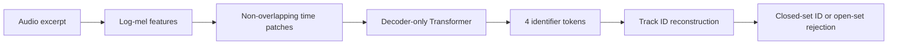
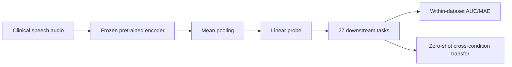
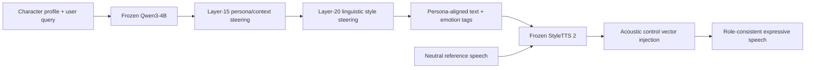
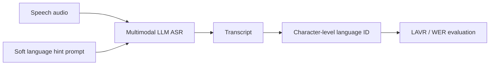
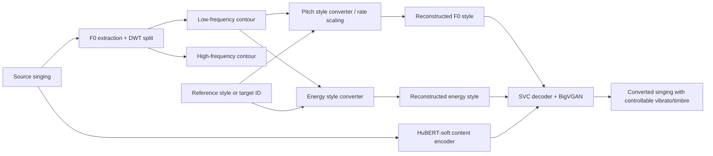

# 语音 / 音频 / 音乐论文速递
## 2026-06-17

> 实际对应 arXiv 更新日：**2026-06-17**  
> 检索范围：`cs.SD + eess.AS`  
> 只放按 ML 顶会审稿口径看，最值得多数读者花时间看的 **5 篇**

## 📋 总览

- 共收录 **5 篇** 相关论文
- 音乐检索 / 音频系统：**1 篇**
- 临床语音 / benchmark：**1 篇**
- 语音 Agent / 多语 ASR 控制：**2 篇**
- 歌声转换 / 音色转换：**1 篇**

今天这批最值得看的，不是“谁又把模型做大了”，而是三条更硬的研究线。第一条是 `Turning music identification into a neural forward pass`，它把本来依赖数据库检索的音乐识别，硬改成单次前向直接吐 track ID，这不是常见的 embedding retrieval 换皮，而是把“检索”本身重写成生成式识别。第二条是 `SpeechDx`，它不是新模型，但它把临床语音这个一直各做各的碎片方向，压成一个 12 数据集、27 任务、还能看跨病种迁移的统一 benchmark，这对做医疗语音表示的人比又一篇单病种小样本 paper 更有价值。第三条是 `VibE-SVC2`，这是今天最像“真能给歌声/音色研究者带来直接可复用思路”的工作：把 vibrato extent、vibrato rate、pitch-energy entanglement 和 vocal fry 这些一直搅在一起的细节拆开管，还给了 demo 和代码。

`DeSRPA` 和 `language adherence` 两篇也不是凑数。前者说明了“语音角色扮演”未必一定要 E2E 大规模再训，冻结 LLM + 冻结 TTS 做 inference-time steering 也能接近 GPT-4o Audio 的一部分体验；后者则是一个非常现实的多语 ASR 控制问题，提醒大家不要把“模型会多语”误当成“模型会老老实实输出你要的语种”。

## 精选入选规则

- **新意（0-3）**：是不是提出了新接口、新表示，或者把老问题拆得更对
- **影响力（0-3）**：是不是贴近语音大模型、语音系统、歌声转换、语音评测这些主线
- **证据强度（0-2）**：有没有明确 baseline、关键指标和足够硬的数值
- **受众匹配度（0-2）**：对语音 / 音频 / 音乐方向研究者有没有直接启发

分数校准：

- **6**：能看，但更像局部补丁或分析文章
- **7**：信息量够，值得过一遍
- **8+**：建议优先精读

## 总览表

| 方向 | 序号 | 论文 | 评分 | 关键词 |
|---|---:|---|---:|---|
| 音乐检索 / 音频系统 | 1 | Turning music identification into a neural forward pass | 8.5/10 | direct recognition, generative retrieval, music ID, open-set rejection |
| 临床语音 / benchmark | 2 | SpeechDx | 8/10 | clinical speech AI, benchmark, 12 datasets, cross-condition transfer |
| 语音 Agent / 角色语音 | 3 | DeSRPA | 7.5/10 | speech role-playing agent, inference-time intervention, StyleTTS 2 |
| 歌声转换 / 音色转换 | 4 | VibE-SVC2 | 8.5/10 | singing voice conversion, vibrato control, zero-shot style conversion |
| 多语 ASR / 语音大模型控制 | 5 | On spoken language adherence in multimodal LLMs | 7.5/10 | multilingual ASR, prompt control, SFT, CoT, LAVR |

## 🎵 音乐检索 / 音频系统

### [1] Turning music identification into a neural forward pass

- **评分**：8.5/10
- **作者/机构**：Muhammad Taimoor Haseeb, Ahmad Hammoudeh, Gus Xia；Music X Lab, Mohamed Bin Zayed University of Artificial Intelligence
- **论文链接**：https://arxiv.org/abs/2606.17301
- **PDF**：https://arxiv.org/pdf/2606.17301.pdf
- **代码链接**：论文正文未给出
- **Demo 链接**：论文正文未给出

#### 📌 简介
这篇做的事很直接，也很野：不再把音乐识别当成“先提 fingerprint / embedding，再去数据库里搜谁最像”，而是把整首歌的身份直接内化进模型参数，让模型看 1 秒音频就自回归吐出 track ID。作者把这套路线叫作接近 System-1 的 direct recognition，本质上就是把 retrieval pipeline 改写成生成式识别问题。

#### ☠️ 毒舌点评
这不是一般的“把检索换成 transformer 编码器，再接个相似度头”的老套路。它真的把外部数据库拿掉了，所以 latency、storage、open-set rejection 的系统侧指标都变了。缺点也很明显：这条路本质上是在记住封闭曲库，扩到超大规模、频繁增量更新的真实平台后，维护成本和模型容量问题会变得很尖锐。

#### 🔧 技术方案
- **模型解决的问题**：传统音乐识别系统无论是 `Dejavu` 这类声纹指纹，还是 `GraFPrint` 这类神经 fingerprint，本质都还是“提特征 + 查库”。作者要补的缺口是：在固定封闭曲库里，能不能根本不查库，而是把曲库身份直接存在模型里，让识别退化成一个前向生成问题。
- **模型架构**：
  - **输入**：随机时间偏移切出的短音频片段，先转成 `log-mel`，再切成 non-overlapping time patches。
  - **输出**：4 个 identifier token，按 little-endian byte 序列编码成 track ID。
  - **主干**：decoder-only Transformer，causal self-attention，自回归生成 ID。
  - **关键模块**：
    - `P` 个 patch token 作为上下文输入；
    - learned `BOS` embedding 启动解码；
    - open-set 时用 multi-segment majority vote + agreement 做置信度判断；
    - retrieval 不再出现在 inference graph 里。
- **信号流**：

- **关键设计 / 核心创新**：
  - 用生成式 ID 解码替换 fingerprint 检索，这一点比“检索前端神经化”更激进。
  - open-set 不是额外训一个 OOD 头，而是靠多段预测一致性作为 confidence signal。
  - 论文还认真讨论了 internalized dataset 的增量维护问题，给了 rehearsal / LwF / full retrain 对比，不只是把核心实验做完就收工。
- **训练 / 推理策略**：
  - 训练输入统一为固定长度 `P` 个 patch；窗口先在 GPU 上批量转 `log-mel` 并缓存。
  - 采用 waveform 级增强加 `SpecAugment`：time offset、background noise、impulse response、time-frequency masking。
  - 使用 `AdamW`，`lr=3e-4`，gradient clipping `1.0`，训练到接近 complete dataset memorization，通常在 `150-200 epochs`。
  - teacher forcing 优化 4 个 ground-truth identifier token 的负对数似然。
  - 推理时 closed-set 用 greedy decoding；open-set 通过 segment agreement 与全局阈值 `τ` 决定是否拒识。
  - 论文报告了 CPU / GPU latency 和外部存储占用，没有回避系统侧成本。

#### 📊 实验结果
- 数据与设置：默认 `N=1,000` tracks，查询长度 `ℓ=1s`，5 个随机种子重复。
- 主要 baseline 是 `Dejavu` 和 `GraFPrint`。
- 关键结果：
  - closed-set Top-1：direct recognition `99.6%`，明显高于 `Dejavu 76.3%` 和 `GraFPrint 86.6%`。
  - noisy dataset Top-1：`93.3%`，对比 `Dejavu 37.2%`、`GraFPrint 51.2%`。
  - open-set：FPR `2.4%`、FNR `4.8%`、balanced accuracy `96.4%`；`Dejavu` 的 FNR 高到 `30.4%`。
  - 系统指标：p95 latency 在 CPU 上 `97 ms/query`，比 `Dejavu 224 ms` 快约 `2.3x`；数据库外部存储只要 `10 MB`，而 `Dejavu` 需要 `3348 MB`。
- 模型规模：
  - Small `2.76M` 参数；
  - Medium `9.85M` 参数；
  - Large `19.31M` 参数，磁盘 checkpoint `74 MB`。
- 增量更新：
  - full retraining：retain `97.0%`，acquire new `96.6%`，overall `96.8%`，但成本 `127.5 GPU-hours`。
  - naive fine-tuning：new data `99.6%`，但 old retain 直接掉到 `0.0%`。
  - rehearsal 50%：retain `99.0%`，new `98.8%`，overall `98.9%`，只要 `23.0 GPU-hours`。
  - rehearsal 20%：overall 也还有 `99.0%`，forgetting 仅 `1.2` point。

#### 💡 为什么值得看
这篇最值得看的点，不是“音乐识别又涨了多少点”，而是它把一个经典检索任务完整改写成 parametric recognition，并且把 latency、存储、open-set、增量维护都一起摆上桌。对做 audio retrieval、音频索引系统、甚至 speech memory system 的人，这篇会逼你重新想一遍“哪些检索问题其实可以不查库”。

#### 评分：8.5/10
理由：想法够硬，系统指标也够扎实。扣分点是路线天然受封闭曲库和模型容量制约，离真正开放世界检索还很远。

## 🩺 临床语音 / Benchmark

### [2] SpeechDx: A Multi-Task Benchmark for Clinical Speech AI

- **评分**：8/10
- **作者/机构**：Sejal Bhalla, Larry Kieu, Aina Merchant, Eyal de Lara, Alex Mariakakis；University of Toronto
- **论文链接**：https://arxiv.org/abs/2606.17339
- **PDF**：https://arxiv.org/pdf/2606.17339.pdf
- **代码链接**：**匿名评审仓库已给出** https://anonymous.4open.science/r/SpeechDx-F584
- **Demo 链接**：暂无

#### 📌 简介
这篇不是新 encoder，也不是新诊断模型，它做的是更稀缺的东西：把临床语音 AI 从“每个病种各自玩一套、协议不统一、结果没法横比”的状态，整理成一个有统一任务定义、统一 probe protocol、还能测跨病种迁移的 benchmark。`SpeechDx` 覆盖 `12` 个数据集、`27` 个任务、`9` 类健康/情感条件，并按 speech production stages 来分：conceptualization、formulation、articulation。

#### ☠️ 毒舌点评
benchmark 文不天然高分，很多就是“我们收集了一堆表格”。这篇稍微不一样，它至少问对了问题：临床语音里最缺的不是再堆一个单病种 SOTA，而是看现有表示到底能不能跨数据集、跨病种、跨生产阶段泛化。短板也有，临床标签本身异质、英语数据偏多、真正的临床可部署性还远没解决，但这个 benchmark 本身是有价值的。

#### 🔧 技术方案
- **模型解决的问题**：当前 clinical speech AI 的主要问题不是没人做，而是研究碎片化严重。数据采集条件、标签定义、病种范围、训练协议都不统一，导致大家经常把 dataset artifact 当临床信号。`SpeechDx` 要解决的是“如何建立一个统一的临床语音表示评测框架，并顺手测出哪些表示真的能迁移”。
- **模型架构**：
  - **输入**：来自不同临床场景的语音录音，包括抑郁、阿尔茨海默、失语、构音障碍、帕金森、呼吸与声带疾病等。
  - **输出**：27 个下游任务的分类或回归结果。
  - **主干**：不是单一模型，而是 `12` 个预训练编码器 + frozen encoder + linear probe 的统一评测框架。
  - **关键模块**：
    - 任务按 speech production stages 组织；
    - within-dataset linear probing；
    - zero-shot cross-condition transfer；
    - mixed-metric 汇总时用 `MRR` 做 stage-level ranking。
- **信号流**：

- **关键设计 / 核心创新**：
  - 不按病种论文传统分法来堆数据，而是按 speech production mechanism 分 stage，这让跨条件迁移分析更有结构。
  - 把 `Whisper`、`Qwen3-TTS-Tokenizer`、`WavLM`、`emotion2vec+`、`OPERA-GT` 这类来源差异很大的编码器放进同一 protocol，能直接看“通用大模型”“domain-specific 模型”“情感专用模型”到底谁在哪类临床任务上吃香。
  - 不只做 in-domain benchmark，还单独测 zero-shot transfer，这点比很多 benchmark 更值钱。
- **训练 / 推理策略**：
  - 所有 encoder 权重冻结，只训练单层 linear probe，减少过拟合，适配小样本临床数据。
  - binary / multi-label 用 BCE，multi-class 用 categorical CE，regression 用 weighted MSE。
  - 训练集只做 augmentation：加噪、混响、speed perturbation；验证和测试都在 clean audio 上评。
  - 超参通过 `Optuna` 搜 5 次 trial，学习率范围 `1e-4` 到 `1e-3`，batch size `16`，最多 `50 epochs`，early stop patience `5`。
  - zero-shot transfer 中 source 训练、target 直接测试，不用 target data 调参。

#### 📊 实验结果
- 任务规模：`12 datasets`、`27 tasks`、`9 health conditions`。
- 主要模型池：
  - `wav2vec 2.0 317M`
  - `HuBERT 316M`
  - `WavLM 316M`
  - `MMS-1B 1000M`
  - `Qwen3-TTS-Tokenizer 150M`
  - `Whisper Large-v3 1550M`
  - `emotion2vec+ Large ~300M`
  - `OPERA-GT 21M`
- overall 排名：
  - `Whisper MRR 0.44`
  - `Qwen3-TTS-Tokenizer MRR 0.40`
  - `WavLM MRR 0.38`
  - 明显强于 `CLAP` 和 `wav2vec 2.0`
- 对比 baseline 结论：
  - 通用大模型 baseline 里，`Whisper / Qwen3 / WavLM` 整体最稳；
  - domain-specific baseline 并不稳定占优，例如 `emotion2vec+` 在 conceptualization 很强，但跨任务不稳，`OPERA-GT` 也主要只在接近呼吸相关的任务上有局部优势。
- 代表性任务：
  - `T9 Aphasia detection`：`Qwen3 0.97 AUC`，`WavLM 0.96`，`Whisper 0.92`
  - `T12 Dysarthria detection`：`MMS 0.99 AUC`，`Whisper 0.97`，`WavLM 0.96`
- `T27 Vocal pathology detection`：`AudioMAE 0.92`、`WavJEPA 0.92`、`AST 0.92`
- `T25 COVID-19 detection`：最好也只有 `AST 0.79`，说明呼吸类任务还是难。
- cross-condition transfer：
  - `Alzheimer’s -> Aphasia` 可到 `0.94 AUC (HuBERT)`，但反向 `Aphasia -> Alzheimer’s` 只有 `0.74`。
  - `Phonatory/Respiratory -> Conceptualization` 可到 `0.83 (emotion2vec+)`；
  - `Phonatory/Respiratory -> Formulation` 可到 `0.88 (HuBERT)`；
  - 反向迁移则常常 `<= 0.60`。
  - `Emotion -> Depression` 最高 `0.75`，甚至略高于 depression 自训最优 `0.65`，说明某些情感表征确实能转移。
- data efficiency：
  - `Qwen3` 在最低数据量设定下领先 `11/27` 个任务；
  - `T9 Aphasia` 只用 `12.5%` 数据时，`Qwen3` 已经有 `0.90 AUC`，全量到 `0.97`；
  - `Parkinson’s` 与 `Alzheimer’s` 任务的数据需求更陡，低数据下更不稳。

#### 💡 为什么值得看
这篇值得看的地方不在于它给出了一个新的临床语音王者模型，而在于它非常明确地告诉你：今天所谓“强表示”在临床语音里仍然高度分裂，`Whisper/Qwen3/WavLM` 只是 overall 更稳，离真正跨病种、跨采集条件、跨 production stages 的通用表示还差得远。做 clinical speech、health audio 或语音 foundation model 的人，都该先看这种 benchmark 再决定自己该追哪类模型。

#### 评分：8/10
理由：不是 flashy paper，但问题抓得准，benchmark 组织也够严肃。扣分点是它更偏评测基础设施，对直接追模型 novelty 的人吸引力会弱一些。

## 🤖 语音 Agent / 多语 ASR 控制

### [3] DeSRPA: Decoupled Speech Role-Playing Agent via Inference-Time Intervention

- **评分**：7.5/10
- **作者/机构**：Wenqiu Tang, Zhen Wan, Takahiro Komamizu, Ichiro Ide；Nagoya University，National Institute of Informatics
- **论文链接**：https://arxiv.org/abs/2606.17669
- **PDF**：https://arxiv.org/pdf/2606.17669.pdf
- **代码链接**：论文正文未给出
- **Demo 链接**：https://steeremo971-commits.github.io/emosteer-tts-demo/

#### 📌 简介
这篇做的是 speech role-playing agent，但路线跟常见的 E2E 大一统语音角色模型不一样。作者的核心判断是：E2E fine-tuning 虽然能把“脑子”和“声音”绑一起，但会带来角色数据依赖和 reasoning degradation。于是他们拆成两级：冻结 `Qwen3-4B` 负责内部认知 steering，再冻结 `StyleTTS 2` 负责外部情绪表达，靠 inference-time control vectors 把 persona、context、linguistic style 和 acoustic emotion 对齐。

#### ☠️ 毒舌点评
这篇最大的优点是没盲信“大一统 E2E 一定更强”。它正面承认 cascaded 方案会有 text-audio misalignment，但也指出 E2E 有 modality alignment tax。论文最有意思的地方不是结果绝对值，而是它证明了：在角色扮演这种对 persona consistency 很敏感的任务上，推理时干预 frozen backbones 也能打赢不少开源 E2E baseline。问题是，它的 consistency 仍然离真正高沉浸的 open-domain 角色语音有差距，尤其碰到动画化、夸张型 persona 时会露底。

#### 🔧 技术方案
- **模型解决的问题**：现有 SRPA 一边要保住 LLM 的角色推理，一边要把情绪、音色、韵律做出来。E2E 微调经常牺牲 reasoning，传统 cascaded TTS 又会把情绪表达做成“语义和声音不同步”。`DeSRPA` 解决的是如何在不更新 backbone 参数的前提下，同时操纵“脑内 persona”与“外部声音表现”。
- **模型架构**：
  - **输入**：角色 profile、当前 query、参考中性说话音频。
  - **输出**：带角色风格和情绪表达的语音回复。
  - **主干**：frozen `Qwen3-4B` + frozen `StyleTTS 2`。
  - **关键模块**：
    - `Internal Cognitive Steering`：用 sparse autoencoder 学到的 control vectors 干预 LLM residual stream。
    - `External Expressive Rendering`：把 LLM 预测的 emotion tag 映射为 acoustic control vectors。
    - `Dual-Path Fusion`：平衡 speaker identity 和情绪可控性。
    - `Style subtraction`：从平行情绪语音中减去 neutral embedding，提纯 emotion direction。
- **信号流**：

- **关键设计 / 核心创新**：
  - `vbase` / `vctx` 打在 `Layer 15`，控制 core identity 与情境激活；`vstyle` 打在 `Layer 20`，控制语言风格。
  - acoustic vector 不是直接塞情绪 embedding，而是对同 speaker 的 emotion / neutral 做 style subtraction，减少 speaker identity entanglement。
  - 最终语音风格通过 `ρ` 和 `η` 两条插值路径平衡 reference timbre、prosody 和 steered emotion。
- **训练 / 推理策略**：
  - LLM 部分不做参数更新，control vector 通过 SAE + steering objective 得到。
  - personality metric 的标注系数通过 Human-LLM 协同标注，相关性 `Pearson r = 0.82`。
  - acoustic vector 从 `ESD` 和 `CREMA-D` 过滤出的高质量情绪样本中提取，每类情绪选 `N=300` 样本。
  - 情绪强度系数 `τ` 在 `[0.5, 2.5]` 范围内调；最终插值中 `ρ = 0.8` 用于保 speaker similarity。
  - 评测包括 objective metrics、Gemini 2.5 Pro 的 multimodal judge，以及 OmniCharacter 上的专家打分。

#### 📊 实验结果
- 数据集与评测：
  - `SpeechRole`：72 个角色，`372` 条响应；
  - `OmniCharacter-10K`：10 个英文角色开放域评测。
- baseline：
  - 开源 E2E：`Qwen2.5-Omni`、`LLaMA-Omni`、`SpeechRole`
  - proprietary：`GPT-4o Audio`、AliCloud pipeline
- 核心 objective 指标：
  - `SIM 0.886`，明显高于大多数 E2E baseline 的 `<0.80`
  - `EEA 0.701`，高于 `Qwen2.5-Omni 0.453`、`LLaMA-Omni 0.397`、`SpeechRole 0.433`
  - `WER 2.63%`，比 `SpeechRole 5.31%` 好很多，但不如 `GPT-4o 2.03%` 与 AliCloud `1.74%`
  - `TTFA 577 ms`，慢于 `LLaMA-Omni 226 ms`，但快于 AliCloud `872 ms`
- SpeechRole 综合 judge：
  - `Mean 0.8379`，开源里第一，高于 `SpeechRole 0.7747`、`LLaMA 0.7452`
  - 只落后 `GPT-4o 0.8862`
  - `Prosodic Consistency 0.7958 vs AliCloud 0.7743`
  - `Emotion Appropriateness 0.8160 vs AliCloud 0.7872`
- ablation：
  - 去掉 speech CV 后，`EEA 0.701 -> 0.549`
  - 去掉 LLM CV 后，`Personality Const. 0.7615 -> 0.7235`
  - 去掉两类 CV 后，`Mean 0.8379 -> 0.8022`
- OmniCharacter 人工评测：
  - `Fluency 8.70`
  - `Clarity 9.11`
  - `Emotion 7.41`
  - 但 `Consistency 6.07` 和 `Immersion 7.44` 仍落后 `OmniCharacter 6.84 / 8.52`

#### 💡 为什么值得看
这篇最值得看的，是它给语音 Agent 社区提供了一个很清楚的替代思路：别一上来就重训 E2E 语音大模型，先看看 inference-time steering 能不能把 persona、context、emotion 分开插进去。它不是终局方案，但对做语音角色、情绪 TTS、agent speech interface 的人，非常有启发。

#### 评分：7.5/10
理由：思路靠谱，ablation 也说得过去。扣分点是开放域沉浸感和强风格角色一致性还不够稳，而且没有给出正式开源实现。

### [5] Are you speaking my languages? On spoken language adherence in multimodal LLMs

- **评分**：7.5/10
- **作者/机构**：Hyungwon Kim, Kandarp Joshi, Lillian Zhou, Pavel Golik, Petar Aleksic；Google DeepMind
- **论文链接**：https://arxiv.org/abs/2606.17281
- **PDF**：https://arxiv.org/pdf/2606.17281.pdf
- **代码链接**：论文正文未给出
- **Demo 链接**：暂无

#### 📌 简介
这篇抓的是一个很实用但经常被忽视的问题：multimodal LLM 做 ASR 时，并不一定会老老实实按你期望的语言输出。尤其在短语音、噪声、口音或 code-switching 场景下，模型容易“擅自换语种”。作者把这个问题 formalize 成 `language adherence`，定义了 `LAVR` 指标，然后比较三种修法：zero-shot prompt、SFT、CoT。

#### ☠️ 毒舌点评
这不是那种“新模型架构突破”的论文，更多是评测与控制策略文章。但它的价值很现实：很多团队现在拿多语大模型做 ASR，只盯 WER，却不看输出脚本和语种是否跑偏。作者最后的结论也挺打脸的：复杂的 SFT / CoT 未必比一个写得对的 zero-shot prompt 强，说明不少人其实是在拿训练成本掩盖 prompt 设计问题。

#### 🔧 技术方案
- **模型解决的问题**：multilingual ASR 里的关键矛盾是，你既想保留 code-switching 的自由度，又不想模型在不该切语种的时候乱切。硬约束会牺牲灵活性，纯无提示又容易漂。论文要补的是“怎么做 soft language hint，并量化模型有没有遵守”。
- **模型架构**：
  - **输入**：语音 + 语言提示 prompt。
  - **输出**：文本转写。
  - **主干**：以 `Gemini Flash Lite 2.0` 系列 ASR 模型为基础，分别测试 zero-shot、SFT、CoT 版本。
  - **关键模块**：
    - `LAVR`：Language Adherence Violation Rate，用字符级语言集合是否越界来算违规率。
    - prompt 类型分成 `correct`、`distractor`、`mix`、`no-hint`。
    - `P3` prompt：允许“可能包含这些语言以及其他语言”的软提示。
- **信号流**：

- **关键设计 / 核心创新**：
  - 明确把“输出语种是否遵守预期”从普通 WER 里拆出来，避免这个问题被平均错误率掩盖。
  - 三种方法都不是极端硬约束，尤其 `P3` prompt 允许 code-switching 存在。
  - SFT 训练混合了 `correct / distractor / mix / no-hint`，不是只在理想提示下训练。
- **训练 / 推理策略**：
  - zero-shot 部分测试多种 prompt，最终主实验选 `P3`，因为它对错误 hint 最稳。
  - SFT 的训练混合比例是：`10% no-hint`、`40% correct`、`35% distractor only`、`15% mix`。
  - distractor / mix 提示会从 `56` 种语言池里最多随机加 `3` 个语言。
  - CoT 会先显式“想一遍语音里是什么语言，再按这些语言转写”，增加少量 token，作者认为平均解码时间影响可忽略。

#### 📊 实验结果
- 基础模型：`Gemini Flash Lite 2.0` 的 ASR 变体。
- 核心 prompt 选择：
  - 在短英语数据上，`P3` 的 LAVR：`correct 2.3`、`distractor 2.0`、`mix 1.8`
  - 在短韩语数据上，`P3` 是 `0.0 / 3.3 / 0.0`
  - 作者因此选 `P3` 做主实验，因为它对错误 hint 最稳。
- 单语结果：
  - English：
    - ZS：`0.8 LAVR / 6.8 WER`
    - SFT：`0.9 / 6.5`
    - CoT：`1.2 / 7.6`
  - French distractor 条件下：
    - ZS：`1.2 / 12.4`
    - SFT：`1.6 / 12.0`
    - CoT：`1.5 / 11.0`
  - Korean distractor 条件下：
    - ZS：`3.5 / 11.7`
    - SFT：`1.7 / 11.4`
    - CoT：`1.2 / 11.2`
- code-switching（带 English）：
  - French-English：
    - ZS：`0.1 / 31.1`
    - SFT：`0.1 / 30.4`
    - CoT：`0.1 / 28.9`
  - Korean-English distractor：
    - ZS：`6.1 / 21.9`
    - SFT：`2.2 / 20.8`
    - CoT：`0.9 / 19.5`
- 总结：
  - 有正确语言 hint 时，三种方法表现都很接近。
  - 只有 distractor hint 时，SFT / CoT 往往比 ZS 更稳，但提升并没有大到足以碾压。
  - `no-hint` 场景下，SFT / CoT 有时 WER 反而更差，作者把这归因于一定程度的 catastrophic forgetting。
  - 换句话说，真正的 baseline 比较结论是：`ZS` 不是弱 baseline，很多场景里它和 `SFT`、`CoT` 基本打平；只有在韩语这类 distractor 更致命的条件下，`CoT/SFT` 才显出更稳的 adherence 优势。

#### 💡 为什么值得看
这篇值不值得看，完全取决于你是不是在做多语 ASR、语音大模型 agent 或 code-switching 应用。如果你只看 WER，这篇会提醒你：输出语言跑偏本身就是独立故障维度，而且复杂训练未必比一个更靠谱的 soft prompt 值当。

#### 评分：7.5/10
理由：问题真，结论也不虚。扣分点是方法层 novelty 一般，更像一篇把隐藏问题系统化说清楚的工程研究。

## 🎤 歌声转换 / 音色转换

### [4] Vibrato Expression Control for Singing Voice Conversion with Improving Independent Control

- **评分**：8.5/10
- **作者/机构**：Joon-Seung Choi, Dong-Min Byun, Seong-Whan Lee；Korea University
- **论文链接**：https://arxiv.org/abs/2606.17126
- **PDF**：https://arxiv.org/pdf/2606.17126.pdf
- **代码链接**：**代码已开源** https://github.com/castlechoi/VibE-SVC2
- **Demo 链接**：https://castlechoi.github.io/VibE-SVC2-demo/

#### 📌 简介
这篇可以看成 `VibE-SVC` 的一次认真补课版。作者盯住了 singing voice conversion 里最烦人的几个缠绕问题：pitch style 和 energy contour 搅在一起，vibrato 只能控 extent 不能控 rate，zero-shot pitch style transfer 不稳，vocal fry 又把 F0 估计搞得一团糟。`VibE-SVC2` 就是把这些坑一个个拆开补，目标是让 pitch style、timbre style 都能更独立地控。

#### ☠️ 毒舌点评
这篇不是新范式革命，但它是那种“做歌声转换的人看了会直接想拉代码”的实用强稿。很多 singing 论文嘴上说 controllable，最后其实还是大概能像；这篇至少把 vibrato extent、rate、pitch-energy entanglement、vocal fry 这些具体难点写成了可测的模块和指标。缺点是自然度和 speaker similarity 还没把所有 zero-shot 强 baseline 压死，但控制能力这块它确实有货。

#### 🔧 技术方案
- **模型解决的问题**：在 SVC 里，vibrato 不是单纯的 F0 起伏，它和 energy contour、speaker timbre、局部 phonation style 都会互相缠。旧方法往往只能粗控 vibrato 强度，或者一旦控得狠，pitch jump 与 timbre 失真就冒出来。`VibE-SVC2` 解决的是如何把 pitch-related style 与 timbre-related style 更独立地建模，并支持 zero-shot 风格迁移。
- **模型架构**：
  - **输入**：源歌声波形、目标 speaker / style 条件、参考 pitch style 或 timbre style。
  - **输出**：目标音色下、带指定 pitch / timbre style 的转换歌声。
  - **主干**：SVC backbone + pitch style converter + energy style converter + zero-shot style encoder + timbre style branch。
  - **关键模块**：
    - `DWT/iDWT`：把 F0 拆成 low-frequency 与 high-frequency contour。
    - `Pitch Style Converter`：预测 high-frequency F0 contour。
    - `Energy Style Converter`：专门补上 vibrato 对应的周期性 energy modulation。
    - `ZSC`：zero-shot pitch style conversion，直接吃 reference 的 high-frequency F0。
    - `Vibrato Rate Scaling`：通过时间维缩放 low-frequency contour，在推理时独立控 rate。
    - `SHC`：Subharmonic Correction，专门修 vocal fry 等复杂发声导致的 F0 失真。
- **信号流**：

- **关键设计 / 核心创新**：
  - 把高频 F0 和高频 energy 都显式建模，正面处理 pitch-energy entanglement。
  - 不再只控 vibrato extent，还能在推理时独立控 vibrato rate，且不需要把振动参数当训练输入。
  - `SHC` 是很工程但很关键的一步：专门修 vocal fry 这类 subharmonic phonation 导致的 F0 崩坏。
- **训练 / 推理策略**：
  - 使用 `hop size 256`、`FFT 1024`、`100` 个 mel bins。
  - F0 用 DWT 的 `Daubechies-10` 母小波分解。
  - 主 SVC 训练 `200k steps`，batch size `128`。
  - pitch / energy converters 训练 `100k steps`，batch size `256`。
  - waveform 端使用 pretrained `BigVGAN`。
  - 推理时 extent 用 `α` 控，rate 用 `β` 控；作者还专门画了边界分析看哪一段会开始机械化失真。

#### 📊 实验结果
- baseline：
  - 传统 / 改造版：`SoVITS + Style Emb`、`SoVITS + Style Emb + Low F0`、`SoVITS + PST`
  - 旧版：`VibE-SVC`
  - zero-shot / SSC：`Seed-SVC`、`NeuCoSVC2`、`Serenade`、`Vevo1.5`、`Vevo2`
- pitch style conversion（Table I）：
  - `VibE-SVC2` 平均 `nMOS 4.000`、`sMOS 2.932`、`SECS 0.785`、`Acc 0.736`
  - 对比 `VibE-SVC` 的 `Acc 0.693`
  - 在 `Vibrato -> Straight` 上，`Acc 0.725` 明显高于 `VibE-SVC 0.636`
- zero-shot pitch style conversion（Table II）：
  - `VibE-SVC2-ZSC` 平均 `Acc 0.614`
  - 明显高于 `Vevo2 0.427`、`Vevo1.5 0.342`、`Seed-SVC 0.215`、`NeuCoSVC2 0.133`
  - `Straight -> Vibrato` 上到 `0.713`
- unseen glissando（Table III）：
  - `FPC 0.812`，优于 `Serenade 0.794`、`NeuCoSVC2 0.790`、`Seed-SVC 0.788`
- timbre style conversion（Table IV）：
  - `VibE-SVC2` 平均 `nMOS 3.763`、`sMOS 2.698`、`SECS 0.766`、`Acc 0.768`
  - 高于 `VibE-SVC` 的 `Acc 0.725`
  - 在 `Any -> Breathy` 上，`Acc 0.858 vs 0.787`
- speaker-preserving timbre transfer（Table VIII）：
  - `VibE-SVC2` 的 style accuracy `0.794`
  - 高于 `VibE-SVC 0.672`、`Serenade 0.549`、`NeuCoSVC2 0.430`
- controllability 边界：
  - vibrato 的自然范围大致还是 `3-9 Hz`；
  - rate scaling 超过 `β > 2.0` 时 style accuracy 会明显掉，听感也开始机械化。

#### 💡 为什么值得看
这篇最值得看的，是它把“controllable singing conversion”从一句 marketing 词，拆成了真的能测、能调、能复用的模块化问题。做歌声转换、SVS controllability、style transfer 的人，完全可以直接从它的 pitch-energy disentanglement、zero-shot style encoder 和 SHC 里借思路。

#### 评分：8.5/10
理由：有明确痛点、有代码、有 demo、有足够细的实验。扣分点是自然度和 speaker similarity 还没完全吃掉所有强 zero-shot baseline，但控制能力这块今天它最硬。

## 最后结论

今天如果只挑 **3 篇** 优先看，我会按这个顺序排：

1. **VibE-SVC2**：对歌声转换、音色转换、可控生成最直接，代码和 demo 也在。
2. **Turning music identification into a neural forward pass**：方法角度最有冲击力，真正把 retrieval 改写成 parametric recognition。
3. **SpeechDx**：如果你做临床语音、健康音频或通用语音表示，这篇 benchmark 比一堆单病种小模型更值得先看。

`DeSRPA` 适合做语音 Agent、角色语音和情绪 TTS 的人精读，因为它代表一种“别急着 E2E 重训”的替代路线。`language adherence` 那篇更像系统警报器：如果你现在在做多语 ASR 或语音大模型产品，别只盯 WER，输出语种跑偏本身就是一类独立故障。
