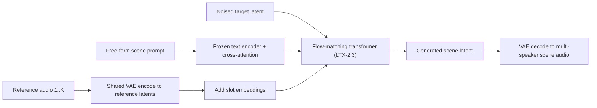
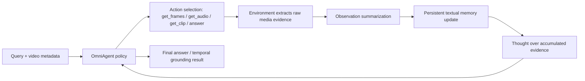
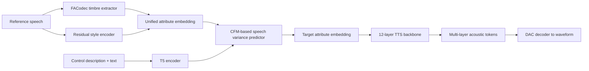
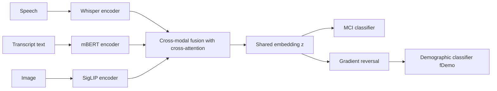

# 语音 / 音频 / 音乐论文速递
## 2026-06-18

> 实际对应 arXiv 更新日：**2026-06-18**  
> 检索范围：`cs.SD + eess.AS`  
> 只放按 ML 顶会审稿口径看，最值得多数读者花时间看的 **5 篇**

## 📋 总览

- 共收录 **5 篇** 相关论文
- 语音公平性 / 医疗语音：**1 篇**
- TTS / 可控语音生成：**2 篇**
- 多说话人音频生成：**1 篇**
- 音视频理解 / omni-agent：**1 篇**

今天这批里最值得优先看的主线，不是“模型又更大了”，而是三条更硬的技术问题。`Reliable Neural-Codec TTS by ASR Self-Verification and Distillation` 直接盯住开放 codec-TTS 最烦人的灾难性失败，用最土但有效的 best-of-N + ASR round-trip 把问题压到接近 0，而且证明了 offline DPO 这次真没带来额外收益；`ScenA` 则不是再做一个结构化 dialog TTS，而是把多说话人场景生成塞回通用 text-to-audio foundation model，用高噪声训练去堵住 reference shortcut 这个很容易被忽略的漏洞；`OmniAgent` 虽然更偏 CV/omni-agent，但它把 audio 真的当成行动信号而不是附赠模态，用原生 Observation-Thought-Action 循环把长视频推理的复杂度从“视频多长”改成“问题多难”，这对做音视频联合理解的人有现实启发。

剩下两篇也值得看，但目的更窄。`FineCombo-TTS` 是一篇典型的 controllable TTS 实用论文，亮点在于把 reference speech 和 text description 真正放到同一控制空间里，而不是“参考音色 + 文本改风格”的伪协同；`FMD` 则把医疗语音里很少被认真解决的 demographic shortcut 问题拆开做，虽然不是语音大模型主线，但方法和结果都足够扎实。

## 精选入选规则

- **新意（0-3）**：是不是提出了新的表示、接口、训练组织方式，或者把旧问题拆得更对
- **影响力（0-3）**：是不是贴近 TTS、音频生成、语音前端、音视频联合理解、医疗语音这些主线
- **证据强度（0-2）**：有没有像样的 baseline、消融和关键数值
- **受众匹配度（0-2）**：对语音大模型 / 语音生成 / 音频场景生成 / 音视频理解研究者有没有直接启发

分数校准：

- **6**：可读，但更像局部补丁或特定场景论文
- **7**：信息量够，值得过一遍
- **8+**：建议优先精读

## 总览表

| 方向 | 序号 | 论文 | 评分 | 关键词 |
|---|---:|---|---:|---|
| TTS / 鲁棒生成 | 1 | Reliable Neural-Codec Text-to-Speech by ASR Self-Verification and Distillation | 8.8/10 | codec-TTS, catastrophic failure, ASR verification, distillation, DPO negative result |
| 多说话人音频生成 | 2 | Reference-Driven Multi-Speaker Audio Scene Generation from In-the-Wild Priors | 8.5/10 | ScenA, flow matching, reference shortcut, scene audio, speaker binding |
| 音视频理解 / omni-agent | 3 | Native Active Perception as Reasoning for Omni-Modal Understanding | 8.3/10 | OmniAgent, OTA, POMDP, TAURA, long video, audio-visual reasoning |
| 可控 TTS | 4 | FineCombo-TTS | 7.8/10 | controllable TTS, reference speech, text descriptions, CFM, FineEdit |
| 医疗语音 / 公平性 | 5 | Fair Cognitive Impairment Detection Through Unlearning | 7.6/10 | MCI detection, multimodal fusion, unlearning, bias mitigation, transfer |

## 🔊 TTS / 音频生成鲁棒性

### [1] Reliable Neural-Codec Text-to-Speech by ASR Self-Verification and Distillation: Near-Zero Catastrophic Failures Across Models and Codecs

- **评分**：8.8/10
- **作者/机构**：Ali Asaria, Tony Salomone, Deep Gandhi / Transformer Lab
- **论文链接**：https://arxiv.org/abs/2606.18323
- **PDF**：https://arxiv.org/pdf/2606.18323.pdf
- **代码链接**：暂无论文官方仓库；文中实验覆盖的开源系统包括 Orpheus `https://github.com/canopyai/Orpheus-TTS`、CSM `https://github.com/SesameAILabs/csm`
- **Demo 链接**：暂无

#### 📌 简介
这篇盯住的是开放式 neural-codec TTS 的一个真问题：平时样例听着很好，但一到脏 prompt、长 prompt、数字日期、稀有词，就会突然静音、提前停、或者重复塌缩。作者没有再造新 backbone，而是提出一套更务实的修法：测试时用 `best-of-N` 采样加 `Whisper` ASR 自验证筛掉坏样本，再把这套“验证后留下的好行为”蒸馏回单次解码模型里。

#### ☠️ 毒舌点评
这篇最值钱的地方不是方法炫，而是它终于正面承认开放 codec-TTS 的 reliability 问题严重到不能靠 demo 掩盖。更难得的是它还给了一个少见的负结果：`offline DPO/IPO` 并没有打赢最朴素的 supervised distillation。做 TTS 后训练、模型鲁棒性、偏好优化的人都该读，尤其是那些还在默认“DPO 一定更强”的。

#### 🔧 技术方案
- **模型解决的问题**：开放 autoregressive codec-TTS 经常在少量样本上出现灾难性失败，表现为静音、早停、内容崩塌、重复或幻觉文本；这些不是小噪点，而是直接让系统不可部署。
- **模型架构**：
  - **输入**：文本 prompt。
  - **输出**：由 neural codec 解码得到的语音波形。
  - **主干**：论文不发明新 TTS 主干，而是围绕现有 AR codec-LM 做外层验证和蒸馏。
  - **关键模块**：
    - `best-of-N ASR self-verification`：每个 prompt 采样 N 个候选，用 Whisper round-trip 选最低 WER 且非 dropout 的候选。
    - `catastrophic failure metric`：把 dropout 和内容失败合在一个 format-robust 指标里，而不是继续拿普通 WER 自欺欺人。
    - `distillation / preference optimization`：把通过验证的样本蒸馏回模型，并与 DPO、IPO、FTPO 做对比。
    - 覆盖四个开放模型、三种 codec：`Llasa-1B / Llasa-3B / Orpheus-3B / CSM-1B`，`XCodec2 / SNAC / Mimi`。
- **信号流**：

- **关键设计 / 核心创新**：
  - 不是继续调 reward model，而是先用一个够粗暴也够稳定的 `ASR self-verification` 把灾难性失败直接打掉。
  - 把“可部署的数值”明确区分为 `best-of-N` 上界和蒸馏后的 `single-shot` 部署值，这一点非常干净。
  - 明确展示 `offline DPO/IPO` 不如 `SFT on verified samples`，这比又写一篇 preference learning 正例更有信息量。
- **训练 / 推理策略**：
  - 主模型以 `Llasa-1B` 为核心，基于 released checkpoint 做 `LoRA` 适配；泛化实验再加 `Orpheus-3B`、`CSM-1B`、`Llasa-3B`。
  - 训练时用验证选出的最佳样本做 `SFT` 蒸馏；并与 `DPO / IPO / FTPO` 对照。
  - 推理时 `best-of-N` 先作为 oracle-style 选择器；部署目标是蒸馏后的单次解码。
  - 论文没给 tokens/s 或 RTF，但明确区分了 `best-of-N` 的额外推理成本和 distillation 后的“零额外推理代价”。

#### 📊 实验结果
- 测试集与指标：
  - `LibriSpeech test-clean` 120 条 transcript × 3 次采样。
  - 自建 hard prompt set。
  - 关键指标是 `catastrophic-failure rate`，不是普通 WER。
- 跨模型/跨 codec 泛化：
  - `Llasa-1B (XCodec2)`：base `0.058`，`best-of-2` 直接到 `0.000`。
  - `Orpheus-3B (SNAC)`：base `0.008`，`best-of-2` 到 `0.000`。
  - `CSM-1B (Mimi)`：base `0.017`，`best-of-2` 到 `0.000`。
  - `Llasa-3B (XCodec2)`：base `0.108`，`best-of-2` 降到 `0.042`，`best-of-3` 到 `0.033`，是唯一没彻底清零的。
- 主要 hard set 结果：
  - `best-of-N` 曲线：`N=1` 时 `0.269`，`N=2` 时 `0.154`，`N=3` 时 `0.038`，`N=4` 起 `0.000`。
  - 蒸馏前后单次解码：`0.199 -> 0.096 (SFT)` 或 `0.083 (DPO)`，相当于回收约 `52%~58%` 的 failure mass。
  - 在 `LibriSpeech` 易样本上，蒸馏基本没有 headroom：`0.058 -> 0.058`。
- 负结果：
  - offline hard-set sweep 中，`DPO 0.292`、`FTPO 0.292`、`IPO 0.319` 都没赢过 `SFT-on-best 0.264`。
  - online iterative 版本虽然做到 `0.013 (DPO)` / `0.026 (SFT)`，但作者明确说统计量还不够，不能硬吹。

#### 💡 为什么值得看
如果你现在做的是开放 TTS，尤其是 codec token 路线，这篇最值得看的不是“ASR round-trip”这四个字，而是它对训练后修复链路的优先级排序：先把 failure definition 定义清楚，再用最稳的验证器找 deployable fix，最后才谈 preference optimization。很多团队现在的顺序是反的，所以会浪费大量时间。

## 🎭 多说话人音频场景生成

### [2] Reference-Driven Multi-Speaker Audio Scene Generation from In-the-Wild Priors

- **评分**：8.5/10
- **作者/机构**：Michael Finkelson, Daniel Segal, Eitan Richardson, Shahar Armon, Nani Goldring, Poriya Panet, Nir Zabari, Benjamin Brazowski, Or Patashnik, Yoav HaCohen / Lightricks, Tel Aviv University
- **论文链接**：https://arxiv.org/abs/2606.19325
- **PDF**：https://arxiv.org/pdf/2606.19325.pdf
- **代码链接**：暂无官方代码仓库
- **Demo 链接**：https://finmickey.github.io/scena/

#### 📌 简介
这篇想做的不是多说话人 TTS，而是更接近“多说话人音频场景生成”：给几段 reference voice，再给一段自由文本，模型直接合成带重叠说话、笑声、呼吸、背景噪声和房间声学的整段对话场景。核心方法 `ScenA` 基于 flow-matching text-to-audio foundation model，把多个 reference latent 直接拼进 token 序列里，再靠文本里的 `reference 1 / reference 2` 去绑定谁在什么时候说话。

#### ☠️ 毒舌点评
这篇最大的价值不是“多说话人”这个题目本身，而是它抓住了 reference-conditioned flow matching 里一个很隐蔽但致命的问题：`reference shortcut`。很多人会以为模型学会了 speaker binding，实际上它只是拿 noisy target 和 reference 做相似度配对，训练 loss 看着很漂亮，推理一旦从纯噪声开始就全崩。这篇把这个坑说透了，属于真踩过工程雷的人写出来的论文。

#### 🔧 技术方案
- **模型解决的问题**：现有 multi-speaker dialog TTS 大多依赖 per-turn tag、多流 transcript、speaker embedding 或结构化剧本，结果是只能生成“干净轮流说话”的语音，很难自然覆盖重叠语音、环境声和真实对话场景。
- **模型架构**：
  - **输入**：一个 free-form scene description 文本 + 至多 `Kmax=3` 个单说话人参考音频。
  - **输出**：整段多说话人音频场景，包含对话内容、说话人归属、重叠、环境声和非言语事件。
  - **主干**：基于 `LTX-2.3` 的 dual-stream audio-video diffusion / flow-matching backbone，这里使用 audio-only 路线。
  - **关键模块**：
    - `reference latent concatenation`：reference 和 target 共用同一个 VAE 编码。
    - `slot embedding`：为每个 reference slot 加轻量 identity-aware positional encoding。
    - `high-noise-biased timestep distribution`：`Beta+Uniform` 混合分布，主动打断 reference shortcut。
    - `adversarial reference injection` 与 `slot-shuffle curriculum`：加强 reference-to-text 绑定。
- **信号流**：

- **关键设计 / 核心创新**：
  - 真正的新意不是“拼 reference”，而是识别出 `reference shortcut` 这个训练时存在、推理时消失的伪解法。
  - 用高噪声偏置 timestep 去强制模型在训练阶段依赖文本绑定，而不是依赖 target 与 reference 的相似度。
  - 不依赖身份编码器、turn embedding、structured supervision，只用自然语言 prompt 决定 reference 说哪句。
- **训练 / 推理策略**：
  - 训练集是作者自己构建的 multi-reference dataset：每个样本包含 target clip、K 个 reference clip 和 scene caption。
  - backbone 复用 `LTX-2` 的 VAE、text encoder、prompt adapter；fine-tune 时支持最多 3 个 reference。
  - 训练默认使用 `adversarial reference injection + slot-shuffle curriculum`，前 `10,000` steps 不 shuffle，之后再打乱。
  - 推理直接从噪声生成整段场景，不再后处理拼接单句或单说话人段。

#### 📊 实验结果
- 数据集与指标：
  - `CoVoMix2-Dialogue-20s`：从公开 CoVoMix2 dialog test 中筛出 `291` 个 20 秒内样本。
  - `CoVoMix2-Dialogue-WildRef`：50 个 dialog，30 条 in-the-wild English reference clip。
  - 指标包括 `cpWER`、`cpSIM`、`ACC`、`WER`、`SIM-O`、`UTMOS`、`SQUIM`。
- `CoVoMix2-Dialogue-20s` 对比：
  - `ScenA`：`cpWER 0.145`、`cpSIM 0.567`、`ACC 0.866`、`WER 0.020`、`SIM-O 0.451`、`UTMOS 3.44`、`SQUIM 4.32`
  - `MOSS-TTSD`：`0.232 / 0.547 / 0.855 / 0.109 / 0.443 / 3.76 / 4.28`
  - `ZipVoice-Dialog`：`0.176 / 0.538 / 0.847 / 0.032 / 0.446 / 3.57 / 4.34`
  - 结论是 speaker binding 三项最强，UTMOS 略输，但 SQUIM 基本持平甚至更高。
- `WildRef` 鲁棒性：
  - `ScenA`：`cpSIM 0.424`、`WER 0.022`、`SIM-O 0.348`、`SQUIM 4.28`
  - 所有 baseline 的 `cpSIM` 基本都跌到 `0.40` 以下，`ScenA` 还能稳在 `0.42+`。
- 人评：
  - A/B 偏好对 `ZipVoice-Dialog` 胜率 `84.6%`，对 `Dia` `74.2%`，对 `VibeVoice-7B` `68.3%`，对 `MOSS-TTSD` `59.8%`。
- 消融：
  - timestep 从标准 `LogitNormal` 往高噪声挪，`cpWER / cpSIM / ACC` 单调变好。
  - `no positional` 版本 `ACC` 掉到 `0.513`，几乎随机。
  - 去掉 adversarial reference，`cpSIM` 约降 `0.10`，`SIM-O` 约降 `0.08`。

#### 💡 为什么值得看
这篇最值得精读的点，是它告诉你“reference-conditioned generation 为什么会学歪”。如果你在做 multi-speaker TTS、voice-conditioned audio generation、甚至 image/video reference generation，这个 shortcut 诊断很可能都能迁移，价值不止这一个任务。

## 🎬 音视频理解 / Omni-Agent

### [3] Native Active Perception as Reasoning for Omni-Modal Understanding

- **评分**：8.3/10
- **作者/机构**：Zhenghao Xing, Ruiyang Xu, Yuxuan Wang, Jinzheng He, Ziyang Ma, Qize Yang, Yunfei Chu, Jin Xu, Junyang Lin, Chi-Wing Fu, Pheng-Ann Heng / The Chinese University of Hong Kong, Shanghai Jiao Tong University, Qwen Team Alibaba Group, Nanyang Technological University
- **论文链接**：https://arxiv.org/abs/2606.19341
- **PDF**：https://arxiv.org/pdf/2606.19341.pdf
- **代码链接**：**代码已开源** https://github.com/harryhsing/OmniAgent
- **Demo 链接**：SFT 权重 https://huggingface.co/harryhsing/OmniAgent-SFT-7B ，RL 权重 https://huggingface.co/harryhsing/OmniAgent-RL-7B

#### 📌 简介
这篇做的是长视频 omni-modal reasoning，但不是传统“把更多帧塞给模型”。`OmniAgent` 把理解过程改写成一个原生的 `Observation-Thought-Action` 循环：模型按需发起 `get_frames / get_audio / get_clip / answer` 行动，把瞬时视听证据蒸馏到持久文本记忆里，从而把推理复杂度从“视频多长”改成“问题有多难”。

#### ☠️ 毒舌点评
这篇标题很大，按理说很容易落成“agent 套壳”论文，但它比大多数 agentic video 论文更像在认真做系统。尤其是它没有把音频当装饰，而是把 `get_audio` 变成明确动作，并把 entropy-based turn credit 讲清楚了。缺点也明显：这仍然是强工程系统论文，不是一个通用理论范式；但对做 audio-visual reasoning 的人，信息量是够的。

#### 🔧 技术方案
- **模型解决的问题**：长视频理解如果靠被动看全片，计算成本会随时长暴涨，而且 query 越难，模型越容易被无关帧淹没。尤其是带音频的任务里，很多关键证据其实应该先听再看。
- **模型架构**：
  - **输入**：用户 query + 视频 metadata（duration、fps、has_audio）+ 按需抽取的 frame/audio/clip。
  - **输出**：多步 OTA 轨迹以及最终答案。
  - **主干**：基于 `Qwen2.5-Omni-7B` 的原生 omni model，外层环境只做原始媒体提取。
  - **关键模块**：
    - `Observation-Thought-Action (OTA)` 循环。
    - `Persistent Textual Memory`：把高维暂态感知压成可长期维护的文本记忆。
    - `Agentic SFT`：best-of-N 轨迹合成 + 双阶段质量控制。
    - `TAURA`：用 turn-level entropy 做 credit assignment，修正 vanilla GRPO 的 advantage homogenization。
- **信号流**：

- **关键设计 / 核心创新**：
  - 用 POMDP + OTA 循环把 perception 变成 reasoning 过程的一部分，而不是先抽帧再 reasoning。
  - `TAURA` 不再把整条 trajectory 的 advantage 平摊给所有 token，而是按 turn entropy 放大关键“岔路口”步骤。
  - 真实把 audio 做成行动空间的一部分，这比“把音频 token 拼进去”更有效。
- **训练 / 推理策略**：
  - Agentic SFT 使用 `58K trajectories`，训 `2 epochs`，`lr=1e-5`，`batch size=64`，`AdamW`，跑在 `16× A100`。
  - RL 阶段只挑 best-of-N 失败样本继续训练，`64× A100`，global batch size `256`，`lr=1e-6`。
  - 推理阶段有显式 turn budget `K`，但模型平均不会把预算跑满，说明它确实在“够了就答”。
  - 附录里明确了 `get_audio` 输出 16kHz PCM mono WAV、`get_clip` 用 `libx264` + `CRF 20`，属于落地细节给得比较实。

#### 📊 实验结果
- 长视频理解主表：
  - `LVBench`：`OmniAgent 50.5`，高于 `Qwen2.5-Omni-7B 43.0`，也高于 `Qwen2.5-VL-72B 47.3`。
  - `MLVU`：`71.1` vs `Qwen2.5-Omni 65.2`。
  - `VideoMME Long`：`59.6` vs baseline `54.8`。
  - `VideoMME Overall`：`67.8`，比 baseline 高 `+3.0`。
- 音视频任务：
  - `DailyOmni`：`64.8` vs `60.1`，提升 `+4.7`。
  - `OmniVideoBench`：`37.1` vs `29.3`，提升 `+7.8`。
  - `WorldSense`：`47.2` vs `45.4`。
- 时序定位：
  - `LongVALE IoU`：`39.1` vs `Qwen2.5-Omni 5.7`。
  - `VUE-TR Vision+Audio`：`36.5` vs `3.5`。
  - `VUE-TR Vision`：`46.1` vs `8.0`。
- 组件消融：
  - `Agentic SFT` 把 `LVBench` 从 `43.0` 拉到 `48.7`。
  - `+ TAURA` 进一步到 `50.5`；`Vanilla GRPO` 只有 `49.8`。
  - `DailyOmni` 上 `TAURA 64.8` 明显高于 `Vanilla GRPO 62.2`。
- test-time scaling：
  - `VideoMME-Long` 准确率随最大 turn limit `K` 从 6 增到 52 时，从 `53.4%` 升到 `59.6%`。
  - 但平均实际 turn 只饱和在约 `11.7`，说明它不是机械刷步数。
- 运行效率：
  - `LVBench` 100 样本 wall-clock：`OmniAgent 66.8s / acc 51.0`，`Qwen2.5-VL-72B 75.1s / 47.0`。
  - `OmniAgent` 平均采样 `201.6` 帧，远少于 `72B` 模型的 `768` 帧。

#### 💡 为什么值得看
如果你做的是 audio-visual LLM 或长视频理解，这篇最值得学的不是 agent 外壳，而是“如何让音频变成决策信号”。它证明了真正的 omni-modal reasoning 不是把模态全吃进去，而是知道什么时候该先听、什么时候该再看。

## 🗣️ 可控 TTS / 条件编辑

### [4] FineCombo-TTS: Collaborative and Precise Controllable Speech Synthesis Using Text Descriptions and Reference Speech

- **评分**：7.8/10
- **作者/机构**：Shuoyi Zhou, Yixuan Zhou, Peiji Yang, Yifan Hu, Yicheng Zhong, Zhisheng Wang, Zhiyong Wu / Tsinghua University Shenzhen International Graduate School, Inner Mongolia University, Tencent
- **论文链接**：https://arxiv.org/abs/2606.19209
- **PDF**：https://arxiv.org/pdf/2606.19209.pdf
- **代码链接**：暂无完整论文仓库；依赖公开组件包括 DAC `https://github.com/descriptinc/descript-audio-codec`、FACodec `https://github.com/lifeiteng/naturalspeech3_facodec`
- **Demo 链接**：https://thuhcsi.github.io/interspeech2026-FineCombo-TTS

#### 📌 简介
这篇要解决的是 controllable TTS 里一个老大难：reference speech 能保音色，但文字描述更适合改情绪和风格，现有联合控制方法通常只是“参考音频控 timbre，文本控全局 style”，协同很松。`FineCombo-TTS` 试图把两者拉进统一 acoustic attribute space，再用 `CFM-based Speech Variance Predictor` 学 reference 到 target 的细粒度属性变化。

#### ☠️ 毒舌点评
这篇不是革命性工作，但比很多“controllable TTS”论文更踏实。它至少知道数据是关键，于是专门做了 `FineEdit` 这种 source-description-target 三元组数据，而不是继续拿绝对属性 caption 强凑控制。短板是它还主要验证 prosody / emotion / timbre 三种属性，控制维度和泛化边界都没完全拉开。

#### 🔧 技术方案
- **模型解决的问题**：reference-speech 控制和 text-description 控制长期各做各的，前者精细但不灵活，后者自由但不够准；两者简单拼接又会互相覆盖，尤其在 timbre、prosody、emotion 强耦合时很难稳定控制。
- **模型架构**：
  - **输入**：文本内容、reference speech、控制描述文本（例如“加快语速、提高音高、变成开心情绪、改 timbre”）。
  - **输出**：保持 reference 基线又满足文本控制的目标语音。
  - **主干**：`Speech Attributes Extractor + CFM-based Speech Variance Predictor + TTS backbone`。
  - **关键模块**：
    - `Timbre Extractor`：用预训练 `FACodec` 提 speaker-related timbre embedding。
    - `Residual Style Encoder`：补局部和全局 style 残差信息。
    - `Unified Attribute Embedding`：`Et` 与 `Es` 拼接形成 `Ea`。
    - `T5 Encoder + Cross-Attention`：编码 description 文本。
    - `12-layer Transformer decoder` + `1D UNet CFM predictor`。
    - 最终使用 `DAC` 重建声学 token。
- **信号流**：

- **关键设计 / 核心创新**：
  - 不做显式属性 disentanglement，而是在 unified attribute space 里学 reference-to-target 变换。
  - `FineEdit` 把训练样本写成 `<source speech, control description, target speech>`，让模型学相对变化而不是绝对标签。
  - `multi-CFG` 同时对 text 和 description 做 guidance，专门平衡 intelligibility 与 controllability。
- **训练 / 推理策略**：
  - 两阶段训练：
    - Stage 1：先训统一属性表示和 TTS 生成。
    - Stage 2：单独训 `Speech Variance Predictor` 做细粒度控制。
  - 训练数据：
    - Stage 1 预训练 `MLS 45k hours + LibriTTS-R 585h`，再在 `EmoVoice-DB 45h + TextrolSpeech 330h` 上微调。
    - Stage 2 用 `236K` description-only pair，再加每个 FineEdit 子集约 `600K` pair。
    - `FineEdit` 三个子集：`Prosody 634,956`、`Emotion 80,000,000`、`Timbre 16,392,828`。
  - 推理时 `α=β=2` 的 CFG；训练中以 `0.1` 概率 mask text 或 description。
  - 论文在 `8× A100` 上跑，Stage 1 `250K + 70K` steps，Stage 2 `140K` steps。

#### 📊 实验结果
- baseline：作者重实现了 `VoxInstruct-Joint`，并在相同数据、相同训练策略下公平对比。
- prosody control：
  - `FineCombo-TTS`：`MOS-S 4.04±0.34`，`MOS-I 4.05±0.31`，`WER 12.87`，`SECS 70.20`
  - `VoxInstruct-Joint`：`2.00±0.38 / 3.26±0.37 / 11.12 / 56.79`
  - 受控准确率：speed `98.00` vs `91.35`，pitch `93.33` vs `63.81`
  - 非目标属性波动也更低：speed `14.62` vs `19.00`，pitch `6.71` vs `42.81`
- emotion control：
  - `FineCombo-TTS`：`MOS-S 3.34±0.36`，`MOS-I 3.83±0.18`，`WER 11.22`，`SECS 66.56`，`Emotion-A 85.00`
  - `VoxInstruct-Joint`：`2.64±0.24 / 2.96±0.34 / 20.18 / 63.99 / 47.00`
- timbre control：
  - `FineCombo-TTS`：`MOS-P 3.66±0.32`，`MOS-I 3.75±0.27`，`WER 18.59`，`FPC 52.67`，`Emotion-S 55.38`
  - baseline：`3.04±0.36 / 3.32±0.32 / 19.24 / 47.46 / 52.15`
- ablation：
  - 去掉 description+text CFG：`WER 14.17`，`Emotion-A 76`
  - 只去掉 description CFG：`WER 9.06`，`Emotion-A 81`
  - proposed：`WER 8.82`，`Emotion-A 86`
  - 去掉 residual style encoder：`MCD 11.08`，`SECS 90.00`；完整模型 `10.83 / 90.20`

#### 💡 为什么值得看
如果你关心 controllable TTS，这篇真正有用的地方是它把“控制”从 prompt engineering 拉回了数据和中间表示。不是所有任务都需要它这套 CFM，但 `FineEdit` 这种相对控制三元组数据构造思路很值得借。

## 🧠 医疗语音 / 公平性

### [5] Fair Cognitive Impairment Detection Through Unlearning

- **评分**：7.6/10
- **作者/机构**：William Nguyen, Jiali Cheng, Hadi Amiri / University of Massachusetts Lowell
- **论文链接**：https://arxiv.org/abs/2606.18571
- **PDF**：https://arxiv.org/pdf/2606.18571.pdf
- **代码链接**：**代码已开源** https://github.com/CLU-UML/Fair-MCI-Detection
- **Demo 链接**：暂无

#### 📌 简介
这篇聚焦的是 speech-based MCI detection 里的 demographic shortcut 问题。作者提出 `FMD`，把多模态 `speech + text + image` 用 cross-attention 融合，再加一个 demographic classifier 配合 gradient reversal 做 unlearning，目标不是提高某个单点 F1，而是在保证诊断性能的同时，把 sex 和 language 两类 subgroup gap 压下去。

#### ☠️ 毒舌点评
这篇不属于语音大模型热点，但论文本身并不水。很多“公平性”工作只会堆概念，这篇至少把总体性能、worst-group F1、gap、transfer 和 bias probing 都做了。缺点是任务比较垂直，创新性也更多体现在组合得当而不是提出新范式；但如果你做医疗语音或 bias mitigation，这篇值得读。

#### 🔧 技术方案
- **模型解决的问题**：MCI 检测模型容易把 sex、language、accent 这类 demographic cue 当成 shortcut，从而在小数据、分布不均衡场景里造成 subgroup disparity 和差泛化。
- **模型架构**：
  - **输入**：`speech`、由 speech 转写得到的 `text`，以及 `image`（TAUKADIAL 有图像，PREPARE 无图像）。
  - **输出**：MCI 分类结果，以及仅训练时使用的人口属性预测分支。
  - **主干**：`Whisper encoder + multilingual BERT + SigLIP` 编码后，通过 cross-attention 融合为 shared embedding。
  - **关键模块**：
    - `Cross-Modal Fusion (CM)`：用 text 作为查询桥接模态交互。
    - `Shared Representation z`：供主分类器和 demographic classifier 共同消费。
    - `fDemo + Gradient Reversal`：迫使共享表示去掉 task-irrelevant demographic information。
- **信号流**：

- **关键设计 / 核心创新**：
  - 相比 late concatenation，它用 cross-attention 明确建模模态交互。
  - 相比只做 debiasing 后处理，它把 unlearning 放进主训练链，直接干预 shared embedding。
  - 评价指标不只看 overall F1，还把 `worst-group F1`、`gap` 和 cross-dataset transfer 纳入主结果。
- **训练 / 推理策略**：
  - `10-fold stratified cross-validation`。
  - speech encoder 用 `Whisper`，text encoder 用 `multilingual BERT`，image encoder 用 `SigLIP`。
  - demographic 分组按 `sex` 和 `language (En / Non-En)`。
  - 推理时只走 MCI classifier；demographic classifier 只在训练期用于 adversarial unlearning。

#### 📊 实验结果
- 数据集：
  - `TAUKADIAL`：speech + text + image。
  - `PREPARE`：speech + text。
- baseline：
  - `Whisper`、`AST`、`XLSR-53`、`XLS-R`、`CogniVoice`、`DFR`、`ATG`。
- 主结果：
  - `TAUKADIAL` 上 `FMD Lang`：`F1Avg 92.6`，`WG 90.9`，`GapAvg 2.5`
  - 最强 baseline `CogniVoice`：`84.1 / 81.3 / 2.9`
  - `FMD Sex` 还把 sex-gap 压到 `0.6`，而 `CogniVoice` 是 `5.5`
  - `PREPARE` 上 `FMD Sex`：`F1Avg 60.1`，优于 `Whisper 59.1` 和 `CogniVoice 49.6`
  - `PREPARE` 上 `FMD Lang`：`WG 57.4`，优于 `Whisper 54.7`
- 消融：
  - 去掉 `CM`，在 TAUKADIAL sex 分组上 `F1Avg 92.1 -> 90.7`，`GapAvg 4.3 -> 8.3`
  - 去掉 `UL`，`F1Avg 92.1 -> 89.2`，`GapAvg 4.3 -> 7.1`
  - language 分组也类似：完整模型 `92.6 / 90.9 / 2.5`，`-CM` 变 `91.5 / 86.0 / 7.7`
- transfer：
  - `TAUKADIAL -> PREPARE`：`FMD Sex 42.3`，比 `CogniVoice 38.7` 高 `+3.6`
  - `PREPARE -> TAUKADIAL`：`FMD Lang 45.5`，比 `CogniVoice 39.8` 高 `+5.7`
- bias probing：
  - sex probe：`CogniVoice 71.2`，`FMD 61.7`
  - language probe：`68.5 -> 62.3`
  - 还没到随机猜测 `50%`，说明 demographic leakage 仍未彻底消失。

#### 💡 为什么值得看
这篇最值得看的不是“做医疗语音要公平”这句正确废话，而是它把 fairness 和 transfer 绑在一起做。很多 bias mitigation 方法会把 overall performance 一起做没，这篇至少证明了在这个任务上可以同时赢一点性能、赢不少 gap，还顺带提升跨数据集迁移。

## 最后结论

今天最值得优先看的顺序，我会给这三个：

1. `Reliable Neural-Codec Text-to-Speech by ASR Self-Verification and Distillation`
原因：它直指开放 codec-TTS 的真实部署痛点，而且给了少见的负结果证据，能直接影响你怎么设计后训练链路。

2. `Reference-Driven Multi-Speaker Audio Scene Generation from In-the-Wild Priors`
原因：`reference shortcut` 这个诊断非常值钱，既能解释训练成功推理翻车，也很可能迁移到别的 reference-conditioned generation 任务。

3. `Native Active Perception as Reasoning for Omni-Modal Understanding`
原因：虽然更偏 omni-agent，但它把 audio 当成决策动作而不是被动模态，这对做音视频联合理解的人很有借鉴意义。

如果你的主线是 controllable TTS，再额外看 `FineCombo-TTS`；如果你在做医疗语音或语音公平性，再补 `FMD`。这两篇都不是今天最炸的，但都属于“不会浪费你时间”的那类论文。
