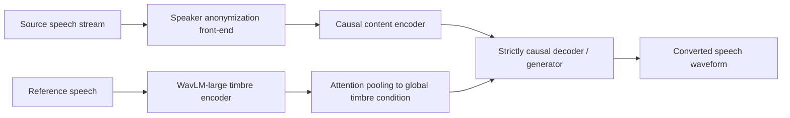
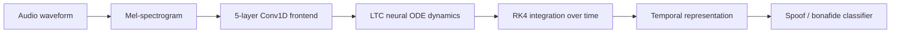
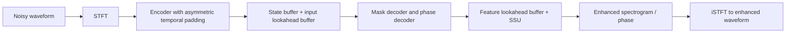
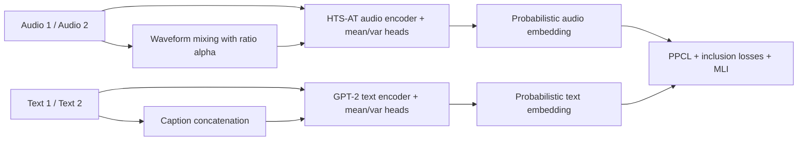
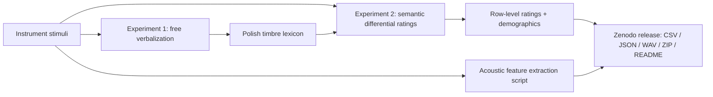

# 语音 / 音频 / 音乐论文速递
## 2026-06-19

> 实际对应 arXiv 更新日：**2026-06-19**  
> 检索范围：`cs.SD + eess.AS`  
> 只放按 ML 顶会审稿口径看，最值得多数读者花时间看的 **5 篇**

## 📋 总览

- 共收录 **5 篇** 相关论文
- 音频-语言预训练 / 检索：**1 篇**
- 语音安全 / deepfake 检测：**1 篇**
- 音色转换 / 流式 VC：**1 篇**
- 语音前端 / 流式增强：**1 篇**
- 音乐感知数据集：**1 篇**

今天这批里最值得优先看的，不是“谁又堆了更大的模型”，而是几篇把老问题掰开做实的工作。`Zero-VC` 直接盯住流式 voice conversion 里最卡人的 latency 问题，用 speaker anonymization 把 zero-lookahead 做到单帧 20 ms，而且实验上不是只赢一点点；`FlowFake` 则把 audio deepfake detection 从“大模型堆特征”拉回结构偏置，用只有 34K 参数的 liquid ODE 去拼跨数据集泛化，这条路线至少比继续迷信 SSL 大模型更有辨识度；`LaCo-SENet` 是很典型的强工程论文，核心价值在于把 streaming SE 的 latency 从二选一改成可配置旋钮，并且真的处理了 per-layer lookahead 带来的 state corruption。

另外两篇更偏“补体系空缺”。`MixProLAP` 把 probabilistic contrastive learning 从图文搬到音文，并且抓住 audio 里 masking 不合理这一点，用 mixing 来建模 uncertainty，适合做 audio-language retrieval 和 probabilistic embedding 的人；`PolSeT` 虽然不是模型论文，但它把 Polish timbre semantics 的原始实验数据、刺激音频、特征和脚本一次性放出来，对做跨文化 MIR / timbre perception 的人比又一篇小模型 paper 更实用。

## 精选入选规则

- **新意（0-3）**：是不是提出了新的表示、接口、训练组织方式，或者把旧问题拆得更对
- **影响力（0-3）**：是不是贴近语音生成、语音前端、音色转换、音频-语言、多模态安全这些主线
- **证据强度（0-2）**：有没有像样的 baseline、消融和关键数值
- **受众匹配度（0-2）**：对语音大模型 / 语音前端 / 音乐信息检索 / 语音安全研究者有没有直接启发

分数校准：

- **6**：可读，但更像局部补丁或数据补档
- **7**：信息量够，值得过一遍
- **8+**：建议优先精读

## 总览表

| 方向 | 序号 | 论文 | 评分 | 关键词 |
|---|---:|---|---:|---|
| 音色转换 / 流式语音生成 | 1 | Zero-VC | 8.8/10 | streaming VC, speaker anonymization, zero-lookahead, WavLM, HiFi-GAN |
| 语音安全 / deepfake 检测 | 2 | FlowFake | 8.4/10 | liquid network, LTC, audio deepfake, cross-dataset, multilingual |
| 语音前端 / 流式增强 | 3 | LaCo-SENet | 8.2/10 | configurable latency, asymmetric padding, dual-buffer streaming, VoiceBank+DEMAND |
| 音频-语言预训练 | 4 | MixProLAP | 7.8/10 | probabilistic CLAP, uncertainty, mixing-based inclusion, AudioCaps, ClothoV2 |
| 音乐感知数据集 / MIR | 5 | PolSeT | 7.2/10 | timbre semantics, Polish lexicon, psychoacoustics, Zenodo, MIR dataset |

## 🎙️ 音色转换 / 流式语音生成

### [1] Zero-VC: Zero-Lookahead Streaming Voice Conversion via Speaker Anonymization

- **评分**：8.8/10
- **作者/机构**：Yudong Li, Zihao Fang, Junwen Qiu, Ruihai Jing, Ruixiang Hang, Yingda Shen, Zhizheng Wu / The Chinese University of Hong Kong, Shenzhen；Shenzhen Loop Area Institute；Shenzhen Transsion Holdings；Amphion Technology
- **论文链接**：https://arxiv.org/abs/2606.20218
- **PDF**：https://arxiv.org/pdf/2606.20218.pdf
- **代码链接**：暂无论文官方仓库；使用的 SA 模块来自 https://github.com/DigitalPhonetics/speaker-anonymization
- **Demo 链接**：https://amphionteam.github.io/Zero-VC-demo/

#### 📌 简介
这篇做的是严格流式、严格 zero-lookahead 的 zero-shot voice conversion。作者的核心判断很准：很多流式 VC 之所以离不开 lookahead，不是因为生成器天生需要未来帧，而是因为上游 disentanglement 做得太差，必须靠 future context 补 prosody。`Zero-VC` 的办法是先用 speaker anonymization 把源说话人 timbre 打散，但尽量保住 prosody 和 phone timing，再用严格因果的生成器直接做转换。

#### ☠️ 毒舌点评
这篇不是“又一个 streaming VC baseline”。它真正把 latency 当第一约束来设计，而不是训练完再去说“我们也能实时”。更关键的是，作者给了一个很有说服力的反证：加了 SA 之后，模型对 future context 的依赖几乎消失；没加 SA 的版本却要 40 到 60 ms lookahead 才稳。做流式 VC、实时语音生成的人值得优先看。

#### 🔧 技术方案
- **模型解决的问题**：现有 streaming zero-shot VC 常用 information bottleneck 或 speaker perturbation 做内容-音色分离，但前者容易损失 prosody，后者又常常 timbre leakage 严重，最后都靠 future frames 或显式 `f0` buffering 把质量补回来，端到端 latency 很难压下去。
- **模型架构**：
  - **输入**：源语音流 + 目标说话人参考语音。
  - **输出**：目标说话人音色下、保留源语义与 prosody 的转换语音。
  - **主干**：`speaker anonymization -> causal content encoder -> timbre conditioning -> causal decoder / vocoder`。
  - **关键模块**：
    - `Speaker Anonymization (SA)`：先把源语音映射到 pseudo-speaker space，尽量抹掉 source timbre 但保留时间对齐和韵律。
    - `WavLM-large timbre encoder`：从参考语音提 frame-level timbre feature，再通过 attention pooling 聚成全局 timbre condition。
    - `conditioning layer`：用卷积堆栈把 `ctimbre` 映射为偏移量，对中间特征做条件注入。
    - `strictly causal streaming decoder`：训练时仍用 HiFi-GAN 风格 `MSD + MPD` 判别器，推理时逐 20 ms 块流式生成。
- **信号流**：

- **关键设计 / 核心创新**：
  - 把 SA 从“隐私工具”变成内容-音色解耦器，这个切入点很聪明。
  - 论文不是只说 zero-lookahead，可视化和消融都在证明：高质量 SA 表示确实减轻了生成器对 future context 的依赖。
  - 相比传统 IB 路线，它没有靠 `f0` 之类额外显式 prosody 通道兜底，因此 latency 可以压到单帧理论极限。
- **训练 / 推理策略**：
  - 训练集是 `LibriTTS`，原始 `585h`，过滤短句后约 `460h`，全部重采样到 `16 kHz`。
  - 评测集用 `seed-tts-eval` 英文子集，约 `1,000` 对来自 `Common Voice` 的样本。
  - 生成器损失是 `Lmel + Lfm + Ladv`，其中 `λfm=3`、`λmel=51`、`λadv=1`。
  - 训练跑 `1.2M steps`，`AdamW`，`β1=0.8`、`β2=0.99`、学习率 `6e-4`、batch size `30`。
  - 推理时每 `20 ms` 处理一帧，缓存只保留因果卷积所需的 past states，不需要任何额外 lookahead。

#### 📊 实验结果
- 中间扰动质量对比（直接看 perturbation 模块）：
  - `LSCodec-Perturb`：`SS-S 0.704`、`WER 2.15`、`FPC 0.891`、`OVRL 3.054`
  - `Seed-VC-Perturb`：`0.411 / 4.45 / 0.688 / 3.249`
  - `SA`：`0.119 / 8.33 / 0.718 / 3.175`
  - 这说明 SA 虽然中间音频的 WER 高，但 source timbre 几乎被打干净了，后续生成器才有空间做真正的音色迁移。
- 最终 zero-shot VC 主表：
  - `Zero-VC`：`SS-S 0.171`、`SS-R 0.521`、`SMOS 3.88±0.05`、`WER 3.96`、`FPC 0.688`、`OVRL 3.044`、`NMOS 3.81±0.07`、`RTF 0.063`
  - 对比 `LSCodec`：`0.277 / 0.426 / 3.64±0.07 / 9.00 / 0.650 / 3.116 / 3.70±0.06 / 0.077`
  - 对比 `CosyVoice`：`0.313 / 0.502 / 3.78±0.06 / 4.02 / 0.644 / 3.182 / 3.82±0.05 / 2.441`
  - 对比 `Seed-VC-Small`：`0.402 / 0.415 / 3.62±0.09 / 2.47 / 0.661 / 3.141 / 3.77±0.06 / 0.508`
- 延迟对比：
  - `Zero-VC` algorithmic latency 只有 `20 ms`
  - 对比 `DualVC3 40 ms`、`StreamVC 60 ms`、`RT-VC 47 ms`
- lookahead 分析：
  - 带 SA 的模型在 `0~20 ms` context 就基本饱和，继续加到 `80 ms`，`SS-R / WER / FPC` 的相对收益都不到 `3%`
  - 不带 SA 的模型则要到 `40~60 ms` 才稳定，提升幅度在 `12%~15%`

#### 💡 为什么值得看
这篇最值得看的不是“20 ms”这个 marketing 数字，而是它对根因的判断：流式 VC 的延迟瓶颈并不只是 decoder 结构，更多时候是 disentanglement 失败导致的未来帧依赖。这个结论对很多实时生成任务都能迁移。

## 🛡️ 语音安全 / Deepfake 检测

### [2] FlowFake: Liquid Networks for Audio Deepfake Detection

- **评分**：8.4/10
- **作者/机构**：Shivaay Dhondiyal, Divyansh Sharma, Dinesh Kumar Vishwakarma / Delhi Technological University, New Delhi, India
- **论文链接**：https://arxiv.org/abs/2606.19579
- **PDF**：https://arxiv.org/pdf/2606.19579.pdf
- **代码链接**：**代码已开源** https://github.com/GhostRider2023/FlowFake
- **Demo 链接**：暂无

#### 📌 简介
这篇做的是 audio deepfake detection，但不是继续拿大 SSL encoder 拼分类头。作者的核心主张是：synthetic speech 的伪造痕迹更像 multi-timescale trajectory anomaly，而不是固定窗口里的静态频谱纹理，所以更匹配 continuous-time dynamics model。基于这个假设，他们用 Liquid Time-Constant network 搭了一个极小的 ODE detector。

#### ☠️ 毒舌点评
这篇值得看的点，不是它证明 liquid network 万能，而是它终于给 deepfake detection 这条线补了一个“别再只堆大模型”的反例。34K 参数打很多 cross-dataset pair，确实挺刺眼。缺点也很明确：它在部分 abundant-data 场景下还是输给 SSL W2V2，说明这不是全能替代路线，而是更偏高分布漂移、低数据 regime 的结构化解法。

#### 🔧 技术方案
- **模型解决的问题**：现有 deepfake detector 在 in-domain 上经常能跑高分，但换 TTS pipeline、换语言、换录制噪声、换压缩条件就崩。作者认为根因不是数据量不够，而是架构把伪造痕迹当静态局部模式去学，忽略了生成语音里跨时间尺度的动力学异常。
- **模型架构**：
  - **输入**：音频转成 Mel-spectrogram。
  - **输出**：bonafide / spoof 二分类概率。
  - **主干**：`Conv1D frontend + LTC neural ODE module + classifier head`。
  - **关键模块**：
    - `five Conv1D layers`：先把谱图编码成 `B × H × T` 的嵌入。
    - `LTC cell`：每个神经元有自适应时间常数，显式建模快时标和慢时标伪造轨迹。
    - `RK4 integration`：用 4 阶 Runge-Kutta 近似连续动力系统演化。
    - `leak term`：提供 BIBO stability 所需的 dissipative restoring force。
- **信号流**：

- **关键设计 / 核心创新**：
  - 把 detector 的 inductive bias 从 fixed-window aggregation 改成 continuous-time hidden state evolution。
  - 给出形式化稳定性分析：BIBO stability、RK4 global error、noise robustness 和 gradient attenuation，不是纯经验 paper。
  - 参数量只有约 `34K`，和 `~300M` SSL baseline 的规模对比非常夸张。
- **训练 / 推理策略**：
  - 训练目标是标准 binary cross-entropy。
  - 严格使用 leave-one-dataset-out cross-dataset evaluation，不允许 target-domain adaptation。
  - 每个源数据集固定 3-seed 组合做多次训练，报告 ACC 和 EER，同时关注 cross-seed variance。
  - 推理 latency 主文里按 `512 × 2s` batch 在 `RTX 3090` 上测。

#### 📊 实验结果
- 数据集：
  - `ASVspoof 2019-LA`
  - `FakeOrReal`
  - `InTheWild`
  - `MLAAD v1`（`54` 个 TTS 系统，`23` 种语言）
  - 额外 zero-shot：`WaveFake` 和 `LJSpeech`
- cross-dataset ACC：
  - `FoR -> ASV19`：`75.29±3.02`
  - `FoR -> ITW`：`70.91±0.62`
  - `MLAAD -> ASV19`：`79.97±3.08`
  - `MLAAD -> WaveFake`：`90.41±0.83`
- 与 baseline 对比：
  - `MLAAD -> ASV19` 上，`FlowFake 79.97` 高于 `SSL W2V2 78.0` 和 `Whisper DF 70.8`
  - `FoR -> ASV19` 上，`FlowFake 75.29` 远高于 `RawGAT-ST 49.1±18.1`
  - `FoR -> ITW` 上，`FlowFake 70.91` 高于 `SSL W2V2 57.8`
- EER 与效率：
  - `MLAAD -> ASV19`：`37.38±1.2% EER`
  - 对比文中引用的 SSL+modulation-spectrogram 融合框架 `40.89%`
  - 推理时间：`512×2s` batch 约 `2s`，对比 `SSL W2V2` 的 `45.6s`
- 不足：
  - `MLAAD -> FoR` 上它输给 `SSL W2V2`：`52.66` vs `64.4`
  - 作者自己也承认，它的优势主要体现在 high distribution shift、data-scarce 设定，而不是所有场景都无脑更强。

#### 💡 为什么值得看
如果你做 audio deepfake detection，这篇真正有用的地方不是“liquid network”这个词，而是它重新问对了问题：跨数据集泛化到底更需要大表示，还是更需要对时序异常的结构偏置。这个问题比再堆一层 encoder 更值得追。

## 🎧 语音前端 / 流式增强

### [3] Latency-Configurable Streaming Speech Enhancement via Asymmetric Temporal Padding

- **评分**：8.2/10
- **作者/机构**：Yunsik Kim, Yoonyoung Chung / Pohang University of Science and Technology (POSTECH)；Intus Co. Ltd.
- **论文链接**：https://arxiv.org/abs/2606.19688
- **PDF**：https://arxiv.org/pdf/2606.19688.pdf
- **代码链接**：暂无
- **Demo 链接**：暂无

#### 📌 简介
这篇做的是 streaming speech enhancement 里的一个老问题：不同 latency point 通常意味着重写一套模型，而不是同一个 backbone 上可调。作者提出 `LaCo-SENet`，用 asymmetric temporal padding 把 lookahead 从“固定结构属性”变成“训练时超参数”，再用 dual-buffer streaming + selective state update 解决 chunk 推理时的 future-frame leakage。

#### ☠️ 毒舌点评
这篇不花哨，但非常像靠谱工程论文。它没有吹什么 foundation model，而是老老实实把“同参数量下怎样系统扫 latency-quality 曲线”做清楚。更重要的是，它没有停在公式上，而是真处理了 chunk cache 被未来帧污染这个部署细节，这一点比很多只会报 PESQ 的前端 paper 强得多。

#### 🔧 技术方案
- **模型解决的问题**：现有 streaming SE 模型往往被锁死在一个 latency 点。你要更低延迟，通常得重新设计 causal 结构；你要更高质量，就得换非因果或更大模型，缺少统一、可比较、可部署的 latency knob。
- **模型架构**：
  - **输入**：单通道 noisy waveform，经 STFT 变成时频表示。
  - **输出**：增强后的语音波形。
  - **主干**：基于 `PrimeK-Net` 改造的 `LaCo-SENet`，含 encoder、mask decoder、phase decoder。
  - **关键模块**：
    - `Asymmetric temporal padding`：固定总 receptive field，只改左右 padding 比例 `r=(rL,rR)`。
    - `dual-buffer streaming`：输入级 lookahead buffer + feature-level decoder buffer。
    - `selective state update (SSU)`：状态缓存只记录当前 chunk，避免 lookahead 帧重复写入。
    - backbone 组件包括 `Dense Dilated Depthwise Block (DSDDB)` 和 `Time-Frequency Sequence Block (TS Block)`。
- **信号流**：

- **关键设计 / 核心创新**：
  - 把 streaming latency 从“架构定死”变成“padding ratio 控制”的离散旋钮，而且参数量和 receptive field 不变。
  - 明确指出 naive per-layer lookahead 会污染 convolution state，这个问题很多论文默认回避。
  - 用 SSU 保证 full-sequence inference 和 chunk-wise inference 数值一致，不只是“看起来差不多”。
- **训练 / 推理策略**：
  - 数据集是 `VoiceBank+DEMAND`，`16 kHz`。
  - backbone 固定 `1.37M` 参数，通过扫 `rR` 从 `0` 到 `0.5` 产生多种 latency 配置。
  - 训练 `400K steps`，batch size `8`，`Adam`（`β1=0.8, β2=0.99`）+ exponential LR decay。
  - loss 延续 `PrimeK-Net`，含 waveform / STFT / `MetricGAN` metric terms。
  - 推理用 ONNX Runtime 测 steady-state RTF，并单独分析 chunk size 对总 latency 的影响。

#### 📊 实验结果
- `VoiceBank+DEMAND` 主表：
  - fully causal `LaCo-SENet (Lenc=0, Ldec=0)`：`τ=12.5 ms`，`PESQ 3.35±.02`，`STOI .952±.000`，`CSIG 4.61±.01`，`CBAK 3.71±.01`，`COVL 4.05±.02`
  - `Lenc=1, Ldec=1`：`25.0 ms`，`PESQ 3.36±.01`
  - `Lenc=3, Ldec=3`：`50.0 ms`，`PESQ 3.40±.02`
  - `Lenc=5, Ldec=5`：`75.0 ms`，`PESQ 3.43±.01`
  - symmetric upper bound `Lenc=15, Ldec=15`：`200.0 ms`，`PESQ 3.47±.02`
- baseline 对比：
  - `RNNoise`：`PESQ 2.33` at `10 ms`
  - `GaGNet`：`2.94` at `~10 ms`
  - `DFNet3`：`3.17` at `40 ms`
  - `aTENNuate`：`3.27` at `46.5 ms`
  - 结论是它在 `12.5 ms` 就超过了主文可验证的 causal SOTA `3.27@46.5 ms`
- SSU 消融：
  - `Ltot=6, τ=50 ms` 时，`w/ SSU 3.45±.01`，`w/o SSU 1.45±.14`，掉 `-2.00 PESQ`
  - `Ltot=30, τ=200 ms` 时，`3.52±.02 -> 2.04±.06`
  - 这个消融很关键，说明 selective state update 不是装饰项，而是部署能不能成立的前提。
- 运行效率：
  - causal 配置在 `C=8` chunk size 时，`RTF 0.77`
  - 论文明确说 real-time operation 需要 `C>=7~12`

#### 💡 为什么值得看
如果你做流式前端，这篇真正值钱的是方法论：先把 latency 变成统一可扫的设计变量，再证明训练-推理一致性。很多 streaming SE 论文只会给一个 latency 点和一张 PESQ 表，这篇至少把工程上最烦的那部分讲明白了。

## 🔗 音频-语言预训练 / 检索

### [4] MixProLAP: Mixture-Induced Uncertainty Modeling for Probabilistic Language-Audio Pretraining

- **评分**：7.8/10
- **作者/机构**：Yu Nakagome, Jaesong Lee, Soo-Whan Chung / LINE WORKS Corporation；NAVER Cloud Corporation
- **论文链接**：https://arxiv.org/abs/2606.20418
- **PDF**：https://arxiv.org/pdf/2606.20418.pdf
- **代码链接**：暂无；对比与初始化基线基于 CLAP https://github.com/microsoft/CLAP
- **Demo 链接**：暂无

#### 📌 简介
这篇做的是 probabilistic audio-language pretraining。作者想解决的问题是：同一个 acoustic scene 往往能被多种 caption 描述，而多个声音事件还能叠在一起，传统 deterministic point embedding 很难表达这种 many-to-many ambiguity。`MixProLAP` 的核心改动是不用 masking 去造 uncertainty，而是直接把两个音频与两个文本混起来，让模型学“语义包含关系”。

#### ☠️ 毒舌点评
这篇不算炸裂创新，但切口是对的。把 ProLIP/ProLAP 那套 probabilistic embedding 原样搬到音频上，确实会被 transient sound 和 ambient sound 搞废，因为 masking 在音频域经常不满足 subset 假设。作者至少没有回避这个问题，而是给出 mixing-based inclusion 这个更符合音频结构的替代方案。做 audio-language retrieval 的人值得看看，但别指望它一下子改写 CLAP 体系。

#### 🔧 技术方案
- **模型解决的问题**：音频和文本之间存在天然的多对多对应关系，尤其在重叠声音和不同抽象层级 caption 共存时，单点 embedding 很难表达 uncertainty 和 hierarchical inclusion。
- **模型架构**：
  - **输入**：音频片段与文本描述；额外构造 audio mix 和 caption concat 样本。
  - **输出**：音频与文本的 probabilistic Gaussian embedding。
  - **主干**：`HTS-AT audio encoder + GPT-2 text encoder + mean/variance projection heads`。
  - **关键模块**：
    - `PPCL`：对高斯分布而不是点向量做 probabilistic pairwise contrastive learning。
    - `mixing-based intra-modal inclusion`：音频通过 waveform mixing，文本通过 caption concatenation 构造 semantic superset。
    - `multi-level inclusion loss (MLI)`：按 mixing ratio 建立 graded inclusion 关系。
    - `VIB loss`：辅助约束 embedding 信息量。
- **信号流**：

- **关键设计 / 核心创新**：
  - 明确指出 masking 在音频里会破坏 transient semantics，甚至对 ambient sound 根本造不出层次结构。
  - 用 additive uncertainty 替代 information removal，这一点比直接继续沿用 SpecAug 式不确定性更合理。
  - `MLI` 让 uncertainty 不是二元 included / not included，而是随 mixing ratio 平滑变化。
- **训练 / 推理策略**：
  - 数据集是 `AudioCaps` 和 `ClothoV2`。
  - 音频训练切成 `10s` 段；长于 `10s` 的 clip 随机裁剪。
  - baseline 用相同 pretrained CLAP 权重和训练数据，只把损失换成标准 `InfoNCE`。
  - 总损失包含 `PPCL + inter-modal inclusion + audio mixing loss + text mixing loss + MLI + VIB`。

#### 📊 实验结果
- `AudioCaps` 训练、`AudioCaps` 测试：
  - `CLAP`：A→T `R@1 24.23 / R@10 63.71 / mAP@10 18.89`；T→A `26.85 / 71.44 / 39.93`
  - `MixProLAP`：A→T `26.85 / 68.37 / 20.24`；T→A `25.53 / 70.63 / 38.76`
  - A→T 提升明显，但 T→A 不是全线更强。
- `AudioCaps` 训练、`ClothoV2` 测试：
  - `CLAP`：A→T `11.67 / 36.36 / 8.36`；T→A `14.56 / 45.55 / 23.18`
  - `MixProLAP`：A→T `14.26 / 46.89 / 9.96`；T→A `12.33 / 41.47 / 20.06`
  - out-of-domain A→T 提升很明显，但 T→A 下降，说明它对 retrieval direction 的收益并不对称。
- `ClothoV2` 训练、`ClothoV2` 测试：
  - `CLAP`：A→T `13.40 / 41.72 / 9.65`；T→A `16.56 / 48.86 / 25.11`
  - `MixProLAP`：A→T `15.60 / 46.51 / 11.19`；T→A `15.62 / 50.01 / 25.08`
- 消融：
  - 只有 `PPCL + Inc.` 时，A→T `R@1 22.98`
  - 加 `Mix` 后到 `24.69`
  - 再加 `MLI` 到 `26.85`
  - 但 T→A `mAP@10` 从 `39.91` 掉到 `38.76`，说明 MLI 不是无代价增益。
- augmentation 对比：
  - `Spec.mask + token mask`：A→T `22.64 / 17.31`，T→A `21.68 / 35.34`
  - `Mixing + concat (ours)`：A→T `26.85 / 20.24`，T→A `25.53 / 38.76`

#### 💡 为什么值得看
如果你做的是 retrieval 或 audio-language embedding，这篇最值得看的不是绝对分数，而是它把“音频域的不确定性到底该怎么造”这个问题讲清楚了。很多视觉里的 probabilistic trick 直接搬到音频上，其实从建模假设起就不对。

## 🎼 音乐感知数据集 / MIR

### [5] PolSeT: Polish Semantics of Timbre Dataset

- **评分**：7.2/10
- **作者/机构**：Jan Jasiński / AGH University of Krakow
- **论文链接**：https://arxiv.org/abs/2606.19987
- **PDF**：https://arxiv.org/pdf/2606.19987.pdf
- **代码链接**：数据集自带声学特征抽取脚本 `calculate_acoustic_features.py`
- **Demo 链接**：数据集主页 https://zenodo.org/records/17830609

#### 📌 简介
这篇不是模型论文，而是一份 timbre semantics 数据集报告。作者想补的是一个长期空缺：很多 timbre perception 研究会给结论、给均值，甚至给 semantic scale，但不放原始 listener responses，更别提带人口统计、音频刺激、特征脚本的整包数据。`PolSeT` 把 Polish timbre semantics 相关的两轮实验原始材料完整放到了 Zenodo。

#### ☠️ 毒舌点评
这类数据 report 很容易显得“不够炸”，但对 MIR 和 psychoacoustics 社区反而更有长期价值。它的短板也很明显：不是大规模、多语言、多乐器全覆盖的 foundation dataset，而且方法创新几乎没有，重点全在数据补档与可复现性。想看 SOTA 模型的人可以跳过；想做 timbre semantics、跨文化 MIR 的人不该跳过。

#### 🔧 技术方案
- **模型解决的问题**：现有 timbre semantics 研究常常只发布聚合统计，缺失 row-level responses，导致跨文化比较、semantic embedding 训练和可重复分析都很难做。
- **模型架构**：
  - **输入**：两轮听觉实验中的刺激音频与用户响应。
  - **输出**：词汇级 descriptor、semantic differential ratings、人口统计、音频文件、声学特征与脚本。
  - **主干**：这不是模型，而是 `Experiment 1 free verbalization + Experiment 2 semantic differential` 的数据构建流程。
  - **关键模块**：
    - `Experiment 1`：自由描述任务，收集 Polish timbre lexicon。
    - `Experiment 2`：8 个双极语义尺度，对 18 个乐器音色进行评分。
    - `audio feature extraction`：随数据包附带 Python 脚本。
    - `open-format release`：CSV / JSON / WAV / ZIP 全部公开。
- **信号流**：

- **关键设计 / 核心创新**：
  - 真正的贡献不是新算法，而是把 qualitative lexicon、quantitative ratings、demographics、audio stimuli 和 feature code 一次性交付。
  - 强调 Polish 语境下的 timbre semantics，为跨文化 timbre research 补上一个过去几乎没有开放数据的位置。
  - 同时保留 raw responses，而不是只给平均分和结论。
- **训练 / 推理策略**：
  - 无模型训练流程；核心是实验设计和开放数据组织。
  - `Experiment 1` 远程进行，参与者可反复听 `11` 个刺激并输入任意 descriptor。
  - `Experiment 2` 在控制听音环境中进行，使用 `Beyerdynamic DT 770 Pro` + `M-audio Fasttrack Pro`。
  - 公开文件含 `polset_exp1_lexicon.csv`、`polset_exp2_ratings.csv`、`polset_exp2_acoustic_features.csv`、`calculate_acoustic_features.py` 等。

#### 📊 实验结果
- `Experiment 1`：
  - `N=60` 参与者
  - `11` 个刺激
  - 共收集 `1901` 个 descriptor，其中 `701` 个 unique
- `Experiment 2`：
  - `N=105`
  - `18` 个 instrument stimuli
  - `8` 个 bipolar semantic scales，包括 `Dark-Bright`、`Dirty-Clean`、`Warm-Cold`、`Resonant-Dull`、`Sharp-Gentle`、`Soft-Hard`、`Ringing-Muted`、`Synthetic-Natural`
  - `polset_exp2_ratings.csv` 覆盖 `23 (18 + 5)` 个刺激的评分记录
- 数据发布：
  - Zenodo 公开地址：`https://zenodo.org/records/17830609`
  - 许可证：`CC BY 4.0`
  - 文件格式：`CSV / JSON / WAV / ZIP / README`
- baseline / 对比说明：
  - 这类数据 report 没有传统模型 baseline，论文的“比较对象”主要是以往只发布聚合结论、不放原始数据的 timbre 研究传统。
  - 它能证明的是数据层面的开放性补齐，不能证明基于该数据训练的模型一定优于现有 MIR 系统。

#### 💡 为什么值得看
如果你做 timbre semantics、音乐感知建模或者跨文化 MIR，这篇最值得看的地方就是“原始数据终于放出来了”。很多时候真正卡你的不是模型，而是没有可复现实验材料；这篇补的是那个更基础的坑。

## 最后结论

今天最值得优先看的顺序，我会给这三个：

1. `Zero-VC`
原因：它不是只把 streaming VC 做快一点，而是证明了更好的 disentanglement 能直接换掉 lookahead 依赖，这个洞见比单纯报更低延迟更重要。

2. `FlowFake`
原因：它给 audio deepfake detection 提供了一条和“大 SSL backbone”不同的结构路线，而且 cross-dataset 数字足够说明问题。

3. `Latency-Configurable Streaming Speech Enhancement via Asymmetric Temporal Padding`
原因：这篇把 streaming SE 的 latency-quality trade-off 真正做成了可配置系统，而不是一次性报一个点位，工程价值很高。

`MixProLAP` 适合做 audio-language retrieval 的人补看，它有方法启发，但不是今天最强的实验论文；`PolSeT` 则更像基础设施补档，受众窄一些，但对 MIR 社区是有用的长线工作。
