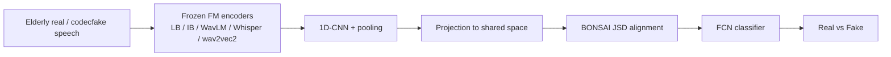
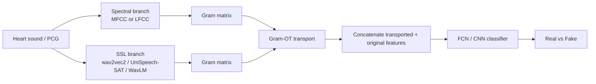
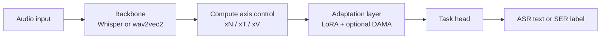
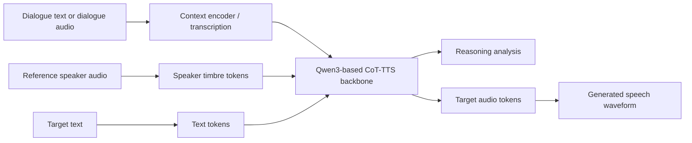

# 语音 / 音频 / 音乐论文速递
## 2026-06-23

> 实际对应 arXiv 更新日：**2026-06-23**  
> 检索范围：`cs.SD + eess.AS`  
> 只放按 ML 顶会审稿口径看，最值得多数读者花时间看的 **5 篇**

## 📋 总览

- 共收录 **5 篇** 相关论文
- 语音安全 / 音频取证：**2 篇**
- ASR 可靠性 / 数据评测：**1 篇**
- 音频模型效率 / 训练部署：**1 篇**
- 语音生成 / CoT-TTS：**1 篇**

今天这批里，真正值得优先看的不是“又一个语音大模型”，而是三条更硬的现实问题线。第一条是 `ECFD + SHAC` 这组安全论文：它们不再盯着最常见的年轻语音 deepfake，而是把检测对象推进到老年语音和心音这类明显分布偏移的数据域，结果很扎心，旧 detector 一换人群或一换信号类型就塌。第二条是 `HALAS`，它把“ASR 幻觉”从非语音噪声玩具题，拉回到真实 earnings call 的自然长音频，顺手证明很多 proxy metric 看着能用，真到 span 级 hallucination 检测还是不够。第三条是 `SAME` 和 `CoT-TTS Challenge`：前者讨论算力该怎么花，后者讨论 context-aware TTS 该怎么评，二者都不是直接刷榜，但对真正要落地系统的人更有参考价值。

## 精选入选规则

- **新意（0-3）**：是不是提出了新的任务定义、数据协议、表示融合或评测接口
- **影响力（0-3）**：是不是贴近语音安全、ASR 可靠性、TTS/语音大模型、部署效率这些主线
- **证据强度（0-2）**：有没有靠谱 baseline、明确指标、关键数字和非玩具验证
- **受众匹配度（0-2）**：对语音大模型 / 语音前端 / 语音安全 / 生成语音研究者有没有直接启发

分数校准：

- **6**：有信息量，但更像补 benchmark 或工程记录
- **7**：值得过一遍，至少能带来一个明确判断
- **8+**：建议优先精读，里面有可复用的方法论或硬证据

## 总览表

| 方向 | 序号 | 论文 | 评分 | 关键词 |
|---|---:|---|---:|---|
| 语音安全 / 深度伪造检测 | 1 | Bridging the Age Gap | 8.5/10 | elderly speech, codecfake, multimodal FM, BONSAI, JSD fusion |
| 语音安全 / 生理音频取证 | 2 | Synthetic Heart Sound Detection | 8/10 | heart sound spoofing, CARDIOFAKE, GROOT, Gram-OT, WavLM |
| ASR 可靠性 / 数据评测 | 3 | HALAS | 8/10 | ASR hallucination, human annotation, earnings calls, decoder embedding |
| 音频模型效率 / 部署 | 4 | SAME | 7.5/10 | compute allocation, Whisper, wav2vec2, LoRA, DAMA |
| 语音生成 / CoT-TTS | 5 | ISCSLP 2026 CoT-TTS Challenge | 7.5/10 | context-aware TTS, reasoning, bilingual dataset, Qwen3 baseline |

## 🛡️ 语音安全 / 深度伪造检测

### [1] Bridging the Age Gap: Towards Detecting Neural Audio Codec Synthesized Elderly Speech Deepfake

- **评分**：8.5/10
- **作者/机构**：Orchid Chetia Phukan, Girish, Mohd Mujtaba Akhtar, Chi-Chun Lee；NTHU BIIC Lab、UPES、VBSPU
- **论文链接**：https://arxiv.org/abs/2606.21735
- **PDF**：https://arxiv.org/pdf/2606.21735.pdf
- **代码链接**：暂未看到独立 GitHub；项目页 https://helixometry.github.io/ElderlyCodecFake/
- **Demo 链接**：https://helixometry.github.io/ElderlyCodecFake/

#### 📌 简介
这篇抓的是一个以前基本被忽略的洞：现有 codec-based speech deepfake detector 大多在年轻成人语音上训练和评测，换到老年语音就明显掉线。作者先定义 `Elderly CodecFake Detection (ECFD)`，再做出中英双语 `ECF` 数据集，最后用多模态 foundation model 融合方法 `BONSAI` 给出一个比单一语音 FM 更稳的检测器。

#### ☠️ 毒舌点评
这不是那种“又加一个 backbone 看谁分高”的无聊 paper。真正有价值的是它把 deepfake 检测里最常见的年龄分布偏置直接捅出来，而且结果很明确：旧 benchmark 上看着不错的系统，一到 elderly speech 就近乎翻车。缺点是任务仍然是二分类检测，没有继续追问攻击可迁移性和真实世界长语音链路，但作为安全 benchmark 论文已经够硬。

#### 🔧 技术方案
- **模型解决的问题**：现有 CodecFake 检测器主要在年轻说话人的中英语音上训练，默认攻击分布和目标人群分布一致。老年语音存在更强 breathiness、pitch instability 和 temporal irregularity，导致已有 detector 学到的伪造线索和真实老年声学模式纠缠，泛化明显变差。
- **模型架构**：
  - **输入**：16 kHz 老年真实语音或经多种 neural audio codec 编解码后的伪造语音。
  - **输出**：真实 / 伪造二分类标签。
  - **主干**：冻结的 speech / multimodal foundation model 特征抽取器，加轻量 downstream classifier。
  - **关键模块**：
    - `ECF dataset`：由 `SeniorTalk` 和 `TIS` 中老年语音构造，包含英语和中文。
    - `speech FMs`：`wav2vec2`、`WavLM`、`Whisper`。
    - `multimodal FMs`：`LanguageBind (LB)`、`ImageBind (IB)`，只取 audio branch。
    - `BONSAI`：双 FM 融合框架，用 `Jensen-Shannon Divergence` 对齐异构表示，再做分类。
  - **信号流**：原始语音先过冻结 FM 抽表示，再经过 1D-CNN、投影层和 JSD 对齐，最后接 FCN 分类器。

- **关键设计 / 核心创新**：
  - 不是只补一个新数据集，而是明确证明“年轻语音上训练好的 detector 对 elderly speech 失效”。
  - `BONSAI` 不做粗暴 concat，而是把两路 FM 表示先变成概率分布后做 JSD 对齐，缓解异构表示直接拼接的分布不匹配。
  - 多模态 FM 在这个任务上比纯语音 FM 更强，作者给出的解释是 cross-modal pretraining 让模型隐式接触了更多老年相关上下文。
- **训练 / 推理策略**：
  - ECF 由 `60,749` 条真实老年语音和 `850,486` 条 codecfake 语音组成，覆盖 `14` 个 NAC 变体。
  - 所有模型训练 `20` 个 epoch，`batch size=32`，`lr=1e-3`，`Adam + cross-entropy`。
  - `BONSAI` 的联合目标为 `L = λL_CE + (1-λ)L_JSD`，其中 `λ=0.65`。
  - 推理时先抽取单路或双路 FM 表示，再走 `CNN/AASIST` 或 `BONSAI` 分类器；文中未给出延迟、RTF 或显存数据。

#### 📊 实验结果
- 数据集与评测：
  - `E1 = SeniorTalk`
  - `E2 = TIS Corpus`
  - 指标为 `EER (%)`
- 零样本跨数据集泛化先打脸旧方案：
  - `AASIST` 训练于 Lu 等人的旧 CodecFake 数据后，在 `E1 / E2-young / E2-elderly` 上 EER 为 `30.18 / 14.07 / 27.45`
  - `Wav2vec2-AASIST` 为 `28.32 / 12.89 / 25.76`
  - 同一模型在 `young` 子集明显好于 `elderly` 子集，说明问题不只是 OOD，更是年龄相关失配。
- 在 ECFD 上做 in-domain 训练时：
  - 纯 speech FM 最好的是 `LB?` 不，真正最强单模型是 `LB + CNN`，`E1 4.81 / E2 4.30 / Avg 4.56`
  - 单模态 `IB + CNN` 也很强，`Avg 5.34`
  - speech-only 最好的是 `Whisper + CNN`，`Avg 8.30`
- 融合后：
  - `IB + LB` 的简单 concat 已到 `Avg 2.76`
  - `IB + LB + BONSAI` 进一步降到 `E1 1.80 / E2 1.51 / Avg 1.66`
  - `Whisper + LB + BONSAI` 也有 `Avg 2.57`
- baseline 名字明确包括：`AASIST`、`Wav2vec2-AASIST`、`WavLM`、`Whisper`、`ImageBind`、`LanguageBind`、`Concatenation`

#### 💡 为什么值得看
这篇最值得看的不是分数本身，而是它把“deepfake detector 会不会对弱势人群分布失效”这个问题做成了可测 benchmark。你如果做语音安全、说话人相关模型或多模态表示学习，这篇会逼你重新审视：你当前的 detector 到底是在学伪造痕迹，还是只是在学训练集里那一拨人的声学习惯。

### [2] Towards Detecting Neural Audio Codec Synthesized Heart Sounds

- **评分**：8/10
- **作者/机构**：Girish, Orchid Chetia Phukan, Mohd Mujtaba Akhtar, Bhavinkumar Vinodbhai Kuwar, Swarup Ranjan Behera, Arun Balaji Buduru；UPES、NTHU、VBSPU、IIIT-Delhi、Independent Researcher
- **论文链接**：https://arxiv.org/abs/2606.21727
- **PDF**：https://arxiv.org/pdf/2606.21727.pdf
- **代码链接**：项目页含数据与代码入口 https://helixometry.github.io/SHAC/
- **Demo 链接**：https://helixometry.github.io/SHAC/

#### 📌 简介
这篇把 codec-based deepfake 检测从“人声”扩到“心音”。作者提出 `Synthetic Heart Sound Detection (SHAC)` 任务和 `CARDIOFAKE` 数据集，并设计 `GROOT` 去融合 cepstral 特征和 SSL 特征，核心判断是：心音这种生理信号被 NAC 重建后，既保留身份线索，也带来稳定伪造痕迹，所以真有必要单独做 spoofing countermeasure。

#### ☠️ 毒舌点评
这个题看上去有点偏，但并不水。好处是问题足够新，而且不是硬套 speech deepfake 套路，而是先证明合成心音确实保留 patient identity，再谈检测。短板也明显：这更像 benchmark + fusion baseline，不是一个会改写整个音频取证路线的大方法；但如果你做 biomedical audio security，这篇就是绕不过去的起点。

#### 🔧 技术方案
- **模型解决的问题**：传统心音 biometrics 默认攻击者难以伪造 phonocardiogram，但 neural audio codec 现在已经能把 PCG 重新编码重构，可能产生“听着像真、身份也没丢”的伪造心音。作者要解决的是：如何识别这类 NAC-synthesized heart sounds。
- **模型架构**：
  - **输入**：真实心音 PCG 或经 `SNAC / DAC / EnCodec / SoundStream / SpeechTokenizer / FunCodec / AudioDec` 等 NAC 生成的伪造心音。
  - **输出**：真实 / 伪造标签。
  - **主干**：双路特征抽取 + 传输对齐融合 + 分类器。
  - **关键模块**：
    - spectral branch：`MFCC` 或 `LFCC`
    - SSL branch：`wav2vec2-base`、`UniSpeech-SAT`、`WavLM`
    - `GROOT`：通过 gram-matrix optimal transport 对齐两路表示
    - downstream classifier：`FCN` 或 `CNN`
  - **信号流**：两路特征先各自编码，再经 `Gram-OT` 把一条分支运输到另一条分支的关系空间，最后 concat 后分类。

- **关键设计 / 核心创新**：
  - 先做 `Real→Fake / Fake→Real` 身份识别实验，证明伪造心音不是瞎噪声，而是高保真 spoof。
  - `GROOT` 不直接对 raw feature 做 OT，而是先比较 gram matrix，强调跨特征相关结构而不是逐点欧氏距离。
  - 异构融合优于同类融合，说明 spectral artifact 和 SSL temporal pattern 真是互补的。
- **训练 / 推理策略**：
  - 数据基于 `CirCor DigiScope` 开放部分，共 `3,163` 条真实心音和 `22,141` 条合成心音。
  - 定义 `seen` 与 `unseen` 两种测试：`seen` 使用训练见过的 codec，`unseen` 使用如 `FunCodec`、`AudioDec` 之类未见 codec。
  - 所有模型训练 `50` epoch，`batch size=32`，`Adam + binary cross-entropy`，`lr=1e-3`，带 dropout 和 class weighting。
  - 文中未给出推理速度或显存数据。

#### 📊 实验结果
- 先验证攻击可信度：
  - patient closed-set identification 在 `Real→Real` 达 `89.11%`
  - `Real→Fake` 仍有 `86.29%`
  - `Fake→Fake` 与 `Fake→Real` 分别达 `95.07%` 和 `93.08%`
  - 结论很直接：合成心音保留了大多数身份线索。
- 单特征检测：
  - `WavLM + CNN` 在 `seen` 条件下 `ACC 87.72 / EER 9.45`
  - `unseen` 下仍有 `ACC 84.02 / EER 13.39`
  - 明显优于 `MFCC`、`LFCC` 与 `wav2vec2`
- 融合检测最强：
  - `MFCC + WavLM + GROOT` 在 `seen` 达 `ACC 93.20 / EER 5.86`
  - 在 `unseen` 仍有 `ACC 86.10 / EER 9.75`
  - 对比简单 concat 的 `87.70 / 7.40` 和 OT 的 `89.07 / 6.86`，GROOT 继续提升
- 与强基线对比：
  - `AASIST`：`seen ACC 85.15 / EER 14.91`，`unseen ACC 73.13 / EER 16.43`
  - `MiO`：`seen ACC 86.98 / EER 12.34`，`unseen ACC 75.89 / EER 14.09`
  - `GROOT(MFCC+WavLM)` 明显更强

#### 💡 为什么值得看
它最值得看的地方，是把“音频 biometrics 被 neural codec 伪造”这个以前停留在想象层面的风险，做成了有 identity-preservation 证据、有 seen/unseen protocol 的正式 benchmark。哪怕你不做心音，里面关于异构特征融合和 unseen codec 泛化的分析，也能迁移到别的生理声学安全任务。

## 🧪 ASR 可靠性 / 数据评测

### [3] HALAS: A Human-Annotated Dataset of Hallucinations of Modern ASR Systems

- **评分**：8/10
- **作者/机构**：Mateusz Barański, Jan Jasiński, Julitta Bartolewska, Marcin Witkowski, Konrad Kowalczyk；AGH University of Krakow
- **论文链接**：https://arxiv.org/abs/2606.23048
- **PDF**：https://arxiv.org/pdf/2606.23048.pdf
- **代码链接**：**代码已开源** https://github.com/DSP-AGH/HALAS/tree/main
- **Demo 链接**：数据集 https://huggingface.co/datasets/MatBar99/HALAS

#### 📌 简介
这篇做的是 ASR hallucination 的“真数据 benchmark”。作者没有再拿 non-speech 或人工污染音频做题，而是基于真实 `Earnings 22` 录音，收集 7 个 SOTA ASR 模型的输出，做 span-level 人工标注，得到 `HALAS`。结论也很扎实：常见 proxy metric 在这个任务上最多到 `0.81 ROC-AUC`，而真正的 SOTA hallucination detector 也只有 `56.1 F1` 左右，问题远没被解决。

#### ☠️ 毒舌点评
这篇最大的优点是诚实。很多人现在一提 ASR hallucination，就喜欢拿无语音或拼接噪声做评测，然后说 detector 很强。`HALAS` 直接告诉你：到了真实长尾自然语音，事情没那么简单。缺点是它偏 dataset paper，方法创新本身不多，但这类论文恰恰是最容易被低估、却最该被做扎实的。

#### 🔧 技术方案
- **模型解决的问题**：已有 hallucination mitigation / detection 大多在非语音或人工污染语音上验证，无法反映真实自然语音中的 hallucination。`HALAS` 解决的是“如何在真实、未经人工污染的长音频上定义、标注并评测 ASR hallucination 检测”。
- **模型架构**：
  - **输入**：`Earnings 22` 中真实 earnings call 片段，以及 7 个 ASR 模型对应转写。
  - **输出**：句级 / span 级 hallucination、looping 等标签；后续 detector 输出二分类结果。
  - **主干**：这篇更像 benchmark pipeline，而不是统一模型。
  - **关键模块**：
    - candidate mining：用 inter-model WER 挑最容易出错的片段
    - human annotation：10 位专业标注员、双人标注 + 仲裁
    - proxy metrics：`WER`、`CER`、`Insertion Rate`、`Length Ratio`、`BERTScore`、`SeMaScore`、`GPT-2 PPL`
    - SOTA detectors：LLM-based reference comparator，以及 `decoder embedding (DE)` 分类器
  - **信号流**：音频先经过多套 ASR，利用模型间分歧抽候选，再由人工做 hallucination span 标注，最后用 proxy metric 或 detector 进行二分类评测。

- **关键设计 / 核心创新**：
  - 强调“natural speech hallucination”，不是无语音瞎插词 benchmark。
  - 标注粒度到 hallucination / looping span，而不是只给 utterance-level yes/no。
  - 专门测试跨模型迁移：`OTHER` 训练配置接近 `OWN`，说明这个 benchmark 不只是某个模型的定制 error list。
- **训练 / 推理策略**：
  - 基础语料来自 `119 h` 的 `Earnings 22`，分成 `57,390` 段。
  - 最终 `HALAS` 包含 `3,611` 个音频文件，训练 / 测试分别为 `2,866 / 745`。
  - 10 位专业标注员，初始一致性高，仲裁后形成最终标注。
  - SOTA detector 部分复现 `Whisper large-v3` 的 decoder-embedding 方案，并扩展到多层拼接 `DE 2,13,23`。

#### 📊 实验结果
- 数据本身很难：
  - 各模型 hallucination rate 在 `21.4%` 到 `43.8%`
  - 平均为 `30.9%`
  - WER 从 `31.46%` 到 `110.5%`
- 幻觉模式具有强共性：
  - 平均 `55%` 的 hallucination 来自每个模型 top-10 短语
  - 扩到 top-30 覆盖 `75%`
  - 13 个短语出现在所有模型的常见 hallucination 列表中
- proxy metric 上限不高：
  - `CER AUC 0.81`
  - `SeMaScore AUC 0.80`
  - `BERTScore AUC 0.77`
  - `WER AUC 0.72`
  - `Length Ratio 0.62`，`PPL 0.60`
  - 说明很多 hallucination 很流畅，靠简单启发式抓不住
- 组合 proxy metric 的 `XGBoost`：
  - `OWN 0.829 ROC-AUC`
  - `OTHER 0.828`
  - `ALL 0.835`
- SOTA detector 对比（Wv3 HALAS test）：
  - `GPT-4o mini F1 40.7`
  - `Gemini 2.0 Flash F1 41.6`
  - `DE 21 F1 53.1`
  - `DE 2,13,23 F1 56.1`
  - 多层 decoder embedding 明显比单层更强
- out-of-domain：
  - `DE 21 F1 72.4`
  - `DE 2,13,23 F1 77.3`
  - 说明在更简单的非语音增强场景上，它能迁移；反过来也说明 HALAS 更难。

#### 💡 为什么值得看
这篇最值得看的点，是它把 ASR hallucination 从“大家都知道有问题”的嘴炮，变成了一个可量化、可迁移、而且明确很难的 benchmark。你如果在做 Whisper 类模型的可靠性评测、后验质量控制、置信度建模，这篇会直接告诉你哪些常见 proxy 能用到什么程度，哪些方法只是看起来聪明。

## ⚙️ 音频模型效率 / 部署

### [4] Scaling Audio Models Efficiently: A Joint Study of Compute Constraints and Optimization Behavior

- **评分**：7.5/10
- **作者/机构**：Vyom Agarwal, Mokshda Gangrade, Siddharth Pal, Jerry Wu；University of Maryland
- **论文链接**：https://arxiv.org/abs/2606.22790
- **PDF**：https://arxiv.org/pdf/2606.22790.pdf
- **代码链接**：**代码已开源** https://github.com/vyomya/SAME
- **Demo 链接**：暂无

#### 📌 简介
这篇不是做新 ASR/TTS 模型，而是问一个更实在的问题：在固定算力预算下，音频模型的 compute 应该花在 `模型尺寸 xN`、`输入长度 xT` 还是 `表示分辨率 xV` 上？作者用 `Whisper` 做 ASR、`wav2vec2` 做 SER，系统比较三条轴和 `LoRA + DAMA` 的组合，给出一套关于 Pareto frontier 的经验规律。

#### ☠️ 毒舌点评
这篇不像旗舰创新，更像一篇认真做完的 systems-for-audio paper。优点是问题真实、实验设计干净、数字直接服务部署决策；缺点是 method novelty 不高，而且没有覆盖 TTS 或 audio LLM 更复杂的多模态链路。要是你只想看 SOTA 榜单，这篇可能嫌“太工程”；但真要上机，它反而比很多花哨模型更有用。

#### 🔧 技术方案
- **模型解决的问题**：大模型音频系统通常默认“更大就更好”，但在固定 FLOPs、延迟和显存预算下，这种直觉常常是错的。作者要解决的是：ASR 和 SER 各自最优的算力分配方式是什么。
- **模型架构**：
  - **输入**：ASR 侧为 `LibriSpeech` 音频；SER 侧为 `CREMA-D` 情感语音。
  - **输出**：ASR 输出文本，SER 输出情感类别。
  - **主干**：
    - ASR：`Whisper Tiny / Small / Medium / Large-v3`
    - SER：`wav2vec2-base / wav2vec2-large-robust`
  - **关键模块**：
    - `xN`：模型规模
    - `xT`：输入时长 / encoder frame 数
    - `xV`：encoder token resolution，主要通过 subsampling 降低 cross-attention 代价
    - `LoRA`
    - `DAMA (Depth-Aware Model Adaptation)`：选择性解冻高层 encoder
  - **信号流**：音频进入 backbone 后，按不同 `xT/xV` 配置控制 encoder token 数，再结合 LoRA / DAMA 完成任务适配。

- **关键设计 / 核心创新**：
  - 不把 scaling 当单轴问题，而是同时分析 `xN/xT/xV`。
  - 区分任务差异：ASR 的 Pareto frontier 平滑，SER 的 frontier 稀疏。
  - 强调 `DAMA` 对 SER 很关键，单纯 LoRA 会接近失效。
- **训练 / 推理策略**：
  - 统一训练配置：`AdamW`、线性 LR schedule、`1e-5` 学习率、`500 warmup`、`4000 total steps`。
  - Whisper LoRA 作用在 `qproj / vproj`，`r=32, α=64, dropout=0.05`。
  - SER 侧系统搜索不同 `LoRA rank` 和 `Top-k` 解冻层数。
  - 推理层面重点评估 FLOPs 与 RTF；文中明确所有 SER 配置都 `RTF << 1`。

#### 📊 实验结果
- SER (`CREMA-D`)：
  - 全量微调 `wav2vec2-large-robust` 达 `80.46% UA`，代价 `126.3G FLOPs / 315.7M params`
  - 最优高效配置是 `wav2vec2-base + LoRA(r=16) + Top4 DAMA`：
    - `72.71% UA`
    - `37.8G FLOPs`
    - `29.7M params`
    - 约 `4.3x` FLOPs 降低，只损失 `7.7` 个点 UA
  - `LoRA-only` 且不解冻 encoder 时，UA 直接掉到 `43.82%`
  - 输入时长存在最优点：
    - `4s: 56.49% UA`
    - `6s: 55.31% UA`
    - `2s: 50.98% UA`
- ASR (`LibriSpeech test-other`)：
  - `Tiny (750f, 1-stride)`：`29.3G FLOPs / 19.01% WER`
  - `Small (1500f, 1-stride)`：`722.4G / 7.96%`
  - `Medium (1500f, 1-stride)`：`2531.5G / 5.61%`
  - `Large-v3 (1500f, 1-stride)`：`5228.0G / 4.85%`
  - 从 `Tiny→Small` WER 绝对改善最大，后面继续放大收益快速递减
  - `Small` 上把帧数从 `750` 增到 `1500`：
    - `10.84% → 7.96% WER`
    - 只增加 `370G FLOPs`
    - 这个收益接近升一个模型等级，但代价远小
  - `1500f, 2-stride` 对 `Small`：
    - `8.26% WER`
    - `510G FLOPs`
    - 对比全分辨率 `7.96% / 722G`
    - 省约 `29% FLOPs`，只多 `0.3` 个点 WER

#### 💡 为什么值得看
它最值得看的不是某个绝对最优数，而是把“算力该投在哪”说清楚了。你如果手里就是 `4090 24GB` 级别硬件，这篇会直接告诉你：很多时候先拉上下文、再做 token subsampling，比盲目升 backbone 更划算；而在 SER 这类任务里，没有结构化解冻策略，LoRA 甚至会接近白给。

## 🗣️ 语音生成 / CoT-TTS

### [5] ISCSLP 2026 CoT-TTS Challenge: Chain-of-Thought Reasoning for Context-Aware Text-to-Speech

- **评分**：7.5/10
- **作者/机构**：Wei Xue, Junlan Feng, Shilei Zhang, Yue Wang, Ruosong Yang, Bei Liu, Liumeng Xue, Sitong Cheng, Jiahao Pan, Weizhen Bian, Boyi Kang, Bin Long；HKUST、China Mobile、China Mobile HK Innovation Research Institute、Nanjing University、Hong Kong Generative AI R&D Center
- **论文链接**：https://arxiv.org/abs/2606.21933
- **PDF**：https://arxiv.org/pdf/2606.21933.pdf
- **代码链接**：**代码已开源** https://github.com/iscslp2026-cot-tts/baseline
- **Demo 链接**：挑战主页 https://iscslp2026-cot-tts.github.io/challenge-website/

#### 📌 简介
这篇本质上是 challenge proposal，不是标准方法论文，但信息量并不低。它把 `context-aware TTS` 明确定义成 `CoT-TTS`：模型不只是生成目标语音，还必须给出“为什么这句话该这么说”的 reasoning。作者提供双语大规模训练集、双赛道协议、统一评测和一个 `0.6B Qwen3` 基线，想把“上下文理解 + 可解释语音生成”推成一个正式 benchmark。

#### ☠️ 毒舌点评
先说实话，这不是那种能拿来直接当 SOTA 方法复现的论文，因为它主要在搭挑战而不是证明一个模型已经赢了所有 baseline。但它有两个实打实的价值：一是把 context-aware TTS 的评测对象从“听起来更像”推进到“推理是否合理”；二是把大数据构造、评测和 1B 以下约束一起订清楚。短板也明显：还没有完整 leaderboard 结果，很多 baseline 对比要等 challenge 真跑起来才有说服力。

#### 🔧 技术方案
- **模型解决的问题**：现有 controllable TTS 往往依赖显式 style prompt，面对长对话、剧情冲突、情绪转折时，系统很难自动决定“该怎么说”。`CoT-TTS` 希望模型基于上下文推断说话意图、情绪与节奏，再把推理结果落实到语音生成。
- **模型架构**：
  - **输入**：
    - Track 1：文本上下文、目标文本、参考说话人音频
    - Track 2：音频上下文、目标文本、参考说话人音频
  - **输出**：reasoning analysis + 目标语音波形
  - **主干**：`0.6B Qwen3-based` baseline，结合 `BiCodec` 音频 token、Qwen3 tokenizer、三阶段训练
  - **关键模块**：
    - scene refinement：LLM 精修场景边界
    - emotion annotation：FunASR 粗标 + LLM 精修
    - reasoning annotation：基于前 `3-5` 轮对话生成多维 CoT
    - auxiliary tasks：ASR、speaker-aware transcription、instruction-based TTS
  - **信号流**：历史上下文先被转成文本 / 音频 token，再结合参考音色和目标句子生成 reasoning，最后输出 target audio token 和波形。

- **关键设计 / 核心创新**：
  - 把 reasoning output 变成正式评测对象，而不是只当中间解释文本。
  - 挑战协议明确禁止 `ASR-LLM-TTS` cascaded pipeline，逼着大家做 end-to-end。
  - 给出 bilingual 大规模训练集和 `<1B` 参数受限赛道，避免最后只剩超大模型拼算力。
- **训练 / 推理策略**：
  - 数据构造后保留约 `3M` 段、约 `16K h` 语音，英中比例约 `54:46`。
  - 第一阶段做 ASR/TTS 模态对齐。
  - 第二阶段训练主任务：根据历史文本或历史音频生成 reasoning 和目标音频 token。
  - 第三阶段在高质量子集上继续 fine-tune，强化 reasoning 稳定性和 style control。
  - baseline 可在 `RTX 4090` 上训练，符合当前常见单卡约束。

#### 📊 实验结果
- 这篇没有正式 leaderboard 结果，更多是 protocol 与 baseline 说明，必须明确区分。
- 训练数据规模：
  - English：`~8.6K h / ~1.62M segments`
  - Chinese：`~7.4K h / ~1.38M segments`
  - Total：`~16K h / ~3.0M segments`
- 评测集：
  - hidden candidate pool 约 `3M` 样本
  - 最终保留 `600` 中文 + `600` 英文样本
- 评分公式：
  - `S = 0.3 Sobj + 0.2 SLLM + 0.5 Shuman`
- objective 指标：
  - `UTMOSv2`
  - `DNSMOS P.835`
  - `CER / WER`
  - speaker cosine similarity
  - `F0 correlation`、emotion expressiveness、duration error、`RTF`
- 任务约束：
  - 两条赛道：text-context / audio-context
  - 两个榜单：unrestricted / `<1B` parameter-constrained
  - cascaded `ASR–LLM–TTS` 禁止
- baseline 侧只给出定性结论：
  - 作者称 `0.6B Qwen3` 基线在轻量配置下已能生成“meaningful reasoning analyses”并体现一定 controllability
  - 但文中没有给出具体 UTMOS、CER、speaker similarity 等硬数值，这也是这篇和完整方法论文的关键区别。

#### 💡 为什么值得看
如果你做 context-aware TTS、语音大模型或者可控配音，这篇值得看的不是“baseline 多强”，而是它把任务边界订得很清楚：输入是什么，reasoning 怎么评，最终音频怎么打分，以及为什么简单 cascaded pipeline 不够。这种协议一旦站稳，后面会直接影响一批 CoT-TTS 工作的评测口径。

## 最后结论

今天最值得优先看的顺序，我会排成这样：

1. `Bridging the Age Gap`：因为它把 speech deepfake 检测里长期被忽略的人群分布偏差，做成了有明确数字的新 benchmark，而且 `LB + IB + BONSAI` 的结果很硬。
2. `HALAS`：因为它把 ASR hallucination 评测从玩具题拉回真实语音，顺手证明很多“看起来聪明”的检测方法在自然数据上其实还差得远。
3. `Synthetic Heart Sound Detection`：题偏，但质量不偏。对 biomedical audio security 或 spoofing 泛化的人很有参考价值。
4. `SAME`：如果你在单卡预算里折腾 Whisper、wav2vec2 或类似 backbone，这篇的计算分配结论非常实用。
5. `ISCSLP 2026 CoT-TTS Challenge`：它更像协议和赛题设计，而不是成熟方法论文，但对接下来一波 context-aware TTS 研究的评测方向有前瞻意义。
