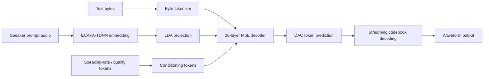
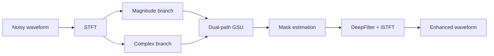
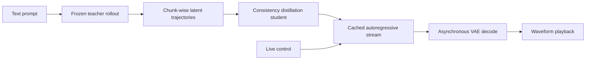
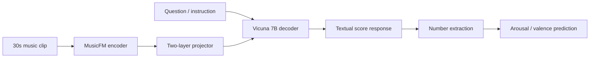
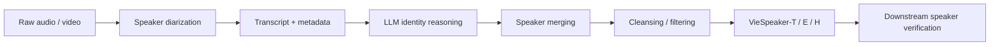

# 语音 / 音频 / 音乐论文速递
## 2026-06-24

> 实际对应 arXiv 更新日：**2026-06-24**  
> 检索范围：`cs.SD + eess.AS`  
> 只放按 ML 顶会审稿口径看，最值得多数读者花时间看的 **5 篇**

## 📋 总览

- 共收录 **5 篇** 相关论文
- 语音 / 歌声生成：**1 篇**
- 语音前端：**1 篇**
- 音乐生成 / 交互式生成：**1 篇**
- 音乐大模型 / 情绪对齐：**1 篇**
- 语音数据集 / 说话人识别：**1 篇**

今天真正值得看的主线很清楚：`ZONOS2` 不是单纯把 TTS 做大，而是把 byte-level 文本、MoE 主干、speaker / quality conditioning 和 6.2M 小时级训练一起拧成了一个可落地的零样本语音克隆系统；`GSU-DBNet` 则是少见的“前端论文该有的样子”，直接用双分支 + 双路径 SNN 去补低功耗语音增强这条线；其余三篇里，实时音乐生成解决的是低延迟交互，MusicLLM 情绪对齐把数值回归从玄学变成可优化目标，`VieSpeaker` 则给越南语 speaker recognition 补了一个真正能训练、能泛化的数据底座。

## 精选入选规则

- 新意（0-3）：是不是提出了新的表示、接口、控制方式，或者把旧问题拆得更对
- 影响力（0-3）：是不是贴近 TTS、speech front-end、music generation、speaker recognition 这些主线
- 证据强度（0-2）：有没有像样的 baseline、消融和关键数值
- 受众匹配度（0-2）：对语音大模型 / 语音前端 / 音乐生成 / 数据集研究者有没有直接启发

分数校准：

- 6：可读，但更像局部补丁或分析框架
- 7：信息量够，值得过一遍
- 8+：建议优先精读

## 总览表

| 方向 | 序号 | 论文 | 评分 | 关键词 |
|---|---:|---|---:|---|
| 语音 / 歌声生成 | 1 | ZONOS2 Technical Report | 8.5/10 | byte tokenizer, MoE TTS, zero-shot cloning, quality mode |
| 语音前端 | 2 | Neuromorphic Speech Enhancement with Dual-Branch Spiking Neural Networks | 8/10 | SNN, dual-branch, gated spiking unit, VoiceBank+DEMAND |
| 音乐生成 / 交互式生成 | 3 | Real-Time Interactive Music Generation via Data-Free Streaming Consistency Distillation | 8.5/10 | streaming distillation, low latency, control latency, CLAP |
| 音乐大模型 / 情绪对齐 | 4 | Aligning MusicLLM with Emotion using Instruction Tuning and Feedback-Driven Alignment | 7.5/10 | MusicFM, Vicuna, GRPO, arousal/valence |
| 语音数据集 / 说话人识别 | 5 | VieSpeaker: A Large-Scale Vietnamese Speaker Recognition Dataset Beyond Visual Dependency | 8/10 | face-independent pipeline, LLM reasoning, 4715 speakers |

## 🤖 语音 / 歌声生成

### [1] ZONOS2 Technical Report

- **评分**：8.5/10
- **作者/机构**：Gabriel Clark, Sofian Mejjoute, Mohamed Osman, George Close, Beren Millidge / Zyphra
- **论文链接**：https://arxiv.org/abs/2606.24320
- **PDF**：https://arxiv.org/pdf/2606.24320.pdf
- **代码链接**：**已开源** https://github.com/Zyphra/ZONOS2
- **Demo 链接**：https://huggingface.co/Zyphra/ZONOS2

#### 📌 简介
这篇做的是一个真正可用的零样本 TTS / voice cloning 系统，而不是把模型名字改大一点。它把 byte-level 文本、speaker / quality conditioning、MoE backbone 和大规模多语种训练一起收进去，目标很明确：既要自然度和音色保持，也要能流式生成。

#### ☠️ 毒舌点评
这篇不是靠“8B”三个字糊弄人，核心是它把以前 TTS 里最烦的几件事都正面处理了：G2P 失败、speaker embedding 泄漏、语言覆盖不足、推理延迟。短板也有，Quality Mode 明显在克隆相似度和可懂度之间做交换，但至少它把这个权衡说清楚了。

#### 🔧 技术方案
- **模型解决的问题**：传统 TTS 常常在自然度、音色克隆、跨语种、流式延迟之间互相打架，尤其是 G2P 失败和 speaker reference 泄漏很容易把训练带歪。`ZONOS2` 要补的是“一个模型能不能同时做高质量零样本克隆、跨语言泛化和低延迟流式生成”。
- **模型架构**：
  - **输入**：文本字节序列，外加可选 speaker prompt、 speaking-rate 和 quality 条件。
  - **输出**：离散 audio codebook tokens，最终解码成波形语音。
  - **主干**：decoder-only Mixture-of-Experts transformer。
  - **关键模块**：
    - byte-level tokenizer，绕开脆弱的 G2P。
    - ECAPA-TDNN speaker embedding + LDA 投影，减少 reference 泄漏。
    - speaking-rate conditioning，控制语速。
    - quality conditioning / Quality Mode，控制可懂度与音色保真之间的权衡。
    - delay pattern codebook generation，支持流式输出。
- **信号流怎么走**：

- **关键设计 / 核心创新**：
  - byte token 直接吃文本，避免字词级预处理把长尾语言搞崩。
  - speaker embedding 先做 LDA，再做 conditioning，明显是在防训练时的捷径泄漏。
  - 把 speaking-rate 和 quality 拆成可控 token，而不是把所有控制硬塞进一个 prompt。
  - MoE 不是装饰，论文把它当作吞吐与延迟兼顾的主轴。
- **训练 / 推理策略**：
  - 训练分四段：pre-training 77,500 steps / 2.9T tokens，mid-training 15,000 steps / 560B tokens，两个 10,000 steps 的 annealing stage。
  - 训练语料扩到约 **6.2M 小时**，覆盖公开语音、播客、有声书、对话和多语种数据。
  - 用 Muon optimizer，pre-training 学习率 `5e-4 / 5e-3`，weight decay `0.1`，gradient clipping `0.5`。
  - 推理时走 delay pattern 的多 codebook 并行生成，支持流式输出；`Quality Mode` 会牺牲一部分 speaker similarity，换更稳的 intelligibility。

#### 📊 实验结果
- 数据集 / benchmark：`ZTTS1-Eval`、`Seed-TTS-Eval`、`CosyVoice 3 Eval`
- 关键数值：
  - 训练规模从 `200K` 小时扩到 **6M+ 小时**。
  - 模型总参数 `8B`，active 参数 `900M`。
  - `ZTTS1-Eval` Clean 上，`ZONOS2` 的英文 speaker similarity 达到 `78.6`。
  - `Quality Mode` 在普通 zero-shot 上把中文 WER 从 `15.62` 降到 `6.73`，但 speaker similarity 也会下降。
  - `CosyVoice 3 Eval` 的 emotion zero-shot 上，`ZONOS2` 的 emotion accuracy 为 `37.3%`（en）和 `36.7%`（zh）。
- baseline 名字：
  - `Qwen3-TTS 1.7B`
  - `Fish S2 Pro`
  - `VoxCPM 2`
  - `ElevenLabs`
  - `Google DeepMind`
- 核心结论：
  - 在开源系统里，`ZONOS2` 的 speaker similarity 和多语种覆盖都很强。
  - 它不是每个指标都压过最强闭源系统，但作为可复现、可用的 open-source TTS，完成度很高。

#### 💡 为什么值得看
如果你关心的是“能不能真的做出一个大规模、可控、流式、零样本 voice cloning 系统”，这篇比很多只会堆参数的 TTS 论文更值。它最值得看的点不是单一指标，而是它把 byte、MoE、speaker leakage、quality control 和多语种训练串成了一个能落地的整体。

## 🧩 语音前端

### [2] Neuromorphic Speech Enhancement with Dual-Branch Spiking Neural Networks

- **评分**：8/10
- **作者/机构**：Taiyu Meng, Wenbin Jiang, Haoyi Zhang, Yuhan Zhou, Haibing Yin / Hangzhou Dianzi University
- **论文链接**：https://arxiv.org/abs/2606.23761
- **PDF**：https://arxiv.org/pdf/2606.23761.pdf
- **代码链接**：暂无
- **Demo 链接**：https://meng-taiyu.github.io/dpnet-demo/

#### 📌 简介
这篇是很正经的 speech enhancement 前端论文，核心诉求很朴素：低功耗 neuromorphic 场景下，SNN 别再只会比 ANN 差一点点了。作者把 magnitude 和 complex spectrum 双分支建模，再用双路径 gated spiking unit 把时频信息都吃进去。

#### ☠️ 毒舌点评
它不是那种“把 SNN 名词往老增强网络上贴一贴”的换皮稿，结构和实验都能看。真要挑刺，就是创新主要体现在架构重组和 spiking cell 设计上，不是全新的增强范式，但在边缘前端这个场景里已经足够实用了。

#### 🔧 技术方案
- **模型解决的问题**：SNN 语音增强一直有能效优势，但和 ANN 的质量差距还在。`GSU-DBNet` 解决的是“在参数和算力都很紧的 neuromorphic 约束下，能不能把 SNN 的增强质量拉到能用”。
- **模型架构**：
  - **输入**：16 kHz 语音的 STFT 复谱表示。
  - **输出**：增强后的 waveform。
  - **主干**：双分支 + 双路径 spiking network。
  - **关键模块**：
    - magnitude branch 和 complex branch 并行建模。
    - time path / frequency path 的 dual-path GSU。
    - gated spiking unit，替代更重的 recurrent cell。
    - U-Net 风格 encoder-decoder + DeepFilter 头。
- **信号流怎么走**：

- **关键设计 / 核心创新**：
  - dual-branch 把 magnitude 和 complex 的互补性利用起来，不再把所有东西压成单一路径。
  - time/frequency 双路径让 SNN 既看局部连续性，也看全局谱结构。
  - 单门控 GSU 反而比多门控更稳，论文把这点通过消融讲得很清楚。
- **训练 / 推理策略**：
  - 数据集：`VoiceBank+DEMAND`，训练集 `11,572` 句，测试集 `824` 句。
  - 训练用 AdamW，初始学习率 `1e-3`，`ReduceLROnPlateau` 衰减，batch size `18`，最多 `150` epochs。
  - 损失由 spectral MSE 和 `SI-SNR` 组成，`αc = 30`，`αm = 70`。
  - STFT 参数：25 ms window、6.25 ms hop、512 FFT。

#### 📊 实验结果
- 关键数值：
  - `GSU-DBNet`：`PESQ 3.04`，`394K` 参数。
  - 对比 `DPSNN`：`PESQ 2.20`。
  - 对比 `Spiking-FSN`：`PESQ 2.66`。
  - 对比 `TSTNN`：`PESQ 2.96`，而且 `GSU-DBNet` 还少参数。
  - 相比 `DCCRN / FullSubNet+ / GaGNet`，在 PESQ 上分别从 `2.68 / 2.88 / 2.94` 提到 `3.04`。
  - 参数量只占代表性 ANN 的 **4.5%–10.6%**。
- 消融：
  - 去掉 magnitude branch：`PESQ 2.96`
  - 去掉 complex branch：`PESQ 2.94`
  - 去掉 time path：`PESQ 2.80`
  - 去掉 frequency path：`PESQ 2.72`
  - 多门控 `SLSTM-3G` 反而掉到 `2.98`
- baseline 名字：
  - `DCCRN`
  - `FullSubNet+`
  - `GaGNet`
  - `TSTNN`
  - `DPSNN`
  - `Spiking-FSN`

#### 💡 为什么值得看
这篇的价值不在“发明了一个全新前端范式”，而在于它把 neuromorphic speech enhancement 的工程瓶颈讲明白了：要质量，就不能只靠二值 spike 的朴素堆叠，得把频域结构、时序结构和门控设计一起考虑。做边缘语音增强、低功耗前端的人，可以直接借它的结构和消融结论。

## 🎵 音乐生成 / 交互式生成

### [3] Real-Time Interactive Music Generation via Data-Free Streaming Consistency Distillation

- **评分**：8.5/10
- **作者/机构**：Baisen Wang, Chenxi Bao, Qisong Han / DynamiX, Cardiff University
- **论文链接**：https://arxiv.org/abs/2606.24307
- **PDF**：https://arxiv.org/pdf/2606.24307.pdf
- **代码链接**：暂无
- **Demo 链接**：暂无

#### 📌 简介
这篇解决的是一个很现实的问题：大多数 text-to-music 模型都只适合“点一下，等很久，听一整段”，不适合 live interaction。作者把蒸馏放进 streaming autoregressive latent space，再加上 chunk-wise cached context，把 music generation 变成了可实时操控的动态过程。

#### ☠️ 毒舌点评
它不是那种只会把低延迟当标题卖点的论文，真正做的是“把离线生成改造成可演奏的在线系统”。不足是它还是基于既有 ACE-Step 系统做蒸馏改造，不是从头发明音乐模型，但作为实时交互路线，这个方向是对的。

#### 🔧 技术方案
- **模型解决的问题**：现有 text-to-music 大多是静态渲染，延迟高、不能边听边改。`Data-Free Streaming Consistency Distillation` 要补的是“如何把离线生成模型变成低延迟、可持续响应的人机共创 instrument”。
- **模型架构**：
  - **输入**：文本 prompt，外加在线控制信号。
  - **输出**：分 chunk 生成的音乐 latent，再解码成 waveform。
  - **主干**：基于 `ACE-Step 1.5 XL-Turbo` 的 student / teacher 架构。
  - **关键模块**：
    - frozen teacher rollout，生成 streaming trajectories。
    - chunk-wise cached KV context。
    - latent / spectral / temporal-difference 三重 consistency objective。
    - asynchronous decoding，把 chunk 生成和波形播放并行起来。
- **信号流怎么走**：

- **关键设计 / 核心创新**：
  - 把蒸馏目标放在 streaming latent，而不是离线整段生成。
  - data-free，避免搞昂贵 paired audio-latent 对齐数据。
  - music-aware consistency objective 明确约束 timbre、transient 和 rhythmic stability。
  - 把音乐系统定位成“可演奏乐器”，而不是 prompt-and-wait 渲染器。
- **训练 / 推理策略**：
  - teacher 从 **125,446** 条自然语言音乐描述里合成轨迹。
  - 每条样本使用 `30s warm-up + up to 5 × 30s prediction chunks`，预测 horizon 到 `150s`，总轨迹 `180s`。
  - student 用 LoRA 适配 `DiT decoder`，rank `64`，训练 `2,000 steps`，bf16，batch size `32`，AdamW，初始 lr `1e-4`。
  - 评测在单张 `NVIDIA H200` 上做，chunk size 默认 `1.0s`，兼顾响应性和控制延迟。

#### 📊 实验结果
- 关键数值：
  - `Original`：`TTFA 0.708s`，`RTF 0.024`
  - `Distilled (forced)`：`TTFA 1.213s`，`RTF 0.040`
  - `Distilled 1-step`：`TTFA 1.148s`，`RTF 0.038`
  - `Ours`：`TTFA 0.086s`，`RTF 0.009`
  - `1.0s chunk` 时 `control latency` 约 `1.042s`
  - `Full objective` 在 `K=1` 时把 `CLAP` 从 `0.329` 提到 `0.361`
  - 观感上，`Ours Full` 的 `O-MOS 3.92`、`R-MOS 4.02`、`Co-create 4.38`
- baseline 名字：
  - `ACE-Step XL-Turbo`
  - `Teacher Offline`
  - `Non-stream (S=1)`
  - `Stream Latent`
  - `Stream +Spec`
  - `Stream +Temp`
- 核心结论：
  - streaming reformulation 才是真正把延迟压下来的关键。
  - 质量上，`Lfull` 一般优于只看 latent 的目标。
  - 主观结果也支持：streaming 版本在 responsiveness 和 steerability 上明显更像“乐器”。

#### 💡 为什么值得看
如果你做的是 live music interaction、可控音乐生成或者任何需要边听边改的音频系统，这篇比大多数静态 text-to-music 更有用。它最值得看的不是单个指标，而是它把“音乐模型”重新定义成了一个可以被演奏的实时系统。

## 🎼 音乐大模型 / 情绪对齐

### [4] Aligning MusicLLM with Emotion using Instruction Tuning and Feedback-Driven Alignment

- **评分**：7.5/10
- **作者/机构**：Takuya Hasumi, Welly Naptali / LY Corporation
- **论文链接**：https://arxiv.org/abs/2606.24123
- **PDF**：https://arxiv.org/pdf/2606.24123.pdf
- **代码链接**：暂无
- **Demo 链接**：暂无

#### 📌 简介
这篇研究的是一个很明确的问题：MusicLLM 能不能不只是会答题，还能稳定输出情绪回归数值。作者没有走“换一个更大的模型”这条老路，而是直接把 arousal / valence 回归变成 instruction tuning + feedback-driven alignment 的训练问题。

#### ☠️ 毒舌点评
这类论文最容易写成“我把 LLM 套进音乐任务里了”，但这篇至少有一点硬度：它认真比较了 instruction tuning 和反馈驱动对齐，结论也不粉饰，单纯 instruction tuning 不够，得靠数值反馈拉回来。缺点同样明显，模型本身并没有把情绪理解问题彻底解决，只是把回归做得更像样。

#### 🔧 技术方案
- **模型解决的问题**：MusicLLM 往往会做音乐 QA，但对连续情绪值（arousal / valence）回归不擅长，因为这个目标没有被显式训练。`Aligning MusicLLM with Emotion` 要补的是“如何把 MusicLLM 调成一个能回归连续情绪分数的模型，同时不把 QA 能力彻底弄丢”。
- **模型架构**：
  - **输入**：30 秒音乐片段 + 提示词 / 问题文本。
  - **输出**：文本化 score response，再解析为 arousal / valence 数值。
  - **主干**：`MusicFM` 音频编码器 + `Vicuna 7B` 文本解码器 + 两层 projector。
  - **关键模块**：
    - music encoder 提取音频表征。
    - projector 用两层 linear + ReLU 把音乐特征映射到 LLM 维度。
    - instruction tuning 把回归目标写成自然语言问题。
    - feedback-driven alignment 用可验证数值 reward 做优化。
- **信号流怎么走**：

- **关键设计 / 核心创新**：
  - 不是只做分类，而是把连续回归当成主要目标。
  - `MusicFM + Vicuna` 的组合说明编码器/LLM 并不是问题，关键在训练目标是否对齐。
  - feedback-driven alignment 用 GRPO 之类的数值奖励，直接拉高回归表现。
- **训练 / 推理策略**：
  - 冻结 music encoder，只在 text decoder 上做 LoRA，rank `8`。
  - instruction tuning 50 epochs，batch size `8`，gradient accumulation `2`。
  - feedback-driven alignment 10 epochs，batch size `1`，GRPO 参数 `G=8, β=0`。
  - 训练数据：`DEAM` 和 `MERGE` 的回归样本，加上 `MusicQA` 评测。
  - 评测用 `R2`，并额外看 `BLEU@4 / METEOR / ROUGEL` 是否把 QA 搞坏。

#### 📊 实验结果
- 关键数值：
  - `MusicFM + Vicuna` 仅 instruction tuning：`R2 = 0.38/0.26`
  - 加上 feedback-driven alignment：`R2 = 0.56/0.55`
  - `MusicFM probing`：`0.62/0.31` 和 `0.51/0.43`
  - `Qwen2-Audio` zero-shot：`-3.47/-2.02` 和 `-2.63/-0.48`
  - `Phi-4-Multimodal` zero-shot：`-2.22/-3.52` 和 `-2.42/-0.74`
  - 加上 MusicQA fine-tuning 后，`MusicFM + Vicuna + FDA` 仍能保持 `MusicQA` 的 `BLEU@4 0.15`、`METEOR 0.15`、`ROUGEL 0.39`
- baseline 名字：
  - `MusicFM probing`
  - `Encoder-based models`
  - `Qwen2-Audio`
  - `Phi-4-Multimodal`
- 核心结论：
  - 单纯 instruction tuning 不够，valence 尤其弱。
  - 反馈驱动对齐能明显抬升回归效果，而且不至于把 general music QA 全砸掉。

#### 💡 为什么值得看
如果你做的是音乐理解、music QA 或任何带连续数值标签的音频回归，这篇的价值在于它把“对齐”从口号变成了可执行的训练目标。它不是最强的音乐模型，但它给了一个很实用的训练方向：数值监督比空泛的 instruction 更管用。

## 🗂️ 语音数据集 / 说话人识别

### [5] VieSpeaker: A Large-Scale Vietnamese Speaker Recognition Dataset Beyond Visual Dependency

- **评分**：8/10
- **作者/机构**：Viet Hoang Pham, Tran Trung Nguyen, Bao Thu Ho, Phuong Tuan Dat, Thi Thu Trang Nguyen / Hanoi University of Science and Technology
- **论文链接**：https://arxiv.org/abs/2606.24066
- **PDF**：https://arxiv.org/pdf/2606.24066.pdf
- **代码链接**：暂无
- **Demo 链接**：https://huggingface.co/datasets/hustep-lab/VieSpeaker-Dataset

#### 📌 简介
这篇不是新模型，而是一个很缺的资源型工作：它把越南语 speaker recognition 从依赖人脸的采集路径里解放出来，改成用文本元信息 + LLM 推理去做身份归并。最后做出来的是一个 4,715 说话人、902 小时级别的公开数据集。

#### ☠️ 毒舌点评
数据集论文最容易灌水，但这篇至少没有只做“拼盘”。它的 face-independent pipeline 真的解决了一个采集瓶颈，也把越南语这种低资源语言的 speaker recognition 往前推了一步。短板是它本质上还是数据资源论文，不是方法论文，所以别把它神化成新算法。

#### 🔧 技术方案
- **模型解决的问题**：传统大规模 speaker dataset 很依赖视觉线索，越南语又长期缺数据，结果就是可训练资源少、场景覆盖窄。`VieSpeaker` 解决的是“怎么在不依赖人脸的情况下，构建一个足够大、够杂、还能用于训练 speaker recognition 的越南语数据集”。
- **模型架构**：
  - **输入**：公开视频 / 音频、转写文本、标题、频道名、描述等元信息。
  - **输出**：说话人 ID、去重后的 utterance、训练 / 测试子集。
  - **主干**：speaker diarization + LLM-based identity reasoning + speaker merging + cleansing。
  - **关键模块**：
    - pyannote diarization 切 speaker-homogeneous 段。
    - LLM 依据 transcripts 和 contextual metadata 推断身份。
    - speaker merging 统一别名与多表述。
    - outlier detection 和长度过滤，清理脏样本。
- **信号流怎么走**：

- **关键设计 / 核心创新**：
  - 最关键的不是“又做了一个数据集”，而是把视觉依赖去掉了，数据来源一下从“必须露脸的公开视频”扩到了更多真实音频内容。
  - 让 LLM 帮做结构化身份归并，比纯规则或纯人工标注更能扩规模。
  - 数据集做了训练 / 评测拆分，也给了不同难度协议，不是单纯堆总量。
- **训练 / 推理策略**：
  - 这不是模型训练论文，核心是数据构建与下游验证。
  - 下游实验用 `ECAPA-TDNN`，80 维 log Mel，25 ms frame，10 ms shift，AAM-Softmax，batch size `128`，训练 `40` epochs。
  - 数据集总量 `902.03h`，`4,715` speakers，`365,874` utterances。
  - 公开到 Hugging Face，方便后续复现和预训练。

#### 📊 实验结果
- 关键数值：
  - `VieSpeaker`：`902.03h`，`4,715` speakers，`365,874` utterances。
  - `VieSpeaker-T` 从 scratch 在 `VieSpeaker-E/H` 上达到 `2.40% / 13.45%` EER。
  - `VoxCeleb2 ft. VieSpeaker-T` 在 `VieSpeaker-E/H` 上达到 `1.81% / 9.83%`，是最强结果。
  - 相比 `VoxCeleb2` 预训练，VieSpeaker 预训练在 `Vietnam-Celeb` 上有约 `5.9%` 和 `2.5%` 的相对 EER 降低。
  - 在更难的 `VieSpeaker-H` 上，VieSpeaker-T 也明显优于 `Vietnam-Celeb-T` 和 `VoxVietnam-T`。
- baseline 名字：
  - `VoxCeleb2`
  - `Vietnam-Celeb-T`
  - `VoxVietnam-T`
  - `VoxCeleb2 ft. Vietnam-Celeb-T`
  - `VoxCeleb2 ft. VoxVietnam-T`
- 核心结论：
  - 作为训练语料，VieSpeaker 比传统越南语数据集更稳。
  - 作为 pretraining corpus，它也能给下游 speaker verification 带来实打实收益。

#### 💡 为什么值得看
如果你要做越南语 speaker recognition，这篇不是“可看可不看”的边角料，而是直接影响数据选择的底座工作。它最值得看的地方，是把“没有人脸也能做大规模身份标注”这件事做成了可复用流程。

## 最后结论

今天最值得优先看的顺序是：

1. **ZONOS2**
2. **Real-Time Interactive Music Generation via Data-Free Streaming Consistency Distillation**
3. **GSU-DBNet**

`VieSpeaker` 很适合做越南语 speaker recognition 的人直接拿去用，`MusicLLM` 情绪对齐则更像一篇方法论明确的训练论文。评分排序上，今天的两篇 8.5 分是 `ZONOS2` 和实时音乐生成；`GSU-DBNet`、`VieSpeaker` 都是稳健的 8 分；`MusicLLM` 虽然分数略低，但对数值回归对齐这条线仍然很有参考价值。
