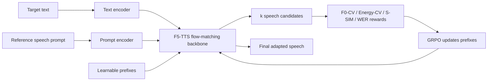
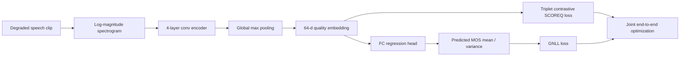
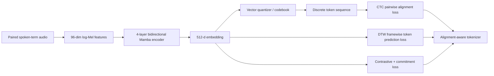
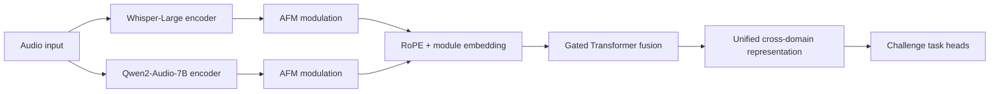
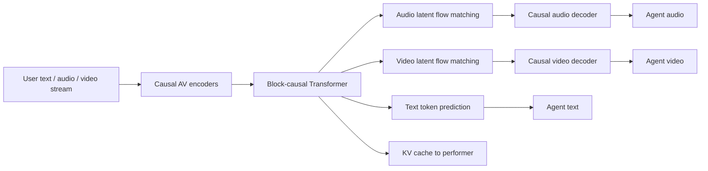

# 语音 / 音频 / 音乐论文速递
## 2026-06-25

> 实际对应 arXiv 更新日：**2026-06-25**  
> 检索范围：`cs.SD + eess.AS`  
> 只放按 ML 顶会审稿口径看，最值得多数读者花时间看的 **5 篇**

## 📋 总览

- 共收录 **5 篇** 相关论文
- 语音生成 / TTS 适配：**1 篇**
- 语音评测 / 检索表征 / 通用表示：**3 篇**
- 实时多模态交互：**1 篇**

今天这批里真正值得优先看的，不是“谁把模型再堆大一点”，而是三条更具体的线。`VoiceTTA` 把 zero-shot TTS 的个性化从离线微调改成了测试时在线自适应，这件事对真实落地比再做一个更大的 teacher 更有用；`wav2tok 2.0` 和 `DNSMOS-C` 则分别从检索 token 与无参考质量评测两个方向，证明“轻量模型 + 更对的训练目标”依然能干掉一堆大而笨的 baseline；`Wan-Streamer` 虽然跨到音视频交互，但它把语音输入、语音输出、可见 listening 行为和时延约束绑在一个统一因果流里，这条线对做 speech agent 的人很难绕开。

## 精选入选规则

- **新意（0-3）**：是不是提出了新的接口、训练组织方式，或者把旧问题拆得更对
- **影响力（0-3）**：是不是贴近 TTS、speech quality、音频表示、语音 agent 这些主线
- **证据强度（0-2）**：有没有像样的 baseline、消融和关键数值
- **受众匹配度（0-2）**：对语音大模型 / 语音前端 / 语音评测 / 音频系统研究者有没有直接启发

分数校准：

- **6**：可读，但更像局部补丁
- **7**：信息量够，值得过一遍
- **8+**：建议优先精读

## 总览表

| 方向 | 序号 | 论文 | 评分 | 关键词 |
|---|---:|---|---:|---|
| 语音生成 / TTS 适配 | 1 | VoiceTTA: Enhancing Zero-Shot Text-to-Speech via Reinforcement Learning-Based Test-Time Adaptation | 8.5/10 | test-time adaptation, GRPO, style reward, zero-shot TTS |
| 语音评测 / MOS 预测 | 2 | DNSMOS-C: Improving End-to-end Speech Quality Models via Contrastive Learning | 7.5/10 | MOS-guided contrastive loss, DNSMOS Pro, quality manifold |
| 语音检索 / token 表征 | 3 | wav2tok 2.0: Scalable Audio Tokenization Maintaining Explicit Pairwise Token Alignment for Efficient Audio Retrieval | 8/10 | QbE-STD, explicit alignment, CTC, DTW |
| 通用音频表示 | 4 | WQ-Fusion: Dynamic Gated Attention for Cross-Domain Audio Representation | 7.5/10 | dual encoder, Whisper, Qwen, gated fusion |
| 实时多模态交互 | 5 | Wan-Streamer v0.1: End-to-end Real-time Interactive Foundation Models | 8/10 | full-duplex, audio-video agent, causal transformer, 200 ms latency |

## 🗣️ 语音生成 / TTS 适配

### [1] VoiceTTA: Enhancing Zero-Shot Text-to-Speech via Reinforcement Learning-Based Test-Time Adaptation

- **评分**：8.5/10
- **作者/机构**：Tianxin Xie, Chenxing Li, Dong Yu, Li Liu / 香港科技大学（广州）, Tencent
- **论文链接**：https://arxiv.org/abs/2606.26534
- **PDF**：https://arxiv.org/pdf/2606.26534.pdf
- **代码链接**：暂无明确官方仓库
- **Demo 链接**：https://voicetta.pages.dev/

#### 📌 简介
这篇做的不是再训一个更大的 TTS，而是把个性化适配搬到了测试时。核心思路是：给定几秒目标说话人的参考语音，不做传统 fine-tune，只在推理阶段给 flow-matching TTS 模型加一组极小的 learnable prefix，再用强化学习式的 reward 去把风格、音色和可懂度往目标 prompt 拉近。

#### ☠️ 毒舌点评
这篇不是“把 RL 往 TTS 上贴一下”的标题党。它最有价值的点是把 adaptation 目标定义得很务实，不追求玄学风格分数，而是直接拿 `F0 变化系数`、`能量变化系数`、`speaker similarity` 和 `WER` 去平衡。缺点也明确：本质还是在已有 `F5-TTS` 上做在线补丁，不是从根上改 TTS 范式，但这类补丁如果真能把 uncommon prompt 救回来，落地价值比空喊 end-to-end 更高。

#### 🔧 技术方案
- **模型解决的问题**：现有 zero-shot TTS 在常规播客、朗读数据上表现还行，但一碰到方言、连读、儿童音、相声/小品这类长尾 speaking style，就容易“音色像了，语气没跟上”或者“风格像了，字又糊了”。`VoiceTTA` 要补的缺口，是如何只用几秒参考音频，在推理时快速把模型往目标说话风格拉过去，而不是重新准备一批高质量微调数据。
- **模型架构**：
  - **输入**：目标文本和一小段目标说话人参考语音。
  - **输出**：保留目标说话风格和音色的合成语音波形。
  - **主干**：基于 `F5-TTS` 的 flow-matching TTS 主干。
  - **关键模块**：
    - 测试时插入到第一层 DiT 输入端的 `learnable prefixes`。
    - 四类 reward：`F0-CV`、`Energy-CV`、`S-SIM`、`WER`。
    - `GRPO` 优化器，把 prefix 当成 stochastic policy 做在线更新。
    - 候选采样机制：每轮先生成多条 candidate，再按 reward 排序更新。
- **信号流怎么走**：

- **关键设计 / 核心创新**：
  - 把测试时 adaptation 目标从“重做训练任务”换成“直接对目标 prompt 的风格误差做在线优化”。
  - 风格 reward 不是单看 pitch 或 energy 绝对值，而是看 `coefficient of variation`，更关注说话动态。
  - 用 `WER` 把 intelligibility 单独拎出来，防止风格学到了、内容塌掉。
  - 只更新 prefix，不碰全量 backbone，存储成本和在线部署压力都低。
- **训练 / 推理策略**：
  - 生成候选时从温度 `T ~ U(0.5, 1.5)` 采样，增加 prosody 多样性。
  - 每个测试样本生成 `4` 条 candidate，执行 `G=50` 步 GRPO。
  - reward 权重设为 `λ1=λ2=0.2, λ3=1, λ4=1.5`，明显更偏向 `speaker similarity + WER` 这两个硬约束。
  - 只在 `F5-TTS` 第一层 DiT 之前加 `4` 个 learnable prefix；每个新样本处理完就随机重置，避免跨样本污染。
  - 推理硬件是 `NVIDIA RTX 6000 Ada`；论文明确说每个新说话人只额外存一个约 `16 KB` 的 prompt 参数。

#### 📊 实验结果
- 数据集 / 测试场景：
  - 内部 uncommon-style 集：`200` 条，其中 `90` accented、`40` children’s、`30` slurred、`40` Chinese sketches。
  - `KeSpeech` 里 `8` 种中文方言，共 `160` 条，按每个方言 `20` 条抽样。
- 平均结果：
  - `VoiceTTA`：`WER 3.12`，`S-SIM 0.64`，`S-MOS 3.27`，`N-MOS 3.35`
  - `F5-TTS`：`WER 3.19`，`S-SIM 0.57`，`S-MOS 3.07`，`N-MOS 3.36`
  - `MaskGCT`：`WER 3.26`，`S-SIM 0.62`，`S-MOS 3.14`
  - `CosyVoice`：`WER 4.57`，`S-SIM 0.54`，`S-MOS 3.25`
  - `Vevo`：`WER 12.41`，`S-SIM 0.34`，`S-MOS 2.05`
- 分场景结果：
  - `Accented`：`VoiceTTA WER 2.82 / S-SIM 0.69`，相比 `F5-TTS 2.81 / 0.67`，几乎不掉字但更像目标风格。
  - `Slurred`：`VoiceTTA 4.49 / 0.58`，优于 `F5-TTS 4.57 / 0.55` 和 `MaskGCT 4.82 / 0.57`。
  - `Chinese Dialects`：`VoiceTTA 3.13 / 0.62`，优于 `F5-TTS 3.38 / 0.59`。
- 消融：
  - 只用 `rIntel`：`WER 3.10` 最好，但 `S-SIM` 掉到 `0.43`。
  - 三个 style reward 全开但不加 `rIntel`：`S-SIM 0.67` 最好，但 `WER` 坏到 `7.04`。
  - 四种 reward 全开：`WER 3.12 / S-SIM 0.64`，是最均衡的折中。
- baseline 名字：
  - `F5-TTS`
  - `MaskGCT`
  - `CosyVoice`
  - `Vevo`

#### 💡 为什么值得看
这篇最值得看的，不是它把某个榜刷高了多少，而是它给 zero-shot TTS 的线上个性化提供了一条更像工程方案的路：几秒 prompt、极小状态、在线更新、风格和可懂度显式分开优化。做 voice cloning、speaker adaptation、交互式 TTS 的人，基本都能从它的 reward 设计里抄到东西。

## 🧪 语音评测 / 检索表征 / 通用表示

### [2] DNSMOS-C: Improving End-to-end Speech Quality Models via Contrastive Learning

- **评分**：7.5/10
- **作者/机构**：Xinyu Liang, Fredrik Cumlin, Victor Ungureanu, Chandan K. A. Reddy, Christian Schuldt, Saikat Chatterjee / KTH Royal Institute of Technology, Google LLC
- **论文链接**：https://arxiv.org/abs/2606.26903
- **PDF**：https://arxiv.org/pdf/2606.26903.pdf
- **代码链接**：**代码将开源** https://github.com/Hope-Liang/DNSMOS-C
- **Demo 链接**：暂无

#### 📌 简介
这篇是在 `DNSMOS Pro` 上做一个很克制但很实用的升级：不换大 SSL encoder，不搞多阶段 teacher-student，而是直接把 `SCOREQ` 那种 triplet-based contrastive loss 接到中间 embedding 上，让一个轻量 end-to-end MOS 回归器学到更有“质量顺序感”的 latent space。

#### ☠️ 毒舌点评
它不是那种一眼惊艳的新范式，更像“把该做的补丁做对了”的论文。好处是问题真，改动小，收益稳定；坏处是创新高度有限，核心 still 是 `DNSMOS Pro + contrastive loss`。如果你做 speech quality assessment、语音增强评测或在线监控，这篇值得读；如果你想找 foundation-level 大想法，它不属于那类。

#### 🔧 技术方案
- **模型解决的问题**：轻量 MOS predictor 很适合部署，但一出训练域就容易崩，尤其遇到没见过的失真类型、语言或录音条件时，排序相关性掉得很快。`DNSMOS-C` 解决的是“如何在不引入大 SSL backbone 和多阶段训练的前提下，让小模型的 latent 更贴近人类感知质量结构”。
- **模型架构**：
  - **输入**：单条退化语音 clip 的 log-magnitude spectrogram。
  - **输出**：MOS 的高斯分布参数 `μ(x)` 与 `σ²(x)`，其中 `μ(x)` 作为最终预测分数。
  - **主干**：沿用 `DNSMOS Pro` 的轻量 end-to-end 回归框架。
  - **关键模块**：
    - `4-layer convolutional encoder + global max pooling`
    - `64-dimensional embedding`
    - `3-layer fully-connected head`
    - `MOS-guided SCOREQ triplet loss`
    - `GNLL` 回归损失
- **信号流怎么走**：

- **关键设计 / 核心创新**：
  - 不像原版 `SCOREQ` 那样先训 embedding 再训 regressor，而是把 contrastive supervision 直接并进 end-to-end MOS 回归。
  - 用 embedding 上的 `triplet margin loss` 去组织“质量流形”，让相近 MOS 的样本在 latent 上更靠近。
  - 依然保留 `DNSMOS Pro` 的轻量结构和实时部署友好性，不为了指标把系统做得更重。
- **训练 / 推理策略**：
  - 训练总损失是 `L = L_gnll + λ L_scoreq`，文中用 `λ = 1`。
  - 输入统一下采样到 `16 kHz`，裁剪或重复填充到 `10 s`。
  - spectrogram 提取用 `20 ms` Hann window 和 `10 ms` hop，log 幅值裁到 `[-7, 7]`。
  - 训练集是 `BVCC`、`Tencent`、`NISQA TRAIN/VAL SIM` 三套 MOS 标注数据，各做 `10` 次独立 run。
  - 优化器 `Adam`，学习率 `1e-4`，训练 `500 epochs`；验证集按 `LCC` 选模。

#### 📊 实验结果
- 训练数据与测试覆盖：
  - 训练：`BVCC`、`Tencent`、`NISQA TRAIN/VAL SIM`
  - 泛化测试：`NISQA TEST FOR`、`NISQA TEST P501`、`NISQA TEST LIVETALK`
  - latent 分析：`TCD-VoIP`、`ESC50`、`LibriAugmented1600`
- in-domain 对比：
  - `BVCC`：`DNSMOS Pro LCC 0.791 / SRCC 0.788`，`DNSMOS-C 0.803 / 0.801`
  - `NISQA SIM`：`0.866 / 0.864` 提到 `0.868 / 0.868`
  - `Tencent`：`0.917 / 0.920` 提到 `0.921 / 0.925`
- out-of-domain 对比：
  - `NISQA TEST FOR`：`LCC 0.763 -> 0.787`，`SRCC 0.758 -> 0.784`
  - `NISQA TEST P501`：`LCC 0.820 -> 0.825`，`SRCC 0.853 -> 0.859`
  - `NISQA TEST LIVETALK`：`LCC 0.535 -> 0.535`，基本打平，没有奇迹。
- latent space 分析：
  - 训练于 `BVCC` 时，`TCD-VoIP` 上 PCA 质量相关性 `R 0.19 -> 0.36`
  - 训练于 `NISQA` 时，`R 0.40 -> 0.51`
  - 训练于 `Tencent` 时，`R 0.45 -> 0.49`
- baseline 名字：
  - `DNSMOS Pro`
  - 对照的对比思路来自 `SCOREQ`
- 需要实话实说的地方：
  - `MSE` 并不是所有地方都变好，比如 `NISQA SIM` 上 `0.394 -> 0.424` 还略差。
  - 真正稳定提升的是 `LCC / SRCC` 这类排序相关性，而不是所有统计量全线碾压。

#### 💡 为什么值得看
如果你做线上语音系统，最怕的是模型在训练集里很准，一出域就变瞎。`DNSMOS-C` 的价值就在于它用一个非常便宜的改动，把小模型的 out-of-domain 排序能力和可解释性都往前推了一步。它不是 flashy paper，但属于“你真可能会抄进生产代码”的那种。

### [3] wav2tok 2.0: Scalable Audio Tokenization Maintaining Explicit Pairwise Token Alignment for Efficient Audio Retrieval

- **评分**：8/10
- **作者/机构**：Adhiraj Banerjee, Vipul Arora / Indian Institute of Technology Kanpur, KU Leuven
- **论文链接**：https://arxiv.org/abs/2606.26824
- **PDF**：https://arxiv.org/pdf/2606.26824.pdf
- **代码链接**：**代码已开源** https://github.com/adhiraj69/wav2tok2
- **Demo 链接**：暂无

#### 📌 简介
这篇盯的是一个很具体但一直没被真正做顺的任务：`query-by-example spoken term detection`。很多 speech tokenizer 在 ASR、LLM 预训练里看起来都很强，但一到检索场景就暴露出一个问题：token 能表达语义，不代表它能跨说话人、跨时长地保持局部顺序一致。`wav2tok 2.0` 干的就是把“显式 pairwise alignment”重新拉回训练目标中心。

#### ☠️ 毒舌点评
这篇不是那种靠“大模型味道”撑起来的论文，问题定义非常老派，但做得很扎实。它的亮点不是 architecture 多花，而是愿意正面承认 retrieval tokenization 和通用 SSL tokenization 不是一回事。短板是任务还是偏窄，主要服务 QbE-STD，不是一个通吃 speech LLM 的大统一 tokenizer；但这恰好也是它可靠的原因。

#### 🔧 技术方案
- **模型解决的问题**：传统 tokenization 更重视重建或语义抽取，不保证同一 spoken term 在不同说话人、不同时长下还能保持稳定 token 对齐。`wav2tok 2.0` 要解决的是“如何让离散 token 对可检索的局部时序结构敏感，而不是只保持粗语义相似”。
- **模型架构**：
  - **输入**：成对的 spoken-term 音频片段，经 `96-dim log-Mel` 表示。
  - **输出**：用于检索的离散 token 序列。
  - **主干**：`4-layer bidirectional Mamba encoder + vector quantizer codebook`
  - **关键模块**：
    - Stage I 的 `SimCLR-style contrastive pretraining`
    - `commitment loss`
    - Stage II 的 `CTC-based pairwise alignment`
    - 新增 `DTW-aligned framewise token prediction loss`
    - `adaptive λ_CTC` 权重控制，稳定训练
- **信号流怎么走**：

- **关键设计 / 核心创新**：
  - 把 `pairwise alignment` 从隐式假设变成显式训练信号。
  - 先用 Stage I 把 latent space 拉开，再做 Stage II 的 token 对齐，避免 CTC 在糟糕初始化下直接炸掉。
  - 新的 `DTW-aligned framewise loss` 比只做 sequence-level CTC 更细，能直接约束 frame-level token 一致性。
- **训练 / 推理策略**：
  - Stage I：只训 contrastive + commitment，学习率 `5e-4`，预训练 `783 epochs`。
  - Stage II：再训 `40 epochs`，联合 `Lcontrast + Lcommit + λCTC LCTC + αpair Lpair`。
  - `γ = 0.5` 用于自适应缩放 `λCTC`，防止 CTC loss 吞掉别的目标。
  - 码本大小实验覆盖 `K ∈ {128, 256, 512, 1024}`。
  - 下游检索使用 bigram 倒排索引和 Jaccard similarity，不是黑箱 cross-encoder。

#### 📊 实验结果
- pairwise token consistency：
  - `BEST-STD 256`：`unigram 0.74 / bigram 0.59`
  - `wav2tok 256`：`0.80 / 0.72`
  - `wav2tok 2.0 256`：`0.83 / 0.75`
  - `wav2tok 2.0 512`：`0.81 / 0.71`
  - `wav2tok 2.0 1024`：`0.79 / 0.68`
- QbE-STD on `LibriSpeech train-clean-100`：
  - `wav2tok 2.0 512`，IV：`MAP 0.86 / MRR 0.90 / MTWV 0.66`
  - `wav2tok 512`，IV：`0.80 / 0.86 / 0.61`
  - `BEST-STD 512`，IV：`0.73 / 0.78 / 0.56`
- cross-dataset `TIMIT` 泛化：
  - `wav2tok 2.0 512`，OOV：`MAP 0.69 / MRR 0.75 / MTWV 0.65`
  - `wav2tok 512`，OOV：`0.65 / 0.70 / 0.60`
  - `BEST-STD 512`，OOV：`0.59 / 0.64 / 0.55`
- baseline 名字：
  - `BEST-STD`
  - `wav2tok`
  - `HuBERT-Base`
  - `WavLM-Base`
  - `SpeechTokenizer`
  - `Encodec`
  - `MFCC`
  - `Phone Posteriors`
  - `BNF`
- 一个很重要的细节：
  - 码本越大，`MTWV` 往往更好，但 `MAP/MRR` 可能有轻微退化；论文没有装作“越大越好”，而是老老实实承认 discriminability 和 robustness 的 trade-off。

#### 💡 为什么值得看
如果你做音频检索、spoken term detection，甚至是想给 speech LLM 找更稳的 retrieval-friendly token，这篇都值得看。它最大的启发是：不是所有离散 speech token 都该拿“重建好不好”来评判，有些任务要的是跨说话人对齐一致性，而这件事得明着训。

### [4] WQ-Fusion: Dynamic Gated Attention for Cross-Domain Audio Representation

- **评分**：7.5/10
- **作者/机构**：Mingda Lin, Lei Ding, Xinyue Zhou, Tiantian Xiong, Hanchen Pei, Gongping Huang, Hao Zhang, Jingdong Chen, Jacob Benesty / 武汉大学, Tencent AI Lab Seattle, 西北工业大学, INRS-EMT
- **论文链接**：https://arxiv.org/abs/2606.26556
- **PDF**：https://arxiv.org/pdf/2606.26556.pdf
- **代码链接**：暂无明确官方仓库
- **Demo 链接**：https://dataoceanai.github.io/Interspeech2026-Audio-Encoder-Challenge/

#### 📌 简介
这篇是一个典型的 challenge-driven representation paper：作者承认“没有单个 encoder 能同时把 speech、sound、music 三个域都吃得特别好”，于是直接把 `Whisper-Large` 和 `Qwen2-Audio-7B` 拉进同一个双编码器框架，用 `Adaptive Feature Modulation + element-wise gated attention` 去做动态路由。

#### ☠️ 毒舌点评
这篇的增量味其实不轻，本质上还是“两个强 backbone + 一层更聪明的融合器”。但它不是纯拼接换皮，因为作者至少把静态 concat 为什么不够、为什么要按上下文做维度级 gating 讲清楚了。更重要的是，结果也没有靠一两个精选数据集吹牛，而是在 15 个数据集的 challenge 基准上给出整体分数。

#### 🔧 技术方案
- **模型解决的问题**：`Whisper` 很强在音素/语言细节，`Qwen2-Audio` 更偏大语义和跨域理解，但单用任何一个，在 speech、sound、music 全域 benchmark 上都会偏科。`WQ-Fusion` 解决的是“如何让两个异构 encoder 在不同声学环境下动态分工，而不是永远固定拼接”。
- **模型架构**：
  - **输入**：来自不同语音、环境声、音乐任务的音频。
  - **输出**：统一的跨域音频表征，送入 challenge 下游分类头。
  - **主干**：`frozen Whisper-Large + frozen Qwen2-Audio-7B + lightweight fusion block`
  - **关键模块**：
    - `Adaptive Feature Modulation (AFM)`：对每个 encoder 特征做动态 scale/shift。
    - `RoPE + learnable module embedding`：区分时间位置和 backbone 来源。
    - `Gated Transformer`：把 query 和 gate 一起投影，做 element-wise gating。
    - 轻量 LoRA / projection 层，只调小模块，不动大 backbone。
- **信号流怎么走**：

- **关键设计 / 核心创新**：
  - 不满足于 `concat`，而是让 gating 在维度级决定“这一时刻更该听 Whisper 还是 Qwen”。
  - `AFM` 用动态 scale/shift 去做特征对齐，比硬投影更柔和。
  - 通过可学习 module embedding 明确标注 token 来源，避免两个 encoder 特征混在一起后失真。
- **训练 / 推理策略**：
  - backbone 和 LLM 主体冻结，只微调 projection、LoRA、AFM、module embeddings 和 fusion block。
  - challenge protocol：训练 `100,000 steps`，batch size `4`。
  - fusion block 只用 `1` 层、`8` 个 attention heads，hidden size `1280`，明显在控制额外成本。
  - 覆盖 `15` 个数据集、`speech + sound + music` 三个域。

#### 📊 实验结果
- 单编码器基线：
  - `Qwen2-Audio-7B` overall `0.796`
  - `Whisper-Large` overall `0.754`
  - `AudioMAE` overall `0.628`
  - `Dasheng-Base` overall `0.614`
- 融合对比：
  - `Concat`：overall `0.820`
  - `Adapt. and Trans.`：`0.829`
  - `Gated Trans.`：`0.832`
  - `WQ-Fusion`：**`0.836`**
- 具体数据集上：
  - `LibriCount`：`Qwen 0.508 -> WQ-Fusion 0.583`
  - `VoxCeleb1`：`0.969 -> 0.985`
  - `ESC-50`：`0.863 -> 0.930`
  - `FSD50k`：`0.252 -> 0.295`
  - `FMA`：`0.660 -> 0.725`
- 也有没赢满的地方：
  - `Speech Commands` 上 `Adapt. and Trans.` 的 `0.955` 仍高于 `WQ-Fusion 0.938`
  - `ASVspoof` 上 `Qwen 0.991` 高于 `WQ-Fusion 0.979`
  - 所以它不是每个任务都最强，而是 overall 更稳。
- baseline 名字：
  - `Dasheng-Base`
  - `AudioMAE`
  - `Whisper-Large`
  - `Qwen2-Audio-7B`
  - `Concat`
  - `Adapt. and Trans.`
  - `Gated Trans.`

#### 💡 为什么值得看
这篇值得看的原因很直接：它把“通用音频表示为什么难”落到了一个可检验的实验框架里。你可以不认同它的最终架构，但很难忽视它给出的结论：单 encoder 在跨域音频理解里就是会偏科，异构 backbone 的动态融合大概率是接下来一段时间的主线之一。

## 🎬 实时多模态交互

### [5] Wan-Streamer v0.1: End-to-end Real-time Interactive Foundation Models

- **评分**：8/10
- **作者/机构**：Lianghua Huang, Zhi-Fan Wu, Wei Wang, Yupeng Shi, Mengyang Feng, Junjie He, Chen-Wei Xie, Yu Liu, Jingren Zhou 等 / Alibaba Group
- **论文链接**：https://arxiv.org/abs/2606.25041
- **PDF**：https://arxiv.org/pdf/2606.25041.pdf
- **代码链接**：暂无明确官方仓库
- **Demo 链接**：https://wan-streamer.com/

#### 📌 简介
这篇严格说已经不只是 speech paper，而是一个实时音视频 agent 系统论文。但它对语音方向仍然很重要，因为它不再把语音交互拆成 `VAD -> ASR -> LLM -> TTS -> animation` 这种串联系统，而是把文本、音频、视频都作为输入输出 token，放进一个统一因果 Transformer 里做 full-duplex streaming interaction。

#### ☠️ 毒舌点评
这篇最厉害的不是“做了个会说话会动的 demo”，而是它终于把 latency 当成模型设计约束，而不是部署优化小尾巴。弱点也很明显：它更像 systems / foundation model tech report，质量评测远不如 latency 评测完整，当前只验证到 `192p` 输出分辨率，所以别急着把它吹成成熟产品。

#### 🔧 技术方案
- **模型解决的问题**：真实交互不是轮流发言，而是持续感知、持续反馈。传统串联系统在模块边界上会引入等待、错误累积和同步漂移。`Wan-Streamer` 解决的是“如何让语言、语音、视频输入输出都处于同一个因果流里，并在亚秒级时延下完成全双工交互”。
- **模型架构**：
  - **输入**：用户侧的文本、音频、视频 streaming unit。
  - **输出**：智能体侧的文本、语音、视频响应单元。
  - **主干**：单一 `block-causal Transformer`，统一建模 text/audio/video 输入输出。
  - **关键模块**：
    - `strictly causal audio / video VAE`
    - `causal audio-visual encoders`
    - `causal audio / video decoders`
    - `conditional flow matching` 生成音视频 latent
    - 部署期的 `thinker-performer` 双 GPU 流水线
- **信号流怎么走**：

- **关键设计 / 核心创新**：
  - 直接否定“先理解、后说话、最后做口型”的串联假设，把 visible listening、interrupt handling、response timing 一起学。
  - 训练时就把 clean latent 反写回历史，保证模型学到的是完整 streaming contract，而不是离线生成再后处理。
  - `thinker-performer` 不是第二个模型，而是同一模型的推理调度拆分：前者负责编码、状态更新和解码，后者只跑最重的 flow-matching solver。
- **训练 / 推理策略**：
  - 三阶段训练：
    - `independent-task pretraining`
    - `end-to-end interaction training`
    - `distillation for low-latency streaming`
  - 音视频响应 latent 用 `conditional flow matching` 训练。
  - `self-forcing + distribution matching + rolling distillation` 用来缓解长时 streaming rollout 退化。
  - streaming unit 最短做到 `160 ms`，视频输出 `25 FPS`。
  - 部署时用双 GPU overlap，目标是让 performer 的 wall time 落进单个 `160 ms` unit。

#### 📊 实验结果
- 核心 latency：
  - `Wan-Streamer`：约 **`200 ms` model-side latency**
  - 加上 `350 ms` 双向网络预算：约 **`550 ms` total interaction latency**
  - 视频输出频率：`25 FPS`
- 对比口径需要小心，但论文给出的公开系统比较里：
  - `Doubao Realtime Voice`：约 `1 s overall`
  - `GPT-4o / Realtime API`：报告 `232/320 ms` 音频响应，但 API 口径下约 `500 ms TTFB`，目标 voice-to-voice 约 `800 ms`
  - `Hume EVI 3`：`0.9–1.4 s` web-app benchmark
  - `Gemini Live API`：`1.2–3.6 s` API benchmark
  - `Moshi`：`160 ms theoretical / 200 ms practical model latency`，但它没有同步视频输出
- 论文明确强调的限制：
  - 许多对比系统只给 first-token、TTFB 或 speech-only latency，不能和完整 audio-video response path 直接一把梭比较。
  - 当前 `v0.1` 结果只验证到 `192p` 输出分辨率，是 proof-of-concept，不是最终画质版本。
- baseline / comparison names：
  - `Doubao Realtime Voice`
  - `GPT-4o / Realtime API`
  - `Hume EVI 3`
  - `Gemini Live API`
  - `Moshi`
  - `Qwen3/3.5-Omni`
  - `MiniCPM-o 4.5`

#### 💡 为什么值得看
这篇最值得看的地方，是它把“实时语音 agent”从传统串联系统推向了真正的统一流式建模。哪怕你不做视频 avatar，只做 speech agent，也很难忽略它传达的设计原则：延迟、打断、可见反馈和跨模态同步，不是服务层小优化，而该是模型本身要学的东西。

## 最后结论

今天如果你时间有限，优先级我会这么排：

1. **VoiceTTA**：最贴近真实 TTS 落地。测试时自适应、reward 设计、16 KB 个性化状态，这些都很实际。
2. **wav2tok 2.0**：检索 token 这条线终于有人不拿通用 SSL 糊弄过去了，方法和实验都够硬，而且有代码。
3. **Wan-Streamer**：不是纯 speech 论文，但它对下一代 speech agent 的系统形态判断很重要，值得盯。
4. **DNSMOS-C**：创新不炸裂，但对轻量 MOS 预测的 out-of-domain 稳定性有真实帮助，适合做评测系统的人读。
5. **WQ-Fusion**：更像 challenge 驱动的融合稿，增量感不小，但它对“单 encoder 不够用”这件事给了清晰证据。

一句话收尾：今天最有价值的不是“更大”，而是“更能上线”。`VoiceTTA` 解决在线适配，`DNSMOS-C / wav2tok 2.0` 解决轻量模型怎么把目标训对，`Wan-Streamer` 则提醒大家，未来语音交互系统真正的战场不是单个模块精度，而是完整流式交互行为。
