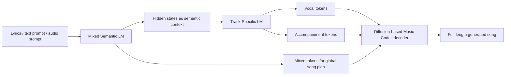
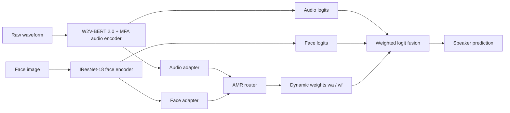
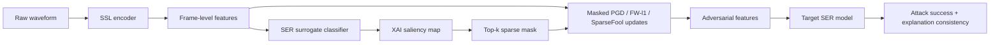
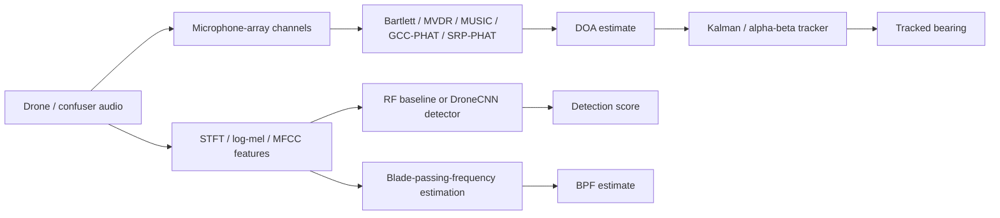

# 语音 / 音频 / 音乐论文速递
## 2026-06-30

> 实际对应 arXiv 更新日：**2026-06-30**  
> 检索范围：`cs.SD + eess.AS`  
> 只放按 ML 顶会审稿口径看，最值得多数读者花时间看的 **5 篇**

## 📋 总览

- 共收录 **5 篇** 相关论文
- 歌声生成 / 音乐生成：**1 篇**
- 说话人识别 / 语音鲁棒性：**1 篇**
- SER 安全 / 对抗攻击：**1 篇**
- 应用声学检测 / 阵列定位：**1 篇**
- 水下声学数据 / 跨域分类：**1 篇**

今天这批里最值得优先看的，坦白说不是“论文数量多”，而是有两条很明确的主线。第一条是 `LeVo 2` 代表的 full-song generation 系统路线，它不只是把模型堆大，而是把“全局语义规划”和“双轨细节建模”拆开，再用分阶段偏好对齐把可控性和 musicality 分开做，这种工程取向比单纯换 token 设计更值得盯。第二条是鲁棒性和评测意识明显抬头：`AMR` 把多模态说话人识别里最讨厌的 missing modality 问题正面解决；`SIGMA` 和 `EchoHawk` 则分别从 SER 对抗攻击和声学数据泄漏两个方向提醒大家，很多系统现在不是“不会做”，而是“评得不诚实、攻得不明白”。

如果只看“方向热度”，今天当然不如一波 TTS / Speech LLM 爆发日热闹；但如果你更在意系统方法、评测纪律和真实部署问题，这一天反而信息密度不低。

## 精选入选规则

- **新意（0-3）**：是不是提出了新的建模接口、训练组织方式，或者把老问题拆得更合理
- **影响力（0-3）**：是不是贴近歌声生成、说话人识别、鲁棒评测、应用声学这些长期主线
- **证据强度（0-2）**：有没有明确 baseline、关键数值、消融或可信分析
- **受众匹配度（0-2）**：对语音大模型 / 语音前端 / 音频系统 / 应用声学研究者有没有直接启发

分数校准：

- **6**：可读，但更像局部补丁或特定子领域论文
- **7**：信息量够，值得过一遍
- **8+**：建议优先精读

## 总览表

| 方向 | 序号 | 论文 | 评分 | 关键词 |
|---|---:|---|---:|---|
| 歌声生成 / 音乐生成 | 1 | LeVo 2 | 8.5/10 | full-song generation, hierarchical LLM, mixed tokens, dual-track refinement, progressive post-training |
| 说话人识别 / 多模态鲁棒性 | 2 | AMR | 8/10 | missing modality, polyglot speaker ID, adaptive routing, W2V-BERT 2.0, face-voice fusion |
| SER 安全 / 对抗攻击 | 3 | SIGMA | 7.5/10 | saliency-guided sparse attack, SER, explanation consistency, transferability |
| 应用声学检测 / 阵列定位 | 4 | EchoHawk | 7.5/10 | drone detection, DOA, beamforming, session leakage, reproducible pipeline |
| 水下声学数据 / 跨域分类 | 5 | Underwater Source Detection and Classification | 7/10 | underwater dataset, Tiny-CNN, class imbalance, feature alignment, cross-domain |

## 🎼 歌声生成 / 音乐生成

### [1] LeVo 2: Stable and Melodious Song Generation via Hierarchical Representation Modeling and Progressive Post-Training

- **评分**：8.5/10
- **作者/机构**：Shun Lei, Huaicheng Zhang, Dapeng Wu, Yaoxun Xu, Lishi Zuo, Wei Tan, Hangting Chen, Guangzheng Li, Jianwei Yu, Zhiyong Wu, Dong Yu / 清华大学深圳国际研究生院, 武汉大学, 香港理工大学, 腾讯
- **论文链接**：https://arxiv.org/abs/2606.30642
- **PDF**：https://arxiv.org/pdf/2606.30642.pdf
- **代码链接**：**代码已开源** https://github.com/levo-demo/LeVo
- **Demo 链接**：https://levo-demo.github.io/levo_v2_demo/

#### 📌 简介
这篇做的是完整歌曲生成，不是单纯旋律生成，也不是只会唱一句 demo 的 singing model。核心点有两个：一是把“全局语义规划”和“双轨细节生成”拆开，通过 `Mixed Semantic LM + Track-Specific LM` 处理 full-song coherence 和 track-level acoustic detail 的矛盾；二是把偏好对齐做成分阶段流程，不再试图一次性把 controllability、musicality、sound quality 全塞进一个 DPO 目标里。

#### ☠️ 毒舌点评
这篇不是那种“又做了个音乐大模型”的空稿。最值得肯定的是它承认歌曲生成真正难的是目标冲突，不是参数不够大，所以训练策略比 architecture 还重要。缺点也很明显：它离顶级商业系统还有差距，尤其 genre / instrument controllability 还没彻底追平，而且很多强结果依赖极大规模数据和复杂自动标注，复现门槛不低。但在公开 full-song generation 里，它已经算少见的“方法和实验都像正经系统论文”的一篇。

#### 🔧 技术方案
- **模型解决的问题**：过去 full-song generation 主要有两种路子。一种是 `mixed token` 统一建模，能保整体和声和结构，但细节会糊，声乐和伴奏容易互相遮蔽；另一种是 `dual-track / interleaved token`，单轨音质更好，但序列过长，结构保持和 vocal-instrument harmony 反而更难。`LeVo 2` 要补的是这两条路线之间的结构性矛盾。
- **模型架构**：
  - **输入**：歌词文本、可选文本提示、可选音频 prompt，以及 musicality tier 条件。
  - **输出**：完整歌曲音频波形。
  - **主干**：`LeLM + diffusion-based Music Codec` 的混合式 LLM-Diffusion 框架。
  - **关键模块**：
    - `Mixed Semantic LM`：先预测 mixed tokens，负责 melody、rhythm、tempo 和 vocal-instrument 协同的全局语义规划。
    - `Track-Specific LM`：在 Mixed Semantic LM 隐状态条件下并行预测 vocal tokens 和 accompaniment tokens，补双轨细节。
    - `Music Codec`：把 mixed / dual-track token 恢复成高保真 full-length 音频。
    - `delay pattern`：在 dual-track 预测时引入未来若干步 mixed semantic context，提升细粒度建模稳定性。
- **信号流怎么走**：

- **关键设计 / 核心创新**：
  - 把 mixed-token 的全局结构优势和 dual-track token 的细节优势明确拆到两个 LM，而不是让一个模型硬扛全部目标。
  - 提出 `aesthetics-guided three-stage training paradigm`：先注入 musicality priors，再分阶段做 controllability / musicality 对齐，最后再补 acoustic refinement。
  - 用自动美学评估框架给训练数据打 `5` 档 musicality tier，并把 tier 当成条件输入，让模型先学“什么歌更像好歌”，再学偏好对齐。
- **训练 / 推理策略**：
  - **Stage 1**：`Aesthetic-Conditioned Pre-training`，只训练 Mixed Semantic LM，Track-Specific LM 冻结，逐步拉长训练样本长度到 full song。
  - **Stage 2**：`Decoupled Progressive Post-training`，先 `SFT`，再 `large-scale offline DPO`，最后 `closed-loop semi-online DPO`，把 controllability 和 musicality 分开推进。
  - **Stage 3**：`Aesthetics-Conditioned Modular Extension`，冻结对齐好的 Mixed Semantic LM，仅训练 Track-Specific LM 做双轨声学细化。
  - 推理阶段使用 `musicality-aware CFG` 提升主观听感；codec 端还采用 acoustic augmentation，逼迫 Track-Specific LM 学会从退化 mixed token 中恢复细节。

#### 📊 实验结果
- 主观评测维度：`OVL, MEL, ARR, SQ-A, SQ-V, STR`
- 对比 baseline：
  - 商业：`Suno v5`, `Mureka v8`, `MiniMax Music 2.5+`
  - 开源：`ACE-Step 1.5`, `HeartMuLa`, `DiffRhythm 2`, `YuE`, `LeVo`
- 关键结果（Table I）：
  - `LeVo 2`：`OVL 5.48 / MEL 6.12 / ARR 6.42 / SQ-A 7.10 / SQ-V 6.53 / STR 6.11`
  - 相比 `ACE-Step 1.5` 的 `4.76 / 5.71 / 5.82 / 6.10 / 5.62 / 5.70`，开源阵营里整体明显领先。
  - `PER 8.55%`，是所有开源系统里最低，说明歌词对齐和 lyrical hallucination 抑制做得最稳。
  - `Emotion score 8.72`，和最强商业系统同档；`Instrument generation accuracy 88.35%`，略低于商业系统，也略低于 `ACE-Step 1.5` 的 `89.17%`。
- 三阶段训练收益（Table II）：
  - `Pre-training Only`：`OVL 4.61`, `PER 11.09`
  - `+ SFT`：`OVL 5.02`, `PER 10.59`
  - `+ Offline DPO`：`PER 9.19`
  - `+ Semi-Online DPO`：`OVL 5.37`
  - `+ Modular Extension` 最终到 `OVL 5.48`, `SQ-A 7.10`, `SQ-V 6.53`, `PER 8.55`
- 关键消融（Table IV）：
  - 去掉 `delay pattern`：`PER 47.10%`
  - 去掉 `Track-Specific LM`：`PER 22.41%`
  - 去掉 `aesthetics guidance`：`OVL 4.92`
  - 去掉 `data scaling`：`PER 14.29%`

#### 💡 为什么值得看
如果你做音乐生成或歌声生成，这篇最值得看的不是“最终指标多高”，而是它把 full-song generation 里的目标冲突分解得很清楚。`LeVo 2` 说明一个现实：结构规划、偏好对齐、双轨细节恢复，本来就不是同一种学习信号，硬揉在一起只会互相打架。

## 🧩 说话人识别 / 多模态鲁棒性

### [2] AMR: Adaptive Modality Routing for Multimodal Polyglot Speaker Identification

- **评分**：8/10
- **作者/机构**：Chuxiao Zuo, Yao Zhu, Minqiang Xu, Manhong Wang, Yunke Zhang, Fei Huang / Honor Device Co., Ltd
- **论文链接**：https://arxiv.org/abs/2606.29335
- **PDF**：https://arxiv.org/pdf/2606.29335.pdf
- **代码链接**：暂无
- **Demo 链接**：暂无

#### 📌 简介
这篇是 `POLY-SIM 2026` 说话人识别挑战的系统论文，但它解决的问题一点都不比赛限定。作者盯住了一个非常实际的痛点：多模态 speaker ID 在论文里都默认“音频和人脸同时可用”，可一到真实环境，遮挡、隐私限制、背景串话、多说话人重叠，立刻就会把 fusion 系统打回原形。`AMR` 的做法很直接，就是让路由器按样本质量动态决定该信谁。

#### ☠️ 毒舌点评
这篇没有什么范式级创新，本质上还是 `strong audio encoder + strong face encoder + smarter fusion`。但它胜在问题打得准，而且不是靠数据投喂硬堆出来的。最有说服力的是音频缺失脸、跨语种、噪声条件下一起涨，不是只把最容易的多模态协议刷高。做多模态说话人识别、face-voice association、鲁棒生物特征融合的人，值得读。

#### 🔧 技术方案
- **模型解决的问题**：传统多模态 face-voice 系统一旦缺一模态，性能会大幅崩盘。`FOP` 这类 baseline 在英语和乌尔都语的 audio-only 协议上只剩 `37.75%` 和 `31.70%`，基本说明它默认脸一定在。`AMR` 要解决的是：当音频损坏、脸不见了、脸和声音甚至不匹配时，系统能不能按样本质量动态切换信任源。
- **模型架构**：
  - **输入**：原始语音波形和人脸图像；在 audio-only 协议里脸通路关闭。
  - **输出**：闭集说话人身份分类结果。
  - **主干**：`audio encoder + face encoder + AMR fusion router`
  - **关键模块**：
    - `audio encoder`：`W2V-BERT 2.0 + Multi-Frame Aggregation (MFA)`，输出 `256-d` speaker embedding。
    - `face encoder`：`IResNet-18 + AdaFace`，输出 `512-d` face embedding。
    - `modality adapters`：把两路 embedding 映射到共同 `256-d` 空间。
    - `trainable router`：根据拼接后的适配 embedding 预测 `[wa, wf]` 两个模态权重。
- **信号流怎么走**：

- **关键设计 / 核心创新**：
  - 融合不是固定 concat，而是给路由器显式监督，让它学会“什么时候该全信音频、什么时候该全信脸”。
  - 训练时构造 `4` 类样本：`ORIGINAL`, `AUDIO_REPLACE`, `FACE_REPLACE`, `NO_FACE`，分别模拟音频污染、脸错配和人脸缺失。
  - 用 `KL divergence` 直接监督路由器权重，而不是只靠最终 CE loss 间接学。
- **训练 / 推理策略**：
  - 音频编码器分 `3` 阶段训练：
    - Stage 1 只训 projection head；
    - Stage 2 解冻 MFA；
    - Stage 3 用 `CosyVoice3` 和 `VoxCPM2` 的 TTS augmentation 再细调。
  - AMR 训练时两个 encoder 冻结，只训 adapters 和 router。
  - 总损失：`Ltotal = LCE + λ LKL`，文中 `λ=1.0`。
  - audio-only 推理时直接关掉 face 路径，退化为纯音频分类。

#### 📊 实验结果
- 数据集与协议：
  - `MAV-Celeb` 派生的 `POLY-SIM 2026`
  - `70` 位双语说话人
  - 协议：`P3` 英语多模态、`P4` 英语 audio-only、`P5` 乌尔都语多模态、`P6` 乌尔都语 audio-only
- 主结果（Table 5）：
  - `FOP baseline`：`P3 97.44 / P4 37.75 / P5 98.48 / P6 31.70 / Avg 66.34`
  - `AMR`：`P3 99.93 / P4 97.50 / P5 100.00 / P6 98.83 / Avg 99.07`
  - 平均精度提升 **`32.73%`**
- 组件消融（Table 6）：
  - `AMR full`：`Avg 99.07`
  - 去掉 `KL loss`：`98.97`
  - 去掉 `KL + modality-aware training`：`98.86`
  - 说明 router 的显式监督确实在起作用。
- 音频训练分阶段收益（Table 7）：
  - `Stage 1 only`：`P4 92.02 / P6 93.99 / Avg 93.00`
  - `Stage 1+2`：`95.73 / 96.06 / 95.90`
  - `Stage 1+2+3`：`97.50 / 98.83 / 98.17`
- 一个关键细节：
  - 文中还提到 face-only 在 `P5` 有 `99.63%`，但 AMR 仍能把 face-only 的 `6` 个错样通过音频路纠正到 `100.00%`，说明它不是机械偏向脸模态。

#### 💡 为什么值得看
这篇对做多模态系统的人最有启发的地方是：你不能再假设“多模态 = 模态永远齐全”。`AMR` 把 missing modality 直接做成训练条件，而不是测试时临时兜底，这种思路比再换一个更大的融合器靠谱得多。

## 🛡️ SER 安全 / 对抗攻击

### [3] SIGMA: Saliency-Guided Sparse Mask Attacks for Speech Emotion Recognition

- **评分**：7.5/10
- **作者/机构**：Qiyang Sun, Yi Chang, Zixing Zhang, Björn W. Schuller / Imperial College London, 湖南大学, 深圳研究院, Technical University of Munich
- **论文链接**：https://arxiv.org/abs/2606.30550
- **PDF**：https://arxiv.org/pdf/2606.30550.pdf
- **代码链接**：文中说明将开源，当前未给正式仓库
- **Demo 链接**：暂无

#### 📌 简介
这篇做的是 `Speech Emotion Recognition` 的稀疏对抗攻击，但它不是单纯追求更高 ASR。作者的核心观点是：如果攻击只会在 latent 空间里乱撒扰动，就算成功率高，也很难说它真的暴露了模型哪里脆弱。`SIGMA` 用 post-hoc XAI 先找显著区域，再把 PGD / FW-l1 / SparseFool 这类攻击限制在显著 mask 里，从而同时追求攻击有效性、稀疏性和 explanation consistency。

#### ☠️ 毒舌点评
这篇的优点是问题意识比很多 adversarial paper 强。它没有再写一篇“我把攻击成功率提升了几个点”的流水账，而是问了个更重要的问题：攻击完以后，模型的解释还能不能对得上原先的证据。缺点是它主要在 SSL feature space 上做分析，不是直接 waveform-level 攻击，所以更像诊断框架而不是马上可部署的黑客工具。做 SER 鲁棒性、安全性、XAI 的人应该看；想拿来直接攻击真实系统的人要冷静一点。

#### 🔧 技术方案
- **模型解决的问题**：现有稀疏攻击往往只控制修改元素个数，不关心这些元素是不是模型原本真正依赖的证据，因此解释漂移严重、跨模型复用差。`SIGMA` 要解决的是：如何让 sparse attack 在有限扰动预算下，优先修改“模型自己也认为重要”的局部，从而提升可解释性和跨模型重用价值。
- **模型架构**：
  - **输入**：原始语音先经 SSL encoder 编成 frame-level feature，再送给下游 SER classifier。
  - **输出**：在 SSL feature space 上构造的稀疏对抗特征。
  - **主干**：不是新分类器，而是一个可插拔的 `saliency-guided sparse attack wrapper`。
  - **关键模块**：
    - `XAI saliency extractor`：支持 `Grad×Input`, `Integrated Gradients`, `LIME`
    - `top-k salient mask`
    - `masked update`：把 `PGD0`, `FW-l1`, `SparseFool` 的更新限制在 mask 内
    - 解释一致性指标：`Top-k Intersection`, `Kendall's τ`, `ΔSal`
- **信号流怎么走**：

- **关键设计 / 核心创新**：
  - 不重新发明攻击器，而是把 saliency-guided mask 做成对现有 sparse attacker 的通用上层约束。
  - 不只报 `ASR`，而是同时把 `Top-k∩`、`τb`、`ΔSal` 作为评测指标，逼着攻击结果对解释负责。
  - mask 只算一次，可跨模型复用，这点对 transfer-based 分析很关键。
- **训练 / 推理策略**：
  - 研究对象在 `SSL feature space`，不是 waveform 级别直接攻击。
  - 使用 `Emotion2Vec`, `WavLM`, `HuBERT` 作为 frozen feature extractor。
  - 下游 classifier 包括 `BaseModel`, `Zhao19`, `Emo18`。
  - 数据集：`IEMOCAP` 和 `TESS`。
  - 默认攻击预算例如 `ε=0.02`，并系统比较不同 `top-k` 比例和不同 XAI 方法。

#### 📊 实验结果
- clean baseline（Table II）：
  - `Emotion2Vec + BaseModel`：`IEMOCAP UA 75.58`
  - `WavLM + Zhao19`：`TESS UA 73.64`
  - `HuBERT + Emo18`：`TESS UA 67.14`
- white-box 稀疏攻击（IEMOCAP, Table III）：
  - `Emotion2Vec + BaseModel`：
    - `PGD0 ASR 67.13`, `SIGMA-PGD0 64.87`
    - `FW-l1 69.25`, `SIGMA-FW-l1 66.25`
    - `SparseFool 61.48`, `SIGMA-SparseFool 59.47`
  - `HuBERT + BaseModel`：
    - `PGD0 95.22`, `SIGMA-PGD0 93.82`
    - `FW-l1 97.17`, `SIGMA-FW-l1 95.30`
  - 结论很清楚：成功率略掉，但 sparsity 更受控、时间相近，属于主动换取解释稳定性的 trade-off。
- white-box 稀疏攻击（TESS, Table IV）：
  - `Emotion2Vec + Zhao19`：`PGD0 99.17`，`SIGMA-PGD0 95.86`
  - `HuBERT + Emo18`：`PGD0 95.10`，`SIGMA-PGD0 91.18`
- explanation consistency（Tables V/VI）：
  - 在 `Emotion2Vec + BaseModel` / `TESS` 上：
    - `PGD0 Top-k∩ 0.9342`
    - `GI-PGD0 0.9414`
    - `IG-PGD0 0.9524`
    - `LIME-PGD0 0.9637`
  - `ΔSal` 也从 `0.2130` 逐步降到 `0.1240`
  - 说明显著性约束确实在减少解释漂移。
- XAI 方法与 k 值（Table IX）：
  - `GI-PGD0` 在 `k=0.20` 时 `ASR 64.87`
  - `k=0.10` 时 `52.45`
  - `k=0.40` 时 `71.27`
  - 作者认为 `k=0.20` 是攻击效果和扰动代价更平衡的点。
- 随机 mask 对照（Table X）：
  - `SIGMA-GI k=0.05`：`ASR 36.14`
  - `Random Mask k=0.05`：`21.46`
  - 这组最能说明问题：不是“稀疏”本身有效，而是 saliency-guided 稀疏有效。

#### 💡 为什么值得看
如果你做 SER 安全、模型解释或者音频鲁棒性，这篇值得看的点在于它把“攻击成功”从唯一目标降级了。很多时候你更想知道模型到底是靠哪些线索做决策，`SIGMA` 至少给出了一个更像研究工具而不是纯榜单武器的框架。

## 📡 应用声学检测 / 阵列定位

### [4] EchoHawk: A Reproducible Acoustic Pipeline for Drone Detection, Classification, and Direction-Finding, with a Cautionary Study of Session-Level Data Leakage

- **评分**：7.5/10
- **作者/机构**：David Shulman / Independent Researcher
- **论文链接**：https://arxiv.org/abs/2606.29589
- **PDF**：https://arxiv.org/pdf/2606.29589.pdf
- **代码链接**：**代码已开源** https://github.com/shulm/echohawk
- **Demo 链接**：暂无

#### 📌 简介
这篇表面上是个 drone acoustic detection + DOA pipeline 论文，但真正最有价值的贡献其实不是检测器，而是它把一个常见又经常被忽视的问题钉死了：很多公开音频数据集是从连续录音切出来的短片段，如果你按 clip 随机划分 train/test，极容易把同一录音 session 的近重复片段同时放进训练和测试，结果就是指标虚高。`EchoHawk` 除了给出完整可复现 pipeline，更把这个 `session-level leakage` 用实证打出来了。

#### ☠️ 毒舌点评
如果你只想看最 SOTA 的无人机检测模型，这篇可能不够 sexy，因为它更多是 classical signal processing + honest evaluation，而不是端到端大模型。但这恰恰是它的价值。现在很多应用声学论文不是模型不行，而是评测漏得一塌糊涂。这篇最该读的人，反而是所有还在做 clip-level split 的音频分类作者。

#### 🔧 技术方案
- **模型解决的问题**：论文同时解决三件事：`drone detection`、`blade-passing-frequency estimation`、`microphone-array DOA estimation / tracking`。其中真正的方法学重点是如何构建可重复的参考 pipeline，并在数据集划分上避免 session 泄漏导致的虚假泛化。
- **模型架构**：
  - **输入**：单通道真实或合成无人机音频；DOA 任务用 `8-microphone` 圆阵多通道输入。
  - **输出**：是否有无人机、估计的 blade-passing frequency、方位角、时间连续跟踪结果。
  - **主干**：不是单一深度模型，而是 `feature extraction + RF/CNN detection + classical beamforming / TDOA + Kalman tracking` 的组合 pipeline。
  - **关键模块**：
    - `log-mel / MFCC / STFT` 声学特征
    - `random-forest baseline` 与 `DroneCNN`
    - DOA 模块：`Bartlett`, `MVDR`, `MUSIC`, `GCC-PHAT`, `SRP-PHAT`
    - `recursive Bayesian / Kalman or α-β tracking`
    - `group-aware split` 纠正 session-level leakage
- **信号流怎么走**：

- **关键设计 / 核心创新**：
  - 明确把 hard confuser 设成低频谐波结构相近的 ground vehicles，而不是拿完全不相干的噪声凑 benchmark。
  - 用文件名前缀恢复 recording session，并强制 `session-grouped split`，直接测出泄漏给指标带来的膨胀。
  - 整个 pipeline 开放代码、合成器、测试和图表，强调“无数据下载也能复现实验骨架”。
- **训练 / 推理策略**：
  - 合成数据里 SNR 均匀采样于 `[-15, +3] dB`
  - DOA 用 `8` 麦、半径 `10 cm` 的均匀圆阵
  - 真实数据 `DroneAudioDataset`：先做 `70/30` 的 group-aware train/test split，再从训练集切 validation 用于 early stopping
  - 评价指标包括 `ROC-AUC`, `Accuracy`, `Pd @ 1/5/10% false alarm`, `macro-F1`, `azimuth RMSE`

#### 📊 实验结果
- synthetic DOA（Table 1）：
  - `-10 dB` 时：
    - `Bartlett ~4.0°`
    - `MVDR ~1.6°`
    - `MUSIC ~2.3°`
  - `+10 dB` 时三者都收敛到 `~0.3°`
  - 说明低 SNR 下 MVDR / MUSIC 的分辨率优势明显。
- real-data detection（Table 2, honest session-grouped）：
  - `RF baseline`：`ROC-AUC 0.9815`, `Accuracy 0.9638`, `Pd @1% FA 0.7453`
  - `DroneCNN`：`0.9941`, `0.9840`, `0.9384`
  - 在低 false-alarm 区域，CNN 明显更强。
- session leakage 量化（Table 3）：
  - `RF baseline Pd @1% FA`：
    - `file-grouped 0.7964`
    - `session-grouped 0.7453`
  - `DroneCNN Pd @1% FA`：
    - `0.9519 -> 0.9384`
  - 这就是论文最值钱的结果之一：你随手一个错误 split，就能给自己加出几乎 `5` 个点的检测率。
- tracking：
  - moving-source 仿真中，raw per-frame `MUSIC` 的 bearing RMSE 从 `~5.7°` 降到 tracker 后的 `~1.9°`
- 局限作者也讲得很老实：
  - 真实负样本还偏简单
  - 真实阵列数据评测不充分，DOA 多数仍在合成环境完成

#### 💡 为什么值得看
这篇最值得看的，不是“无人机检测又多了个 pipeline”，而是它把应用声学里一个极常见的评测作弊源头拆开给你看。任何做连续录音切片分类的人，都应该拿它当 checklist。

## 🌊 水下声学数据 / 跨域分类

### [5] Underwater Source Detection and Classification for Signal-based Surveillance: Audio Dataset Curation and Cross-Domain Evaluation

- **评分**：7/10
- **作者/机构**：Quoc Thinh Vo, David K. Han / Drexel University
- **论文链接**：https://arxiv.org/abs/2606.28988
- **PDF**：https://arxiv.org/pdf/2606.28988.pdf
- **代码链接**：**数据处理代码已开源** https://github.com/qtvo93/data-pipeline-avss
- **Demo 链接**：暂无

#### 📌 简介
这篇不是炫模型，而是老老实实补 underwater acoustics 最缺的东西之一：可复现、带标签、能做基准的数据和流程。作者从公开海事声音档案里手工清洗，做出一个 `USS8` 八类水下声学数据集，然后用极轻量 `Tiny-CNN` 做 baseline，再加一个 margin-enhanced loss 和 feature alignment，看它在跨域到 `ShipsEar` 时能不能少崩一点。

#### ☠️ 毒舌点评
这篇的模型部分并不强，甚至可以说故意保守，就是一个小 CNN 加一点损失设计。真正价值是数据和跨域实验，而不是方法本身。它的问题也很明显：数据仍然很小，跨域结果虽然相对提升不错，但绝对值还远谈不上能用。做水下声学、领域自适应、数据构建的人值得看；如果你只想找最强分类器，别对它期待过高。

#### 🔧 技术方案
- **模型解决的问题**：水下声学里最现实的问题不是某个 backbone 不够强，而是公开数据太少、类别不均衡、不同海域和设备之间 domain shift 巨大。本文要补的是：给出一个标准化的 `audio curation + segmentation + labeling` 流程，并验证简单模型在 in-domain 很好看、cross-domain 为什么立刻掉线。
- **模型架构**：
  - **输入**：1 秒长水下音频片段，转成 `64-bin log-Mel spectrogram`
  - **输出**：`8` 类水下声学事件分类；跨域测试时映射成 ship vs ambient 的二分类
  - **主干**：`Tiny-CNN`
  - **关键模块**：
    - 数据处理管线：manual curation、1 秒非重叠切片、CSV metadata
    - `class-weighted CE`
    - `CE-PlusPairMargin`
    - inference-time `feature-statistics alignment`
- **信号流怎么走**：

- **关键设计 / 核心创新**：
  - 数据本身是主要贡献：`USS8` 提供了一个有结构的 8 类水下声学基准和可复现处理代码。
  - margin-enhanced loss 不追求花哨，而是专门针对 `ship` 与 `whale / sonar` 等易混类别拉开 logit margin。
  - `feature alignment` 放在测试时做，不需要重新训练，适合小数据跨域诊断。
- **训练 / 推理策略**：
  - 数据总量 `1,099` 个 1 秒片段，固定切分：
    - `716` train
    - `164` validation
    - `219` test
  - 提取 `nfft=1024`, `hop=256`, `nmels=64`
  - in-domain 模型用 `cross-entropy` 和 early stopping
  - cross-domain 测试转到 `ShipsEar` 的 `11,300` 个 1 秒片段，并用 feature-statistics alignment 在推理时调域。

#### 📊 实验结果
- 数据集统计（Table 1）：
  - `Whale 273`
  - `Communications 200`
  - `Sonar 178`
  - `Torpedo 52`
  - 最大/最小类比例约 `5.25`
- in-domain `USS8`（Table 3）：
  - `Overall Accuracy 0.9635`
  - `Macro F1 0.965`
  - `Weighted F1 0.963`
  - `Fish`, `Sonar`, `Torpedo` 达到 `Precision/Recall/F1 = 1.000`
  - `Ships` 的 `Recall 0.857`，已经暴露出 ship 类本身并不好学。
- cross-domain 到 `ShipsEar`（Table 4）：
  - `Standard CE zero-shot`：
    - `Ship detection rate 5.91%`
    - `Ship F1 0.111`
    - `Overall Acc 15.31%`
    - `Balanced Acc 52.51%`
  - `Class-weighted CE`：
    - ship detection 提到 `16.22%`
  - `CE-PlusPairMargin`：
    - ship detection 到 `29.43%`
    - overall acc `34.74%`
  - `CE-PlusPairMargin + Feature Alignment`：
    - `Ship detection rate 48.51%`
    - `Ship F1 0.644`
    - `Overall Acc 51.86%`
    - `Balanced Acc 65.09%`
- 论文摘要里总结的关键提升：
  - ship detection 从 `5.91%` 提升到 `48.51%`，绝对提升 **`42.60%`**
- 该实话实说的地方：
  - `48.51%` 还是不高，说明 domain gap 远没被解决。
  - 文中自己也承认 Tiny-CNN 容量有限，只能算最小基准。

#### 💡 为什么值得看
这篇最值得看的地方，是它把“小数据 + 类不均衡 + 强 domain shift”这个水下声学现实讲明白了。它不会给你一个立刻能上线的模型，但会提醒你：在这种领域里，数据处理协议往往比 backbone 重要得多。

## 最后结论

今天如果只让我挑最值得优先看的 3 篇，会是：

1. **LeVo 2**  
   这是今天最完整、最像系统级贡献的论文。不是简单换架构，而是把 full-song generation 里的目标冲突拆解到训练范式里。
2. **AMR**  
   多模态说话人识别最该学的一点，就是别再假设模态永远齐全。`AMR` 对 missing modality 的处理非常务实。
3. **EchoHawk**  
   方法本身不花哨，但它把 session-level leakage 这件事讲透了。对所有做音频分类评测的人都有借鉴价值。

`SIGMA` 更偏 SER 安全与解释诊断，适合做鲁棒性研究的人精读；水下声学那篇则是小领域但很实在的数据工程论文。总体看，2026-06-30 这一天最有价值的关键词不是“更大模型”，而是“更诚实的系统设计和评测纪律”。
