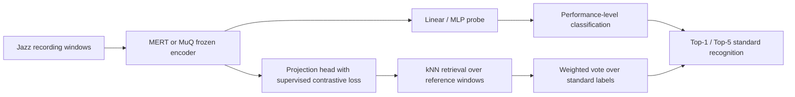
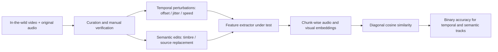
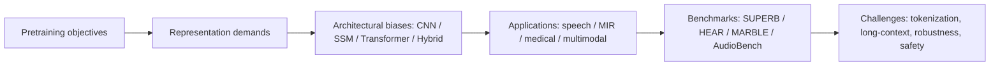

# 语音 / 音频 / 音乐论文速递
## 2026-07-02

> 实际对应 arXiv 更新日：**2026-07-02**  
> 检索范围：`cs.SD + eess.AS`  
> 只放按 ML 顶会审稿口径看，最值得多数读者花时间看的 **5 篇**

## 📋 总览

- 共收录 **5 篇** 相关论文
- 语音医学 / 语音大模型：**1 篇**
- 音乐检索 / 可控声音生成：**2 篇**
- 多模态评测 / 通用音频表征：**2 篇**

今天这批最值得优先看的，不是“又一个更大的音频模型”，而是三条更扎实的主线。第一条是 `DeTAiL` 这篇，它直接质疑“MLLM 会推理就一定更适合医疗语音分类”这种懒惰叙事，结论也很不客气：纯文本 rationale 会乱编，但 hidden state 里确实有可用信号。第二条是音乐与声音控制这边，`Evaluating Pretrained Music Embeddings for Cross-Performance Jazz Standard Recognition` 和 `A Text-Steerable Instrument for Sketching Procedural Soundscapes via Language Models` 代表两种完全不同但都很实用的路线，一个问“基础表征到底能不能顶住即兴爵士的跨演绎检索”，一个问“LLM 控声音这件事，能不能先别吹生成大一统，先把现场可控性做出来”。第三条是评测和基础设施：`AV-SyncBench` 把音画对齐里最容易被混淆的“语义一致”和“时间一致”硬拆开，`From Objectives to Applications` 则是把近几年音频 SSL 的方法、结构、应用和 benchmark 重新整理成一张更有解释力的地图。前者适合做多模态评测的人，后者适合想重新校准自己音频表征认知的人。

## 精选入选规则

- **新意（0-3）**：是不是提出了新的问题拆法、表示接口、评测维度或训练组织方式
- **影响力（0-3）**：是不是贴近语音大模型、语音医学、音乐理解、可控生成、多模态评测这些主线
- **证据强度（0-2）**：有没有像样的 baseline、关键数值、消融或误差分析
- **受众匹配度（0-2）**：对语音大模型 / 语音前端 / 音乐 / 多模态研究者有没有直接启发

分数校准：

- **6**：有信息量，但更像综述补丁、局部工具或边缘问题
- **7**：值得过一遍，至少能带来一个明确判断
- **8+**：建议优先精读

## 总览表

| 方向 | 序号 | 论文 | 评分 | 关键词 |
|---|---:|---|---:|---|
| 语音医学 / 语音大模型 | 1 | Do Multimodal Large Language Models Need Reasoning to Classify Dementia from Speech? | 8.5/10 | dementia, MLLM, rationale distillation, GRPO, hidden-state adaptor |
| 可控声音生成 / 交互式音乐 | 2 | A Text-Steerable Instrument for Sketching Procedural Soundscapes via Language Models | 8/10 | procedural soundscape, live instrument, retrieval backend, 34-field schema |
| 音乐检索 / 音乐表征 | 3 | Evaluating Pretrained Music Embeddings for Cross-Performance Jazz Standard Recognition | 8/10 | jazz standard recognition, MERT, MuQ, supervised contrastive retrieval |
| 多模态评测 | 4 | AV-SyncBench: Decoupled Benchmarking of Temporal and Semantic Audio-Visual Synchronization | 8/10 | audio-visual sync, temporal challenge, semantic challenge, benchmark |
| 通用音频表征 / 综述 | 5 | From Objectives to Applications: Aligning Architectural Biases in Audio Self-Supervised Learning | 7.5/10 | audio SSL, objective-architecture alignment, benchmark taxonomy, AudioLLM |

## 🧠 语音医学 / 语音大模型

### [1] Do Multimodal Large Language Models Need Reasoning to Classify Dementia from Speech?

- **评分**：8.5/10
- **作者/机构**：Liming Wang，Neguine Rezaii，Bradford C. Dickerson，James Glass；MIT CSAIL，Massachusetts General Hospital，Harvard Medical School
- **论文链接**：https://arxiv.org/abs/2607.00260
- **PDF**：https://arxiv.org/pdf/2607.00260.pdf
- **代码链接**：暂无，文中写明 `Code and demo will be released upon acceptance`
- **Demo 链接**：暂无

#### 📌 简介
这篇在问一个很具体但很要命的问题：多模态大模型在痴呆语音分类里，到底需不需要“推理”，以及推理应该用在哪里。作者的答案很克制也很有价值: 直接依赖文本 rationale 往往会 hallucinate，但如果把这些 rationale 只当成激活 hidden state 的条件，再用一个小 adaptor 去读隐藏表示，效果反而稳定得多。

#### ☠️ 毒舌点评
这篇的好处是没把“医学 + MLLM + reasoning”写成 PPT。它认真承认了一个很多人不愿意承认的事实：生成得像回事的解释，不等于解释真的有用。实验也不是只拿一个 zero-shot baseline 糊弄，`BERT+Whisper`、`Whisper`、`LoRA`、`MLP adaptor`、`Qwen2.5-Omni-7B`、`Qwen3-Omni-30B` 都拉进来了。对做语音医学、speech LLM、可解释分类的人，这篇值得读。

#### 🔧 技术方案
- **模型解决的问题**：传统自动痴呆分类要么靠专用音频/文本模型，要么把大模型当黑盒提示器，但后者很容易产出不忠实的解释。作者要补的是“如何既利用 reasoning MLLM 的内部表征，又不把诊断决策直接绑死在它生成的理由文本上”。
- **模型架构**：
  - **输入**：语音音频 `x`，转写文本 `t`，以及预测时不暴露标签的 prompt。
  - **输出**：认知状态标签 `ŷ`，可选的解释文本 `ẑ`，以及最终 adaptor 分类分数。
  - **主干**：`Qwen2.5-Omni-7B / Qwen3-Omni-30B` 这类 reasoning MLLM，加上后接的小型 MLP adaptor。
  - **关键模块**：
    - `rationale distillation`：用教师模型生成标签条件解释，再蒸馏给学生。
    - `GRPO`：对输出格式和标签正确性做强化后训练。
    - `nonlinear adaptor`：对 MLLM 最后一层 hidden states 做 mean-pooling 后接两层全连接 MLP。
    - `teacher/self rationale conditioning`：既看教师解释，也看模型自生成解释。
  - 信号流不是“音频 -> 一次生成 -> 结束”，而是三段式：先蒸馏解释，再 RL 拉齐输出行为，最后用解释条件下的隐藏状态做判别，而不是只信文本答案本身。

- **关键设计 / 核心创新**：
  - 关键不是让模型“多解释”，而是让解释只作为激活内部表征的条件。
  - 文中明确比较了 `LoRA` 路线和 `MLP adaptor` 路线，结论是后者在这个任务上更稳，说明 MLLM 内部已经编码了痴呆相关信息，只是文本生成头不可靠。
  - `teacher` 和 `self` 两种 rationale conditioning 都做了，避免把收益全归功于外部大教师。
- **训练 / 推理策略**：
  - `SFT` 使用学习率 `1e-4`，训练 `20` 个 epoch。
  - `GRPO` 使用组大小 `G=4`、学习率 `1e-5`、micro-batch size `8`、`2` 张 `A6000`、`1` 个 epoch。
  - `LoRA` 设定为 rank `128`、scaling `32`。
  - 推理时使用 `top-p=0.99`、temperature `1`、最大生成长度 `4096` token。
  - adaptor 本身是两层全连接 + ReLU，隐藏维度 `768`。论文没有报延迟，但设置明显偏离线医疗分析，不是 streaming 路线。

#### 📊 实验结果
- 数据集：`ADReSS` 和私有 `LEADS`
- `ADReSS` in-domain：
  - 最强传统 multimodal baseline `BERT+Whisper` 达到 `94.1% AUC / 87.5% Acc`
  - `Qwen2.5-Omni-7B` zero-shot 只有 `47.6% AUC / 52.1% Acc`
  - `LoRA + Distilled GRPO` 到 `90.5% AUC / 85.3% Acc`
  - `DeTAiL (self) + Qwen2.5-Omni-7B` 到 `93.6% AUC / 89.5% Acc`
- `LEADS` 10-fold：
  - `MLP + Qwen3-Omni-30B` 拿到最强 `96.6±4.3` 两分类 AUC，`93.8±7.1` CI-only AUC，`91.5±5.6` 三分类 AUC
  - `DeTAiL (teacher)` 为 `91.9±7.1 / 84.4±12.4 / 86.1±6.8`
  - `DeTAiL (self)` 为 `91.3±6.2 / 86.3±10.5 / 84.7±5.4`
  - 同样的 `Distilled GRPO` 下，`DeTAiL` 比 `LoRA` 的 `86.2±5.9` 两分类 AUC 高约 `+5.1`
- 跨域：
  - `ADReSS -> LEADS` 时，`DeTAiL` 为 `85.3±10.3` AUC，明显高于 `MLP None 77.5±16.2`
  - `LEADS -> ADReSS` 时，`DeTAiL` 为 `82.3±5.2`，也高于 `MLP None 78.2±6.0`
- 消融：
  - 输入模态消融里，`Qwen2.5-Omni-7B (A)` 在 `LEADS` 只有 `66.3±3.9`
  - `Qwen2.5-Instruct-7B (T)` 到 `87.3±6.4`
  - `Qwen2.5-Omni-7B (A+T)` 为 `94.4±6.5`
  - 说明 audio-only 真不够，text 和 multimodal 证据都重要
- baseline / 对比结论：这篇没有把 reasoning 神化。最强 baseline 依旧是精心构造的 `BERT+Whisper` 或更大 `Qwen3-Omni-30B + MLP`，但 `DeTAiL` 至少证明了“rationale-conditioned hidden state adaptor”比直接用 LoRA 或直接用文本解释更靠谱。

#### 💡 为什么值得看
这篇最值得看的地方，是它把“解释”和“决策”拆开了。很多医疗大模型论文把自然语言解释当成 gold，但这篇告诉你：解释文本可以不可信，隐藏状态仍然有用。这个观点对语音医学之外的高风险语音分类任务也有外溢价值。

## 🎼 音乐检索 / 可控声音生成

### [2] A Text-Steerable Instrument for Sketching Procedural Soundscapes via Language Models

- **评分**：8/10
- **作者/机构**：Prabal Gupta；Rama Labs，Kitchener, Ontario, Canada
- **论文链接**：https://arxiv.org/abs/2607.00309
- **PDF**：https://arxiv.org/pdf/2607.00309.pdf
- **代码链接**：**代码已开源** https://github.com/prabal-rje/latentscore
- **Demo 链接**：https://latentscore.com

#### 📌 简介
这篇其实不想解决“高保真 text-to-audio”那个老战场，它要做的是一个能在现场真正演的、文本可控的 procedural soundscape instrument。核心思路非常务实：LLM 不直接生成波形，只生成一个 `34` 字段的可解释配置；后台 procedural synth 持续出声，新的配置在后台慢慢解，再无缝 crossfade 进来。

#### ☠️ 毒舌点评
这篇不像 SOTA paper，更像一个做对了方向的研究型系统。好处是目标非常清楚：要可演、可改、可复现，而不是 demo 一段听起来像样就算赢。坏处也很清楚：它牺牲了 timbral generality，拿 procedural synth 的受限音色空间换延迟和可控性。对做交互音乐、声音设计、语言控制系统的人，这篇比很多空喊“LLM 作曲”更值。

#### 🔧 技术方案
- **模型解决的问题**：现有 text-to-audio 往往是“一次性生一段波形”，推理延迟长、结果黑盒、改一个参数就得重生。作者要补的是“如何把文本控制做成一个可持续演奏、可局部修正、可 CPU 运行的声音乐器”。
- **模型架构**：
  - **输入**：自然语言 scene prompt，例如情境描述，以及后续相对参数修改指令。
  - **输出**：`34` 字段的 synthesizer configuration，再由确定性 procedural engine 渲染成持续音频。
  - **主干**：`live generator runtime + schema-constrained controller + procedural synthesizer`
  - **关键模块**：
    - `34-field configuration schema`：包含 `8` 个全局参数、`6` 个 orchestration layers、`5` 个 spatial/texture、`10` 个 melody 字段、`5` 个 harmony 字段。
    - `Embedding Lookup` 快速后端：离线构建检索库，在线约 `0.3s` 配置生成。
    - hosted LLM backend：`Gemini 3 Flash Preview`、`Claude Opus 4.5` 等输出同一 schema。
    - `270M` 本地 SFT 模型：尝试本地 expressive mode。
    - `live generator`：当前配置持续发声，新的配置后台解析，完成后 crossfade。
  - 信号流是“文本 -> 配置 -> 渲染”，不是“文本 -> 波形”。而且 performer 还能发 `Step(+1)`、`Step(-2)` 这种相对编辑命令，对场景做微调。

- **关键设计 / 核心创新**：
  - 最大亮点不是某个模型，而是把“语言到声音”的映射改造成可玩接口。
  - schema 的设计很克制：大多数合法组合都要“至少能听”，这是为了 live performance，不是为了最大表达自由。
  - retrieval backend 把 LLM 成本前置到了离线数据构建阶段，这点特别工程化。
- **训练 / 推理策略**：
  - 离线用 `Common Pile` 文本语料蒸出约 `10,500` 个 scene descriptions。
  - 用 `Gemini 3 Flash Preview` 为每个 scene 生成 `5` 个候选配置，再用 `LAION-CLAP` 选最好的一条。
  - 本地模型是 `Gemma 3 270M`，SFT 后仍然走 grammar-constrained 输出。
  - 推理分三路：`Embedding Lookup` 走 CPU 快速路径；外部 API 路线可自动回退；本地 `270M` 路线延迟很高，更多是实验路线。

#### 📊 实验结果
- benchmark：`200` 个 held-out prompts
- `CLAP / 结构有效率 / 总延迟` 对比：
  - `Random Baseline`：`0.139 / 100% / 0.70s`
  - `Base Untrained (270M)`：`0.117 / 100% / 59.7s`
  - `SFT Fine-tuned (270M)`：`0.140 / 91% / 100.2s`
  - `Claude Opus 4.5`：`0.137 / 100% / 12.6s`
  - `Gemini 3 Flash Preview`：`0.158 / 89% / 6.5s`
  - `Embedding Lookup`：`0.163 / 100% / 1.2s`
- 结论非常直接：
  - `Embedding Lookup` 同时拿到最高 `CLAP 0.163` 和最低总延迟 `1.2s`
  - `Gemini` 的有效输出不错，但 `11%` 时候 schema 会炸，所以现场需要 fallback
  - `Claude` 虽然 `100%` 合法，但 `CLAP 0.137` 还低于随机 `0.139`
  - 本地 `270M` SFT 只比随机好一点点，而且平均生成时间约 `100s`
- baseline / 对比判断：这不是“LLM 越大越强”的故事。这个任务里最强 baseline 不是 API 模型，而是检索式 fast backend。换句话说，声音控制的实时性把大模型神话直接打回原形。

#### 💡 为什么值得看
这篇值得看的地方，是它把“声音生成系统到底是生成器还是乐器”这个问题回答得很清楚。你如果真要做实时交互，很多时候先把配置空间和控制接口设计对，比盲目追求端到端波形生成更有用。

### [3] Evaluating Pretrained Music Embeddings for Cross-Performance Jazz Standard Recognition

- **评分**：8/10
- **作者/机构**：Çağrı Eser；Middle East Technical University，Ankara, Turkey
- **论文链接**：https://arxiv.org/abs/2607.00777
- **PDF**：https://arxiv.org/pdf/2607.00777.pdf
- **代码链接**：**代码已开源** https://github.com/cagries/tipofmyear
- **Demo 链接**：项目页同代码仓库

#### 📌 简介
这篇研究一个很刁钻但很真实的 MIR 问题：不同爵士演绎之间，能不能识别出它们其实是同一首 standard。难点不在录音去重，而在即兴、换调、换速度、换编制之后，很多 `10s` 窗口根本听不到明确的主题旋律。作者用 `Jazz Trio Database` 里一个重构后的 `16` 首标准曲子子集，比较 from-scratch `Harmonic CNN`、冻结 `MERT/MuQ` probing，以及带 supervised contrastive projection 的 retrieval。

#### ☠️ 毒舌点评
这篇不是 flashy 大模型 paper，但问题挑得很准。很多音乐表征工作喜欢在舒服 benchmark 上刷分，这篇专门把模型拖进一个容易翻车的场景：即兴爵士、跨表演、强 performer bias。结论也不粉饰：现有 embedding 确实有用，但 top-1 还是很难，最近邻经常先认出演奏者，再认曲子。

#### 🔧 技术方案
- **模型解决的问题**：传统 audio fingerprinting 更擅长“是不是同一条录音”，不擅长“是不是同一首歌的不同演绎”。这篇要解决的是在强 improvisation 条件下做 tune-level retrieval，而不是 recording-level retrieval。
- **模型架构**：
  - **输入**：`24kHz` mono 爵士三重奏录音，切成 `10s` 或 `20s` 窗口，hop 为 `5s`。
  - **输出**：standard label，或者 query window 对 reference windows 的检索排序。
  - **主干**：三条路线并行比较。
  - **关键模块**：
    - `Harmonic CNN` from-scratch baseline。
    - 冻结 `MERT-v1-95M` 和 `MuQ-large` embedding，接 linear probe 或 MLP probe。
    - `kNN retrieval + supervised contrastive projection`，通过投影层抑制 same-performer bias。
  - 信号流上，retrieval 路线不是直接对原 embedding 最近邻，而是先把 `MERT/MuQ` embedding 投到一个受 standard label 监督的 retrieval space，再做余弦加权投票。

- **关键设计 / 核心创新**：
  - 这篇的创新不在 backbone，而在任务构造和 failure mode 拆解。
  - 用 leave-one-performance-per-standard 协议，明确逼模型跨表演泛化。
  - 引入 `Same Group Frequency` 指标，量化 retrieval 是不是总把同一乐队风格错当同一首曲子。
- **训练 / 推理策略**：
  - 数据从 `1294` 段 JTD 演绎中筛到 `16` 个 standards、`79` 个 performances、`27` 个 unique groups。
  - 只保留每首歌至少 `4` 个不同 group 的演绎，减少无意义泄漏。
  - probe 路线做 frozen encoder + 小头训练；retrieval 路线额外优化 supervised contrastive loss，文中设 `λ=0.2`。
  - 推理时把每个 performance 的窗口分数汇总成 performance-level `Top-1 / Top-5`。

#### 📊 实验结果
- 数据集统计：
  - `16` 个 standards
  - `79` 个 performances
  - 平均每首 `4.93` 个演绎
- `10s` 窗口主结果：
  - `Harmonic CNN`：window acc `0.034`，performance `Top-1 0.031`，`Top-5 0.359`
  - `MERT + linear probe`：`0.074 / 0.094 / 0.359`
  - `MERT + MLP probe`：`0.096 / 0.094 / 0.422`
  - `MuQ + linear probe`：`0.085 / 0.078 / 0.469`
  - `MuQ + MLP probe`：`0.108 / 0.078 / 0.438`
  - `MuQ + kNN`：`0.060 / 0.078 / 0.359`
- 窗长消融：
  - `MuQ + MLP probe` 从 `10s` 换到 `20s`，`Perf. Top-1` 从 `0.078` 升到 `0.125`
  - `Top-5` 也从 `0.438` 升到 `0.469`
  - 说明更长上下文确实能补一些“只听到 solo 碎片”的问题
- retrieval 偏差分析：
  - `MERT + kNN` 的 `Same Group Freq` 为 `0.336`
  - 加 `SupCon` 后降到 `0.109`，`Top-5` 提升到 `0.469`
  - `MuQ + kNN` 从 `0.328` 降到 `0.156`，`Top-1` 从 `0.078` 提到 `0.109`
- baseline / 对比结论：pretrained embedding 明显优于 `Harmonic CNN` baseline，但说它已经解决任务还太早。最强 `Top-1` 也只有 `0.125`，说明“会检索风格相近片段”不等于“真认出同一首 standard”。

#### 💡 为什么值得看
如果你做音乐 foundation model，这篇很适合作为 stress test。它逼你看见一个尴尬事实：不少通用音乐 embedding 在 top-k 看起来不错，但真正要跨表演识别作品身份时，仍然很容易先学到 performer bias。

## 🔍 多模态评测 / 通用音频表征

### [4] AV-SyncBench: Decoupled Benchmarking of Temporal and Semantic Audio-Visual Synchronization

- **评分**：8/10
- **作者/机构**：Tianhong Zhou，Mingyang Han，Boyu Li，Yuxuan Jiang，Jiaxin Ye，Dongxiao Wang，Haoxiang Shi，Kunpeng Wang，Jun Song，Cheng Yu，Bo Zheng；Alibaba Group，Tsinghua University，Fudan University
- **论文链接**：https://arxiv.org/abs/2607.00726
- **PDF**：https://arxiv.org/pdf/2607.00726.pdf
- **代码链接**：项目页公开代码与数据入口，暂未见独立 GitHub 仓库
- **Demo 链接**：https://fgt7t6g.github.io/AV-SyncBench

#### 📌 简介
这篇 benchmark 文最重要的点是把音画同步拆成两件事：`temporal consistency` 和 `semantic consistency`。过去很多方法要么只看 offset detection，要么只看 cross-modal semantic retrieval，于是一个模型到底擅长“对时间敏感”还是“会认语义”，经常被混成一锅。`AV-SyncBench` 就是来拆锅的。

#### ☠️ 毒舌点评
这类 benchmark 文章最怕两件事：数据泄漏和评测维度设计不干净。作者至少在设计上是认真的，`global offset / local jitter / speed change` 和 `timbre / sound-source replacement` 两条挑战线分得很清楚，还专门用 in-the-wild 视频 + 人工校验绕开常见预训练数据泄漏。缺点也有，它还是偏短视频片段，object sound 的可控编辑明显弱于 voice/music。

#### 🔧 技术方案
- **模型解决的问题**：现有音画特征评测常把“语义相关”与“时间对齐”耦在一起，导致模型强项看不清。`AV-SyncBench` 要补的是一个能独立诊断 temporal ability 与 semantic ability 的 benchmark。
- **模型架构**：
  - **输入**：in-the-wild 视频与对应音频。
  - **输出**：在 temporal challenge 和 semantic challenge 下的 binary accuracy。
  - **主干**：benchmark pipeline，而不是新特征模型。
  - **关键模块**：
    - 数据清洗：先用 `Gemini 3 Flash` 过滤明显不对齐样本，再由 `5` 位标注者人工审核。
    - temporal challenges：`global offset`、`local jitter`、`global speed change`
    - semantic challenges：`voice timbre replacement`、`sound-source replacement / timbre editing`
    - 评测对象：`Synchformer`、`ImageBind`、`CAV-MAE-Sync`、`SparseSync`、`CAV-MAE`
  - 评测信号流非常统一：原视频对原音频、扰动音频、语义编辑音频分别切成固定片段，提取嵌入后用对角余弦相似度做二分类式判断。

- **关键设计 / 核心创新**：
  - 把时间扰动和语义编辑彻底解耦，这是这篇最大的价值。
  - 数据刻意避开 `AudioSet`、`VGGSound` 那类常见训练源，降低 benchmark 被预训练记住的风险。
  - 语义编辑部分用 `OpenVoice V2` 和 `DDSP`，尽量保证 timing 不变、语义变掉。
- **训练 / 推理策略**：
  - 这篇不训练新模型，重点是标准化评测协议。
  - 所有模型都用官方发布代码和官方 checkpoint，不做额外 fine-tune。
  - 视频统一 `25 FPS`，音频统一 `16kHz`，切成 `0.64s` 小块。
  - 报告的是各 challenge 上的 binary accuracy，不玩花哨指标替代。

#### 📊 实验结果
- 数据规模：
  - `3,269` 个高质量视频
  - `38,390` 个样本
  - 覆盖 `Voice / Music / Sound` 三大域、`10` 个场景
- temporal 挑战总体：
  - `Synchformer` overall `0.607`
  - `ImageBind` overall `0.602`
  - `CAV-MAE-Sync` overall `0.486`
  - `SparseSync` overall `0.707`
  - `CAV-MAE` overall `0.677`
- 细分 temporal：
  - `500ms` global offset 上，`Synchformer 0.662` 最强
  - `0.83x` speed 变化上，`CAV-MAE 0.847` 最强
  - `L1 (30-70ms)` jitter 上，`SparseSync 0.729`，`CAV-MAE 0.666`
  - `L3 (400-600ms)` jitter 上，`CAV-MAE 0.832` 反超
- semantic timbre 编辑：
  - overall：`ImageBind 0.859` 最强，`CAV-MAE 0.826` 第二
  - voice avg：`ImageBind 0.935`，明显高于 `Synchformer 0.750`
  - instrument avg：`CAV-MAE 0.859`，略高于 `Synchformer 0.842`
- category 平均：
  - `SparseSync` 的综合平均 `0.673` 最强
  - `CAV-MAE` 为 `0.656`
  - `Synchformer` 为 `0.641`
- baseline / 对比结论：没有一个模型全能。`SparseSync` 更偏时间，`ImageBind` 更偏语义，`CAV-MAE` 在某些音乐和 speed 设置上 surprisingly 强。这个 benchmark 最有价值的地方，就是把这种 trade-off 摊开给你看。

#### 💡 为什么值得看
如果你做音画检索、V2A、A2V、T2AV，或者只是想选一个 audio-visual encoder，这篇值得看，因为它告诉你“同步”不是一个单指标词。以后再有人拿一个 retrieval 分数就说自己 feature 很同步，你至少可以先问：你测的是语义，还是时间？

### [5] From Objectives to Applications: Aligning Architectural Biases in Audio Self-Supervised Learning

- **评分**：7.5/10
- **作者/机构**：Kele Xu，Yulu Fang，Boda Zhou，Yulin Sun，Qisheng Xu，Qiya Song，Jin Zhang，Cheng Yang，Huaimin Wang；HTML 摘要页未展开逐位机构，但通讯邮箱域名为 `nudt.edu.cn`，可确认来自国防科技大学相关团队
- **论文链接**：https://arxiv.org/abs/2607.00387
- **PDF**：https://arxiv.org/pdf/2607.00387.pdf
- **代码链接**：**代码已开源** https://github.com/colaudiolab/Awesome-Self-Supervised-Audio-Learning
- **Demo 链接**：同代码仓库

#### 📌 简介
这不是一篇新模型论文，而是一篇对音频 SSL 近年版图的重排综述。作者不按时间线讲，也不按“谁家模型”讲，而是按 `objective -> architectural bias -> downstream application` 来组织。这个角度的好处是，你终于能更清楚地看到：为什么 contrastive learning、masked reconstruction、discrete token prediction、multimodal alignment 会自然偏向不同的 backbone 和不同的任务。

#### ☠️ 毒舌点评
综述最怕两种死法：一种是目录式抄书，另一种是热点关键词大拼盘。这篇比一般 survey 好一点，因为它确实尝试给出一个解释框架，不只是列方法名。可它也有综述的老毛病：没有新的 baseline 打榜，也没有新实验裁判，所以最终说服力还是靠作者的整理能力，不是靠新证据。适合想重建知识地图的人，不适合拿来当 SOTA 结论本身。

#### 🔧 技术方案
- **模型解决的问题**：这篇解决的不是单个建模任务，而是“音频 SSL 这么多 pretraining objective、backbone 和应用，到底该怎么用一套统一视角去理解它们之间的匹配关系”。
- **模型架构**：
  - **输入**：已有音频 SSL 文献、代表模型、benchmark 与应用场景。
  - **输出**：一个按 objective-demand-architecture-application 重排的分析框架。
  - **主干**：五类 pretraining objective 与四类 backbone family 的对应关系分析。
  - **关键模块**：
    - `5` 类目标范式：auxiliary tasks、contrastive learning、generative reconstruction、discrete token prediction、multimodal alignment
    - `4` 类主干偏置：CNN、recurrent / SSM、Transformer、hybrid
    - `5` 类应用区：speech、environmental sound、MIR、medical/bioacoustics、multimodal audio understanding
    - benchmark taxonomy：`SUPERB`、`SUPERB-SG`、`HEAR`、`MARBLE`、`AudioBench` 等
  - 它的逻辑链不是训练图，而是分析图：先定义 objective 对表征的压力，再解释为什么某些 backbone 天然更匹配，再回到应用和 benchmark 检查这种匹配是否成立。

- **关键设计 / 核心创新**：
  - 最大价值是“从 objective 出发解释 architecture”，而不是反过来按模型名记忆。
  - 文中强调音频 SSL 正从 task-specific encoder 走向 unified audio understanding 和 native AudioLLM front-end。
  - 对 `tokenization bottleneck`、`perceptual bottleneck`、long-context efficiency、multimodal robustness 的总结比较到位。
- **训练 / 推理策略**：
  - 这不是新模型训练论文，严格说没有统一的训练或推理流程。
  - 更准确的说法是：作者把既有训练范式拆成 `5` 类目标，把评测协议拆成 linear probing、full fine-tuning、low-resource、zero-shot / cross-modal transfer 等几类推理与验证范式。
  - 因此这篇的“推理策略”价值不在 latency，而在告诉你什么时候该用 frozen encoder、什么时候该看 benchmark suite、什么时候别把 speech SSL 直接套到 music 或 AudioLLM。

#### 📊 实验结果
- 这篇没有提出新的实验 baseline，也没有统一复现实验，所以不能把它写成“又一个 SOTA 提升”。
- 它真正提供的是结构化数字框架：
  - `5` 种 pretraining objective 范式
  - `4` 类 backbone family
  - `5` 类主要应用方向
  - `6+` 类 benchmark / evaluation family
- benchmark / 对比层面的核心整理：
  - speech 侧强调 `SUPERB` 与 `SUPERB-SG`
  - 通用表征侧强调 `HEAR`
  - 音乐侧点名 `MARBLE`
  - AudioLLM 评测侧点名 `AudioBench`
  - 安全与鲁棒性侧讨论 `HearSay` 和 AV robustness benchmark
- 指标层面也给了比较清楚的归类：
  - speech generation 常看 `MOS / MCD`
  - 分类与检测常看 `Accuracy / F1 / mAP`
  - ASR 常看 `WER`
  - 多模态检索常看 `Recall@K`
  - caption / generation 常看 `BLEU / CIDEr`
- baseline / 对比结论：这篇的价值不是替你挑出唯一最好模型，而是提醒你别再把 `wav2vec 2.0 / HuBERT / WavLM / BEATs / CLAP / ImageBind / AudioLLM` 这些路线混成一个抽象的“大音频模型”。它们背后的 objective 与 architecture 偏置本来就不同。

#### 💡 为什么值得看
如果你最近在做音频表征、AudioLLM front-end、music SSL 或多模态音频理解，这篇适合拿来做一次脑内整理。它不能代替实验，但能帮你少走一点“看了很多模型名，其实没形成判断框架”的弯路。

## 最后结论

今天最值得优先看的顺序，我会给成这样：

1. `Do Multimodal Large Language Models Need Reasoning to Classify Dementia from Speech?`
2. `A Text-Steerable Instrument for Sketching Procedural Soundscapes via Language Models`
3. `Evaluating Pretrained Music Embeddings for Cross-Performance Jazz Standard Recognition`
4. `AV-SyncBench: Decoupled Benchmarking of Temporal and Semantic Audio-Visual Synchronization`
5. `From Objectives to Applications: Aligning Architectural Biases in Audio Self-Supervised Learning`

如果你只看一篇，优先看 `DeTAiL`。它最接近“方法、实验、结论三者都站得住”。如果你做交互式声音系统，就直接看 `LatentScore` 这篇；它没那么学术炫，但很可能比一堆端到端生成大词更接近能用的系统。做音乐表征的人别跳过 jazz retrieval，那篇会很快暴露你当前 embedding 到底是在认音乐内容，还是在认表演风格。至于 `AV-SyncBench` 和 audio SSL survey，一个适合拿来校准评测，一个适合拿来校准认知，都是基础设施，但都不是水货。
