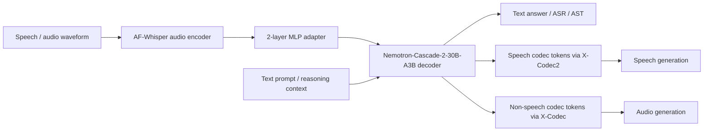
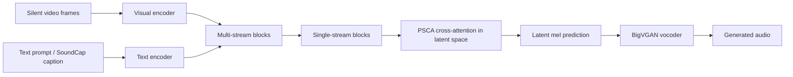
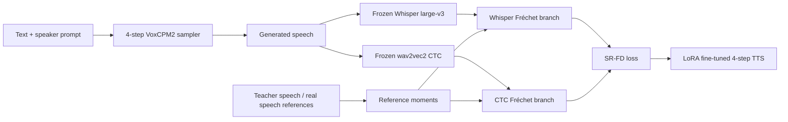

# 语音 / 音频 / 音乐论文速递
## 2026-07-07

> 实际对应 arXiv 更新日：**2026-07-07**  
> 检索范围：`cs.SD + eess.AS + 直接相关 cs.MM cross-list`  
> 只放按 ML 审稿口径看，最值得多数语音 / 音频 / 音乐研究者花时间看的 **5 篇**

## 📋 总览

- 共收录 **5 篇** 相关论文
- 统一音频大模型 / 音频智能：**1 篇**
- 音乐理解评测 / benchmark methodology：**1 篇**
- 视频到音频生成：**1 篇**
- 音频数据工程 / 自动标注：**1 篇**
- TTS 训练目标 / few-step 强化：**1 篇**

今天这批最值得先看的，不是“谁又堆了一个更大的多模态模型”，而是五条相当不同、但都很实用的路线。`Unified Audio Intelligence Without Regressing on Text Intelligence` 真正想解决的是统一音频输入输出后，文本智能别掉坑里；`Music I Care About` 则把音乐 benchmark 从静态题库，推进到“给你一批自己的曲库，我自动生一套多模态评测”；`Flowley` 是单阶段 video-to-audio，重点不在参数吹得多大，而在它想把语义对齐和时间同步一起塞进 latent cross-attention；`TriA` 是非常典型的数据工程论文，解决的是垂类场景 AC 数据缺标注；`SR-FD` 则是很实用的 TTS 后训练思路，目标明确到近乎粗暴: 不改部署图，只用 LoRA 把 4-step flow-matching TTS 的可懂度拉回来。

如果只看“值得优先精读”的程度，我会把今天的顺序排成：`Audex` 第一，`MusICA-MetaBench` 第二，`SR-FD` 第三。前者是统一音频智能里少数真敢拿文本能力回归做硬约束的；中间这篇 benchmark methodology 虽然不做新模型，但对音乐理解评测的启发非常直接；最后这篇 TTS 论文不是花哨路线，却非常贴近真实部署场景。

## 精选入选规则

- **新意（0-3）**：是不是提出了新的接口、训练组织或问题拆法，而不是老模块重新拼接
- **影响力（0-3）**：是不是贴近语音大模型、TTS、音频生成、音乐理解或数据工程主线
- **证据强度（0-2）**：有没有像样的 baseline、消融、关键数值和统计检验
- **受众匹配度（0-2）**：对语音大模型 / 语音生成 / 音频系统 / 音乐理解研究者有没有直接借鉴价值

分数校准：

- **6.5**：有信息量，但更像局部分析框架或工程补丁
- **7-8**：值得过一遍，能带来具体启发
- **8.5+**：建议优先精读，方法和证据都够硬

## 总览表

| 方向 | 序号 | 论文 | 评分 | 关键词 |
|---|---:|---|---:|---|
| 统一音频大模型 | 1 | Unified Audio Intelligence Without Regressing on Text Intelligence | 9/10 | Audex, unified audio-text LLM, no text regression, codec, 157.4B audio tokens |
| 音乐理解评测 | 2 | Music I Care About: Automated Multimodal Benchmarking of LLM Music Perception Skills on (Almost) Any Music | 8.5/10 | MusICA-MetaBench, MusicXML, music21, multimodal QA, custom benchmark |
| 视频到音频生成 | 3 | Precise Video-to-Audio Generation with Cross-Modal Alignment in Latent Space | 8/10 | Flowley, PSCA, SoundCap, latent alignment, single-stage V2A |
| 音频数据工程 | 4 | TriA Pipeline: A Large-Scale Automatic Audio Annotation Pipeline For Audio Classification In Specific Scenarios | 7.5/10 | auto annotation, AAD, AED, BEATs, 2130h, scenario AC |
| TTS 训练目标 | 5 | Fréchet Distance Loss on Speech Representations for Text-to-Speech Synthesis | 8/10 | SR-FD, VoxCPM2, Whisper anchor, few-step TTS, LoRA |

## 🤖 统一音频大模型 / 音频智能

### [1] Unified Audio Intelligence Without Regressing on Text Intelligence

- **评分**：9/10
- **作者/机构**：Zhifeng Kong, Sang-gil Lee, Jaehyeon Kim, Boxin Wang, Zihan Liu, Sungwon Kim, Yang Chen, Arushi Goel 等；**NVIDIA**
- **论文链接**：https://arxiv.org/abs/2607.05196v2
- **PDF**：https://arxiv.org/pdf/2607.05196v2.pdf
- **Demo / Checkpoints**：https://huggingface.co/collections/nvidia/nemotron-labs-audex

#### 📌 简介
这篇的核心卖点不是“我们也做了个统一音频大模型”，而是它非常明确地把约束写成一句实话：统一音频输入输出以后，文本智能别明显退化。作者提出的 `Audex` 基于 `Nemotron-Cascade-2-30B-A3B`，做成一个同时支持语音识别、语音翻译、音频理解、语音生成、语音到语音和文本到音频的统一 audio-text model。真正值得注意的是，它不是只拿音频 benchmark 刷榜，而是把 `text-only reasoning` 一起摆上台面，直接和原始 text backbone 对比。

#### ☠️ 毒舌点评
这篇比大多数“全模态统一模型”靠谱得多，因为它至少承认并正面处理一个常被回避的问题：多模态一加进去，文本能力往往会掉。很多论文在这里装瞎，只报 multimodal 结果；这篇直接把 `IMO AnswerBench`、`AIME 2026`、`HMMT Feb 2025` 这类文本任务和音频任务并列给出来，证据强度明显高一档。缺点也很直白：它不是从零发明新主干，而是强力工程整合；但如果你关心统一 audio LLM 的真实落地路径，这恰恰是优点，不是缺点。

#### 🔧 技术方案
- **模型解决的问题**：
  过去的音频大模型常常只解决一侧能力，例如 ASR 很强但不会生成，或者能生成语音但理解和推理能力弱；更麻烦的是，把音频 I/O 硬塞进强文本模型后，文本智能会退化。`Audex` 解决的是“如何构建一个统一音频输入输出的大模型，同时把 text intelligence 基本保住”。
- **模型架构**：
  - **输入**：`16 kHz` 语音 / 音频波形，以及普通文本输入。
  - **输出**：文本回答、ASR / AST 结果、语音生成、音频生成、语音到语音输出。
  - **主干**：`Nemotron-Cascade-2-30B-A3B` decoder-only LLM，外接音频编码和 codec token 接口。
  - **关键模块**：
    - `AF-Whisper` 音频编码器：每 `30s` 产生约 `25 Hz x 1280` 表征。
    - `2-layer MLP adapter`：把音频特征投到 text embedding space。
    - `X-Codec2` speech codec：约 `50 token/s`，词表 `65536`。
    - `X-Codec` 非语音 codec：取前 `4` 层 RVQ，约 `200 token/s`，词表 `4096`。
    - 扩展总词表到 `204805`，padding 后 `205312`，从而统一 speech / non-speech / text token 接口。
- **信号流**：

- **关键设计 / 核心创新**：
  - 不是简单做 audio encoder + LLM，而是把 speech 和 non-speech generation 统一到 codec token 接口里。
  - 训练目标从一开始就包含“别把 text-only backbone 练废”，这在统一多模态模型里反而少见。
  - 语音和环境声分别用不同 codec 设计，避免“一把梭”导致语音和非语音都不够好。
- **训练 / 推理策略**：
  - 训练数据规模很大：`157.4B audio tokens + 320.5B text tokens`，总计 `477.9B` tokens。
  - 先做多阶段 `SFT`，再接 text-only Cascade RL 与多域 on-policy distillation。
  - 训练使用 `512 NVIDIA H100`，`BF16` 精度，说明这不是小作坊实验。
  - TTS / TTA 推理里还单独调了 CFG，文中选的 `λ = 1.5`，在 TTS WER 和 TTA quality 间做折中。

#### 📊 实验结果
- 文本能力对比原始 text backbone `Nemotron-Cascade-2`：
  - `IMO AnswerBench`：`81.1` vs `79.3`
  - 论文正文明确写到多个 text-only benchmark 上是“highly comparable”，不是典型多模态退化。
- ASR / AST：
  - `OpenASR avg WER 6.82`
  - `Noisy LibriSpeech avg WER 2.92`
  - `Fleurs multilingual ASR avg WER 5.11`
  - `Fleurs AST avg BLEU|COMET = 34.0 | 86.9`
- 语音生成：
  - `Seed-TTS-Eval fixed voice WER 1.70`
  - 文中同时给了 prompting / fixed voice 版本，说明不是只会单一设定。
- 音频理解与音频生成：
  - `MMAU / MMAR / MMSU = 75.6 / 63.2 / 63.4`
  - `Audio Entailment = 94.4 / 95.6`
  - TTA 上 `FDopenl3`：`AudioCaps 66.9`，`SongDescriber 62.7`
- baseline / 对比讨论：
  - 论文把 `Qwen3-Omni-30B-A3B-Thinking`、原始 `Nemotron-Cascade-2-30B-A3B` 等都拉进主表。
  - 真正关键的 baseline 不是别家音频模型，而是它自己的 text backbone，因为这直接验证“有无 regression”。
  - 这篇最强的证据不是某个单点榜单，而是它在文本、ASR、AST、audio understanding、TTS、TTA 上同时没拉胯。

#### 💡 为什么值得看
如果你做统一语音大模型，这篇最值得看的不是模块名，而是它把任务目标定得非常务实：先别把文本智能毁掉，再谈统一音频输入输出。很多“all-in-one” 模型都死在这个问题上；`Audex` 至少证明了，在足够大的数据和工程预算下，这条路不是空想。

#### 评分：9/10
理由：方法未必最优雅，但问题定义准确、工程闭环完整、实验覆盖硬，而且真碰了“多模态不回归文本”这个难点。

## 🎼 音乐理解评测 / Benchmark Methodology

### [2] Music I Care About: Automated Multimodal Benchmarking of LLM Music Perception Skills on (Almost) Any Music

- **评分**：8.5/10
- **作者/机构**：Tomáš Sourada, Katia Vendrame, Jan Hajič；**Charles University / Brno University of Technology**
- **论文链接**：https://arxiv.org/abs/2607.06015v1
- **PDF**：https://arxiv.org/pdf/2607.06015v1.pdf
- **代码链接**：https://github.com/tomsouri/MusICA-MetaBench-preprint

#### 📌 简介
这篇不是做新音乐模型，而是做一条非常像样的 benchmark pipeline：给定用户自己的音乐数据，它可以自动生成一套多模态、多选择题、可统计检验的音乐感知 benchmark。论文的核心对象叫 `MusICA-MetaBench`。它支持从 `audio`、`MusicXML / symbolic`、`sheet image` 三类模态派生问题，用 `music21` 从 `MusicXML` 中程序化抽 ground truth，再把同一首曲子的不同模态都变成统一的 QA 测试。

#### ☠️ 毒舌点评
这篇的价值不在“某个模型 accuracy 又涨了几点”，而在它准确戳中音乐 benchmark 的老问题：静态题库老得快、覆盖死、很多题其实不用真听也能答。作者做得最聪明的一点，是把 benchmark 变成“生成机制”而不是“固定榜单”。缺点也有：它本质上是 methodology，不是新模型；如果你只想看新的 music LLM 架构，这篇不会让你兴奋。但如果你真在做音乐理解评测，这篇比很多刷榜稿实用得多。

#### 🔧 技术方案
- **模型解决的问题**：
  现有音乐 benchmark 往往只覆盖单一模态，或者题目本身并不真的要求模型感知音乐内容。`MusICA-MetaBench` 解决的是“如何基于任意用户提供的音乐数据，自动生成真正依赖音乐感知、而且跨模态可比较的 benchmark”。
- **模型架构**：
  - **输入**：用户提供的音乐数据，可以是 `audio`、`MusicXML`、`ABC / symbolic`、`sheet image` 等，只要能对齐到同一个作品。
  - **输出**：多选择题 benchmark，默认每题 `5` 个选项，含 `NOTA`。
  - **主干**：benchmark generation pipeline，而不是新的 music model。
  - **关键模块**：
    - `Question template design`：围绕音乐理论中的 pitch、rhythm、relation 等感知能力设计模板。
    - `Ground-truth extraction`：从 `MusicXML + music21` 自动抽答案和 distractor。
    - `Multimodal instantiation`：同一问题可映射到音频、图像、符号三模态。
    - `Benchmark size calibration`：通过统计显著性确定需要多少题才够比较模型。
- **信号流**：

- **关键设计 / 核心创新**：
  - 不是发布一个封闭 benchmark，而是发布一条“从你的曲库自动生 benchmark”的方法。
  - `NOTA` 设计很关键，`20%` 题目把 `NOTA` 设为正确答案，避免模型只靠分布偏置瞎猜。
  - 统计校准不是装点门面，作者真的去测了 benchmark 大小和显著性检验之间的关系。
- **训练 / 推理策略**：
  - 这篇本身没有训练一个新模型，核心是 benchmark 生成与评测协议。
  - 作者评测了 `Gemini 2.0 FL / 2.5 FL / 3.1 FL / 3.1 Pro`、`Qwen3 Omni 30B` 等 MLLM。
  - 通过 `normal setup`、`no-input`、`noise-input` 三种设置验证 benchmark 是否真的要求音乐感知。

#### 📊 实验结果
- benchmark 尺寸校准：
  - 作者把最小关心效应设成 `6%` accuracy gap。
  - 在 `ChoraleBricks` 上，`s = 300` 题就足以稳定区分模型；`s = 15` 明显不够，方差太大。
- `ChoraleBricks` 主结果（Table 3）：
  - `Gemini 3.1 Pro`：`59.0%`，`12 h`，成本约 `$58.4`
  - `Qwen3 Omni 30B`：`46.3%`，`2 h`
  - `Gemini 3.1 FL`：`45.7%`
  - `random baseline`：`20.0%`
- 感知必要性验证：
  - 论文明确比较 `normal / no-input / noise-input`
  - `normal` 明显高于 `no-input` 和 `noise-input`，但后两者仍高于随机，说明 distractor 还不是无懈可击
  - 另一条关键结论是：多数模型满足 `accuracy(symbolic) > accuracy(image) > accuracy(audio)`，说明音频模态仍是最难的
- `ChoralSynth` 泛化结果（Table 4）：
  - `Gemini 3.1 Pro`：overall `47.0`，其中 `audio 31 / symbolic 75 / image 35`
  - 单实例设置下平均 `normal 28%`，`no-input 17%`，`noise-input 20.1%`
  - 说明换数据后整体更难，benchmark 不是只对单一数据集有效
- baseline / 对比讨论：
  - 这里的 baseline 不是传统模型，而是多家通用 MLLM 与随机猜测 baseline。
  - 真正重要的结论不是 `Gemini 3.1 Pro` 第一，而是 benchmark 的生成方式能稳定区分模型，而且能揭示“音频最弱、符号最强”的跨模态差异。
  - 总评测成本约 `730 USD`，也让人对现实使用成本有数。

#### 💡 为什么值得看
如果你做音乐理解或音乐 MLLM 评测，这篇几乎是今天最实用的一篇。它把“怎么为自己的曲库做 benchmark”这件事说清楚了，而且不是拍脑袋模板，而是把显著性、模态对照、perception-required 检验都补齐了。它可能不会出圈，但很可能真的会被人拿去用。

#### 评分：8.5/10
理由：不是 flashy 模型论文，但 benchmark 设计有方法论价值，证据也硬，尤其适合做音乐感知评测的人精读。

## 🎬 视频到音频生成 / 跨模态对齐

### [3] Precise Video-to-Audio Generation with Cross-Modal Alignment in Latent Space

- **评分**：8/10
- **作者/机构**：Thanh V. T. Tran, Ngoc-Son Nguyen, Luong Tran, Long-Khanh Pham, Paarth Neekhara, Shezheen Hussain, Van Nguyen；**FPT Software AI Center / NVIDIA**
- **论文链接**：https://arxiv.org/abs/2607.06405v1
- **PDF**：https://arxiv.org/pdf/2607.06405v1.pdf
- **项目页**：https://flowley-v2a.github.io

#### 📌 简介
这篇做的是 video-to-audio generation，但它的切入点不是“再搞个更大 diffusion”，而是想把跨模态语义对齐和时间同步直接放进 latent space 里一起学。作者提出 `Flowley`，一个单阶段 end-to-end V2A 模型：输入 silent video 和文本条件，输出 latent mel，再通过 `BigVGAN` 解码成波形。论文的两个关键词是 `PSCA` 和 `SoundCap`，前者管时间同步，后者尽量把文本条件从“空泛视觉 caption”升级成更 sound-aware 的提示。

#### ☠️ 毒舌点评
这篇整体是好稿，但别被标题里的 “Precise” 两个字忽悠过头。它在 `KAD / FAD / KL / IS / IB / LB` 这类综合质量和语义指标上确实很强，而且模型只有 `169M`，性价比不错；但如果你最在乎绝对同步，`Align Acc` 并没有把所有 baseline 都狠狠干掉，尤其没超过 `Frieren` 的 `97.13`。所以这篇真正该被记住的，不是“同步最强”，而是“单阶段、轻量、综合分高”。

#### 🔧 技术方案
- **模型解决的问题**：
  现有 V2A 往往要么多阶段很重，要么语义一致性和时间同步顾此失彼；很多方法还依赖额外的 pretrained audio-visual alignment 模块。`Flowley` 解决的是“能不能在单阶段 latent generation 里，同时学到语义和同步对齐，并减少外部对齐模块依赖”。
- **模型架构**：
  - **输入**：silent video 的视觉特征，加上文本条件；文本可来自普通 caption，也可来自更 sound-aware 的 `SoundCap`。
  - **输出**：latent mel / audio latent，最终经 `BigVGAN` 生成波形。
  - **主干**：flow-based multimodal backbone。
  - **关键模块**：
    - `Multi-stream block`：分别处理跨模态条件。
    - `Single-stream block`：在融合后继续做生成建模。
    - `PSCA (Progressive Soft-masked Cross-Attention)`：强化时间相关的视觉片段与音频片段对齐。
    - `SoundCap`：声音感知 caption pipeline，给模型更贴近声学事件的文本提示。
- **信号流**：

- **关键设计 / 核心创新**：
  - 单阶段 end-to-end，而不是多模块接力。
  - `PSCA` 用 progressive soft mask 做时间对齐，不是额外插一个大 alignment model。
  - `SoundCap` 很务实：既然视觉 caption 经常不够像“声音描述”，那就专门补一个声音感知文本条件。
- **训练 / 推理策略**：
  - 训练基于 `VGGSound`，并在补充实验里看了 zero-shot 到 `Movie Gen Audio Bench` 的表现。
  - 推理时既可用普通文本，也可把 `SoundCap` 接到 inference pipeline 上增强语义条件。
  - 论文还专门做了 `PSCA` 参数 `ω, δ` 和 layer-dependent parameter `β` 的消融。

#### 📊 实验结果
- `VGGSound` 主结果（Table 1）：
  - `MMAudio`：`KAD 0.57`，`FAD 7.89`，`KL 1.91`，`IS 12.68`，`IB 28.09`，`LB 21.98`，`Align 89.73`
  - `Flowley`：`KAD 0.42`，`FAD 7.65`，`KL 1.57`，`IS 18.25`，`IB 29.32`，`LB 24.87`，`Align 89.37`
  - 结论很明确：Flowley 在多数质量和语义指标上明显更强，但 `Align Acc` 不是最优
- 同步指标对比：
  - 文中点名 `Frieren` 的 `Align Acc = 97.13`
  - 这说明 Flowley 不该被包装成“同步绝对王者”，而应理解成综合权衡更好的 V2A 模型
- `PSCA` 消融（Table 2）：
  - 默认 `ω = 0, δ = 4` 时：`IS 18.25`，`IB 29.32`，`Align 89.37`
  - `ω = 2, δ = 0` 虽把 `IB` 拉到 `29.48`，但 `Align` 降到 `88.46`
  - 这证明 PSCA 参数确实在语义质量和同步之间做 trade-off
- `SoundCap` 和 zero-shot：
  - 文中写到不加 noise-aware SoundCap 条件时，`IS` 会下降约 `16.9%`，`Align Acc` 也会掉到 `87.13`
  - 在 `Movie Gen Audio Bench` 上，作者声称 Flowley 仅 `169M` 参数，却能在 audio quality 上接近乃至优于一个大得多的模型；文中给出的表述是 `77x` smaller、训练数据仅 `1/2500`
- baseline / 对比讨论：
  - baseline 包括 `MMAudio`、`Frieren` 以及更大规模的 video-audio generation 模型。
  - 这篇最站得住脚的点，是用更小参数量拿到了非常强的综合指标，而不是某一个指标单点封神。

#### 💡 为什么值得看
如果你做 V2A 或多模态生成，这篇值得看的不是“Flowley 比谁都强”的营销，而是它对问题的拆法很对：同步不是靠后处理硬拉，语义也不是只靠视觉 caption 撑着，而是把文本、视觉和对齐机制都放进同一个 latent 生成图里。这种单阶段、轻量、工程可落地的思路，比很多大而重的方案更有参考价值。

#### 评分：8/10
理由：综合指标和设计都不错，轻量化很加分；扣分点是同步并非无敌，别把它当全维度统治级 SOTA。

## 🏭 音频数据工程 / 自动标注

### [4] TriA Pipeline: A Large-Scale Automatic Audio Annotation Pipeline For Audio Classification In Specific Scenarios

- **评分**：7.5/10
- **作者/机构**：Hong Lyu, Mingru Yang, Qianhua He, Yanxiong Li, Jinxin Huang, Zhengyu Pei；**South China University of Technology**
- **论文链接**：https://arxiv.org/abs/2607.06179v1
- **PDF**：https://arxiv.org/pdf/2607.06179v1.pdf
- **代码链接**：https://github.com/huanxian/TriA

#### 📌 简介
这篇的核心不是新 backbone，而是一条大规模自动标注 pipeline。目标很明确：面向特定场景 audio classification，人工标注数据不够，那就先大规模采集原始音频，再通过 `Standardization -> AAD -> AED -> Filtering -> minibatch evaluation` 这条链子，自动筛出可用的高质量训练数据。作者最终构建了一个 `TriA` 数据集，规模超过 `2130` 小时、覆盖 `431` 类。

#### ☠️ 毒舌点评
这是那种不够 glamorous、但很多团队真会用到的论文。它没有提出新模型，而是把“怎么造垂类音频数据”这件工程脏活做系统化。短板也很明显：如果你只盯着模型创新，这篇会觉得平；而且它的收益强依赖于场景和数据源，换任务未必同样有效。但对做 domestic audio、场景 AC、弱标注扩数的人来说，这比很多模型小修补有用得多。

#### 🔧 技术方案
- **模型解决的问题**：
  很多特定场景 AC 任务都缺标注数据，尤其是家庭环境、工业环境这类长尾场景。`TriA` 解决的是“如何从海量原始音频中自动筛出相对干净、标签可信、能拿去训 AC 模型的样本”。
- **模型架构**：
  - **输入**：大规模原始场景音频。
  - **输出**：带自动标签、通过质量过滤的 AC 训练数据，以及按场景组织的子集。
  - **主干**：pipeline 系统，不是新分类主干。
  - **关键模块**：
    - `Standardization`：统一采样率、时长等格式。
    - `AAD (Audio Activity Detection)`：先把无效静音或无关片段切掉。
    - `AED (Audio Event Detection)`：用 `BEATs iter3+` 做事件检测。
    - `Filtering`：两阶段过滤，进一步提升标签可靠性和类别质量。
    - `Evaluation on minibatch data`：先在小批量数据上做质量评估，再决定是否扩展。
- **信号流**：

- **关键设计 / 核心创新**：
  - 创新不在 backbone，而在完整的数据构造链条和质量控制。
  - 先用 AAD 再做 AED，能避免把整段长音频直接喂给事件检测造成大量噪声。
  - pipeline 中间显式保留 filtering 阶段，而不是“自动标完直接全吞”，这对场景音频尤其关键。
- **训练 / 推理策略**：
  - `AED` 使用 `BEATs iter3+`，该模型单音频模态可检测 `527` 类。
  - 下游 baseline 仍用 `BEATs`：`12-layer Transformer`、约 `90M` 参数。
  - 输入统一重采样到 `16 kHz`，提取 `128-dim Mel`。
  - 实验在 `RTX 3090` 上完成，符合一般实验室资源，而不是超算特供。

#### 📊 实验结果
- 数据规模与过滤效果：
  - 原始采集数据超过 `8706` 小时。
  - 最终 `TriA dataset` 超过 `2130` 小时，覆盖 `431` 类。
  - 在 `284.7` 小时实验批上，pipeline 的 `RTF = 0.03`，整批处理约 `10` 小时。
  - 主观抽样标注准确率达到 `93.67%`
  - `Filtering1` 后保留 `182.37h`、`325` 类
  - `Filtering2` 后保留 `80.08h`、`258` 类
- 下游任务结果（Table 4）：
  - `DESEDreal`：`0.7837 / 0.7943`
  - `TriADESED`：`0.8255 / 0.7810`
  - `TriADESED + DESEDreal`：`0.8258 / 0.8256`
  - `Kitchen20`：`0.9250 / 0.9272`
  - `TriAKitchen20`：`0.9375 / 0.9355`
  - `TriAKitchen20 + Kitchen20`：`0.9813 / 0.9812`
  - `Nonspeech7k`：`0.9448 / 0.9437`
  - `TriANonspeech7k`：`0.8938 / 0.8734`
  - `TriANonspeech7k + Nonspeech7k`：`0.9490 / 0.9464`
- baseline / 对比讨论：
  - baseline 本质上是直接用原始任务数据 fine-tune `BEATs`。
  - `TriA` 不是在所有任务上单独训练都更强，尤其 `TriANonspeech7k` 单独训会退化。
  - 真正稳的是“TriA 数据 + 原任务数据”联合或顺序微调，论文汇总平均相对提升约 `+3.97% accuracy / +3.35% Macro-F1`
  - 这也说明 `TriA` 更像数据增强器，而不是替代原始人工标注集的万能银弹。

#### 💡 为什么值得看
如果你做场景 AC、事件分类或垂类数据构造，这篇很值得读，因为它讲的是很多团队天天遇到、但很少有人系统写清楚的问题：自动标注到底怎么做得不那么脏。它的价值在 pipeline，不在新模型。对真要落地的人，这往往比又一个 backbone 改一层更重要。

#### 评分：7.5/10
理由：方法不新潮，但数据工程价值实打实；扣分点是模型创新弱、收益对任务分布有依赖。

## 🗣️ TTS 训练目标 / Few-step 可懂度强化

### [5] Fréchet Distance Loss on Speech Representations for Text-to-Speech Synthesis

- **评分**：8/10
- **作者/机构**：Ho-Lam Chung, Kuan-Po Huang, Bo-Ru Lu, Hung-yi Lee；**National Taiwan University / Amazon AGI**
- **论文链接**：https://arxiv.org/abs/2607.06027v1
- **PDF**：https://arxiv.org/pdf/2607.06027v1.pdf

#### 📌 简介
这篇做的是一个很明确的问题：few-step diffusion / flow-matching TTS 虽然推理快，但步数一压缩，可懂度往往掉得厉害。作者提出 `SR-FD`，本质是把部署时真实采样出来的语音，扔进冻结的语音表示空间里，和高质量参考语音做 distribution matching。它不改推理图，不引入部署时额外模块，目标就是用 `LoRA` 把 `4-step VoxCPM2` 拉回一个更能听懂的状态。

#### ☠️ 毒舌点评
这篇很讨喜，因为它完全没有装神弄鬼。很多 TTS 论文会拿更复杂的 inference trick、reranker 或 cascaded repair 冒充“few-step 也能强”；这篇相反，部署路径保持不变，只在训练里加一个 distributional regularizer。它的局限也一样明显：这不是通用音质神器，而是非常明确地优化 low-step intelligibility。如果你追的是更高 MOS 或更强表现力，这篇未必是答案；但如果你正在压步数，它很有参考价值。

#### 🔧 技术方案
- **模型解决的问题**：
  flow-matching TTS 在全步数时质量不错，但推理步数从 `10` 压到 `4` 时，词错、内容替换和删词问题会明显变多。`SR-FD` 解决的是“如何在不改变部署结构的前提下，把低步数 TTS 的内容可懂度拉回来”。
- **模型架构**：
  - **输入**：文本、speaker prompt，以及 low-step `VoxCPM2` 生成的语音样本。
  - **输出**：经过 SR-FD fine-tuning 后的 few-step TTS 模型。
  - **主干**：`VoxCPM2`，一个 tokenizer-free flow-matching autoregressive TTS backbone，规模约 `2B`。
  - **关键模块**：
    - `Whisper large-v3` 语义特征空间。
    - `wav2vec 2.0 CTC` 音素 / 文本对齐特征空间。
    - 三类参考目标：`low-step Whisper anchor`、`teacher CTC target`、`real-speech CTC target`
    - `LoRA` 只加在 LM 和 DiT 的 `q/k/v/o` 上。
- **信号流**：

- **关键设计 / 核心创新**：
  - 不是只算逐帧 reconstruction，而是在冻结语音表示空间里约束“生成语音分布像不像高质量语音”。
  - 三类 target 设计很有针对性：既学 low-step 自己的语义锚点，又学 teacher 和真实语音的 CTC 分布。
  - 最重要的是部署图不变，训练时加的 extractors 和 reference moments 都不进入最终推理。
- **训练 / 推理策略**：
  - 只训 `LoRA`，`rank = 32`，`alpha = 32`
  - 两阶段：先用 base loss 训练，再继续 `1600` steps 打开 `SR-FD`
  - SR-FD 分支权重里，`Whisper anchor` 权重最高，另外两个 CTC target 各占 `0.5`
  - 推理时仍然是 plain `4-step VoxCPM2`，没有额外 rerank、重采样或后处理模块

#### 📊 实验结果
- 主结果（Seed-TTS English）：
  - 原始 `VoxCPM2 4-step`：`WER 2.23%`，`SIM 0.74`
  - 原始 `VoxCPM2 10-step`：`WER 1.74%`，`SIM 0.76`
  - `VoxCPM2 + SR-FD 4-step`：`WER 1.41%`，`SIM 0.76`
  - 也就是说，相比原始 `4-step baseline`，相对 WER 下降 `36.5%`；相比 `10-step baseline` 也还低 `18.5%`
- 统计检验：
  - 对 `4-step baseline` 的改善是 `0.81` 个百分点，`95% CI [0.57, 1.06]`，`p < 1e-4`
  - 对 `10-step baseline` 的改善是 `0.32` 个百分点，`95% CI [0.14, 0.51]`，`p = 0.0004`
  - 这不是“看起来有点好”，而是统计上站得住
- 盲听与等价性：
  - 对 `10-step baseline` 的听感偏好票数是 `61 : 67`，几乎均匀
  - 论文用 `TOST` 支持在 `±10` 分边界内 practical equivalence
  - 这意味着 SR-FD 至少没靠“牺牲整体听感”来换文字可懂度
- 错误分解：
  - substitutions：`203 / 168 -> 142`
  - deletions：`43 -> 21`
  - insertions 一直很少
  - 论文明确说主要收益来自减少内容替换，而不是纯粹修少数极端样本
- 消融 / baseline 讨论：
  - 去掉 `low-step Whisper anchor` 退化最大，主结果从 `1.41%` 坏到 `1.54%`
  - baseline 不只比 `4-step` 自己，也和 `10-step`、甚至 `32-step ARCHI-TTS` 参考一起对照
  - 作者还明确指出 raw FD 本身不能直接拿来选 checkpoint，这点很诚实

#### 💡 为什么值得看
如果你做 few-step TTS，这篇几乎是“马上能抄进实验计划”的思路。它没有改部署接口，没有额外加推理成本，只用训练期的表示空间距离去纠正 low-step 采样分布。对真实系统来说，这比很多 inference-time 花活更有价值，因为它真的是一条便宜、清晰、可部署的改法。

#### 评分：8/10
理由：问题定义准，证据强，统计检验和错误分析都到位；扣分点是目标比较窄，主要服务 intelligibility，而不是更广义的 TTS 全面提升。

## 最后结论

今天这批最值得优先精读的，是三种完全不同的“实用主义”。

- 第一类是 `Audex` 这种统一音频智能路线。它最大的价值不在多模态本身，而在终于有人认真把“文本能力别退化”写成主目标并给出证据。
- 第二类是 `MusICA-MetaBench` 和 `TriA` 这种“系统 / 数据 / 评测基础设施”论文。它们不一定最 flashy，但很可能最容易被后续工作直接复用。
- 第三类是 `SR-FD` 这种针对真实部署瓶颈下手的训练目标改造。它没有发明新 backbone，却把 few-step TTS 一个很痛的点修得相当干净。

如果你的研究主线是语音大模型，今天优先读 `Audex`。如果你在做音乐理解评测，优先读 `Music I Care About`。如果你手上有 low-step TTS 部署压力，`SR-FD` 的优先级会比很多更花哨的 TTS 新模型都高。
