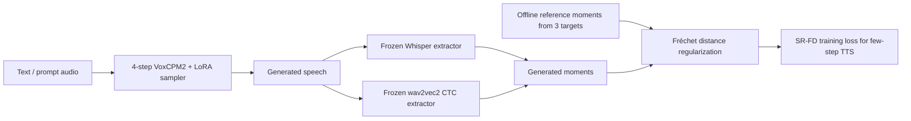
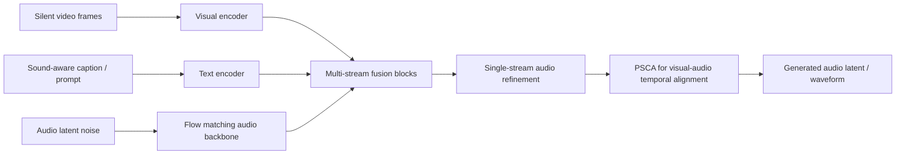
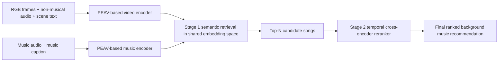

# 语音 / 音频 / 音乐论文速递
## 2026-07-08

> 实际对应 arXiv 更新日：**2026-07-08**  
> 检索范围：`cs.SD + eess.AS`（补收与音乐 / 视频音频强相关的 `cs.MM` cross-list）  
> 只放按 ML 顶会审稿口径看，最值得多数读者花时间看的 **5 篇**

## 📋 总览

- 共收录 **5 篇** 相关论文
- 语音生成 / TTS：**2 篇**
- 音视频生成 / 跨模态检索：**2 篇**
- 音乐理解 / 评测：**1 篇**

今天真正值得优先看的，不是“谁又做了个更大的多模态模型”，而是三条更实用的路线。`WordVoice` 把 LLM-TTS 里最虚的那部分“可控性”落到了词级五维显式控制，终于开始正面回答 audiobook、旁白和视频配音这些强约束场景；`Fréchet Distance Loss on Speech Representations for Text-to-Speech Synthesis` 则是一篇很硬的 few-step TTS 论文，不靠换 backbone，不靠堆 teacher，直接用分布级 regularizer 把 4-step VoxCPM2 的可懂度拉到超过 10-step baseline；`Flowley` 说明视频到音频这条线未必非要外挂重型音视频对齐模块，attention 里把时间同步约束做对，也能在 VGGSound 上把质量、语义和同步一起往前推。

另外两篇各有明确受众。`MusICA-MetaBench` 不产出一个新音乐大模型，但它把“音乐 MLLM 到底有没有真的在听”这件事做成了可配置、可校准、可跨模态比较的 benchmark pipeline；`VTMR` 则更像一个很清楚的工业路线，先用 multimodal retrieval 把候选集拉准，再用 temporal reranker 把节奏和镜头变化对齐，适合做视频配乐检索而不是做生成。

## 精选入选规则

- **新意（0-3）**：是不是提出了新的表示、控制接口、训练组织方式，或者把老问题拆得更对
- **影响力（0-3）**：是不是贴近语音生成、语音大模型、视频音频生成、音乐理解这些主线
- **证据强度（0-2）**：有没有像样的 baseline、消融、显著性检验和关键数值
- **受众匹配度（0-2）**：对语音大模型 / TTS / 多模态音频 / 音乐理解研究者有没有直接启发

分数校准：

- **6**：可以看，但更像局部补丁或经验汇总
- **7**：信息量足，值得过一遍
- **8+**：建议优先精读，短期内就能影响你做实验或搭系统

## 总览表

| 方向 | 序号 | 论文 | 评分 | 关键词 |
|---|---:|---|---:|---|
| 语音生成 / TTS 控制 | 1 | WordVoice | 8.5/10 | word-level control, acoustic planning, bound token, bilingual 4.7k h |
| 语音生成 / TTS 推理 | 2 | SR-FD Loss for TTS | 8.5/10 | few-step TTS, Fréchet regularization, Whisper, CTC, VoxCPM2 |
| 音视频生成 | 3 | Flowley | 8/10 | V2A, PSCA, SoundCap, single-stage flow matching |
| 音乐理解 / 评测 | 4 | MusICA-MetaBench | 7.5/10 | music MLLM benchmark, cross-modal QA, MusicXML, benchmark calibration |
| 视频配乐检索 | 5 | VTMR | 7.5/10 | video-to-music retrieval, temporal reranking, PEAV, retrieve-rerank |

## 🗣️ 语音生成 / TTS 控制与推理

### [1] WordVoice: Explicit and Decoupled Multi-Dimensional Word-Level Control for LLM-Based TTS

- **评分**：8.5/10
- **作者/机构**：Sihang Nie, Jinxin Ji, Xiaofen Xing, Deyi Tuo, Chengbin Jin, Jialong Mai, Xiangmin Xu；South China University of Technology、Huya Inc.、Tongji University、The Hong Kong Polytechnic University、Foshan University
- **论文链接**：https://arxiv.org/abs/2607.06461
- **PDF**：https://arxiv.org/pdf/2607.06461.pdf
- **代码链接**：**项目页声明代码与音频样例已公开** https://xxh333.github.io/wordvoice-demo/
- **Demo 链接**：https://xxh333.github.io/wordvoice-demo/

#### 📌 简介
这篇做的不是泛泛的“风格可控 TTS”，而是更难也更实用的词级显式控制。作者先造了一个带五维词级标注的双语数据集 `WordVoice-5A`，再把 LLM-TTS 拆成“词级 acoustic planning + token-to-waveform 精细调制”两段，让 duration、boundary、energy、pitch、tone 这些属性能被单独控制，而不是靠一句自然语言提示赌运气。

#### ☠️ 毒舌点评
这篇最值钱的地方是它没有继续拿“instruction-based TTS 很灵活”这种空话糊弄人，而是直接承认 prompt 控制在词级对齐场景里不够用。代价也写得很诚实：控制精度上去了，WER 会轻微变差，speaker similarity 也不是全维度完胜。这种论文我反而更信，因为它不是在演示视频里挑几个漂亮 case 来骗人。

#### 🔧 技术方案
- **模型解决的问题**：当前 LLM-TTS 大多只能做句级或段级风格控制，遇到 audiobook 强调、视频配音卡嘴型、局部情绪调度这种需求时，模型基本只能“尽量理解提示词”，没法对单词级时长、停连、能量和音调做确定性干预。`WordVoice` 解决的是把这些细粒度控制从隐式 prompt 转成显式、可编辑、可分维的中间表示。
- **模型架构**：
  - **输入**：文本序列、参考音频前 30% 的 prompt、对齐得到的词级五维属性条件；在手动控制模式下，用户还能直接覆盖指定词的属性值。
  - **输出**：带有精确词级 prosody 的语音波形，以及对应的离散 speech token 和连续 acoustic feature。
  - **主干**：基于 `CosyVoice3` 的双阶段框架，前段是 autoregressive LLM 负责离散 token 生成，后段是 Flow Matching vocoder 负责 token-to-waveform 重建。
  - **关键模块**：
    - `WordVoice-5A`：约 **4.7k 小时** 中英双语词级标注数据集；
    - `bound-token mechanism`：在 LLM 内显式插入边界 token，迫使模型先做“acoustic planning”；
    - `WordVoice-FM`：在 FM 阶段补足离散 token 丢失的连续声学细节；
    - 词级五维属性：`duration / boundary / energy / pitch / tone`；
    - 对齐与标注流水线：MFA、Qwen3-FA、响度优化、音高截断和形态学 tone 建模。
- **信号流**：

- **关键设计 / 核心创新**：
  - 不是把词级属性作为并行辅助预测头，而是通过 `⟨b⟩` 边界 token 重排 LLM 的因果生成过程，让模型先显式规划再吐 token。
  - 词级控制被拆成“LLM 端负责宏观规划，FM 端负责连续细节补偿”，这比单独在 LLM 里硬塞属性更合理。
  - tone 的处理不是简单离散标签，而是专家驱动的 7 类轮廓建模，兼容英语 intonation 和中文 tonal 变化。
- **训练 / 推理策略**：
  - 数据由 `LEMAS` 原始语音重标注得到，最终形成 `WordVoice-5A-zh ∼2546h`、`WordVoice-5A-en ∼2138h`，总计约 **4684 小时**。
  - LLM 部分与 FM 部分分开训练，文中给出 `8 × NVIDIA A800`、`LLM 7 epochs`、`FM 20 epochs`。
  - 为了让 FM 真正依赖词级属性，训练时随机 mask **30%** 输入 speech token。
  - 推理阶段默认先用对齐器从参考音频提取词级属性；如果用户手动指定某些词的属性，就直接覆盖 LLM 的自规划结果。
  - 文中没有报告严格的 RTF / tokens/s / 显存曲线，部署性能证据主要体现在控制精度和 zero-shot 稳定性上。

#### 📊 实验结果
- 主观结果看得出它确实不是“只会控、不会讲”。在中文测试集上，`WordVoice-Control` 的 `N-MOS 3.689`，高于 `CosyVoice3` 的 `3.550`；`Ctrl-MOS 3.446` 明显高于 `3.028`。英文测试集上，`WordVoice-Control` 的 `N-MOS 3.773`、`Ctrl-MOS 3.645`，同样高于 `CosyVoice3` 的 `3.643 / 3.324`。
- 客观控制精度提升非常直接。中文集里，`CosyVoice3` 到 `WordVoice-Control` 的变化是：`Dur-MAE 0.0549 -> 0.0349`，`Eng-MAE 0.1030 -> 0.0486`，`Pit-MAE 0.2030 -> 0.1100`，`Bnd-ER 32.47% -> 12.72%`，`Ton-RER 32.31% -> 20.25%`。英文集也类似：`Dur-MAE 0.0806 -> 0.0450`，`Bnd-ER 43.81% -> 23.23%`，`Ton-RER 40.92% -> 26.58%`。
- 代价同样明确：控制模式会轻微牺牲文字稳健性。中文 `WER` 从 `CosyVoice3 2.31%` 变成 `WordVoice-Control 2.86%`，英文从 `1.06%` 变成 `1.57%`。这不是致命问题，但它证明“高控制精度”和“极限语言稳健性”之间确实有 trade-off。
- 对比词级控制基线 `MagicTTS` 时，`WordVoice` 也不是只在自己定义的五维指标里赢。中文上 `Dur-MAE 0.0383 vs 0.0438`，`Bnd-ER 12.82% vs 16.10%`；英文上 `Dur-MAE 0.0397 vs 0.0593`，`Bnd-ER 24.77% vs 38.77%`。
- 消融也比较扎实。单属性控制实验里出现明显“对角线现象”，说明 duration、energy、pitch、boundary 基本能解耦；去掉 `WordVoice-FM` 后，`Eng-MAE` 和 `Pit-MAE` 恶化明显，证明连续细节确实主要靠 FM 模块补。

#### 💡 为什么值得看
这篇最值得看的不是它“又做了个 controllable TTS”，而是它把 LLM-TTS 里最常见的伪命题拆穿了：自然语言提示并不等于精细可控。如果你现在在做配音、朗读、情绪 TTS 或任何需要 deterministic local edit 的系统，这篇几乎就是在告诉你，下一代控制接口应该长什么样。

#### 评分：8.5/10
理由：问题选得准，数据和模型两端都补了，实验既能证明控制更精确，也没回避代价。扣分点在于它本质上还是建立在 CosyVoice3 范式之上的系统增强，而不是全新 TTS 路线。

### [2] Fréchet Distance Loss on Speech Representations for Text-to-Speech Synthesis

- **评分**：8.5/10
- **作者/机构**：Ho-Lam Chung, Kuan-Po Huang, Bo-Ru Lu, Hung-yi Lee；National Taiwan University、Amazon AGI
- **论文链接**：https://arxiv.org/abs/2607.06027
- **PDF**：https://arxiv.org/pdf/2607.06027.pdf
- **代码链接**：暂无明确开源仓库
- **Demo 链接**：暂无

#### 📌 简介
这篇针对的是一个很现实的问题：few-step flow-matching TTS 虽然快，但步数压缩以后内容漂移会明显变重，尤其是词替换和漏词。作者提出 `Speech Representation Fréchet Distance (SR-FD)`，在训练时直接让 4-step sampler 生成语音，再用冻结的 `Whisper + CTC` 表征去匹配高质量语音分布的均值和协方差，从而把“采样后的成品分布”拉回正确区域。

#### ☠️ 毒舌点评
这篇的优点在于它完全没有装神弄鬼。它不宣称“更像人类”，也不拿几个主观样例糊你脸，而是老老实实把目标锁在 intelligibility 上。缺点也一样明确：这不是一个通用质量 loss，它本质上是为 few-step tokenizer-free TTS 的可懂度保底服务的。如果你想拿它一把梭解决所有语音质量问题，那就是自己骗自己。

#### 🔧 技术方案
- **模型解决的问题**：`VoxCPM2` 这类 tokenizer-free flow-matching autoregressive TTS 在压到 4 步采样时，训练目标还是局部的 flow matching / reconstruction / stop prediction，无法直接约束最终生成语音的整体分布，所以低步数时 WER 会明显恶化。`SR-FD` 解决的是如何在不加 discriminator、不加测试时计算开销的前提下，让低步数采样结果在内容上更接近高质量语音分布。
- **模型架构**：
  - **输入**：目标文本和可选 prompt audio，经 `VoxCPM2 + LoRA` 的 4-step few-step sampler 生成语音。
  - **输出**：生成语音波形，以及由冻结表征提取器导出的 utterance-level feature moments。
  - **主干**：基于 `VoxCPM2` 的 tokenizer-free flow-matching autoregressive TTS，不改 backbone，只在训练目标上加 `SR-FD`。
  - **关键模块**：
    - `few-step sampler`：部署时实际使用的 **4-step** 采样器；
    - `frozen Whisper encoder`：提供 semantic content space；
    - `wav2vec 2.0 CTC head`：提供 phonetic / posterior content space；
    - 三类 reference target：`low-step Whisper anchor`、`teacher CTC target`、`real-speech CTC target`；
    - `LoRA adapters`：只更新轻量参数，主体预训练权重冻结。
- **信号流**：

- **关键设计 / 核心创新**：
  - 关键不是“把 FD 用在语音上”，而是把 FD 从离线评价指标改成训练期正则，而且直接约束部署时实际用的 4-step 采样结果。
  - 不只用一个表征空间，而是用 `Whisper` 和 `CTC posterior` 两个冻结空间分摊语义与发音约束，避免单空间偏置。
  - 三个 target 的角色划分清楚：`Whisper anchor` 保住低步数可行解，`teacher CTC` 向 10-step teacher 对齐，`real-speech CTC` 防止过拟合 teacher artifact。
- **训练 / 推理策略**：
  - backbone 是 **2B** 参数 `VoxCPM2`，训练只更新 `LoRA`。
  - 训练分成两段：先做只含 `Lbase` 的 supervised LoRA adaptation，再额外跑 **1600 steps** 打开 `SR-FD`。
  - reference statistics 来自三路缓存：真实 `LibriTTS` voice-cloning speech、`10-step VoxCPM2` teacher generation、ASR 校验通过的 4-step generation。
  - 两个 CTC target 各用 **4999** 条语音统计，特征维度 `d=72`；Whisper target 用 **1000** 条，特征维度 `d=960`。
  - 推理时完全不需要再算 SR-FD，部署仍是 4-step VoxCPM2；文中强调 “zero added inference cost”。

#### 📊 实验结果
- 这篇最硬的结果就是 `Seed-TTS English` 主指标。原始 `VoxCPM2 10-step` 的 `WER` 是 **1.74%**，压成 `4-step` 后恶化到 **2.23%**；加了 `SR-FD` 的 `4-step` 反而降到 **1.41%**。这相当于相对原始 4-step baseline 降了 **36.5%**，相对 10-step baseline 也降了 **18.5%**。
- 显著性不是口头说的。对原始 4-step baseline 的改进是 **0.81** 个百分点，`95% CI [0.57, 1.06]`，`p < 1e-4`；对 10-step baseline 的改进是 **0.32** 个百分点，`95% CI [0.14, 0.51]`，`p = 0.0004`。
- 说话人相似度和质量 proxy 没被明显牺牲。`SIM 0.74 -> 0.76`，跟 10-step baseline 持平；`UTMOS / DNSMOS OVRL / P808` 从原始 4-step 的 `3.30 / 2.90 / 3.53` 回到 `3.76 / 3.07 / 3.65`，接近 10-step 的 `3.81 / 3.09 / 3.67`。
- 它还顺手赢过一个更贵的 published baseline：`ARCHI-TTS` 在 **32 steps** 上报的 `WER` 是 **1.47%**，而 SR-FD 的 4-step 结果是 **1.41%**。这当然不代表它全面碾压 ARCHI-TTS，但至少说明“步数更少不一定更差”。
- 听感检验也没有翻车。盲测里，`SR-FD vs 10-step baseline` 的 decisive votes 是 `61:67`，`SR-FD preference 47.7%`，`p=0.659`，并且 `TOST` 在预先定义的 `±10` 个百分点等效区间内通过。意思很简单：多出来的 6 个采样步，没有给 ten-step 带来可靠的人耳优势。
- 错误类型分解说明它不是靠换一种错法蒙混过关。`substitution 203 -> 142`，`deletion 43 -> 21`，`insertion 18 -> 5`。短句、中句、长句三个 bucket 都更好，其中短句提升最大。
- target ablation 也证明三个 target 都有用。去掉 `low-step Whisper anchor` 后主结果从 `1.41%` 坏到 `1.54%`；去掉 `real-speech CTC` 和 `teacher CTC` 分别坏到 `1.49%` 和 `1.48%`。这说明 compact mixture 不是摆设。

#### 💡 为什么值得看
这篇最值得看的地方是方法论。很多 few-step TTS 文章还停留在“把轨迹拟合得更好”，它直接把目标改成“让采样后的成品分布更对”。如果你在做 low-latency TTS、streaming speech generation 或者任何 low-step flow / diffusion speech 系统，这个思路比再盲目堆采样技巧更像正解。

#### 评分：8.5/10
理由：问题真、改动小、收益硬，而且统计检验做得扎实。扣分点是适用面相对收窄，它主要解决 few-step intelligibility，不是一个“一招全修”的通用语音质量损失。

## 🎬 音视频生成 / 配乐检索

### [3] Precise Video-to-Audio Generation with Cross-Modal Alignment in Latent Space

- **评分**：8/10
- **作者/机构**：Thanh V. T. Tran, Ngoc-Son Nguyen, Luong Tran, Long-Khanh Pham, Paarth Neekhara, Shehzeen Hussain, Van Nguyen；FPT Software AI Center、NVIDIA
- **论文链接**：https://arxiv.org/abs/2607.06405
- **PDF**：https://arxiv.org/pdf/2607.06405.pdf
- **代码链接**：暂无明确开源仓库
- **Demo 链接**：https://flowley-v2a.github.io

#### 📌 简介
这篇做的是 silent video 到 audio 的生成，也就是更接近自动 Foley 而不是泛泛的 text-to-audio。作者提出 `Flowley`，核心思路是用单阶段 flow-based 架构直接把视频帧、文本提示和音频 latent 融合起来，同时在 cross-attention 里加入 `PSCA` 这种 progressive soft mask 来约束时间同步；再额外用 `SoundCap` 给 VGGSound 这种弱标注数据补 richer caption。

#### ☠️ 毒舌点评
这篇不像那种“先把视频转成一句 caption，再丢给通用 T2A”的省事方案。它的好处是终于肯面对 temporal alignment 这个核心问题。缺点也很明显：`Align Acc` 不是全场第一，zero-shot 到 Movie Gen Audio Bench 时语义对齐分数仍然明显落后于大模型闭源系统。所以这是一篇真正的系统强化稿，不是终结一切的 SOTA 神话。

#### 🔧 技术方案
- **模型解决的问题**：现有 V2A 方法大致分两类，一类是视频转文本再喂给 T2A，语义有了但细粒度时间线丢了；另一类是多阶段先学对齐再学生成，训练和推理都很重。`Flowley` 解决的是如何在单阶段训练里同时保住语义一致性和音视频时间同步，而且不依赖外接预训练对齐模块。
- **模型架构**：
  - **输入**：静音视频帧、可选文本提示、音频 latent 噪声；训练时还可接入由 `SoundCap` 生成的 sound-aware caption。
  - **输出**：与视频语义一致、时间上对齐的音频 latent / 波形。
  - **主干**：flow-based V2A generator，内部由 `multi-stream blocks + single-stream blocks` 组成。
  - **关键模块**：
    - `multi-stream blocks`：联合融合 audio latent、video embedding、text embedding；
    - `single-stream blocks`：专门细化音频路径；
    - `PSCA (Progressive Soft-masked Cross-Attention)`：在 attention 里引入局部硬窗口和软衰减区，直接把同步约束写进掩码；
    - `SoundCap`：用 AV-LLM 先给视频写 sound-aware caption，再训练 VLM 供主模型使用。
- **信号流**：

- **关键设计 / 核心创新**：
  - `PSCA` 不是普通 cross-attention，它通过局部硬窗口 `ω`、软边界 `δ` 和层深参数 `β` 逐层收紧关注范围，让早层看更大上下文、深层更专注局部同步。
  - `SoundCap` 的意义不是再加一个 captioner 炫技，而是修 VGGSound 这种“标签短、语义粗、噪声大”的老问题，给生成模型更细的 sound-conditioned 文本。
  - 全链路坚持 single-stage training，不外挂 frozen audio-visual aligner，这点对训练成本和工程复杂度都很关键。
- **训练 / 推理策略**：
  - 主模型训练集是 `VGGSound`，约 **200k** 个 **10 秒** 视频，训练和评测只取前 **8 秒**。
  - `Flowley` 训练在 **2 × 80GB A100** 上进行；推理阶段采用 `Euler 25 steps`，`CFG strength = 7.5`。
  - `SoundCap` 使用 `video-SALMONN` 生成训练 caption，再用 `Qwen2.5-VL` fine-tune **1 epoch** 得到 caption VLM。
  - 作者明确把 `SoundCap` 定义成可插拔的一次性 recaptioning 步骤，而不是强绑到主模型训练的额外 stage。

#### 📊 实验结果
- 在 `VGGSound` 测试集上，`Flowley` 的综合指标很强。对比最接近的开源强 baseline `MMAudio`，它把 `KAD` 从 **0.57** 压到 **0.42**，`FAD` 从 **7.89** 压到 **7.65**，`IS` 从 **12.68** 拉到 **18.25**，`IB-Score` 从 **28.09** 提到 **29.32**，`LB-Score` 从 **21.98** 提到 **24.87**。
- 它也赢过更大的 `VinTAGe`。后者参数约 **1.32B**，`IS 17.34`，`Align Acc 67.11`；`Flowley` 只有 **169M**，`IS 18.25`，`Align Acc 89.37`。当然 `Frieren` 的 `Align Acc 97.13` 仍高于它，这就是它没有全指标封神的地方。
- `SoundCap` 不是摆设。`Flowley + SoundCap` 把 `KAD` 进一步做到 **0.39**，`FAD 7.52`，`IS 19.68`，`IB-Score 30.07`，`Align Acc 90.02`。对 `MMAudio` 的加成更夸张，`KAD` 直接提升 **31.6%**。
- 噪声处理消融也说明它真懂 VGGSound 的脏。若 `SoundCap` 不带 noise conditions，`IS` 会掉到 **15.16**，`Align Acc` 降到 **87.13**，`KAD` 变差到 **0.45**；带 noise-aware 条件后恢复到 `0.39 / 19.68 / 90.02`。
- `PSCA` 确实主要在修同步而不是乱抬所有分。调 `ω`、`δ` 时，`Align Acc` 对窗口大小最敏感，而 `IS`、`IB-Score` 相对稳定；去掉层相关参数 `β` 后，`IS 18.25 -> 17.78`，`Align Acc 89.37 -> 88.62`。
- 零样本外推到 `Movie Gen Audio Bench` 时，它的结论很有意思。`Movie Gen Audio` 是 **13B**，训练数据量约 `O(1M)` 小时；`Flowley + SoundCap` 只有 **169M**，训练数据约 **∼400h**，却做到 `IS 8.18`，略高于 `Movie Gen Audio 8.01`，但 `IB-Score 25.78` 还是明显低于 `35.86`，`Align Acc 61.07` 也低于 `64.33`。这说明它在音频质量上能打，但开放域语义覆盖还不够。

#### 💡 为什么值得看
如果你关心自动 Foley、视频到音频生成，`Flowley` 值得看的不是它又换了个更花哨的 backbone，而是它把“同步性”直接写进 attention 机制，同时承认数据 caption 质量就是性能上限的一部分。做这条线的人，读完应该会更少迷信外挂大模块，多去想主干里到底哪里该显式编码时间对齐。

#### 评分：8/10
理由：系统设计完整，指标扎实，`SoundCap + PSCA` 的作用能被清楚归因。扣分点是 `Align Acc` 不是最强，zero-shot 语义覆盖也还没追上闭源大模型。

### [4] Multimodal Video-to-Music Recommendation via Semantic Retrieval and Temporal Reranking

- **评分**：7.5/10
- **作者/机构**：Seungheon Doh, Minhee Lee, Sangmoon Lee, Ben Sangbae Chon, Juhan Nam；KAIST、Gaudio Lab
- **论文链接**：https://arxiv.org/abs/2607.05971
- **PDF**：https://arxiv.org/pdf/2607.05971.pdf
- **代码链接**：暂无明确开源仓库
- **Demo 链接**：https://seungheondoh.github.io/video-to-music-demo

#### 📌 简介
这篇不是生成音乐，而是给视频检索最合适的背景音乐。作者提出 `VTMR`，先在共享 audio-visual-text embedding 空间里做 multimodal semantic retrieval，再对 top-N 候选跑 temporal reranker，直接看视频和音乐的时序片段是否匹配。说白了，它解决的是“整体 mood 对了，但镜头点和音乐节拍还是不搭”的老问题。

#### ☠️ 毒舌点评
这篇比较典型地体现了“好工程论文”和“新范式论文”的区别。它不是革命性方法，但路线非常干净：你先把多模态候选召回做准，再用 cross-encoder 盯时序细节。对想做可用视频配乐系统的人，这是比端到端大生成模型更靠谱的路；但如果你期待的是一个音乐 foundation model 级别的新想法，那它不属于那一类。

#### 🔧 技术方案
- **模型解决的问题**：传统 video-to-music retrieval 大多把整段视频和整首音乐压成单个 global embedding，比的是整体语义兼容性，却没法判断某个高潮镜头和某段鼓点是不是对上了。`VTMR` 解决的就是“语义兼容”和“时间对应”不能混成一个分数的问题。
- **模型架构**：
  - **输入**：视频 RGB 帧、视频中的非音乐音频流、LLM 生成的视频场景描述、音乐音频、LLM 生成的音乐 caption，以及视频 metadata。
  - **输出**：候选音乐的召回排序结果，以及 temporal reranker 重排后的最终视频配乐推荐。
  - **主干**：两阶段 `retrieve-and-rerank` 框架。
  - **关键模块**：
    - `PEAV-base`：冻结的 audio-visual-text backbone；
    - Stage 1 `Semantic Retrieval`：把多模态视频信号和音乐信号投影到共享 embedding 空间；
    - Stage 2 `Temporal Reranking`：对 top-40 候选做 video-music pair cross-encoding；
    - modality fusion/dropout：训练时随机丢弃文本流，增强缺失模态鲁棒性。
- **信号流**：

- **关键设计 / 核心创新**：
  - 视频 query 不只看视觉流，还加上非音乐音频流和 scene text；音乐侧也不只看音频本身，还利用 music caption。
  - Stage 1 用 global embedding 做大规模检索，Stage 2 才保留时序序列做 cross-encoder，兼顾了效率和细粒度对齐。
  - 训练时的 modality dropout 很务实，避免系统一旦拿不到 scene text 就直接塌掉。
- **训练 / 推理策略**：
  - 冻结 backbone `PEAV-base`，它在约 `O(100M)` synthetic audiovisual pairs 上预训练。
  - Stage 1 使用 `SigLIP` 风格 multi-pair contrastive loss，在 `d=1024` 共享空间内对多个模态组合同时对齐。
  - 时序 reranker 将 video 和 music sequence 都重采样到固定长度 `Ttarget=64`，用 cross-encoder 学局部对齐。
  - 推理阶段先召回，再对 top-40 候选重排；文中没有给出明确线上延迟，但这个两阶段设计本身就是为大库检索场景服务的。

#### 📊 实验结果
- 在 `VidMuse` 上，最强 retrieval baseline `ImageBind` 的 `R@10` 是 **14.2**、`MedR` 是 **75**；`VTMR (w/o Reranker)` 直接做到 `15.9 / 58`。这说明 multimodal query 和 music caption 真能把粗召回拉准。
- 真正的增益来自第二阶段。加上 temporal reranker 后，`VTMR (w/ Reranker)` 把 `R@10` 再推到 **18.3**，`MedR` 进一步降到 **46**。这个幅度已经不是“调一调 embedding head”能解释的，说明单独建模时序匹配是有必要的。
- 其它 baseline 也不弱，所以结果有说服力。对比里包括 `AudioCLIP 6.1 / 116`、`Wav2CLIP 6.7 / 117`、`LanguageBind 10.2 / 84`、`PEAV-base 11.5 / 87`。从这些数字看，VTMR 确实不是只赢随机噪声基线。
- 主观评测更偏产品视角。作者在 **20** 个视频片段、**500K** 专业音乐库上做 A/B 测试，找了 **30** 位专家评审，累计 **1200** 条 pairwise 标注。结果上，`Overall Preference` 对 `Adobe Firefly` 的 win+tie 是 **77%**，对 `VidMuse` 是 **73%**；`Music Quality` 对 `VidMuse` 更是 **96% win+tie vs 4% loss`。
- 但也别神化。对 `Human-Reference` 的 overall preference 只有 **46%**，说明真正专业人工配乐仍然是上限，它还没有把音乐导演替掉。

#### 💡 为什么值得看
这篇最值得看的，是它把“语义 compatible”和“时间 aligned”拆成两个阶段来做，而不是继续把所有问题压到一个 embedding similarity 里。如果你现在在做短视频配乐、广告配乐检索或者任何 retrieval-first 的音乐系统，这条路线比强行用生成模型一把梭更稳。

#### 评分：7.5/10
理由：路线清楚、收益稳定、产品意义强。扣分点是新意主要体现在系统组织和时序 reranking，不是底层模型范式突破。

## 🎼 音乐理解 / 评测

### [5] Music I Care About: Automated Multimodal Benchmarking of LLM Music Perception Skills on (Almost) Any Music

- **评分**：7.5/10
- **作者/机构**：Tomáš Sourada, Katia Vendrame, Jan Hajič jr.；Charles University、Brno University of Technology
- **论文链接**：https://arxiv.org/abs/2607.06015
- **PDF**：https://arxiv.org/pdf/2607.06015.pdf
- **代码链接**：**代码已开源** https://github.com/tomsouri/MusICA-MetaBench-preprint
- **Demo 链接**：暂无

#### 📌 简介
这篇不做新音乐模型，而是做一套更像“benchmark factory”的东西。`MusICA-MetaBench` 不是固定数据集，而是从用户给定的 `MusicXML + 对齐好的 audio / sheet image / symbolic file` 自动生成音乐感知 QA benchmark，让你按自己的曲库现做一个多模态音乐理解测试集，然后用同一题跨音频、乐谱图像、符号三种模态比较 MLLM。

#### ☠️ 毒舌点评
这篇的价值不在模型炫技，而在它终于认真回答了“这些音乐 MLLM benchmark 到底有没有逼模型真的去听 / 去看谱”。缺点是方向更偏评测基础设施，离直接提升生成或识别指标有一层距离。你如果只盯着模型分数，可能会嫌它不够炸；但你如果做音乐 MLLM 研究，这种 benchmark 方法论反而很稀缺。

#### 🔧 技术方案
- **模型解决的问题**：现有音乐 MLLM benchmark 有三个老毛病：静态大基准太贵、题目经常不用真正感知就能靠文字猜、而且很少能跨 audio / image / symbolic 统一比较。`MusICA-MetaBench` 解决的是如何把音乐 benchmark 从“一次性数据集”变成“按数据现造的可校准评测管线”。
- **模型架构**：
  - **输入**：`MusicXML`、与 piece 对齐的音频、乐谱图片、符号表示，以及预定义 question templates 和 ontology。
  - **输出**：多模态多选 QA benchmark item，格式是 `(question, musical file, correct answer, 4 distractors)`。
  - **主干**：benchmark generation pipeline，而不是训练一个新的音乐理解模型。
  - **关键模块**：
    - question template instantiation；
    - 基于 `music21` 的 ground-truth / distractor extraction；
    - category-balanced filtering 和 subsampling；
    - `no-input` / `noise-input` robustness test；
    - benchmark size calibration。
- **信号流**：

- **关键设计 / 核心创新**：
  - 它不是再造一个固定 benchmark，而是把 benchmark 变成用户可自定义的数据生成过程，这点对音乐这种风格跨度极大的领域很重要。
  - 题目设计围绕 `pitch` 和 `rhythm` 的 feature-recognition skill，尽量保证能在三种模态上共用同一题同一答案。
  - 作者显式引入 `no-input` 和 `noise-input` 两个对照组，防止 benchmark 变成“模型看选项就能猜”的假感知。
- **训练 / 推理策略**：
  - 这篇没有训练一个新的音乐感知模型，核心是 benchmark 生成和对外部 MLLM 的统一评测。
  - 评测时采用 closed-form multiple-choice，所有题固定 **5** 个选项，其中 **20%** 题目把 `NOTA` 设成正确选项。
  - benchmark size calibration 用 10 次随机子集抽样和配对 t-test，目标是找到“能稳定检测最小有意义差异”的最小集合。
  - 评测模型包括 `Gemini 2.0 FL / 2.5 FL / 3.1 FL / 3.1 Pro`、`Qwen3 Omni 30B`、以及聚合式 `GPT-4o / GPT-5 / Mistral` 组合。

#### 📊 实验结果
- benchmark size 校准做得很认真。作者在 `ChoraleBricks` 上算出，`s=300` 就足以检测 **6%** 的 accuracy gap；在实际模型差异上，连 **3.5%** 的差距很多时候都已经显著。
- 这意味着它不是那种一上来就拿几万题把 API 费用烧穿的 benchmark。文中还直接给出了运行时间和成本，说明它就是按实际用例设计的，而不是学术摆拍。
- 在 `ChoraleBricks` 上，`Gemini 3.1 Pro` 是明显第一，`accuracy 59.0%`；`Qwen3 Omni 30B 46.3%`，`Gemini 3.1 FL 45.7%`，`agg-GPT-5 42.0%`，`agg-GPT-4o 41.0%`，`random baseline 20.0%`。这说明音乐感知任务已经不再是所有 MLLM 都只能瞎猜的状态，但离真正可靠还很远。
- 论文还专门验证“真的需要感知吗”。在 `s=300` 的 robustness test 里，正常设置显著高于 `no-input` 和 `noise-input`；在 `ChoralSynth` 上，正常设置平均 **28%**，而 `no-input 17%`、`noise-input 20.1%`，两者基本贴着随机线 **20%**。
- 跨模态结果很有意思：平均来看是 `symbolic > image > audio`。也就是说，哪怕是最强模型，真正“听懂”音乐的能力仍然明显落后于看符号和看谱图。
- 换到另一个数据集 `ChoralSynth` 后，整体还会继续掉。文中给出 top-3 模型在该集合上的总分：`Gemini 3.1 Pro 47.0`，`Gemini 3.1 FL 33.3`，`Gemini 2.5 FL 32.0`。音频和图像模态掉得尤其多，说明泛化并不轻松。

#### 💡 为什么值得看
如果你在做音乐 MLLM，这篇最值钱的地方是它把“模型到底在不在认真听”从口水仗变成了可编程、可迁移、可跨模态复用的 benchmark 工具。很多音乐模型论文今天最缺的不是更花哨的 prompt，而是更像样的评测框架，这篇恰好补的是那个坑。

#### 评分：7.5/10
理由：方法论扎实，benchmark 设计比大多数音乐 QA 文章更清醒。扣分点是它属于评测基础设施而不是模型方法创新，直接可复用的对象主要是做 benchmark 的研究者。

## 最后结论

今天最值得优先看的顺序，我会给成下面这个排序：

1. **WordVoice**
2. **Fréchet Distance Loss on Speech Representations for Text-to-Speech Synthesis**
3. **Precise Video-to-Audio Generation with Cross-Modal Alignment in Latent Space**
4. **Music I Care About: Automated Multimodal Benchmarking of LLM Music Perception Skills on (Almost) Any Music**
5. **Multimodal Video-to-Music Recommendation via Semantic Retrieval and Temporal Reranking**

如果你做的是 `TTS / 语音生成`，今天其实就是看前两篇。`WordVoice` 回答“怎么做真正可编辑的词级控制”，`SR-FD` 回答“怎么把 few-step 推理的 intelligibility 拉回来”。这两个问题都比“再做一个更大的语音模型”更贴近真实系统需求。

如果你做的是 `音视频多模态`，优先看 `Flowley`。它证明单阶段生成不是不可能，关键是时间对齐要在主干里显式编码，而不是把一切都丢给 caption 或外接对齐器。`VTMR` 更适合做产品系统的人参考，它不是最惊艳，但非常像能落地的路线。

如果你做的是 `音乐 MLLM / benchmark`，`MusICA-MetaBench` 值得单独收藏。它不提高某个 leaderboard 分数，但它能帮你判断 leaderboard 到底是不是在骗你。
