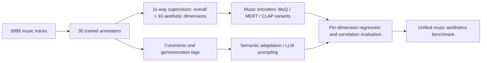
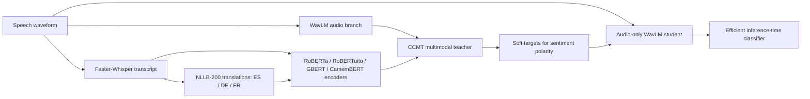
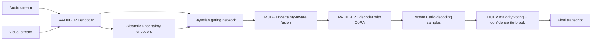
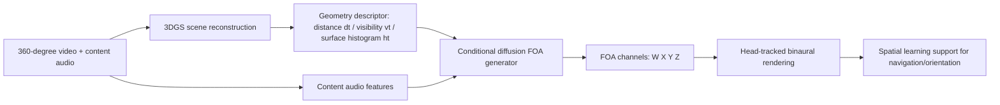

# 语音 / 音频 / 音乐论文速递
## 2026-07-09

> 实际对应 arXiv 更新日：**2026-07-09**  
> 检索范围：`cs.SD + eess.AS`  
> 只放按 ML 顶会审稿口径看，最值得多数读者花时间看的 **5 篇**

## 📋 总览

- 共收录 **5 篇** 相关论文
- 音乐理解 / 评测：**2 篇**
- 语音前端 / 鲁棒识别：**2 篇**
- 空间音频 / 教育可及性：**1 篇**

今天这批稿子没有那种“看完就得立刻换主线”的重磅模型，但有三条相当清楚的线值得盯住。第一条是 `MADB` 代表的“音乐审美评测终于开始脱离拍脑袋单分制”，它把 **9999 首曲目、30 名训练过的标注者、10 个细粒度维度、评论和标签** 全都落下来，真正给音乐审美建模补了数据底座。第二条是更实用的语音前端路线：`Audio Sentiment Analysis via Distillation and Cross-Modal Integration of Generated Multilingual Transcripts` 和 `UBG-Net` 都不是拼大模型规模，而是在严肃回答“训练时能不能借别的模态，部署时还能保持轻量”和“多模态一坏掉时怎么知道自己该不该闭嘴”。第三条是更边缘但不该忽视的应用型音频研究：`EscFOA` 虽然离通用空间音频还差得远，但它至少把“为视觉障碍学习者服务”从口号落成了 geometry-aware FOA pipeline 和用户实验。

剩下那篇 `Rag Classification of Tagore Songs using Symbolic Music Notation and Novel Weighted Distance Measures` 更像是传统符号音乐方法的补洞稿，不够新，但至少诚实地把问题压到一个很明确的 symbolic raga classification setting 里，没有假装自己是 foundation model。

## 精选入选规则

- **新意（0-3）**：是不是提出了新的表示、标注体系、融合接口、鲁棒性机制，或者把老问题拆得更对
- **影响力（0-3）**：是不是贴近音乐理解、语音前端、鲁棒识别、空间音频这些持续会有人做的主线
- **证据强度（0-2）**：有没有像样的 baseline、消融、关键指标和具体数值
- **受众匹配度（0-2）**：对语音大模型 / 语音前端 / 音乐理解 / 空间音频研究者有没有直接启发

分数校准：

- **6**：能看，但更像局部补丁或资料工程
- **7**：信息量足，值得过一遍
- **8+**：建议优先精读，短期内能影响你做实验或搭系统

## 总览表

| 方向 | 序号 | 论文 | 评分 | 关键词 |
|---|---:|---|---:|---|
| 音乐理解 / 评测 | 1 | MADB: A Large-Scale Music Aesthetics Dataset with Professional and Multi-Dimensional Annotations | 8/10 | music aesthetics, 9999 tracks, 30 annotators, comments+tags, MuQ/MERT |
| 语音前端 / 情感分析 | 2 | Audio Sentiment Analysis via Distillation and Cross-Modal Integration of Generated Multilingual Transcripts | 8/10 | WavLM, CCMT, ASR+NMT, privileged information, KD |
| 语音前端 / AVSR | 3 | UBG-Net: An Uncertainty-aware Bayesian Gating Network for Robust Audio-Visual Speech Recognition | 8/10 | uncertainty, Bayesian fusion, DUHV, AV-HuBERT, robust AVSR |
| 音乐理解 / 符号音乐 | 4 | Rag Classification of Tagore Songs using Symbolic Music Notation and Novel Weighted Distance Measures | 7/10 | Swarabitan, symbolic notation, weighted Euclidean, kNN, raga |
| 空间音频 / 教育可及性 | 5 | EscFOA: Enhancing Spatial Learning for Visually Impaired Learners via Generative Spatial Audio in 360-Degree Educational Environments | 7/10 | FOA, 3DGS, conditional diffusion, accessibility, spatial learning |

## 🎼 音乐理解 / 评测

### [1] MADB: A Large-Scale Music Aesthetics Dataset with Professional and Multi-Dimensional Annotations

- **评分**：8/10
- **作者/机构**：Sirui Zhang, Tianle Wang, Xinyi Tong, Peiyang Yu, Jishang Chen, Liangke Zhao, Haoxin Zhang, Duo Xu, Xin Jin, Feng Yu, Songchun Zhu；中央音乐学院、北京通用人工智能研究院、天津音乐学院、北京电子科技学院、北京大学
- **论文链接**：https://arxiv.org/abs/2607.06929
- **PDF**：https://arxiv.org/pdf/2607.06929.pdf
- **代码链接**：**代码已开源** https://github.com/knownree/madb
- **Demo 链接**：暂无

#### 📌 简介
这篇的核心不是发明了一个更强音乐模型，而是先把“音乐审美评测”这个老被嘴上提、手上没数据的问题真正铺平。作者做了一个叫 `MADB` 的大规模数据集和 benchmark：**9999 首曲目**，每首由约 **9-11** 个标注者打分，覆盖 **10 个感知维度 + 1 个 overall score**，外加评论和标签。它的价值在于把审美判断从单一分数扩成结构化目标，逼后续方法正面回答“你到底在预测旋律、编曲、节奏、结构、演唱还是后期效果”。

#### ☠️ 毒舌点评
这篇不像模型论文那样好看，因为它本质上是数据和评测基础设施。但它比很多“新模型多提了 0.01”更值得看。真正的问题是：作者证明了现成模型其实离“会评审美”差得还远，这个结论是有价值的；不过如果你期待它顺手给出一个强到能直接拿去做 RLHF reward model 的 baseline，那没有，这篇更多是在宣布“大家之前做得还不够像样”。

#### 🔧 技术方案
- **模型解决的问题**：音乐审美评测一直缺两个东西，一是大规模、多维度、专业化标注数据，二是一个能同时比较 music encoder、cross-modal model 和 LLM judge 的统一 benchmark。`MADB` 解决的是“先把审美标签定义清楚，再把 benchmark 搭起来”，而不是抢着塞一个新 backbone。
- **模型架构**：
  - **输入**：音乐音频；可选的人类评论文本、情绪标签、流派标签。
  - **输出**：`overall score` 和 10 个维度分数，包括 melody perception、melody emotion、rhythm perception、structure perception、arrangement perception、arrangement emotion、performance/singing emotion、singing skill、performance skill、sound effect perception。
  - **主干**：benchmark 由三类路线组成：
    - music encoder 路线：`MuQ`、`MERT`、`PANNs`、`HTSAT` 等预训练表示 + 下游回归头；
    - cross-modal 路线：`CLAP` 及其 comment/tag adaptation 版本；
    - LLM judge 路线：`Qwen2-Audio-7B-Instruct` 在不同输入配置下做 zero-shot 打分。
  - **关键模块**：
    - 多阶段专业标注流程；
    - 10 维审美框架 + overall score；
    - 评论与标签的双语义监督；
    - `CLAP+C` 与 `CLAP+C&T` 的语义适配；
    - LLM 输入配置对比：`Audio only`、`Comment&Tag`、`Audio+Comment&Tag`。
- **信号流**：

- **关键设计 / 核心创新**：
  - 数据层面是主创新：**9999 首曲目**、**30 名标注者**、每首约 **10** 人评分，这个密度已经比很多音乐评测数据集厚得多。
  - 标签层面不是“单个审美分数”，而是按作曲、编曲、表演、后期这些 production stage 分解。
  - 语义监督不是可有可无的附属物。评论先用中文写，再翻成英文，标签同时有情绪和流派，用来测试 comment/tag 能不能给 CLAP 和 LLM judge 真增益。
- **训练 / 推理策略**：
  - 数据来自四类来源：手工收集曲目、Suno 生成曲、Levo 生成曲、以及 `Muchin` 数据集，共同覆盖真人创作与 AI 生成内容。
  - 标注质控是三阶段：主标注、20% 抽样复核、再 10% 交叉复核。
  - `CLAP` 适配先做 comment/tag 的 contrastive pre-adaptation，再做下游回归。
  - `Qwen2-Audio-7B-Instruct` 不是训练新模型，而是 zero-shot judge，对比不同输入配置。
  - 推理性能、延迟、显存文中没有作为重点汇报；这篇的主战场是 correlation 和 MSE，不是 runtime。

#### 📊 实验结果
- 数据规模本身就说明问题：`MADB` 含 **9999 tracks**，每首约 **9-11** 个评分，**30** 个训练过的标注者，标签覆盖 10 个维度。对音乐审美来说，这已经不是 toy benchmark。
- 在传统 supervised baseline 上，`MuQ` 基本是最强 audio encoder。`Overall Score` 上：
  - `MSE`：`MuQ 0.081`，优于 `MERT 0.090` 和 `CLAP 0.109`
  - `LCC`：`MuQ 0.718`，优于 `MERT 0.626` 和 `CLAP+C&T 0.445`
  - `SRCC`：`MuQ 0.714`，优于 `MERT 0.626` 和 `CLAP+C&T 0.388`
  - `KRCC`：`MuQ 0.528`，优于 `MERT 0.451` 和 `CLAP+C&T 0.266`
- `CLAP` 系路线本身不强，但 comment/tag adaptation 确实有用。比如 `Overall Score` 的 `LCC` 从 `CLAP 0.436` 升到 `CLAP+C&T 0.445`，`SRCC` 从 `0.379` 升到 `0.388`；在 melody emotion、structure perception 等维度也有小幅提升。这说明人类评论和标签不是装饰，而是能补音频表征缺失的语义先验。
- 零样本 LLM judge 的结果很扎眼，也很打脸。`Qwen2-Audio-7B-Instruct` 的 `Audio only` 基本接近失效：`Overall LCC -0.001`、`SRCC -0.035`。但只给 `Comment&Tag` 时，`Overall LCC` 直接到 `0.736`，`SRCC 0.717`，甚至略高于 `Audio+Comment&Tag` 的 `0.734 / 0.718`。这个结果很残酷地说明：现在的通用音频 LLM 在“听音频评审美”这件事上，可能还不如直接读评论。
- baseline 对比结论很明确：`MuQ`、`MERT` 这种 music-specific encoder 明显强于 `CLAP` 系；而人类评论对 LLM judge 的帮助比原始音频大得多。也就是说，现阶段音乐审美建模的瓶颈不只是数据少，更是 audio representation 还不够贴近人类审美推理。

#### 💡 为什么值得看
如果你做音乐理解、音乐生成评测、reward modeling 或 music MLLM，这篇最值得看的不是某个具体分数，而是它把一个长期模糊的问题切出了结构：什么叫审美，哪些维度能分开建模，现有模型到底卡在哪。它不会立刻给你一个最强方法，但会直接决定你后续该怎么设计数据和评测。

### [4] Rag Classification of Tagore Songs using Symbolic Music Notation and Novel Weighted Distance Measures

- **评分**：7/10
- **作者/机构**：Chandan Misra, Swarup Chattopadhyay；XIM University, School of Computer Science and Engineering
- **论文链接**：https://arxiv.org/abs/2607.07241
- **PDF**：https://arxiv.org/pdf/2607.07241.pdf
- **代码链接**：暂无
- **Demo 链接**：暂无

#### 📌 简介
这篇做的是 Rabindra Sangeet 的 raga classification，但作者没有硬上深度网络，而是回到一个更可解释的 symbolic setting：从 `Swarabitan` 乐谱中手工构造 **1000 首** 带 raga 标签的歌曲，用 **36 维跨三八度音符频次** 表示，再把它压成 **12 维跨八度累积表示**，最后用带 raga 先验权重的 Euclidean distance 去做 `kNN` 分类。说白了，这是一篇“先把传统距离度量哪里错了讲清楚，再给一个更不蠢的距离”的论文。

#### ☠️ 毒舌点评
这篇很难说新，但也不至于一无是处。它最大的问题是方法太传统，离现在主流的 sequence model、self-supervised symbolic music 表示都很远；但它的优点也正因为传统，分析链条比较干净。要是你是做现代音乐 AI 的，别指望这篇给你带来范式升级；要是你正好做 Indian art music、symbolic MIR 或小样本结构化分类，这篇反而值得看，因为它至少没有拿一个 overkill 深网把问题糊过去。

#### 🔧 技术方案
- **模型解决的问题**：Tagore 歌曲虽然经常附带 raga 标签，但旋律写法经常不严格遵守经典 Hindustani grammar，直接拿普通 cosine similarity 或 Euclidean distance 比 note-frequency 容易出错。`Rag Classification...` 解决的是“如何让 symbolic note-frequency 表示更符合 raga 结构，而不是把所有音符差异一视同仁”。
- **模型架构**：
  - **输入**：来自 `Swarabitan` 的符号乐谱表示，每首歌先做成跨三八度的 **36 维 note-frequency vector**，再转成跨八度汇总的 **12 维 cumulative representation**。
  - **输出**：预测的 raga label。
  - **主干**：无神经网络；核心是 `k-nearest-neighbor` 分类器。
  - **关键模块**：
    - 36 维到 12 维的 octave-agnostic 聚合；
    - 基于 `Āroh / Avroh` 先验构造的 raga-specific weight vector；
    - `Weighted Euclidean Distance`；
    - ordinary `Euclidean distance` 和 `cosine similarity` 作为对比基线。
- **信号流**：

- **关键设计 / 核心创新**：
  - 关键不是 kNN 本身，而是作者明确指出 ordinary Euclidean / cosine 在 raga 场景下会犯三类错：同 raga 歌曲因八度错位看起来很远，不同 raga 歌曲因频次相近看起来很近，以及纯 / 非纯 compositions 的排序混乱。
  - `12` 维 cumulative 表示先把“跨八度错位”这个无聊问题消掉。
  - `Weighted Euclidean Distance` 再把真正重要的 raga characteristic notes 加权，尤其是 `Āroh` 和 `Avroh` 里的音。
- **训练 / 推理策略**：
  - 这篇没有神经网络训练。所谓“训练”本质上是构造数据、规范 note index、设权重、再做 `75:25` train/test split。
  - 数据集中共有 **1000** 首歌、**239** 个 unique raga，其中超过 **50%** 的样本分布在仅有少量歌曲的长尾 raga 上。
  - 真正做分类评测时，只挑了 `Bhairavi / Bihag / Khamaj` 三个较高频 raga，共 **186** 首歌做三分类 `kNN`。
  - 推理阶段扫描不同 `k`，并比较 `90:10` 与 `80:20` 两种权重分配。

#### 📊 实验结果
- 数据本身偏长尾：**1000** 首歌里有 **239** 个 unique raga，超过 **545** 首属于样本数少于 20 的低频 raga。这个统计很重要，因为它解释了为什么作者最后只能先做三个高频 raga 的受限实验。
- ordinary Euclidean baseline 不算稳。三分类实验里：
  - `k=4` 时，普通 Euclidean accuracy 是 `0.7872`
  - `k=6` 时，普通 Euclidean accuracy 退到 `0.7446`
- 加了 raga-aware weighting 之后，效果能明显起来：
  - `k=4`、`Bihag` 权重、`90:10` 设置下 accuracy 到 `0.8511`
  - `k=6`、`Bihag` 权重、`80:20` 设置下 accuracy 到 `0.8510`
  - 同一个 `k=6`，对比普通 Euclidean 的 `0.7446`，提升不算小
- 作者还给了几个“修 bug 式”案例分析：
  - pure / non-pure `Khamaj` 之间，weighted distance 能把同 raga 歌重新拉近，而不是让它被 `Bhairavi` 抢邻居；
  - 原来在 `36` 维空间里完全错开的 Bhairavi 例子，聚合成 `12` 维后距离恢复合理；
  - 同 raga pair 与异 raga pair 的排序也更符合音乐直觉。
- 但 baseline 强度要实话实说：这里的对比基线主要是 `ordinary Euclidean` 和 `cosine similarity`，没有拿 `PhonoNet` 之类深度模型或现代 symbolic sequence encoder 正面对打。所以 `0.8511` 这个数字只能说明“它比 naive distance 好”，还不能说明“它接近当前最好 raga classification”。

#### 💡 为什么值得看
如果你关心的是现代大模型，这篇优先级不高；但如果你做的是小数据、强结构先验、可解释音乐分类，这篇很值得看。它提醒了一件经常被深网掩盖的事：很多错误不是模型不够大，而是表示和距离定义从一开始就不对。

## 🎙️ 语音前端 / 鲁棒识别

### [2] Audio Sentiment Analysis via Distillation and Cross-Modal Integration of Generated Multilingual Transcripts

- **评分**：8/10
- **作者/机构**：Andrei-George Durdun, Victor Constantinescu, Radu Tudor Ionescu；University of Bucharest、PPC Romania
- **论文链接**：https://arxiv.org/abs/2607.06611
- **PDF**：https://arxiv.org/pdf/2607.06611.pdf
- **代码链接**：**代码已开源** https://github.com/andreidurdun/cross-modal-audio-sentiment
- **Demo 链接**：暂无

#### 📌 简介
这篇做的是 speech sentiment polarity classification，但切入点不是“换个更强 audio encoder”，而是把 **训练时可用但部署时不想保留** 的文本信息当成 privileged information。作者先用 `Faster-Whisper` 自动转录英文，再用 `NLLB-200` 翻成西班牙语、德语、法语，用 `CCMT` 把多语文本和音频做跨模态融合训一个 teacher，最后再把知识蒸馏回只吃音频的 `WavLM` student。核心卖点很简单：训练阶段借多模态补信息，推理阶段还是轻量 audio-only。

#### ☠️ 毒舌点评
这篇不是方法学革命，但问题抓得很对。很多 multimodal paper 默认把所有模态都带到部署端，完全不管 latency 和成本；这篇至少知道现实系统不想在推理时挂 ASR、翻译和一串文本 encoder。它的短板也很清楚：`CCMT` 的提升里有不少其实来自“把文本喂进来了”，不是融合结构本身多神；而且任务只做到二元 / 三元 sentiment polarity，外推到更细的 emotion taxonomy 还不好说。

#### 🔧 技术方案
- **模型解决的问题**：纯音频情感 / 情绪分类容易丢掉 lexical polarity，纯文本又会漏 prosody。现实部署里又不想让 ASR、机器翻译和四路文本 encoder 常驻推理。`Audio Sentiment Analysis via Distillation...` 解决的是如何把自动转录和多语翻译当成训练期特权模态，用来提升最终的 audio-only 分类器。
- **模型架构**：
  - **输入**：原始语音音频；训练时额外输入英文 ASR transcript，以及翻译到西语、德语、法语的文本。
  - **输出**：negative / neutral / positive 三分类 sentiment polarity。
  - **主干**：
    - teacher：`WavLM-base-plus` 音频分支 + `RoBERTa-base`(En) + `RoBERTuito-base`(Es) + `GBERT-base`(De) + `CamemBERT-base`(Fr)；
    - 多模态融合器：`CCMT`（Cascaded Cross-Modal Transformer）；
    - student：audio-only `WavLM` 分类器。
  - **关键模块**：
    - `Faster-Whisper` 自动转录；
    - `NLLB-200` 自动翻译；
    - modality-specific adapters，把各模态编码成统一 patch token；
    - `CCMT` 逐步做 cross-modal attention；
    - `KD loss + CE loss` 的 teacher-student 蒸馏。
- **信号流**：

- **关键设计 / 核心创新**：
  - 不是在部署端硬保留文本分支，而是明确采用 `Learning Using Privileged Information` 风格的 teacher-student 路线。
  - 多语翻译不是为了做多语言分类，而是为了把同一句话映射成多个文本视角，缓解单语模型偏置。
  - `CCMT` 不是简单 concat，而是按模态顺序做级联 cross-modal attention。
- **训练 / 推理策略**：
  - 数据集是 `MSP-Podcast`，使用官方 train/dev/test-1 划分，规模分别约 **169,190 / 34,399 / 46,294** 条。
  - teacher 训练两阶段：先单独 fine-tune 各自 backbone，再缓存 embedding 训 `CCMT`。
  - student 训练目标是 `L = (1-λ) * CE + λ * KD`，默认 `λ = 0.7`，蒸馏温度 `τ = 2`。
  - 推理阶段只保留 `WavLM` student，不再跑 ASR、翻译和文本 encoder。
  - 文中还专门报了 runtime，说明作者不是只关心离线分数。

#### 📊 实验结果
- 音频基线里，`WavLM` 已经比 `Whisper` 强不少：
  - `Whisper`：`Macro-F1 0.5699`，`Accuracy 0.5723`，推理时间 `180 ms`
  - `WavLM`：`Macro-F1 0.6239`，`Accuracy 0.6425`，推理时间 `213 ms`
- 多模态 teacher 的收益是明确的。最强 `CCMT` 组合是：
  - `Audio + En + De`：`Macro-F1 0.6828`，`Accuracy 0.6924`
  - `Audio + En + Fr`：`Macro-F1 0.6826`，`Accuracy 0.6940`
  - 相对 audio-only `WavLM`，大约就是论文总结里说的 **+5.89% macro-F1**、**+5.15% accuracy**
- student 蒸馏虽然没追上 teacher，但在不增加推理成本的前提下确实能涨：
  - `WavLM baseline`：`Macro-F1 0.6239`，`Accuracy 0.6425`，`213 ms`
  - `WavLM (KD from Audio+En+Fr CCMT)`：`Macro-F1 0.6393`，`Accuracy 0.6506`，`211 ms`
  - `WavLM (KD from Audio+En+De CCMT)`：`Macro-F1 0.6329`，`Accuracy 0.6474`，`210 ms`
  - 也就是结论里总结的 **+1.54% macro-F1**、**+0.81% accuracy**
- 速度差非常大，这也是它比单纯 multimodal fusion 更有工程意义的地方：
  - `CCMT (Audio+En)`：`3404 ms`
  - `CCMT (Audio+En+Fr)`：`25082 ms`
  - `CCMT (Audio+En+Es+De+Fr)`：`76000 ms`
  - 对比之下，student 还是 `210-211 ms`
- 蒸馏权重消融也给了：`λ = 0.7` 最好，`accuracy 0.6506`；当 `λ >= 0.4` 时 student 已经能稳定超过 `no-KD` 的 `WavLM baseline`。
- baseline 对比结论很清楚：`Whisper`、text-only `RoBERTa / RoBERTuito / GBERT / CamemBERT` 都不如最好的 multimodal `CCMT`，但它们作为 privileged branch 是有价值的。

#### 💡 为什么值得看
这篇最值得看的不是“情感分析又涨了几点”，而是它把一个很常见但经常被写烂的套路做得够实：训练时借多模态，部署时只留单模态。如果你做语音分类、音频前端、甚至多模态 teacher 压单模态 student 的任何任务，这篇都很有参考价值。

### [3] UBG-Net: An Uncertainty-aware Bayesian Gating Network for Robust Audio-Visual Speech Recognition

- **评分**：8/10
- **作者/机构**：Jinjie Fu, Hang Chen, Wu Guo, Zhijun Zhang, Kuiliang Li, Peng Gao；NERC-SLIP, University of Science and Technology of China
- **论文链接**：https://arxiv.org/abs/2607.06892
- **PDF**：https://arxiv.org/pdf/2607.06892.pdf
- **代码链接**：暂无
- **Demo 链接**：暂无

#### 📌 简介
这篇做的是 robust AVSR，但它不再满足于“音频坏了就多看嘴唇”这种朴素注意力融合，而是显式区分了 **aleatoric uncertainty** 和 **epistemic uncertainty**。作者提出 `UBG-Net`：先用 `MUBF` 模块估计模态级不确定性，再把 aleatoric uncertainty 注入 Bayesian gating 里调制融合；推理时再用 `DUHV` 在多次 Monte Carlo 采样出的候选文本中做层级投票和 tie-break。重点不是模型更大，而是融合时别把噪声错当语义。

#### ☠️ 毒舌点评
这类“uncertainty-aware”论文最容易写成玄学，讲一堆贝叶斯术语，最后就涨 0.3 个点。`UBG-Net` 的好处是它至少把收益放在了真正恶劣的 `AVCocktail fixed chunk` 场景里，而且给了像样消融，不是纯讲故事。短板也摆在这：clean 条件和高 SNR 下提升没那么稳，甚至个别点略退；如果你只关心标准干净 AVSR，它没你想的那么神。

#### 🔧 技术方案
- **模型解决的问题**：传统 AVSR 的 attention / gating 融合通常默认每个模态都给出可信 point estimate，但在真实世界里音频会被干扰、视频会有静音口型或遮挡。`UBG-Net` 解决的是“如何在融合前先估计各模态的可靠性，并在 decoding 时利用 posterior diversity 降低 hallucination”。
- **模型架构**：
  - **输入**：音频流和对应口型视频流。
  - **输出**：转写文本序列。
  - **主干**：`AV-HuBERT encoder + Modality Uncertainty-aware Bayesian Fusion + AV-HuBERT decoder`
  - **关键模块**：
    - `Aleatoric uncertainty encoders`：2 层 MLP 估计模态级数据噪声；
    - `Bayesian Gating Network`：两层 Bayesian linear + ReLU，显式建模 epistemic uncertainty；
    - `MUBF`：把 aleatoric 作为上下文注入 Bayesian gating；
    - `DUHV`：Distribution Uncertainty-aware Hierarchical Voting，用于 MC 采样候选的 sequence-level 选择；
    - `DoRA`：只在 decoder linear 层插入低秩适配模块。
- **信号流**：

- **关键设计 / 核心创新**：
  - 不是把 aleatoric 和 epistemic 分开各做一套分支，而是明确让前者给后者提供“这段输入到底有多脏”的上下文。
  - `DUHV` 解决的是 MC 采样带来的序列长度不一致问题，不是简单算均值。
  - 整体设计更像是在“改融合和推理机制”，而不是另起炉灶重训一个 AV foundation model。
- **训练 / 推理策略**：
  - 训练数据是 `LRS2 + Vox2 + AVYT` 的组合；评测用 `noise-augmented LRS2` 和真实世界 `AVCocktail`。
  - 两阶段训练：
    - Stage 1：按 baseline 协议 fine-tune 预训练 `AV-HuBERT`
    - Stage 2：冻结主 encoder/decoder，只训练 `UBG-Net` 模块和 `DoRA`
  - 训练配置给得很实：`2 × RTX 4090`，`40000 steps`，`AdamW`，peak LR `1e-4`，effective batch size `64`
  - 推理时做 MC sampling，最佳样本数是 `K = 5`；`K = 3` 后开始趋于饱和，`K = 5` 是 accuracy / latency 折中点。

#### 📊 实验结果
- `LRS2` 上不是全场乱杀，但脏条件下确实稳。比如有 1 个干扰说话人时：
  - baseline 在 `-5 dB` 是 `WER 6.4`
  - `UBG-Net` 降到 `5.2`
  - 在 `0 dB / 5 dB / 10 dB` 下也分别从 `3.5 / 3.4 / 2.8` 到 `3.1 / 3.1 / 2.6`
- 更关键的是 `AVCocktail`，因为那才是作者真正想解决的场景：
  - `Baseline`：`ASD 22.6`，`Fixed chunk 39.2`，`Gold 18.2`
  - `UBG-Net`：`ASD 21.9`，`Fixed chunk 36.1`，`Gold 17.4`
  - 其中 `Fixed chunk` 相对下降约 **7.9% WER**
- 与通用大模型 reference 的差距非常大，这也说明这任务不是“换个更大 MLLM 就行”：
  - `Whisper large-v3`：`ASD 67.3`，`Fixed chunk 136.0`，`Gold 52.3`
  - `Qwen3-Omni`：`70.5 / 143.3 / 54.9`
- 消融做得够硬：
  - 去掉 epistemic：`Fixed chunk 37.8`
  - 去掉 aleatoric：`37.6`
  - 去掉 majority voting：`37.5`
  - 去掉 confidence tie-break：`37.8`
  - 完整版 `36.1` 最低，说明 `MUBF + DUHV` 都不是摆设
- MC sample size 也不是越大越好。论文明确说 `K` 从 `0` 变到 `3` 时下降最快，`K=5` 左右趋于饱和。这个细节很重要，因为它说明贝叶斯采样收益是真有，但不能无限堆。
- baseline 对比结论：相对于原始 `AV-HuBERT` 式融合基线，`UBG-Net` 的提升主要集中在严重分布偏移和干扰条件，而不是 clean 条件全面碾压。

#### 💡 为什么值得看
如果你做 AVSR、鲁棒多模态融合，或者任何“输入一脏模型就胡说八道”的系统，这篇值得看的是它处理不确定性的方式。它不像很多 uncertainty 论文那样只是在 loss 上加一项正则，而是真的把 uncertainty 变成了融合和 decoding 的控制信号。

## 🌐 空间音频 / 教育可及性

### [5] EscFOA: Enhancing Spatial Learning for Visually Impaired Learners via Generative Spatial Audio in 360-Degree Educational Environments

- **评分**：7/10
- **作者/机构**：Ziyu Luo, Xiaowei Dai, Siying Zhu, Xiaoming Chen；北京工商大学计算机与人工智能学院、北京劳动保障职业学院基础教学部
- **论文链接**：https://arxiv.org/abs/2607.07015
- **PDF**：https://arxiv.org/pdf/2607.07015.pdf
- **代码链接**：暂无
- **Demo 链接**：暂无

#### 📌 简介
这篇做的是一个非常应用导向的方向：在 360 度教育场景里，给视觉障碍学习者生成更稳定的空间音频线索。作者提出 `EscFOA`，用 `3DGS` 从 360 视频里恢复几何布局，再把学习相关的空间描述压成一个 descriptor，最后喂给类似 `DynFOA` 的 conditional diffusion 模型去生成 `FOA`。它瞄准的不是“空间音频更炫”，而是“能不能帮用户更容易定位、探索和构建空间心像”。

#### ☠️ 毒舌点评
这篇最大的问题是它离“严肃空间音频论文”还有点远，实验更像一个教育可及性 user study demo，而不是完整声学建模 benchmark。好的一面是，它至少没有装成万能 spatial audio foundation model，而是老老实实围绕 accessibility 场景定义目标。你要是做通用 FOA 生成，这篇优先级一般；你要是做 audio accessibility、immersive learning、XR spatial cue 设计，这篇就有现实参考价值。

#### 🔧 技术方案
- **模型解决的问题**：很多 360 教育视频只有 mono 或 stereo 音频，空间结构对视觉障碍学习者几乎是丢失的。`EscFOA` 解决的是如何从已有 360 视频里恢复足够粗但稳定的几何线索，再把这些线索转成能辅助空间理解的 FOA 声场。
- **模型架构**：
  - **输入**：360-degree educational video、其中的原始内容音频、由视频恢复出的几何场景信息。
  - **输出**：与场景几何一致的四通道 `FOA (W, X, Y, Z)` 空间音频。
  - **主干**：`3DGS geometry recovery + compact scaffolding descriptor + U-Net-based conditional diffusion audio generator`
  - **关键模块**：
    - `3D Gaussian Splatting`：恢复稳定的 3D 布局；
    - coarse surface categories：墙、天花板、地面、家具/障碍物；
    - scaffolding descriptor：`d_t`（距离）、`v_t`（可见性 / 遮挡）、`h_t`（表面类别直方图）；
    - `DynFOA` 风格的 U-Net conditional generator；
    - 头动一致的 binaural rendering。
- **信号流**：

- **关键设计 / 核心创新**：
  - 它不是想精确模拟全物理声场，而是提炼对“学习和导航”有用的 auditory landmarks。
  - descriptor 的设计非常朴素，但正因为朴素，解释性强：距离、遮挡、周围表面类型，都是用户可能真正会用到的 cue。
  - 明确把目标写成 `acoustic scaffolding`，而不是泛化成所有空间音频任务。
- **训练 / 推理策略**：
  - 几何恢复用 `3DGS`，音频生成借鉴 `DynFOA` 的条件扩散框架。
  - 推理时从 360 视频里提取 scene structure，再动态生成和播放 FOA。
  - 最终通过 Oculus VR 头显做带 head tracking 的双耳渲染。
  - 文中没有给 diffusion 训练步数、GPU、显存和客观音频指标，这意味着它目前更像 proof-of-concept，而不是 ready-to-scale 系统。

#### 📊 实验结果
- 实验设置是 **32** 名蒙眼健视参与者（`20` 男、`12` 女，平均年龄 `25`），场景来自 `Sphere360` 数据集，在 `Mono`、`Stereo`、`EscFOA` 三种听觉条件下做导航和空间推理任务。
- 主观 `MOS` 结果很直接，`EscFOA` 全部最好：
  - `Perceived Ease`：`Mono 2.74 ± 0.65`，`Stereo 3.38 ± 0.52`，`EscFOA 4.18 ± 0.41`
  - `Listening Comfort`：`3.15 ± 0.62`，`3.62 ± 0.47`，`4.32 ± 0.36`
  - `Navigation Confidence`：`2.48 ± 0.78`，`3.45 ± 0.64`，`4.12 ± 0.51`
  - `Overall Preference`：`2.86 ± 0.71`，`3.58 ± 0.55`，`4.25 ± 0.39`
- 论文还给了定性导航轨迹图，结论是 `EscFOA` 比 `Stereo` 轨迹更平滑、碰撞更少。虽然这类图容易挑样本，但至少和 MOS 方向一致。
- baseline 对比对象很明确，就是 `Mono` 和 `Stereo`，不是拿一个更弱的 synthetic 参照物糊弄你。问题在于：它没有和更强的空间音频生成 baseline 做客观对比，比如直接对 `DynFOA`、`OmniAudio` 或传统 FOA upmix pipeline。
- 另一个要命的限制是参与者不是真正视觉障碍用户，而是蒙眼健视者。这个 baseline/实验设计决定了结论只能说明“有初步帮助”，还不能直接等价成“对真实视觉障碍学习者同样有效”。

#### 💡 为什么值得看
这篇值不值得看，完全取决于你的方向。如果你做的是主流语音 / 音乐模型，它只是边缘参考；但如果你关心空间音频与 accessibility 的结合，它非常有用，因为它把“教育公平”这种大词拆成了具体可实现的 geometry cue、FOA 生成和行为实验。

## 最后结论

今天最值得优先看的顺序，我会给成这样：

1. `MADB`  
原因不是它模型最强，而是它会直接影响未来音乐审美评测该怎么做。没有像样数据和分维评测，后面的音乐 reward model、music judge、审美对齐基本都在空转。

2. `Audio Sentiment Analysis via Distillation and Cross-Modal Integration of Generated Multilingual Transcripts`  
它代表的是一个很现实的工程路线：训练时用多模态，部署时回到单模态。这条思路不只适合情感分析，几乎所有音频分类任务都能借鉴。

3. `UBG-Net`  
如果你做 AVSR 或鲁棒多模态识别，这篇值得精读。它真正有用的是把 uncertainty 从漂亮术语变成可操作的 fusion / decoding 机制。

4. `EscFOA`  
应用窄，但方向对。做 audio accessibility 或 immersive learning 的人会觉得它很具体。

5. `Rag Classification of Tagore Songs using Symbolic Music Notation and Novel Weighted Distance Measures`  
方法传统，受众也窄，但至少问题和分析是干净的，不是空喊“AI for music heritage”。

一句话收尾：今天这批稿子没有“全行业明天都得跟”的王炸，但有几篇非常适合拿来校正研究判断。`MADB` 告诉你音乐审美建模的真实数据短板，`Audio Sentiment...` 告诉你多模态训练不等于多模态部署，`UBG-Net` 告诉你鲁棒识别别再只会堆 attention。剩下两篇，一篇保留给做可及性的人，一篇保留给做传统符号音乐的人。
