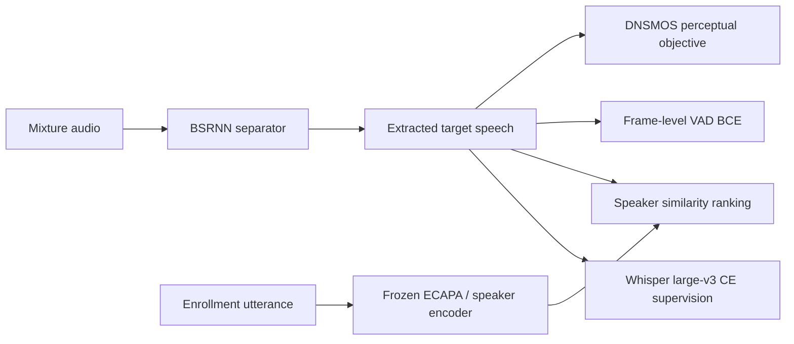
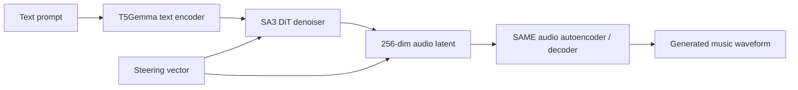
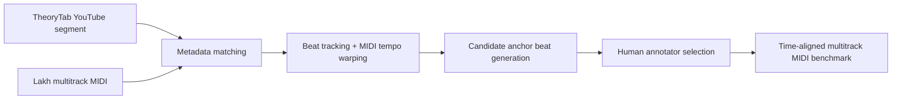
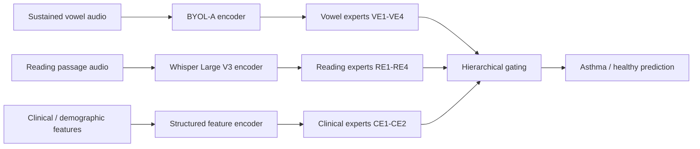

# 语音 / 音频 / 音乐论文速递
## 2026-07-10

> 实际对应 arXiv 更新日：**2026-07-10**  
> 检索范围：`cs.SD + eess.AS`  
> 只放按 ML 顶会审稿口径看，最值得多数读者花时间看的 **5 篇**

## 📋 总览

- 共收录 **5 篇** 相关论文
- 语音分离 / 说话人提取：**1 篇**
- 音乐转写 / 音乐数据：**1 篇**
- 音频生成系统 / 推理部署：**1 篇**
- 音频表示理论 / 可控性：**1 篇**
- 语音健康 / 多模态数字生物标志物：**1 篇**

今天这批最值得看的不是谁把参数堆得更大，而是三条很实在的线。`PS4` 直接回答了一个老大难问题：真实会议混叠里没有干净 target，TSE 训练到底怎么做；它用 proxy-supervised 多目标联合训练把 REAL-T 榜单硬抬上去。`aria` 也很值得看，因为它不是再发一个“更会写 prompt 的音乐模型”，而是把 Stable Audio 3 真正压到本地和树莓派上跑，还把 steering 做成 runtime 原生能力。`Structural Bottlenecks` 则属于少见的“泼冷水但很有用”的论文，它不是再吹 end-to-end audio 多神，而是证明很多模型根本没把频率原语保住，解释性和可控性差不是偶然。

剩下两篇里，`MulTTiPop` 是做 AMT 和音乐理解的人该收下的数据集文，虽然不是新模型，但它把“真实商用流行音乐的多轨转写评测集”这个坑补上了；哮喘数字生物标志物那篇则更偏健康音频应用，方法上不炫，但多模态 MoE 和可解释 gating 分析做得比较完整。

## 精选入选规则

- **新意（0-3）**：是不是提出了新的表示、训练组织、部署接口，或者把老问题拆得更对
- **影响力（0-3）**：是不是贴近语音分离、音频生成、音乐转写、可控表示、语音健康这些主线
- **证据强度（0-2）**：有没有清楚的 baseline、关键指标、数值和消融
- **受众匹配度（0-2）**：对语音大模型 / 语音前端 / 音频生成 / 音乐理解研究者有没有直接启发

分数校准：

- **6**：可读，但更像局部补丁或分析性论文
- **7**：信息量够，值得过一遍
- **8+**：建议优先精读

## 总览表

| 方向 | 序号 | 论文 | 评分 | 关键词 |
|---|---:|---|---:|---|
| 语音分离 / TSE | 1 | PS4 | 8.5/10 | target speaker extraction, proxy supervision, REAL-T, Whisper, DNSMOS |
| 音频生成系统 / 部署 | 2 | aria | 8.5/10 | Stable Audio 3, native runtime, quantization, Raspberry Pi, activation steering |
| 音频表示理论 / 可控性 | 3 | Structural Bottlenecks on Frequency Representation in End-to-End Audio Models | 8/10 | alias collapse, separability, GLRF, EnCodec, DAC |
| 音乐转写 / 数据集 | 4 | MulTTiPop | 7.5/10 | multitrack transcription, pop music, Lakh MIDI, TheoryTab, AMT benchmark |
| 语音健康 / 多模态数字生物标志物 | 5 | Multimodal Digital Biomarker for Asthma | 7/10 | asthma detection, Mixture-of-Experts, vocal biomarker, clinical fusion |

## 🗣️ 语音分离 / 说话人提取

### [1] PS4: Proxy-Supervised Joint Training for Real Target Speaker Extraction

- **评分**：8.5/10
- **作者/机构**：Wanyi Ning, Wei Zhou, Yingpeng Li, Yinshang Guo, Haitao Qian, Yiming Cheng；Yijiahe AI、天津大学、南京大学
- **论文链接**：https://arxiv.org/abs/2607.08111
- **PDF**：https://arxiv.org/pdf/2607.08111.pdf
- **代码链接**：**代码已开源** https://github.com/TaurenMountain/PS4
- **Demo 链接**：https://real-tse.github.io/challenge/

#### 📌 简介
这篇做的是现实场景 target speaker extraction，不是实验室里那种干净单说话人拼混音。作者抓住了真正的痛点：真实会议和对话录音里没有 clean target，传统 `SI-SNR` 监督根本没法直接用，所以他们把训练目标改成 proxy-supervised，多路弱监督一起压模型。

#### ☠️ 毒舌点评
这篇不是“又一个分离模型换 loss”这么简单，真正值钱的是它把真实多说话人场景下“没有干净标签怎么训”这件事给工程化了。实验也不是嘴炮，`REAL-T` 五个子集、四个指标都打了，榜单还是第 2，而且 `SIM` 和 `Timing F1` 是第一；对做 TSE、会议语音、个性化语音接口的人来说，值得读。

#### 🔧 技术方案
- **模型解决的问题**：真实会话录音里存在混响、背景噪声、设备失真、自然重叠和不规则说话人比例，但训练时拿不到目标说话人的干净参考语音，所以传统基于信号级监督的 TSE 训练路径在真实数据上断了。`PS4` 解决的是“如何只靠真实对话数据自带的代理信号，把 TSE 模型真正微调到现实场景”。
- **模型架构**：
  - **输入**：多说话人混合语音 `mixture`，以及目标说话人的 enrollment utterance。
  - **输出**：提取出的目标说话人语音。
  - **主干**：`BSRNN separator + frozen ECAPA-TDNN speaker encoder`。
  - **关键模块**：
    - `REAL-PS4` 训练集构建流水线，从 `AISHELL-4`、`AliMeeting`、`AMI`、`CHiME-6` 四个真实会话数据集重组出训练样本。
    - 语言代理监督：`Whisper large-v3` 产生可反传的 ASR cross-entropy。
    - 说话人代理监督：`ResNet34` speaker encoder 做 cosine-margin ranking。
    - 时间代理监督：基于 diarization 的 frame-level VAD BCE。
    - 感知代理监督：`DNSMOS` overall quality 作为可微感知质量目标。
- **信号流**：

- **关键设计 / 核心创新**：核心不是造一个新 backbone，而是把真实数据里现成可拿到的四类代理信号组织成联合训练目标，替代不可得的 clean target。这个设计比单一 ASR loss 或单一 speaker loss 更稳，因为它同时约束语言内容、说话人身份、时间活动边界和感知质量。
- **训练 / 推理策略**：
  - 训练数据来自 `REAL-PS4`，共 **71,771** 个样本，覆盖中英双语。
  - 只微调 `BSRNN separator`，`ECAPA-TDNN` speaker encoder 冻结。
  - 联合目标为 `L = λce LCE + λsim LSIM + λdns LDNSMOS + λvad LVAD`。
  - `Whisper` 负责语言正确性，`ResNet34` 负责身份保持，VAD 保证时间对齐，`DNSMOS` 保证音质。
  - 推理时仍是标准的 enrollment-conditioned TSE，不增加额外 teacher 模块。

#### 📊 实验结果
- 数据与协议：`REAL-T` development set，含 **1,991** 个样本，来自 `AISHELL-4`、`AliMeeting`、`AMI`、`CHiME-6`、`DipCo` 五个真实会话语料。
- baseline：`BSRNN_EMB`、`BSRNN_TFMAP`，都还是在模拟混音上训练的官方基线。
- 开发集整体结果：
  - `PS4`：`TER 0.473`，`SIM 0.631`，`DNSMOS OVRL 3.377`，`F1 0.888`
  - `AMI` 子集最好：`TER 0.388`，`SIM 0.714`，`DNSMOS 3.549`，`F1 0.902`
  - `AISHELL-4` 最难：`TER 0.567`
- 挑战榜验证集结果：
  - `PS4`：`TER 0.639`，`F1 0.871`，`SIM 0.565`，`DNSMOS-P808 3.128`
  - 对比 `CARTSE’s`：`TER 0.651`，`F1 0.857`，`SIM 0.544`
  - 对比 `BSRNN_EMB`：`TER 0.829`，`F1 0.829`，`SIM 0.417`
  - `PS4` 在官方榜单 **排名第 2**，但 `speaker similarity` 和 `timing F1` 都是第一。
- 结论不夸张：它不是所有指标都第一，`DNSMOS-P808` 不是最优，但在真实场景下把核心 TSE 指标明显抬上去了。

#### 💡 为什么值得看
如果你做真实会议语音或个性化语音分离，这篇最值得看的不是 BSRNN 本身，而是“真实数据无干净标签时怎么训”的完整监督设计。很多人卡死在数据条件，这篇给的是可落地路线。

#### 评分：8.5/10
理由：问题真，训练设计硬，榜单结果也能打。扣分点是 backbone 还是经典 BSRNN 路线，不是模型范式创新，但这恰恰说明方法有实战价值。

## 🎛️ 音频生成系统 / 本地部署

### [2] A Quantized Native Runtime for On-Device Semantic Audio Generation

- **评分**：8.5/10
- **作者/机构**：Matteo Spanio, Antonio Rodà；University of Padova, Centro di Sonologia Computazionale
- **论文链接**：https://arxiv.org/abs/2607.08526
- **PDF**：https://arxiv.org/pdf/2607.08526.pdf
- **代码链接**：**代码已开源** https://github.com/matteospanio/aria
- **Demo 链接**：暂无

#### 📌 简介
这篇不是发新音乐模型，而是把 `Stable Audio 3` 做成一个真正能在本地和边缘设备跑的原生 runtime。作者用纯 `C/CUDA` 的 `aria` 跑通 tokenizer、text encoder、DiT denoiser 和 autoencoder 整条链路，还把量化和 activation steering 做成系统层能力。

#### ☠️ 毒舌点评
这种论文最容易被人嫌“不够算法”，但实际落地价值很高。它直面的是一个行业里经常被回避的问题：很多音频生成模型 demo 很酷，部署链路却重得像卡车。`aria` 的亮点不是声称比 SA3 更会生成，而是把 cold start、显存、CPU-only、树莓派、实时 steering 这些真正烦人的工程问题用数据说清楚。

#### 🔧 技术方案
- **模型解决的问题**：现有开放音乐生成模型通常默认 `Python/PyTorch + GPU`，冷启动慢、显存吃紧、CPU-only 几乎不可用，边缘设备更不用想。`aria` 解决的是“如何把 `Stable Audio 3` 的完整 text-to-music 链路压到 dependency-free native runtime 上，同时保住精度和可控性”。
- **模型架构**：
  - **输入**：文本 prompt；可选 steering direction。
  - **输出**：生成的音频 latent，再解码为最终音频。
  - **主干**：`SA3 tokenizer + T5Gemma text encoder + DiT denoiser + SAME autoencoder` 的本地原生复现。
  - **关键模块**：
    - `aria runtime`：约 **7.7k** 行 C/CUDA，无深度学习框架依赖。
    - 精度路径：`fp16 / q8 / W8A8 / q4`。
    - `CUDA graph + windowed decoder + banded decoder`。
    - 原生 activation steering：可注入 `DiT residual`、`latent`、`text conditioning` 三个位置。
- **信号流**：

- **关键设计 / 核心创新**：创新不在生成模型，而在部署接口。作者把量化从“额外副本”改成“替换式存储”，压缩后直接释放 fp16 权重；又把 activation steering 放进 runtime graph 里，做到开关 steering 时不重捕获 graph，`strength=0` 时还能 bit-identical。
- **训练 / 推理策略**：
  - 本文不训练新生成模型，主要做 runtime 复现、量化实验和 steering 评测。
  - 支持 `8-step` 采样，默认比较 warm / invocation / cold 三种部署场景。
  - 量化评测用 **24** 个 genre-diverse music prompts × **3** 个 seeds，共 **72** 条 clip。
  - steering 以 sonic seasoning 为案例，用 `wav2taste + CLAP + FAD + drift` 四套 oracles 限定“可控但不过度失真”的窗口。

#### 📊 实验结果
- 部署效率，10 秒 clip，RTX 3070：
  - `aria GPU warm`：small `0.13s`，medium `0.37s`
  - `SA3 GPU warm`：small `0.146s`，medium `0.443s`
  - `aria cold start`：small `1.6s`，medium `2.9s`
  - `SA3 cold start`：small `11.58s`，medium `22.23s`
  - 冷启动大约 **7.2–7.7×** 更快。
- 显存：
  - `aria warm VRAM`：small `1395 MB`，medium `4215 MB`
  - `SA3 warm VRAM`：small `2330 MB`，medium `5948 MB`
- CPU-only：
  - 10 秒 clip，small `2.5s`，medium `9.8s`
  - medium 60 秒在 CPU 上也能跑，只是慢。
- 树莓派 5：
  - small model 10 秒 stereo clip，full precision peak memory `1.9 GB`
  - `8-bit` 后降到 `0.84 GB`
  - medium **1.2B** 模型在 `4-bit` 下可跑，约 `200s`，resident `0.9 GB`，peak `3.6 GB`
- 量化保真：
  - `q8` 和 `W8A8` 在 `CLAP / FAD / taste drift` 三项上都落在 re-seed noise floor 内，基本可视作“无可测退化”
  - `W8A8` 还是最快 GPU 模式，small warm `0.10s`
  - `q4` 明显掉质，但换来 8GB Pi 可运行。
- steering 对比：
  - `SOUR` 在 `α=0.1` 时 `∆w2t +0.419`、`∆CLAP +1.77`、`FAD 561`，属于有效 steering 窗口
  - 再加大到 `α=0.15`，target 继续升，但 `CLAP` 变负、`FAD` 暴涨，说明已经进入 metric-gaming
  - `LoRA` 对比不占优：`SOUR` 的 LoRA 峰值 `∆w2t +0.341` 但 `∆CLAP -0.92`，还要额外训练 **5.15M** 参数
- baseline：官方 `Stable Audio 3 PyTorch stack`，以及同模型下的 `LoRA` steering 路线。

#### 💡 为什么值得看
如果你做音乐生成系统、边缘部署或者本地工作站产品化，这篇值钱在于它把“模型可用”拆成冷启动、常驻、显存、量化、可控性几个独立维度。很多人只比生成质量，这篇至少是在干正事。

#### 评分：8.5/10
理由：系统味很重，但数据扎实，比较公平，量化和 steering 的边界也没乱吹。扣分点是主要价值在工程部署，不是生成建模新范式。

## 🎚️ 音频表示理论 / 可控性

### [3] Structural Bottlenecks on Frequency Representation in End-to-End Audio Models

- **评分**：8/10
- **作者/机构**：Nicole Cosme-Clifford；Yale University
- **论文链接**：https://arxiv.org/abs/2607.08545
- **PDF**：https://arxiv.org/pdf/2607.08545.pdf
- **代码链接**：暂无
- **Demo 链接**：暂无

#### 📌 简介
这篇干的事很反直觉：它不是证明 end-to-end audio 模型多懂频率结构，而是证明很多模型其实把频率原语搞丢了。作者从理论和受控实验两边论证，`EnCodec`、`DAC`、`Stable Audio` 这类 strided convolutional encoder 会出现两类结构瓶颈：alias-induced injectivity collapse 和 separability failure。

#### ☠️ 毒舌点评
这类论文很容易写成“我发现别人都不行”，但这篇至少没停在嘴硬。它给了解析预测、实证相关系数、后处理干预 `GLRF`，还做了 real acoustic string 上的 pitch transfer。问题在于它更多是诊断和 refactorization proof-of-concept，不是直接给你一个能替换现有 codec 的新 encoder；但如果你在做 controllable audio generation，这篇值得读。

#### 🔧 技术方案
- **模型解决的问题**：很多 end-to-end 音频模型在重建和生成指标上表现很好，但这不等于它们保留了可解释、可操控的频率原语。论文要解决的是“这些 encoder 是否真的保留了可独立访问的 time-frequency localized primitives，以及如果没保留，到底是哪里坏了”。
- **模型架构**：
  - **输入**：原始波形，经 `strided convolutional encoder` 编码。
  - **输出**：encoder latent；干预后再送原 decoder 重建或操作。
  - **主干**：分析对象是 `EnCodec`、`DAC`、`Stable Audio` 的 encoder。
  - **关键模块**：
    - `Injectivity analysis`：分析 downsampling 后频率分量是否坍缩到 alias equivalence classes。
    - `Separability analysis`：分析 learned filters 的带宽是否足够分离相邻频率分量。
    - `GLRF (Gabor Latent Refactorization)`：不重训 encoder，只在 latent 上加固定 Gabor filterbank 和线性 mapping，重表达为频率局部化基。
- **信号流**：

- **关键设计 / 核心创新**：这篇最核心的是把“频率表示失真”拆成两种不同机制。injectivity failure 是 alias collapse，基本只能在 stride schedule 设计时解决；separability failure 是 filter bandwidth 太宽，理论上可以后处理补救。`GLRF` 的价值就在于它证明后者确实能补一部分。
- **训练 / 推理策略**：
  - 不重训原始 encoder。
  - `GLRF` 只拟合一个 channel-wise 线性 mapping `M`，用 ridge regression 让 `z ≈ M z̃`。
  - 用 synthetic narrowband signals 做理论验证和 substitution 实验，再用 `NSynth` acoustic strings 做真实 pitch transfer 验证。
  - 推理时在 refactorized latent 空间做 interpolation 或 targeted substitution。

#### 📊 实验结果
- 理论与实证一致性：
  - predicted vs observed collapse rate 相关系数 `r ≈ 0.99`
  - 共评估 **643** 个 signal configurations
- 原始结构瓶颈：
  - well-structured data 上，collapse rate 达 **31–35%**
  - learned filter bandwidth 比 theoretical resolution bound 大 **9–35×**
  - Table 2：
    - `EnCodec` 最窄带宽 `14.16 Hz`，是 receptive-field bound 的 `10×`
    - `DAC` `8.30 Hz`，是 `35×`
    - `Stable Audio` `1.47 Hz`，是 `31×`
- `GLRF` 后：
  - `EnCodec` 最窄带宽降到 `6.93 Hz`，约 `1.62×` bound
  - `DAC` `4.64 Hz`，约 `2.21×`
  - `Stable Audio` `2.12 Hz`，约 `1.48×`
  - latent cosine 仍有 `0.97–0.98`
  - log-mel reconstruction error 仍较低：`0.62 / 0.37 / 0.55`
- 控制性结果：
  - synthetic mixture interpolation：decoded audio band energy 标准差 `0.02–0.05`，原 latent 空间是 `0.240–0.270`
  - `NSynth` 真乐器 pitch pair，共 **1,037** 对：
    - F0 transfer direction 正确率 **97.3%**
    - 小音程 `3–5 semitones` 约 **96%**
    - 大于 2 个八度约 **99%**
  - DAC 的 targeted substitution：
    - `GLRF` 空间成功 **200/200**
    - 原始 latent 只成功 **60/200**，约 `30%`，还低于随机水平
- baseline / 对照：`EnCodec`、`DAC`、`Stable Audio` 原始 latent；以及原始 latent 上 top-k channel baseline。

#### 💡 为什么值得看
这篇最值得看的点是，它把“为什么很多音频模型不太可控”从经验抱怨变成了结构性分析。你不一定马上用 `GLRF`，但它会逼你重新看 stride schedule、latent geometry 和控制接口。

#### 评分：8/10
理由：分析深、数字硬、干预也不是嘴上说说。扣分点是更偏诊断框架和 proof-of-concept，离直接产品级可控生成还有距离。

## 🎼 音乐转写 / 评测数据

### [4] MulTTiPop: A Multitrack Transcription Dataset for Pop Music

- **评分**：7.5/10
- **作者/机构**：Nathan Pruyne, Benjamin Stoler, William Chen, Chien-yu Huang, Shinji Watanabe, Chris Donahue；Carnegie Mellon University
- **论文链接**：https://arxiv.org/abs/2607.08756
- **PDF**：https://arxiv.org/pdf/2607.08756.pdf
- **代码链接**：暂无
- **Demo 链接**：https://gclef-cmu.org/multtipop

#### 📌 简介
这篇不是新 AMT 模型，而是补了一个很缺的数据坑：真实商业流行音乐的多轨转写评测集。`MulTTiPop` 把 YouTube 商业音频片段和 Lakh MIDI / TheoryTab 的多轨 MIDI 对齐，最后产出 **572** 段、总计 **3.5 小时** 的 multitrack pop transcription benchmark。

#### ☠️ 毒舌点评
数据集论文最怕“量不大、流程复杂、结论还很虚”。这篇规模不算大，但问题抓得准，因为现在很多 AMT 模型在 `Slakh2100` 这种合成音频上能打，一到真实流行乐就原形毕露。缺点也很明显：它就是评测集，不是训练大语料；自动候选对齐成功率也不高，人工筛选成本不低。

#### 🔧 技术方案
- **模型解决的问题**：真实 commercial pop music 的多轨 AMT 缺少高质量 time-aligned multitrack MIDI benchmark。已有 `MAESTRO`、`MusicNet` 太偏钢琴/古典，`Slakh2100` 是合成音频，`TheoryTab` 只有 melody/chord，不是完整多轨。
- **模型架构**：
  - **输入**：来自 `TheoryTab` 的 YouTube 音频片段与元数据，以及 `LMD-matched` 的 multitrack MIDI。
  - **输出**：和原音频片段时间对齐的 multitrack MIDI transcription 标注。
  - **主干**：不是生成模型，而是数据构建流水线。
  - **关键模块**：
    - metadata-based MIDI/audio matching
    - beat-based audio-MIDI alignment
    - candidate anchor beat selection
    - human alignment annotation
- **信号流**：

- **关键设计 / 核心创新**：新意不在模型，而在于它把真实流行音乐音频、多轨 MIDI 和人工锚点校正组合起来，最终给 AMT 社区一个“商业流行乐真实场景” benchmark，而不是继续拿合成多轨刷分。
- **训练 / 推理策略**：
  - 数据来源：`TheoryTab` 提供音频片段，`Lakh MIDI Dataset` 提供 multitrack MIDI。
  - 候选对齐先用 `chroma similarity + onset correlation`，再加 melody matching 和 YouTube timing 约束扩展候选 anchor。
  - 最终由 **6** 名标注者人工筛选正确 anchor beat。
  - 论文明确建议：`MulTTiPop` 只用于 evaluation，不用于 training。

#### 📊 实验结果
- 数据规模：
  - **572** 个 segments
  - **3.5 小时** 音频
  - **374** 首歌、**263** 位艺术家
  - 平均每段 **22 秒**、约 **583** 个 MIDI notes
  - 风格覆盖从 **1930s 到 2000s**
- 对齐候选有效性：
  - annotator 最终接受某个候选对齐的比例只有 **49.1%**
  - `melody` 方法把成功率从 base 的 **2.3%** 拉到 **31.7%**
  - 再加 YouTube timing 约束后到 **40.0%**
- AMT benchmark 结果：
  - baseline：`MT3`、`YourMT3+`
  - exact instrumentation：
    - `MT3`：`Precision 31.03`，`Recall 28.18`，`Onset F1 28.42`
    - `YourMT3+`：`29.51 / 24.10 / 25.29`
  - harmonic-percussive reduction：
    - `MT3`：`Onset F1 36.83`
    - `YourMT3+`：`Onset F1 37.87`
  - 也就是说最好也就 **38% Onset F1**，离可用还远。
- baseline 解读：
  - `YourMT3+` 在别的数据集上往往优于 `MT3`，但这里 exact instrumentation 反而更差
  - 论文认为原因之一是两者都主要在 `Slakh2100` 这类合成多轨数据上训练

#### 💡 为什么值得看
如果你做 AMT 或音乐理解，这篇的价值不在模型分数，而在于它提醒你：很多系统只是对合成数据熟，不是真的会转写流行乐。这个 benchmark 很适合拿来测模型是不是在真实商业音频上露馅。

#### 评分：7.5/10
理由：数据集价值明确，评测结论也有用。扣分点是规模偏小，而且构建流程人工成本高，不是那种一出手就改变全社区范式的资源。

## 🩺 语音健康 / 多模态数字生物标志物

### [5] Multimodal Digital Biomarker for Asthma: Complementary Roles of Vocal, Clinical and Demographic Factors

- **评分**：7/10
- **作者/机构**：Vladimir Despotovic, Milena Despotovic, Abir Elbeji, Petr V. Nazarov, Guy Fagherazzi；Luxembourg Institute of Health
- **论文链接**：https://arxiv.org/abs/2607.08714
- **PDF**：https://arxiv.org/pdf/2607.08714.pdf
- **代码链接**：暂无
- **Demo 链接**：https://www.colivevoice.org

#### 📌 简介
这篇做的是哮喘筛查的多模态数字生物标志物：把持续元音、朗读段落、临床和人口统计特征放进一个 `Mixture-of-Experts` 框架里，做 smartphone-collected asthma detection。重点不在 fancy audio model，而在多模态融合和 gating 可解释性。

#### ☠️ 毒舌点评
这不是语音大模型论文，也不是那种看完想立刻复现的 SOTA 稿。它更像一篇认真做 clinical ML 的健康音频应用文：数据规模还行，ablation 清楚，gating 分析也不是摆设。短板是任务还是偏特定场景，模型本身创新度一般，更多是把多模态 clinical prediction 套到 vocal biomarker 上。

#### 🔧 技术方案
- **模型解决的问题**：现有哮喘语音筛查通常只看 acoustic features，很少把临床上下文一起放进模型里。作者要解决的是“不同语音任务和临床变量在哮喘筛查里到底怎么互补，以及能不能用可解释的多模态融合把性能和可信度一起拉上去”。
- **模型架构**：
  - **输入**：持续元音录音、朗读段落录音，以及年龄、性别、语言、BMI、吸烟状态、压力、VQ11、FSS 等结构化临床/人口统计特征。
  - **输出**：哮喘 / 健康二分类概率。
  - **主干**：multimodal `Mixture-of-Experts`。
  - **关键模块**：
    - `BYOL-A` 提取 sustained vowel embeddings
    - `Whisper Large V3 encoder` 提取 reading passage embeddings
    - clinical/demographic 10 维向量单独编码
    - 专家网络：`VE1–VE4`、`RE1–RE4`、`CE1–CE2`
    - hierarchical gating：expert-level + modality-level 两级 gate
- **信号流**：

- **关键设计 / 核心创新**：创新点主要有两个。第一是把两个互补语音任务和临床变量一起放进 MoE，而不是简单 early/late fusion。第二是 gate 权重拿来做 participant-level 可解释性分析，看模型什么时候更依赖语音、什么时候更依赖临床特征。
- **训练 / 推理策略**：
  - 数据来自 `Colive Voice`，共 **1,218** 名参与者，哮喘和健康对照等量匹配。
  - 评估采用 repeated `10×10` stratified cross-validation。
  - expert-level gate 和 group-level gate 都使用 softmax，temperature `T=1.0`。
  - 模型选择使用 `0.5 * AUROC + 0.5 * Youden’s index` 的组合目标。
  - 推理时输出分类概率，并用 calibration curve 和 Brier score 评估可靠性。

#### 📊 实验结果
- 数据集：
  - **1,218** 位参与者
  - 英语 `742`，法语 `476`
  - smartphone-collected real-world recordings
- full multimodal MoE：
  - `AUROC 0.85`，95% CI `0.83–0.86`
  - `Accuracy 0.77`
  - `Sensitivity 0.75`
  - `Specificity 0.79`
  - `Precision 0.79`
  - `F1 0.76`
  - `Brier score 0.17`
- ablation（Table 2）：
  - `SV` 单模态：`AUROC 0.69`
  - `RP` 单模态：`0.65`
  - `CD` 单模态：`0.75`
  - `SV+CD`：`0.83`
  - `RP+CD`：`0.84`
  - `SV+RP+CD`：`0.85`
  - 可以看出临床特征本身是最强单模态，语音主要在融合后贡献增益。
- 可解释性分析：
  - `CE2` 在多数 fold 里 gate 较高，峰值均值约 `0.26`
  - reading gate weights 与 `VQ11` 呈小幅正相关
  - clinical/demographic gate weights 与 `VQ11` 呈小幅负相关，约 `r = -0.10, p = 0.036`
- baseline / 对照：单模态和双模态配置，不是外部大型 benchmark baseline。

#### 💡 为什么值得看
如果你做 health audio 或 digital biomarker，这篇值得看的不是 AUROC 本身，而是它很诚实地证明：单靠语音不够，临床上下文才是强基线，语音更像加分项。这个结论比空喊“voice AI can diagnose disease”靠谱得多。

#### 评分：7/10
理由：应用问题真实，多模态设计和 ablation 也完整。扣分点是模型创新度一般，外部泛化和跨中心验证还没站稳，更像一篇扎实应用文而不是方法强稿。

## 最后结论

今天最值得优先看的是这三篇：

1. `PS4`：真实会话场景的 target speaker extraction 终于不再只靠模拟混音硬撑，proxy-supervised 这套训练思路很有复用价值。
2. `aria`：如果你关心音频生成系统落地，这篇比“再来一个更大音乐模型”更有现实意义，量化、本地部署和 steering 评测都给了硬数据。
3. `Structural Bottlenecks on Frequency Representation in End-to-End Audio Models`：它会逼你重新思考 end-to-end audio latent 到底有没有保留可控频率结构，这个问题对 codec、生成、可解释性都很关键。

`MulTTiPop` 适合 AMT / 音乐理解方向的人收下做 benchmark，`Asthma` 那篇则更偏健康音频应用参考。整体看，今天不是“模型规模竞赛日”，而是“真实场景训练、系统部署和表示可控性”这三条线更值得看。
