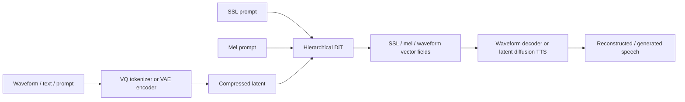
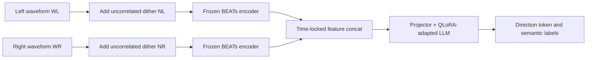
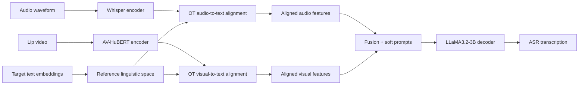
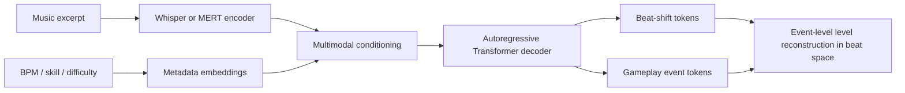
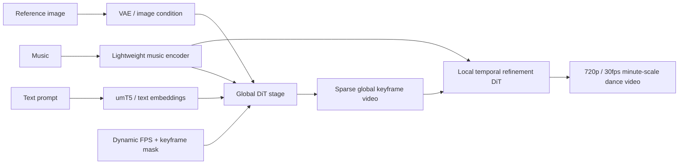

# 语音 / 音频 / 音乐论文速递
## 2026-07-13

> 实际对应 arXiv 更新日：**2026-07-13**  
> 检索范围：`cs.SD + eess.AS`  
> 只放按 ML 顶会审稿口径看，最值得多数读者花时间看的 **5 篇**

## 📋 总览

- 共收录 **5 篇** 相关论文
- 语音大模型 / 多模态识别：**1 篇**
- 波形生成 / TTS：**1 篇**
- 音乐交互建模：**1 篇**
- 音频大模型空间感知：**1 篇**
- 音乐到舞蹈生成：**1 篇**

今天这批里，真正值得优先看的不是“谁又把模型堆大了”，而是三条更硬的技术线。`ReGen` 证明超低码率波形 latent 不一定只能在音质和语义里二选一，它把表示生成、层级多提示和 waveform-level flow matching 真正揉成了一套系统；`Dual-BEATs` 则很少见地直接指出音频大模型“听不见空间”的根因可能不是数据不够，而是归一化把左右通道差异压没了；`OT-AVSR` 的价值更实用，它不是再换一个融合模块，而是把 audio / visual / text 三个空间先对齐到 LLM 词嵌入语义上，再谈融合。

剩下两篇也不是凑数。音乐游戏 token 化那篇虽然题目不大，但它把 frame-level onset 检测改成事件级 beat-shift 序列，这个表示改造对音乐结构建模很干净；`Wan-Dancer` 则是很典型的“结果很猛但成本也很猛”的工业派论文，主张分钟级 music-to-dance 要先做全局 keyframe 规划，再做局部细化，不再靠 5 秒 clip 缝合硬凑长视频。

## 精选入选规则

- **新意（0-3）**：是不是提出了新的表示、训练组织方式、控制接口，或者把旧问题拆得更对
- **影响力（0-3）**：是不是贴近语音大模型、TTS、音频理解、音乐生成、跨模态生成这些主线
- **证据强度（0-2）**：有没有清楚的 baseline、关键指标、数值和消融
- **受众匹配度（0-2）**：对语音大模型 / 语音前端 / 音乐方向 / 多模态生成研究者有没有直接启发

分数校准：

- **6**：可读，但更像局部补丁或小众任务论文
- **7**：信息量够，值得过一遍
- **8+**：建议优先精读

## 总览表

| 方向 | 序号 | 论文 | 评分 | 关键词 |
|---|---:|---|---:|---|
| 波形生成 / TTS | 1 | ReGen | 8.5/10 | representation generation, hierarchical multi-prompt, GFM, 12.5 Hz latent, ReGenVoice |
| 音频大模型空间感知 | 2 | Dual-BEATs | 8/10 | stereo perception, dithering, normalization bottleneck, zero-shot spatial hearing |
| 语音大模型 / 多模态识别 | 3 | OT-AVSR | 8/10 | optimal transport, LLM-AVSR, Whisper, AV-HuBERT, semantic alignment |
| 音乐交互建模 | 4 | Event-Based Token Sequences | 7.5/10 | rhythm game, event tokens, beat-shift, ACS, Whisper |
| 音乐到舞蹈生成 | 5 | Wan-Dancer | 7.5/10 | minute-scale dance, global-to-local, dynamic FPS, optical flow, LoRA |

## 🔊 波形生成 / TTS

### [1] ReGen: Hierarchical Multi-Prompt Representation Generation for Efficient Waveform Diffusion Models

- **评分**：8.5/10
- **作者/机构**：Sang-Hoon Lee, Ha-Yeong Choi；Ajou University、KT Corp.
- **论文链接**：https://arxiv.org/abs/2607.09134
- **PDF**：https://arxiv.org/pdf/2607.09134.pdf
- **代码链接**：暂无（文中说明将开源）
- **Demo 链接**：https://regenvoice.github.io/demo/

#### 📌 简介
这篇想解决的是一个老问题：超低码率音频 latent 一旦压得太狠，语义会丢，声学细节也会丢，最后只能靠额外 tokenizer、额外 distillation、额外多阶段系统来补。`ReGen` 的思路不是继续对中间表征做对齐约束，而是直接把语义表示和波形一起当成生成目标，用一个层级化 DiT 同时预测多个表示层的向量场。

#### ☠️ 毒舌点评
这篇不是简单把 REPA 换个名字。作者先证明了 REPA 在极低比特率条件下会把 latent 缠死，然后给出 `representation generation` 这条替代路线，实验也覆盖了 codec、VAE、prompted reconstruction 和 TTS。缺点也很明显：篇幅里新点很多，系统很重，读者得花点时间区分哪些提升来自 ReGen，哪些来自后续 GFM 和 adversarial post-training。

#### 🔧 技术方案
- **模型解决的问题**：传统 waveform diffusion 里，`representation alignment` 虽然能加速训练，但会把本来就很挤的低码率 latent 进一步绑死，导致语义和声学都不够自由。`ReGen` 解决的是“能不能在极低码率 latent 上，一边保住语义，一边保住可生成的声学容量，而不是只会复读一个平均解”。
- **模型架构**：
  - **输入**：高压缩 VQ token 或 VAE latent；可选 SSL 语义表示、mel 提示、文本提示、音频 prompt。
  - **输出**：对应层级的 SSL / mel / waveform 向量场预测，以及最终波形或 TTS 语音。
  - **主干**：层级化 `DiT` waveform diffusion / latent diffusion backbone。
  - **关键模块**：
    - `ReGen`：不再只对齐表示，而是联合生成表示和数据。
    - `Hierarchical Multi-Prompt`：把 `SSL / mel / waveform` 三层提示分层送进同一 DiT。
    - `GFM (Generalized Flow Matching)`：在速度场空间加 repulsive term，防止多条随机轨迹塌成一个均值流。
    - `ReGenTokenizer`：25 Hz、400 bps 的 neural audio codec 路线。
    - `ReGenVAE`：12.5 Hz、32 维 latent 的 VAE 路线。
    - `ReGenVoice`：基于 ReGenVAE latent 的 6.25 Hz TTS LDM。
- **信号流**：

- **关键设计 / 核心创新**：最核心的变化是把“表示作为监督信号”升级成“表示本身也要生成”。这让模型不是被迫把所有信息压进一个被对齐过头的 latent，而是可以在层级结构里逐步从语义走向声学。`GFM` 也不是装饰性的数学包装，它直接针对 waveform regression 常见的 over-smoothing 问题下手。
- **训练 / 推理策略**：
  - 训练数据：重建任务用 `LibriSpeech`、`LibriTTS` 和 `Emilia`；TTS 用 `LibriTTS` 和 `Emilia-en`。
  - `ReGenTokenizer / ReGenVAE` 预训练使用 `AdamW`，batch size **256**，最长训练 **1M** steps；后续再做 **0.5M** steps adversarial post-training。
  - `ReGenVoice` 在 **4 张 H100** 上训练，文中称 **1 天** 内可跑完基础版本。
  - 推理时 `ReGenVoice` 在 latent 6.25 Hz 上做 diffusion，`25 NFE` 作为速度和质量折中点，RTF 报到 **0.08**。

#### 📊 实验结果
- 重建基线对比覆盖：`SpeechTokenizer`、`BigCodec`、`X-codec2`、`StableCodec`、`EnCodec`、`DAC`、`Mimi`、`WavTokenizer`。
- `LibriSpeech` 重建（Table 1）：
  - `ReGenVAE-LibriTTS`：`WER 2.05`、`STOI 0.94`、`PESQ-NB 3.38`、`UTMOS 4.21`
  - 对比 `Mimi`：`WER 2.92`、`PESQ-NB 2.80`
  - 对比 `ReGenTokenizer-LibriTTS`：`WER 2.83`、`PESQ-NB 1.65`
- `LibriTTS` 重建（Table 2）：
  - `ReGenVAE-LibriTTS`：`CER 0.94`、`WER 2.88`、`PESQ 3.058`、`Pitch 28.299`、`MOS 3.85`
  - 对比 `DAC`：`WER 2.91`、`PESQ 3.505`
  - 对比 `EnCodec 24k/600`：`WER 3.55`、`MOS 3.68`
- prompted reconstruction（Table 3）：
  - `ReGenVAE-LibriTTS`：`WER 2.03`、`SPK-SIM 0.72`、`UTMOS 3.87`
  - 对比 `TaDiCodec 12.5 Hz`：`WER 2.57`、`SPK-SIM 0.69`
  - 对比 `CosyVoice2`：`WER 4.10`、`SPK-SIM 0.68`
- ablation（Table 4, 5）：
  - `No REPA` 基本炸掉：`WER 136.57`
  - `REPA-H (SSL, Mel)`：`WER 11.99`
  - `ReGenTokenizer + GFM`：`WER 12.59`
  - `ReGenVAE + adversarial post-training` 最终到 `WER 2.88`、`UTMOS 4.096`
  - 说明 `ReGen + GFM + adversarial post-training` 三者是连续接力，不是单点 miracle
- zero-shot TTS（Table 6, 7, 9）：
  - `ReGenVoice 0.5B / 0.5k h`：`WER 1.46`、`SIM 0.64`
  - `ReGenVoice 0.5B / 40k h`：`WER 1.62`、`SIM 0.70`
  - `25 NFE`：`WER 1.62`、`SIM 0.70`、`UTMOS 3.81`
  - `ReGenVoice (25 NFE)` 的主观 `MOS 4.029±0.02`，`RTF 0.08`
  - 对比 `CosyVoice2`：`WER 2.57`、`SIM 0.65`、`RTF 1.05`

#### 💡 为什么值得看
这篇最值得看的点，不是它又做了一个能说话的 diffusion TTS，而是它把超低码率 audio representation 的问题拆得很清楚：REPA 为什么会伤 generative capacity，分层提示为什么比直接蒸馏更稳，waveform-level flow matching 为什么需要 repulsive regularization。做 codec、语音生成、统一表示的人都能从这里拿到真东西。

#### 评分：8.5/10
理由：方法链条完整，实验覆盖硬，数值也站得住。扣分点是系统复杂度高、变量多，复现成本不低，而且当前代码还没真正开源。

## 🧭 音频大模型空间感知

### [2] Dual-BEATs: Unlocking Zero-Shot Stereo Audio Perception in Audio Large Language Models via Dithering

- **评分**：8/10
- **作者/机构**：Shuo-Chun Lin, Hen-Hsen Huang；Academia Sinica
- **论文链接**：https://arxiv.org/abs/2607.08800
- **PDF**：https://arxiv.org/pdf/2607.08800.pdf
- **代码链接**：暂无
- **Demo 链接**：暂无

#### 📌 简介
这篇想修的不是普通 audio caption，而是“为什么现成 audio LLM 明明语义很强，却几乎都没有真 stereo hearing”。作者给出的判断很直接：不是模型完全不会，而是标准 pipeline 把多通道先 downmix 成 mono，再加上内部 normalization 把左右细微差异压平了，空间几何在进 LLM 之前就死了。

#### ☠️ 毒舌点评
这篇有点反常识，但挺有意思。它没去造一个更重的空间编码器，反而用两个普通 `BEATs` 编码左右声道，再在编码前加一层不相关 dithering 噪声，硬把 inter-channel variance 搬过 normalizer。这个点很聪明，但任务也比较窄，目前主要是三分类方向感知，不是完整的真实世界 SELD。

#### 🔧 技术方案
- **模型解决的问题**：主流音频多模态模型大多只会“听见是什么”，不会“听见在哪边”。`Dual-BEATs` 解决的是“在不重训专用 stereo encoder 的前提下，能不能让标准 audio LLM 真正保留左右通道的空间差异，并对未见过的 panning 幅度做 zero-shot 泛化”。
- **模型架构**：
  - **输入**：双声道 stereo waveform，左声道 `WL` 和右声道 `WR`。
  - **输出**：方向分类结果 `Left / Center / Right`，同时保留语义标签预测能力。
  - **主干**：`Dual-BEATs semantic encoders + projector + Gemma-3-1B / OLMo-3-7B`。
  - **关键模块**：
    - 双路 `BEATs`：左右声道独立走两套相同的 frozen semantic encoder。
    - `feature-dimension concatenation`：按时间锁步拼接左右通道特征。
    - `uncorrelated dithering noise floor`：在编码前向左右声道分别加独立噪声。
    - `QLoRA`：只微调 LLM 适配层和 projector。
- **信号流**：

- **关键设计 / 核心创新**：文章最硬的 claim 是“normalization bottleneck”而不是“stereo encoder 不够强”。作者认为 subtle panning 的左右差别在经过 RMSNorm / LayerNorm 后会被动态标准化掉，所以用不相关 dither 建一个 macro-variance floor，把真正的 inter-channel delta 一起“漂”过归一化层。这不是传统正则化噪声，而是结构性 bypass。
- **训练 / 推理策略**：
  - 数据来自按 `Spatial-AST` 规则筛过的 `AudioSet` 子集，训练 **18,373** 条，评估 **17,148** 条，覆盖 **355** 个声学标签。
  - 通过 deterministic amplitude panning 动态把 mono 样本变成 stereo，构造 `Left / Center / Right` 任务。
  - 仅做单次前向分类，不依赖 test-time ensembling。
  - `DA = 0.05` 是主实验默认 dithering amplitude。

#### 📊 实验结果
- 主对比不是和外部复杂 spatial encoder 比，而是与 **同一架构的 undithered baseline** 比较，这是这篇最关键的 baseline。
- 方向分类（Table 1）：
  - `OLMo-3-7B + Dual-BEATs, Direction-First`
    - `P A = 0.00`：`Off 99.5`，`On 99.0`
    - `P A = 0.25`：`Off 80.2`，`On 98.6`
    - `P A = 0.50`：`Off 37.9`，`On 97.1`
  - `Gemma-3-1B + Dual-BEATs, Direction-First`
    - `P A = 0.50`：`Off 33.8`，`On 58.0`
  - 三分类 random chance 是 **33.3%**，所以 `Off 37.9 / 33.8 / 33.2` 这类结果基本就是空间盲。
- zero-shot spatial generalization（Figure 2）：
  - dithered `OLMo-3-7B` 在只见过 `P A = 0.25` 训练条件下，测试到未见过 `P A = 0.00` 仍有 **98.4%**；
  - 训练在最难的 `P A = 0.50` 后，测试到更大差异的 `P A = 0.00~0.25` 都有 **96.3%+**。
- semantic tax（Figure 3）：
  - dither 会让 semantic F1 从理论 mono ceiling **40.6%** 掉到大约 **35.5%**
  - 但 undithered baseline 遇到 hard-panned `P A = 0.00` 时会直接掉到数据统计先验 **28.73%**
  - 也就是说，这个噪声不是白给的，但比“彻底聋掉”强得多。
- 极限边界：
  - 在 `P A = 0.80`、约 **1.9 dB** inter-channel difference 的近人耳分辨下限条件，dithered `OLMo-3-7B` 仍有 **57.7%** zero-shot 准确率，明显高于随机。

#### 💡 为什么值得看
如果你在做 audio LLM、多通道感知或者空间音频理解，这篇值钱在于它给出了一个非常可检验的假设：空间信息丢失可能是 normalization 的结构性问题，而不只是数据和模型规模问题。这个视角一旦成立，很多“空间能力差”的系统都值得重做一次 ablation。

#### 评分：8/10
理由：观点新，实验现象很硬，尤其 off/on 对照非常有说服力。扣分点是任务设置还偏简化，距离真实多源空间场景还有不小距离。

## 👄 语音大模型 / 多模态识别

### [3] Optimal Transport-based Semantic Alignment for LLM-based Audio-Visual Speech Recognition

- **评分**：8/10
- **作者/机构**：Xugang Lu, Peng Shen, Yu Tsao, Hisashi Kawai；National Institute of Information and Communications Technology、Academia Sinica
- **论文链接**：https://arxiv.org/abs/2607.09001
- **PDF**：https://arxiv.org/pdf/2607.09001.pdf
- **代码链接**：暂无
- **Demo 链接**：暂无

#### 📌 简介
这篇做的是 LLM-AVSR 里一个很典型但经常被忽略的坑：大家都知道 audio 和 lip 特征要融合，但很少有人认真处理它们和 LLM token embedding 根本不在一个语义空间里的问题。作者用 OT 先把 acoustic / visual 特征对齐到 LLM 的 target token embedding，再把得到的 coupling 当软伪标签去做 contrastive learning。

#### ☠️ 毒舌点评
这篇不是 flashy paper，但挺稳。它没有去换更大的 decoder，也没有发明更花的 fusion，而是直面“融合之前特征根本没对齐”这件事。缺点是提升幅度不属于爆炸级，更多是把现有 Whisper / AV-HuBERT / LLaMA 这条链子调顺了；但这恰恰说明它更像工程上会被采纳的东西。

#### 🔧 技术方案
- **模型解决的问题**：现有 LLM-AVSR 通常把 Whisper 音频特征和 AV-HuBERT 视觉特征直接投影后拼接成 soft prompts，再送进 LLM。问题是时间同步不等于语义同步，audio / visual latent 和 text token embedding 的结构差异也会让简单 concat 融合失效。`OT-AVSR` 解决的是“如何在融合之前，让多模态特征先按语言相关性对齐到 LLM 语义空间”。
- **模型架构**：
  - **输入**：instruction text、音频序列、lip video 序列、target text。
  - **输出**：自回归 ASR 转写文本。
  - **主干**：`Whisper acoustic encoder + AV-HuBERT visual encoder + LLaMA3.2-3B decoder`。
  - **关键模块**：
    - `Proj_a / Proj_v`：把 audio / visual 特征投影到 LLM 空间。
    - `OT alignment module`：分别计算 `audio-to-text` 与 `visual-to-text` coupling。
    - `virtual bucket`：允许非信息帧被吸收，不强行匹配到文本 token。
    - 多种 fusion 备选：`channel concat`、`add`、`cross-attention`、`Q-former`、`temporal concat`。
- **信号流**：

- **关键设计 / 核心创新**：最大创新不在 OT 这个词本身，而在它把 `Whisper / AV-HuBERT / LLaMA token embedding` 统一放进一个有参照的对齐问题里。`virtual bucket` 也很关键，因为实际视频里噪声帧、静默帧、嘴形没信息的帧很多，硬匹配反而会污染 coupling。
- **训练 / 推理策略**：
  - 数据集是 `LRS3-TED`，训练 **433 小时 / 163,374 utterances**，验证 **1,200** 条，测试 **1,321** 条。
  - 视频 mouth crop 为 `96×96`，原视频帧率 `25 fps`。
  - 声学编码器用 `Whisper medium`，视觉编码器用 `AV-HuBERT large`，LLM 用 `LLaMA3.2-3B`。
  - 仅微调 LoRA，rank **16**，scaling **32**，总训练 **30k** steps。
  - noisy training 里有 **75%** 概率加入 `NOISEX` babble noise，SNR 从 `[-5, 0, 5, 10, 15, 20]` dB 采样。

#### 📊 实验结果
- 先做 fusion baseline（Table 1, 2）：
  - clean training 下，`channel concat` 在 `SNR-5 / 0 / 5 / clean` 上是 `14.80 / 4.94 / 1.71 / 0.94`
  - noisy training 后，`channel concat` 直接变成 `8.34 / 2.82 / 1.29 / 0.89`
  - 对比 `cross-attention` 的 `10.38 / 3.93 / 1.40 / 0.91`，说明不是越复杂的 fusion 越好。
- `virtual bucket` ablation（Table 3）：
  - `OT without bucket`：`SNR-5 8.06`、`SNR0 2.61`、`SNR5 1.23`、`clean 0.76`
  - `OT with bucket`：`7.98 / 2.46 / 1.15 / 0.80`
  - 提升不夸张，但说明 noisy / irrelevant frames 的确值得显式吸收。
- alignment weight（Table 4）：
  - `α=0.1`：`7.97 / 2.41 / 1.09 / 0.73`
  - `α=0.3`：`7.92 / 2.36 / 1.08 / 0.71`
  - `α=0.7` 和 `0.9` 明显变差，说明 alignment 不能压太猛。
- 与外部 baseline 对比（Table 5）：
  - `Whisper-Flamingo`：`19.8 / 5.0 / 2.1 / 1.5`
  - `LLaMA-AVSR`：`16.4 / 4.2 / 2.3 / 0.90`
  - `MMS-LLaMA`：`7.44 / 2.66 / 1.30 / 0.95`
  - `Our method (setting 1)`：`7.61 / 2.29 / 1.09 / 0.71`
  - `Our method (setting 3)` 在 `SNR-5` 上最好：`7.16 / 2.34 / 1.11 / 0.73`
- 结论很明确：这篇主要把 noisy AVSR 下的低 SNR 识别再往前推了一截，尤其 `-5 dB` 和 `0 dB` 场景下收益更明显。

#### 💡 为什么值得看
如果你已经在做 Whisper / AV-HuBERT / LLM 这类拼接式 AVSR，这篇很值得看，因为它不是逼你推倒重来，而是在现有主流架构上补了一层“先对齐再融合”的语义约束。很多时候，工程可落地比概念更重要，这篇属于这种类型。

#### 评分：8/10
理由：问题抓得准，架构改动小但有效，尤其 noisy 条件下结果稳定。扣分点是提升更偏 incremental optimization，不是范式级重构。

## 🎮 音乐交互建模

### [4] Event-Based Token Sequences for Audio-Conditioned Music-Game Level Modeling

- **评分**：7.5/10
- **作者/机构**：Ke Zhang, Chu-Hsuan Hsueh, Kokolo Ikeda；Japan Advanced Institute of Science and Technology
- **论文链接**：https://arxiv.org/abs/2607.09095
- **PDF**：https://arxiv.org/pdf/2607.09095.pdf
- **代码链接**：暂无
- **Demo 链接**：暂无

#### 📌 简介
这篇做的是音乐游戏关卡生成，但核心点不在“做个游戏 demo”，而在表示。作者认为现有 frame-based 方案把事件打散到一堆时间格子里，既不利于表达 beat-relative timing，也不利于建模长程结构，所以直接改成 `beat-shift token + gameplay event token` 的事件序列，把关卡生成写成一个标准的 multimodal sequence-to-sequence 任务。

#### ☠️ 毒舌点评
题目看起来偏 niche，但方法问题其实挺通用：连续音频如何映射到离散时序事件。如果你只看“游戏关卡”可能会低估它；如果你把它看成“音频条件下的事件级结构生成”，就会觉得这篇还挺干净。缺点是任务领域窄，指标也主要是自家构建协议，不是那种一眼就能外推到大模型主线的论文。

#### 🔧 技术方案
- **模型解决的问题**：frame-based 方法擅长做局部 onset 检测，但不擅长显式表示事件与事件之间的关系，特别是 beat space 里的相对位移、乐句结构和不同难度下的长程模式。本文解决的是“如何把音乐游戏关卡从逐帧分类改成事件级自回归建模，让模型直接在 beat 空间里生成玩法序列”。
- **模型架构**：
  - **输入**：音频 excerpt，以及 `BPM / skill rating / difficulty tier` 元数据。
  - **输出**：由 `beat-shift tokens + gameplay event tokens` 构成的关卡序列。
  - **主干**：`pretrained audio encoder + metadata embedding + autoregressive Transformer decoder`。
  - **关键模块**：
    - 事件词表：`tap / hold-start / hold-end / slide / double / break`
    - `beat-shift timeline`：用每 beat **8** 个单位表示相对位移
    - 音频编码器对比：`Whisper-base` 与 `MERT`
    - `ACS (Audio Contribution Score)`：量化音频对生成的真实贡献，而不是只看总分
- **信号流**：

- **关键设计 / 核心创新**：真正有价值的是事件表示，不是 decoder 本身。作者借了 symbolic music 里 `PerformanceRNN / Music Transformer / REMI` 那套 event-based tokenization 思路，把它改写到 rhythm game level 上。另一个好点是 `ACS`，它逼着模型分析“音频到底帮了多少”，而不是把 metadata 和自回归 prior 的功劳都算到 audio 头上。
- **训练 / 推理策略**：
  - 数据由商业音乐游戏资产解析得到，先转成 beat-aligned raw chart，再确定性转成 token sequence。
  - 每个样本切成固定长度 excerpt；数据量为训练 **21,595**、验证 **2,808**、测试 **2,669**。
  - 使用 teacher-forced cross-entropy 训练 decoder。
  - 推理时自回归生成 token，再确定性重建为关卡事件。

#### 📊 实验结果
- baseline 为两套 frame-level 方案：`DDC` 和 `GeneLive!`，都被适配到同一 event-level 评测协议。
- 难度分层结果（Table 2）：
  - 平均 `Event F1`
    - `DDC 0.254`
    - `GeneLive! 0.298`
    - `Ours 0.527`
  - `Beginner` 上 `Ours 0.651`，`GeneLive! 0.392`
  - `Remaster` 上 `Ours 0.457`，`GeneLive! 0.215`
  - onset 诊断分数上，`Ours 0.733` 与 `GeneLive! 0.734` 接近，说明提升不是靠更会报 onset，而是事件重建更对。
- 模型变体（Table 3）：
  - `Whisper (full)`：`Event F1 0.527`，`ACS 0.58`
  - `Whisper (zero-meta)`：`0.498`，`ACS 0.67`
  - `MERT encoder`：`0.502`，`ACS 0.54`
  - `zero-audio`：`0.266`
  - 说明 Whisper 的高时间分辨率更适合事件落点，去掉 metadata 后音频的相对贡献反而更高。
- degeneracy 诊断（Table 4）：
  - `Whisper (full)`：`Extreme-density 2.1%`，`Loop-collapse 0.4%`
  - `zero-audio`：`5.9%`，`4.3%`
  - 表示 audio 条件确实抑制了无脑堆事件和重复塌缩。
- 论文也诚实承认局限：高 BPM 场景下会出现人体工学不合理动作，说明当前模型还不懂设备物理约束。

#### 💡 为什么值得看
如果你关心音乐结构到离散事件的映射，这篇比很多“直接逐帧分类”的方法更像回事。它最值得借鉴的是表示层：把节拍位移显式写进 token 序列后，长程结构建模一下就顺了很多，这对节奏游戏、符号音乐控制甚至某些事件级音频生成任务都有启发。

#### 评分：7.5/10
理由：表示设计漂亮，实验也把音频作用拆清楚了。扣分点是任务外延有限，而且目前还没有把空间位置和物理可玩性纳入核心建模。

## 💃 音乐到舞蹈生成

### [5] Wan-Dancer: A Hierarchical Framework for Minute-scale Coherent Music-to-Dance Generation

- **评分**：7.5/10
- **作者/机构**：Mingyang Huang, Peng Zhang, Li Hu, Guangyuan Wang, Bang Zhang；Tongyi Lab, Alibaba Group
- **论文链接**：https://arxiv.org/abs/2607.09581
- **PDF**：https://arxiv.org/pdf/2607.09581.pdf
- **代码链接**：**代码已开源** https://github.com/Wan-Video/Wan-Dancer
- **Demo 链接**：暂无

#### 📌 简介
这篇盯的是一个现实问题：现有 diffusion video 模型超过 20 秒就开始身份漂移、动作重复、节奏对不上，而 music-to-dance 又天然是长时序任务。`Wan-Dancer` 的策略是把生成拆成两层：先做全局 keyframe planning，把整首歌的长程节奏和舞蹈结构定下来；再做局部 temporal refinement，补细节和连续性。

#### ☠️ 毒舌点评
这篇结果看着很猛，但也别太容易被“分钟级 720p/30fps”冲昏头。它的确把长时序 coherence 往前推了一大步，但训练成本是 **128 张 A100** 起步，评测也高度依赖人工打分，离普通研究组的可复现成本不近。说白了，这是工业大力出奇迹里相对讲理的一篇。

#### 🔧 技术方案
- **模型解决的问题**：端到端 video diffusion 一到长时序就容易忘前文，3D skeleton 两阶段方法又经常出现渲染失真和动作单薄。`Wan-Dancer` 解决的是“如何在完整音乐条件下生成超过一分钟、保持身份一致、节奏同步、画质还能维持在 720p/30fps 的舞蹈视频”。
- **模型架构**：
  - **输入**：输入音乐、文本舞种提示、参考人物图、dynamic FPS、keyframe mask、随机噪声。
  - **输出**：分钟级高分辨率舞蹈视频。
  - **主干**：基于 `Wan-I2V` 的 `VAE encoder + Diffusion Transformer + music encoder + umT5 / CLIP conditioning`。
  - **关键模块**：
    - `global keyframe generation`：用全曲上下文先生成稀疏关键帧序列。
    - `local temporal refinement`：在关键帧之间补连续细节。
    - `dynamic frame rate adaptation`：把时间映射进 `RoPE`，按音乐长度和阶段调 FPS。
    - `optical-flow-based loss`：增强快速动作区域的时序连续性。
    - `motion-speed control`：显式控制慢 / 中 / 快动作档位。
    - `LoRA customization`：可用少量视频定制特定舞蹈套路。
- **信号流**：

- **关键设计 / 核心创新**：它的核心不是单个新模块，而是分层生成策略。用 keyframe mask 把 global 和 local learning 放进同一训练框架里，再用 dynamic FPS 让 RoPE 绑定绝对时间语义，避免不同长度音乐全按同一时间采样密度硬怼。
- **训练 / 推理策略**：
  - 全流程基于 `Wan-I2V`。
  - global / local 两阶段共用统一 pipeline，只是 keyframe mask 和目标 FPS 不同。
  - global 阶段一次生成 **38** 帧稀疏关键帧，文中提到需要 **50** 次 denoising iterations。
  - 低分辨率阶段基于 `320×544` 视频训练，使用 **128 张 A100 80GB** 跑 **20,000** steps；
  - 再做高分辨率 `720p` 阶段，继续用 **128 张 A100** 跑 **4,000** steps；
  - LoRA 定制时 rank 为 **32**，用于学习特定编舞动作。

#### 📊 实验结果
- 这篇只与能直接出视频的 end-to-end 方法比，baseline 是 `MusicInfuser` 和 `X-Dancer`，因为很多旧方法只生成 3D skeleton，不适合同一指标面比较。
- Dance Quality（Table 1）：
  - `Wan-Dancer` 平均 **8.46**
  - `MusicInfuser` 平均 **6.23**
  - `X-Dancer` 平均 **6.06**
  - 细项里 `style alignment 8.33`、`beat alignment 8.73`、`movement realism 9.23`
- Video Quality（Table 2）：
  - `Wan-Dancer`：`Imaging 6.84`、`Aesthetic 7.91`、`Overall Consistency 7.63`、平均 **7.46**
  - `MusicInfuser` 平均 **5.22**
  - `X-Dancer` 平均 **6.23**
- Prompt Alignment（Table 3）：
  - `Wan-Dancer` 平均 **9.03**
  - `MusicInfuser` 平均 **6.61**
  - `X-Dancer` 因不支持文本 prompt，不参与这个对比
- qualitative / ablation 结论：
  - 没有全局长时建模时，5 秒段拼接会出现明显 subject drift
  - 去掉 optical flow loss 时，快速动作区域容易糊、手部边界会拉坏
  - medium motion speed 比 slow / high 更平衡
- 这些结果说明它确实把“超过 20 秒就崩”的常见 failure 往后推了很多，但也必须看到：目前核心量化仍然是人工评分，不是 FVD / SyncNet 这种更客观的统一协议。

#### 💡 为什么值得看
如果你做 music-to-dance、audio-driven video 或长时序视频生成，这篇最值得看的不是分数，而是 global-to-local 的组织方式。很多长视频工作都在局部窗口上打补丁，这篇至少承认全局规划必须单独建模，方法上比“多生成几段再拼起来”高级得多。

#### 评分：7.5/10
理由：长时序问题抓得准，结果也确实强。扣分点是训练成本极高，评测里主观分占比重，而且更多是工业系统整合而不是普适性更强的轻量范式。

## 最后结论

今天最值得优先看的顺序我会排成这样：

1. `ReGen`
2. `Dual-BEATs`
3. `Optimal Transport-based Semantic Alignment for LLM-based Audio-Visual Speech Recognition`
4. `Wan-Dancer`
5. `Event-Based Token Sequences for Audio-Conditioned Music-Game Level Modeling`

理由也很直接。`ReGen` 是今天信息密度最高的一篇，既有 representation 观点，也有 codec / TTS 两条落地线；`Dual-BEATs` 提出的 normalization bottleneck 假设非常值得后续在别的 audio LLM 上复查；`OT-AVSR` 虽然不花哨，但对做现成 LLM-AVSR 系统的人最实用。后两篇则更偏特定任务：`Wan-Dancer` 适合做长时序跨模态生成的人精读，音乐游戏那篇适合关注事件级表示的人看。
